# Table des matières

[1 Introduction to IT [2](#introduction-to-it)](#introduction-to-it)

[2 Hardware [2](#hardware)](#hardware)

[2.1 The modern computer [2](#the-modern-computer)](#the-modern-computer)

[2.1.1 Module introduction [2](#module-introduction)](#module-introduction)

[2.1.2 Programs and hardware [2](#programs-and-hardware)](#programs-and-hardware)

[2.2 Components [8](#components)](#components)

[2.2.1 CPU [8](#cpu)](#cpu)

[2.2.2 RAM [12](#ram)](#ram)

[2.2.3 Motherboard [15](#motherboard)](#motherboard)

[2.2.4 Storage [20](#storage)](#storage)

[2.2.5 Power supplies [24](#power-supplies)](#power-supplies)

[2.2.6 Peripherals [27](#peripherals)](#peripherals)

[2.3 Starting it up [31](#starting-it-up)](#starting-it-up)

[2.3.1 BIOS [31](#bios)](#bios)

[2.3.2 Putting all together [35](#putting-all-together)](#putting-all-together)

# Introduction to IT

# Hardware

## The modern computer

### Module introduction

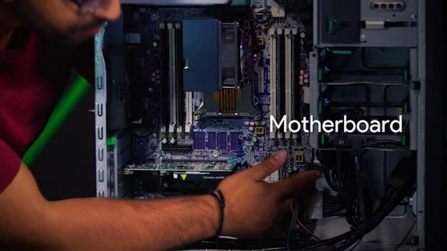

### Programs and hardware

Before we get our hands dirty with learning how to build a computer, let’s talk theory first. In an earlier lesson, we talked about binary, and how computers perform calculations. 

Remember that our computer can only communicate in binary, using ones and zeroes. Our computers speak in machine language, but we of course speak in human languages, like English, Spanish, Mandarin, Hindi. You get the idea.

If we want to communicate with our machines, we have to have some translation dictionary. Just if I wanted to say something in Spanish, I’d look it up in an English-Spanish dictionary. Well our computers have a built-in translation book. 

In this lesson, we’ll dive deeper into how our computer translates the information we give it into instructions that it understands. Right now, you’re probably using a web browser, music player, text setter or something else in your computer. We interact with these applications on a daily basis. They are referred to as Programs. 

Programs are basic instructions that tell the computer what to do. We technically store programs on durable media like hard drives. You can think of programs like cooking recipes. We get these recipes all stored together in a cook book just like apps stored in a hard drive. 

Now we want to make a ton of food. So we hire a chef to follow our recipes and whip up something good. The faster our chef works, the more food she’ll prepare. 

The chef is our CPU, she processes the recipes we send her and makes the food. Our chef works super fast, so fast that she can cook faster than she can read. So, we take copy of the recipes and put them into RAM. 

Remember that RAM is our computer’s short-term memory. It stores information in a location our CPU can access faster than it could with our hard drive. Now we can give our chef one or two recipes at a time, instead of reciting the entire cookbook to her. 

Okay, now let’s say I want to make a peanut butter and jelly sandwich. I see a pretty good recipe, and send it to our chef to make. 

Remember that our chef needs these instructions quickly, so I don’t send her the entire recipe, I send her one line at a time. 1, Get two slices of bread. 2, Put peanut butter on one slide. 3, Put jelly on another slice. 4, Combine the two slices of bread. 

Now, let me throw one more thing at you. Our chef can only communicate with us in ones and zeroes. So instead of sending something readable, like the recipe for a peanut butter and jelly sandwich, we have to send her something like this. In reality, this process is a little more complicated.

Our CPU is constantly taking instructions and executing them. These instructions are written in binary but how do they travel around the computer? In our computer, we have something called the External Data Bus or EDB. It’s nothing like a bus at all. It’s a row of wires that interconnect the parts of our computer, kind of the veins in our body.

EDB

When you send a voltage to one of the wires, we say the state of the wire is on, or represented by a 1. If there’s no voltage, then we say that the state is off, represented by a 0. This is how we send around our ones and zeroes. Sound familiar? The last lesson we talked about how transistors help us to send voltages. 

Now we know how our bits physically travel around computer. The EDB comes in different sizes, 8 bit, 16 bit, 32, even 64. Can you imagine if you had 64 wires going? You can move around a lot more data. Right now, were just going to stick with using an EDB with 8 bits in our examples. Sending 1 byte at a time. Okay so now, our CPU is receiving a byte and it needs to get to work.

Inside the CPU there are components known as Registers. They let us store the data that our CPU works with. If for example, our CPU wanted to add two numbers, one number would be stored in a register a. Another number would be stored in register b. The result of those two numbers would be stored in register c.

Imagine the register is one of our chef’s work tables. Since she has a place to work, she can start to cook. To do so she uses a translation book to translate her binary into tasks that she can perform. Let’s jump back for a second. Remember that our programs are copied into RAM for the CPU to read. RAM is memory that is randomly accessed, allowing our CPU to read from any part of RAM as quickly as any other part.

We don’t actually send data from RAM over the EDB. There would be way too much stuff. RAM can hold millions, even billions, of rows of data. Despite our sandwich example, most of our recipes aren’t simple at all. There can be thousands of lines long. We want to process them and we don’t actually go in any particular order.

Since we can only send one line of data through the EDB at the time, we need the help of another component, the Memory Controller Chip or MCC. The MCC is a bridge between the CPU and the RAM. You can think of it, a nerve in your brain connecting to your memories. The CPU talks to the MCC, and says, hey, I need the instructions for step number three of this recipe. The MCC finds the instructions for step number three in RAM, grabs the data, and sends it through the EDB.

There’s another bus. There’s nothing like a bus involved in the process called the Address bus. It connects the CPU to the MCC, and sends over the location of the data, but not the data itself. Then the MCC takes the address and looks for the data. And then data is then sent over the EDB.

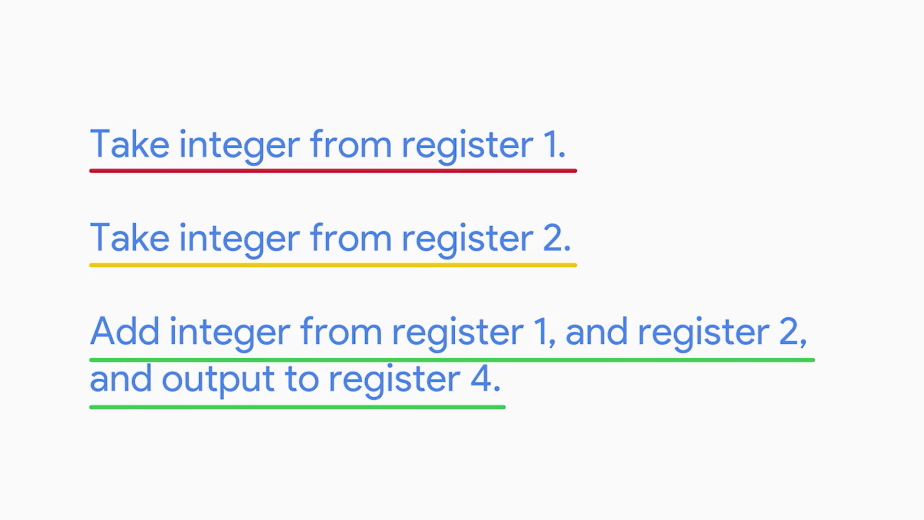

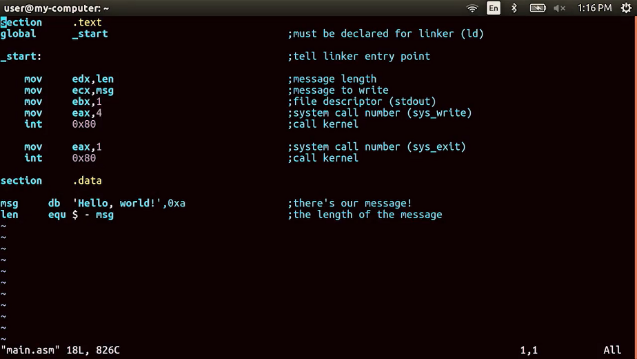

Believe it or not, RAM isn’t the fastest way we can get more data to our CPU for processing. The CPU also uses something known as Cache. Cache is smaller than RAM, but it let us store data that we use often, and let’s us quickly reference it.

Think of RAM like a refrigerator full of food. It’s easy to get into, but it takes time to get something out. On the flip side of that, Cache is like the stuff we have in our pockets. It’s used to store recently or frequently accessed data.

There are three different cache levels in a CPU, L1, L2, and L3. L1 is the smallest and fastest cache. If you’re interested in learning more about this, you can check out the supplemental reading I’ve included right after this video.

So now we understand how our RAM interacts with our CPU. But how does our CPU know when the set of instruction ends, and a new one begins.

Our CPU has an internal clock that keeps its operational in sync. It connects to a special wire called Clock wire. When you send or receive data, it sends a voltage to that clock wire to let the CPU know it can start doing calculations. 

Think of our clock wires as the ticking of a clock. For every tick, the CPU does one cycle of operations. When you send a voltage to the clock wire, it’s referred to as a clock cycle. If you have lots of data you need to process in a command. You need to run lots of clock cycles.

Have you ever seen a CPU in the store and has something labeled 3.4gHz, this number refers to the Clock speed of the CPU. Which is a maximum number of clock cycles that it can handle in a set in a certain time period. 3.40 gigahertz is 3.4 billion cycles per second. That’s super fast. But just because it can run at this speed, doesn’t mean it does. It just means that it can’t exceed this number. Still, that number doesn’t stop some people from trying.

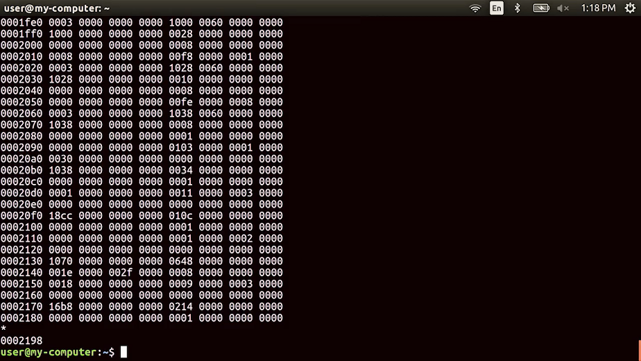

There’s a way you can exceed the number of clock cycles on your CPU on almost any device. It’s referred to as Overclocking and it increases the rate of your CPU clock cycles in order to perform more tasks. This is commonly used to increase the performance in low-end CPUs.

Let’s say you’re a gamer and you want to have better graphics and less lag while playing. You might want to overclock your CPU when you play the game, but there are cons to doing this, like potentially overheating your CPU. You can read more about overclocking in the next supplementary reading.

## Components

### CPU

If someone asked you, calculate the square root of 5,439,493, would you do the math by hand? Unless you really love tedious Math problems, you'd probably use a calculator. What about binary? Well, you probably wouldn't calculate binary by hand either. There's actually a very powerful calculator right inside of your computer that processes binary for us. We've already discussed this calculator in detail. Do you know what it is? It's our CPU, the brain of our computer.

In this video, we'll cover the more practical aspects of the CPU. Remember that transition book that I talked about in an earlier lesson? The CPU uses this to translate and perform functions on our data.

This transition book is called an instruction set, which is literally just a list of instructions that our CPU is able to run. Functions like adding, subtracting, copying data are all instructions that our CPU can carry out. Every single program on your computer, while extremely complex, is broken down into very small and simple instructions found in our instruction set. Instruction sets are hard-coded into our CPU.

So different CPU manufacturers may use different instructions sets. But they generally perform the same functions. It's like how car manufacturers build their engines differently but they all get the same job done.

You probably work with computer hardware as an I.T. support specialist, replacing failed hard disks, upgrading RAM modules, and installing video cards. So you need to be aware of what's out there.

You've probably heard of a few popular CPU manufacturers or chipsets like Intel, AMD and Qualcomm. These CPU manufacturers use different part names to differentiate their processors.

Like Intel Core i7, AMD Athlon, Snapdragon 810, Apple A8, and more. Now, when you hear these terms, you'll know what they mean. Each of these CPU manufacturers have their strengths and weaknesses.

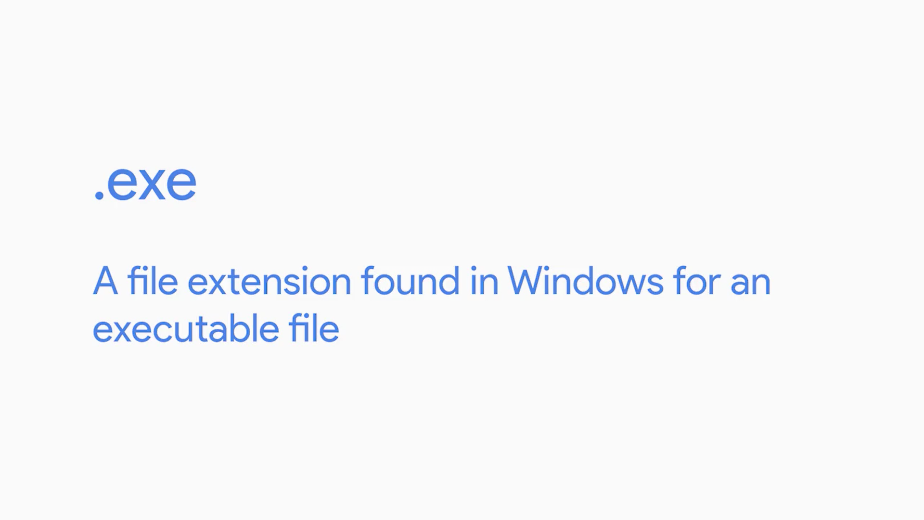

If you're interested in learning more about why some CPUs are more popular than others, you can check out the next supplemental reading.

When you select your CPU, you need to make sure it's compatible with your motherboard. The circuit board that connects all your components together.

Heads up. You can't just buy a bunch of parts and expect them to work together. There are different ways CPUs fit on motherboards using different sockets. Your CPU might have lots of tiny pins that either stick out or have contact points that look like dots. Depending on your motherboard, you need to make sure these CPUs fit correctly in the socket.

There are currently two major types of CPU sockets, Land Grid Array also known as LGA, and Pin Grid Array, also known as PGA. In an LGA socket, like this one, there are pins that stick out of the motherboard. The socket size may vary. So always make sure you CPU and socket are compatible before hand.

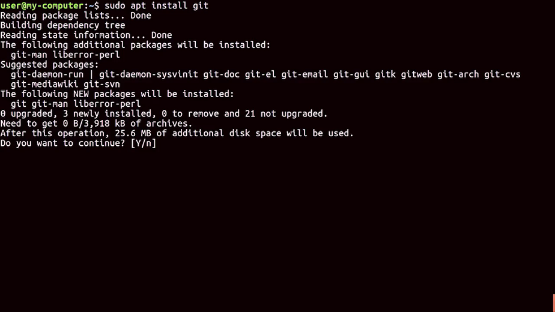

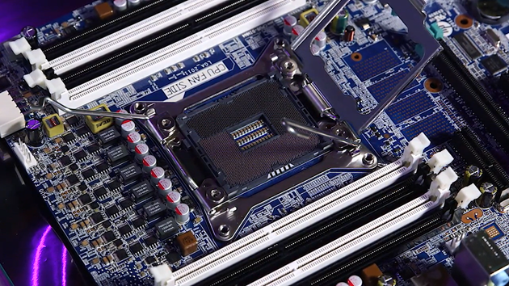

When you purchase the CPU or motherboard, they will tell you right on the box what type of socket it has. Make sure your CPU and motherboard socket also both match. If it's not listed on the box, you can go to the manufacturer's website where it usually list what types of CPUs are compatible with the motherboard. The other type of socket is the PGA socket, where the pins are located on the processor itself.

When we install our CPU, we need to do a few things to it to keep it cool. Since it does a lot of work, it's prone to overheating. We have to make sure to include a heat sink, too, which takes the heat from our CPU and dissipates it through a fan or another medium.

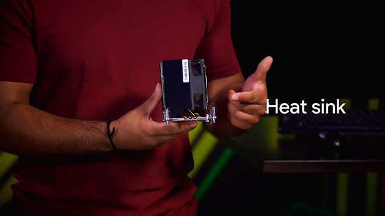

There's one last thing I want to call out about CPUs. If you purchase a CPU, you'll see that it has either a 32 bit or 64 bit architecture. What does that mean? Well, we know we can't process 8 bits in binary. Now, imagine how we can process with 32 or even 64 bits. CPUs that have 32 bit or 64 bit architecture are just specifying how much data it can efficiently handle.

You can read more about the differences between 32 bit and 64 bit architecture in the next reading. For now, the main takeaway is that the CPU is one of the most important parts of a computer. So we have to make sure it's compatible with all other components and can perform well for our computing needs.

### RAM

Let's talk about RAM, our computers' short term memory.

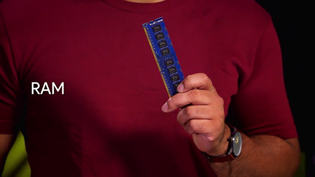

We use RAM to store data that we want to access quickly. This data changes all the time so it isn't permanent. Almost all RAM is volatile, which means that once we power off our machines, the data stored in RAM is cleared. Remember that our computer is comprised of programs.

To run a program, we need to make a copy of it in RAM so our CPU can process it. When you see a new phone or laptop that's says it has 16 gigs of RAM, that means it can run up to 16 gigs of programs, meaning you can run lots of programs at the same time.

When you type in a document, you're using RAM. If you've ever had the misfortune of working on an important presentation of paper and losing power, you know the feeling you get when all of the work you've done is lost. It's a total bummer. This happens to anything with RAM, even video games.

Have you ever gone on a long campaign without saving, then right as you get to a safe point, the power goes off on the console and all the progress you've made is lost forever? It's not fun at all. You spend the next hour or so deciding whether or not just to rage quit the game completely and start all over from scratch. Not that this happened to me or anything, that was just a friend.

Anyway, all of this happens because RAM clears its data.

There are lots of types of RAM. And the one is commonly found in computers, is DRAM or dynamic random access memory.

Where a one or zero is sent to DRAM, it source each bit in a microscopic capacitor. This is either the charge or discharge represented by one or zero. These semiconductors are put into chips that are on the RAM and store our data.

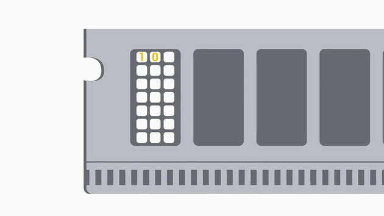

There are also different types of memory states that DRAM chips can be put on. The more modern DIMM sticks, which usually stands for Dual Inline Memory Module, have different sizes of pins on them.

I should call out, we don't really buy RAM based on the number of DRAM chips they have. They are labeled by the capacity of RAM on a stake, like an 8 gig stick of RAM. After DRAM was created, RAM manufacturers build something called SDRAM which stands for Synchronous DRAM. This type of RAM is synchronized to our systems' clock speed allowing quicker processing of data.

In today's system, we use another type of RAM, called double data rate SDRAM, or DDR SDRAM for short. Most people refer to this RAM as DDR, even shorter.

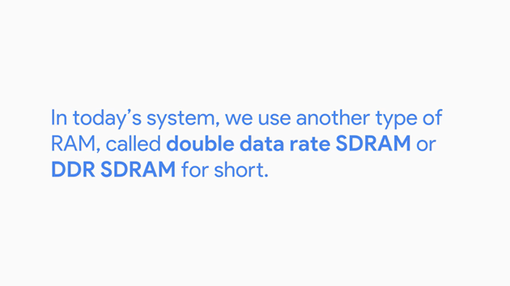

There were lots of iterations of DDR, from DDR1, DDR2, DDR3 and now, DDR4. DDR is faster, takes up less power, and has a larger capacity than earlier SDRAM versions. The latest version, DDR4, is the fastest type of short term memory currently available for your computer. And faster RAM means that programs can be run faster and that more programs can run at the same time.

Keep in mind that any RAM sticks you use need a compatible motherboard with a different number of pins aligned with the motherboard RAM slots. Just like with the CPU, make sure that your motherboard is compatible with any RAM sticks that you buy.

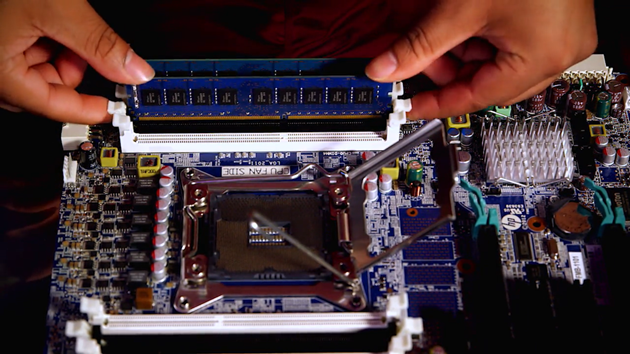

Up next, we'll take a deep dive into motherboards.

### Motherboard

The motherboard, the foundation that holds our computer together. It lets us expand our computer's functionality by adding expansion cards around its power from the power supply and it allows the different parts of the computer to communicate with each other. In short, it's a total boss.

Every motherboard has a few key characteristics. First is the chipset, which decides how components talk to each other on our machine.

The chipset on motherboards is made up of two chips. One is called the Northbridge that interconnects stuff like RAM and video cards.

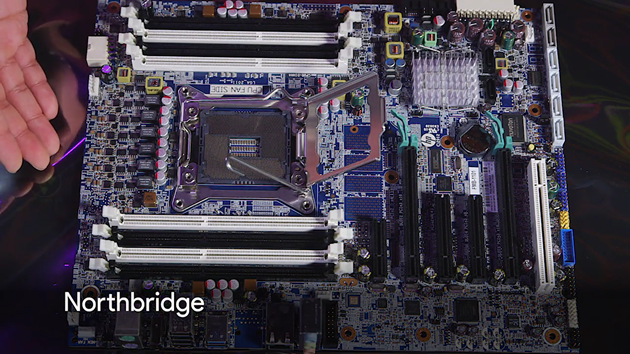

The other chip is the Southbridge which maintains our IO or input/output controllers, like hard drives and USB devices that input and output data.

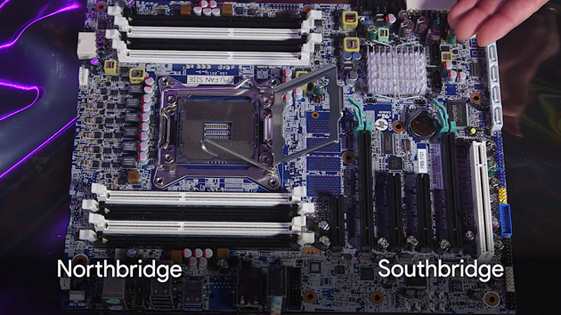

In some modern CPUs, the Northbridge has been directly integrated into the CPU so there isn't a separate Northbridge chipset. A chipset is a key component of our motherboard that allows us to manage data between our CPU, RAM, and peripherals.

Peripherals are the external devices we connect to our computer like: a mouse, keyboard, and a monitor. You'll learn more about peripherals in an upcoming lesson.

In addition to the chipsets, motherboards have another key characteristic which allows the use of expansion slots. Expansion slots also give us the ability to increase the functionality of our computer. If you want to upgrade your graphics card, you could purchase one and just install it on your motherboard through the expansion slot.

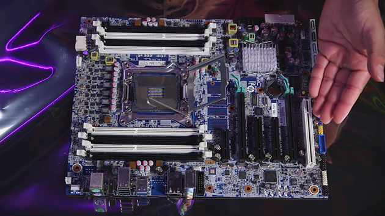

The standard for an expansion slot today is the PCI Express or Peripheral Component Interconnect Express. A PCIe bus looks like a slot on the motherboard and a PCIe base expansion card looks like a smaller circuit board.

The last component of motherboards that we'll discuss is form factor.

There are different size of motherboards that are available today. These sizes of form factors determine the amount of stuff we can put in it and the amount of space we'll have.

The most common form factor for motherboards is ATX which stands for Advanced Technology eXtended.

ATX actually comes in different sizes too. In desktops, you'll commonly see full sized ATX's. If you don't want to use an ATX form factor, you could use an ITX or Information Technology eXtended form factor.

These are much smaller than ATX boards. For example, the Intel NUC uses a variation of the ITX board which comes in three board sizes; mini-ITX, nano-ITX, and pico-ITX.

When building your computer, you will need to keep in mind what type of form factor you want. Do you want to build something small that can't handle as much workload? Or, do you want a powerhouse workstation that you can add lots of functionality to? The form factor will also play a role into what expansion slots you might want to use.

Understanding motherboards and their characteristics can be a big plus when fixing hardware issues, since things like the type of RAM module or processor socket are dependent on the kind of motherboard they need to fit into.

Let's say you're responding to a ticket for a user who is having video problems, you don't want to make it all the way to their desk only to realize the graphics card due board as a replacement doesn't fit the motherboard their computer uses.

You'll learn more about customer service and troubleshooting tactics later on in this course. But for now, make sure that your motherboard can fit any replacement or upgrade that you want to implement.

### Storage

So, before we get into computer storage, we need to fill in some gaps. I'm referring to things like gigabytes, bits, etc. But we actually haven't talked at all about what those metrics mean. Sorry, I kind of get a bit ahead of myself.

As you might have guessed, these terms refer to data sizes. The smallest unit of a data storage is a bit. A bit can store one binary digit, so it can store a one or zero. The next largest unit of storage is called a byte, which is comprised of 8 bits. A single byte can hold a letter, number or symbol.

The next largest unit is refer to as kibibyte, but we typically use the term kilobyte. A kilobyte is made up of 1,024 bytes. If you're curious why 1 kilobyte refers to as 1,024 bytes and not 1,000 bytes, you can read more about that in the next supplemental reading.

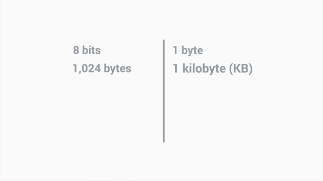

For now, here's a quick data conversion chart.

How much does 500 gigabytes even mean? Let's take a look at the size of an average music file, which is about three megabytes. On a 500 gigabyte machine, that's approximately 165,000 music files. That's a lot of music. We store all of our computer's data on our hard drive, which allows us to store our programs, music, pictures, etc.

Have you ever had an issue with your computer and lost all the data that was on your hard drive? Yeah, me too, it was the worst. This actually happens a lot and you'll probably encounter it as an IT support specialist. Make sure you backup your data to be safe. This means you should copy or save your data somewhere else, just in case something goes wrong and your hard drive crashes. That way, you won't lose all your data.

There are two basic hard drive types used today. Hard disk drives, or HDDs, use a spinning platter and a mechanical arm to read and write information. The speed that the platter rotate allows you to read and write data faster. This is commonly referred to as RPM, or revolution per minute.

A hard drive with a higher RPM is faster, so if you go out and buy a hard drive today, you might see something like a 500 gigabyte with 5400 RPM.

HDDs are prone to a lot more damage because there are a lot of moving parts. This susceptibility to damage went away with a new type of storage called solid state drive, or SSD. SSDs have no moving parts. Are you familiar with a USB stick? SSDs are created in a similar way. The information is stored on microchips and data travels a lot faster than HDDs. The form factor for SSDs is also slimmer compared to their HDD cousins.

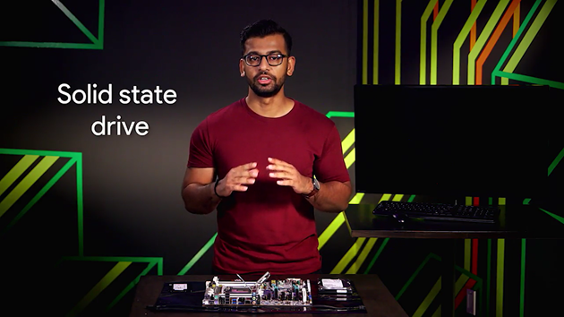

Sounds great, doesn't it? So why doesn't everyone use SSDs? Well, both have their pros and cons. HDDs are more affordable, but they're more prone to damage. SSDs are less risky when it comes to losing data, but they're also more expensive. So you may not buy as much memory storage in SSDs than what you can get in HDDs.

Believe it or not, there are even hybrid SSD and HDD drives out there. They offer SSD performance where you need it. For things like system performance, such as booting your computer, along with hard disk drives for less important stuff, like basic file storage.

There are a few interfaces that hard drives use to connect to our system. ATA interfaces are the most common ones.

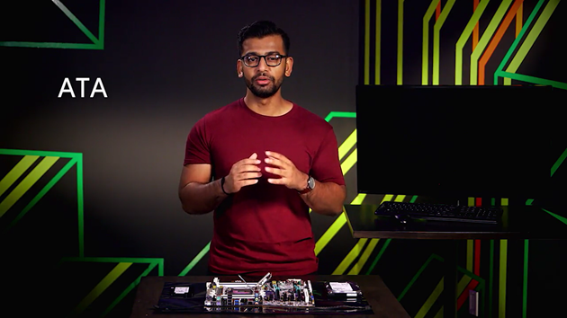

The most popular ATA drive is a serial ATA, or SATA, which uses one cable for data transfers. SATA drives are hot swappable.

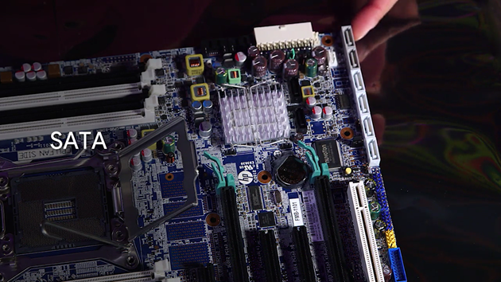

Great term, don't you think? It means you don't have to turn off your machine to plug in a SATA drive. SATA drives move data faster and use a more efficient cable, like this one, than it's predecessors. SATA has been the de facto interface for HDDs today.

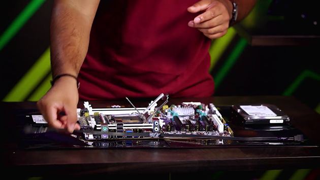

But people quickly found that using a SATA cable wasn't good enough for some of the blazing fast SSDs that were coming on the market.

The interface couldn't keep up with speed of the newest SSDs. So another interface standard was created called NVM Express, or NVMe.

Instead of using a cable to connect your drive to your machine, the drive was added as an expansion slot, which allows for greater throughput of data and increased efficiency.

### Power supplies

In order to get our computer to work, let's give it some power. Computers have a power supply that converts electricity from your volt to something usable. There are two types of electricity, DC, or direct current, which flows in one direction and AC, or alternating current, which changes directions constantly.

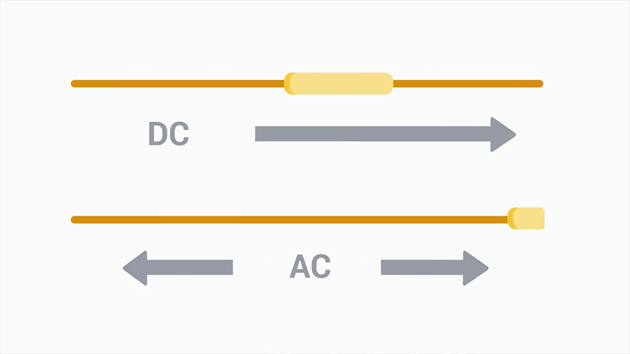

Our computers use DC voltage, so we have to have a way to convert the AC voltage from our power company to something we can use.

That's what our power supply does. It converts the AC we get from the wall into low voltage DC power that we can use and transmit throughout our computer. So let's talk about power supplies. I actually have one right here. Let me show you how one looks like. Let me take it out right here.

So most power supply units have a fan, which is right in here. They also has voltage information just normally listed underneath or on the side, and cables, like this one, to power your motherboard, and, A power cable.

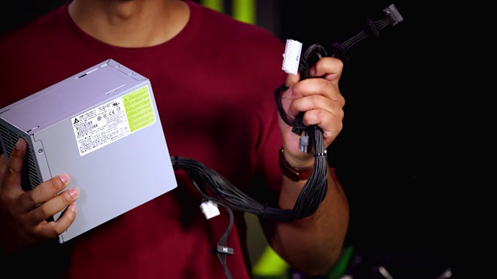

Have you ever plugged one of your devices into the wall outlet and fried your device? If you haven't, you're really lucky. After completing this lesson, hopefully you will know how to avoid that situation.

To understand electricity, we must use the example of water pipes. Our sinks have a faucet that's connected to a pressurized water tank. When we turn on the faucet, water comes out. This is sort of like how electricity works. When we plug an appliance into a wall outlet and turn it on, a flow of electricity comes out. If we added more pressure to our water tank, would more water come out of it? The higher the pressure, the more water there will be.

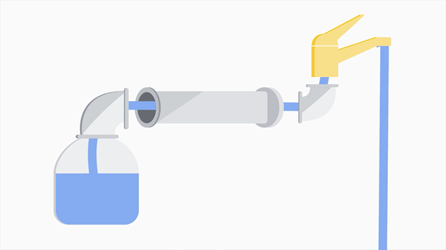

When it comes to electricity, we refer to the pressure as voltage. So when I was on vacation, to my surprise, when I plugged in that 120 volt appliance into a 220 volt outlet, the power came busting through and fried my charger. If it was the other way around, and a 220 volt appliance was plugged into a 120 volt outlet, I wouldn't have seen the same outcome.

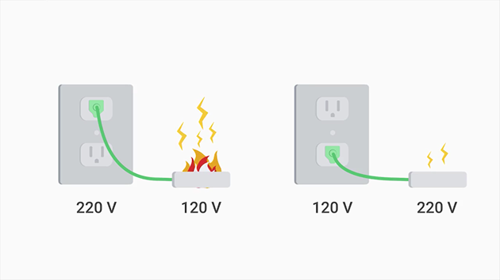

I'll still be able to get electricity, but slowly. This would be similar to if a water tank whose only half pressurized, it will drew water, but slowly. In some cases though, this can deteriorate the performance of the device and cause damage in the long term.

As a general rule, be sure to use the proper voltage for your electronics. We refer to the amount of electricity coming out as current or amperage, and it's measured in amps. We can think of amps as pulling electricity, as opposed to voltage, which pushes electricity. Amps will pull as much electricity needed, but voltage will just give you everything.

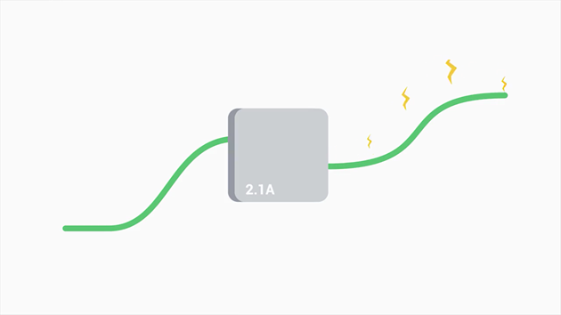

Look on the back of the one of your device charges, you might see something like 1 or 2.1a. Charging a device with 2.1 amps will actually charge a device faster because it's able to put current from a 2.1 amp than a 1 amp charger.

Finally, the other important part of the electricity that you will need to know is the wattage. Wattage is the amount of volts and amps that a device needs.

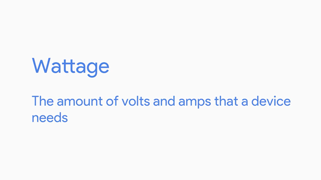

If your power supply has too low of a wattage, you won't be able to power your computer, so make sure you have enough. This doesn't mean that if you have a large power supply, you'll overpower your computer. Power supplies just give you the amount that your system needs.

It's best to error on the side of large power supplies. You can power most basic desktops with a 500 watt power supply, but if you're doing something more demanding on your computer, like playing a high-resolution video game or doing a lot of video production and rendering, you'll likely need a bigger power supply for your computer.

On the other hand, if all you're doing is just browsing the Web, the power supply that comes with your computer should be fine. All kinds of issues are caused by a bad power supply. Sometimes the computer doesn't even turn on at all. Since power supplies can fail for lots of reasons like burnouts, power surges, or even lightning strikes, knowing how to diagnose power issues and replace a failed power supply is a skill every IT support specialist should have in their toolbox.

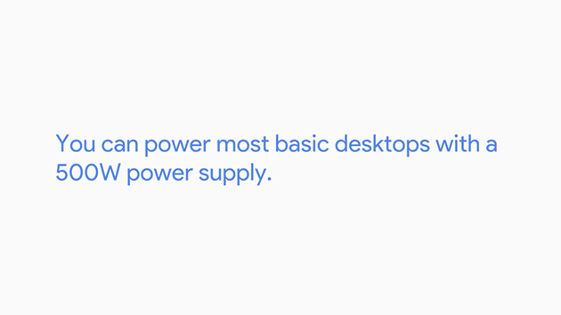

### Peripherals

So, let's take a look at the back of our computer again. Here, you'll see lots of connectors or ports. We can plug in different objects like a mouse, keyboard, and a monitor. These are known as peripherals.

A peripheral is basically anything that you connect to your computer externally that adds functionality. You probably used USB devices before. USB, also known as Universal Serial Bus devices are the most popular connections for our gadgets.

USB has gone through lots of changes since inception. You most commonly encounter USB 2.0, USB 3.0, and 3.1 in today's system. Here's a quick rundown of the different versions. USB 2.0 transfers speeds of 480 megabytes per second, USB 3.0 transfers speeds of five gigabytes per second, USB 3.1 transfers speeds of 10 gigabytes per second.

In the chart, let's pay attention to the details. Using capital M lowercase b forward slash s instead of using capital M capital B to reference transfer speed. These are actually different units. MB is megabyte or unit of data storage, while capital M lower case b forward slash s is a megabit per second, which is a unit of data transfer rate.

People often mistake speeds of 40 megabit per second to mean that you can transfer 40 megabytes of data per second. Remember, that one byte is 8 bits, so to transfer a one megabyte file in a second you need an 8 megabits per second connection speed.

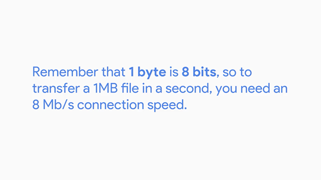

So, to transfer 40 megabytes of data in a second, you need a transfer speed of 240 megabits per second.

You'll also need comparable USB ports to go with your devices. If you connect a USB 2.0 device into a USB 3.0 port, you won't get 3.0 transfer speeds. But you can still use the port since it's backward compatible, meaning older hardware work with newer hardware.

The ports are easy to differentiate. Let me show you. In general, USB 2.0 are black and USB 3.0 are blue and 3.1 ports are teal. This may change depending on manufacturers.

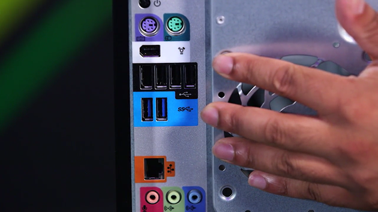

There are lots of types of USB connectors, and you can read about all of them in the supplemental reading right after this video. Check it out.

Back to USB connectors. The most recent one is the type C connector which is meant to replace many peripheral connections. It's quickly becoming a universal standard for display and data transfer. In addition to USB peripherals, you should also be aware of display peripherals.

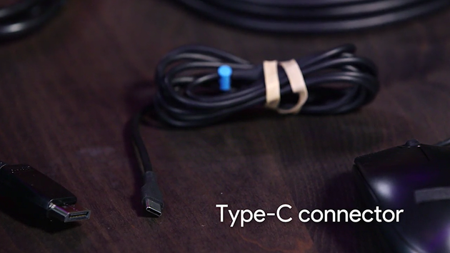

There are some common inputs standards to know. Most computer monitors will have one or more of these connections, but you might encounter some older standards too. DVI. DVI cables generally just output video. If you need to hook up a monitor or projector for a slide presentation and you want audio too, you may be out of luck. Instead, you want to look at one of the following cables.

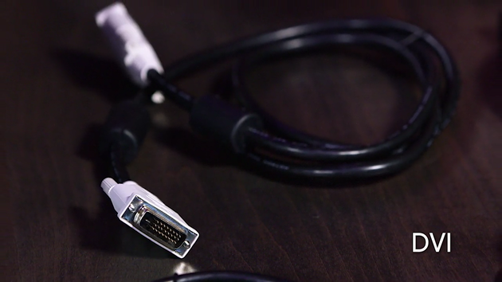

HDMI. This has become a standard in lots of televisions and computers nowadays and outputs both video and audio.

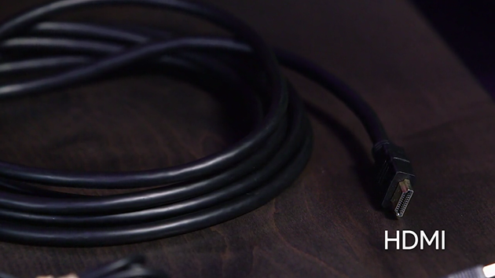

Another standard that's become popular among manufacturers is a displayPort which also outputs audio and video.

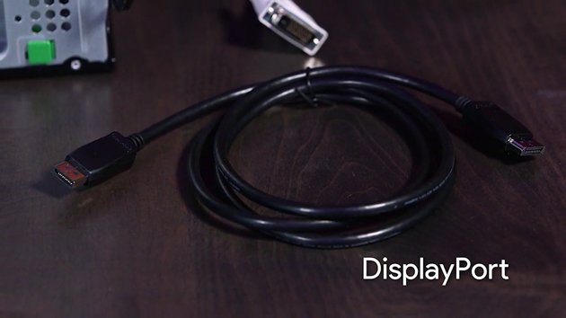

In addition to audio and video, USB type C can also do data transfer and power.

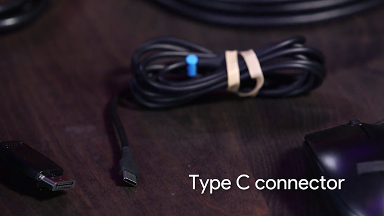

As an IT support specialist, you'll work with peripherals like USB devices and display devices a lot. Now, you'll be able to distinguish between the major types. In the next lesson, we're going to learn how our computer initializes all of the hardware we talked about.

## Starting it up

### BIOS

Okay, now we've seen all the key components to get our computer running. The last thing we'll go over is how our devices talk to each other.

We know how programs execute from our hard drive to our CPU, but how do other things like a mouse click or a keyboard press get sent to our CPU for processing? These are fairly basic devices, they don't contain any instructions that our CPU knows how to read.

If you just clicked on the key from your keyboard, you'd only be sending a byte to the CPU. The CPU doesn't know what this is, because it doesn't have instructions on how to deal with it. Turns out our devices also use programs to tell the CPU how to run them. These programs are called services or drivers.

The drivers contain the instructions our CPU needs to understand external devices like keyboards, webcams, printers. Our CPU doesn't know that there is a device that it can talk to, so it has to connect to something called the BIOS, or basic input output services.

The BIOS is software that helps initialize the hardware in our computer and gets our operating system up and running.

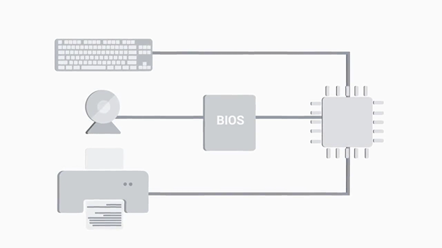

Unlike the programs, you're probably used to running a web browser or operating system.

The BIOS isn't stored on a hard drive. Our motherboard stores the BIOS in a special type of memory called, the read-only memory chip, or ROM chip.

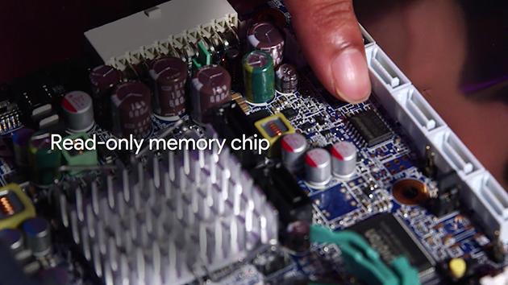

Unlike RAM, ROM is non-volatile, meaning it won't erase the data if the computer is turned off. Once the operating system loads, we're able to load drivers from non-essential devices, directly from the hard drive. In today's system, there is another player for BIOS called UEFI, which stands for Unified Extensible Firmware Interface.

UEFI performs the same function of starting your computer as a traditional BIOS. But it's more modern and has better compatibility and support for newer hardware. Most hardware out there today comes with UEFI built in. Eventually, UEFI will become the predominant BIOS.

When you turn on a computer, you might notice a beeping from time to time. How computers run a test to make sure all the hardware is working correctly. This is called a Power On Self Test or POST. And then BIOS runs it when you boot up your computer.

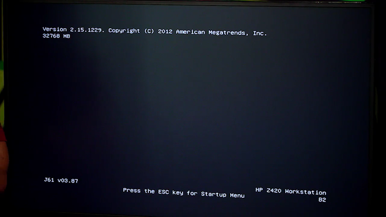

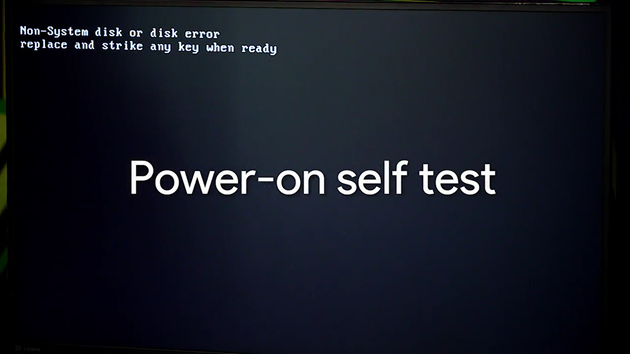

The POST figures out what hardware is on the computer. So it happens before the BIOS initializes any hardware or loads up essential drivers. If there is an issue with anything at that point, there is no way to display it on the screen, since things like the video driver haven't been loaded. Instead, the computer can usually produce a series of beeps, almost like Morse code, which will help identify the problem. Different manufacturers have different beep codes. So, if your computer successfully boots up, you may hear a single beep. If you hear two beeps, it could mean a POST error. It's best to refer to your motherboard manual to find out what each code means. Also, you should know that not all machines have built-in speakers, so don't worry if your computer boots without a beep. If it does have a built-in speaker, being able to distinguish what the beep codes mean is an extremely helpful tool when troubleshooting boot issues. One last thing, we will discuss are BIOS settings.

There is a special chip on our motherboard called the CMOS chip. It stores basic data about booting your computer like the date, time and how you wanted to start up. You can change these settings by booting into CMOS or BIOS setting menu.

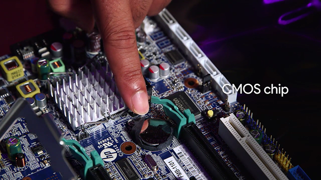

It varies in different computers, but usually when you boot the computer, there will be a quick screen that tells you what button to push to get into the settings. From there, you can change the basic BIOS settings of your machine.

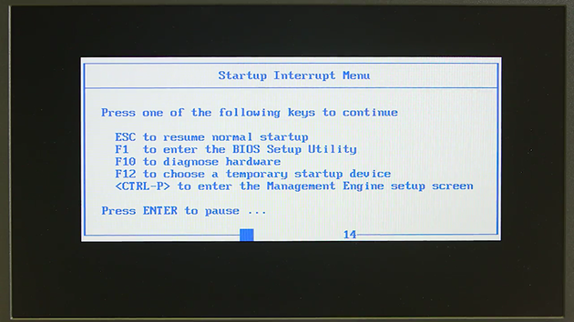

As an IT support role, you might interact with the BIOS more often than you think. BIOS settings control which devices to boot to and in an IT role, you might need to change the settings more often than not. A frequently performed IT task is the reimaging of a computer. The term refers to a disk image which is a copy of an operating system.

So the process of reimaging involves wiping and reinstalling an operating system. This procedure is typically performed using a program that's stored on some external device like a USB memory stick, or a CD ROM, or even a server accessible through the network.

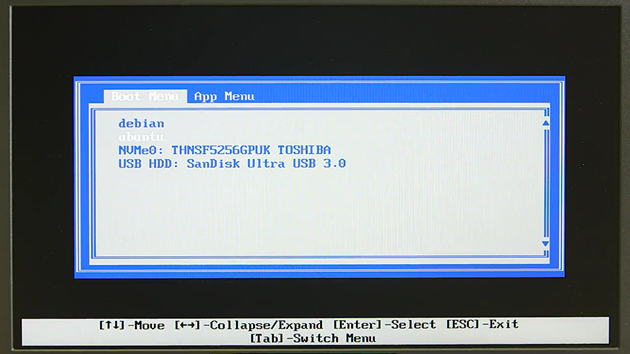

To access these programs and perform the reimage, you'll need to use the BIOS to tell the computer to boot up from that external device.

### Putting all together

Putting all together Now that we've learned what the computer components are and how they work we're going to assemble our very own computer, a full size desktop.

Computers are incredibly fundamental to the work of an IT support specialist. There used in pretty much every aspect of the job. Aside from work, knowing how to build a computer might inspire you to try all kinds of cool stuff. You could custom build a gaming rig to play the most advanced game at the highest setting or like me make a home media server for all you photos and videos. Knowing how to build a computer is a skill that can be useful in lots of interesting ways.

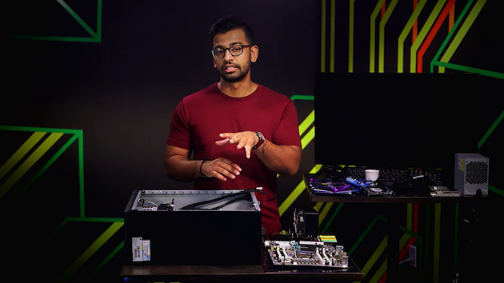

Before we get started, let's lay down some ground rules for this ground up build, sorry, I cannot help myself. We should think about electrostatic discharge and try to prevent unwanted static from harming our very expensive components.

Have you ever rubbed yourself socks on a carpet and then accidentally zap someone? That's pretty harmless, but if you that to your new motherboard, you completely destroy it.

So how do we prevent static discharge? We can go about this in two ways, we can touch in our two device that's plugged in but not powered on. FYI, you should do this every couple of minutes when assembling a new computer.

Another option is to wear an anti-static wristband like the one I have here, let me get it. You connect the end of the clip to a non-painted metal surface like your computer. And then you separate on to your hands and voila your done.

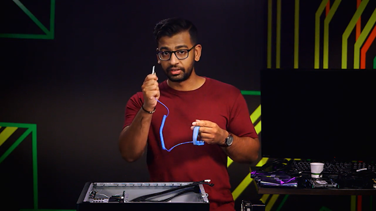

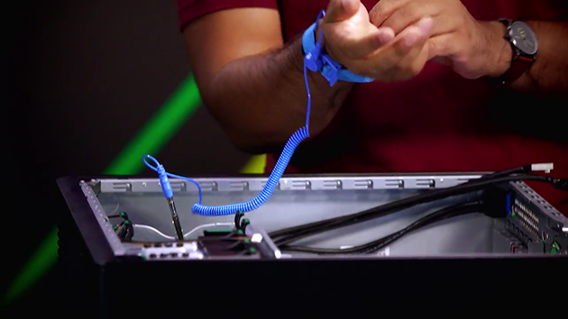

While we are on the subject of anti-static safety, I want to call out that when you buy computer parts, they'll come in anti-static bags to prevent accidental static electricity. Be sure to keep them inside the bags until you need to install them on your computer.

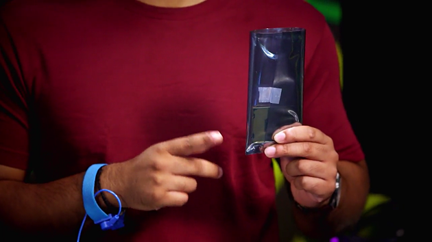

Now, let's get making this computer, we'll start by laying down the foundation of our computer, the motherboard.

Remember, there are lots of different form factors for motherboards and you want to make sure the one you purchase fits your computer case. We purchased the full size desktop cased and have a full size ATX motherboard.

On the motherboard there are a lot of screw holes which coincide with the holes in the desktop case too. You want to match up the holes on the motherboard to the holes on the desktop.

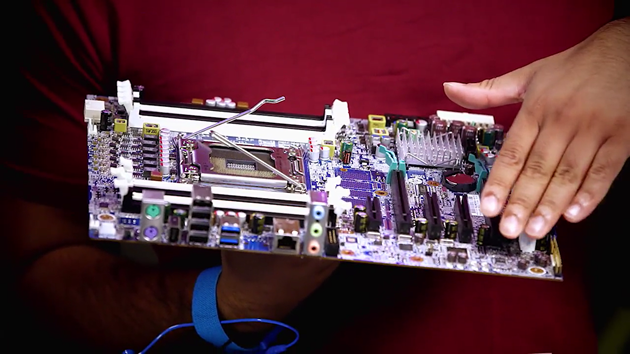

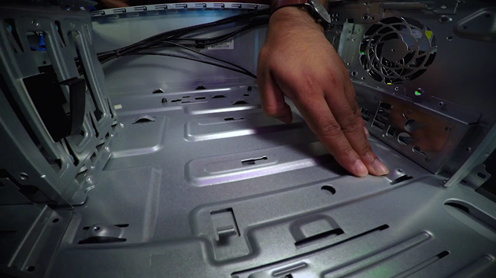

Once you figure out which holes to use screw in standoffs. Standoffs are used to raise and attach your motherboard to the case. In this instance our case has built in standoffs.

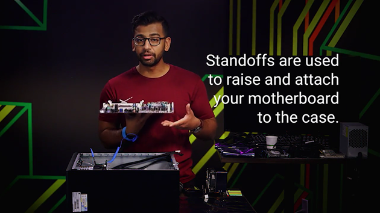

Let's start adding on components. Let's start by adding our components in.

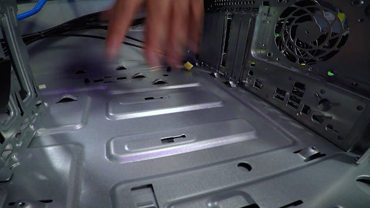

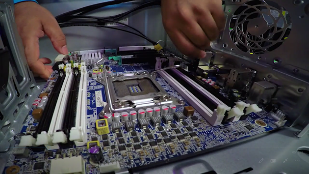

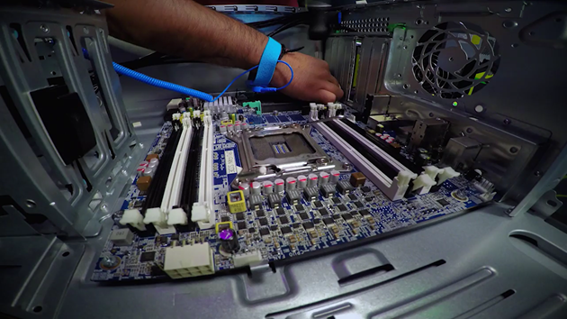

We'll start with the CPU, so let's take that out of our anti-static bag. You want to be very careful with these because they're very expensive, and you don't want to drop them.

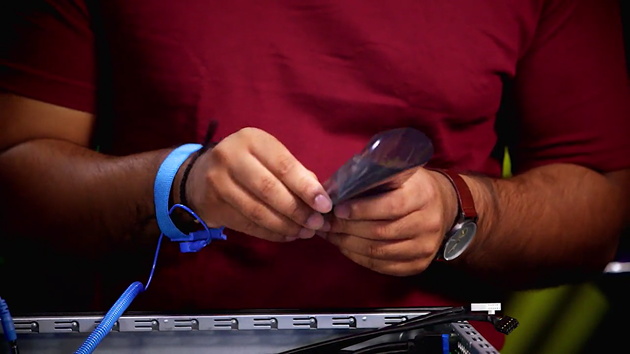

Once we've taken out the bag, let's line up the CPU with the motherboard's socket. Something to note is this marker right here. This has to align with the CPU socket on the motherboard.

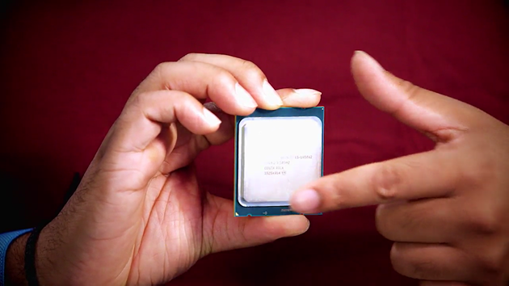

Also don't forget to make sure you get compatible CPU that fit your motherboard. We have a LGA CPU and an LGA-compatible motherboard socket. So let's go ahead and align the correct orientation of the CPU and secure it in place like this. So like mentioned before, you want to make sure that the pointers on the CPU and the socket are aligned. The easy part is putting the CPU in. The fun part is securing this, just note that when you secure the CPU in the socket you do need to use a bit of force so it's tightly secured in.

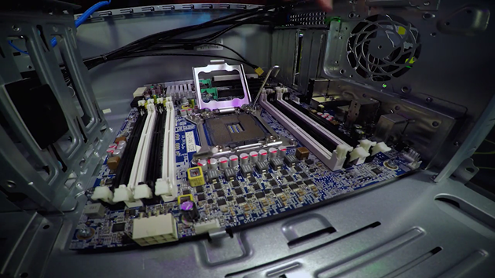

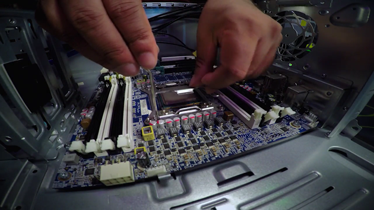

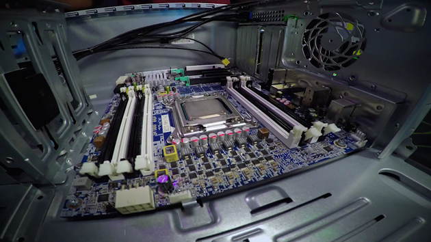

Perfect, so now the CPU is secured in the socket. Now that our CPU is in place we need to add our heat sink on top of it. The heat sink is used to dissipate heat from our CPU.

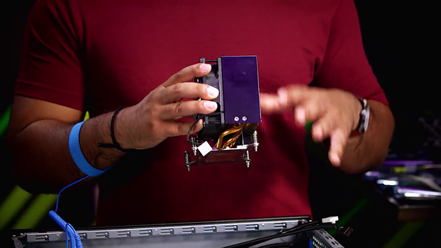

I want to show you some cool things. This part right here, this is what our CPU relies on to stay cool. It takes the heat from there and then uses this fan to blow it out.

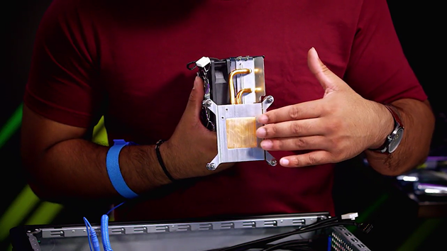

Before we attach the heat sink, we need to apply an even amount of thermal paste. Let me get that, this is the thermal paste. Thermal paste is used to better connect our CPU and heat sink. So the heat transfers from to the other better.

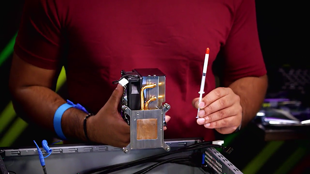

To get started, apply a dab of thermal paste and spread evenly with a flat object. Lets do that on our CPU right here. So first thing that you want to do is slowly apply a slight dab on the CPU like so. Then with the flat object, apply the thermal paste evenly throughout your CPU to go half way right here, half way right here, Half way right here, and then half way right here. Just make sure that it spread evenly throughout the CPU.

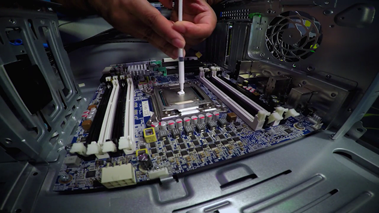

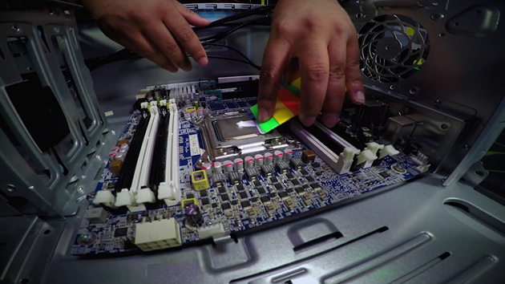

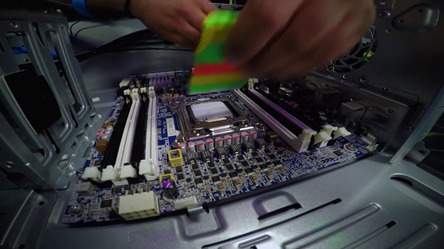

You may have to do this multiple times to get this correct. Okay, so once you have that in place, you're going to take your heat sink and then you're going to press it against the CPU. And something to note is that these screws right here, they align with the CPU socket.

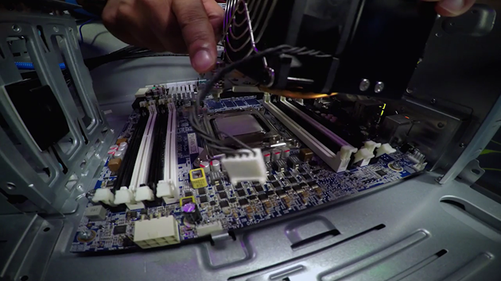

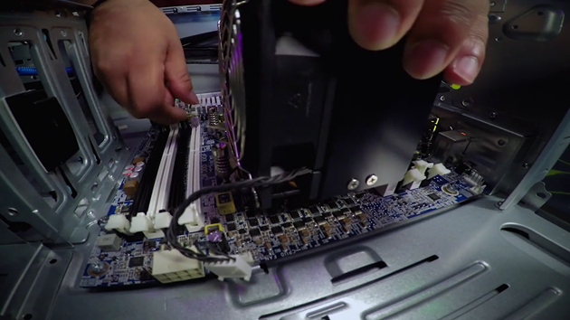

So that can guide you while you put the heat sink on. Great, once you have all four sockets aligned, go ahead and get your screw driver and then tighten down the sockets.

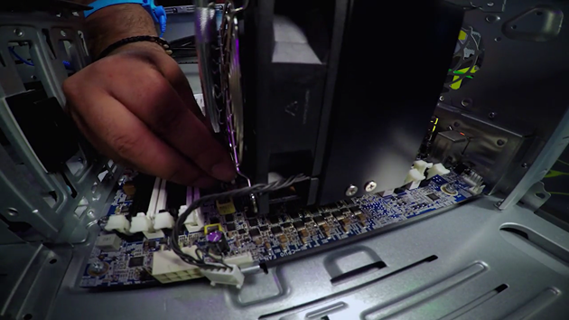

So one thing to do, is to make sure that you screw the opposite sides first so you know that the heat sink is attached securely. So one thing I like to do again is just kind of go over my screws to make sure everything is tightened securely. Great, now that our screws are tightly on in our heat sink secured to the CPU You have to plug this Molex to the motherboard. This is important because this is what controls the fan speed via the motherboard.

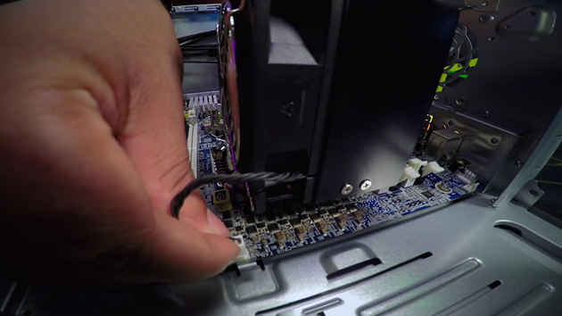

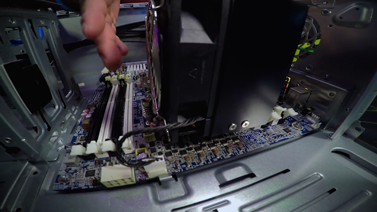

Perfect. So now, you've fully installed and connected your CPU to the motherboard. Next, let's install our RAM. Located DIMM slots on your motherboard. So, these are the DIMM slots like we discussed before. I have four slots available here and I have four RAM sticks. Let me pick those up.

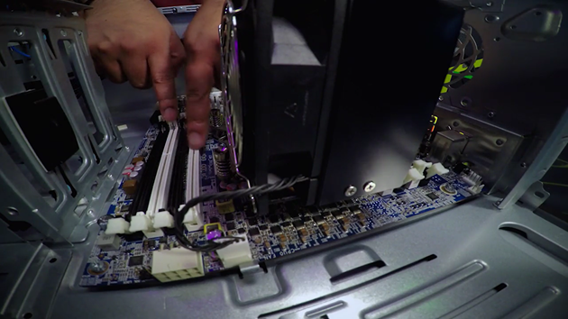

These are my RAM sticks, and of course, they're in my anti-static bag Let's take them out. So, as I mentioned before, this build, we're going to use DDR3 RAM. All right, one thing I like to do before I install my RAM is to make sure that I align these slots with my RAM slots so that way I'm not going to be forcing those in when it's time to install.

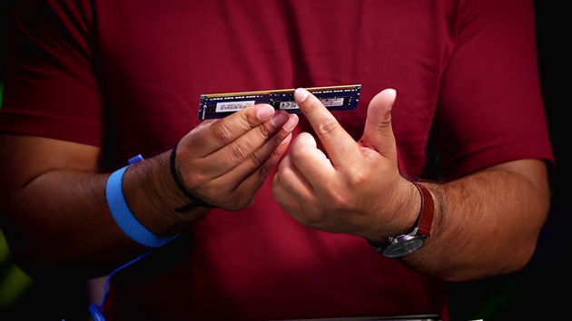

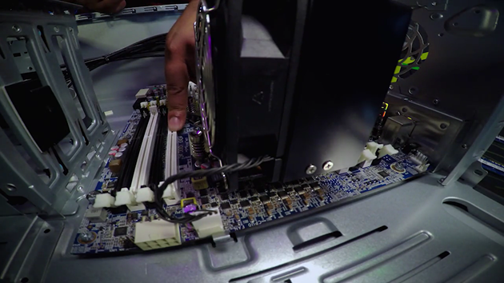

So, if you see right here, your slots are right in the middle so something I do is before I put it in, just visually make sure that you got this right and then align the rest of your RAM sticks to the same position like this. You just want to go like this. Like this. And like this. That way, you're not going to be damaging your pins if you pick your RAM sticks up and accidentally force it in.

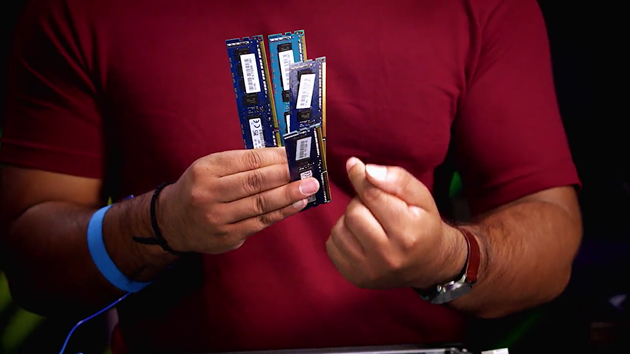

So now we've got that, we're going to put this in this slot right here. Line up the pins correctly and push in the RAM until you hear it click. You'll know it's secure when both sides of the RAMs are locked in place. And there's something else you should know. Your slots right here, they are both black and white. We're going to stick to using the white slots.

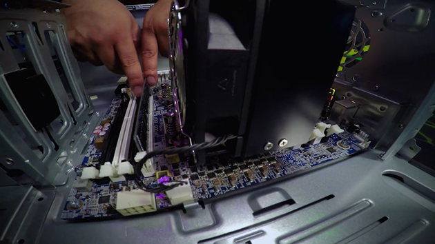

This too. And we're also going to put this one right here. There you go. You've securely fastened your RAM inside your motherboard.

Next, we have our hard drive. In this example, we're using an SSD SATA hard drive instead of a HDD. We just need to use one SATA cable to connect it to our motherboard.

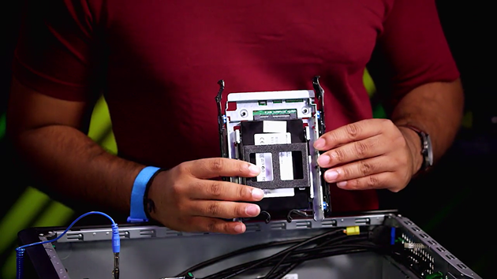

So, first, I'm going to go ahead and slot this in this cage This is going to vary from case to case, but this one's going to be easy.

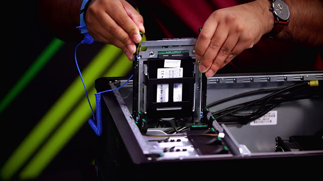

All we have to, we just slide it in like so. And normally you will hear a click, \[SOUND\] Like that.

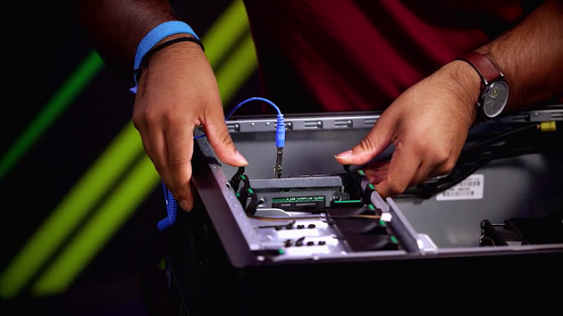

Once that's in, we just need to use one SATA cable to connect our SSD to our motherboard. Let me go and get that. So here we go. Here's a SATA cable.

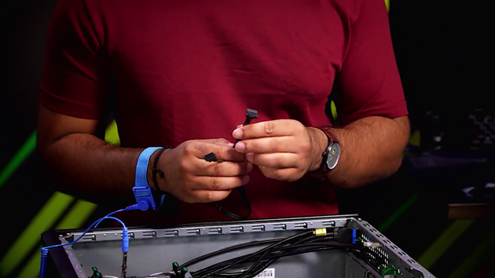

So what I'm going to do, is I'm going to connect this end to our SSD. I'm going to connect this end to our motherboard. There we go, it's in.

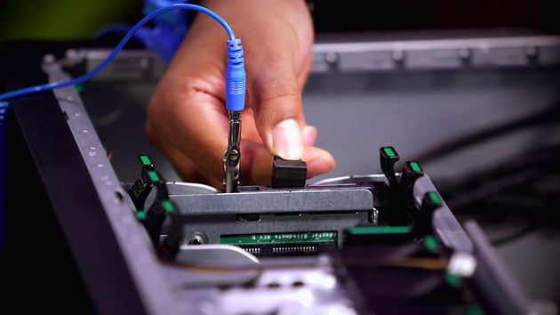

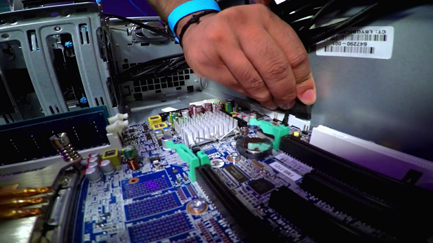

Remember, SATA cables can only go in one way. So now that we have our SSD installed, let's go ahead and install our case fan. And this is how this looks like. One thing to note is the small x.

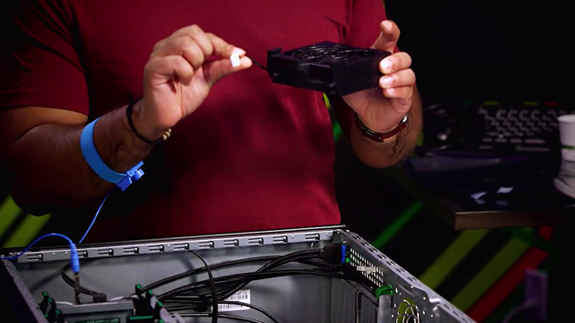

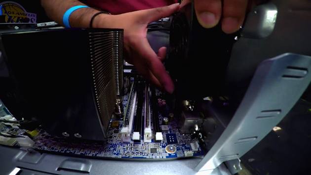

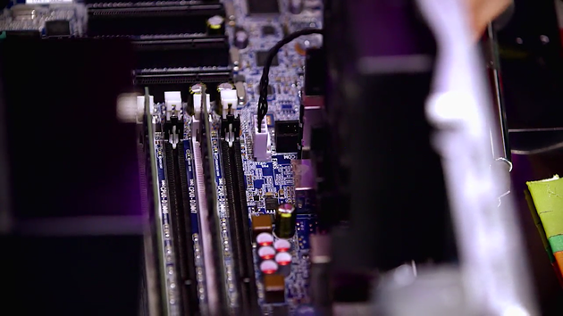

You're going to go ahead and find a label on your motherboard that says, rear fans. Not all motherboards have this, but in this example, we do have that, so just to note. We get those into the grooves, there you go. My fan's installed, and now I'm going to go ahead and attach this to the Molex. There we go, now my fan is attached to my motherboard.

For best practice, you want to create a wind tunnel that takes in air, blows it over your components, and then pushes it all out back. Check out how our heat sink has a fan on it too. That's pretty normal, since our CPU generates a lot of heat, and we want to help cool it off as best as we can.

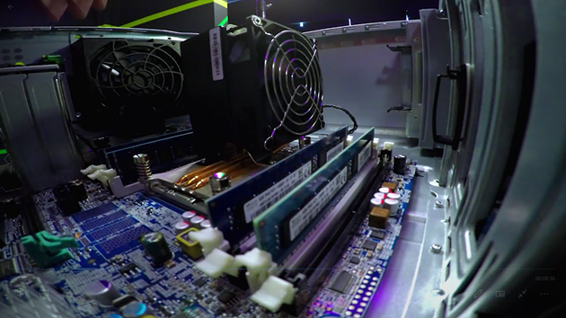

We're almost done. Now, we're going to connect our power and test to see if everything's working. So let's grab our power supply. Here we are.

First, let's secure our power supply to our case. Be careful not to damage the motherboard when you install it.

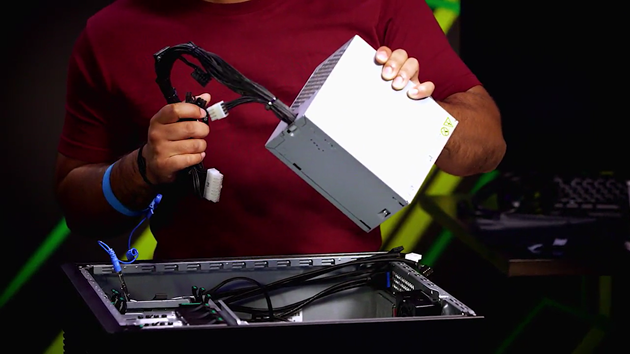

What you're going to do is you're going to put this in slowly like that, And then just slide it in. There you go. One thing I like to do, is I'd like to put my cables all the way out to the side, so like I mentioned before, it's not going to go ahead and damage the motherboard.

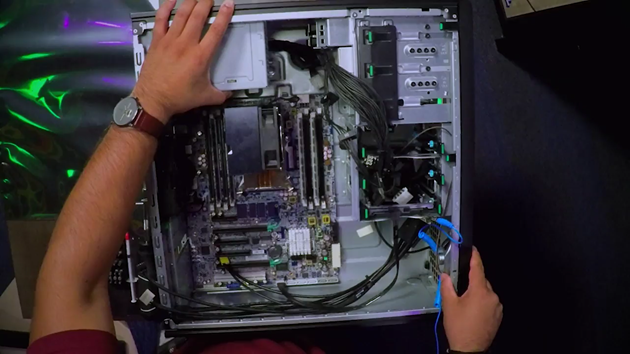

So now, I'm going to go ahead and start securing our power supply. Its always fun getting in. There we go So as you can see, I normally like to go and start with my fingers, so it's easier to get in. And once I put all my screws in, I'm going to go ahead and use my screw driver and fasten it, tighten that.

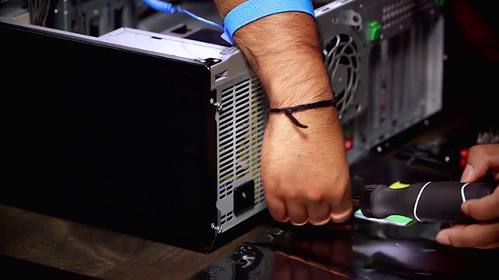

There you go. So let's go ahead and tighten our screws right here. \[INAUDIBLE\] And four. Great. So now, we've secured our power supply to the case so it's not going to move anywhere. And just another note, you can also install the power supply before adding it to the motherboard, depending on how your case is laid out.

Lets go back to our mess of connectors. There are a few things I would like to highlight. This big one right here, this is the one that powers our motherboard.

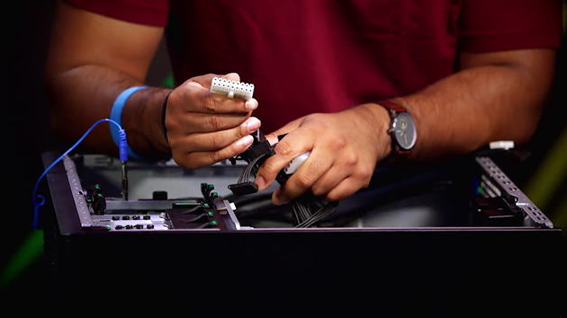

Another one that we have, it's more of a legacy one is this four pin Molex.

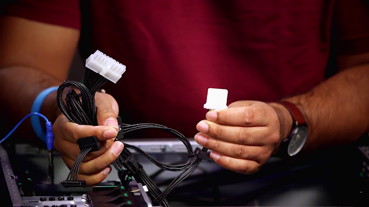

These connectors were used heavily before SATA came out.

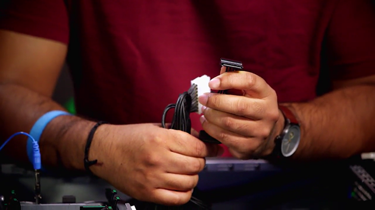

Now, we use these connectors to power majority of the SATA devices today. Most modern machines today will probably use SATA power connectors for your hard drives so that it may come with Molex to SATA adapters.

Now, it's time for the fun part. First, let's go ahead and connect our power supply to our motherboard. So that's this big pin as we discussed earlier. It's going to go in right here. And plug that in like so.

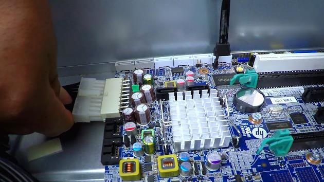

Next, we're going to go ahead and power the CPU, with this A pin Molex right here. It's \[INAUDIBLE\] pretty tight, but you should be able to get it in. There you go.

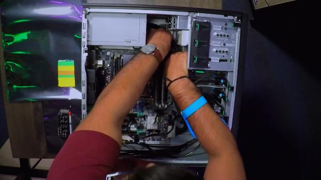

So what we just did was we have the power supply that is powering the motherboard and the CPU. So now that we've hooked up the cable to our CPU and motherboard

The next thing that we need to hook up are these cables that are sitting in our case. This is going to vary from case to case, but let's go through it. Some of these cables are used for your case's buttons and lights.

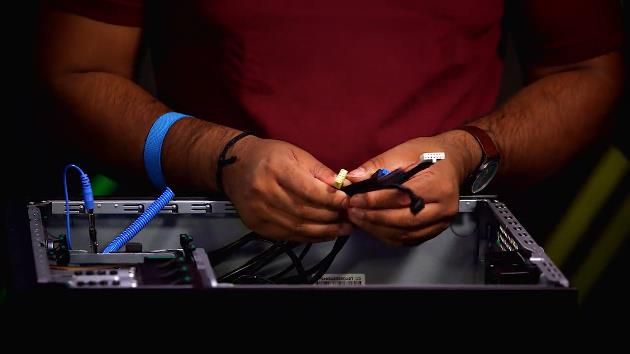

So for this one, I'm going to plug these in.

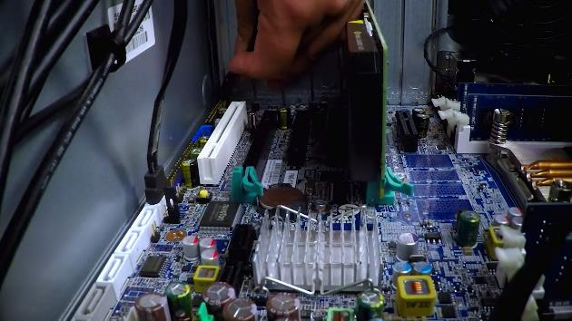

Okay. Okay, so our case cables are now secured to our motherboard. One good idea is sometimes your motherboard will come with some guides. This will help you fasten your cables to your motherboard so it's clean and tight on your case. I'm just going to go ahead and do that right here.

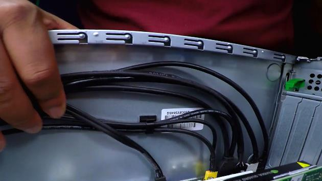

Now that we have our cables securely fastened to our case, let's don't forget one more thing, our graphics card. We'll need that so that we can upload video to our monitor. We're going to plug this graphics card into our PCI-Express slot on our motherboard.

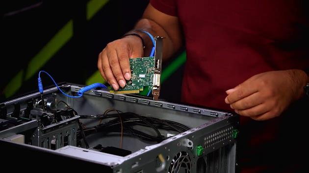

Just like the RAM, you are going to put a little bit of pressure when you insert this in. So don't feel bad by putting a little bit of pressure and you'll hear a click like this. Once you've done it, you can tightly secure it to your case. This is going to vary from case to case. And there you go, your graphics card has been installed.

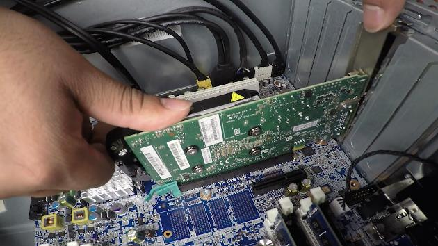

All right, I think that's it.

Let's cover up our computer. First make sure you take your anti-static brace right away. Get our case. Put that in like so, and just plug, and that's it.

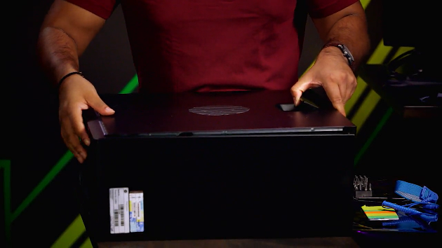

There you go, we finally built our machine. Last but not least, let's connect our monitor, keyboard, and mouse to the desktop. So first, let's get our keyboard. What we're going to do is we're going to connect this USB to the USB port on our desktop. Then we'll going to get our mouse, do the same thing. Connect this to our USB port. And then finally we're going to go ahead and connect our monitor. For this monitor, we're going to go ahead and use a display port cable. I want to connect one end to our desktop, like so. Next, I want to plug this into my monitor.

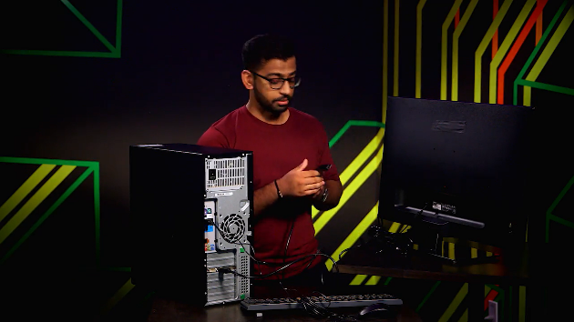

All right, this is the most interesting part. Let's see if all this works. So I'm going to power it on. I got a blue light, which is good. And of course it's going to vary from system to system. Let's see if something shows up on the monitor. So computer is booting up. Let's see, okay it looks like the monitor is receiving signal, which is good. There we have messages, success, there we go, it's working, perfect. If you're having issues with your computer not starting up, that's okay. Check that your power supply can supply the correct amount of wattage or make sure your connectors are in the right place. What's this? Non-system disk or disk error, replace and strike any key when ready. It looks like our disk doesn't have an operating system to boot into, no worries. That's what we'll be discussing in the next set of lessons. We'll learn what an operating system is and what the main operating systems are and how to install one.

Well good job, you've got your computer up and running and the monitor is receiving signal, so that's it. Let's take a moment and think about what you just did, not only did you learn about each component of a computer, but you figured out how they work individually and then we built one together. It's quite an accomplishment.

For your next assignment, we build a widget that will let you assemble a computer digitally, putting all the different parts together or if you have all the computer parts already, you can assemble one in real life and then write a short review process of how you did it.

If you get stuck, don't worry, go back and review the different videos covering the various components. I know you can do it. I've had lots of fun teaching you all about hardware and don't worry, we'll meet again soon when you make it to the system administration IT infrastructure services course.

Next up, my good friend, Cindy Quach, is going to introduce you to operating systems. Operating systems are absolutely essential in IT considering that without them none of this hardware we've discussed would be able to accomplish anything. Tell Cindy I said hi.
