# Table des matières
- [1 Introduction to it](#introduction-to-it)
- [2 Hardware](#hardware)
- [3 Operating systems](#operating-systems)
  - [3.1 What’s an operating system](#whats-an-operating-system)
    - [3.1.1 Components of an operating system](#components-of-an-operating-system)
    - [3.1.2 Files and file system](#files-and-file-system)
    - [3.1.3 Process management](#process-management)
    - [3.1.4 Memory management](#memory-management)
    - [3.1.5 I/O management](#io-management)
    - [3.1.6 Interacting with the OS user space](#interacting-with-the-os-user-space)
    - [3.1.7 Logs](#logs)
    - [3.1.8 Boot](#boot)
  - [3.2 Installing an operating system](#installing-an-operating-system)
    - [3.2.1 Choosing an operating system](#choosing-an-operating-system)
    - [3.2.2 Virtual machines](#virtual-machines)
    - [3.2.3 Installing windows](#installing-windows)
    - [3.2.4 Installing Linux](#installing-linux)
    - [3.2.5 What is Chrome OS](#what-is-chrome-os)
    - [3.2.6 Installing macOS X](#installing-macos-x)

# Introduction to it

# Hardware

# Operating systems

## What’s an operating system

### Components of an operating system

We introduced the concept of an operating system in earlier lessons. But what is it exactly? A lot of us hear the term operating system and think of the interfaces of our desktops and phones like the menus, buttons, and backgrounds.

Technically, these are part of the operating system, but it's a little more complex than that. An operating system is the whole package that manages our computers resources and lets us interact with it.

There are two main parts to an operating system, the kernel and the user space. The kernel is the main core of an operating system. It talks directly to our hardware and manages our systems resources. As users, we don't interact with the kernel directly. Instead, we interact with the second part of an operating system the, user space.

The user space is basically made up of everything outside the kernel. The users thinks that we interact with directly like system programs, user interfaces, etcetera.

When we say operating system, we're talking about both the kernel and the user space. There are hundreds of operating systems out there, but we'll focus on the major ones used in IT; Windows, Mac, and Linux.

The Windows OS is developed by Microsoft and used widely in the business and consumer space. Most PCs you buy come with windows as the default operating system. PC means personal computer, which technically means a computer that one person uses. But in today's world, PC is more commonly referred to as a Windows computer. So, we'll just refer to a PC as a Windows computer from here.

The Mac OS by Apple, is mainly used in the consumer space. If you buy an Apple computer, it'll come with Mac OS preloaded.

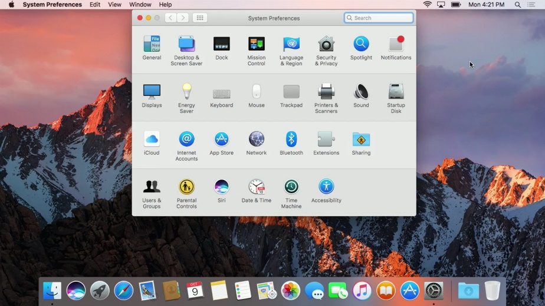

The last operating system we'll dive into is the Linux operating system. Linux is an open source operating system, which means its software is free to share, modify, and distribute. Linux is used heavily in business infrastructure and in the consumer space.

Linux itself is actually a kernel developed by Linus Torvalds. Because of the way it evolved, we call the Linux kernel the Linux operating system. Today, Linux has become a huge community effort with developers all over the world contributing to its success. Because Linux is open source, lots of different organizations package their own version of it.

Operating systems like Windows or Macintosh on the other hand, are solely developed by their respective companies. We call these different Linux OSes distributions. Some common Linux distributions are Ubuntu, Debian, and Red Hat.

Another operating system that has started to gain popularity is Chrome OS, but we won't go into detail on that one. You can read more about it in the supplemental reading right after this video.

We also won't go over any of the operating systems used in mobile devices like Android OS, iOS, and Windows 10 mobile. But you should be aware that mobile phone operating systems are quickly overtaking their desktop counterparts in terms of quantity. Mobile phone usage around the world is more prevalent than desktop computers.

You can read more about this in a supplemental reading. But in this course, we're only going to focus on the Windows and Linux operating systems since you'll most likely work with them in IT support.

One cool thing to call out is that Chrome OS and Android OS both run the Linux kernel underneath the hood. So, there's a chance you've already worked with Linux and don't even know it.

There are lots of operating systems out there and they all share common characteristics. If you're able to understand the basic building blocks of one OS, you can apply that to any operating system and understand how it works.

In IT support, it's super common to work with many different operating systems from desktop OSes to smartphone OSes and more.

Throughout the rest of this module, we're going to learn what an operating system is. More specifically, we're going to learn about the two components that make up an operating system, the kernel space and the user space.

Before we get there, let's do a rundown of the basics.

The kernel does file storage in file management. You can compare it to a physical office file where we store data in paper form. A computer file is just data that we store and a file can be anything, a word document, a picture, a song, literally anything.

A file system is how we manage these files just like in an office, we use a system to store our files. We don't just put all our files on one cabinet, that would be seriously messy. Instead, we organize those files in folders or directories to make them easier to find.

There are lots of different types of file systems, which we'll cover more in depth in future videos. Another important function of the kernel is process management. We have many programs that we want to run on our system.

To run them, we manage the order they run in, how many resources they take up, how long they run, etcetera. Our kernel helps us do this with its process management capabilities.

For example, you've probably used your computer to do several tasks at once. Maybe you write in a text document while listening to music or playing a video. The process scheduler is part of the kernel that makes this multitasking possible. It switches the execution of each different process on the CPU faster than you can blink, and it gives you the illusion that things are happening simultaneously.

Next up is memory management.

Our kernel optimizes memory usage and make sure our applications have enough memory to run. We won't get into too much detail right now, so stay tuned for more on this in the next few videos.

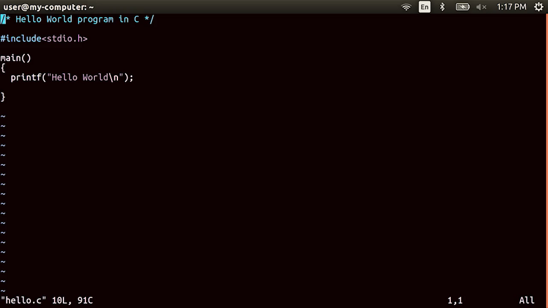

The last important function that a kernel performs is input/output or I/O management.

This is how our kernel talks to external devices like disks, keyboards, networks, connections, audio devices, and more. I/O management is anything that can give us input or that we can use for output of data.

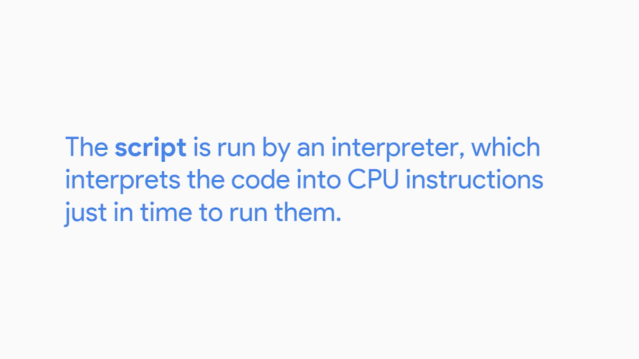

If you've ever saved a file to disk, click the mouse button, or use a microphone when video chatting with a friend, you've got the kernel's ability to manage I/O to thank.

And that's the basic rundown of the main functions of the kernel; file management, process management, memory management, and I/O management.

Finally, we'll talk about the other component of an operating system, the user space. The user space is everything outside the kernel. These are the things that we interact with directly like programs, such as text editors, music players, system settings, user interfaces, etcetera.

By the end of this module, you'll hopefully have a solid understanding of all of these functions of an operating system. Let's start by taking a deeper dive into the kernel's file management.

### Files and file system

Imagine if you had to store a single file in a cabinet. That's not so bad, right? What if, instead of one file, you had to store 100,000? Can you see a problem here? Well, on our computers, we can easily store hundreds of thousands of files, if not more. Problem solved? Not quite, we have to be able to keep track of all these files.

The kernel handles file storage and file systems on our machines. And in this lesson, we're going to dig a little deeper on how it does that. There are three main components to handling files on an OS, the file data, metadata, and file system.

Let's start with the file system. When we have a brand new hard disk that we want to store data on, we need to erase and configure the disk. This way our operating system can read and write data to it. This is important, since it's how our operating system keeps track of files. So it must know what kind of file system is used.

There are lot of file systems, and they're used for different purposes. Some file systems support the storage of large amounts of data, others only support small amounts. They can operate at different speeds, and have varying resiliency towards file corruption, and so on. We won't get into which file system is best. That's for you to decide. But the major OS manufacturers have their own unique file systems that they recommend.

For Windows, the major file system that's used is NTFS. It was introduced in the previous version of Windows OS, Windows NT.

And it includes many features, like encryption, faster access speeds, security, and more.

Microsoft is developing another file system called ReFS, but it isn't quite ready for consumer use just yet. If you're interested in learning more, you can read more about it in the next supplemental reading.

For Mac OS, the default file system is HFS+. It's journaled, which means it does a better job at saving your disk state in case of a failure. This is a feature on other types of file systems, like NTFS.

For Linux, different distributions will use different file system types. A standard for file systems for Linux is ext4, which is compatible with older ext file systems.

In general, different file system types don't play nicely with each other. You might not be able to easily move files across different file systems, depending on the file system type. A good guideline to use is just to use the file system that your operating system recommends. You can read more about the different types of file systems in the supplemental reading.

Another important part of file management is the storage of actual file data. We write data to our hard drive in the form of data blocks.

When we save something to our hard disks, it doesn't always sit in one piece. It can be broken down into many pieces and written to different parts of the disk. Block storage improves faster handling of data because the data isn't stored on one long piece and it can be accessed quicker.

It's also better for utilizing storage space.

Lastly, we need to keep the metadata that contains the information about our file. There's a lot of information about our file that we want to know, like who created it, when it was last modified, who has access to it, and so on. The file metadata tells us everything we need to know about our file.

It also tells us what type of file it is. A file extension is the appended part of a filename that tells us what type of file it is in certain operating systems.

Take cool_image.jpeg. Jpeg is a file extension associated with image files. You'll see different types of file extensions like this when you're working with your operating system.

A working knowledge of file systems and the differences between them is a great skill to have in your IT support specialist toolbox. It can be super useful when you need to do things like recover data from damaged disks. Or explore ways to boot from two different kinds of operating systems, like Windows and Linux, on the same computer.

### Process management

One of the most important tasks that our kernel performs is Process Management. A process is a program that's executing, like our internet browser or text editor.

A program is an application that we can run, like Chrome.

Take note of the difference. We can have many processes of the same program running at the same time. Think of how many Chrome windows you can open. These are all different processes for the same program.

When we want to run our programs, we have to dedicate computer resources to them, like RAM and CPU. We only have a finite amount of resources and we want to be able to run multiple programs.

A kernel has to manage our resources efficiently, so that all the programs we want to use can be run. Our kernel doesn't just dedicate all of our computers' resources to one process. Our system is actually constantly running multiple processes that are necessary for it to function, so our kernel has to worry about all of these processes at once.

What a program wants to run, a process needs to be created for it. This process needs to have harder resources like RAM and CPU.

The kernel has to schedule time for the CPU to execute the instructions in the process. But there's only one CPU and many processes. How does the CPU able to execute multiple processes at once? It actually does it, it executes processes one by one through something known as a time slice.

A time slice is a very short interval of time that gets allocated to a process for CPU execution. It's so short that you don't even notice it. I mean, it's super short.

The CPU execute one process in milliseconds then executes another process then another. To the human eye everything looks like it runs simultaneously, that's how fast the CPU works.

If your computer is running slowly and your CPU resources are being maxed out, there could be many factors at play. It's possible that one process is taking up more time slices than it should. This means that the next process can't be executed. Another possibility is that there are too many processes that want CPU time and the CPU can't keep up with them.

Whatever the case may be, even though the kernel does its best to manage processes for us, we might need to step in manually from time to time. We'll talk about how to manage processes in a later course. The kernel creates processes, efficiently schedules them, and manages how processes are terminated.

This is important since we need a way to collect all the previously used resources that active processes were taking up and reallocate them to another process.

### Memory management

Remember that when a process runs, it needs CPU time, but it also needs memory. When processes are run, they have to take up space in memory, so that the computer can read and load them quickly. However, compared to our hard disk drives, memory comes in smaller quantities.

So to give us more memory than we physically have, we use something called virtual memory. Virtual memory is a combination of hard drive space and RAM that acts like memory that our processes can use.

When we execute a process, we take the data of the program in chunks we call pages. We store these pages in virtual memory. If we want to read and execute these pages, they have to be sent to physical memory or RAM.

Why don't we just store the entire program in RAM so we can execute it quickly? Well, you could if it was small enough, but for large applications, it would be wasteful.

Have you ever worked in a word processor, and then gone to a menu you don't normally use, and notice the application slow down a little? It's because your computer had to load the page for that menu from virtual memory into RAM.

We don't use all the features of our application at once. So why load it up at once? It's similar to cooking a recipe from a cookbook. You don't need to read the whole book just to make one recipe. You only need to read the pages of the recipe you're currently using.

When we store our virtual memory on our hard drive, we call the allocated space, swap space.

When we get into practical applications of disk partitioning, we'll allocate space for swap. The kernel takes care of all of this for us, of course. It handles the process of taking pages of data and swapping them between RAM and virtual memory. But, the kernel isn't the only hard worker around.

You've done great getting through the lessons so far. Nice work. Up next, we'll tackle I/O management. See you there.

### I/O management

So far, we've learned how hard our kernel works by handling files, managing files storage, juggling all the different processes running on our computer, and allocating memory.

Another important task that our kernel handles, is managing input and output. We refer to devices that perform input and output, as I/O devices. These include our monitors, keyboards, mice, hard disk drives, speakers, bluetooth headsets, webcams, and network adapters.

These I/O devices are all managed by our kernel, the kernel needs to be able to load up drivers that are used, so that we can recognize and speak to these different types of hardware. When the kernel is able to start the drivers to communicate with hardware, it also manages the transfer of data in, and out of the devices.

I/O doesn't just mean the transfer of data between us and our devices, the devices also need to be able to talk to each other.

Our kernel handles all the intercommunication between devices. It also figures out what the most efficient method of transfer is, and it tries its best to make sure our data doesn't have errors during process.

When you're troubleshooting or solving a problem with a slow machine, it's usually some sort of hardware resource deficiency.

If you don't have enough RAM, you can't load up as many processes. If you don't have enough CPU, you can't execute programs fast enough. If you have too much input coming into the device or too much output going somewhere, you'll also block other data from being sent or received.

It's slow! is one of the most common problems you'll solve in an I.T. support role.

Knowing the potential sources of that slowness is a big help when you're trying to narrow down the cause of the latency. Troubleshooting is such an important part of any IT support role. That's why, we'll share some troubleshooting best practices in detail, in upcoming lessons of this course.

Beyond desktop support, identifying the source of a resource bottleneck in a server or large I.T. system like a web application, can unlock performance gains and new heights of responsiveness for your users.

### Interacting with the OS user space

Okay, we've covered the kernel's major responsibilities. Now, let's discuss the final major aspect of an operating system, how humans interact with it. This is what we call, the userspace.

When we interact with an operating system, we want to do certain functions like create files and folders, open applications, delete items, you get the idea.

There are two ways that we can interact with our OS, with a shell or a graphical user interface.

There are also some shells that use graphical user interfaces, but we'll work with the command line interface or CLIA shell for the most part.

This just means that we'll use text commands.

A graphical user interface or GUI, is a visual way to interact with a computer.

We use our mouse to click and drag, to open folders etc. We can see everything we do with it. You probably use a GUI every day without realizing you're using one.

To watch this video, you probably used a GUI. Clicking icons and navigating menus to open your web browser and navigate to the Coursera website.

People usually recognize a device or product based on its GUI. You might be able to spot the difference between a computer running Microsoft Windows or Mac OS based on the design of the windows, menus and icons.

You've probably seen GUIs in other places too, like mobile phones and tablets, ATM machines and airport kiosks.

A shell is basically a program that interprets text commands and sends them to the OS to execute.

Before we had fancy visual interfaces, commands like create a file had to be typed out.

While we have GUIs today, the shell is still commonly used to run commands, especially by power users. Power users are above average computer users.

In Linux especially, it's essential that you actually know commands, not just a GUI. This is because most of the Linux machines you interact with in IT support, will be accessed remotely. Most of the time, you won't be given a GUI.

There are lots of different types of shells. Some have different features, some handle performance differently, it's the same concept behind different operating systems.

For our purposes, we'll just be using the most common shell, Bash or Bourne Again Shell in Linux.

There's also a shelf for Windows called Powershell, but we won't be covering it here. You'll learn more about Windows power shell and the third course of this program.

Operating systems and you becoming a power user. Throughout this program, we'll learn how to use the Windows GUI and Windows shell, Powershell.

You might be thinking, but it's easier for me to navigate a GUI,than it is to use commands to do the same thing. So why would I want to learn both? I can't stress this enough, it's vital for you to know how to use a shell in an IT support role.

Some tasks can only be completed through commands. In more advanced IT roles, you might have to manage thousands of machines. You don't want to have to click a button or drag a window on every machine when you can just run a command once. You're actually going to learn how to automate this in a later course. Using a GUI and shell isn't all you'll be doing, we'll also interact with our operating system through applications.

There are system applications and libraries that we use on a day-to-day basis, like the log in application, system settings and more.

Throughout this course, you learn more about how to use system applications. And we'll even get hands-on with the applications used in your operating system.

### Logs

Imagine this scenario: you're playing your favorite video game and you finally get to the big boss. You spent countless hours finding this boss neglecting all other responsibilities like your job, school, even hygiene. That's pretty gross but I get it.

So, you're right about to kill the big boss when suddenly, your game console shuts off completely. You'll probably freak out for a second but then you remember, it's okay, you saved the game before the boss came along.

So now, you can turn it back on and you'll be at the same spot but then your console shuts off again. This happens over and over. You like most people are devastated. You find to a fit of rage but then just before you toss your console out, you make one last ditch effort and yell, "Tell me, what's wrong with you?" Suddenly, you hear a faint voice telling you what you want to hear. Wouldn't that be amazing?

Sure, that scenario was a bit exaggerated but my point is that our computers actually can talk to us and tell us what's wrong. Maybe they won't whisper answers to us, but they speak to us in the form of logs. Logs or files that record system events on our computer.

Just like a systems diary our computer will record events like when it was turned on, when a driver was loaded and even when something isn't working in the form of error messages.

In all operating systems, logs are kept so we can refer back to them when we need to find out something that happened. But logs can be hard to navigate because our computer will essentially record everything. Here's what a log looks like.

As you can see, it can be tough to make your way through a log but with a little bit of elbow grease we can figure out what happened on our computer and piece together a solution. We'll see an example of how a log is useful in figuring out an issue in a later lesson. We'll dive into the technical details of logs in a later course.

For now, just be aware that we can investigate details about our computer that aren't obvious to us. Unfortunately, our computers, cars, and machines don't have a little voice that tells us what's wrong when there's a problem. But by the end of this program, you'll be able to navigate and read logs, so you won't even need it.

### Boot

In this lesson, we're going to learn how our operating system starts up. As an IT support specialist, you'll probably work on lots of computers that won't start. It's important to know the steps an operating system takes so you can help diagnose the sort of issue.

Booting a computer or starting a computer comes from the phrase to pull oneself up by one's bootstraps.

Basically, it means to start from nothing and follow a series of steps to arrive at a fully operational system. When we start up a computer, we use the term boot. For most operating systems, the boot process follows a general pattern. Much like how we have different cars start up in the same way. Put in the key, turn on the ignition, et cetera. Here's a rundown of the boot process.

First, the computer is powered on.

Remember what we learned about the BIOS/UEFI in earlier videos? The BIOS/UEFI is a low-level software that initializes our computer's hardware to make sure everything is good to go.

So next, the BIOS/UEFI runs a process called the Power On Self Test or POST.

The POST performs a series of diagnostic tests to make sure that the computer is in proper working order.

Next, depending on the BIOS/UEFI configuration, a boot device will be selected. Devices that are attached to our system, like hard drives, USB drives, CD drives, et cetera are configured in a certain boot order.

The devices will be checked in this order and the computer will search for what's known as a bootloader. The bootloader is a small program that loads the operating system.

Once our computer finds a bootloader on a device in the listed order, it will start to execute this program. This will then start to load a larger and more complex program and eventually loads our operating system. Once the bootloader loads up our operating system, our kernel gets loaded.

The kernel controls access to our computers resources. It also loads up drivers and more, so that our hardware can talk to our software.

Next, essential system processes and user space items are launched.

These include processes like user log in, spinning up a desktop environment, and more which basically allows us to interact with our system. And that's it. After these simple steps, you'll be able to get to work.

## Installing an operating system

### Choosing an operating system

In the last lesson you learned how an operating system boots up. It's an important concept to understand since you'll be faced with troubleshooting boot up issues in IT support. Now we're going to walk through the steps to select and install an operating system. We're going to focus on operating systems in the IT space.

First, we'll talk about deciding which operating system to install in a business setting. Second, we'll dive into the overall process of installing an operating system.

So how do you decide which operating system to install? Well, you need to ask yourself a couple of questions. Has the decision already been made? The operating systems in use by an organization have a lot to do with the applications and systems that they need to run.

Are you working with an organization or service that requires the use of a specific operating system?

If so, you're done that's easy. If the decision hasn't been made on what OS to use, or if you're looking for an operating system for personal use, then you need to ask yourself, what software will need to be run on this device.

In lots of cases, the software will be designed to run on a specific operating system. It's also possible that the software is cross platform, meaning it can run on more than one operating system. Another question to ask is, what hardware will be used?

Modern operating systems do a pretty good job of supporting common hardware. You should keep in mind that some manufacturers allow their opperating system to be only installed on their hardware. Still a little confused about which operating system is best for you or your organization? Check out the supplemental reading right after this video to learn more.

There's one more thing I should call out. Remember that we have different CPU architecture's, 32-bit and 64-bit.

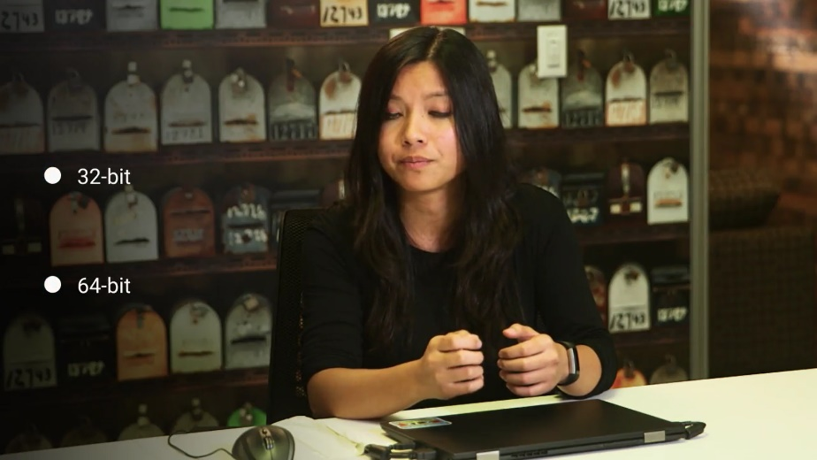

Our operating systems will also be optimized for this architecture, so make sure that the CPU and OS are compatible. If you have a 64-bit CPU, you should also install the 64-bit version of the operating system you choose.

Okay, now that you've chosen an operating system that you want to use, let's work on getting it installed on our hardware. Many computers come with an operating system pre-installed. If you boot the computer in this condition, the operating system will continue from whatever point the vendor left it at.

You'll need to do a couple of things to finish the installation, like choosing a computer name, or host name, or configuring the network for the device.

There's more, but we won't worry about that now. When we walk through an installation of an operating system, you'll be able to see this. If you're going to be installing an operating system from scratch, you can use different installation media.

Some operating system manufacturers sell their operating system in disc form or USB form. Some let you do reinstalls directly over the internet. As an IT support specialist, you'll install an operating system many times, so using one single disk won't be time efficient or scalable.

Scalability is an important concept that we'll cover later. If you want to scale or accommodate multiple computers, the added support is something you need to keep in mind. For now, you're only working with one computer so let's focus on that.

Let's just use a USB drive to install your operating system. Some OS manufacturers have their own special USB drives with the installation image like Windows. For Linux we can load up an OS onto any USB drives. You'll see what I mean by that in the next couple of videos. See you there.

### Virtual machines

Before we start installing our operating system, we need to be familiar with the concept of Virtual Machines or VMs. A virtual machine is just a copy of a real machine.

Why would you want that? We've been working with physical machines so far, but there are cases in IT support where we need access to a machine that isn't physically in front of us.

Let's say I have a Windows machine and I want to learn another operating system like Linux. I don't want to buy another computer or have two separate operating systems on my disk. Instead, I can use an application like Virtual Box, to install Linux and have it completely isolated from my machine.

Virtual machines use physical resources like memory, CPU and storage, but they offer the added benefit of running multiple operating systems at once. They're also easier to maintain and provision.

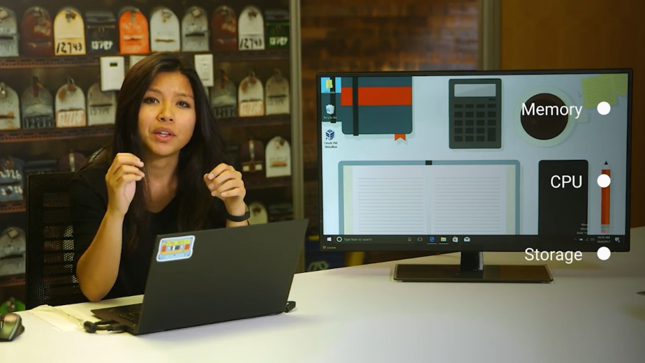

Virtual machines have become a staple in many IT departments since they allow IT support specialists to create new virtual computers on-demand. They can also reclaim the resources they use when they're no longer needed.

If you wanted to use software that's only available on one specific OS, it's easier to create a new virtual machine, use the software, and then delete the virtual machines once you're done.

Throughout this program, you'll actually be using VMs to perform hands-on exercises. You'll be working on our quick labs platform, where you'll be presented tasks to complete from within a lab setting. We list out the specific tasks you'll need to complete. Once you complete the tasks, you'll get the credit for the lab.

Okay. Now that we know what a virtual machine is, you can see how they can be extremely useful. We'll revisit the ends in the future and see there are other many uses.

We're covering a lot of ground fast. Since we're going to start installing operating system soon, feel free to review these lessons to make sure you fully understand the fundamentals before moving on.

### Installing windows

The first operating system we're going to install is Windows 10 OS. This is the latest iteration in the Windows family operating system. If you buy the software in stores, it comes in a nifty USB drive. I have Windows loaded on a USB drive, I'm going to go ahead and start the drive, then boot it in a minute. But first, let's make sure we have our BIOS UEFI boot order, set to boot from the USB drive.

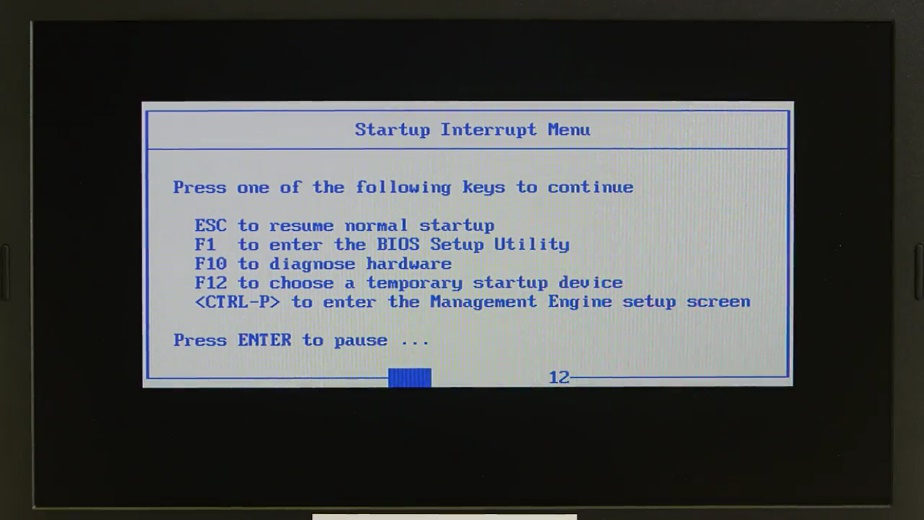

Depending what the manufacturer of your computer uses, you'll either hit F12 or some other key to access the BIOS settings. Looks good. Let's just let it run and we'll see it booting from the USB drive. Take note that your installation process might be slightly different depending on the version of Windows.

Okay, I'm just going to click Next here, just asking for my language preference, my time, and keyboard, then I'm going to click the Install now button.

It's asking for product key, am just going to go ahead and skip this, do that later. And it's just asking me to agree to a software license term, so am just going to accept, next.

All right, now it's asking which type of installation I want to do? I'm just going to click on custom, because I just want to install windows, I select the drive I want to install it on.

Okay, looks like the computer restarted, now it's just configuring updates. Once it's done updating, it's going to restart one more time. And now, we're launched into the screen here that's asking us to enter in the product key. We're just going to go ahead and skip to this for now, we'll do this later, so am going to click, Do this later.

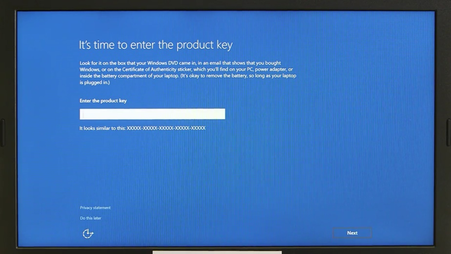

And now, it's asking if what kind of settings we want to use? We're just going to click use express settings for now. So now, we start using our machine as quickly as possible.

Okay, it's asking us to create an account for this PC. The first field is a user name. A user name is unique identifier for a user account. I'm just going to go ahead and use my first name as my username. Next, I'll enter a password. Once that's done, we'll go ahead and finish our setup. It's starting to set up everything for us, perfect.

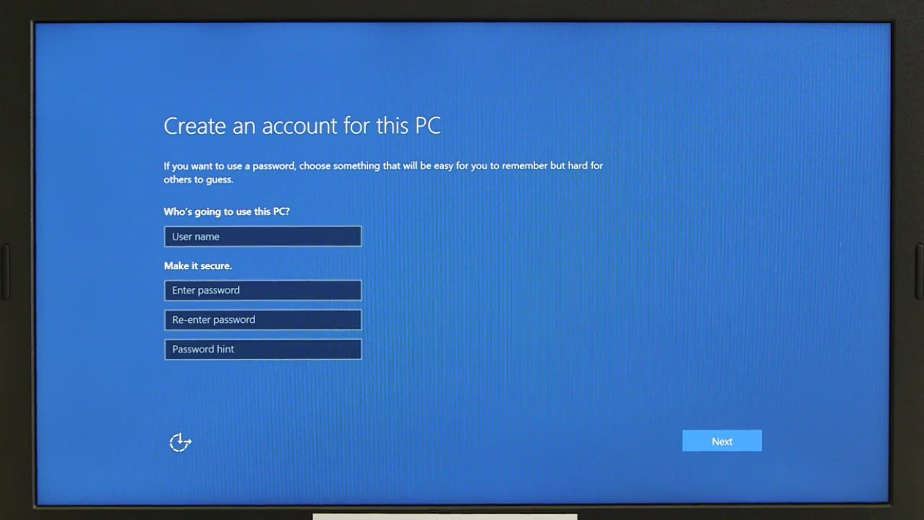

Now, here we are, inside the Windows 10 operating system. Check it out, this is our user space. We have our desktop environment here where we can navigate our files, folders, and applications. The main screen here is called a desktop.

In the bottom right corner here, we have a task bar. This gives us quick options and shows us information like network connectivity, the date, system notifications, sound etc.

In the bottom left hand corner here, we can access the applications, files, folders, and settings. You could also shut down, restart, and power off your computer from here. Let's move onto our system settings. In the main menu, go ahead and navigate to the settings.

From here, you can change any of your system settings like display resolution, user accounts, network, devices, etc.

Now, we're going to create a file in our operating system with our GUI. Let's create a file here on our desktop. All you need to do is right click, and you'll see some options available.

Then select new, then text document, bam. Now we have a text file on our desktop. We just need to give it a name. How about my super cool file? And that's it. You just created a file on Windows.

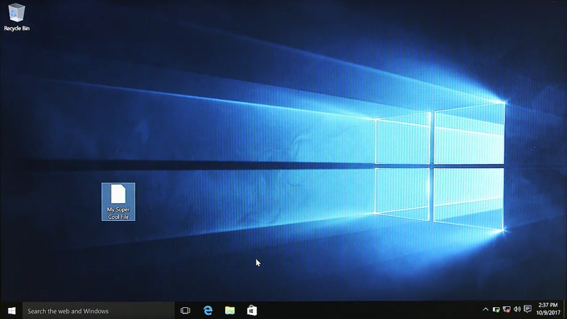

It wasn't so bad, was it?

### Installing Linux

Now that we've seen how Windows is installed, let's go ahead and install the Linux operating system. Remember how I said that Linux has many different versions of their operating system called distributions? There are countless articles that highlights the pros and cons of the hundreds of distributions out there. We'll go with the most popular consumer distribution, Ubuntu.

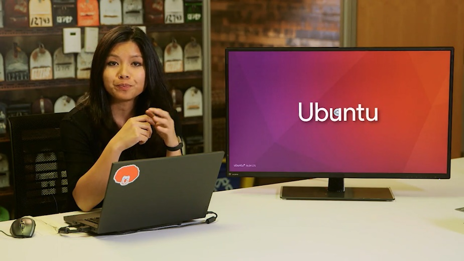

I've already loaded Ubuntu on a plain USB drive.

ProTip: Since Ubuntu is open source, you can download the free operating system install image directly from their website and install it using whatever media you like. I've included a link to it in the next supplemental reading.

I should also call out that you can't just copy the install file to a USB drive and expect it to work. It has to be copied in a way that makes a USB device bootable from our BIOS. To load the image onto your USB device and make it bootable, you can use a tool like etcher.io. You can also check out the link to the tool in the reading right after this video.

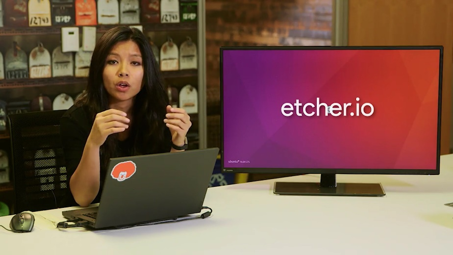

Okay. Let me go power on. And remember, we're gonna make sure that we want to boot from the USB device. All right. Now that its loaded, you'll see an option if you want to try using the operating system first or just install the operating system. We're going to do a fresh install the operating system.

The Ubuntu logo will pop up, and then we're going to have to go through a couple of loading screens while the system is installing.

All right. We're just going to go ahead and skip through all of these and just pick the defaults for now.

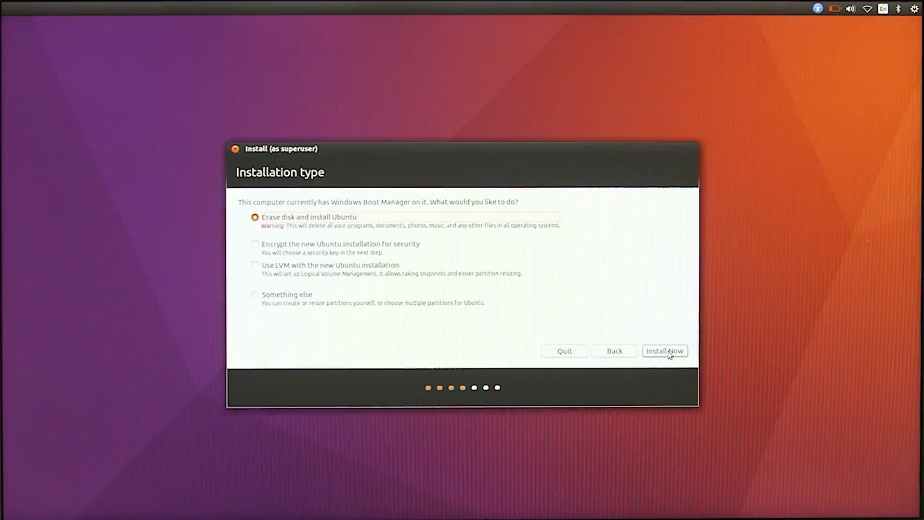

All right. Now it ask us for our name, a computer name, or host name, then a username. The host name is used to identify the computer when it needs to talk to other computers. On our personal computer, it's common to just use our own names for our computer's name. But in an IT organization, we want to choose a good host name that follows a certain standardization.

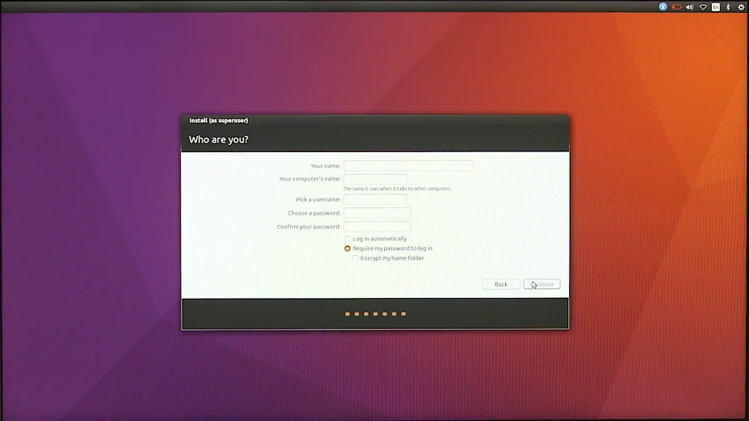

We'll go over that in a later lesson, but for now, let's just use an industry standard for host name, like user name dash location. So I'm going to go and enter in my name, Cindy. Then, for the host name field, I'm going to type cindy-nyc. Then for the password, we're just going to enter a password here, then we're going to confirm.

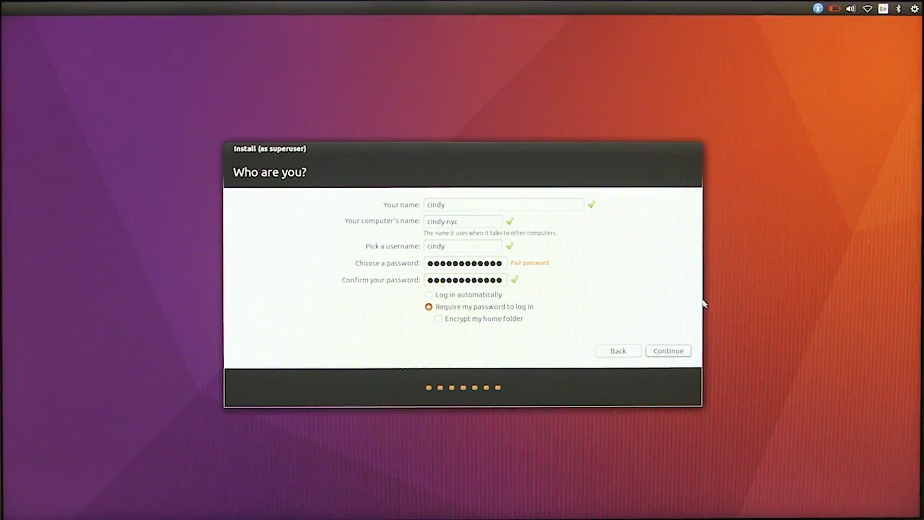

All right. Then, I'm going to hit next. And then it'll ask us to restart once it's done. Awesome. Now that's restarted, let's go ahead and log in.

Great. Now we're in the Ubuntu desktop environment. Here you can see where applications are laid out.

On the left-hand side here, we have a dock that we can add shortcuts to. This layout may change since Ubuntu is changing their desktop environment in the near future. To learn more about this, you can check out the next supplemental reading.

On the top right-hand bar here, you'll see quick settings for your computer, like network connectivity, Bluetooth connectivity, sound and volume. There's also the time, a menu to power off, restart, sleep, and log out of your machine.

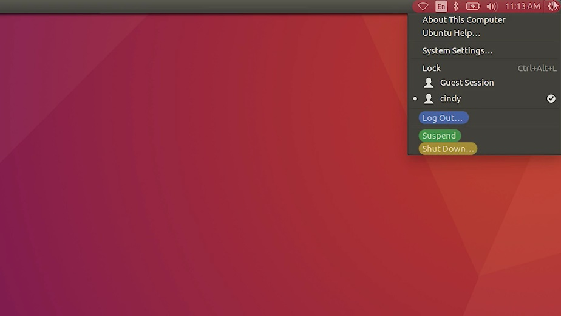

Let's click on this menu and select "System Settings." From here, you can change your system settings, like your screensaver, resolution, hardware settings, and more.

Let's go back to our desktop and select this icon here for files. This opens up a window so we can view our files. You can see the different files and folders here.

If I click on "Computer", I'm taken to the main directory of my system. We're going to get to this in-depth in the later course.

So for now, I'm going to head back to my desktop. Now, let's do the exact same thing we did with our windows machine and create a file. This time, let's just use commands in the shell. Because we're in a GUI, we don't have a program called Bash that we run our commands in. Instead, we open up the search utility here and search for an application called Terminal.

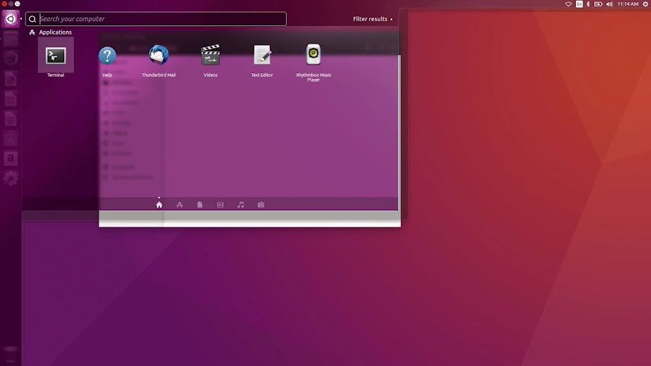

When you open up the Terminal, you'll see your username, and at symbol, the host name, colon, tilde, and then slash desktop as your command prompt. This is used to show who's running the command.

This will be more important in another course as you switch users. The last portion of the prompt shows you where you are on the computer. We'll learn more about this in a later lesson too. But you can see that we're currently in our desktop.

You can verify that we're using the Bash shell with a simple command: echo dollar sign, SHELL. The echo command just prints out text options to the display. In this case, the argument ''dollar sign SHELL'' is the current shell, slash bin, slash bash or bash.

You could even do ''echo Hello'', and it would display Hello, which isn't as useful.

Okay. Let's create a file in our shell. I'm going to use the touch command. Touch my_super_cool_file.

And here, you can see it made a file on our desktop. There are many different commands you can use to make a file, but the touch command in one of the simpler ones.

Right now, it might be hard to understand why you have to memorize Linux shell commands when it's easier to use a Windows GUI. If you'd be working with any Linux machines, it's essential that you know these commands.

Learning commands is also a stepping stone to process automation, which we'll cover in another course. Don't worry, by the end of this program, you should be super comfortable in the shell. Maybe you'll even run commands faster than you can in the GUI.

### What is Chrome OS

We called out earlier that Chrome OS is an operating system based on Linux. Now, let's dive into how it's different from other Linux-based distributions.

Unlike other operating systems, Chrome OS has one main purpose: to be a secure and simple way for the user to interact with the web.

Not so long ago, the idea of having an operating system dedicated to running a web browser would've seemed weird like it was under using the computer. But today, you can do so much just through your web browser. You can communicate through email, create and share documents, edit photos and even connect remotely to another computer and the list continues to grow.

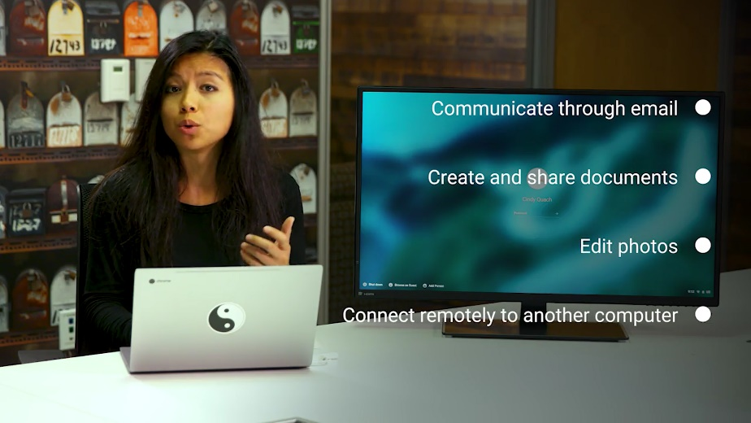

The development of new web applications increases the number of things users can do all within the web browser. This means that for a lot of people, most of their daily computer use happens inside the browser. So, having an operating system built around a web browser makes a lot of sense.

That said, Chrome OS is more than just a web-browsing operating system. It can also run Android and Linux applications inside containers.

The user interface in Chrome OS is customized so you can only see the chrome interface.

Process management, memory and input and output are still happening behind the scenes. But you don't need to deal with any of that. You only need to deal with the browser.

Chrome OS machines come pre-installed with the operating system. So, there's nothing for us to install. When you log into a Chrome OS machine, you're also signing into the Chrome browser. Let's do that now. I've logged into my Chrome OS machine.

It's pulling up my Chrome settings and extensions from the configuration stored in external servers provided by the Chrome infrastructure. This means that Chrome OS machines are interchangeable because most data is stored in the cloud, not locally.

We'll learn more about the cloud in future lessons but for now think of the cloud as being somewhere else.

Two other characteristics of Chrome OS are that it's extremely simple to use and very hard for users to meddle with. Since users don't have administrator rights on their Chrome OS machines, they won't be able to alter the system configuration. Also, Chrome OS has an automatic update mechanism that includes a fail-safe in case anything goes wrong. This means that the user doesn't need to worry about problems or hacks in the system because it's designed to stay up and running.

Finally, Chrome OS has strong security, which we'll learn about in an upcoming course. For now, you just need to know that Chrome OS allows users to browse the web without worrying about malware and to share machines while keeping their data private.

It also ensures that data won't be compromised if the machine is stolen.

In short, there is no need to worry about harmful software that might be out there because Chrome OS defends against these threats.

As an IT support specialist, you may find that some of the users in your organization will choose Chrome OS for their daily work. Since it's so easy to use and rarely breaks, we won't cover daily support in further detail.

### Installing macOS X

The last operating system we'll go over is Apple's Mac OS. We won't go into too many details about how to use this OS. Instead, we'll focus on the ins and outs of Windows and Linux OSs'. But if you know one operating system, you'll be able to navigate any operating system.

Fortunately, all Apple computers come with Mac OS pre-installed, so we'll just go through the important parts of the operating system.

Okay, here's the desktop environment for our Mac. At the bottom here, you'll see a doc with shortcuts to your applications. In the top right, you've got the system information like the time and date, network connectivity, battery life, if you have a laptop and some other quick settings.

In the top left here, you can see the Apple icon. This bar will change menu options depending on what application is open. But if you click on the Apple icon, you'll see more options. You can tell your computer to Sleep, Restart and power off from here. The most important thing we want to look at is at the System Preferences menu item. This launches our system settings. From here, we can change any of our computer settings like setting the orientation of our mouse scroll, adding and removing users. Setting up printers, changing our screen savers, adding Bluetooth devices and more. I'm going to click on the desktop now. You'll notice our top-left setting changed from our System Preferences to Finder. Finder is the file manager for all Macs. If you open a new Finder window, you can navigate the files and folders on your Mac.

If you right click on a file, or if you're using a Mac laptop you can use a two-finger click on a file to view more information and perform lots of different tasks. The Mac, which is a completely different operating system than Windows or Linux, operates in a very similar way, with similar menu options.

Wow, you've really come a long way. You've been introduced to the major operating systems used today, gotten to play around with the system, and even performed some common tasks. Nice work.

It's important in any IT role to know the ins and outs of operating systems, because you'll be interacting with them every single day. We have a separate course that teaches you all the essentials you need to navigate the Windows and Linux OSs'. But for now, pat yourself on the back. You just took the first step towards understanding OSs'.

Installing, managing and navigating operating systems, are all tasks that you'll have to do daily as an IT support specialist. You may even find yourself doing this for hundreds, if not thousands of machines in your fleet one day.

Before we send you to the next module, we have two assessments for you. Which will test you on creating files, with both Windows and Linux. You can always go back and review the videos again, if you need a refresher. Otherwise, I'll sign off for now, and we'll meet again in Course Three, Operating Systems and You, Becoming a Power User.

In the next module, you'll meet my friend and colleague Victor Escobido who's going to dig into the Internet and networking.
