# Table des matières

[1 Introduction to it [2](#introduction-to-it)](#introduction-to-it)

[2 Hardware [2](#hardware)](#hardware)

[3 Operating systems [2](#operating-systems)](#operating-systems)

[4 Networking [2](#networking)](#networking)

[4.1 What is networking [2](#what-is-networking)](#what-is-networking)

[4.1.1 Module introduction [2](#module-introduction)](#module-introduction)

[4.1.2 Basics of networking [2](#basics-of-networking)](#basics-of-networking)

[4.1.3 Networking hardware [11](#networking-hardware)](#networking-hardware)

[4.1.4 Language of the internet [16](#language-of-the-internet)](#language-of-the-internet)

[4.1.5 The web [18](#the-web)](#the-web)

[4.2 Limitations of the internet [22](#limitations-of-the-internet)](#limitations-of-the-internet)

[4.2.1 History of the internet [22](#history-of-the-internet)](#history-of-the-internet)

[4.2.2 The limitations of the internet [25](#the-limitations-of-the-internet)](#the-limitations-of-the-internet)

[4.3 Impact of the internet [28](#impact-of-the-internet)](#impact-of-the-internet)

[4.3.1 Impact [28](#impact)](#impact)

[4.3.2 Internet of things [30](#internet-of-things)](#internet-of-things)

[4.3.3 Privacy and security [30](#privacy-and-security)](#privacy-and-security)

# Introduction to it

# Hardware

# Operating systems

# Networking

## What is networking

### Module introduction

Hi, my name is Victor Escobedo and I'm a Corporate Operations Engineer. I'm excited to spend the next of the lessons with you, before my colleague and friend Gian takes the reigns and wraps up the rest of the lessons on the Internet. Before we dive in though, I'd like to tell you a little bit about myself. My passion for IT began way back when I was nine years old and my dad brought home our first computer. He was a mechanical engineer and started using the computer to help him with his CAD work. This was the first time I was exposed to computers and later realized you can install new software on it, including computer games. As I tinkered with the computer, surely to my dad's dismay. I became more and more interested in how it worked and eventually started to open up the case and peek inside. I found pieces that could be removed and even some that shouldn't, learning through trial and error along the way. I couldn't really explain what it was, but I just found the mechanics of how it all worked together so fascinating. Looking back, these were the seeds that inspired my career. But you see, where I grew up, going to college and pursuing a career wasn't exactly talked about or heavily encouraged. I'm a first-generation Mexican-American, and there weren't a lot of people I knew pursuing a career in tech. My friends and family were mostly worrying about graduating high school and making sure they had jobs not really thinking about careers. My school didn't have the resources to offer many technical courses and even though my father was working in mechanical engineering, computers were a tool to him like a mill, ruler, or a hammer. My parents encouraged me to work hard and pursue computers but they couldn't really give advice about college or a career in tech. It's no real fault of their own, they just didn't have the necessary experience. When I decided to go to college, I decided to try my hand at computer science since it could feed my curiosity for how computers work at a more fundamental level. I realized that having this foundational knowledge really allowed me to understand some of the higher level concepts that were important in a career in tech. So while in school, I took on my first IT job for a local small company. I've been working in IT now for 12 years with the last 7 years being here at Google. I now work on managing deployments of large, internal IT projects for the company. Applying the knowledge I've picked up over the years in my initial IT help desk roles. To make sure I understand how I'm impacting our users and various support teams. Now that you know a little bit about me, let's dig into the Internet. The Internet made it possible for us to connect with almost anyone in the world. Before the Internet, you had to use paper maps and write down step-by-step directions to get where you wanted to go. If you wanted to see what your friends were up to, you'd have to call them, actually talk to them. If you wanted to learn something new, you had to go to a library and hope they have a book on the subject you wanted to learn. People didn't really discover new restaurants unless they heard about from someone else, or it was advertised. There was no Yelp or other website that rates restaurants like we have today. For some of us, life without the Internet seems unimaginable. We get it, it's become an integral part of our lives. In the next few lessons, you'll be learning about what the Internet is, how it came to be, and how it has impacted us both in negative and positive ways.

### Basics of networking

When most people think of the Internet, they think of a magical cloud that lets you access your favorite websites, shop online, and you're seemingly endless stream of cat pictures. But there isn't any magic involved. There's no mysterious entity that grants us a cat picture on demand.

The Internet is just an interconnection of computers around the world, like a giant spider web that brings all of us together. We call the interconnection of computers a network.

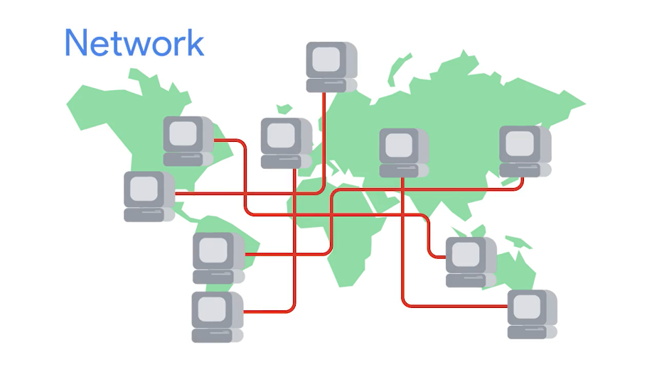

Computers in a network can talk to each other and send data to one another. You can create a simple network with just two computers. In fact, you might already have your own network at home connecting all of your home devices.

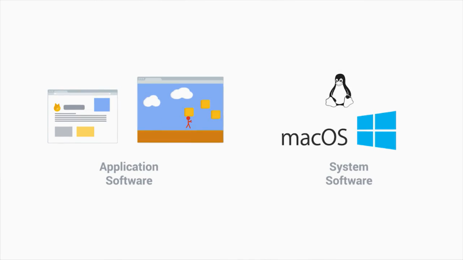

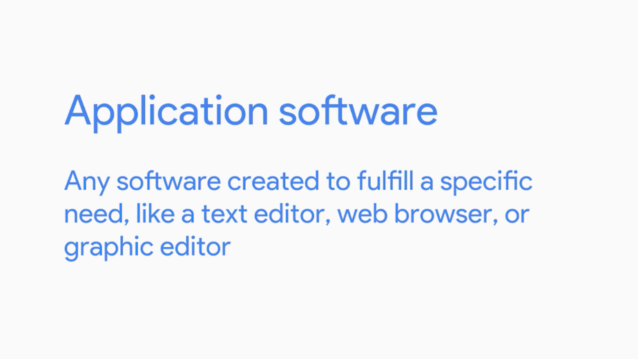

Let's think on a bigger scale. What about the computers at your school or workplace? Are they in a network? They sure are. All of the computers there are linked together in a network.

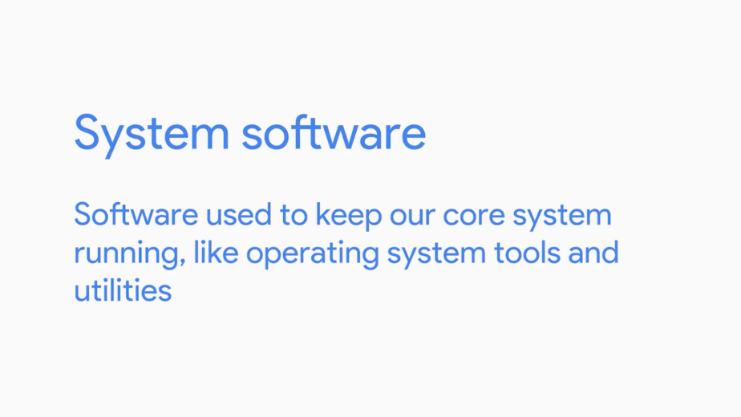

Can we link your home, school and workplace networks together? We absolutely can. Your workplace connects to a bigger network, and that network connects to an even bigger network, and on and on.

Eventually, you've got billions of computers that are interconnected, making up what we call the Internet. You, like most people, probably access the Internet through a browser, like Mozilla Firefox, Google Chrome, Microsoft Edge or something else. This is done through the World Wide Web.

But don't make the mistake of thinking the Internet is the World Wide Web. The Internet is the physical connection of computers and wires around the world.

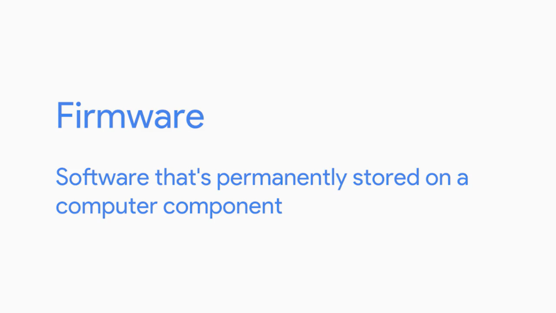

The Web is the information on the Internet.

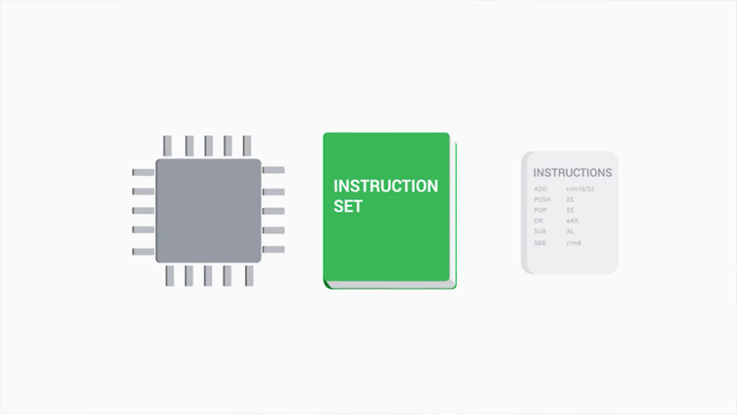We use it to access the Internet through a link like www.google.com. The World Wide Web isn't the only way we can access the Internet. Your e-mail, chat, and file-sharing programs are also ways you can access the Internet.

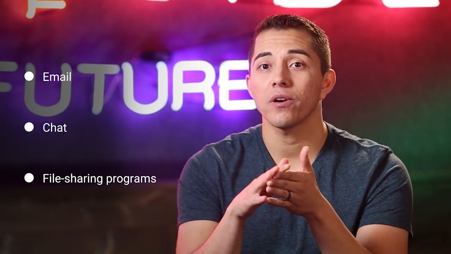

In the IT field, managing, building and designing networks is known as networking. Networking is a super important and large field in IT. There are specialized jobs, college degree programs, and tons of literature dedicated entirely to networking. If you work in the IT field, it's super critical that you understand the fundamentals of networking.

So how does it all work? To answer that question, we're going to need a lot more time. Fortunately, we have a separate course entirely dedicated to this topic. We'll only cover the high-level overview of networking here. The Internet is composed of a massive network of satellites, cellular networks, and physical cables buried beneath the ground.

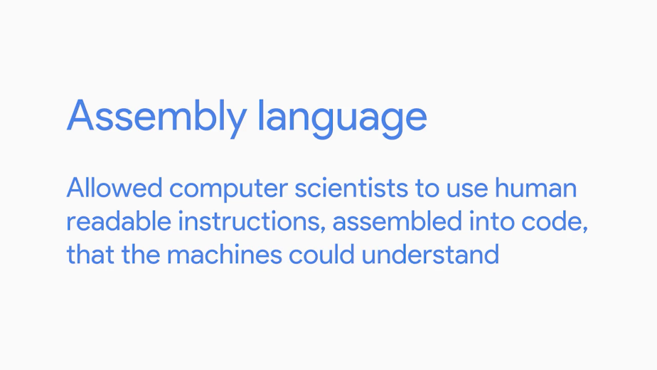

We don't actually connect to the Internet directly. Instead, computers called servers connect directly to the Internet. Servers store the websites that we use, like Wikipedia, Google, Reddit, and BBC. These websites serve content.

The machines that we use, like our mobile phones, laptops, video game, consoles and more, are called clients.

Clients request the content, like pictures, websites, from the servers. Clients don't connect directly to the Internet. Instead, they connect to a network run by an Internet service provider or ISP, like CenturyLink, Level 3, Comcast, Telefonica, and things like that.

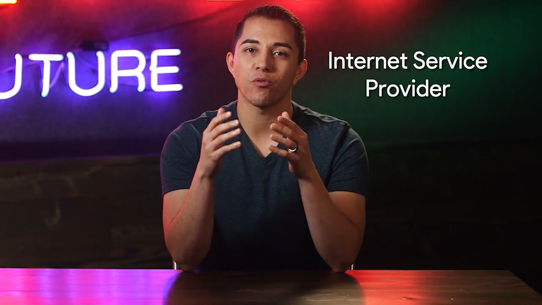

ISPs have already built networks and run all the necessary physical cabling that connects millions of computers together in one network. They also connect to other networks and other ISPs. These other networks connect to the networks of Google, Reddit, and universities.

Basically, all the other networks in the world, together, they form one giant network of computers called the Internet.

But how do the clients know how to get to servers? Well, how would you send a letter to someone? You'd put your address on the letter and send it to the address of the person you're sending the letter to. Computers have addresses just like houses. Computers on a network have an identifier called an IP address.

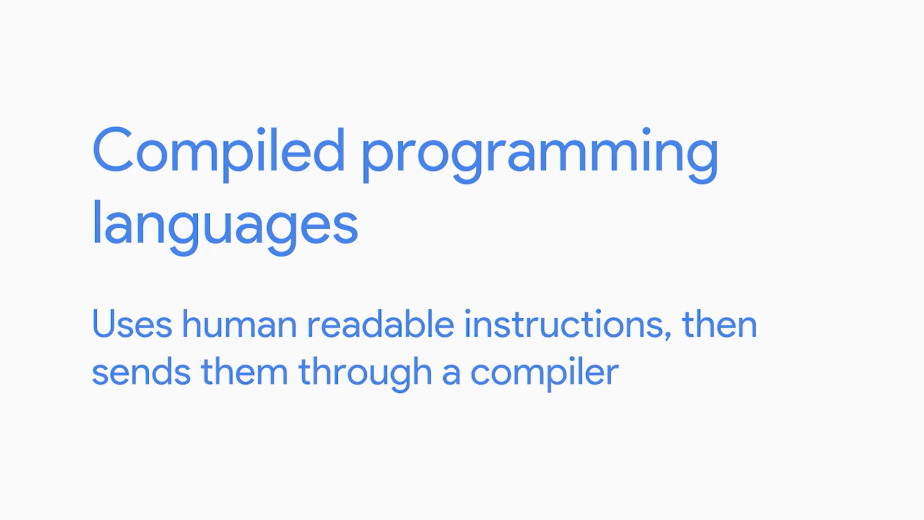

An IP address is composed of digits and numbers like 100.1.4.3.

When we want to access a website like www.coursera.com, we're actually going to their IP address like 172.217.6.46.

Devices that can connect to a network have another unique identifier called a MAC address.

MAC addresses are generally permanent and hard-coded onto a device. A sample MAC address can be something like this.

When you send or receive data through a network, you need to have both an IP and a MAC address.

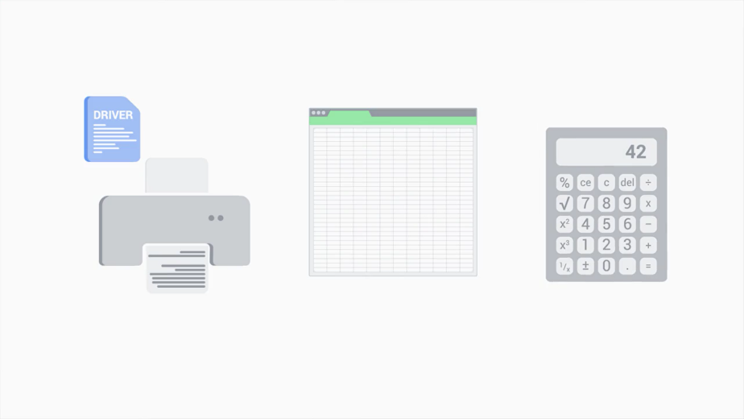

You might be wondering why we need to have two different numbers to identify something. That's a good question. Think again of the letter analogy we used before. An IP address is your house address, while the MAC address is the name of this recipient of the letter. He want to make sure your letter gets to the right location and to the right person.

A more simplified example of the letter delivery would go like this. I'm in New York City, and I got a letter that I want to send to a friend, Mey. Mey is halfway across the world in Tokyo. So our letter will go through lots of places before it reaches her. I put her name and address on there, and I also put my name and address on there too.

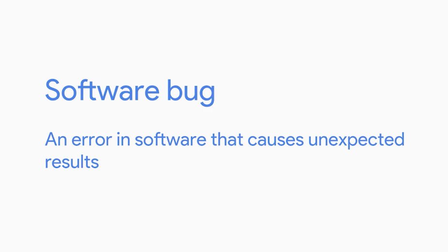

When I drop my letter off at the post office, the mail person looks at it. He thinks, "I don't know how to get to Tokyo from here, but there is a truck that's headed to Texas." He puts my letter in that truck. At the post office in Texas, a mail person looks at the letter and says, "I don't know how to get to Tokyo from here, but we have a truck going to San Francisco." She puts my letter in that truck. At the post office in San Francisco, yet another mail person looks at my letter. He says, "Oh, there's a plane headed to Tokyo." And puts the letter on that plane. When it finally reaches Tokyo, the postman there says, "Oh, I know where Mey lives," and delivers the letter to her.

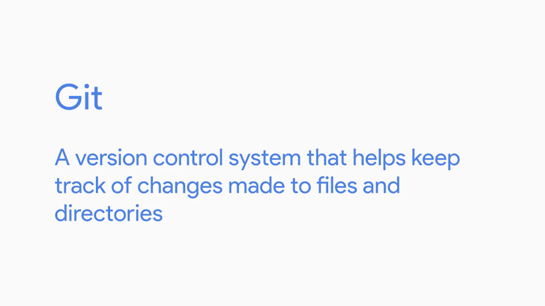

Obviously, there are many more nuance to mail delivery than what I described, but this process is similar to how information gets routed across the Internet. One thing to call out is that data that is sent through a network is sent through packets.

There are little bits of data, and you guessed it, ones and zeros. It doesn't matter if it's pictures, email, music, or text. When we move data through the network, we break them down into packets. When a packet gets to its destination, it will rearrange itself back in order.

Think of a packet like a letter. Let's actually look at this process again, but this time, we'll use IP addresses and MAC addresses. Natalie has a computer with IP address 113.8.81.2, and she wants to go to google.com and search for pictures of cats.

Before she does that, her computer has to send a packet to ask google.com if it can access their website. Our packet knows google.com's IP address is 172.217.6.46, but it doesn't know how to get there just yet. The packet travels from one place to another at each destination, where it asks, "Hey, do you know where google.com is?"

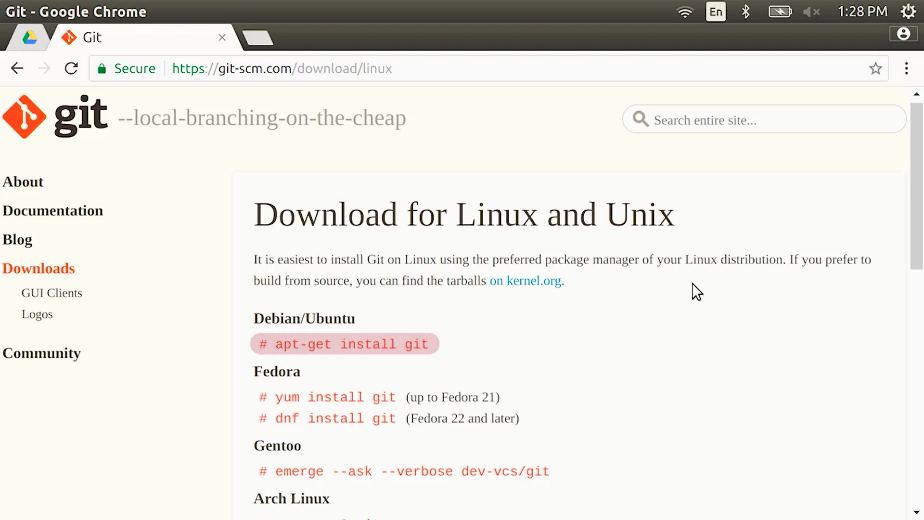

Eventually, it will be routed to another destination that can get the packet closer and closer to google.com. Once it reaches a destination that can deliver the packet to a server at google.com, Google will send Natalie a packet saying she can access an unlimited number of cat pictures.

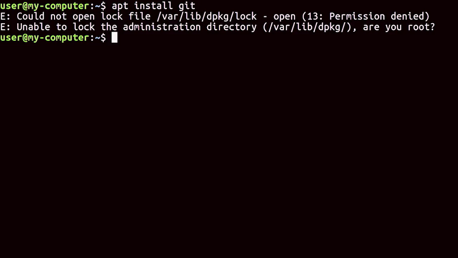

There are many technical details that we left out in this explanation, but don't worry. You'll learn all about the nitty-gritty in the networking course of this program. For now, this is what you need to know about the not so magic of the Internet.

### Networking hardware

Now that we understand what networks are, let's talk about how they're connected. There are a lot of ways you can connect computers to a network. We'll only cover a few of the major ones in this course.

First, there is an Ethernet cable, which lets you physically connect to the network through a cable.

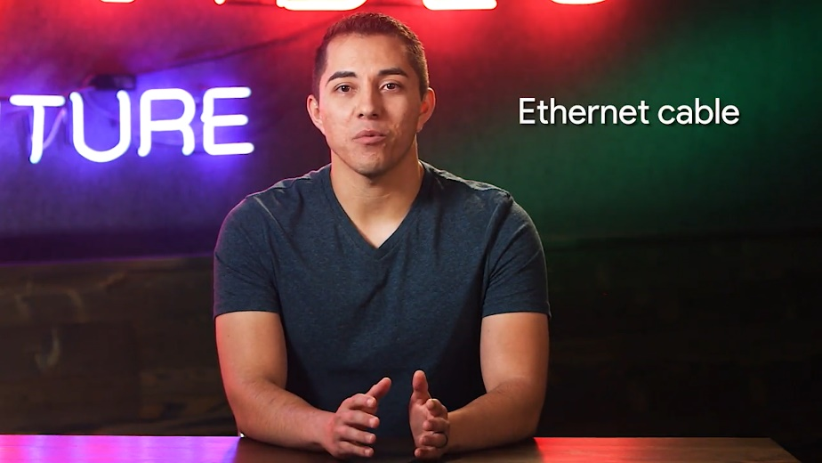

On the back of the desktop we worked in the previous lessons, there's a network port that you plug your Ethernet cable into.

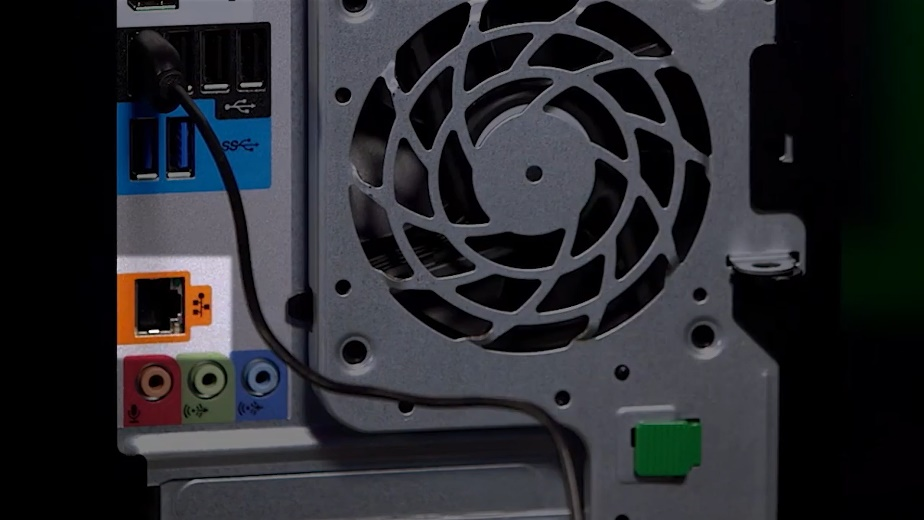

Another way to connect to a network is through Wi-Fi, which is wireless networking.

Most modern computing systems have wireless capabilities like mobile phones, smart televisions and laptops. We connect to wireless networks through radios and antennas.

The last method will go over uses fiber optic cables to connect to a network.

This is the most expensive method since fiber optic cables allow greater speeds than all the other methods. Fiber optic gets its name, because the cables contain glass fibers that move data through light instead of electricity. This means that we send ones and zeros through a beam of light instead of an electrical current, through a copper wire. How cool is that?

But our cables have to connect to something. We don't just have millions of cables going in and out of computers to connect them together, instead, computers connect to a few different devices that help organize our network together.

The first device that your computer connects to is a router. A router connects lots of different devices together and helps route network traffic.

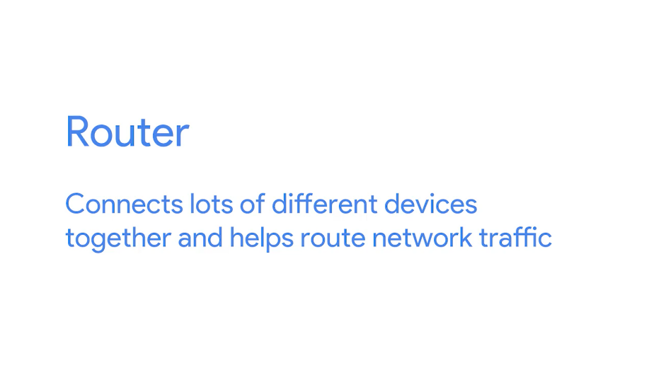

Let's say we have four computers, A, B, C and D, connected together through a router in the same network. You want to send a file from Computer A to Computer B.

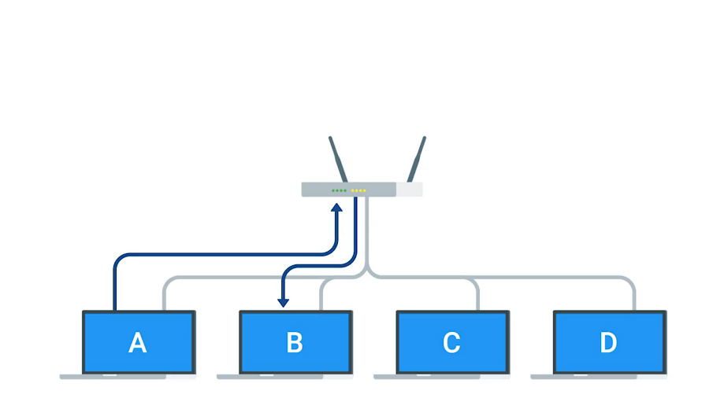

Our packets go through the router and the router utilizes network protocols, to help determine where to send the packet.

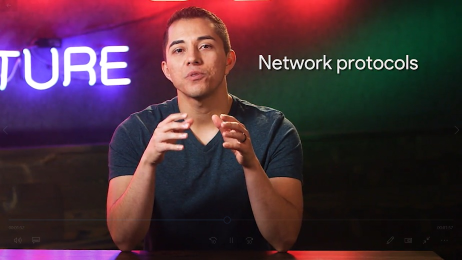

We'll cover network protocols in the next video. For now, just know that our router uses a set of rules to figure out where to send our data. So, now our packet gets routed from Computer A to Computer B.

What if you wanted to send a packet to a computer not in our network? What if we wanted to send a packet to our friend Alejandro's computer. Alejandro is on a different network altogether. Fortunately, our router knows how to handle that too. The packet will get routed outsider network to our ISP's network. Using networking protocols, it's able to figure out where Alejandro's computer is.

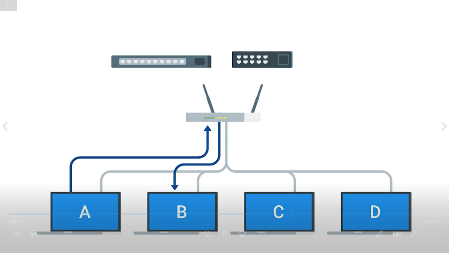

During this process, our packet is traveling across many different routers switches and hubs. Switches and hubs are also devices that help our data travel.

Think of switches like mailrooms in a building. Routers get our letters to the building. But once we're inside, we use the mailroom to figure out where to send a letter.

Hubs are like company memos. They don't know who to send the memo to, so they send it to everyone.

Working with network devices is important to understand, because it's likely that one day you'll have users reporting problems accessing the Internet. You want to investigate your way up the network stack.

A technologies stack, in this case a network stack is just a set of hardware or software that provides the infrastructure for a computer.

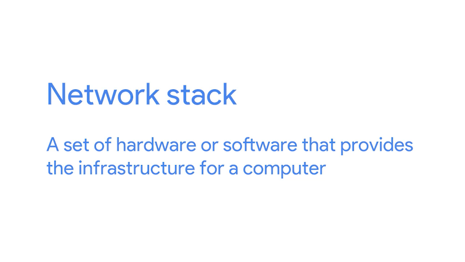

So, the networks stack is all the components that makes up computer networking.

You might need to investigate the networks stack and your job. You'd start with making sure the end user computers are working properly. Then you'd turn your attention to other possible points of failure like the cabling, switches and routers, that work together to access the Internet.

We'll dive a little deeper into the different networking devices in the Networking course. For now, let's route ourself to the next lesson, the language of the Internet.

### Language of the internet

We talked briefly about the networking protocols our devices use to help our packets get from one destination to another destination, but what are they? There are lots and lots of network protocols used and they're all necessary to help us get our packets in the right place. Think of network protocols like a set of rules for how we transfer data in a network.

Imagine if you sent a letter to your friend Sasha who lives in California, but your post office sends it out to another Sasha who lives out in New York.

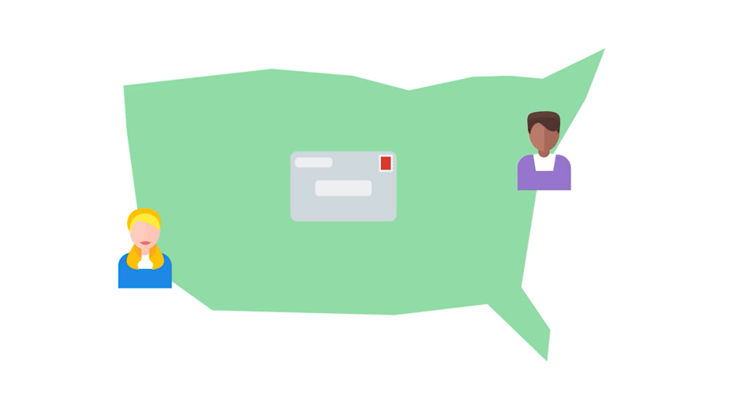

That would hopefully never happen, since the post office has rules that they follow to make sure your letter is sent to the correct address. Our networking protocols do the same thing. There are rules that make sure our packets are routed efficiently, aren't corrupted, are secure, go to the right machine and are named appropriately.

You get the idea. We'll cover specific network protocols later on, but there are two protocols that you need to know. The Transmission Control Protocol and the Internet Protocol, or TCP/IP for short, which have become the predominant protocols of the Internet.

The Internet Protocol or IP, is responsible for delivering our packets to the right computers.

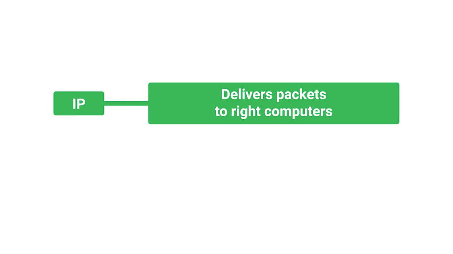

Remember those addresses that computers use to find something on a network? They're called IP addresses or Internet protocol addresses.

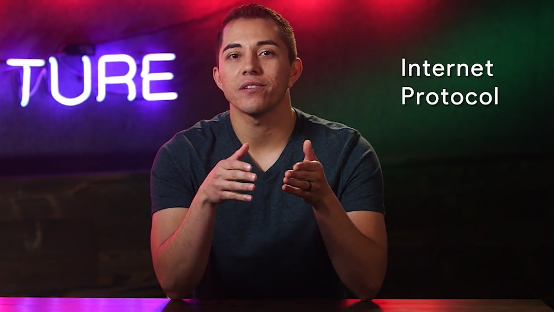

The Internet Protocol helps us route information. The Transmission Control Protocol or TCP, is a protocol that handles reliable delivery of information from one network to another.

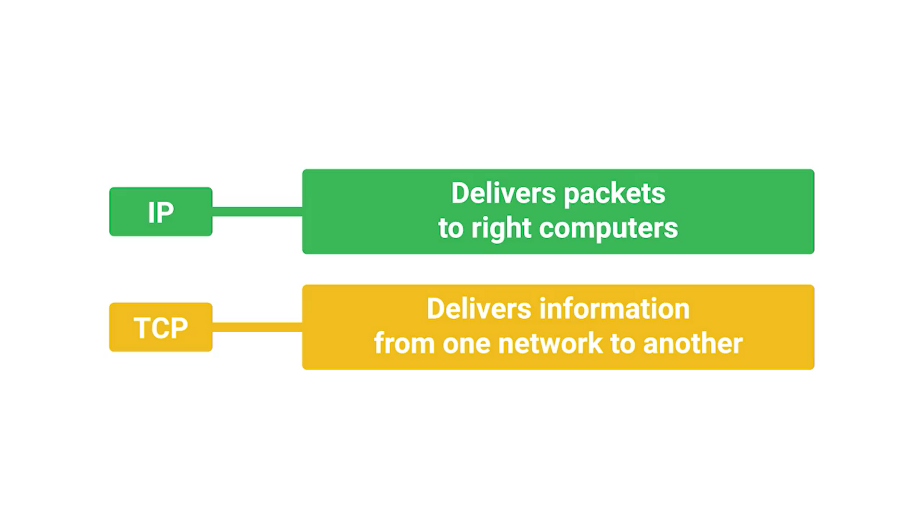

This protocol was an important part of the creation of the internet since it let us share information with other computers. We'll spend a lot of time diving into these protocols in the next course, the bits and bytes of computer networking, so stay tuned.

For now, you've got a high level understanding of how the internet works with TCP/IP.

### The web

There are lots of different ways to use the Internet, we all know that. But I want to cover one of the more prevalent ways that people access the Internet, through the Web. All websites can be accessed through the Web.

Websites are basically text documents that we format with HTML, or hypertext markup language.

It's a coding language used by web browsers. Web pages are generally made up of very basic components. They contain multimedia content like text, images, audio and video.

When you want to navigate to a website, you would type in a URL like www.reddit.com. A URL, which stands for Uniform Resource Locator, is just a web address similar to a home address.

Notice the www in the URL? It stands for World Wide Web.

The second portion, reddit.com, is something we call a domain name. Anyone can register a domain name. It's just our website name. Once a name is taken, it'll be registered to ICANN, the Internet Corporation for Assigned Names and Numbers. Once a domain name is registered with ICANN, no one else can take that name unless it becomes available again.

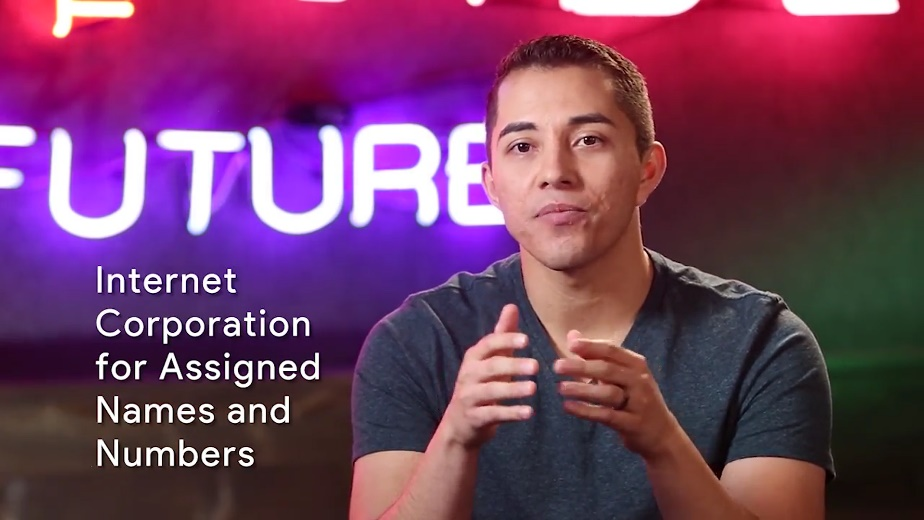

The last part of the URL in this case is .com. But you can also use different domain endings like reddit.net or reddit.org. The different domain name endings are standards for what type of website it might be. So a domain that ends in .edu is mainly used for educational institutions.

Remember how computers use IP addresses to find another computer? Well, you can do the same if you wanted to find a computer on the Internet. Let's go ahead and type 172.217.6.46 into a web browser and hit Enter.

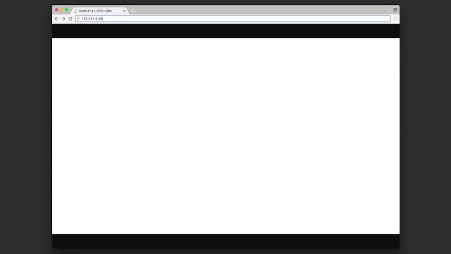

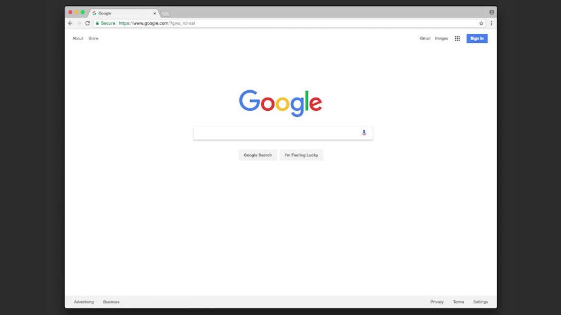

Wait a minute. What happened? How come we're at Google's homepage? It turns out the IP address, 172.217.6.46 maps to Google's homepage through a critical web protocol, Domain Name System, or DNS.

DNS acts like our Internet's directory and lets us use human readable words to map to an IP address. The computer doesn't know what google.com is. It only knows how to get to an IP address. With DNS, it's able to map Google's IP address with google.com. Every time you go on a website, your computer is performing a DNS lookup to find the IP address of the website name you typed in.

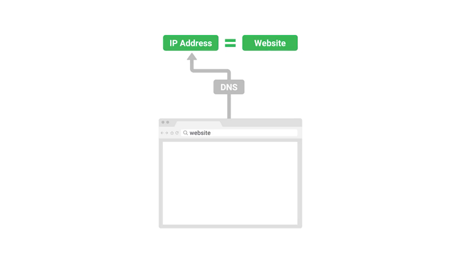

This trick can be a good first step in diagnosing certain kinds of DNS issues. So if you're able to access a website by its IP address but not its human readable domain name, then there's a good bet that there's probably a problem somewhere in the DNS configuration your network is using.

Understanding IP addresses can come in handy in all sorts of other situations you might encounter as an IT support specialist. The source of Internet requests are usually identified by IP addresses and server logs. Many pieces of IT infrastructure need to have some kind of IP address configuration applied to them in order to work. DNS is a huge system, and we'll be discussing more about it later.

Now that you understand the basics of how the Internet works, I'll sign off for now, and leave you in the very capable hands of my friend and colleague, Gian Becuza. I'll see you again in course two, The Bits and Bytes of Computer Networking. But in the next lessons, Gian is going to talk about the incredible boom of the Internet age.

## Limitations of the internet

### History of the internet

You’ve learned what the Internet is and a little bit about how it works. Now, we’re going to take a step back and learn why it was created.

But before we do that, I’d like to introduce myself. My name is Gian Spicuzza and I'm a program manager in Android security.

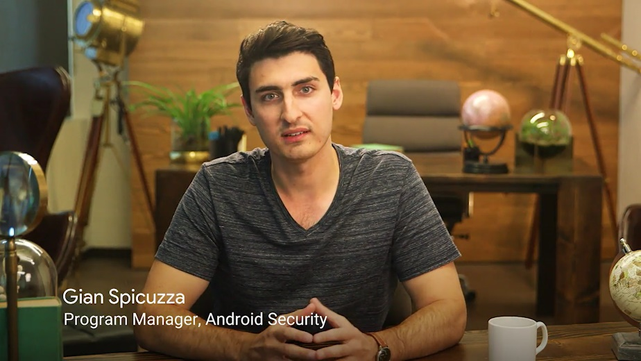

I help protect Android's 2 billion plus users by managing new security features for each of Android's desserts or versions of Android. I've always loved technology and I worked in IT since I was 16 and throughout university. I would fill my pastime reading about new tech and building servers from old computer parts in my basement.

My earliest memory of working on tech is waiting for my parents to go to sleep so I could quietly dial up the Internet while the phone was free and just browse websites all night long and read about random tech things.

My first jobs were as a one person IT crew at three nonprofit organizations. It was both stressful and really exciting to be responsible for everything. From configuring and administrating backup servers, to just showing new employees how to access email and use their computers.

I'm really excited to be here with you. I was never a really great test taker, and my grades reflected that. But I knew with hard work and perseverance, I could build a great career in IT, and so can you.

So let's get started and dig in a bit more on the Internet.

The Internet has become an essential part of our lives. Our bank accounts, entertainment, news and education are all on the Internet. It's important to learn why that is, since some of the original designs of the Internet have reached their limitations. As an IT support specialist, you should understand what the future of the Internet holds and why.

Let's go back in time to the 1950s where it all started. Remember, back then computers were huge and bulky. If you were a programmer, you needed to directly interact with these massive computers. That would get real old real fast, especially if you had several people who wanted to use the only computing resource available.

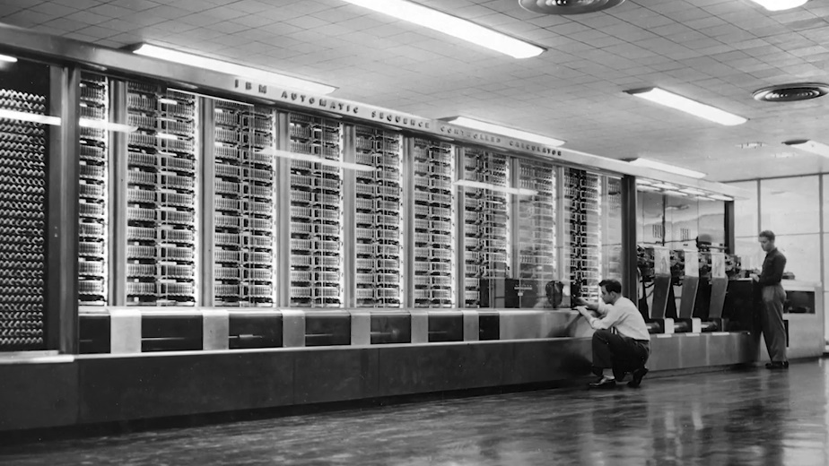

In the late 1960s, the US government spun up a project called DARPA.

It went on to create the earliest version of the Internet that we see today with the ARPANET.

Eventually, computer programmers were able to share a single computing resource by being able to remotely access the computer.

But there was still a big problem. Networks couldn't talk to each other. It wasn't until the 1970s that we had a critical breakthrough in computer networking that fixed this problem.

It was thanks to computer scientists Vinton Cerf and Bob Kahn, who created the method we call the Transmission Control Protocol and the Internet Protocol, or TCP/IP.

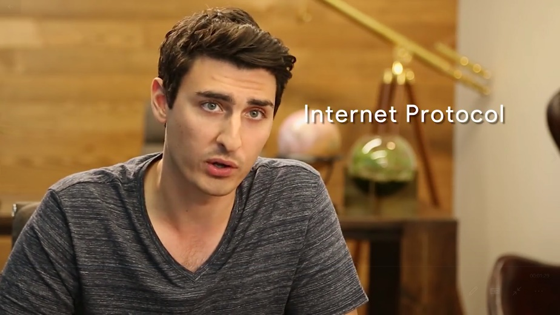

First, only a handful of computers in universities, governments, and businesses adopt TCP/IP, then hundreds. And then, in the span of 50 years, billions of computers. TCP/IP is the protocol we use on the Internet today.

Finally, people around the world could send data to one another, but there was still a problem. The information they sent was just text. It wasn't centralized and it was pretty bland.

Then, in the 1990s, a computer scientist by the name of Tim Berners-Lee invented the World Wide Web.

It utilized different protocols for displaying information in webpages and became the predominant way of communication in accessing the Internet. Anyone who had an Internet connection at that time was able to access the information source of the World Wide Web.

It's been 30 years since the creation of the World Wide Web. We've gone from sending simple email messages and viewing basic webpages to having video chats and instant news updates. Order food, buy books, and even cars in a matter of seconds. Taking an online course like this wasn't even possible until recently.

The creation of the Internet that we know today was a culmination of knowledge and engineering from many brilliant scientists and organizations. If you want to learn more about the history of the Internet, check out the supplemental reading and the networking course in this program.

In the next video, we'll explore the limitations of the original designs of the Internet and how these limitations affect us today.

### The limitations of the internet

We've mentioned IP addresses a lot in this course but we haven't actually gone into detail about them.

They are actually different versions of IP addresses. The current Protocol, Internet Protocol version four or IPv4 is an address that consists of 32 bits separated into four groups.

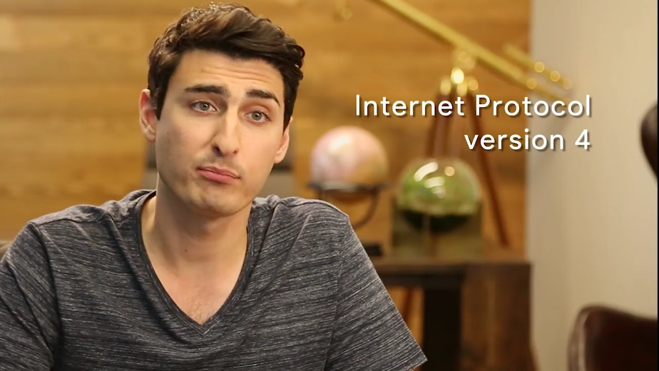

Remember, 42 bits is four bytes and one byte can be stored up to 256 values from 0 to 255. So IPv4 addresses, can be something like 73.55.242.3.

Even though it might seem like a lot of possible IPv4 addresses, there are less than 4.3 billion IPv4 addresses. There are way more than 4.3 billion websites out on the web today. Some IPv4 addresses are even reserved for special purposes. So, the number of usable IP addresses is even less. A device that wants to connect to the internet, needs to have an IP address but devices around the world have already exceeded those numbers.

So, where have we been getting IP addresses? IP addresses have been able to keep up with the amount of devices in the world, thanks to IPv6 or Internet Protocol version six addresses.

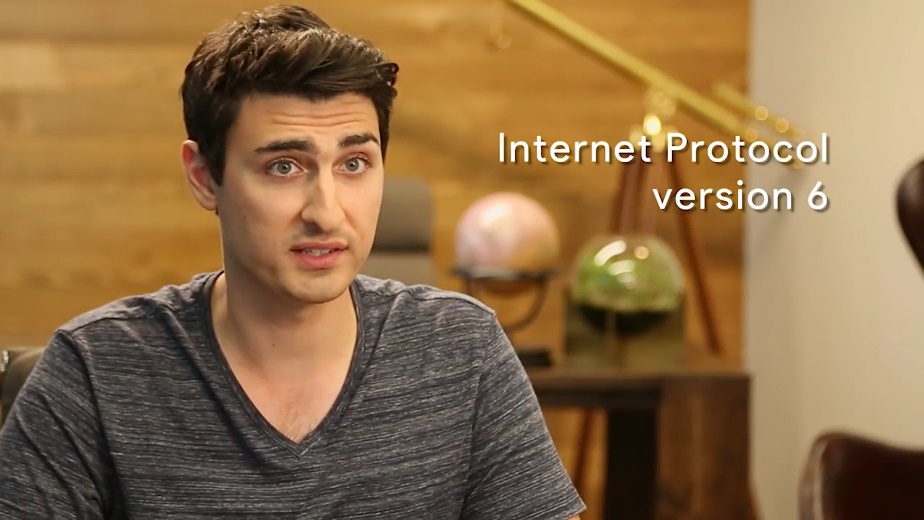

IPv6 addresses consist of a 128 bits, four times the amount that IPv4 uses. Which means way more devices can have IP addresses. The adoption of IPv6 addresses has been slow but steady. Eventually, you will start seeing more and more IPv6 addresses in the wild. An example IPv4 for address can be something like 172.14.24.1.

But an IPv6 address can be something like what you see here, quite a bit of a difference, don't you think?

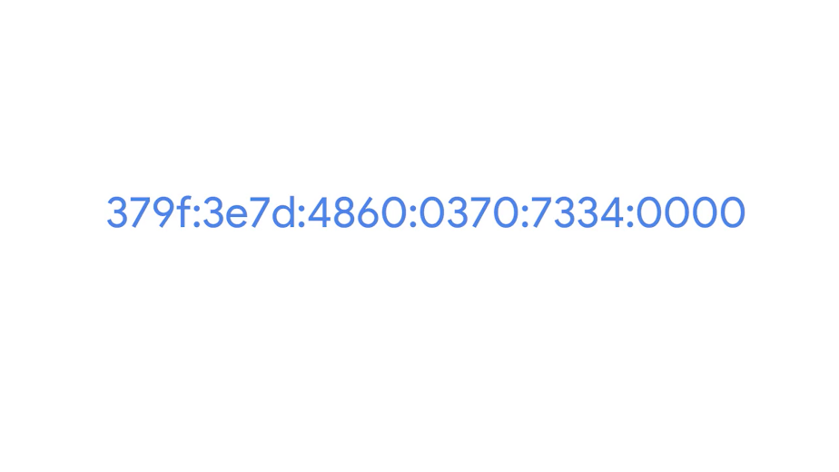

Here's an analogy for how big this difference is between IPv4 and IPv6. With IPv6 there are 2 to the 128 power possible IP addresses, 2 to the 128 power is an insanely huge number. So huge, that scientists had trouble describing with words just how big this number is.

So, here's an analogy. Think of a grain of sand, if you scoop up a handful, do you know how many grains you have in your hand? Probably a lot but that is not even close to the number we are talking about.

Now, take all the grains of sand in the entire world, assuming there are roughly 7 and a half times 10 to the 18th power grains of sand in the world. That still would not be enough IPv6 addresses. Now, let us take all the sand from multiple earths, now you are close to what that number would be. It is a crazy large number. Just know that we will not be running out of IPv6 addresses anytime soon.

Another mitigation tool that we have been able to use is NAT or Network Address Translation. This lets organizations use one public IP address and many private IP addresses within the network.

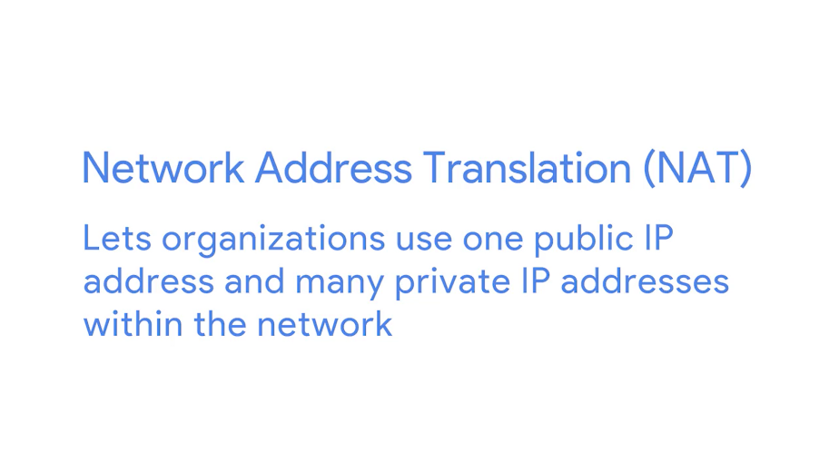

Think of NAT like a receptionist at a company. You know what number to dial to get to the company and once you reach the receptionist, he can transfer your call to one of the private numbers inside the company.

Now, instead of companies using hundreds of public IP addresses, they can just use one IP address. Remember the routers we talked about earlier? One task you might need to perform when you are an I.T. support specialist, is to configure NAT on a router to facilitate communication between your company's network and the outside world.

There are lots of other limitations that we have had to deal with. You'll learn more about them in the networking course. For now, you should have a general understanding of why IPv4 is so limiting for us today and how IPv6 helped solve that.

## Impact of the internet

### Impact

There's no doubt that the Internet has made it much easier for us to connect with our friends and family. But it's also made it easier to connect with everyone else in the world. We're no longer confined to our local neighborhoods.

Decades ago, If you wanted to sell something you'd place your goods in your driveway, and put up signs for a garage sale. The only way someone would see this is if they drove by your neighborhood and saw your sign. We got a little more savvy and started advertising in our local newspaper. We had to pay to list our ad, but at least we were able to reach more people in our neighborhood.

Then the Internet boom happened, and we could use sites like Craigslist to post an advertisement for free, and reach more people in our city.

Then we were able to sell to people outside of our city, to cities in other states.

Eventually, we could sell to people outside of our own country, all thanks to the Internet. Globalization is the movement that lets governments, businesses, and organizations communicate and integrate together on an international scale.

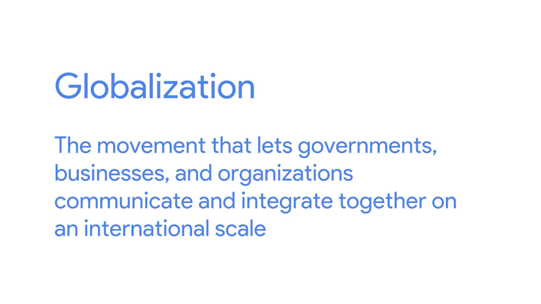

It's been made possible by the Internet and information technology. Countries can communicate with each other faster. News happening on the other side of the world reaches us before we can blink. And global and financial trade have increased dramatically. Globalization has transformed almost every aspect of human society as we know it. Media and social movements have become globalized too.

In 2011, several countries in the Middle East started riots and protests against their government regimes, known as the Arab Spring protests.

Because of outlets like social media, their movement gained worldwide attention and citizens of many different countries banded together to take collective action. Social media movements like this have been going on for years, gathering together people from all over the world and unifying them under a single cause. The Internet has also dramatically changed the way we consume entertainment. A few years ago if you wanted to watch something on TV you had to actually sit in front of your TV right when it aired, or else you'd miss it. Then we started recording our shows, first on VHS and then on things like TiVo, so we could watch them later. But now, we have access to more TV shows and movies than we can ever watch in our entire lifetime right under fingertips.

What if you wanted to listen to a new song by your favorite band? You used to have to wait until they released their album in a store, and you couldn't just buy one song, you had to buy the entire album on a CD, cassette tape, or even a vinyl record back in the day.

If you wanted to get the day's news you had to wait until the next day when the newspaper would print it. Even then you weren't able to get a fraction of a fraction of a fraction of the news you can get on the Internet today.

Retail stores aren't the only place you look when you want to buy something anymore. Now you can order food, clothes, books, and while just about anything on the Internet. But you don't just buy stuff off the web, you can even get an education.

Colleges and universities worldwide are taking education out of the classroom and putting it into your homes. Online courses are becoming a popular way for people to get a quality education at a more convenient location, time, and price. And it's not just degrees, there's an almost infinite amount of educational tools available on the Internet. A few years ago, all this information on the internet had to be reached through your laptop or desktop. Now more than ever, people are going mobile and can access all of this information with their smartphones. It's truly an amazing time to be alive in this technological age. So, the takeaway here is that the only constant in the field of technology is change. And as an IT support specialist you'll have to stay on your toes to keep up with this dynamic shifting landscape.

### Internet of things

You may have heard of the phrase Internet of Things or IoT. This concept is pretty new but already has a major impact on the future of computing. The concept is fairly simple. Basically, more and more devices are being connected to the internet in a smarter fashion. Did you know that there are now smart thermostats? Instead of manually programming them when you'll be out of the house, they'll just know when you leave and turn off the air conditioning for you. And it's not just your thermostat, many companies out there are making smarter household devices. There are fridges that can keep track of what foods you have in their, toasters that can be controlled by your smartphone, lights that can change depending on your mood and cars that drive you instead of you driving them. The world is moving towards connecting manual devices to the internet and making them smarter. These decisions have many societal implications though, especially when it comes to cybersecurity or personal privacy. But there's also a huge potential for IoT to completely transforme the world in ways we have yet to see. In the future, people may be shocked to learn that we had to do manual things like, make your own coffee or drive to the grocery store. While you may not experience working with an Internet of Things device, you should be aware that it will become a large part of the future of computing. You can learn more about IoT in the next supplementary reading.

### Privacy and security

The added convenience made possible by the Internet also makes it harder and harder for us to maintain anonymity. When you purchase something online, your buying habits can be logged, and you may be targeting with marketing. Even when you want to do something simple, like book a dinner reservation, your name, phone number, email, and maybe even a credit card number are required.

Now think about the information you post publicly. Name, pictures, family, friends, and even your location, may be available to anyone online. Be aware of what you're sharing by reviewing the privacy policy of a service before you use it. It's up to you to decide if the trade-offs of a service are worth sharing your personal information. In most cases, companies are trying to build great products that make our lives easier. They may offer their products for free because you provide them with free data. Just make sure your information won't fall into the wrong hands. Privacy doesn't just affect us on a personal scale, it's also become a concern for governments.

In Europe, data regulation and privacy are strictly protected to help EU citizens gain more control over their personal information. COPPA, or the Children's Online Privacy Protection Act, also regulates the information we show to children under the age of 13.

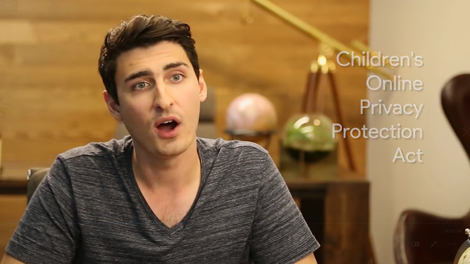

There are many more examples of government regulation of privacy. It's no longer something we can think of on an individual scale. Another concern that's grown with the rise of the Internet is the issue of copyright. Imagine you create a beautiful graphic and upload it on the web for your friends to see. Then some random stranger takes your graphic, claims it as their own, and sells it for profit.

Thankfully, several companies have been founded and designed specifically to help solve this issue of copyright and intellectual property theft. There are also efforts in place that you've learned about, like open source projects, that benefit from being on the Internet. In these cases, open collaboration allows the project to thrive.

On top of privacy and copyright considerations, computer security is another issue that you may face in both your personal and professional life. More and more companies are being targeted in cyber security attacks.

For example, the WannaCry Attack that started in Europe, infected hundreds of thousands of computers across the world. The financial loss of that attack has been estimated at over a billion dollars. Hospital computers were even infected. In a critical life threatening moment, every second matters. Not being able to perform basic medical duties, like pulling medical records, took time away from doctors and nurses and more importantly the lives of their patients. Before the WannaCry Attack, there were lots of other world wide attacks.

In 2011, the Sony PlayStation network was attacked and around 77 million user accounts had personal information exposed, everything from entire governments to businesses that handle the data of millions of people have been compromised. Computer security is no longer the job of specialized security engineers, it's everyone's responsibility, and as an IT support specialist, you'll need to have a fundamental understanding of computer security. You'll get to learn these fundamentals in the course IT Security, Defense Against the Digital Dark Arts, which I'll be teaching you. I spend every day working in security. I love working in the field, because I get to help protect people and their devices from all over the globe.

The security course in this program teaches you just that. You'll also learn what threats are out there and how you can prevent and mitigate them and how to secure your workplace. Next up, you're going to meet my buddy, Phelan Vendeville, who's going to introduce you to software. But before that we've got a quick quiz we've cooked up for you on all the topics we've covered so far. Take your time, and good luck.
