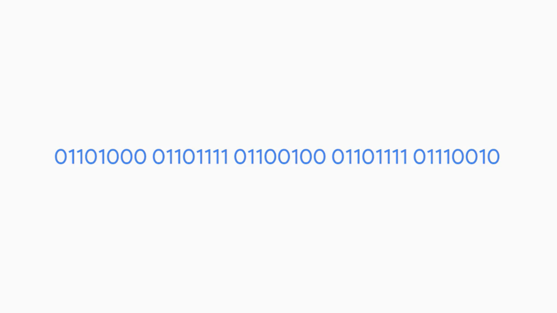
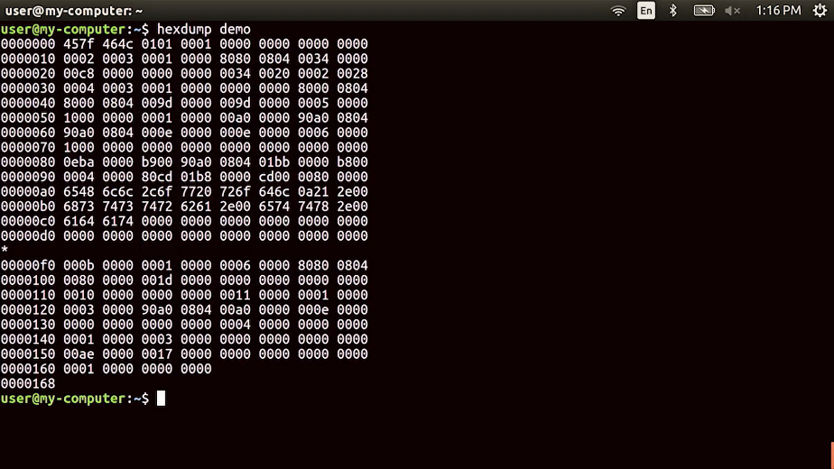

# Table des matières
- [1 Introduction to it](#introduction-to-it)
- [2 Hardware](#hardware)
- [3 Operating systems](#operating-systems)
- [4 Networking](#networking)
- [5 Software](#software)
  - [5.1 Introduction to software](#introduction-to-software)
    - [5.1.1 Module introduction](#module-introduction)
    - [5.1.2 What is software](#what-is-software)
    - [5.1.3 Types of software](#types-of-software)
    - [5.1.4 Revisiting abstraction](#revisiting-abstraction)
    - [5.1.5 Recipe for computing](#recipe-for-computing)
  - [5.2 Interacting with software](#interacting-with-software)
    - [5.2.1 Managing software](#managing-software)
    - [5.2.2 Installing updating and removing software on windows](#installing-updating-and-removing-software-on-windows)
    - [5.2.3 Installing updating and removing software on linux](#installing-updating-and-removing-software-on-linux)
    - [5.2.4 Software automation](#software-automation)

# Introduction to it

# Hardware

# Operating systems

# Networking

# Software

## Introduction to software

### Module introduction

Hi, my name's Phelan Vendeville and I'm a Systems Engineer in the Site Reliability Organization at Google. I'm really excited to be your instructor for the next few lessons. Before we jump in, I'll kick things off by telling you a little bit about myself. My passion for technology began in high school, which was located in a geographically isolated part of California. This isolation meant that technology and the internet played an important role in bringing the outside world to students and connecting them with ideas and opportunities via things like virtual field trips and promote learning. For example, I remember preparing for the SATs through digital classroom sessions, which would have been impossible to attend in person. After high school, I enlisted in the US Navy as an Information Systems Technician responsible for maintaining computer and network systems. I continued to witness the ways technology brings people together. Whether that meant coordinating ship movements during training exercises or connecting love ones on long deployments via video chat. Lots of people use technologies in various ways every day, but relatively few understand how it works. A career in IT can be challenging, as I can attest to personally. I can still remember the horror I felt after blowing up the power supply of a master ship's computer, by using the wrong voltage switch. But a career in IT can be incredibly rewarding, when you can do things like recover irreplaceable family photos from a failing hard drive. As an IT Support Specialist, you'll be in a position to not only know how a given piece of technology functions, but also how to help fix it when it breaks. This means you'll have a direct impact on the flow of information going between people, which is pretty cool. I'm excited to teach you about the third layer of computer architecture known as software. Software is how we, as users, directly interact with our computer. The operating system that we interact with is just software. The music programs, word processors and more that we use every day are also software. But what exactly is it? If the hardware is the physical stuff that you can pick up and hold, software is the intangible instructions that tell the hardware what to do. In the next lesson, we're going to deep dive more into what software is, how we install it, and how it works.

### What is software

Video games, music players, and internet browsers are all different types of software that have completely different functions. Think of the apps on your phone and your laptop. We spend a lot of time interacting with this type of software but we may not know how it actually works or gets added to our systems. In the last few videos, we learned about networking and the internet. There are tons of applications out there that require the Internet to work. Think about it. Your social media apps, messaging apps, and others run off the Internet. This Internet integration isn't just magically added to your application, it's built-in to require it to function. Before we go too far into the world of software, I want to call out some common terms related to software that you might hear. Coding, scripting, and programming are all terms that might seem a little blurry. They generally refer to the same thing but they each have small distinctions. Coding is basically translating one language to another. This can be coding from English to Spanish, English to Morse code or even English to a computer language. When someone builds an application, we refer to it as coding an application. Scripting is coding in a scripting language. We'll talk about scripting languages in a later lesson but scripts are mainly used to perform a single or limited range task. There are languages we can use to build these. Programming is coding in a programming language. Programming languages are special languages that software developers use to write instructions for computers to execute. Larger applications like your web browser, text editors, and music players are all usually written in programming languages. When we use the term software, it generally refers to something that was programmed. We'll use these terms pretty interchangeably so don't sweat the details, now onwards and upwards. So, what is software made of and who builds it? That's a great question. Anyone who knows a programming or a scripting language can use it to write code. There's a huge demand for this skill set and it's becoming easier for someone to learn to code. If you're going to be working in IT, it's important that you understand how software works and how it gets installed on your systems. You might encounter software errors or just good old fashioned failures and you need to understand how to deal with them. By the end of this module, you'll be able to understand what software is, how it works, and how to install it, remove it and update it, all within the Linux and Windows operating systems.

### Types of software

When you rate content, create a piece of art, or engineer something, your work is protected for your use and distribution. There's usually some other caveats depending on the laws in your country but in general, copyright is used when creating original work.

Software that is written is also protected by copyright. Software developers can choose what they do with their software.

For commercial software, it's common to let someone else use their software, if they pay for a license. For non-commercial software, a popular option is making it open-source. This means the developers will let other developers share, modify, and distribute their software for free. Score. Some amazing software efforts have been developed in advance because of open source.

One major example is the Linux kernel which is used in the Android OS and in enterprise and personal computers.

Hundreds of millions of devices are running Linux at this very second LibreOffice, GIMP, and Firefox are other examples of open source software. Open source projects are usually contributed by developers who work on the project for free in their free time.

These massive software development efforts were essentially built by a community of volunteers. How great is that? In I.T. environment, you'll have to pay special attention to the types of software you use. Some may require you to pay multiple licenses to use it, others may be free and open source. It's important to check the license agreement of any software before you install it. We've talked about some of the basics of software, but now let's shift to the two types of software you'll encounter categorized by function.

Application Software is any software created to fulfill a specific need, like a text editor, web browser, or graphics editor.

System software is software used to keep our core system running, like operating system tools and utilities.

There's also a type of system software that we haven't defined yet, called firmware. Firmware is software that's permanently stored on a computer component.

Can you think of a firmware that we've talked about already? If you thought of the BIOS, you're right. The BIOS helps startup the hardware on your computer and also helps load up your operating system. So it's important that it's in a permanent location. I should also call out software versions.

These are important because they tell us what features were added to a specific software iteration. You'll encounter lots of software versions while you work with software.

Developers might sometimes use a different standard when distinguishing a version. But in general, the majority of versions follow a sequential numbering trend. You might see something like this, 1.2.5 or 1.3.4, which of these do you think is the newer version? It's 1.3.4 because it's a larger number than 1.2.5. You can read more about software versioning in the supplemental reading. You'll have to work with all kinds of software. Fortunately, it basically all works the same way. Once you learn how one piece of software works, you'll understand how others might function. We're going to learn how in the next few videos.

### Revisiting abstraction

Earlier in this course, we talked about how programs are instructions that are given to a CPU. We can send binary code or bits to our CPU, then they'll use an instruction set to run those commands.

But these CPUs might be from different manufacturers and may have different instructions. There might even be all kinds of different hardware components, like video cards and hard drives, that also have their own special interfaces.

So how do we write a program that the hardware can understand? Well, one way would be to write a program for each possible combination of CPU and hardware using the native languages and interfaces of these components.

But there are potentially millions of possible configurations of hardware. So how do we get anything to work with all these complex and diverse hardware? Well, thanks to the efforts of computer scientists and the principle of abstraction, we can now use programming languages to write instructions that can be run on any hardware.

### Recipe for computing

Remember that in the 1950s, computer scientists use punch cards to store programs. These punch cards represented bits that the CPU would read and then perform a series of instructions based on what the program was.

The binary code, could look like this, and the instructions would be translated to this.

Grab some input data from this location in memory, using the input data, do some math, then put some output data into this location in memory. But storing programs on punch cards was a long and tedious task. The programs had to be kept on stacks and stacks of punch cards. Computer scientists needed a better way to send instructions to a machine, but how?

Eventually, a language was invented called Assembly language, that allowed computer scientists to use human readable instructions, assembled into code that the machines could understand.

Instead of generating binary code, computer scientists could program using machine instructions, it is like this, take integer from register one, take integer from register two, add integer from register one and register two and output to register four.

This example makes it look like a human can read it, but don't be fooled. Let's take an example of saying something simple like, hello world, in Assembly language. It looks pretty robotic.

Don't get me wrong, that's still an improvement over it's binary code cousin.

But Assembly language will still register thin veil from machine code. It's still didn't let computer programmers use real human words to build a program. And a program that was written for a specific CPU, could only be run on that CPU or family of CPUs.

A program was needed that could run on many types of CPUs. Enter compiled programming languages. A compiled programming language uses human readable instructions, then sends them through a compiler.

The compiler takes the human instructions and compiles them into machine instructions. Admiral Grace Hopper, invented this back in 1959, to help make programming easier. Compilers are a key component to programming, and helped to pave the road that led us to today's modern computing.

Thanks to compilers, we can now use something like this, and it will be the same thing as this.

Computer scientists have developed hundreds of programming languages in the past couple of decades to try and abstract the different CPU instructions into it's simpler commands.

Along the way, another type of language emerged that was interpreted rather than compiled. Interpreted languages aren't compiled ahead of time. A file that has code written in one of these languages is usually called a Script. The script is run by an interpreter, which interprets the code into CPU instructions just in time to run them.

You'll learn how to write code using a scripting language later in this program. As an IT support specialist, scripting can help you by harnessing the power of a computer to perform tasks on your behalf, allowing you to solve a problem once and then move on to the next thing.

Programming languages are used to create programs that can be run to perform a task or many tasks. There are lots of types of programs and in the next lesson, we'll talk about how to manage them.

## Interacting with software

### Managing software

Programs, software, and applications, are terms that are synonymous with each other. For now we'll go ahead and use the term software to refer to any of these. We've already had a rundown of the different types of software.

There are certain types of software that perform specific functions, like drivers, which allow us to interact with our hardware. There are applications that we use for our day to day job functions. And there are utilities that we use like a calculator, settings, and other tools.

With the seemingly endless options for software, how do we know which ones to use? How do we deal with them in a workplace setting and in our personal lives?

Software is always changing. Developers are releasing updates, software companies change, features are added, and so on. This constant change is completely out of our control and it can cause a lot of headaches in the IT world.

Let's say the company that builds your payroll system pushes out a software update that causes settings to change or even worse completely breaks the compatibility with your own company. It can happen. You should always test new software before letting your company use it.

Another thing to worry about is old software. When you run old software on your machine, you risk being exposed to cyber security attacks that take advantage of software bugs. A software bug is an error in software that causes unexpected results.

We'll deep dive into computer security in a later course. For now, know that software updates usually contain critical security updates and new features, and have better compatibility with your system. A good guideline is to update your software constantly.

Another problem that plagues the IT world when it comes to software is software management. If you're setting up a computer for someone, you want to make sure that they'll have all the necessary tools they need to hit the ground running. That means you'll need to install all the software required for the job. That also means you'll also want to remove software that isn't required for the job. We may not realize if a piece of software we installed is malicious software which causes harm to your computer. It's always a good idea to check if the software comes from a repudible source before you install it.

A common industry practice is to not allow users to install software without administrator approval. This prevents users from installing unwanted software because they're actually blocked with an error message that says they need an administrator to enter their login credentials.

Before we get too far ahead of ourselves, let's cover the basics of software management which include installing, updating, and removing software. In the videos up next, we're going to walk through how to do these steps in a Windows environment and a Linux environment. Ready, set, go.

### Installing updating and removing software on windows

Get ready because in this video we're going to install a program called Git. Git is a version control system that helps keep track of changes made to files and directories.

Like how some word processors today have a revision history feature, if you didn't like something you wrote, you can just go back to a previous version.

First, we're going to grab the install program from Git's website. We're going to download the 64-bit executable. Remember from an earlier lesson that we're using a 64-bit CPU architecture. So we should install 64-bit applications for better compatibility.

Next up, you'll see the file extension .exe. This is a little different than the text or image file extensions we've seen up until now. exe is a file extension found in Windows for an executable file.

We'll learn more about this in a later lesson two. For now, just double-click on this and it will ask us if we want to install the file. Voila, that's it. Now you can start using it. Some program installations might ask you to reboot. Make sure to do that since there might be some system files or processes that also need to restart for your new software to work correctly.

To verify that you now have Git installed, you can navigate to Add or remove programs. From here, you can see what applications are installed on the machine, and there it is, Git version 2.14.1. Let's say you had an older version of Git installed and you wanted to update it to the new version.

Luckily, Windows makes it easy for us to do just that. We can install it just like we did, and it'll ask if we want to upgrade to the newest version. To remove software from Windows, you can just search for the Add or remove programs setting. From there, select the application you want to remove, and you'll see a button to Uninstall. Let's go ahead and click this, and run through an uninstall of the software. It asks us for an administrative password. We have safety guards in place to prevent unauthorized users from installing or uninstalling software. We'll learn more about this later, but for now, since I'm an administrator, I'm just going to enter my password and uninstall the software. Once you uninstall software, restart your computer so we can do the necessary cleanup to completely get rid of it

### Installing updating and removing software on linux

Now that you know how to install, update, and remove software on Windows, let's do the same for Linux.

Let's navigate back to the git download page. Under the Linux page, you'll actually see many different ways to install git. This is because the different Linux distributions use different package installers. Since we're using Ubuntu, we're just going to use this command; apt, install git.

Apt is the command we use in Ubuntu's package manager and the install option will let us install something.

Let's go ahead and run this in our terminal. We're getting an error that says permission denied.

Like Windows when we install something on our machine, we need to tell the computer that we're authorized to install software. Right now, we can preface this command with another Linux command. Sudo which stands for super user do. It asks us for a password. So, let's add that in.

We're getting a lot of output. It's just asking if we want to continue installing this application and since we do, I'm going to say why and enter.

To update a package, you do the exact same thing as we just did and install a newer software version.

To remove a package, we could also use a command pretty similar to the install command except this time we want to remove a package. This asks us if we want to continue with these changes. Let's go ahead and type why and enter. That's it. Now you know how to install, update, and remove software on Linux and Windows. Nice work.

### Software automation

You're doing awesome. By now you've learned what software is, how it integrates with our computer, and how we manage it. It was easy to install, update, and remove software on one machine. But what if you had to do that for multiple machines? That would take up a lot of time. If only there was a way we could have it done automatically for us.

Spoiler alert, there is. We use software to help us with this. There are lots of tools out there that help make managing computers easier. We use automation for this. Automation makes processes work automatically.

You can even use the tools of automation like programs and scripts to help you with troubleshooting issues. So instead of reading hundreds of lines of log files manually to discover when a particular error occurred on a computer, you could write a script to read the log for you and print out only the relevant line, we'll learn a lot more about automation later. Just know that software has many uses including making processes more efficient and easier.

You made it all the way through software, nice work. We'll meet again in course five, IT Automation, it's not that scary, really it's not. I'm excited to show you the power of automation and teach you some of the actual coding in Ruby. Next, you'll meet Marty Clark, she's your instructor for troubleshooting and will talk to you about how good customer service is critical to IT support. In the meantime, work hard, soak up a ton of knowledge, and have some fun along the way. I'll see you back here later on.
