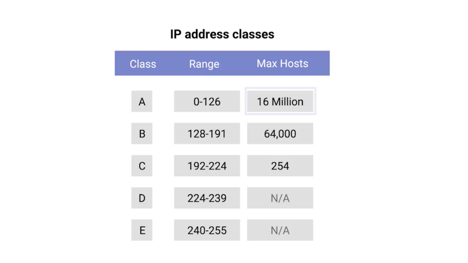

# Table des matières
- [1 Introduction to networking](#introduction-to-networking)
  - [1.1 introduction-to-computer-networking](#introduction-to-computer-networking)
  - [1.2 the-tcp-ip-five-layer-network-model](#the-tcp-ip-five-layer-network-model)
    - [1.2.1 the-tcp-ip-five-layer-network-model](#the-tcp-ip-five-layer-network-model-1)
    - [1.2.2 alex-why-networking](#alex-why-networking)
  - [1.3 the-basics-of-networking-devices](#the-basics-of-networking-devices)
    - [1.3.1 Cables](#cables)
    - [1.3.2 Hubs and switches](#hubs-and-switches)
    - [1.3.3 Routers](#routers)
    - [1.3.4 Servers and clients](#servers-and-clients)
  - [1.4 The physical layer](#the-physical-layer)
    - [1.4.1 Moving bits across the wire](#moving-bits-across-the-wire)
    - [1.4.2 Twisted pair cabling and duplexing](#twisted-pair-cabling-and-duplexing)
    - [1.4.3 Network ports and patch panels](#network-ports-and-patch-panels)
  - [1.5 The data link layer](#the-data-link-layer)
    - [1.5.1 Unicast multicast and broadcast](#unicast-multicast-and-broadcast)
    - [1.5.2 Dissecting an ethernet frame](#dissecting-an-ethernet-frame)

# Introduction to networking

## introduction-to-computer-networking

Welcome to a course two, the bits and bytes of computer networking. You might remember me from the lessons on the internet in the first course, but you also might have jumped ahead, in which case, we're meeting for the first time.

My name is Victor Escobedo and I'm a corporate operations engineer. My passion for IT began way back when I was nine years old and my dad brought home our first computer. He was a mechanical engineer and started using the computer to help him with this CAD work. This was the first time I was exposed to computers and later realized that you could install new software on it, including computer games. As I tinkered with the computer, shortly to my dad's dismay, I became more and more interested in how it worked and eventually started to open up the case and peek inside. I found pieces that could be removed and even something that shouldn't, learning through trial and error along the way. I couldn't really explain what it was, but I just found the mechanics of how it all worked together so fascinating. Looking back, these were the seeds that inspired my career. But you see where I grew up, going to college and pursuing a career wasn't exactly talked about or heavily encouraged. I'm a first generation Mexican-American and there weren't a lot of people I knew pursuing a career in tech. My friends and family were mostly worrying about graduating high school and making sure they had jobs, not really thinking about longer term careers. My school didn't have the resources to offer many technical classes, and even though my father was working in mechanical engineering, computers were a tool to him like a mill, ruler, or hammer. My parents encouraged me to work hard and pursue computers but they couldn't really give me advice about college or a career in tech. To no real fault of their own, they just didn't have the experience necessary. When I decided to go to college, I decided to try my hand at computer science since it could feed my curiosity for how computers worked at a more fundamental level. I realized that having this foundational knowledge really allowed me to understand some of the higher level concepts that were important in a career in IT. So while in school, I took my first job in IT for a small local company. I've been working in IT for 12 years now, with the last seven years being here at Google.

I now work on managing deployments of large internal IT projects for the company, applying the knowledge I've picked up over the years in my initial help-desk role, to make sure that I understand how I'm impacting our users and various support teams. In my role as a corporate operations engineer, I'm responsible for understanding the impact of changes on our corporate infrastructure.

Because of this, networking skills are critical. I need to understand not just how applications work on a single system, but how they interact with all other systems in the company and even externally. So now that you know a bit about me, let's dig into the bits and bytes of networking. Computers communicate with each other a lot like how humans do. Take verbal communication as an example. Two people need to speak the same language and be able to hear each other to communicate effectively. If there are loud noises, one person might have to ask the other person to repeat themselves. If one person only somewhat understands an idea being explained to them, that person might ask for clarification.

One person might address only one other person or they may be speaking to a group. And there's usually a greeting and a way to close the conversation. The point is that humans follow a series of rules when they communicate. And computers have to do the same. This defined set of standards that computers must follow in order to communicate properly is called a protocol.

Computer networking is the name we've given to the full scope of how computers communicate with each other. Networking involves ensuring that computers can hear each other, that they speak protocols other computers can understand, that they repeat messages not fully delivered, and a couple other things, just like how humans communicate.

There are lots of models used to describe the different layers at play with computer networking. But for this course, we've selected the TCPIP five-layer model. We'll also be touching on the other primary network model, the OSI Model, which has seven layers.

If you don't know what these models are or how they work, don't worry. We'll be deep diving into these topics throughout this course. It's super important to know these types of layered models to learn about computer networking because it's a really layered affair. The protocols at each layer carry the ones above them in order to get data from one place to the next.

Think of the protocol used to get data from one end of a networking cable to the other. It's totally different from the protocol you use to get data from one side of the planet to the other. But both of these protocols are required to work at the same time in order for things like the internet and business networks to work the way they do. Sometimes, there are problems when computers on the internet or on these business networks try to communicate with each other and often, it's up to an IT support specialist to fix these problems.

This is why understanding computer networking is so important. By the end of this course, you'll be able to explain all five layers of our model. Not only that. You'll be able to describe how computers determine where to send their messages and how network services like DNS and DHCP work. You'll also be able to use powerful tools to help you troubleshoot network issues. Are you ready? Let's dive in.

## the-tcp-ip-five-layer-network-model

### the-tcp-ip-five-layer-network-model

To really understand networking, we need to understand all of the components involved. We're talking about everything from the cables that connect devices to each other to the protocols that these devices use to communicate. There are a bunch of models that help explain how network devices communicate, but in this course, we will focus on a five-layer model.

By the end of this lesson, you'll be able to identify and describe each layer and what purpose it serves.

Let's start at the bottom of our stack, where we have what's known as the physical layer. The physical layer is a lot like what it sounds. It represents the physical devices that interconnect computers.

This includes the specifications for the networking cables and the connectors that join devices together along with specifications describing how signals are sent over these connections.

The second layer in our model is known as the data link layer. Some sources will call this layer the network interface or the network access layer.

At this layer, we introduce our first protocols. While the physical layer is all about cabling, connectors and sending signals, the data link layer is responsible for defining a common way of interpreting these signals, so network devices can communicate.

Lots of protocols exist at the data link layer, but the most common is known as Ethernet, although wireless technologies are becoming more and more popular.

Beyond specifying physical layer attributes, the Ethernet standards also define a protocol responsible for getting data to nodes on the same network or link.

The third layer, the network layer is also sometimes called the Internet layer.

It's this layer that allows different networks to communicate with each other through devices known as routers.

A collection of networks connected together through routers is an internetwork, the most famous of these being the Internet.

Hopefully you've heard of it. While the data link layer is responsible for getting data across a single link, the network layer is responsible for getting data delivered across a collection of networks. Think of when a device on your home network connects with a server on the Internet. It's the network layer that helps gets the data between these two locations.

The most common protocol used at this layer is known as IP or Internet Protocol. IP is the heart of the Internet and most small networks around the world.

Network software is usually divided into client and server categories, with the client application initiating a request for data and the server software answering the request across the network. A single node may be running multiple client or server applications. So, you might run an email program and a web browser, both client applications, on your PC at the same time, and your email and web server might both run on the same server.

Even so, emails end up in your email application and web pages end up in your web browser. That's because our next layer, the transport layer.

While the network layer delivers data between two individual nodes, the transport layer sorts out which client and server programs are supposed to get that data.

When you heard about our network layer protocol IP, you may have thought of TCP IP, which is a pretty common phrase. That's because the protocol most commonly used in the fourth layer, the transport layer, is known as TCP or Transmission Control Protocol.

While often said together as the phrase TCP IP, to fully understand and troubleshoot networking issues, it's important to know that they're entirely different protocols serving different purposes.

Other transfer protocols also use IP to get around, including a protocol known as UDP or User Datagram Protocol.

The big difference between the two is that TCP provides mechanisms to ensure that data is reliably delivered while UDP does not. Spoiler alert, we will cover differences between the TCP and UDP transfer protocols in more detail later.

For now, it's important to know that the network layer, in our case IP, is responsible for getting data from one node to another.

Also, remember that the transport layer, mostly TCP and UDP, is responsible for ensuring that data gets to the right applications running on those nodes.

Last but not least, the fifth layer is known as the application layer.

There are lots of different protocols at this layer, and as you might have guessed from the name, they are application-specific. Protocols used to allow you to browse the web or send receive email are some common ones. The protocols at play in the application layer will be most familiar to you, since they are ones you probably interacted with directly before even if you didn't realize it.

You can think of layers like different aspects of a package being delivered. The physical layer is the delivery truck and the roads. The data link layer is how the delivery trucks get from one intersection to the next over and over. The network layer identifies which roads need to be taken to get from address A to address B. The transport layer ensures that delivery driver knows how to knock on your door to tell you your package has arrived. And the application layer is the contents of the package itself.

### alex-why-networking

## the-basics-of-networking-devices

### Cables

Lots of different cables and network devices can be used to allow computers to properly communicate with each other. By the end of this lesson, you'll be able to identify and describe various networking cables and networking devices.

Computer Networking is a huge part of the day to day role of many IT Specialists, and knowing how to differentiate different network devices will be essential to your success.

Let's start with the most basic component of a wired network: cables. Cables are what connect different devices to each other allowing data to be transmitted over them.

Most network cables used today can be split into two categories, copper and fiber.

Copper cables are the most common form of networking cable. They're made up of multiple pairs of copper wires inside plastic insulator. You may already know that computers communicate in binary which people represent with ones and zeros.

The sending device communicates binary data across these copper wires by changing the voltage between two ranges. The system at the receiving end is able to interpret these voltage changes as binary ones and zeros which can then be translated into different forms of data.

The most common forms of copper twisted pair cables used in networking are Cat5, Cat5e, and Cat6 cables.

These are all shorthand ways of saying category five or category six cables. These categories have different physical characteristics like the number of twists in the pair of copper wires that result in different usable lengths and transfer rates.

Cat5 is older and has been mostly replaced by Cat5e and Cat6 cables. From the outside, they all look about the same, and even internally, they're very similar to the naked eye. The important thing to know is that differences in how the twisted pairs are arranged inside these cables can drastically alter how quickly data can be sent across them and how resistant these signals are to outside interference.

Cat5e cables have mostly replaced those older Cat5 cables because their internals reduce crosstalk. Crosstalk is when an electrical pulse on one wire is accidentally detected on another wire. So, the receiving end isn't able to understand the data causing a network error.

Higher level protocols have methods for detecting missing data and asking for the data a second time. But of course, this takes up more time. The higher quality specifications of a Cat5e cable make it less likely that data needs to be re-transmitted. That means, on average, you can expect more data to be transferred in the same amount of time.

Cat6 cables follow an even more strict specification to avoid crosstalk, making those cables more expensive. Cat6 cables can transfer data faster and more reliably than Cat5e cables can, but because of their internal arrangement, they have a shorter maximum distance when used at higher speeds.

The second primary form of networking cable is known as Fiber, short for fiber optic cables. Fiber cables contain individual optical fibers which are tiny tubes made out of glass about the width of a human hair.

These tubes of glass can transport beams of light. Unlike copper, which uses electrical voltages, fiber cables use pulses of light to represent the ones and zeros of the underlying data.

Fiber is even sometimes used specifically in environments where there's a lot of electromagnetic interference from outside sources because this can impact data being sent across copper wires. Fiber cables can generally transport data quicker than copper cables can, but they're much more expensive and fragile.

Fiber can also transport data over much longer distances than copper can without suffering potential data loss. Now you know a lot more about the pros and cons of fiber cables, but keep in mind, you'll be way more likely to run into fiber cables in computer data centers than you would in an office or at home.

### Hubs and switches

We're going to do a rundown of network devices in this video and the next one. Almost every IT specialist will have to interact with these sorts of devices on a regular basis.

Cables allow you to form point-to-point networking connections. These are networks where only a single device at each end of the link exists. Not to knock point-to-point networking connections, but they're not super useful in a world with billions of computers. Luckily, there are network devices that allow for many computers to communicate with each other.

The most simple of these devices is a hub. A hub is a physical layer device that allows for connections from many computers at once.

All the devices connected to a hub will end up talking to all other devices at the same time.

It's up to each system connected to the hub to determine if the incoming data was meant for them, or to ignore it if it isn't.

This causes a lot of noise on the network and creates what's called a collision domain. A collision domain is a network segment where only one device can communicate at a time.

If multiple systems try sending data at the same time, the electrical pulses sent across the cable can interfere with each other. This causes these systems to have to wait for a quiet period before they try sending their data again.

It really slows down network communications, and is the primary reason hubs are fairly rare. They're mostly a historical artifact today.

A much more common way of connecting many computers is with a more sophisticated device, known as a network switch, originally known as a switching hub.

A switch is very similar to a hub, since you can connect many devices to it so they can communicate.

The difference is that while a hub is a layer 1 or physical layer device, a switch is a level 2 or data link device.

This means that a switch can actually inspect the contents of the Ethernet protocol data being sent around the network, determine which system the data is intended for and then only send that data to that one system.

This reduces or even completely eliminates the size of collision domains on a network. If you guessed that this will lead to fewer retransmissions and a higher overall throughput, you're right.

### Routers

Hubs and switches are the primary devices used to connect computers on a single network, usually referred to as a LAN, or local area network. But we often want to send or receive data to computers on other networks.

This is where routers come into play. A router is a device that knows how to forward data between independent networks.

While a hub is a layer one device and a switch is a layer two device. A router operates at layer three, a network layer.

Just like a switch can inspect Ethernet data to determine where to send things, a router can inspect IP data to determine where to send things.

Routers store internal tables containing information about how to route traffic between lots of different networks all over the world. The most common type of router you'll see is one for a home network, or a small office. These devices generally don't have very detailed routing tables.

The purpose of these routers is mainly just to take traffic originating from inside the home, or office LAN, and to forward it along to the ISP, or Internet Service Provider.

Once traffic is at the ISP, a way more sophisticated type of router takes over. These core routers form the backbone of the Internet and are directly responsible for how we send and receive data all over the Internet every single day.

Core ISP routers don't just handle a lot more traffic than a home or a small office router. They also have to deal with much more complexity in making decision about where to send traffic. A core router usually has many different connections to many other routers.

Routers share data with each other via a protocol known as BGP, or Border Gateway Protocol.

That lets them learn about the most optimal paths to forward traffic. When you open a web browser and load a webpage, the traffic between computers and the web servers could have traveled over dozens of different routers. The Internet is incredibly large and complicated. And routers are global guides for getting traffic to the right places.

### Servers and clients

All of the network devices you've just learned about, exist so that computers can communicate with each other, whether they're in the same room or thousands of miles apart. We've been calling these devices nodes, and we'll keep doing that, but it's also important to understand the concepts of servers and clients.

The simplest way to think of a server is as something that provides data to something requesting that data. The thing receiving the data is referred to as a client.

While we often talk about nodes being servers or clients, the reason our definition uses a word as vague as something, is because it's not just nodes that can be servers or clients. Individual computer programs running on the same node can be servers and clients to each other too. It's also important to call out that most devices aren't purely a server or a client. Almost all nodes are both at some point in time. Quite the multitasking overachievers.

That all being said, in most network topographies, each node is primarily either a server or a client. Sometimes we refer to an email server as an email server, even though it's itself a client of a DNS server. Why? Because its primary reason for existing is to serve data to clients. Likewise, if a desktop machine occasionally acts as a server in the sense that it provides data to another computer, its primary reason for existing is to fetch data from servers, so that the user at the computer can do their work.

To sum up, a server is anything that can provide data to a client, but we also use the words to refer to the primary purpose of various nodes on our network. Got it? Cool. Now, it's time for a short ungraded quiz to test you on the basics of these networking devices.

## The physical layer

### Moving bits across the wire

In some ways, the physical layer of our network stack model is the most complexible. Its main focus is on moving ones and zeros from one end of the link to the next. But, very complicated mathematics, physics, and electrical engineering principles are at play to transmit huge volumes of data across tiny wires at incredible speeds. Luckily for us, most of that falls within a different realm. What you, an aspiring IT support specialist needs to know about the physical layer is much more approachable. By the end of this lesson, you should have a solid foundation in aspects of the physical layer that will allow you to properly troubleshoot networking issues, and set up new networks.

Let's dive in. The physical layer consists of devices and means of transmitting bits across computer networks.

A bit is the smallest representation of data that a computer can understand. It's a one or a zero.

These ones and zeros sends across networks at the lowest level are what make up the frames and packets of data that we'll learn about when we cover the other layers.

The takeaway is that it doesn't matter whether you're streaming your favorite song, emailing your boss, or using an ATM, what you're really doing is sending ones and zeros across the physical layer of the many different networks between you and the server you're interacting with.

A standard copper network cable, once connected to devices on both ends, will carry a constant electrical charge. Ones and zeros are sent across those network cables through a process called modulation.

Modulation is a way of varying the voltage of this charge moving across the cable.

When used for computer networks, this kind of modulation is more specifically known as line coding.

It allows devices on either end of a link to understand that an electrical charge in a certain state is a zero, and in another state is a one.

Through this seemingly simple techniques, modern networks are capable of moving 10 billion ones and zeros across a single network cable every second.

### Twisted pair cabling and duplexing

The most common type of cabling used for connecting computing devices is known as twisted pair. It's called a twisted pair cable because it features pairs of copper wires that are twisted together.

These pairs act as a single conduit for information, and their twisted nature helps protect against electromagnetic interference and crosstalk from neighboring pairs.

A standard cat six cable has eight wires consisting of four twisted pairs inside a single jacket.

Exactly how many pairs are actually in use depends on the transmission technology being used. But in all modern forms of networking, it's important to know that these cables allow for duplex communication.

Duplex communication is the concept that information can flow in both directions across the cable.

On the flip side, a process called simplex communication is unidirectional.

Think about a baby monitor, where the transmission of data only goes in one direction making it a simplex communication. A phone call on the other hand is duplex since both parties can listen and speak.

The way networking cables ensure that duplex communication is possible is by reserving one or two pairs for communicating in one direction. They then use the other one or two pairs for communicating in the other direction.

So, devices on either side of a networking link can both communicate with each other at the exact same time. This is known as full duplex. If there's something wrong with the connection, you might see a network link degrade and report itself as operating as half-duplex.

Half-duplex means that, while communication is possible in each direction, only one device can be communicating at a time.

### Network ports and patch panels

The final steps of how the physical layer works take place at the end points our network links.

Twisted Pair network cables are terminated with a plug that takes the individual internal wires and exposes them. The most common plug is known as an RJ-45 or Registered Jack 45.

It's one of many cable plugs specifications but by far the most common in computer networking. A network cable with an RJ-45 plug can connect to an RJ-45 network port.

Network ports are generally directly attached to the devices that make up a computer network.

Switches would have many network ports because their purpose is to connect many devices. But servers and desktops usually only have one or two. Your laptop, tablet or phone probably don't have any. But we'll get to wireless networking in the later module.

Most network ports have two small LEDs. One is the link light and the other is the activity light.

The link light will be lit when a cable is properly connected to two devices that are both powered on. The activity light will flash when data is actively transmitted across the cable. A long time ago, the flashing in the activity light corresponded directly to the one's and zero's being sent. Today, computer networks are so fast that the activity light doesn't really communicate much other than if there's any traffic or not.

On switches, sometimes the same LED is used for both link and activity status. It might even indicate other things like links speed. You'll have to read up on a particular piece of hardware you're working with but there will almost always be some troubleshooting data available to you through port lights.

Sometimes a network port isn't connected directly to a device. Instead, there might be network ports mounted in a wall or underneath your desk. These ports are generally connected to the network via cables ran through the walls that eventually end at a patch panel.

A patch panel is a device containing many net ports but it does no other work. It's just a container for the endpoints of many runs of cable.

Additional cables are then generally ran from a patch panel to switches or routers to provide network access to the computers at the other end of those links.

## The data link layer

Wireless and cellular internet access are quickly becoming some of the most common ways to connect computing devices to networks, and it's probably how you're connected right now.

So you might be surprised to hear that traditional cable networks are still the most common option you find in the workplace and definitely in the data center.

The protocol most widely used to send data across individual links is known as Ethernet.

Ethernet and the data link layer provide a means for software at higher levels of the stack to send and receive data. One of the primary purposes of this layer is to essentially abstract away the need for any other layers to care about the physical layer and what hardware is in use.

By dumping this responsibility on the data link layer, the Internet, transport and application layers can all operate the same no matter how the device they're running on is connected.

So, for example, your web browser doesn't need to know if it's running on a device connected via a twisted pair or a wireless connection. It just needs the underlying layers to send and receive data for it.

By the end of this lesson, you'll be able to explain what MAC addresses are and how they're used to identify computers. You'll also know how to describe the various components that make up an Ethernet frame. And you'll be able to differentiate between unicast, multicast and broadcast addresses.

Lastly, you'll be able to explain how cyclical redundancy checks help ensure the integrity of data sent via Ethernet.

Understanding these concepts will help you troubleshoot a variety of problems as an IT support specialist. Warning: a history lesson on old-school technology is headed your way.

Here it goes. Ethernet is a fairly old technology. It first came into being in 1980 and saw its first fully polished standardization in 1983. Since then, a few changes have been introduced primarily in order to support ever-increasing bandwidth needs. For the most part though, the Ethernet in use today is comparable to the Ethernet standards as first published all those years ago.

In 1983, computer networking was totally different than it is today. One of the notable differences in land topology was that the switch or switchable hub hadn't been invented yet. This meant that frequently, many or all devices on a network shared a single collision domain.

You might remember from our discussion about hubs and switches that a collision domain is a network segment where only one device can speak at a time.

This is because all data in a collision domain is sent to all the nodes connected to it. If two computers were to send data across the wire at the same time, this would result in literal collisions of the electrical current representing our ones and zeros, leaving the end result unintelligible.

Ethernet, as a protocol, solved this problem by using a technique known as carrier sense multiple access with collision detection. Doesn't exactly roll off the tongue. We generally abbreviate this to CSMA/CD.

CSMA/CD is used to determine when the communications channels are clear and when the device is free to transmit data.

The way CSMA/CD works is actually pretty simple. If there's no data currently being transmitted on the network segment, a node will feel free to send data. If it turns out that two or more computers end up trying to send data at the same time, the computers detect this collision and stop sending data.

Each device involved with the collision then waits a random interval of time before trying to send data again. This random interval helps to prevent all the computers involved in the collision from colliding again the next time they try to transmit anything.

When a network segment is a collision domain, it means that all devices on that segment receive all communication across the entire segment. This means we need a way to identify which node the transmission was actually meant for. This is where something known as a media access control address or MAC address comes into play.

A MAC address is a globally unique identifier attached to an individual network interface.

It's a 48-bit number normally represented by six groupings of two hexadecimal numbers. Just like how binary is a way to represent numbers with only two digits, hexadecimal is a way to represent numbers using 16 digits.

Since we don't have numerals to represent any individual digit larger than nine, hexadecimal numbers employed the letters A, B, C, D, E, and F to represent the numbers 10, 11, 12, 13, 14, and 15.

Another way to reference each group of numbers in a MAC address is an octet. An octet, in computer networking, is any number that can be represented by 8 bits.

In this case, two hexadecimal digits can represent the same numbers that 8 bits can.

Now, you may have noticed that we mentioned that MAC addresses are globally unique, which might have left you wondering how that could possibly be. The short answer is that a 48-bit number is much larger than you might expect. The total number of a possible MAC addresses that could exist is 2 to the power 48 or 281,474,976,710,656 unique possibilities. That's a whole lot of possibilities.

A MAC address is split into two sections. The first three octets of a MAC address are known as the organizationally unique identifier or OUI.

These are assigned to individual hardware manufacturers by the IEEE or the Institute of Electrical and Electronics Engineers.

This is a useful bit of information to keeping your back pocket because it means that you can always identify the manufacturer of a network interface purely by its MAC address.

The last three octets of MAC address can be assigned in any way that the manufacturer would like with the condition that they only assign each possible address once to keep all MAC addresses globally unique.

Ethernet uses MAC addresses to ensure that the data it sends has both an address for the machine that sent the transmission, as well as the one that the transmission was intended for.

In this way, even on a network segment, acting as a single collision domain, each node on that network knows when traffic is intended for it.

### Unicast multicast and broadcast

So far, we've discussed ways for one device to transmit data to one other device. This is what's known as unicast.

A unicast transmission is always meant for just one receiving address.

At the Ethernet level, this is done by looking at a special bit in the destination MAC address. If the least significant bit in the first octet of a destination address is set to zero, it means that Ethernet frame is intended for only the destination address.

This means it would be sent to all devices on the collision domain, but only actually received and processed by the intended destination.

If the least significant bit in the first octet of a destination address is set to one, it means you're dealing with a multicast frame.

A multicast frame is similarly set to all devices on the local network signal.

What's different is that it will be accepted or discarded by each device depending on criteria aside from their own hardware MAC address.

Network interfaces can be configured to accept lists of configured multicast addresses for these sort of communication.

The third type of Ethernet transmission is known as broadcast.

An Ethernet broadcast is sent to every single device on a LAN. This is accomplished by using a special destination known as a broadcast address. The Ethernet broadcast address is all Fs. Ethernet broadcasts are used so that devices can learn more about each other.

Don't worry, you'll be learning more about broadcast and a technology known as address resolution protocol later in this course.

But for now, let's move on to dissecting the Ethernet frame.

### Dissecting an ethernet frame

To wrap up, we'll round out your understanding of the basics of networking, by dissecting and Ethernet frame. Understanding the networking basics is the first step in building a really strong foundation of networking knowledge that you'll need in IT support.

A data packet is an all-encompassing term that represents any single set of binary data being sent across a network link.

The term data packet isn't tied to any specific layer or technology. It just represents a concept. One set of data being sent from point A to Point B.

Data packets at the Ethernet level are known as Ethernet frames.

An Ethernet frame is a highly structured collection of information presented in a specific order.

This way network interfaces at the physical layer can convert a string of bits, travelling across a link into meaningful data or vice versa. Almost all sections of an Ethernet frame are mandatory and most of them have a fixed size.

The first part of an Ethernet frame is known as the preamble. A preamble is 8 bytes or 64 bits long and can itself be split into two sections.

The first seven bytes are a series of alternating ones and zeros. These act partially as a buffer between frames and can also be used by the network interfaces to synchronize internal clocks they use, to regulate the speed at which they send data.

This last byte in the preamble is known as the SFD or start frame delimiter.

This signals to a receiving device that the preamble is over and that the actual frame contents will now follow.

Immediately following the start frame delimiter, comes the destination MAC address.

This is the hardware address of the intended recipient.

Which is then followed by the source MAC address, or where the frame originated from.

Don't forget that each MAC address is 48 bits or 6 bytes long.

The next part of an Ethernet frame is called the EtherType field.

It's 16 bits long and used to describe the protocol of the contents of the frame.

We'll be doing a deep dive on what these protocols are a little later.

It's worth calling out that instead of the EtherType field, you could also find what's known as a VLAN header.

It indicates that the frame itself is what's called a VLAN frame. If a VLAN header is present, the EtherType field follows it. VLAN stands for virtual LAN. It's a technique that lets you have multiple logical LANs operating on the same physical equipment.

Any frame with a VLAN tag will only be delivered out of a switch interface configured to relay that specific tag. This way you can have a single physical network that operates like it's multiple LANs. VLANs are usually used to segregate different forms of traffic. So you might see a company's IP phones operating on one VLAN, while all desktops operate on another.

After this, you'll find a data payload of an Ethernet frame.

A payload in networking terms is the actual data being transported, which is everything that isn't a header.

The data payload of a traditional Ethernet frame can be anywhere from 46 to 1500 bytes long. This contains all of the data from higher layers such as the IP, transport and application layers that's actually being transmitted.

Following that data we have what's known as a frame check sequence.

This is a 4-byte or 32-bit number that represents a checksum value for the entire frame.

This checksum value is calculated by performing what's known as a cyclical redundancy check against the frame.

A cyclical redundancy check or CRC, is an important concept for data integrity and is used all over computing, not just network transmissions.

A CRC is basically a mathematical transformation that uses polynomial division to create a number that represents a larger set of data. Anytime you perform a CRC against a set of data, you should end up with the same checksum number.

The reason it's included in the Ethernet frame is so that the receiving network interface can infer if it received uncorrupted data. When a device gets ready to send an Internet frame, it collects all the information we just covered, like the destination and originating MAC addresses, the data payload and so on.

Then it performs a CRC against that data and attaches the resulting checksum number as the frame check sequence at the end of the frame. This data is then sent across a link and received at the other end.

Here, all the various fields of the Ethernet frame are collected and now the receiving side performs a CRC against that data.

If the checksum computed by the receiving end doesn't match the checksum in the frame check sequence field, the data is thrown out. This is because some amount of data must have been lost or corrupted during transmission. It's then up to a protocol at a higher layer to decide if that data should be retransmitted.

Ethernet itself only reports on data integrity. It doesn't perform data recovery. You've gotten the basics of networking now, nice work. Next up is a quiz. You got this, but even if you don't, just review the material until you get more comfortable with this stuff.
