# Table des matières
- [1 Introduction to networking](#introduction-to-networking)
- [2 The network layer](#the-network-layer)
- [3 Transport layer and application layer](#transport-layer-and-application-layer)
  - [3.1 Introduction to the transport and application layers](#introduction-to-the-transport-and-application-layers)
  - [3.2 The transport layer](#the-transport-layer)
    - [3.2.1 The transport layer](#the-transport-layer-1)
    - [3.2.2 Dissection of a TCP segment](#dissection-of-a-tcp-segment)
    - [3.2.3 TCP control flags and the three way handshake](#tcp-control-flags-and-the-three-way-handshake)
    - [3.2.4 TCP socket states](#tcp-socket-states)
    - [3.2.5 Connection oriented and connectionless oriented protocols](#connection-oriented-and-connectionless-oriented-protocols)
    - [3.2.6 Firewalls](#firewalls)
  - [3.3 The application layer](#the-application-layer)
    - [3.3.1 The application layer](#the-application-layer-1)
    - [3.3.2 The application layer and the OSI model](#the-application-layer-and-the-osi-model)
    - [3.3.3 All layers working in unison](#all-layers-working-in-unison)

# Introduction to networking

# The network layer

# Transport layer and application layer

## Introduction to the transport and application layers

The first three layers of our Network Model have helped us describe how individual nodes on a network can communicate with other nodes on either their own network or a remote one. But we haven't discussed how individual computer programs can communicate with each other.

It's time to dive into this, because that's really the aim of computer networking. We network computers together, not just so they can send data to each other, but because we want programs running on those computers to be able to send data to each other.

This is where the Transport and Application layers of our networking model come into play. In short, the Transport layer allows traffic to be directed to specific network applications.

And the Application layer allows these applications to communicate in a way they understand.

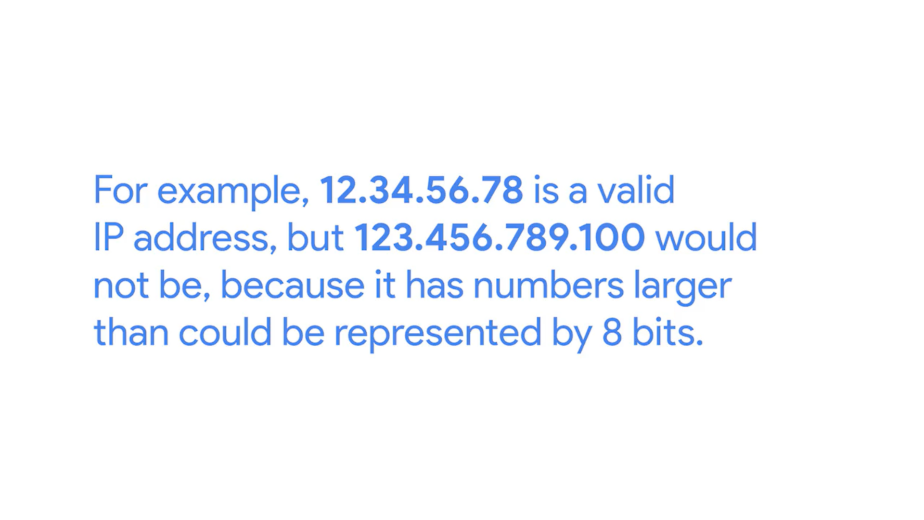

By the end of this module, you'll be able to describe TCP ports and sockets and identify the different components of a TCP header.

You'll also be able to show the difference between connection oriented, and connection lists protocols, and explain how TCP is used to ensure data integrity. Are you ready to be transported to the next lesson? I hope so, because the Transport layer is up next. See you there.

## The transport layer

### The transport layer

The transport layer is responsible for lots of important functions of reliable computer networking. These include multiplexing and demultiplexing traffic, establishing long running connections and ensuring data integrity through error checking and data verification.

By the end of this lesson you should be able to describe what multiplexing and demultiplexing are, and how they work. You'll be able to identify the differences between TCP and UDP, explain the three way handshake, and understand how TCP flags are used in this process. Finally, you'll be able to describe the basics of how firewalls keep networks safe.

The transport layer has the ability to multiplex and demultiplex, which sets this layer apart from all others. Multiplexing in the transport layer means that nodes on the network have the ability to direct traffic toward many different receiving services.

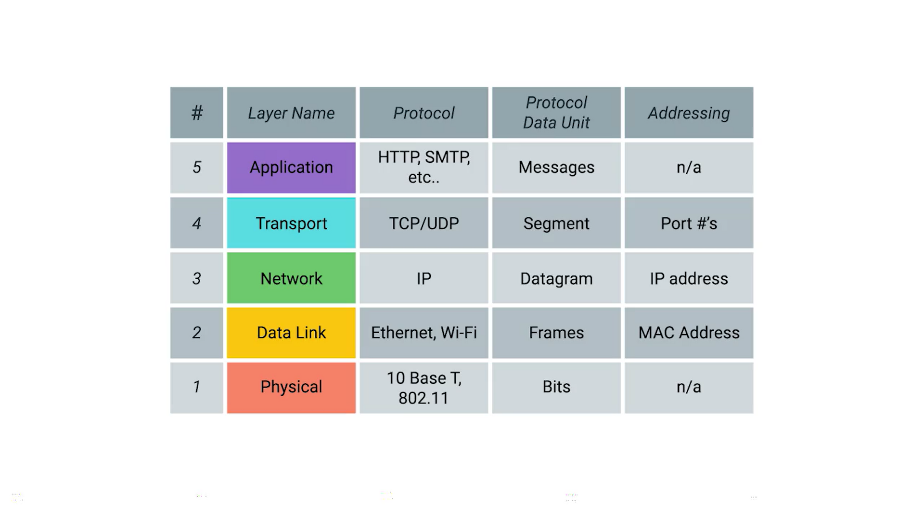

Demultiplexing is the same concept, just at the receiving end, it's taking traffic that's all aimed at the same node and delivering it to the proper receiving service.

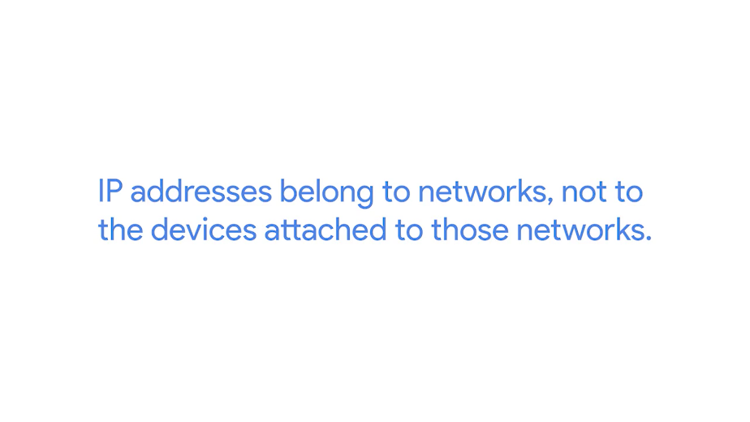

The transport layer handles multiplexing and demultiplexing through ports. A port is a 16-bit number that's used to direct traffic to specific services running on a networked computer.

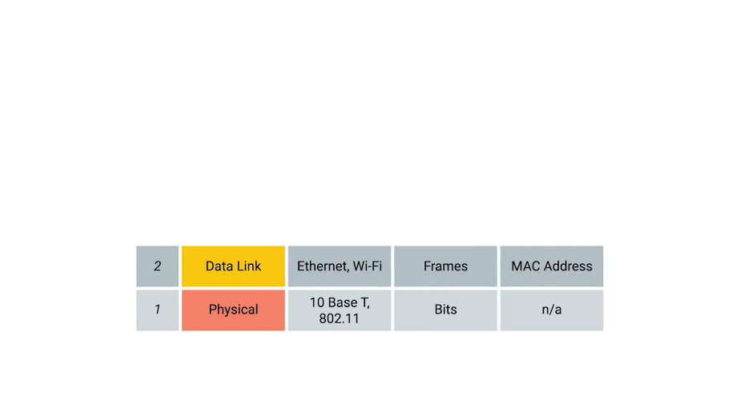

Remember the concept of server and clients? A server or service is a program running on a computer waiting to be asked for data. A client is another program that is requesting this data. Different network services run while listening on specific ports for incoming requests.

For example, the traditional port for HTTP or unencrypted web traffic is port 80.

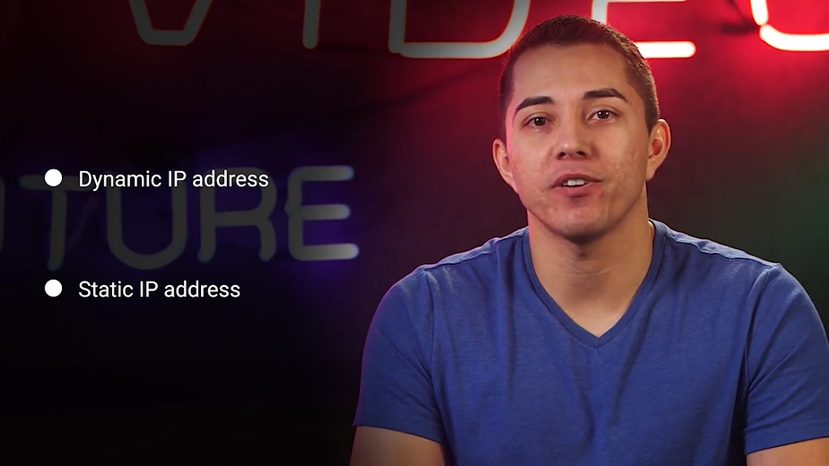

If we want tor request the webpage from a web server running on a computer listening on IP 10.1.1.100, the traffic would be directed to port 80 on that computer.

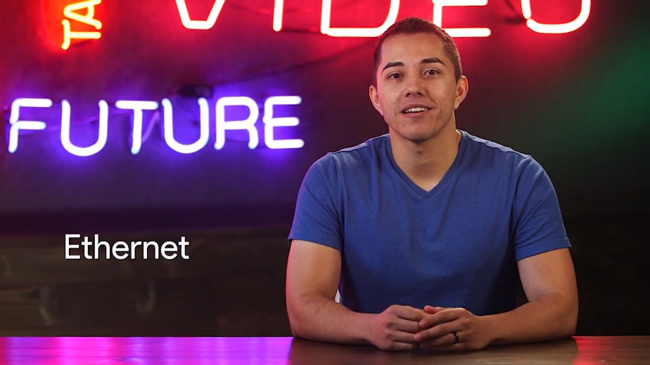

Ports are normally denoted with a colon after the IP address. So the full IP and port in this scenario could be described as 10.1.1.100:80.

When written this way, it's known as a socket address or socket number.

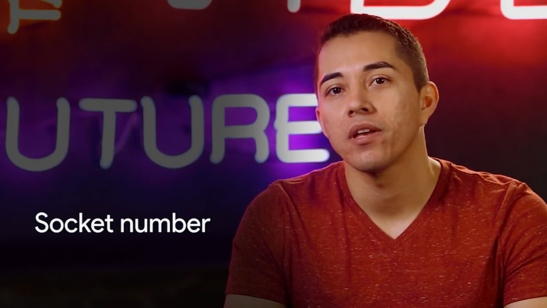

The same device might also be running an FTP or file transfer protocol server.

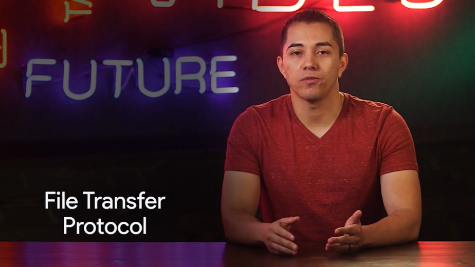

FTP is an older method used for transferring files from one computer to another, but you still see it in use today. FTP traditionally listens on port 21, so if you wanted to establish a connection to an FTP server running on the same IP that our example web server was running on, you direct traffic to 10.1.1.100 port 21.

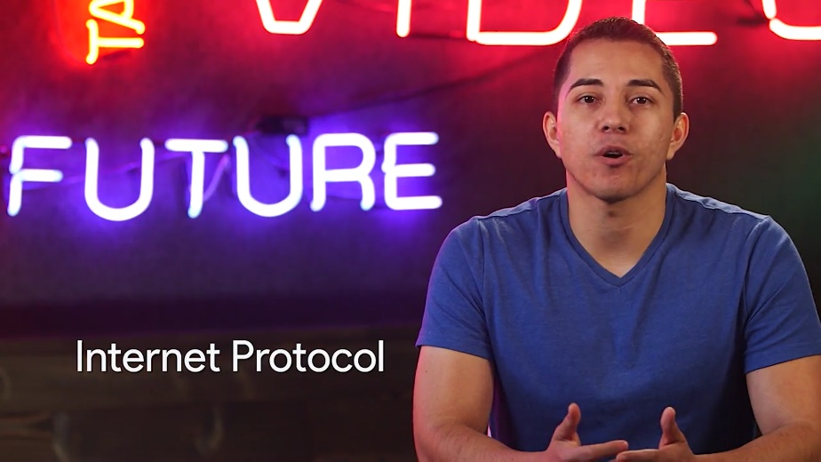

You might find yourself working in IT support at a small business. In these environments, a single server could host almost all of the applications needed to run a business. The same computer might host an internal website, the mail server for the company, file server for sharing files, a print server for sharing network printers, pretty much anything. This is all possible because of multiplexing and demultiplexing, and the addition of ports to our addressing scheme.

### Dissection of a TCP segment

Heads up. In this video, we're going to dissect a TCP segment. In IT support, if network traffic isn't behaving as users expect it to, you might have to analyze it closely to troubleshoot. So, get ready to take a peek at all the inner workings.

Just like how an Ethernet frame encapsulates an IP datagram, an IP datagram encapsulates a TCP segment.

- Remember that an Ethernet frame has a payload section which is really just the entire contents of an IP datagram.

- Remember also that an IP datagram has a payload section and this is made up of what's known as a TCP segment.

- A TCP segment is made up of a TCP header and a data section. This data section, as you might guess, is just another payload area for where the application layer places its data.

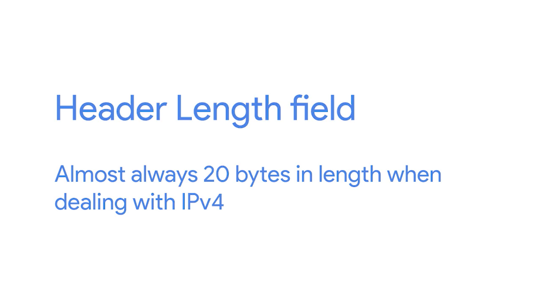

A TCP header itself is split into lots of fields containing lots of information.

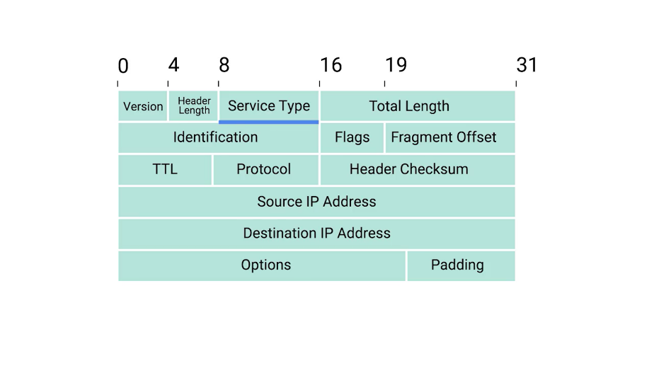

First, we have the source port and the destination port fields. The destination port is the port of the service the traffic is intended for, which we talked about in the last video. A source port is a high numbered port chosen from a special section of ports known as ephemeral ports. We'll cover ephemeral ports in more detail in a little bit.

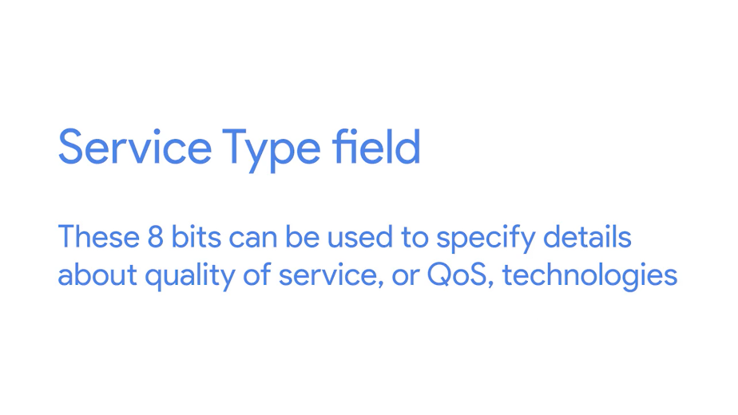

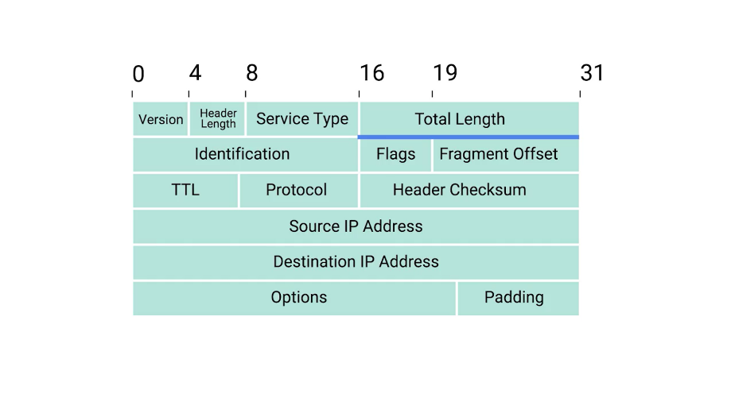

For now, it's enough to know that a source port is required to keep lots of outgoing connections separate. You know how a destination port, say port 80, is needed to make sure traffic reaches a web server running on a certain IP?

Similarly, a source port is needed so that when the web server replies, the computer making the original request can send this data to the program that was actually requesting it. It is in this way that when it web server responds to your requests to view a webpage that this response gets received by your web browser and not your word processor.

Next up is a field known as the sequence number. This is a 32-bit number that's used to keep track of where in a sequence of TCP segments this one is expected to be.

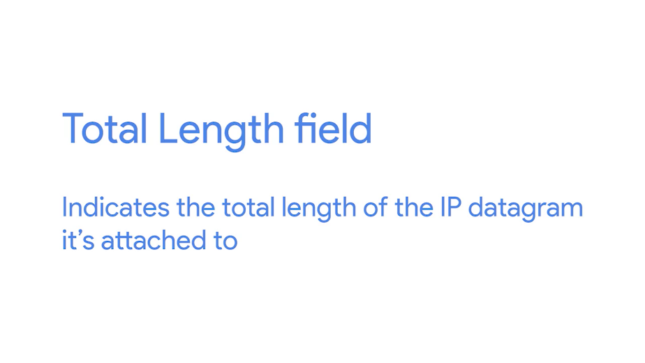

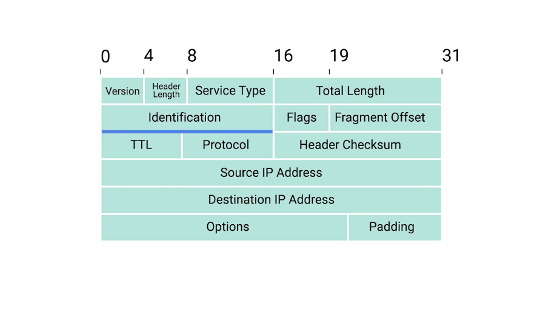

You might remember that lower on our protocol stack, there are limits to the total size of what we send across the wire. In Ethernet frame, it's usually limited in size to 1,518 bytes, but we usually need to send way more data than that. At the transport layer, TCP splits all of this data up into many segments. The sequence number in a header is used to keep track of which segment out of many this particular segment might be.

The next field, the acknowledgment number, is a lot like the sequence number. The acknowledgment number is the number of the next expected segment. In very simple language, a sequence number of one and an acknowledgement number of two could be read as this is segment one, expect segment two next.

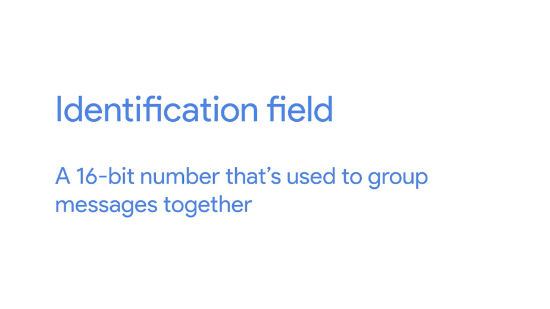

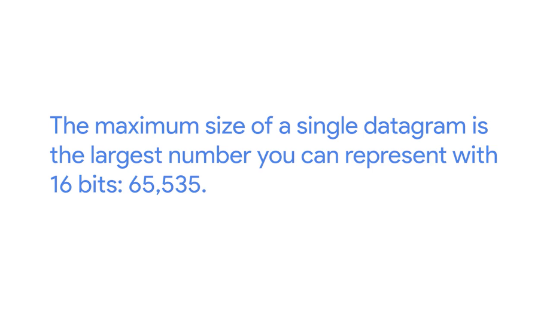

The data offset field comes next. This field is a four-bit number that communicates how long the TCP header for this segment is. This is so that the receiving network device understands where the actual data payload begins.

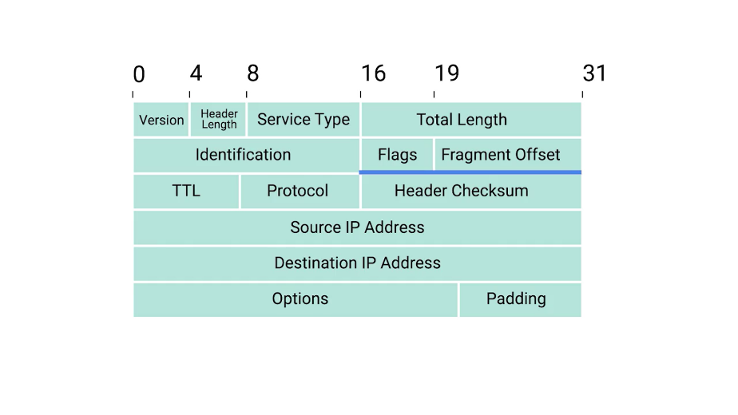

Then, we have six bits that are reserved for the six TCP control flags. We'll cover the control flags and what they each mean in the next video, so flag this for later.

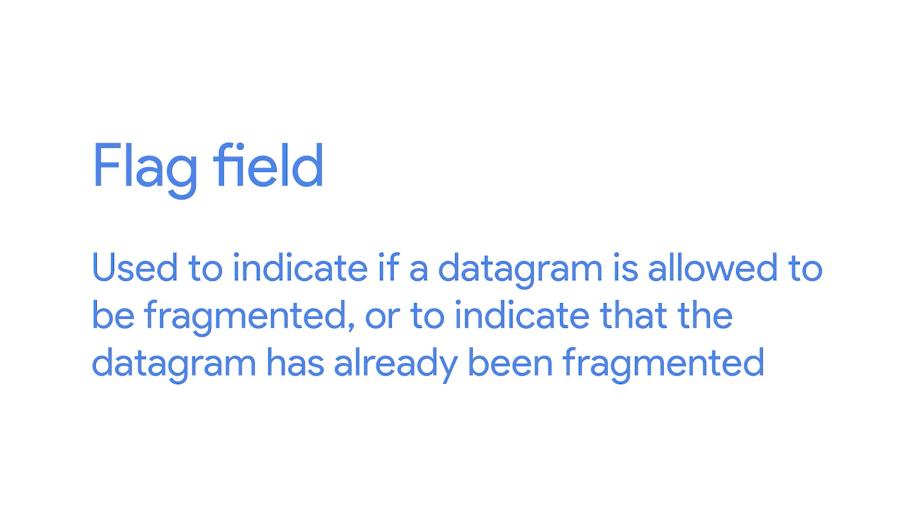

The next field is a 16-bit number known as the TCP window. A TCP window specifies the range of sequence numbers that might be sent before an acknowledgement is required. As we'll cover in more details soon, TCP is a protocol that's super reliant on acknowledgements. This is done in order to make sure that all expected data is actually being received and that the sending device doesn't waste time sending data that isn't being received.

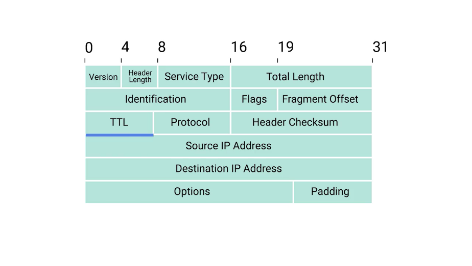

The next field is a 16-bit checksum. It operates just like the checksum fields at the IP and Ethernet level. Once all of this segment has been ingested by a recipient, the checksum is calculated across the entire segment and is compared with the checksum in the header to make sure that there was no data lost or corrupted along the way.

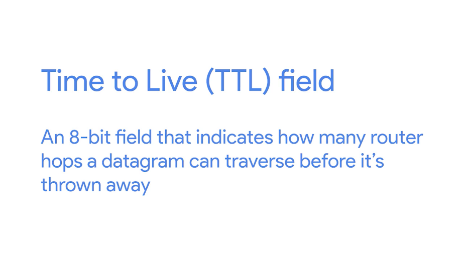

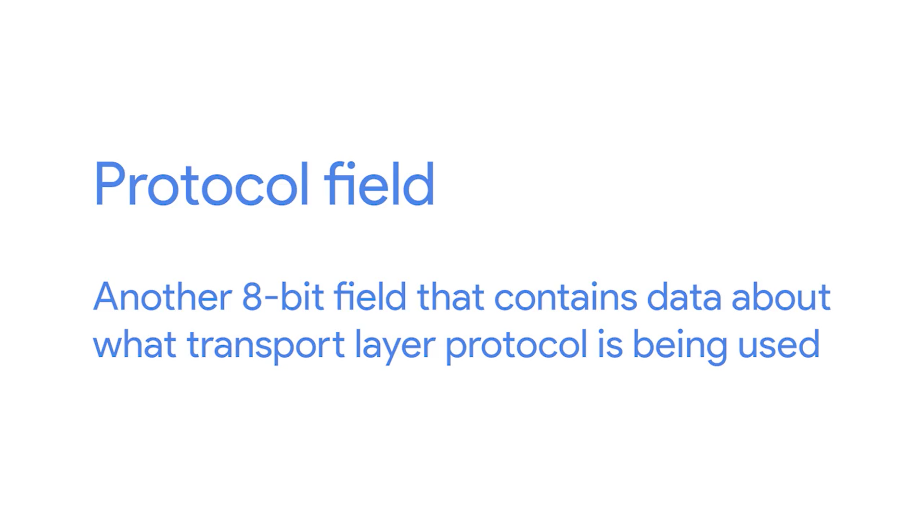

The Urgent pointer field is used in conjunction with one of the TCP control flags to point out particular segments that might be more important than others. This is a feature of TCP that hasn't really ever seen adoption and you'll probably never find it in modern networking. Even so, it's important to know what all sections of the TCP header are.

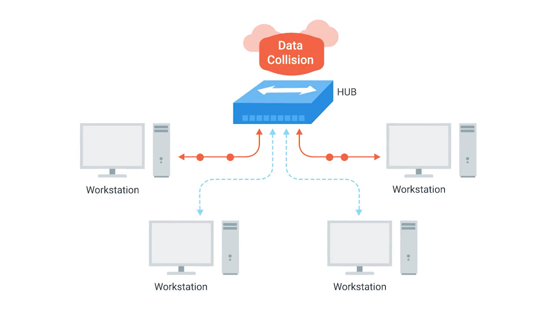

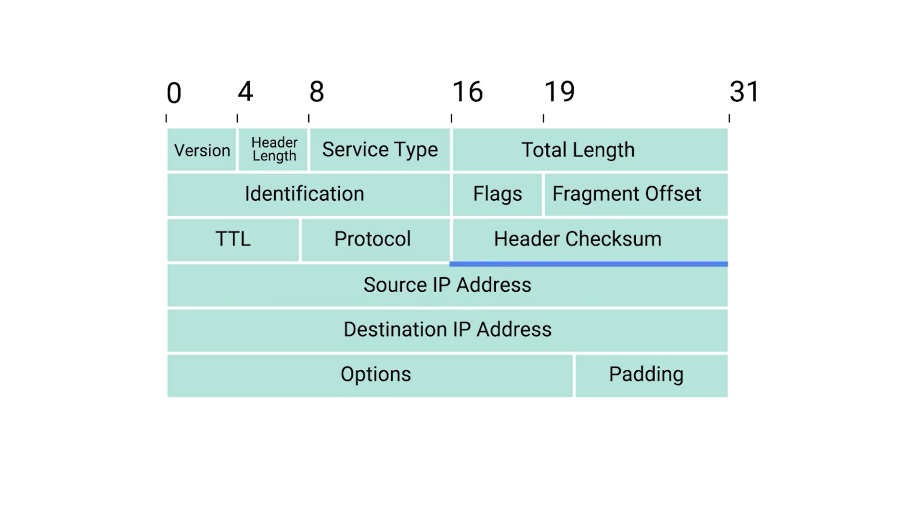

Next up, we have the options field. Like the urgent pointer field, this is rarely used in the real world, but it's sometimes used for more complicated flow control protocols.

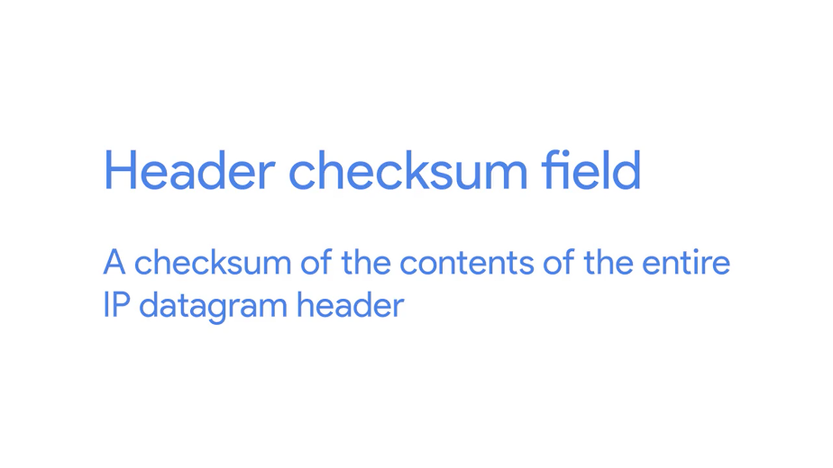

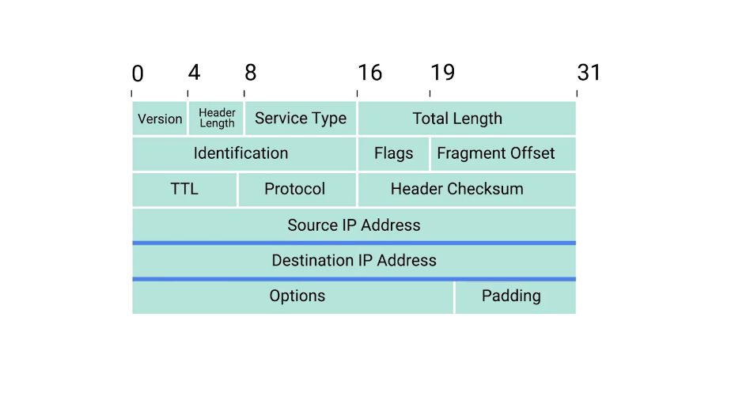

Finally, we have some padding which is just a sequence of zeros to ensure that the data payload section begins at the expected location.

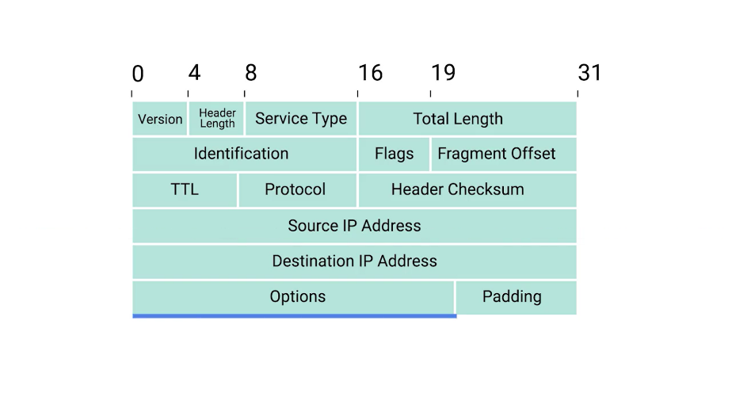

### TCP control flags and the three way handshake

As a protocol, TCP establishes connections used to send long chains of segments of data. You can contrast this with the protocols that are lower in the networking model. These include IP and Ethernet, which just send individual packets of data. As an IT support specialist, you need to understand exactly how that works, so you can troubleshoot issues, where network traffic may not be behaving in the expected manner.

The way TCP establishes a connection, is through the use of different TCP control flags, used in a very specific order. Before we cover how connections are established and closed, let's first define the six TCP control flags. We'll look at them in the order that they appear in a TCP header.

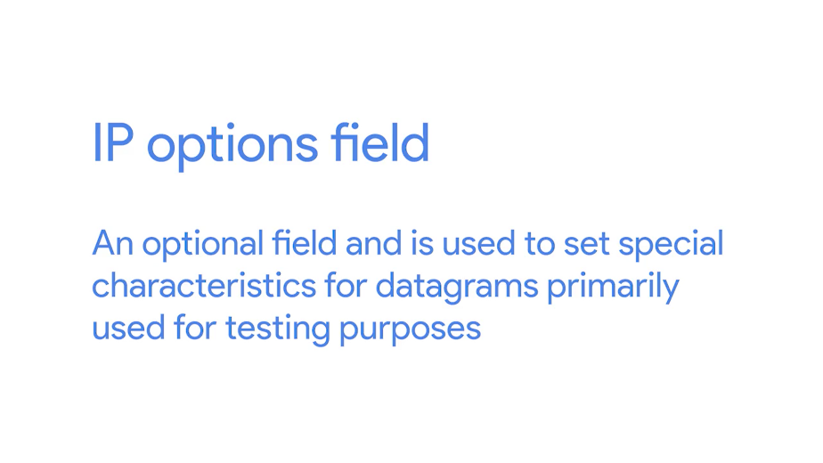

Heads up. This isn't necessarily in the same order of how frequently they're set, or how important they are. The first flag is known as URG, this is short for Urgent. A value of one here indicates that the segment is considered urgent and that the urgent pointer field has more data about this.

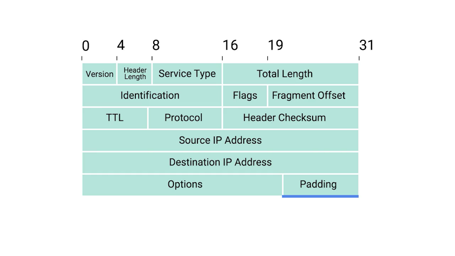

Like we mentioned in the last video, this feature of TCP has never really had wide spreaded option and isn't normally seen.

The second flag is ACK, short for acknowledge. A value of one in this field means that the acknowledgment number field should be examined.

The third flag is PSH, which is short for Push. This means, that the transmitting device wants the receiving device to push currently- buffered data to the application on the receiving end as soon as possible.

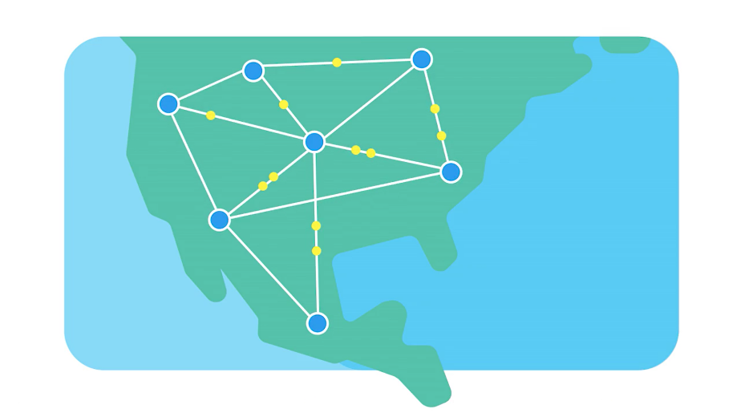

A buffer is a computing technique, where a certain amount of data is held somewhere, before being sent somewhere else. This has lots of practical applications. In terms of TCP, it's used to send large chunks of data more efficiently. By keeping some amount of data in a buffer, TCP can deliver more meaningful chunks of data to the program waiting for it. But in some cases, you might be sending a very small amount of information, that you need the listening program to respond to immediately. This is what the push flag does.

The Fourth flag is RST, short for Reset. This means, that one of the sides in a TCP connection hasn't been able to properly recover from a series of missing or malformed segments. It's a way for one of the partners in a TCP connection to basically say, "Wait, I can't put together what you mean, let's start over from scratch."

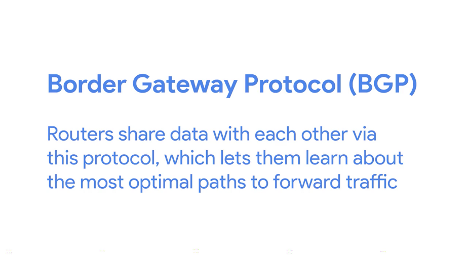

The fifth flag is SYN, which stands for Synchronize. It's used when first establishing a TCP connection and make sure the receiving end knows to examine the sequence number field.

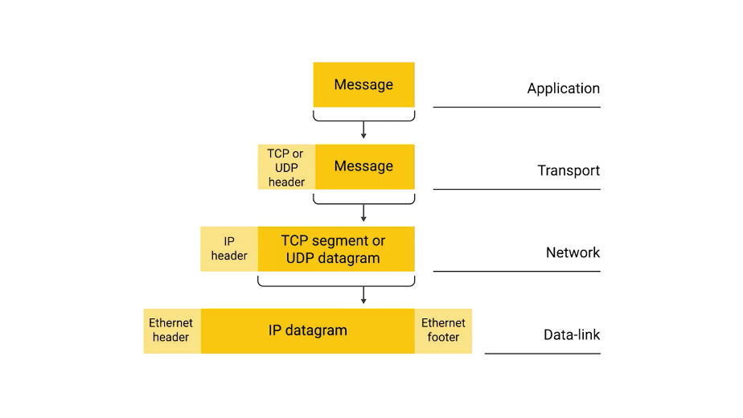

And finally, our six flag is FIN, which is short for Finish. When this flag is set to one, it means the transmitting computer doesn't have any more data to send and the connection can be closed.

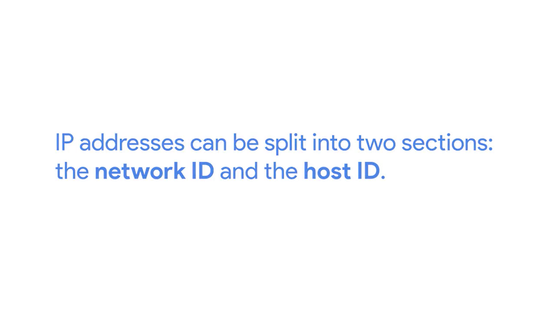

For a good example of how TCP control flags are used, let's check out how a TCP connection is established.

Computer A will be our transmitting computer and computer B will be our receiving computer.

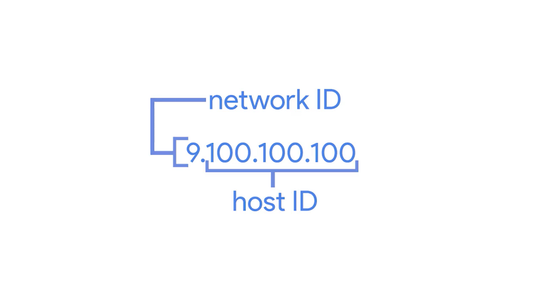

To start the process off, computer A, sends a TCP segment to computer B with this SYN flag set. This is computer A's way of saying, "Let's establish a connection and look at my sequence number field, so we know where this conversation starts." Computer B then responds with a TCP segment, where both the SYN and ACK flags are set. This is computer B's way of saying, "Sure, let's establish a connection and I acknowledge your sequence number."

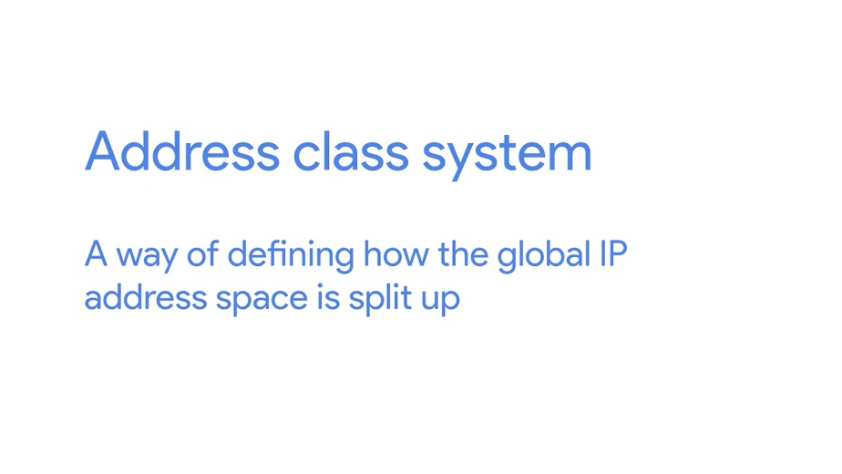

Then computer A responds again with just the ACK flag set, which is just saying, "I acknowledge your acknowledgement. Let's start sending data." I love how polite they are to each other.

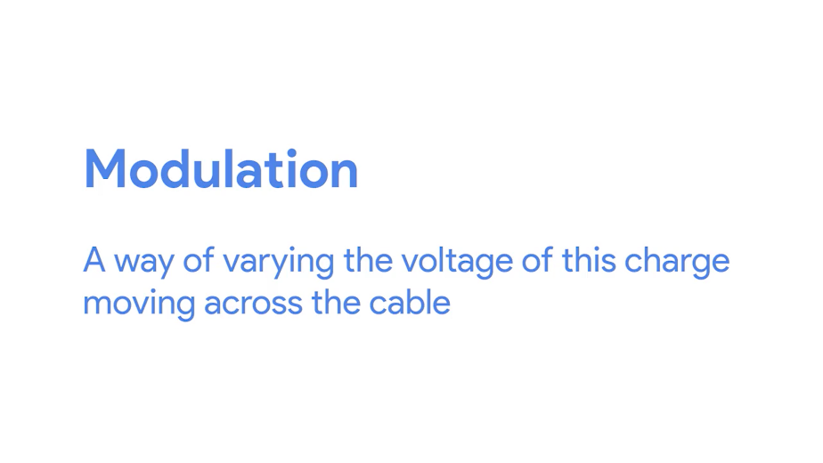

This exchange involving segments that have SYN, SYN/ACK and ACK sets, happens every single time a TCP connection is established anywhere. And is so famous that it has a nickname.

The three way handshake. A handshake is a way for two devices to ensure that they're speaking the same protocol and will be able to understand each other.

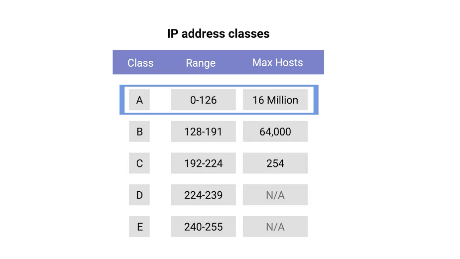

Once the three way handshake is complete, the TCP connection is established. Now, computer A is free to send whatever data it wants to computer B and vice versa. Since both sides have now sent SYN/ACK pairs to each other, a TCP connection in this state is operating in full duplex. Each segment sent in either direction should be responded to by TCP segment with the ACK field set. This way, the other side always knows what has been received.

Once one of the devices involved with the TCP connection is ready to close the connection, something known as a four way handshake happens.

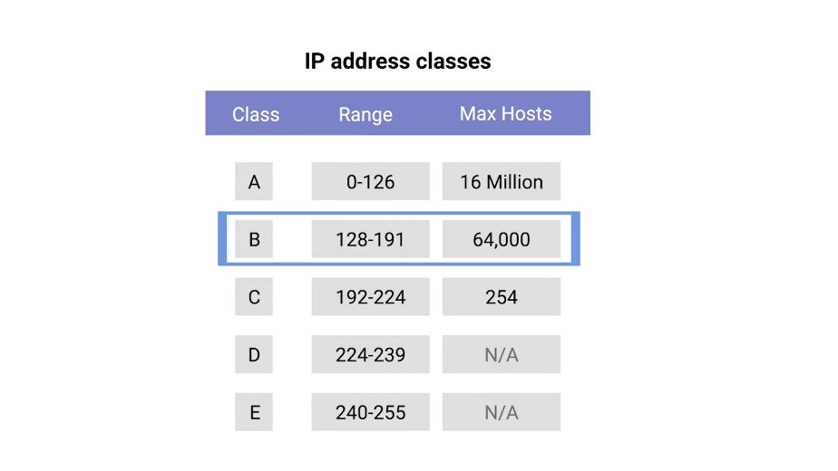

The computer ready to close the connection, sends a FIN flag, which the other computer acknowledges with an ACK flag. Then, if this computer is also ready to close the connection, which will almost always be the case. It will send a FIN flag. This is again responded to by an ACK flag.

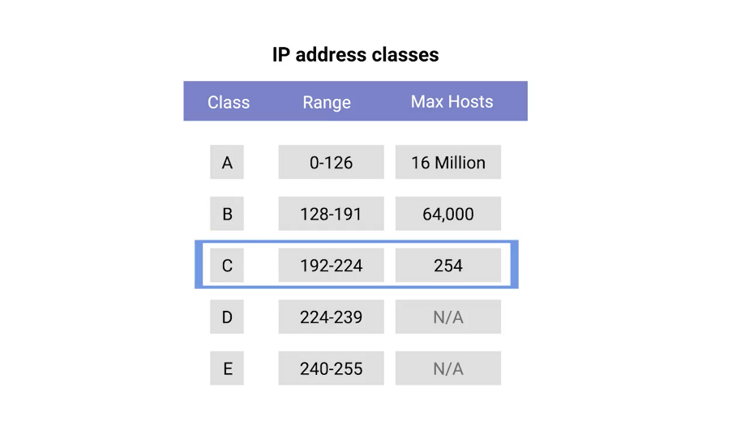

Hypothetically, a TCP connection can stay open in simplex mode with only one side closing the connection. But this isn't something you'll run into very often. Up next, I'll sock it to you, with information on TCP socket states. So many networking puns. Okay. See you there.

### TCP socket states

A socket is the instantiation of an endpoint in a potential TCP connection. An instantiation is the actual implementation of something defined elsewhere.

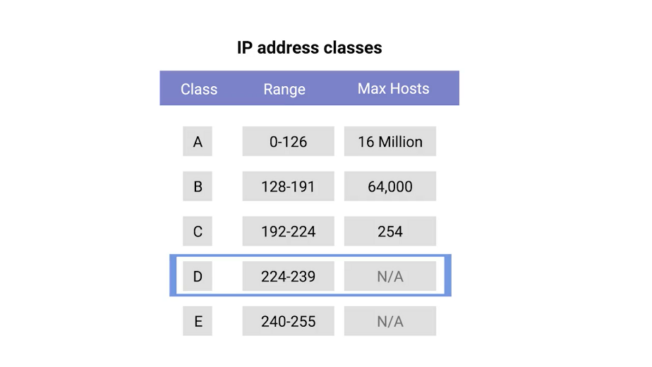

TCP sockets require actual programs to instantiate them. You can contrast this with a port which is more of a virtual descriptive thing.

In other words, you can send traffic to any port you want, but you're only going to get a response if a program has opened a socket on that port. TCP sockets can exist in lots of states. And being able to understand what those mean will help you troubleshoot network connectivity issues as an IT support specialist. We'll cover the most common ones here.

LISTEN. Listen means that a TCP socket is ready and listening for incoming connections. You'd see this on the server side only.

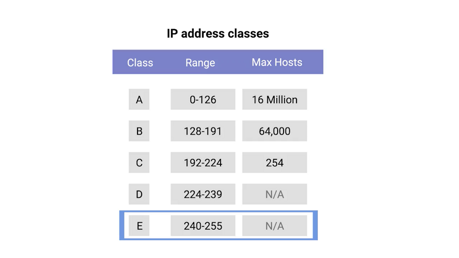

SYN_SENT. This means that a synchronization request has been sent, but the connection hasn't been established yet. You'd see this on the client side only.

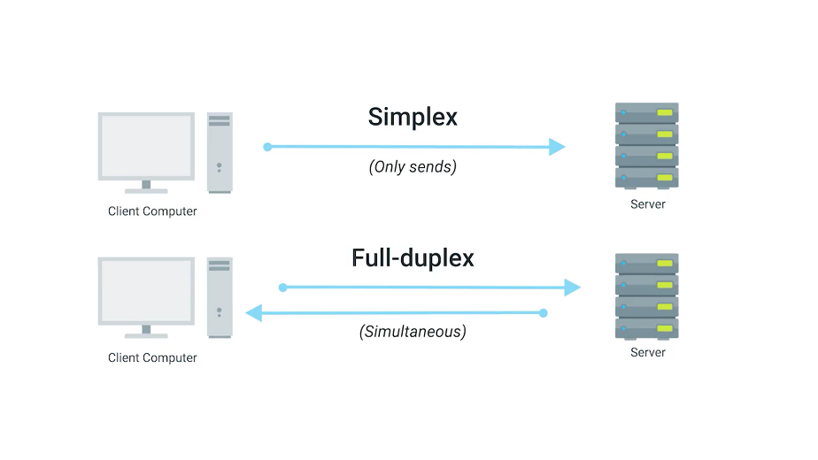

SYN_RECEIVED. This means that a socket previously in a listener state, has received a synchronization request and sent a SYN_ACK back. But it hasn't received the final ACK from the client yet. You'd see this on the server side only.

ESTABLISHED. This means that the TCP connection is in working order, and both sides are free to send each other data. You'd see this state on both the client and server sides of the connection. This will be true of all the following socket states, too. So keep that in mind.

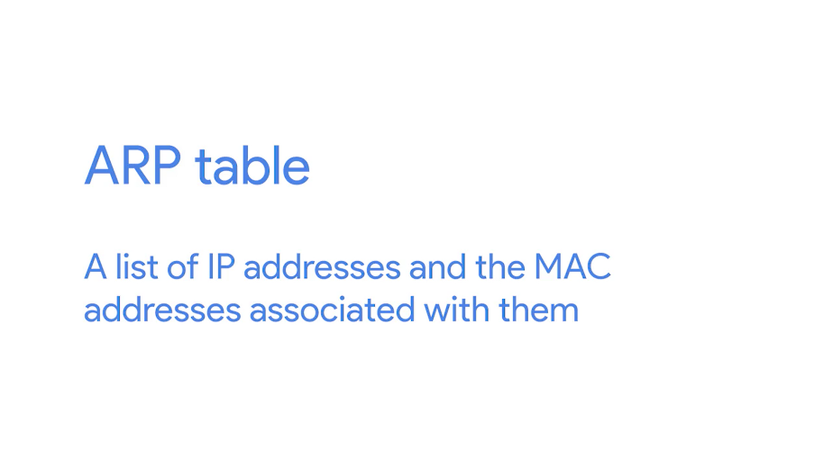

FIN_WAIT. This means that a FIN has been sent, but the corresponding ACK from the other end hasn't been received yet.

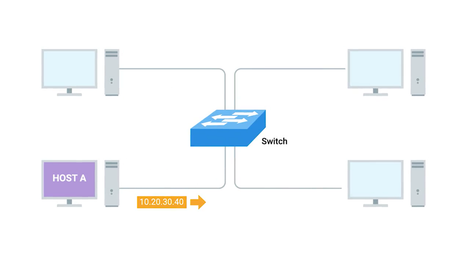

CLOSE_WAIT. This means that the connection has been closed at the TCP layer, but that the application that opened the socket hasn't released its hold on the socket yet.

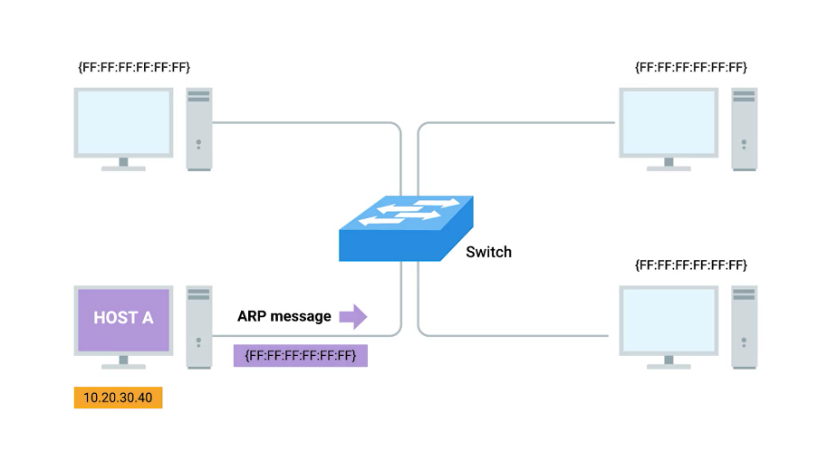

CLOSED. This means that the connection has been fully terminated, and that no further communication is possible.

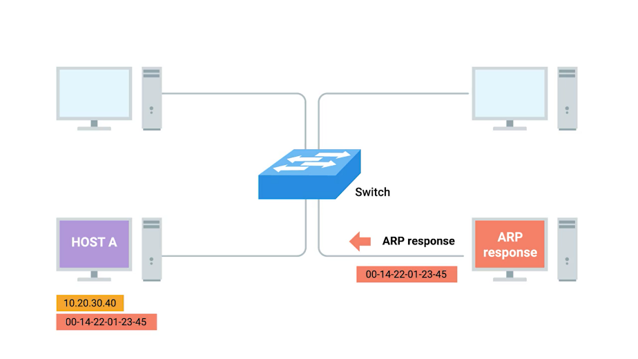

There are other TCP socket states that exist. Additionally, socket states and their names, can vary from operating system to operating system. That's because they exist outside of the scope of the definition of TCP itself.

TCP, as a protocol, is universal in how it's used since every device speaking to TCP protocol has to do this in the exact same way for communications to be successful. Choosing how to describe the states of a socket at the operating system level isn't quite as universal.

When troubleshooting issues at the TCP layer, make sure you check out the exact socket state definitions for the systems you're working with.

### Connection oriented and connectionless oriented protocols

So far, we have mostly focused on TCP which is a connection-oriented protocol. A connection-oriented protocol is one that establishes a connection, and uses this to ensure that all data has been properly transmitted.

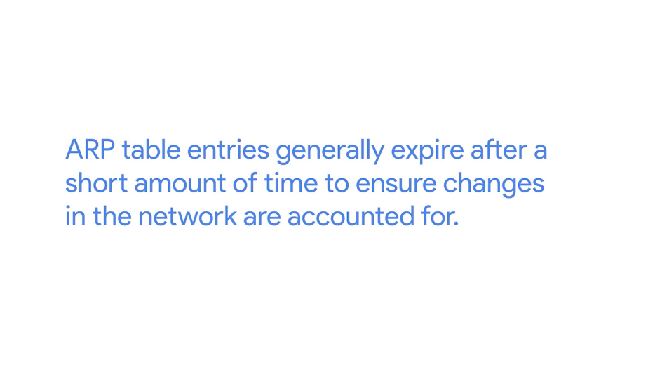

A connection at the transport layer implies that every segment of data sent is acknowledged. This way, both ends of the connection always know which bits of data have definitely been delivered to the other side and which haven't.

Connection-oriented protocols are important because the Internet is a vast and busy place, and lots of things could go wrong while trying to get data from point A to point B.

You might remember from our lesson about the physical air that even some minor crosstalk from a neighboring twisted pair in the same cable can be enough to make a cyclical redundancy check fail. This could cause the entire frame to be discarded. Yikes.

If even a single bit doesn't get transmitted properly, the resulting data is often incomprehensible by the receiving end. And remember that at the lowest level, a bit is just an electrical signal within a certain voltage range.

But there are plenty of other reasons why traffic might not reach its destination beyond liners. It could be anything. Pure congestion might cause a router to drop your traffic in favor of forwarding more important traffic, or a construction company could cut a fiber cable connecting two YSPs. Anything's possible.

Connection-oriented protocols like TCP protect against this by forming connections and through the constant stream of acknowledgements. Our protocols at lower levels of our network model like IP and Ethernet do use checksums to ensure that all the data they received was correct. But did you notice that we never discussed any attempts to resending data that doesn't pass this check? That's because that's entirely up to the transport layer protocol.

At the IP or Ethernet level, if a checksum doesn't compute, all of that data is just discarded. It's up to TCP to determine when to resend this data since TCP expects an ACK for every bit of data it sends, it's in the best position to know what data successfully got delivered and it can make the decision to resend a segment if needed.

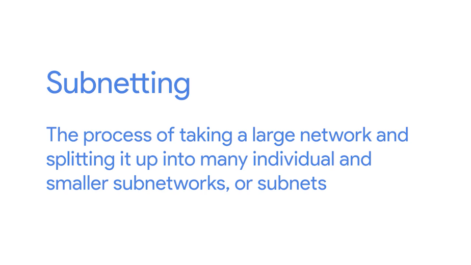

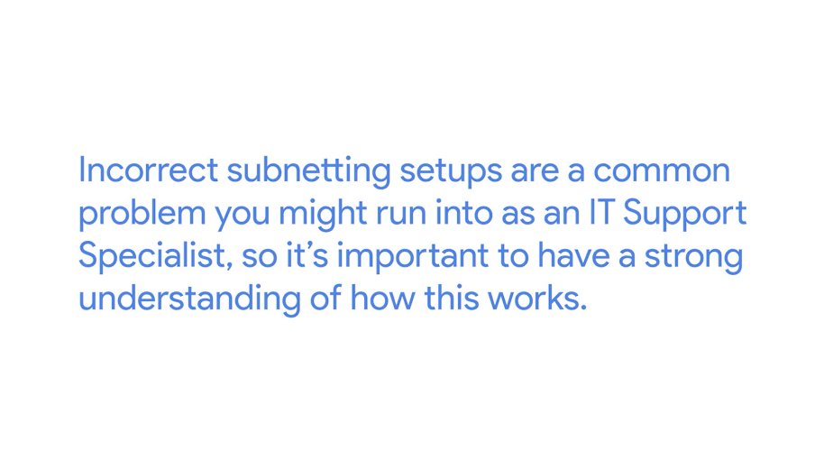

This is another reason why sequence numbers are so important. While TCP will generally send all segments in sequential order, they may not always arrive in that order. If some of the segments had to be resend due to errors at lower layers, it doesn't matter if they arrive slightly out of order. This is because sequence numbers allow for all of the data to be put back together in the right order. It's pretty handy.

Now, as you might have picked up on, there's a lot of overhead with connection-oriented protocols like TCP. You have to establish the connection, you have to send a stream of constant streams of acknowledgements, you have to tear the connection down at the end. That all accounts for a lot of extra traffic.

While this is important traffic, it's really only useful if you absolutely positively have to be sure your data reaches its destination. You can contrast this with connectionless protocols. The most common of these is known as UDP, or User Datagram Protocol.

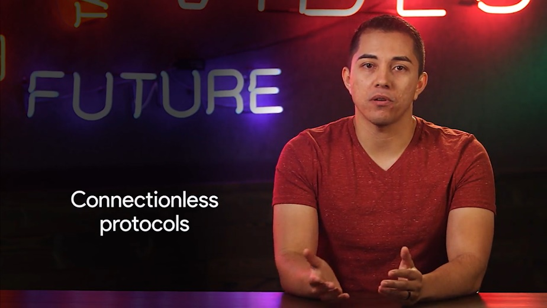

Unlike TCP, UDP doesn't rely on connections and it doesn't even support the concept of an acknowledgement. With UDP, you just set a destination port and send the packet. This is useful for messages that aren't super important.

A great example of UDP is streaming video. Let's imagine that each UDP datagram is a single frame of a video. For the best viewing experience, you might hope that every single frame makes it to the viewer but it doesn't really matter if a few get lost along the way. A video will still be pretty watchable unless it's missing a lot of its frames.

By getting rid of all the overhead of TCP, you might actually be able to send higher quality video with UDP. That's because you'll be saving more of the available bandwidth for actual data transfer instead of the overhead of establishing connections and acknowledging delivered data segments.

### Firewalls

You know what network device we haven't mentioned that you're probably super familiar with? A firewall. A firewall is just a device that blocks traffic that meets certain criteria. Firewalls are a critical concept to keeping a network secure since they are the primary way you can stop traffic you don't want from entering a network. Firewalls can actually operate at lots of different layers of the network.


There are firewalls that can perform inspection of application layer traffic, and firewalls that primarily deal with blocking ranges of IP addresses. The reason we cover firewalls here is that they're most commonly used at the transportation layer.

Firewalls that operate at the transportation layer will generally have a configuration that enables them to block traffic to certain ports while allowing traffic to other ports.

Let's imagine a simple small business network. The small business might have one server which hosts multiple network services. This server might have a web server that hosts the company's website, while also serving as the file server for a confidential internal document. A firewall placed at the perimeter of the network could be configured to allow anyone to send traffic to port 80 in order to view the web page. At the same time, it could block all access for external IPs to any other port. So that no one outside of the local area network could access the file server.


Firewalls are sometimes independent network devices, but it's really better to think of them as a program that can run anywhere.

For many companies and almost all home users, the functionality of a router and a firewall is performed by the same device.


And firewalls can run on individual hosts instead of being a network device. All major modern operating systems have firewall functionality built-in. That way, blocking or allowing traffic to various ports and therefore to specific services can be performed at the host level as well.


Up next, firing up your brain for a short quiz.

## The application layer

### The application layer

Welcome to our lesson about the application layer. We're almost done covering all aspects of our networking module, which means you've already learned how computers process electrical or optical signals to send communication across a cable, at the physical layer. We've also covered how individual computers can address each other and send each other data using ethernet at the data link layer. We've discussed how the network layer is used by computers and routers to communicate between different networks using IP. And in our last lesson, we covered how the transportation layer ensures that data is received and sent by the proper applications.


You're chock full of layers of new information.

Now, we can finally talk about how those actual applications send and receive data using the application layer. Just like with every other layer, TCP segments have a generic data section to them.


As you might have guessed, this payload section is actually the entire contents of whatever data applications want to send to each other. It could be contents of a web page, if a web browser is connecting to a web server. This could be the streaming video content of your Netflix app on your PlayStation connecting with the Netflix servers. It could be the contents of a document your word processor is sending to a printer. And many more things. There are a lot of protocols used at the application layer, and they are numerous and diverse. At the data link layer, the most common protocol is ethernet. I should call out that wireless technologies do use other protocols at this layer, which we'll cover in a future module. At the network layer, use of IP is everywhere you look. At the transport layer, TCP and UDP cover most of the use cases. But at the application layer, there are just so many different protocols in use, it wouldn't make sense for us to cover them.


Even so, one concept you can take away about application layer protocols is that they're still standardized across application types. Let's dive a little deeper into web servers and web browsers for an example. There are lots of different web browsers. You could be using Chrome, Internet Explorer, Safari, you name it.


They'll need to speak the protocol. The same thing is true for web servers. In this case, the web browser would be the client, and the web server would be the server. The most popular web servers are Microsoft IIS, Apache, and nginx. But they also need to speak the same protocol.


This way, you ensure that no matter which browser you're using, you'd still be able to be speak to any server. For web traffic, the application layer protocol is known as HTTP.


All of these different web browsers and web servers have to communicate using the same HTTP protocol specifications in order to ensure interoperability. The same is true for most other classes of application. You might have dozens of choices for an FTP client, but they all need to speak the FTP protocol in the same way.


### The application layer and the OSI model

In our opening module, we talked about how there are lots of competing network layer models. We've been working from a five-layer model, but you'll probably run into various other models during your career as an IT support specialist. Some models might combine the physical and data link layers into one and only talk about four layers. But you might remember a certain model we called out specifically in a reading section back in the first module.

This is the OSI or Open Systems Interconnection model. This model is important to understand with our five-layer model because it's the most rigorously defined. That means it's often used in academic settings or by various network certification organizations.


The OSI model has seven layers, and introduces two additional layers between our transport layer and our application layer.


The fifth layer in the OSI model is the session layer. The concept of a session layer is that it's responsible for things like facilitating the communication between actual applications and the transport layer. It's the part of the operating system that takes the application layer data that's been unencapsulated from all the layers below it, and hands it off to the next layer in the OSI model, the presentation layer.


The presentation layer is responsible for making sure that the unencapsulated application layer data is actually able to be understood by the application in question. This is the part of an operating system that might handle encryption or compression of data. While these are important concepts to keep in mind, you'll notice that there isn't any encapsulation going on. That's why in our model we lump all of these functions into the application layer.


We believe a five-layer model is the most useful when it comes to the day-to-day business of understanding networking, but the seven-layer OSI model is also prevalent. No networking education would be complete without understanding its basics.


### All layers working in unison

Now that you know the basics of how every layer of out network model works, let's go through an exercise to look at how everything works at every step of the way. Spoiler alert, things are about to get a little geeky, in a good way.

Imagine three networks, network A will contain address space 10.1.1.0/24. Network B Will contain address space 192.168.1.0/24, and network C will be 172.16.1.0/24.


Router A sits between network A and network B. With an interface configured with an IP of 10.1.1.1 on network A, and an interface at 192.168.1.254 on network B. There's a second router, router B, which connects networks B and C. It has an interface on network B with an IP address of 192.168.1.1, and an interface on network C with an IP address of 172.16.1.1.


Now let's put a computer on one of the networks. Imagine it's a desktop, sitting on someone's desk at the workplace. It'll be our client in this scenario, and we'll refer to it as computer 1. It's part of Network A and has been assigned an IP address of 10.1.1.100.

Now, let's put another computer on one of our other networks. This one is a server in a data center, it'll act as our server in this scenario, and we'll refer to it as computer 2. It's part of network C, and has been assigned an IP address of 172.16.1.100, and has a web server listening on port 80.


An end user sitting at computer 1 opens up a web browser and enters 172.16.1.100 into the address bar, let's see what happens.

The web browser running on computer 1 knows it's been ordered to retrieve a web page from 172.16.1.100. The web browser communicates with the local networking stack, which is the part of the operating system responsible for handling networking functions. The web browser explains that it's going to want to establish a TCP connection to 172.16.1.100, port 80.


The networking stack will now examine its own subnet. It sees that it lives on the network 10.1.1.0/24, which means that the destination 172.16.1.100 is on another network.


At this point, computer 1 knows that it'll have to send any data to its gateway for routing to a remote network. And it's been configured with a gateway of 10.1.1.1.

Next, computer 1 looks at its ARP table to determine what MAC address of 10.1.1.1 is, but it doesn't find any corresponding entry.


Uh-oh, it's okay, computer A crafts an ARP request for an IP address of 10.1.1.1, which it sends to the hardware broadcast address of all Fs.


This ARP discovery request is sent to every node on the local network.


When router A receives this ARP message, it sees that it's the computer currently assigned the IP address of 10.1.1.1.


So it responds to computer 1 to let it know about its own MAC address of 00:11:22:33:44:55.


Computer 1 receives this response and now knows the hardware address of its gateway. This means that it's ready to start constructing the outbound packet.


Computer 1 knows that it's being asked by the web browser to form an outbound TCP connection, which means it'll need an outbound TCP port. The operating system identifies the ephemeral port of 50000 as being available, and opens a socket connecting the web browser to this port. Since this is a TCP connection, the networking stack knows that before it can actually transmit any of the data the web browser wants it to, it'll need to establish a connection.


The networking stack starts to build a TCP segment. It fills in all the appropriate fields in the header, including a source port of 50000 and a destination port of 80. A sequence number is chosen and is used to fill in the sequence number field. Finally, the SYN flag is set, and a checksum for the segment is calculated and written to the checksum field.


Our newly constructed TCP segment is now passed along to the IP layer of the networking stack.


This layer constructs an IP header. This header is filled in with the source IP, the destination IP, and a TTL of 64, which is a pretty standard value for this field.


Next, the TCP segment is inserted as the data payload for the IP datagram. And a checksum is calculated for the whole thing. Now that the IP datagram has been constructed, computer 1 needs to get this to its gateway, which it now knows has a MAC address of 00:11:22:33:44:55, so an Ethernet Datagram is constructed.


All the relevant fields are filled in with the appropriate data, most notably, the source and destination MAC addresses.

Finally, the IP datagram is inserted as the data payload of the Ethernet frame, and another checksum is calculated.


Now we have an entire Ethernet frame ready to be sent across the physical layer.

The network interface connected to computer 1 sends this binary data as modulations of the voltage of an electrical current running across a CAT6 cable that's connected between it and a network switch.


This switch receives the frame and inspects the destination MAC address. The switch knows which of its interfaces this MAC address is attached to, and forwards the frame across only the cable connected to this interface.


At the other end of this link is router A, which receives the frame and recognizes its own hardware address as the destination. Router A knows that this frame is intended for itself. So it now takes the entirety of the frame and calculates a checksum against it. Router A compares this checksum with the one in the Ethernet frame header and sees that they match. Meaning that all of the data has made it in one piece.


Next, Router A strips away the Ethernet frame, leaving it with just the IP datagram. Again, it performs a checksum calculation against the entire datagram. And again, it finds that it matches, meaning all the data is correct.


It inspects the destination IP address and performs a lookup of this destination in its routing table.


Router A sees that in order to get data to the 172.16.1.0/24 network, the quickest path is one hop away via Router B, which has an IP of 192.168.1.1.


Router A looks at all the data in the IP datagram, decrements the TTL by 1, calculates a new checksum reflecting that new TTL value, and makes a new IP datagram with this data.


Router B knows that it needs to get this datagram to router B, which has an IP address of 192.168.1.1. It looks at its ARP table, and sees that it has an entry for 192.168.1.1.


Now router A can begin to construct an Ethernet frame with the MAC address of its interface on network B as the source. And the MAC address on router B's interface on network B as the destination. Once the values for all fields in this frame have been filled out, router A places the newly constructed IP datagram into the data payload field. Calculates a checksum, and places this checksum into place, and sends the frame out to network B.


Just like before, this frame makes it across network B, and is received by router B.

Router B performs all the same checks, removes the the Ethernet frame encapsulation, and performs a checksum against the IP datagram. It then examines the destination IP address. Looking at its routing table, router B sees that the destination address of computer 2, or 172.16.1.100, is on a locally connected network. So it decrements the TTL by 1 again, calculates a new checksum, and creates a new IP datagram. This new IP datagram is again encapsulated by a new Ethernet frame. This one with the source and destination MAC address of router B and computer 2. And the whole process is repeated one last time.


The frame is sent out onto network C, a switch ensures it gets sent out of the interface that computer 2 is connected to.


Computer 2 receives the frame, identifies its own MAC address as the destination, and knows that it's intended for itself.


Computer 2 then strips away the Ethernet frame, leaving it with the IP datagram. It performs a CRC and recognizes that the data has been delivered intact. It then examines the destination IP address and recognizes that as its own.

Next, computer 2 strips away the IP datagram, leaving it with just the TCP segment. Again, the checksum for this layer is examined, and everything checks out.


Next, computer 2 examines the destination port, which is 80. The networking stack on computer 2 checks to ensure that there's an open socket on port 80, which there is. It's in the listen state, and held open by a running Apache web server.

Computer 2 then sees that this packet has the SYN flag set. So it examines the sequence number and stores that, since it'll need to put that sequence number in the acknowledgement field once it crafts the response.

After all of that, all we've done is get a single TCP segment containing a SYN flag from one computer to a second one. Everything would have to happen all over again for computer 2 to send a SYN-ACK response to computer 1. Then everything would have to happen all over again for computer 1 to send an ACK back to computer 2, and so on and so on.

Looking at all of this end to end hopefully helps show how all the different layers of our networking model have to work together to get the job done. I hope it also gives you some perspective in understanding how remarkable computer networking truly is. Even more remarkable than that, you \[LAUGH\] for making it through this module.

Now it's time to apply your new knowledge to the next assessment. When you're done, I'll see in the next video, but first, another quiz, you got this. But even if you don't, just review the material until you get more comfortable with this stuff.
