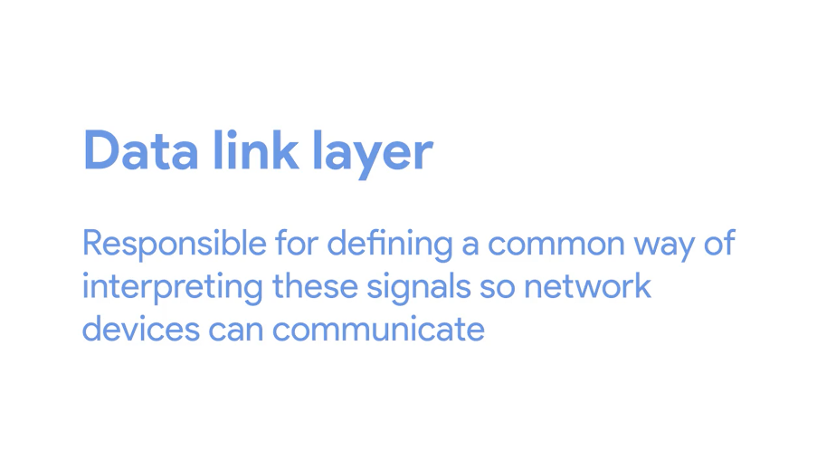
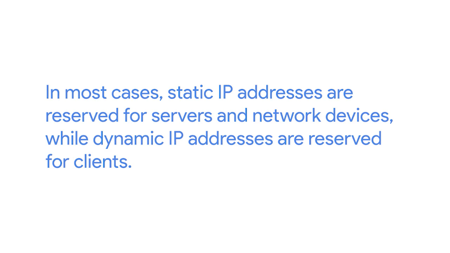
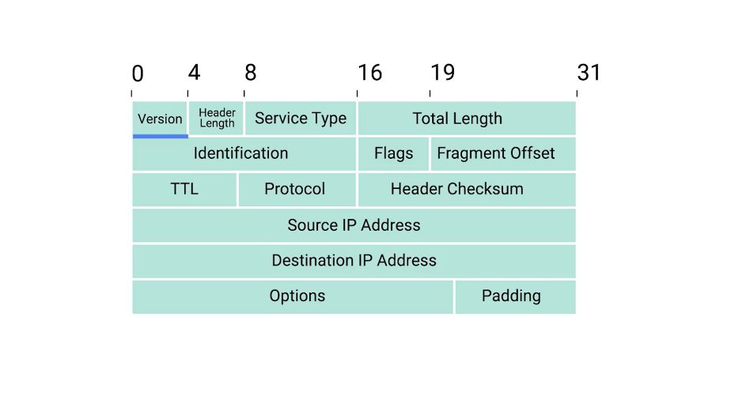
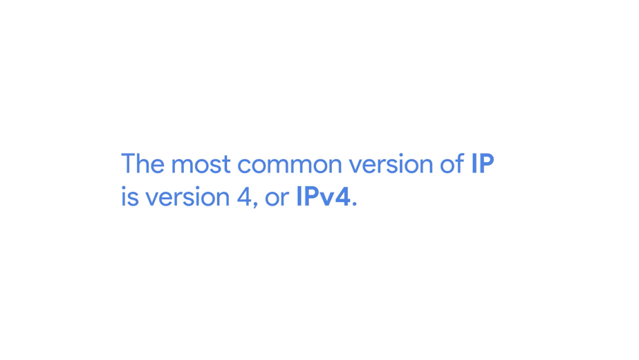
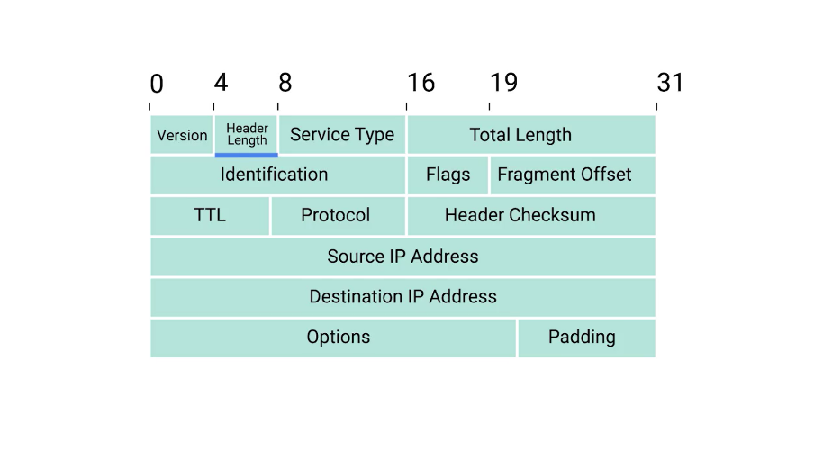
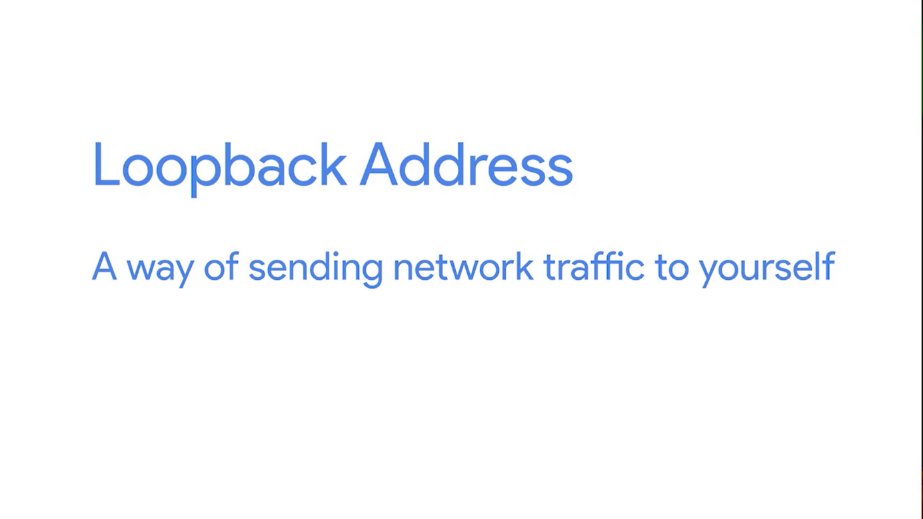
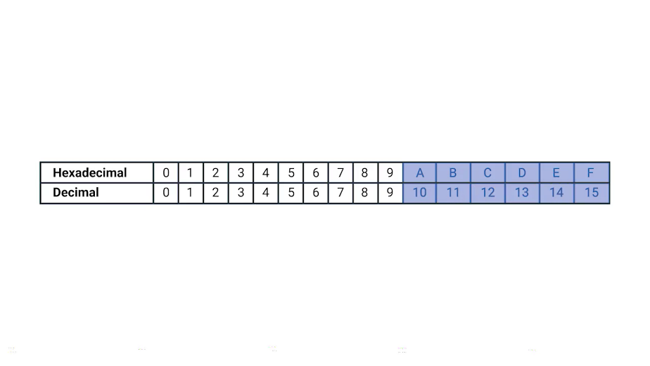
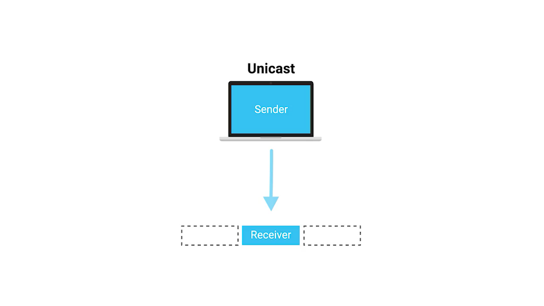

# Table des matières
- [1 Introduction to networking](#introduction-to-networking)
- [2 The network layer](#the-network-layer)
- [3 Transport layer and application layer](#transport-layer-and-application-layer)
- [4 Network services](#network-services)
  - [4.1 Introduction to network services](#introduction-to-network-services)
  - [4.2 Name resolution](#name-resolution)
    - [4.2.1 Why do we need DNS](#why-do-we-need-dns)
    - [4.2.2 The many steps of name resolution](#the-many-steps-of-name-resolution)
    - [4.2.3 DNS and UDP](#dns-and-udp)
  - [4.3 Name resolution in practice](#name-resolution-in-practice)
    - [4.3.1 Resource record type](#resource-record-type)
    - [4.3.2 Anatomy of a domain name](#anatomy-of-a-domain-name)
    - [4.3.3 DNS zones](#dns-zones)
  - [4.4 Dynamic host configuration protocol](#dynamic-host-configuration-protocol)
    - [4.4.1 Overview of DHCP](#overview-of-dhcp)
    - [4.4.2 DHCP in action](#dhcp-in-action)
  - [4.5 Network address translation](#network-address-translation)
    - [4.5.1 Basics of NAT](#basics-of-nat)
    - [4.5.2 NAT and the transport layer](#nat-and-the-transport-layer)
    - [4.5.3 NAT non routable address space and the limits of IPV4](#nat-non-routable-address-space-and-the-limits-of-ipv4)
  - [4.6 VNP and proxies](#vnp-and-proxies)
    - [4.6.1 Virtual private network](#virtual-private-network)
    - [4.6.2 Proxy services](#proxy-services)
- [5 Connecting to the internet](#connecting-to-the-internet)
  - [5.1 Introduction to connecting to the internet](#introduction-to-connecting-to-the-internet)
  - [5.2 Pots and dial up](#pots-and-dial-up)
    - [5.2.1 Dial up modems and point to point protocols](#dial-up-modems-and-point-to-point-protocols)
  - [5.3 Broadband connections](#broadband-connections)
    - [5.3.1 What is broadband](#what-is-broadband)
    - [5.3.2 T-carriers technologies](#t-carriers-technologies)
    - [5.3.3 Digital subscriber lines](#digital-subscriber-lines)

# Introduction to networking

# The network layer

# Transport layer and application layer

# Network services

## Introduction to network services

There's no denying it, computer networking is a complicated business that involves many technologies, layers, and protocols. At the end of the day, the main purpose of computer networking is so network services can be available to answer requests for the data from clients.

The sheer number and variety of things that might comprise a network service makes it impossible to cover all of them. But there are a lot of network services and technologies that are used to help make computer networking more user friendly and secure.

These network services and technologies, are ones that directly relate to the business of networking itself, and it's important to understand how those work. If something on the network isn't working as expected, the first place you should look at are the services we'll be covering here. And being asked to fix things that aren't working as expected will be a major part of being an IT support specialist.

By the end of this module, you'll be able to describe why name resolution is important, identify the many steps involved with the DNS lookup, and understand the most common DNS record types. You'll also be able to explain DHCP makes network administration a simpler task. You'll be able to demonstrate how NAT technologies help keep networks secure and help preserve precious IP address space.

Finally you'll be able to describe how VPNs and proxies help users get connected and stay secure. As you can see we've got a lot to tackle so let's get started.

## Name resolution

### Why do we need DNS

Computers speak to each other in numbers. At the very lowest levels, all computers really understand are 1 and 0. Reading binary numbers isn't the easiest for humans, so most binary numbers are represented in lots of different forms. This is especially true in the realm of networking.

Remember that an IP address is really just a 32-bit binary number, but it's normally written out as 4 octets in decimal form since that's easier for humans to read.

You might also remember that MAC addresses are just 48-bit binary numbers that are normally written out in 6 groupings of 2 hexadecimal digits each.

While remembering 192.168.1.100 might be easier than remembering a long string of 1s and 0s, it still doesn't do a very good job when you have to remember more than just a few addresses.

Imagine having to remember the four octets of an IP address for every website you visit. It's just not a thing that the human brain is normally good at. Humans are much better at remembering words. That's where DNS, or domain name system, comes into play.

DNS is a global and highly distributed network service that resolves strings of letters into IP address for you.

Let's say you wanted to check a weather website to see what the temperature is going to be like. It's much easier to type www.weather.com into a web browser than it is to remember that one of the IP adresses for this site is 184.29.131.121.

The IP address for a domain name can also change all the time for a lot of different reasons. A domain name is just the term we use for something that can be resolved by DNS.

In the example we just used, www.weather.com would be the domain name, and the IP it resolves to could change, depending on a variety of factors. Let's say that weather.com was moving their web server to a new data center. Maybe they signed a new contract, or the old data center was shutting down. By using DNS, an organization can just change what IP a domain name resolves to, and the end user would never even know.

So, not only does DNS make it easier for humans to remember how to get to a website, It also lets administrative changes happen behind the scenes without an end user having to change their behavior.

Try to imagine a world where you'd have to remember every IP for every website you visit, while also having to memorize new ones if something changed. We'd spend our whole day memorizing numbers. The importance of DNS for how the Internet operates, today, can't be overstated.

IP addresses might resolve to different things depending on where in the world you are. While most Internet communications travel at the speed of light, the further you have to route data, the slower things will become.

In almost all situations, it's going to be quicker to transmit a certain amount of data between places that are geographically close to each other. If you're a global web company, you'd want people from all over the world to have a great experience accessing your website. So instead of keeping all of your web servers in one place, you could distribute them across data centers across the globe.

This way, someone in New York, visiting a website, might get served by a web server close to New York, while someone in New Delhi might get served by a web server closer to New Delhi.

Again, DNS helps provide this functionality. Because of its global structure, DNS lets organizations decide, if you're in the region, resolve the domain name to this IP. If you're in this other region, resolve this domain to this other IP. DNS serves lots of purposes and might be one of the most important technologies to understand, as an IT support specialist, so you can effectively troubleshoot networking issues.

### The many steps of name resolution

At its most basic, DNS is a system that converts domain names into IP addresses. It's the way humans are likely to remember and categorize things resolved into the way computers prefer to think of things. This process of using DNS to turn a domain name into an IP address is known as name resolution. Let's take a closer look at exactly how this works.

The first thing that's important to know is that DNS servers, are one of the things that need to be specifically configured at a node on a network. For a computer to operate on a modern network, they need to have certain number of things configured.

Remember, that MAC addresses are hard coded and tied to specific pieces of hardware. But we've also covered that the IP address, subnet mask, and gateway for a host must be specifically configured, a DNS server, is the fourth and final part of the standard modern network configuration.

These are almost always the four things that must be configured for a host to operate on a network in an expected way. I should call out, that a computer can operate just fine without DNS or without a DNS server being configured, but as we covered in the last video, this makes things difficult for any human that might be using that computer.

There are five primary types of DNS servers; caching name servers, recursive name servers, root name servers, TLD name servers, and authoritative name servers. As we dive deeper into these, it's important to note that any given DNS server can fulfill many of these roles at once.

Caching and recursive name servers are generally provided by an ISP or your local network. Their purpose is to store domain name lookups for a certain amount of time.

As you'll see in a moment, there are lots of steps in order to perform a fully qualified resolution of a domain name. In order to prevent this from happening every single time a new TCP connection is established, your ISP or local network will generally have a caching name server available. Most caching name servers are also recursive name servers. Recursive name servers are ones that perform full DNS resolution requests.

In most cases, your local name server will perform the duties of both, but it's definitely possible for a name server to be either just caching or just recursive.

Let's introduce an example to better explain how this works. You and your friend are both connected to the same network and you both want to check out Facebook.com, your friend enters www.facebook.com into a web browser, which means that their computer now needs to know the IP of www.facebook.com in order to establish a connection. Both of your computers are on the same network which usually means, that they both been configured with the same name server.

So your friends computer ask the name server for the IP of www.facebook.com which it doesn't know, this name server now performs a fully recursive resolution to discover the correct IP for [www.facebook.com](http://www.facebook.com).

This involves a bunch of steps we'll cover in just a moment. This IP is then both delivered to your friend's computer and stored locally in a cache.

A few minutes later you enter www.facebook.com into a web browser. Again, your computer needs to know the IP for this domain, so your computer asks the local name server it's been configured with, which is the same one your friend's computer was just talking to.

Since the domain name www.Facebook.com had just been looked up, the local name server still has the IP that it resolved to stored and is able to deliver that back to your computer without having to perform a full lookup.

This is how the same servers act as a caching server. All domain names in the global DNS system have a TTL or time to live. This is a value in seconds, that can be configured by the owner of a domain name for how long a name server is allowed to cache in entry before it should discard it and perform a full resolution again.

Several years ago, it was normal for these TTL's to be really long, sometimes a full day or more. This is because the general bandwidth available on the Internet was just much less, so network administrators didn't want to waste what bandwidth was available to them by constantly performing full DNS lookups.

As the Internet has grown and gone faster, these TTL's for most domains have dropped to anywhere from a few minutes to a few hours. But it's important to know that sometimes you still run into a domain names with very lengthy TTL's, it means that it can take up to the length of a total TTL for a change in DNS record to be known to the entire Internet.

Now, let's look at what happens when your local recursive server needs to perform a full recursive resolution. The first step is always to contact a root named server, there are 13 total root name servers and they're responsible for directing queries toward the appropriate TLD name server.

In the past, these 13 root servers were distributed to very specific geographic regions, but today, they're mostly distributed across the globe via anycast. Anycast is a technique that's used to route traffic to different destinations depending on factors like location, congestion, or link health.

Using anycast, a computer can send a data gram to a specific IP but could see it routed to one of many different actual destinations depending on a few factors. This should also make it clear that there aren't really only 13 physical route name servers anymore. It's better to think of them as 13 authorities that provide route name lookups as a service. The root servers will respond to a DNS lookup with the TLD name server that should be queried. TLD stands for top level domain and represents the top of the hierarchical DNS name resolution system. A TLD is the last part of any domain name, using www.facebook.com as an example again, the dot com portion should be thought of as the TLD. We'll go into more details about the different components of a domain name in an upcoming lesson.

For each TLD in existence, there is a TLD name server, but just like with root servers, this doesn't mean there's only physically one server in question, it's most likely a global distribution of any cast accessible servers responsible for each TLD. The TLD name servers will respond again with a redirect, this time informing the computer performing the name lookup with what authoritative name server to contact. Authoritative name servers are responsible for the last two parts of any domain name which is the resolution at which a single organization may be responsible for DNS lookups.

Using www.weather.com as an example, the TLD name server would point a lookup at the authoritative server for Weather.com, which would likely be controlled by the Weather Channel, the organization itself that runs the site.

Finally, the DNS lookup could be redirected at the authoritative server for weather.com which would finally provide the actual IP of the server in question.

This strict hierarchy is very important to the stability of the internet, making sure that all full DNS resolutions go through a strictly regulated and controlled series of lookups to get the correct responses, is the best way to protect against malicious parties redirecting traffic. Your computer will blindly send traffic to whatever IP it's told to.

So by using a hierarchical system controlled by trusted entities in the way DNS does, we can better ensure that the responses to DNS lookups are accurate. Now that you see how many steps are involved, it should make sense why we trust our local name servers to cache DNS lookups, its so that full lookup path doesn't have to happen for every single TCP connection.

In fact, your local computer from your phone to a desktop will generally have its own temporary DNS cache as well, that way, it doesn't have to bother its local name server for every TCP connection either.

### DNS and UDP

DNS is a great example of an application layer service that uses UDP for the transport layer instead of TCP. This can be broken down into a few simple reasons. Remember that the biggest difference between TCP and UDP is that UDP is connectionless. This means there is no setup or teardown of a connection. So much less traffic needs to be transmitted overall.

A single DNS request and its response can usually fit inside of a single UDP datagram, making it an ideal candidate for a connectionless protocol. It's also worth calling out that DNS can generate a lot of traffic. It's true that caches of DNS entries are stored both on local machines and caching name servers, but it's also true that if the full resolution needs to be processed, we're talking about a lot more traffic.

Let's see what it would look like for a full DNS lookup to take place via TCP. First, the host that's making the DNS resolution request would send a SYN packet to the local name server on port 53, which is the port that DNS listens on. This name server would then need to respond with a SYN ACK packet, that means the original host would have to respond with an ACK in order to complete the three-way-handshake. That's three packets. Now, that the connection has been established, the original host would have to send the actual request. I'd like the IP address for food accomplice. When it receives this request, the name server would have to respond with another ACK. I got your request for food.com. We're up to five packets sent now.

In our scenario, the first caching name server doesn't have anything cached for food.com. So, it needs to talk to a root name server to find out who's responsible for the.comTLD. This would require a three-way-handshake. The actual request, the ACK of the request, the response, and then the ACK of the response.

Finally, the connection would have to be closed via a four-way-handshake. That's 11 more packets or 16 total.

Now that the recursive name server has the correct TLD name server, it needs to repeat that entire process to discover the proper authoritative name server. That's 11 more packets, bringing us up to 27 so far. Finally, the recursive name server would have to repeat the entire process one more time while talking to the authoritative name server in order to actually get the IP of food.com. This is 11 more packets for a running total of 38.

Now that the local name server finally has the IP address of food.com, it can finally respond to the initial request. A response to the DNS resolver that originally made the request, and then this computer sends an ACK back to confirm that it received the response. That's two more packets, putting us at 40.

Finally, the TCP connection needs to be closed via a four-way-handshake. This brings us to a grand total of 44 packets at the minimum in order for a fully recursive DNS request to be fulfilled via TCP.

44 packets isn't really a huge number in terms of how fast modern networks operate. But it adds up fast as you can see. Remember that DNS traffic is just a precursor to actual traffic. A computer almost always performs a DNS lookup because it needs to know the IP of the domain name in order to send additional data, not just because it's curious.

Now, let's check out how this would look with UDP. Spoiler alert, it doesn't take as many packets. The original computer sends a UDP packet to its local name server on port 53 asking for the IP for food.com, that's one packet.

The local name server acts as a recursive server and sends up a UDP packet to the root server which sends a response containing the proper TLD name server, that's three packets.

The recursive name server sends a packet to the TLD server and receives back a response containing the correct authoritative server. We're now at five packets.

Next, the recursive name server sends its final request to the authoritative name server which sends a response containing the IP for food.com. That's seven packets.

Finally, the local name server responds to the DNS resolver that made the request in the first place with the IP for food.com. That brings us to a grand total of eight packets.

See, way less packets. You can see now how much overhead TCP really requires. And for something as simple as DNS, it's just not needed. It's the perfect example for why protocols like UDP exist in addition to the more robust TCP.

You might be wondering how error recovery plays into this, since UDP doesn't have any. The answer is pretty simple. The DNS resolver just asks again if it doesn't get a response. Basically, the same functionality that TCP provides at the transport layer is provided by DNS at the application layer in the most simple manner. A DNS server never needs to care about doing anything but responding to incoming lookups, and a DNS resolver simply needs to perform lookups and repeat them if they don't succeed. A real showcase of the simplicity of both DNS and UDP.

I should call out that DNS over TCP does in fact exist and is also in use all over. As the Web has gotten more complex, it's no longer the case that all DNS lookup responses can fit in a single UDP datagram. In these situations, a DNS name server would respond with a packet explaining that the response is too large. The DNS client would then establish a TCP connection in order to perform the lookup.

## Name resolution in practice

### Resource record type

Remember, DNS is one of the most important technologies that an IT support specialist needs to know in order to troubleshoot networking issues. So, let's get into the nitty-gritty. DNS in practice operates with a set of defined resource record types. These allow for different kinds of DNS resolutions to take place. There are dozens of different resource record types defined, but a lot of them only serve very specialized purposes. We'll cover the most basic ones here.

The most common resource record is known as an A record. An A record is used to point a certain domain name at a certain IPv4 IP address.

In our earlier discussions of DNS, we made the assumption that the DNS resolver was asking for the A record for a domain name. In its most basic use, a single A record is configured for a single domain name. But, a single domain name can have multiple A records, too. This allows for a technique known as DNS round robin to be used to balance traffic across multiple IPs.

Round robin is a concept that involves iterating over a list of items one by one in an orderly fashion. The hope is that this ensures a fairly equal balance of each entry on the list that's selected.

Let's say we're in charge of a domain name www.microsoft.com. Microsoft is a large company and their website likely sees a lot of traffic. To help balance this traffic across multiple servers. We configure four A records for www.microsoft.com at the authoritative name server for the microsoft.com domain.

We'll use the IPs 10.1.1.1, 10.1.1.2, 10.1.1.3, and 10.1.1.4.

When the DNS Resolver performs a look-up of www.microsoft.com, all four IPs would be returned in the order first configured: 10.1 1.1, followed by 10.1.1.2, followed by 10.1.1.3, and finally, 10.1.1.4.

The DNS resolving computer would know that it should try to use the first entry, 10.1.1.1, but it knows about all four just in case a connection to 10.1.1.1 fails. The next computer to perform a look up for www.microsoft.com would also receive all four IPs in the response, but the ordering will have changed. The first entry would be 10.1.1.2, followed by 10.1.1.3, followed by 10.1.1,4, and finally, 10.1.1.1 would be last on that list.

This pattern will continue for every DNS resolution attempt, cycling through all of the A records configured and balancing the traffic across these IPs. That's the basics of how DNS round robin logic works.

Another resource record type that's becoming more and more popular is the Quad A record. A Quad A record is very similar to an A record except that it returns in IPv6 address instead of an IPv4 address. We'll cover the details of IPv6 in a future module.

The CNAME record is also super common. A CNAME record is used to redirect traffic from one domain to another.

Let's say that Microsoft runs their web servers at www.microsoft.com. They also want to make sure that anyone that enters just microsoft.com into their web browser will get properly redirected. By configuring a CNAME record for microsoft.com that resolves to www.microsoft.com, the resolving client would then know to perform another resolution attempt, this time for www.microsoft.com, and then use the IP returned by that second attempt. CNAMEs are really useful because they ensure you only have to change the canonical IP address of a server in one place. In fact, CNAME is just shorthand for canonical name.

If we look again at our original example of making sure that visitors to both microsoft.com and www.microsoft.com get to the same place. We could do this in two ways. We could set up identical A records for both microsoft.com and www.microsoft.com domain names, and this would work just fine. But if the underlying IP address ever changes, we need to change it in two places. The A records for both nicrosoft.com and www.microsoft.com. By setting up a CNAME that points microsoft.com at www.microsoft.com, you'd only have to change the A record for www.microsoft.com. And you'd know that clients pointing at either domain would get the new IP address. This might not seem like a huge deal with just two records to worry about, but large companies with complex presences on the web might have dozens of these kinds of redirections. It's always easier to only have one source of truth.

Another important resource record type is the MX record. MX stands for mail exchange and this resource record is used in order to deliver e-mail to the correct server.

Many companies run their web and mail servers on different machines with different IPs, so the MX record makes it easy to ensure that email gets delivered to a company's mail server, while other traffic like web traffic would get delivered to their web server. A record type very similar to the MX record is the SRV record. SRV stands for service record, and it's used to define the location of various specific services. It serves the exact same purpose as the MX resource record type except for one thing, while MX is only for mail services, an SRV record can be defined to return the specifics of many different service types.

For example, SRV records are often used to return the records of services like CalDAV, which has a calendar and scheduling service. The text record type is an interesting one. TXT stands for text and was originally intended to be used only for associating some descriptive text with a domain name for human consumption. The idea was that, you could leave notes or messages that humans could discover and read to learn more about arbitrary specifics of your network.

But over the years as the Internet and services that run on it have become more and more complex, the text record has been increasingly used to convey additional data intended for other computers to process.

Since the text record has a field that's entirely free form, clever engineers have figured out ways to use it to communicate data not originally intended to be communicated by a system like DNS. It's pretty clever, right? This text record is often used to communicate configuration preferences about network services that you've entrusted other organizations to handle for your domain.

For example, it's common for the text record to be used to convey additional info to an email as a service provider, which is a company that handles your email delivery for you. There are lots of other DNS resource record types in common use like the NS or SOA records which are used to define authority information about DNS zones. We'll cover DNS zones in more detail in a future video. So, stay tuned.

### Anatomy of a domain name

Any given domain name has three primary parts, and they all serve specific purposes. Let's take the domain name www.google.com, the three part here should be pretty easy to spot since they're each set off from each other by a period.

They're www, google, and com, the last part of a domain name is known as the TLD or Top Level Domain.

In this case it's the .com portion of the domain name.

There are only a certain restricted number of defined TLDs available, although that number has been growing a lot in recent years. The most common TLDs are ones you're probably already familiar with .com, .net, .edu and so on. You've probably also seen some country specific TLDs such as .de for Germany or .cn for China.

Due to the growth of the Internet, many of the TLDs originally defined have become very crowded. So today, a number of vanity TLDs are available, everything from .museum to .pizza.

Administration and definition of TLDs is handled by a non-profit organization known as ICANN, or the Internet Corporation for Assigned Names and Numbers and I can tell you what they do. ICANN is a sister organization to the IANA, and together they help define and control both the global IP spaces, along with the global DNS system.

A domain is the name commonly used to refer to the second part of a domain name, which would be, google in our example. Domains are used to demarcate where control moves from a TLD name server, to an authoritative name server.

This is typically under the control of an independent organization, or someone outside of ICANN. Domains can be registered and chosen by any individual or company, but they must all end in one of the predefined TLEs.

That www portion of this is known as the subdomain, sometimes referred to as a host name if it's been assigned to only one host.

When you combine all these parts together, you have what's known as a fully qualified domain name, or FQDN. While it costs money to officially register a domain with a registrar, subdomains can be freely chosen and assigned by anyone who controls such a registered domain.

A registrar is just a company that has an agreement with ICANN to sell unregistered domain names. We'll talk more about dealing with registrars in a future module. Technically you can have lots of subdomain names, for example host.sub.sub.subdomain.domain.com can be completely valid. Although you rarely see fully qualified domain names with that many levels.

DNS can technically support up to 127 levels of domain in total for a single fully qualified domain name.

There are some other restrictions in place for how your domain name can be specified. Each individual section can only be 63 characters long and a complete FQDN is limited to a total of 255 characters

### DNS zones

We've covered how authoritative name servers are responsible for responding to name resolution requests for specific domains, but they do more than that. An authoritative name server is actually responsible for a specific DNS zone.

DNS zones are a hierarchical concept. The root name servers we covered earlier are responsible for the root zone. Each TLD name server is responsible for the zone covering its specific TLD, and what we refer to as authoritative name servers are responsible for some even finer-grained zones underneath that. The root and TLD name servers are actually just authoritative name servers, too. It's just that the zones that they're authoritative for are special cases.

I should call out that zones don't overlap. For example, the administrative authority of the TLD name server for the.com TLD doesn't encompass the google.com domain. Instead, it ends at the authoritative server responsible for google.com.

The purpose of DNS zones is to allow for easier control over multiple levels of a domain.

As the number of resource records in a single domain increases, it becomes more of a headache to manage them all. Network administrators can ease this pain by splitting up their configurations into multiple zones.

Let's imagine a large company that owns the domain largecompany.com. This company has offices in Los Angeles, Paris, and Shanghai, very cosmopolitan. Let's say each office has around 200 people with their own uniquely named desktop computer. This would be 600 A records to keep track of if it was all configured as a single zone.

What the company could do, instead, is split up each office into their own zone. So now, we could have la.largecompany.com, pa.largecompany.com, and sh.largecompany.com as subdomains, each with their own DNS zones.

A total of four authoritative name servers would now be required for the setup, one for largecompany.com and one for each of the subdomains.

Zones are configured through what are known as zone files, simple configuration files that declare all resource records for a particular zone. So a zone file has to contain an SOA, or a Start of Authority resource record declaration.

This SOA record declares the zone and the name of the name server that is authoritative for it.

Along with the SOA record, you'll usually find NS records which indicate other name servers that may also be responsible for this zone.

For simplicity's sake, we've been referring to server in the singular when discussing what's responsible for its zone, whether at the root, TLD, or domain level, but there are often going to be multiple physical servers with their own FQDNs and IP addresses involved. Having multiple servers in place for something as important as DNS is pretty common. Why? Well, if one server were to have a problem or suffer a hardware failure, you could always rely on one of the other ones to serve DNS traffic.

Besides SOA and NS records, you'll also find some or all of the other resource record types we've already covered, like A, quad A, and CNAME records along with configurations such as default TTL values for the records served by this zone. Just like how subdomains can go many, many layers deep, zones can be configured to do this too but, just like with subdomains, it's rare to see zones deeper than just a few levels.

Sometimes, you'll also see what are known as reverse lookup zone files. These let DNS resolvers ask for an IP, and get the FQDN associated with it returned.

These files are the same as zone files except, instead of A and quad A records, which resolve names to IPs, you'll find mostly pointer resource record declarations. As you might have guessed, a PTR, or Pointer Record, resolves an IP to a name.

Up next, a dynamic quiz for you, before a dynamic new lesson on Dynamic Host Configuration Protocol. See you there.

## Dynamic host configuration protocol 

### Overview of DHCP

Managing hosts on a network can be a daunting and time consuming task. Every single computer on a modern TCP/IP based network needs to have at least four things to specifically configured. An IP Address, the subnet mask for the local network, a primary gateway, and a name server.

On their own, these four things don't seem like much, but when you have to configure them on hundreds of machines, it becomes super tedious. Out of these four things, three are likely the same on just about every node on the network, the subnet mask, the primary gateway, and DNS server.

But the last item, an IP address, needs to be different on every single node on the network.

That could require a lot of tricky configuration work, and this is where DHCP, or Dynamic Host Configuration Protocol, comes into play.

Listen up because DHCP is critical to know as an IT support specialist when it comes to troubleshooting networks. DHCP is an application layer protocol that automates the configuration process of hosts on a network.

With DHCP, a machine can query a DHCP server when the computer connects to the network and receive all the network configuration in one go. Not only does DHCP reduce the administrative overhead of having to configure lots of network devices on a single network, it also helps address the problem of having to choose what IP to assign to what machine.

Every computer on a network requires an IP for communications, but very few of them require an IP that would be commonly known. For servers or network equipment on your network, like your gateway router is static and known IP address, it's pretty important.

For example, the devices on a network need to know the IP of their gateway at all times. If the local DNS server was malfunctioning, network administrators would still need a way to connect to some of these devices through their IP. Without a static IP configured for a DNS server, it would be hard to connect to it to diagnose any problems if it was malfunctioning. But for a bunch of client devices like desktops, or laptops, or even mobile phones, it's really only important that they have an IP on the right network. It's much less important exactly which IP that is. Using DHCP, you can configure a range of IP addresses that's set aside for these client devices. This ensures that any of these devices can obtain an IP address when they need one, but solves the problem of having to maintain a list of every node on the network and its corresponding IP.

There are a few standard ways that DHCP can operate. DHCP dynamic allocation is the most common, and it works how we described it just now.

A range of IP addresses is set aside for client devices and one of these IPs is issued to these devices when they request one. Under a dynamic allocation, the IP of a computer could be different, almost every time it connects to the network.

Automatic allocation is very similar to dynamic allocation, in that a range of IP addresses is set aside for assignment purposes. The main difference here is that the DHCP server is asked to keep track of which IPs it's assigned to certain devices in the past. Using this information, the DHCP server will assign the same IP to the same machine each time, if possible.

Finally, there's whats known as fixed allocation. Fixed allocation requires a manually specified list of MAC address and the corresponding IPs.

When a computer requests an IP, the DHCP server looks for its MAC address in a table, and assigns the IP that corresponds to that MAC address. If the MAC address isn't found, the DHCP server might fall back to automatic or dynamic allocation, or it might refuse to assign an IP altogether. This can be used as a security measure to ensure that only devices that have had their MAC address specifically configured at the DHCP server will ever be able to obtain an IP and communicate on the network. It's worth calling out that DHCP discovery can be used to configure lots of things beyond what we touched on here. Along with things like IP address and primary gateway, you can also use DHCP to assign things like NTP servers.

NTP stands for Network Time Protocol, and is used to keep all computers on a network synchronized in time.

We'll cover it in more detail in later courses. But for now, it's just worth noting that DHCP can be used for more than just IP, subnet mask, gateway, and DNS server.

### DHCP in action

DHCP is an application layer protocol, which means it relies on the transport, network, data link and physical layers to operate. But you might have noticed that the entire point of DHCP is to help configure the network layer itself.

Let's take a look at exactly how DHCP works and how it accomplishes communications without a network layer configuration in place. Warning, geeky stuff ahead. The process by which a client configured to use DHCP attempts to get network configuration information is known as DHCP discovery.

The DHCP discovery process has four steps.

First, we have the server discovery step. The DHCP clients sends what's known as a DHCP discover message out onto the network. Since the machine doesn't have an IP and it doesn't know the IP of the DHCP server, a specially crafted broadcast message is formed instead.

DHCP listens on UDP port 67 and DHCP discovery messages are always sent from UDP port 68. So the DHCPDISCOVER message is encapsulated in a UDP datagram with a destination port of 67 and a source port of 68. This is then encapsulated inside of an IP datagram with a destination IP of 255.255.255.255, and a source IP of 0.0.0.0. This broadcast message would get delivered to every node on the local area network. And if a DHCP server is present, it would receive this message.

Next, the DHCP server would examine its own configuration and would make a decision on what, if any, IP address to offer to the client. This would depend on if it's configured to run with dynamic, automatic or fixed address allocation. The response would be sent as a DHCPOFFER message with a destination port of 68, a source port of 67, a destination broadcast IP of 255.255.255.255, and its actual IP as the source.

Since the DHCP offer is also a broadcast, it would reach every machine on the network. The original client would recognize that this message was intended for itself. This is because the DHCPOFFER has the field that specifies the MAC address of the client that sent the DHCPDISCOVER message. The client machine would now process this DHCPOFFER to see what IP is being offered to it.

Technically, a DHCP client could reject this offer. It's totally possible for multiple DHCP servers to be running on the same network, and for a DHCP client to be configured to only respond to an offer of an IP within a certain range. But this is rare.

More often, the DHCP client would respond to the DHCPOFFER message with a DHCPREQUEST message. This message essentially says, yes, I would like to have an IP that you offer to me. Since the IP hasn't been assigned yet, this is again sent from an IP of 0.0.0.0, and to the broadcast IP of 255.255.255.255.

Finally, the DHCP server receives the DHCPREQUEST message and responds with a DHCPACK or DHCP acknowledgement message. This message is again sent to a broadcast IP of 255.255.255.255, and with a source IP corresponding to the actual IP of the DHCP server.

Again, the DHCP client would recognize that this message was intended for itself by inclusion of its MAC address in one of the message fields. The networking stack on the client computer can now use the configuration information presented to it by the DHCP server to set up its own network layer configuration.

At this stage, the computer that's acting as the DHCP client should have all the information it needs to operate in a full fledged manner on the network it's connected to. All of this configuration is known as DHCP lease as it includes an expiration time. A DHCP lease might last for days or only for a short amount of time.

Once a lease has expired, the DHCP client would need to negotiate a new lease by performing the entire DHCP discovery process all over again. A client can also release its lease to the DHCP server, which it would do when it disconnects from the network. This would allow the DHCP server to return the IP address that was assigned to its pool of available IPs. Now that you've seen DHCP in action, we've got a short quiz for you. When you're finished, it's time for you to learn the basics of NAT.

## Network address translation

### Basics of NAT

Welcome back. Ready to dive right in. So unlike protocols like DNS and DHCP, network address translation or NAT is a technique instead of a defined standard. This means that some of what we'll discuss in this lesson might be more high level than some of our other topics. Different operating systems and different network hardware vendors have implemented the details of NAT in different ways.

But the concepts of what it accomplishes are pretty constant. Network address translation does pretty much what it sounds like. It takes one IP address and translates into another. There are lots of reasons why you would want to do this. They range from security safeguards, to preserving the limited amounts of available IPV4 space. We'll discuss the implications of NAT and the IP before address space later in this lesson.

But for now let's just focus on how NAT itself works and how it can provide additional security measures to a network. At its most basic level NAT, is a technology that allows a gateway usually a router or a firewall to rewrite the source IP of an outgoing IP datagram, while retaining the original IP in order to rewrite it into the response, to explain this better, let's look at a simple NAT example.

Let's say we have two networks, network A consists of the 10.1 1.0/24 address space, and network B consists of the 192. 1 6 8.1.0/24 address space. Sitting between these networks is a router that has an interface on network A with an IP of 10.1.1.1 and an interface on Network B of 192.168. 1.1

Now let's put two computers on these networks. Computer one is on network A, and has an IP of 10.1.1.100 and computer two is on network B and has an IP of 192.168.1.100. Computer one wants to communicate with a web server on computer two. So it crafts the appropriate packet at all layers and sends this to its primary gateway.

The router sitting between the two networks, so far this is a lot like many of our earlier examples, but in this instance the router is configured to perform NAT for any outbound packets. Normally a router will inspect the contents of an IP datagram, decrement the TTL by one, recalculate the checksum and forward the rest of the data at the network layer without touching it. But with NAT the router will also rewrite the source IP address, which in this instance becomes the routers IP on Network B or 192. 168. 1.1.

When the datagram gets to computer two, it will look like it originated from the router not from computer one. Now computer two crafts its response and sends it back to the router. The router knowing that this traffic is actually intended for computer one, rewrites the destination IP field before forwarding it along.

What NAT is doing in this example is hiding the IP of computer one from computer two. This is known as IP masquerading. IP masquerading is an important security concept. The most basic concept at play here, is that no one can establish a connection to your computer if they don't know what IP address it has.

By using NAT in the way we've just described, we could actually have hundreds of computers on network A, all of their IPs being translated by the router to its own. To the outside world, the entire address space of network A is protected and invisible. This is known as one to many NAT, and you'll see it in use on lots of LANs today.

### NAT and the transport layer

NAT at the network layer is pretty easy to follow. One IP address is translated to another by a device usually a router. But at the transport layer things get a little bit more complicated and several additional techniques come into play to make sure everything works properly.

With one to many NAT, we've talked about how hundreds even thousands of computers can all have their outbound traffic translated via NAT to a single IP. This is pretty easy to understand when the traffic is outbound, but a little more complicated once return traffic is involved.

We now have potentially hundreds of responses all directed at the same IP and the router at this IP needs to figure out which responses go to which computer. The simplest way to do this, is through port preservation. Port preservation is a technique where the source port chosen by a client, is the same port used by the router.

Remember that outbound connections choose a source port at random, from the ephemeral ports or the ports in the range 49,152 through 65, 535. In the simplest setup, a router setup to NAT outbound traffic, will just keep track of what this source port is, and use that to direct traffic back to the right computer. Let's imagine a device with an IP of 10.1.1.100. It wants to establish an outbound connection and the networking stack of the operating system chooses port 51,300 for this connection. Once this outbound connection gets to the router, it performs network address translation and places its own IP in the source address field of the IP datagram, but it leaves the source port in the TCP datagram the same and stores this data internally in a table.

Now, when traffic returns to the router and port 51,300, it knows that this traffic needs to be forwarded back to the IP 10.1.1.100.

Even with how large the set of ephemeral ports is, it's still possible for two different computers on a network to both choose the same source port around the same time. When this happens, the router normally selects an unused port at random to use instead.

Another important concept about NAT and the transport layer, is port forwarding. Port forwarding is a technique where a specific destination ports can be configured to always be delivered to specific nodes.

This technique allows for complete IP masquerading, while still having services that can respond to incoming traffic. Let's use our network 10.1.1.0 \24 again to demonstrate this. Let's say there's a web server configured with an IP of 10.1.1.5. With port forwarding, no one would even have to know this IP. Prospective web clients would only have to know about the external IP of the router.

Let's say it's 192.168.1.1. Any traffic directed at port 80 on 192.168.1.1, would get automatically forwarded to 10.1.1.5. Response traffic would have the source IP rewritten to look like the external IP of the router.

This technique not only allows for IP masquerading, it also simplifies how external users might interact with lots of services all run by the same organization.

Let's imagine a company with both a web server and mail server, both need to be accessible to the outside world but they run on different servers with different IPs.

Again, let's say the web server has an IP of 10.1.1.5, and the mail server has an IP of 10.1.1.6. With port forwarding, traffic for either of these services could be aimed at the same external IP and therefore the same DNS name, but it would get delivered to entirely different internal servers due to their different destination ports.

### NAT non routable address space and the limits of IPV4

The IANA has been in charge of distributing IP addresses since 1988. Since that time, the internet has expanded at an incredible rate. The 4.2 billion possible IPv4 addresses have been predicted to run out for a long time and they almost have. For some time now, the IANA has primarily been responsible with assigning address blocks to the five regional internet registries or RIRs.

The five RIRs are AFRINIC, which serves the continent of Africa, ARIN which serves the United States, Canada and parts of the Caribbean. APNIC, which is responsible for most of Asia, Australia and New Zealand and Pacific Island nations. LACNIC which covers Central and South America and any parts of the Caribbean not covered by ARIN. And finally RIPE, which serves Europe, Russia and the Middle East and portions of Central Asia.

These five RIRs have been responsible for assigning IP address blocks to organizations within their geographic areas and most have already run out. The IANA assigned the last unallocated slash eight network blocks to various RIRs on February 3rd, 2011. Then in April 2011, APNIC ran out of addresses. RIPE was next, in September of 2012. LACNIC ran out of addresses to assign in June 2014. And ARIN did the same in September 2015. Only AFNIC has some IPs left, but those are predicted to be depleted by 2018.

Wikipedia has a great article all about IPv4 exhaustion and the timelines involved. I've added a link to it in the reading just after this video. This is of course, a major crisis for the internet. IPv6 will eventually resolve these problems and we'll covered in more detail later in this course. But implementing IPv6 worldwide is going to take some time. For now, we wanted to continue to grow and we want more people and devices to connect to it but without IP addresses to assign, a workaround is needed.

Spoiler alert, you already know about the major components of this workaround. NAT and non-routable address space.

Remember that non-routable address space was defined in RFC1918 and consists of several different IP ranges that anyone can use. And unlimited number of networks can use non-routable address space internally because internet routers won't forward traffic to it. This means there's never any global collision of IP addresses when people use those address spaces. Non-routable address space is largely usable today because of technologies like NAT. With NAT, you can have hundreds even thousands of machines using non-routable address space.

Yet, with just a single public IP, all those computers can still send traffic to and receive traffic from the internet. All you need is one single IPv4 address and via NAT, a router with that IP can represent lots and lots of computers behind it. It's not a perfect solution, but until IPv6 becomes more globally available, non-routable address space and NAT will have to do

## VNP and proxies

### Virtual private network

Businesses have lots of reasons to want to keep their network secure. And they do this by using some of the technologies we've already discussed. Firewalls, NAT, the use of non-routable address space, things like that. Organizations often have proprietary information that needs to remain secure. Network services that are only intended for employees to access, and other things.

One of the easiest ways to keep networks secure is to use various securing technologies, so only devices physically connected to their local area network, can access these resources. But, employees aren't always in the office. They might be working from home, or on a business trip, and they might still need access to these resources in order to get their work done.

That's where VPNs come in. Virtual Private Networks or VPNs, are a technology that allows for the extension of a private or local network, to a host that might not work on that same local network. VPNs come in many flavors and accomplish lots of different things.

But the most common example of how VPNs are used, is for employees to access their businesses network when they're not in the office.

VPNs are a tunneling protocol. Which means, they provision access to something not locally available. When establishing a VPN connection, you might also say that a VPN tunnel has been established.

Let's go back to the example of an employee who needs to access company resources while not in the office. The employee could use a VPN client to establish a VPN tunnel to their company network. This would provision their computer with what's known as a virtual interface, with an IP that matches the address space of the network that established a VPN connection to. By sending data out of this virtual interface, the computer could access internal resources just like if it was physically connected to the private network.

Most VPNs work by using the payload section of the transport layer to carry an encrypted payload that actually contains an entire second set of packets. The network, the transport, and the application layers of a packet intended to traverse the remote network.

Basically, this payload is carried to the VPNs endpoint, where all the other layers are stripped away and discarded. Then, the payload is unencrypted, leaving the VPN server with the top three layers of a new packet. This gets encapsulated with the proper data link layer information, and sent out across the network.

This process is completed in the inverse, in the opposite direction. VPNs, usually requires strict authentication procedures in order to ensure that they can only be connected to by computers and users authorized to do so.

In fact, VPNs were one of the first technologies where two-factor authentication became common. Two-factor authentication is a technique where more than just a username and password are required to authenticate.

Usually, a short-lived numerical token is generated by the user through a specialized piece of hardware or software. VPNs can also be used to establish site-to-site connectivity.

Conceptually, there isn't much difference between how this works compared to a remote employee situation. It's just that the router, or sometimes a specialized VPN device on one network, establishes the VPN tunnel to the router or VPN device on another network. This way, two physically separated offices might be able to act as one network and access network resources across the tunnel.

It's important to call out that just like NAT, VPNs a general technology concept, not a strictly defined protocol. There are lots of unique implementations of VPNs. And the details of how they all work can differ a ton. The most important takeaway is that VPNs are a technology that use encrypted tunnels to allow for a remote computer or network, to act as if it's connected to a network that it's not actually physically connected to.

### Proxy services

A proxy service is a server that acts on behalf of a client in order to access another service. Proxies sit between clients and other servers, providing some additional benefit, anonymity, security, content filtering, increased performance, a couple other things.

If any part of this sounds familiar, that's good. We've already covered some specific examples of proxies, like gateway routers. You don't hear them referred to this way, but a gateway definitely meets the definition of what a proxy is and how it works.

The concept of a proxy is just that, a concept or an abstraction. It doesn't refer to any specific implementation. Proxies exist at almost every layer of our networking model. There are dozens and dozens of examples of proxies you might run into during your career, but we'll cover just a few of the most common ones here.

Most often, you'll hear the term, proxy, used to refer to web proxies. As you might guess, these are proxies specifically built for web traffic. A web proxy can serve lots of purposes.

Many years ago, when most Internet connections were much slower than they are today, lots of organizations used web proxies for increased performance. Using a web proxy, an organization would direct all web traffic through it, allowing the proxy server itself to actually retrieve the webpage data from the Internet. It would then cache this data. This way, if someone else requested the same webpage, it could just return the cached data instead of having to retrieve the fresh copy every time.

This kind of proxy is pretty old and you won’t often find them in use today, why? Well, for one thing, most organizations now have connections fast enough that caching individual webpages doesn't provide much benefit. Also, the Web has become much more dynamic. Going to www.twitter.com is going to look different to every person with their own Twitter account, so caching this data wouldn't do much good.

A more common use of a web proxy today might be to prevent someone from accessing sites, like Twitter, entirely. A company might decide that accessing Twitter during work hours reduces productivity. By using a web proxy, they can direct all web traffic to it, allow the proxy to inspect what data is being requested, and then allow or deny this request, depending on what site is being accessed.

Another example of a proxy is a reverse proxy. A reverse proxy is a service that might appear to be a single server to external clients, but actually represents many servers living behind it.

A good example of this is how lots of popular websites are architected today. Very popular websites, like Twitter, receive so much traffic that there's no way a single web server could possibly handle all of it. A website that popular might need many, many web servers in order to keep up with processing all incoming requests. A reverse proxy, in this situation, could act as a single front-end for many web servers living behind it. From the clients' perspective, it looks like they're all connected to the same server. But behind the scenes, this reverse proxy server is actually distributing these incoming requests to lots of different physical servers. Much like the concept of DNS Round Robin, this is a form of load balancing.

Another way that reverse proxies are commonly used by popular websites is to deal with decryption. More than half of all traffic on the Web is now encrypted, and encrypting and decrypting data is a process that can take a lot of processing power. You'll learn a lot more about encryption and how it works in another course in this program. Reverse proxies are now implemented in order to use hardware built specifically for cryptography, to perform the encryption and decryption work. So that the web servers are free to just serve content.

Proxies come in many other flavors, way too many for us to cover them all here. But the most important takeaway is that proxies are any server that act as a intermediary between a client and another server.

Good job, we covered a lot. Take a break for a bit before you move on to the quiz and project we've cooked up for you. Once you're done with these, take another break, and then meet me back here for the next module where we'll cover the history of Internet connections.

# Connecting to the internet

## Introduction to connecting to the internet

The Internet is a vast and diverse place. Not only is it huge, the number of different devices connected to it can be just as staggering. And if we were to actually describe all these devices, they'd have an almost endless number of functions. The devices that connect to the Internet fall into familiar silos; desktop and laptop computers, servers and data centers, routers and switches that direct network traffic etc. But this list also includes things like; tablets and cell phones, ATMs, industrial equipment, medical devices and even some cars are now connected to the Internet. The list go on and on. It's nice and simple to discuss everything in terms of a basic physical layer made up of Cat5 or Cat6 cables and a data link layer made entirely of Ethernet. But that's not exactly how things work when they actually connect to the Internet. The technologies used to get people and devices connected are as different as the people and devices themselves. By the end of this module, you'll be able to describe various Internet connectivity technologies. You'll also be able to define the components of LANs and outline the basics of wireless and cellular networking. These are the skills important as an I.T. support specialist, because a big part of your job will be making sure people can get online. See you at the top of the next video.

## Pots and dial up

### Dial up modems and point to point protocols

As computer use grew over the course of 20th century, it became obvious that there was a big need to connect computers to each other so that they could share data. For years before Ethernet, TCP or IP were ever invented, there were computer networks made up of technologies way more primitive than the model we've been discussing. These early networking technologies mostly focused on connecting devices within close physical proximity to each other. In the late 1970s two graduate students at Duke University were trying to come up with a better way to connect computers at further distances. They wanted to share what was essentially bulletin board material, then a light bulb moment went off. They realized the basic infrastructure for this already existed, the public telephone network. The public Switched Telephone Network or PSTN is also sometimes referred to as the Plain Old Telephone Service or POTS. It was already a pretty global and powerful system by the late 1970s more than 100 years after the invention of the telephone. These Duke grad students weren't the first ones to think about using a phone line to transmit data. But they were the first do it in a way that became somewhat permanent precursor to the dial up networks to follow. The system they built is known as USENET and a form of it is still in use today. At the time, different locations, like colleges and universities, used a very primitive form of a dial-up connection to exchange a series of messages with each other. A dial-up connection uses POTS for data transfer, and gets its name because the connection is established by actually dialing a phone number. If you used dial up, back in the day, this noise might sound familiar to you. \[NOISE\] For some of us it was like nails on a chalkboard as we waited to get connected to the Internet. Transferring data across a dial-up connection is done through devices called modems. Modem stands for modulator demodulator, and they take data that computers can understand and turn them into audible wavelengths that can be transmitted over POTS. After all, the telephone system was developed to transmit voice messages or sounds from one place to another. This is conceptually similar to how line coding is used to turn ones and zeroes into modulating electrical charges across Ethernet cables. Early modems had very low baud rates. A baud rate is a measurement of how many bits could be passed across a phone line in a second. By the late 1950s, computers could generally only send each other data across a phone line at about a 110 bits per second. By the time USENET was being developed, this rate had increased to around 300 bits per second. And by the time dial-up access to the Internet became a household commodity in the early 1990s, this rate had increased to 14.4 kilobits per second. Improvements continue to be made, but widespread adoption of broadband technologies, which we'll discuss in the next lesson, replaced a lot of these improvements. Dial-up Internet connectivity is pretty rare today but it hasn't completely gone away. In some rural areas, it might be the only option still available. You might never run into a dial-up Internet connection during your IT career. But it's still important to know that for several decades this technology represented the main way computers communicated with each other over long distances. I'm just glad we don't have to choose between using the phone or using the Internet anymore. Next, let's take a deep dive into the world of broadband.

## Broadband connections

### What is broadband

The term broadband has a few definitions. In terms of internet connectivity, it's used to refer to any connectivity technology that isn't dial-up Internet. Broadband Internet is almost always much faster than even the fastest dial-up connections and refers to connections that are always on. This means that they're long lasting connections that don't need to be established with each use. They're essentially links that are always present. Broadband shaped today's world. While the Internet itself is a totally amazing invention, it wasn't until the advent of broadband technologies that its true potential for business and home users was realized. Long before people had broadband connections at home, businesses spent a lot of resources on them usually out of necessity. If you had an office with more than a few employees, the bandwidth available by a single dial-up connection would quickly be oversaturated by just a few users. By the mid 1990's, it had become pretty common for businesses that needed internet access for their employees to use various T-carrier technologies. T-carrier technologies were originally invented by AT&T in order to transmit multiple phone calls over a single link. Eventually, they also became common transmission systems to transfer data much faster than any dial-up connection could handle. We'll cover the details of T-carrier technologies in an upcoming lesson. After businesses got into the broadband game, home use became more prevalent. As different aspects of the Internet, like the World Wide Web became more complex, they also required ever increasing data transfer rates. In the days of dial-up, even a single image on a web page could take many seconds to download and display. High resolution photos that you can now take on a cell phone would have required a long time to download and a lot of your patience. A single picture taken on a smartphone today can easily be several megabytes in size. Two megabytes would translate to 16,777,216 bits. At a baud rate of 14.4 kilobits per second, that many bits would take nearly 20 minutes to download. No one would've had time to download all the hilarious cat images on the internet back then. What a travesty. Without broadband internet connection technologies, the Internet as we know it today wouldn't exist. We wouldn't be able to stream music, or movies, or easily share photos. You definitely couldn't be taking an online course like this. T-carrier technologies require dedicated lines, which makes them more expensive. For this reason, you usually only see them in use by businesses. But other broadband solutions also exist for both businesses and consumers. In the next few videos, we'll deep dive into four of the most common broadband solutions available today: T-carrier technologies, digital subscriber lines or DSL, cable broadband, and fiber connections. Are you ready? Let's get started.

### T-carriers technologies

T-Carrier Technologies were first invented by AT&T in order to provision a system that allowed lots of phone calls to travel across a single cable. Every individual phone call was made over individual pairs of copper wire before Transmission System 1, the first T-Carrier specification called T1 for short. With the T1 specification, AT&T invented a way to carry up to 24 simultaneous phone calls across a single piece of twisted pair copper. Years later, the same technology was re-purposed for data transfers. Each of the 24 phone channels was capable of transmitting data at 64 kilobits per second, making a single T1 line capable of transmitting data at 1.544 megabits per second. Over the years, the phrase T1 has come to mean any twisted-pair copper connection capable of speeds of 1.544 megabits per second even, if it doesn't strictly follow the original Transmission System 1 specification. Originally, T1 technology was only used to connect different telecom company sites to each other and to connect these companies to other telecom companies. But with the rise of the internet as a useful business tool in the 1990s, more and more businesses started to pay to have T1 lines installed at their offices to have faster internet connectivity. More improvements to the T1 line were made by developing a way of multiple T1s to act as a single link. So, T3 line is 28 T1s all multiplexed achieving a total throughput speed of 44.736 megabits per second. You'll still find T-Carrier Technologies in use today, but they've usually been surpassed by other broadband technologies. For small business offices, cable broadband or fiber connections are now way more common, since they're much cheaper to operate. For inner ISP communications, different fiber technologies have all replaced older copper-based ones.

### Digital subscriber lines 

The public telephone network was a great option for getting people connected to the Internet since it already had infrastructure everywhere. For a long time, dial-up connections were the main way that people connected to the Internet from home. But there were certain limitations with trying to transmit data as what were essentially just audio waves. As people wanted faster and faster Internet access, telephone companies began to wonder if they could use the same infrastructure but in a different way. The research showed that twisted pair copper used by modern telephone lines was capable of transmitting way more data than what was needed for voice-to-voice calls. By operating at a frequency range that didn't interfere with normal phone calls, a technology known as digital subscriber line or DSL was able to send much more data across the wire than traditional dial-up technologies. To top it all off, this allowed for normal voice phone calls and data transfer to occur at the same time on the same line. Like how dial-up uses modems, DSL technologies also use their own modems. But, more accurately, they're known as DSLAMs or Digital Subscriber Line Access Multiplexers. Just like dial-up modems, these devices establish data connections across phone lines, but unlike dial-up connections, they're usually long-running. This means that the connection is generally established when the DSLAM is powered on and isn't torn down until the DSLAM is powered off. There are lots of different kinds of DSL available, but they all vary in a pretty minor way. For a long time, the two most common types of DSL were ADSL and SDSL. ADSL stands for Asymmetric Digital Subscriber Line. ADSL connections feature different speeds for outbound and incoming data. Generally, this means faster download speeds and slower upload speeds. Home users rarely need to upload as much data as they download since home users are mostly just clients. For example, when you open a web page in a web browser, the upload or outbound data is pretty small. You're just asking for a certain web page from the web server. The download or inbound data tends to be much larger since it'll contain the entire web page including all images and other media. For this reason, asymmetric lines often provide a similar user experience for a typical home user, but at a lower cost. SDSL, as you might be able to guess, stands for Symmetric Digital Subscriber Line. SDSL technology is basically the same as ADSL except the upload and download speeds are the same. At one point, SDSL was mainly used by businesses that hosted servers that needed to send data to clients. As the general bandwidth available on the Internet has expanded and as the cost of operation have come down over the years, SDSL is now more common for both businesses and home users. Most SDSL technologies and have an upper cap of 1.544 megabits a second or the same as a T1 line. Further developments in SDSL technology have yielded things like HDSL or High Bit-rate Digital Subscriber Lines. These are DSL technologies that provision speeds above 1.544 megabits per second. There are lots of other minor variations in DSL technology out in the wild offering different bandwidth options and operating distances. These variations can be so numerous and minor, it's not really practical to try to cover them here. If you ever need to know more about a specific DSL line, you should contact the ISP that provides it for more details.
