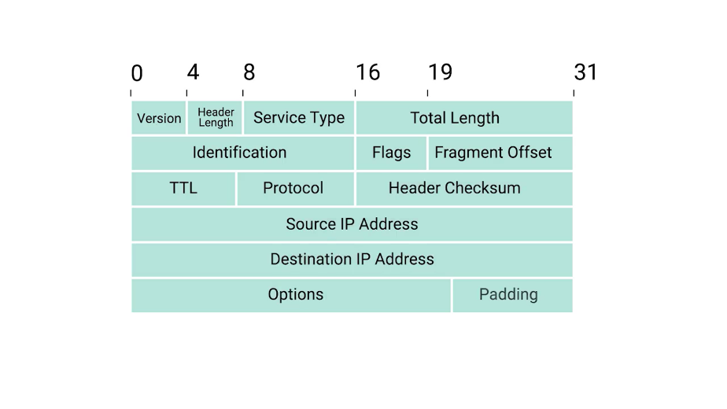
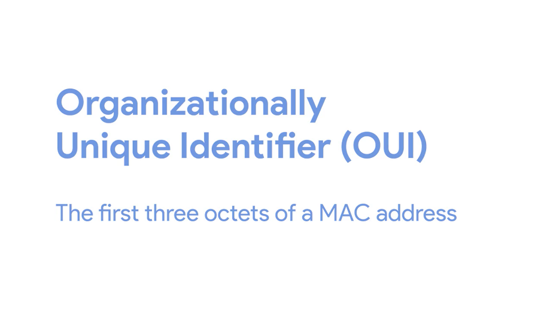
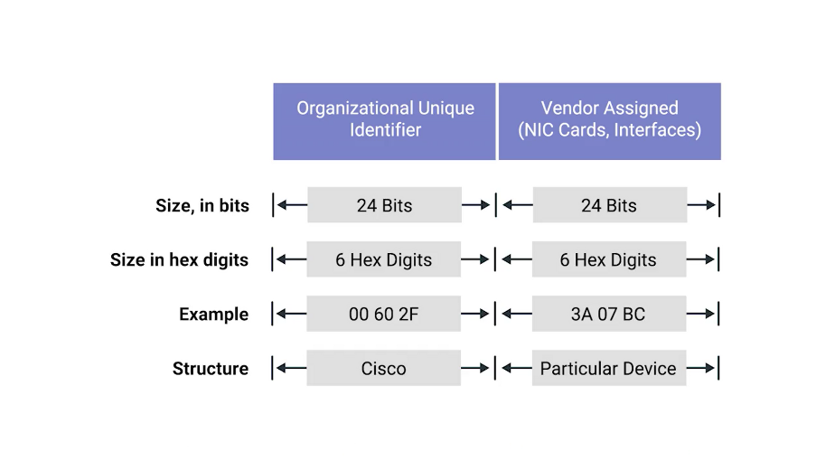
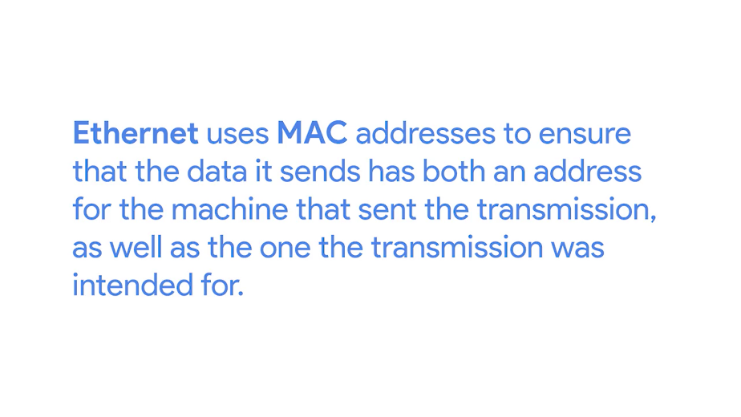

# Table des matières

[1 Introduction to networking [3](#introduction-to-networking)](#introduction-to-networking)

[2 The network layer [3](#the-network-layer)](#the-network-layer)

[3 Transport layer and application layer [3](#transport-layer-and-application-layer)](#transport-layer-and-application-layer)

[4 Networking services [3](#networking-services)](#networking-services)

[5 Connecting to the internet [3](#connecting-to-the-internet)](#connecting-to-the-internet)

[5.1 Introduction to connecting to the internet [3](#introduction-to-connecting-to-the-internet)](#introduction-to-connecting-to-the-internet)

[5.2 Pots and dial up [4](#pots-and-dial-up)](#pots-and-dial-up)

[5.2.1 Dial up modems and point to point protocols [4](#dial-up-modems-and-point-to-point-protocols)](#dial-up-modems-and-point-to-point-protocols)

[5.3 Broadband connections [8](#broadband-connections)](#broadband-connections)

[5.3.1 What is broadband [8](#what-is-broadband)](#what-is-broadband)

[5.3.2 T-carriers technologies [10](#t-carriers-technologies)](#t-carriers-technologies)

[5.3.3 Digital subscriber lines [11](#digital-subscriber-lines)](#digital-subscriber-lines)

[5.3.4 Cable broadband [14](#cable-broadband)](#cable-broadband)

[5.3.5 Fiber connection [18](#fiber-connection)](#fiber-connection)

[5.4 WANS [23](#wans)](#wans)

[5.4.1 Wide area network technologies [23](#wide-area-network-technologies)](#wide-area-network-technologies)

[5.4.2 Points to points VPN [24](#points-to-points-vpn)](#points-to-points-vpn)

[5.5 Wireless networking [25](#wireless-networking)](#wireless-networking)

[5.5.1 Introduction to wireless networking technologies [25](#introduction-to-wireless-networking-technologies)](#introduction-to-wireless-networking-technologies)

[5.5.2 Wireless network configurations [31](#wireless-network-configurations)](#wireless-network-configurations)

[5.5.3 Wireless channels [33](#wireless-channels)](#wireless-channels)

[5.5.4 Wireless security [37](#wireless-security)](#wireless-security)

[5.5.5 Cellular networking [40](#cellular-networking)](#cellular-networking)

[6 Troubleshooting and the future of networking [41](#troubleshooting-and-the-future-of-networking)](#troubleshooting-and-the-future-of-networking)

[6.1 Introduction to troubleshooting and the future of networking [41](#introduction-to-troubleshooting-and-the-future-of-networking)](#introduction-to-troubleshooting-and-the-future-of-networking)

[6.1.1 Introduction to troubleshooting and the future of networking [41](#introduction-to-troubleshooting-and-the-future-of-networking-1)](#introduction-to-troubleshooting-and-the-future-of-networking-1)

[6.2 Verifying connectivity [41](#verifying-connectivity)](#verifying-connectivity)

[6.2.1 Ping internet control message protocol [41](#ping-internet-control-message-protocol)](#ping-internet-control-message-protocol)

[6.2.2 Traceroute [42](#traceroute)](#traceroute)

[6.2.3 Testing port connectivity [43](#testing-port-connectivity)](#testing-port-connectivity)

[6.3 Digging into DNS [43](#digging-into-dns)](#digging-into-dns)

[6.3.1 Name resolution tools [43](#name-resolution-tools)](#name-resolution-tools)

[6.3.2 Public DNS servers [44](#public-dns-servers)](#public-dns-servers)

[6.3.3 DNS registration and expiration [45](#dns-registration-and-expiration)](#dns-registration-and-expiration)

[6.3.4 Host file [45](#host-file)](#host-file)

[6.4 The cloud [46](#the-cloud)](#the-cloud)

[6.4.1 What is the cloud [46](#what-is-the-cloud)](#what-is-the-cloud)

[6.4.2 Everything as a service [47](#everything-as-a-service)](#everything-as-a-service)

[6.4.3 Cloud storage [47](#cloud-storage)](#cloud-storage)

[6.5 IPV6 [48](#ipv6)](#ipv6)

[6.5.1 IPV6 addressing and subnetting [48](#ipv6-addressing-and-subnetting)](#ipv6-addressing-and-subnetting)

[6.5.2 IPV6 headers [49](#ipv6-headers)](#ipv6-headers)

[6.5.3 IPV6 and IPV4 harmony [49](#ipv6-and-ipv4-harmony)](#ipv6-and-ipv4-harmony)

[7 Course wrap-up [50](#course-wrap-up)](#course-wrap-up)

[7.1 Course wrap-up [50](#course-wrap-up-1)](#course-wrap-up-1)

[7.2 Alex career path [50](#alex-career-path)](#alex-career-path)

[7.3 Congratulations [51](#congratulations)](#congratulations)

# Introduction to networking

# The network layer

# Transport layer and application layer

# Networking services

# Connecting to the internet

## Introduction to connecting to the internet

The Internet is a vast and diverse place. Not only is it huge, the number of different devices connected to it can be just as staggering. And if we were to actually describe all these devices, they'd have an almost endless number of functions. The devices that connect to the Internet fall into familiar silos; desktop and laptop computers, servers and data centers, routers and switches that direct network traffic etc.

But this list also includes things like; tablets and cell phones, ATMs, industrial equipment, medical devices and even some cars are now connected to the Internet. The list go on and on.

It's nice and simple to discuss everything in terms of a basic physical layer made up of Cat5 or Cat6 cables and a data link layer made entirely of Ethernet. But that's not exactly how things work when they actually connect to the Internet. The technologies used to get people and devices connected are as different as the people and devices themselves.

By the end of this module, you'll be able to describe various Internet connectivity technologies. You'll also be able to define the components of LANs and outline the basics of wireless and cellular networking. These are the skills important as an I.T. support specialist, because a big part of your job will be making sure people can get online. See you at the top of the next video.

## Pots and dial up

### Dial up modems and point to point protocols

As computer use grew over the course of 20th century, it became obvious that there was a big need to connect computers to each other so that they could share data. For years before Ethernet, TCP or IP were ever invented, there were computer networks made up of technologies way more primitive than the model we've been discussing. These early networking technologies mostly focused on connecting devices within close physical proximity to each other.

In the late 1970s two graduate students at Duke University were trying to come up with a better way to connect computers at further distances. They wanted to share what was essentially bulletin board material, then a light bulb moment went off. They realized the basic infrastructure for this already existed, the public telephone network. The public Switched Telephone Network or PSTN is also sometimes referred to as the Plain Old Telephone Service or POTS.

It was already a pretty global and powerful system by the late 1970s more than 100 years after the invention of the telephone.

These Duke grad students weren't the first ones to think about using a phone line to transmit data. But they were the first do it in a way that became somewhat permanent precursor to the dial up networks to follow. The system they built is known as USENET and a form of it is still in use today.

At the time, different locations, like colleges and universities, used a very primitive form of a dial-up connection to exchange a series of messages with each other. A dial-up connection uses POTS for data transfer, and gets its name because the connection is established by actually dialing a phone number. If you used dial up, back in the day, this noise might sound familiar to you.

\[NOISE\] For some of us it was like nails on a chalkboard as we waited to get connected to the Internet.

Transferring data across a dial-up connection is done through devices called modems. Modem stands for modulator demodulator, and they take data that computers can understand and turn them into audible wavelengths that can be transmitted over POTS.

After all, the telephone system was developed to transmit voice messages or sounds from one place to another. This is conceptually similar to how line coding is used to turn ones and zeroes into modulating electrical charges across Ethernet cables.

Early modems had very low baud rates. A baud rate is a measurement of how many bits could be passed across a phone line in a second.

By the late 1950s, computers could generally only send each other data across a phone line at about a 110 bits per second.

By the time USENET was being developed, this rate had increased to around 300 bits per second. And by the time dial-up access to the Internet became a household commodity in the early 1990s, this rate had increased to 14.4 kilobits per second.

Improvements continue to be made, but widespread adoption of broadband technologies, which we'll discuss in the next lesson, replaced a lot of these improvements.

Dial-up Internet connectivity is pretty rare today but it hasn't completely gone away. In some rural areas, it might be the only option still available. You might never run into a dial-up Internet connection during your IT career. But it's still important to know that for several decades this technology represented the main way computers communicated with each other over long distances. I'm just glad we don't have to choose between using the phone or using the Internet anymore. Next, let's take a deep dive into the world of broadband.

## Broadband connections

### What is broadband

The term broadband has a few definitions.

In terms of internet connectivity, it's used to refer to any connectivity technology that isn't dial-up Internet. Broadband Internet is almost always much faster than even the fastest dial-up connections and refers to connections that are always on.

This means that they're long lasting connections that don't need to be established with each use. They're essentially links that are always present. Broadband shaped today's world. While the Internet itself is a totally amazing invention, it wasn't until the advent of broadband technologies that its true potential for business and home users was realized. Long before people had broadband connections at home, businesses spent a lot of resources on them usually out of necessity. If you had an office with more than a few employees, the bandwidth available by a single dial-up connection would quickly be oversaturated by just a few users.

By the mid 1990's, it had become pretty common for businesses that needed internet access for their employees to use various T-carrier technologies. T-carrier technologies were originally invented by AT&T in order to transmit multiple phone calls over a single link.

Eventually, they also became common transmission systems to transfer data much faster than any dial-up connection could handle. We'll cover the details of T-carrier technologies in an upcoming lesson. After businesses got into the broadband game, home use became more prevalent. As different aspects of the Internet, like the World Wide Web became more complex, they also required ever increasing data transfer rates. In the days of dial-up, even a single image on a web page could take many seconds to download and display.

High resolution photos that you can now take on a cell phone would have required a long time to download and a lot of your patience. A single picture taken on a smartphone today can easily be several megabytes in size. Two megabytes would translate to 16,777,216 bits. At a baud rate of 14.4 kilobits per second, that many bits would take nearly 20 minutes to download. No one would've had time to download all the hilarious cat images on the internet back then. What a travesty.

Without broadband internet connection technologies, the Internet as we know it today wouldn't exist. We wouldn't be able to stream music, or movies, or easily share photos. You definitely couldn't be taking an online course like this. T-carrier technologies require dedicated lines, which makes them more expensive.

For this reason, you usually only see them in use by businesses. But other broadband solutions also exist for both businesses and consumers. In the next few videos, we'll deep dive into four of the most common broadband solutions available today: T-carrier technologies, digital subscriber lines or DSL, cable broadband, and fiber connections. Are you ready? Let's get started.

### T-carriers technologies

T-Carrier Technologies were first invented by AT&T in order to provision a system that allowed lots of phone calls to travel across a single cable.

Every individual phone call was made over individual pairs of copper wire before Transmission System 1, the first T-Carrier specification called T1 for short.

With the T1 specification, AT&T invented a way to carry up to 24 simultaneous phone calls across a single piece of twisted pair copper. Years later, the same technology was re-purposed for data transfers. Each of the 24 phone channels was capable of transmitting data at 64 kilobits per second, making a single T1 line capable of transmitting data at 1.544 megabits per second. Over the years, the phrase T1 has come to mean any twisted-pair copper connection capable of speeds of 1.544 megabits per second even, if it doesn't strictly follow the original Transmission System 1 specification.

Originally, T1 technology was only used to connect different telecom company sites to each other and to connect these companies to other telecom companies. But with the rise of the internet as a useful business tool in the 1990s, more and more businesses started to pay to have T1 lines installed at their offices to have faster internet connectivity.

More improvements to the T1 line were made by developing a way of multiple T1s to act as a single link. So, T3 line is 28 T1s all multiplexed achieving a total throughput speed of 44.736 megabits per second. You'll still find T-Carrier Technologies in use today, but they've usually been surpassed by other broadband technologies.

For small business offices, cable broadband or fiber connections are now way more common, since they're much cheaper to operate. For inner ISP communications, different fiber technologies have all replaced older copper-based ones.

### Digital subscriber lines 

The public telephone network was a great option for getting people connected to the Internet since it already had infrastructure everywhere. For a long time, dial-up connections were the main way that people connected to the Internet from home. But there were certain limitations with trying to transmit data as what were essentially just audio waves.

As people wanted faster and faster Internet access, telephone companies began to wonder if they could use the same infrastructure but in a different way. The research showed that twisted pair copper used by modern telephone lines was capable of transmitting way more data than what was needed for voice-to-voice calls. By operating at a frequency range that didn't interfere with normal phone calls, a technology known as digital subscriber line or DSL was able to send much more data across the wire than traditional dial-up technologies. To top it all off, this allowed for normal voice phone calls and data transfer to occur at the same time on the same line.

Like how dial-up uses modems, DSL technologies also use their own modems. But, more accurately, they're known as DSLAMs or Digital Subscriber Line Access Multiplexers.

Just like dial-up modems, these devices establish data connections across phone lines, but unlike dial-up connections, they're usually long-running. This means that the connection is generally established when the DSLAM is powered on and isn't torn down until the DSLAM is powered off. There are lots of different kinds of DSL available, but they all vary in a pretty minor way.

For a long time, the two most common types of DSL were ADSL and SDSL.

ADSL stands for Asymmetric Digital Subscriber Line. ADSL connections feature different speeds for outbound and incoming data. Generally, this means faster download speeds and slower upload speeds. Home users rarely need to upload as much data as they download since home users are mostly just clients.

For example, when you open a web page in a web browser, the upload or outbound data is pretty small. You're just asking for a certain web page from the web server. The download or inbound data tends to be much larger since it'll contain the entire web page including all images and other media. For this reason, asymmetric lines often provide a similar user experience for a typical home user, but at a lower cost.

SDSL, as you might be able to guess, stands for Symmetric Digital Subscriber Line. SDSL technology is basically the same as ADSL except the upload and download speeds are the same.

At one point, SDSL was mainly used by businesses that hosted servers that needed to send data to clients. As the general bandwidth available on the Internet has expanded and as the cost of operation have come down over the years, SDSL is now more common for both businesses and home users. Most SDSL technologies and have an upper cap of 1.544 megabits a second or the same as a T1 line.

Further developments in SDSL technology have yielded things like HDSL or High Bit-rate Digital Subscriber Lines. These are DSL technologies that provision speeds above 1.544 megabits per second. There are lots of other minor variations in DSL technology out in the wild offering different bandwidth options and operating distances. These variations can be so numerous and minor, it's not really practical to try to cover them here. If you ever need to know more about a specific DSL line, you should contact the ISP that provides it for more details.

### Cable broadband

The history of both the telephone and computer networking tells a story that started with all communications being wired. But the recent trend is moving towards more and more of this traffic becoming wireless.

The history of television follows the opposite path. Originally, all television broadcasts were wireless transmissions sent out by giant television towers and received by smaller antennas in people's homes. This meant you had to be within range of one of these television towers to watch TV, just like you have to be within range of a cell phone tower to use your cellphone today. Starting in the late 1940s in the United States, the first cable television technologies were developed.

At the time, they mainly wanted to provide television access to remote towns and rural homes that were out of range of capabilities of television towers at the time. Cable television continued to expand slowly over the decades, but in 1984, The Cable Communications Policy Act was passed. This deregulated the cable television business in the United States and caused a massive boom in growth and adoption. Other countries all over the globe soon followed.

By the early 1990s, cable television infrastructure in the United States was about the size of the public telephone system. Not too long after that, cable providers started trying to figure out if they could join in on the massive spike in Internet growth that was happening at the same time.

Much like how DSL was developed, cable companies quickly realized that the coaxial cables generally used by cable television delivery into a person's home were capable of transmitting much more data than what was required for TV viewing. By using frequencies that don't interfere with television broadcast, cable-based Internet access technologies were able to deliver high speed Internet access across these same cables. This is the technology that we refer to when we say cable broadband.

One of the main differences in how cable Internet access works when compared to other broadband solutions is that cable is generally what's known as a shared bandwidth technology.

With technologies like DSL or even dial up, the connection from your home or business goes directly to what's known as a Central Office or CO.

A long time ago, the COs were actually offices staffed with telephone operators who used a switchboard to manually connect the caller with the caller. As technology improved, the COs became smaller pieces of automated hardware that handled these functions for the telephone companies, but the name stayed the same.

Technologies that connect directly to a CO can guarantee a certain amount of bandwidth available over that connection since it's point to point.

On the flip side of this, are cable Internet technologies, which employ a shared bandwidth model. With this model in place, many users share a certain amount of bandwidth until the transmissions reach the ISP's core network. This could be anywhere from a single city block to entire subdivisions in the suburbs. It just depends on how that area was originally wired for cables.

Today, most cable operators have tried to upgrade their networks to the point that end users might not always notice the shared bandwidth. But it's also still common to see cable Internet connections slow down during periods of heavy use. Like when lots of people in the same region are using their Internet connection at the same time.

Cable Internet connections are usually managed by what's known as a cable modem. This is a device that sits at the edge of a consumer's network and connects it to the cable modem termination system, or CMTS. The CMTS is what connects lots of different cable connections to an ISP's core network.

### Fiber connection

The core of the internet has long used fiber for its connections, both due to higher speeds and because fiber allows for transmission to travel much further without degradation of the signal. Remember that fiber connections use light for data transmission instead of electrical currents. The absolute maximum distance an electrical signal can travel across a copper cable before it degrades too much and requires a repeater is thousands of feet. But, certain implementations of fiber connections can travel many, many miles before a signal degrades. Producing and laying fiber is a lot more expensive than using copper cables.

So, for a long time, it was a technology you only saw in use by ISPs within their core networks or maybe for use within data centers. But in recent years, it's become popular to use fiber to deliver data closer and closer to the end user. Exactly how close to the end user can vary a ton across implementations, which is why the phrase FTTX was developed. FTTX stands for fiber to the X, where the X can be one of many things. We'll cover a few of these possibilities.

The first term you might hear is FTTN, which means fiber to the neighborhood. This means that fiber technologies are used to deliver data to a single physical cabinet that serves a certain amount of the population. From this cabinet, twisted pair copper or coax might be used for the last length of distance.

The next version you might come across is FTTB. This stands for fiber to the building, fiber to the business or even a fiber to the basement, since this is generally where cables to buildings physically enter. FTTB is a setup where fiber technologies are used for data delivery to an individual building. After that, twisted pair copper is typically used to actually connect those inside of the building.

A third version you might hear is FTTH, which stands for fiber to the home. This is used in instances where fiber is actually run to each individual resident in a neighborhood or apartment building.

FTTH and FTTB may both also be referred to as FTTP, fiber to the premises. Instead of a modem, the demarcation point for fiber technologies is known as Optical Network Terminator, or ONT. An ONT converts data from protocols the fiber network can understand to those that are more traditional twisted pair copper networks can understand.

## WANS

### Wide area network technologies

Let's say that you're in charge of the network as the sole IT support specialist at a small company. At first, the business only has a few employees with a few computers in a single office. You decide to use non-routable address space for the internal IPs because IP addresses are scarce and expensive. You set up a router and configure it to perform NAT. You configure a local DNS server and a DHCP server to make network configuration easier. And of course, for all of this to really work, you sign a contract with an ISP to deliver a link to the Internet to this office so your users can access the web.

Now imagine the company grows. You're using non-routable address space for your internal IPs, so you have plenty of space to grow there. Maybe some salespeople need to connect to resources on the LAN you've set up while they're on the road, so you configure a VPN server and make sure the VPN server is accessible via port forwarding. Now, you can have employees from all over the world connect to the office LAN. Business is good and the company keeps growing. The CEO decides that it's time to open a new office in another city across the country.

Suddenly, instead of a handful of sales people requiring remote access to the resources on your network, you have an entire second office that needs it.

This is where wide area networks or WAN technologies come into play. Unlike a LAN or a local area network, WAN stands for wide area network. A wide area network acts like a single network but spans across multiple physical locations.

WAN technologies usually require that you contract a link across the Internet with your ISP. This ISP handles sending your data from one side to the other. So, it could be like all of your computers are in the same physical location.

A typical WAN set up has a few sections. Imagine one network of computers on one side of the country and another network of computers on the other. Each of those networks ends at a demarcation point, which is where the ISPs network takes over. The area between each demarcation point and the ISP's actual core network is called a local loop. This local loop would be something like a T-carrier line or a high-speed optical connection to the provider's local regional office. From there, it would connect out to the ISP's core network and the Internet a large.

WANs work by using a number of different protocols at the data link layer to transport your data from one site to another. In fact, these same protocols are what are sometimes at work at the core of the Internet itself instead of our more familiar Ethernet. Covering all the details of these protocols is out of the scope of this course, but in an upcoming lesson, we'll give you some links to the most popular WAN protocols.

### Points to points VPN

A popular alternative to WAN technologies are point-to-point VPNs.

WAN technologies are great for when you need to transport large amounts of data across lots of sites, because WAN technologies are built to be super fast. A business cable or DSL line might be way cheaper but it just can't handle the load required in some of these situations. But over the last few years, companies have been moving more and more of their internal services into the cloud. We'll cover exactly what this means later, but for now, it's enough to know that the cloud lets companies outsource all or part of their different pieces of infrastructure to other companies to manage.

Let's take the concept of email. In the past, a company would have to run their own email server if they wanted an email presence at all. Today, you could just have a cloud hosting provider host your email server for you. You could even go a step further and using email as a service provider, then you wouldn't have an email server at all anymore. You just have to pay another company to handle everything about your email service.

With these types of cloud solutions in place, lots of businesses no longer require extreme high speed connections between their sites. This makes the expense of a WAN technology totally unnecessary. Instead, companies can use point-to-point VPNs to make sure that there are different sites can still communicate with each other.

A point-to-point VPN, also called a site-to-site VPN, establishes a VPN tunnel between two sites. This operates a lot like the way that a traditional VPN setup lets individual users act as if they are on the network they're connecting to. It's just that the VPN tunneling logic is handled by network devices at either side, so that users don't all have to establish their own connections.

Now, it's time for one more quiz to see how your connections are firing.

## Wireless networking

### Introduction to wireless networking technologies

In today's world, fewer and fewer devices are weighed down by physical cables in order to connect to computer networks. With so many portable computing devices in use, from laptops to tablets to smartphones, we've also seen the rise of wireless networking. Wireless networking, is exactly what it sounds like. A way to network without wires.

By the end of this lesson, you'll be able to describe the basics of how wireless communication works. You'll know how to tell the difference between infrastructure networks, and ad hoc networks. You'll be able to explain how wireless channels help wireless networks operate. And you'll understand the basics of wireless security protocols. These are all invaluable skills as an IT support specialist, since wireless networks are becoming more and more common in the workplace.

The most common specifications for how wireless networking devices should communicate, are defined by the IEEE 802.11 standards. This set of specifications, also called the 802.11 family, make up the set of technologies we call WiFi.

Wireless networking devices communicate with each other through radiowaves. Different 802.11 standards generally use the same basic protocol, but might operate at different frequency bands. A frequency band is a certain section of the radio spectrum that's been agreed upon to be used for certain communications.

In North America, FM radio transmissions operate between 88 and 108 megahertz. This specific frequency band is called the FM broadcast band. WiFi networks operate on a few different frequency bands. Most commonly, the 2.4 gigahertz and 5 gigahertz bands.

There are lots of 802.11 specifications including some that exist just experimentally or for testing. The most common specifications you might run into are 802.11b, 802.11a, 802.11g, 802.11n, and 802.11ac.

We won't go into detail about each one here. For now, just know that we've listed these in the order they were adopted. Each newer version of the 802.11 specifications has generally seen some improvement, whether it's higher access speeds, or the ability for more devices to use the network simultaneously.

In terms of our networking model, you should think of 802.11 protocols as defining how we operate at both the physical and the data link layers.

An 802.11 frame has a number of fields. The first is called the frame control field. This field is 16 bits long, and contains a number of sub-fields that are used to describe how the frame itself should be processed. This includes things like what version of the 802.11 was used.

The next field is called a duration field. It specifies how long the total frame is. So, the receiver knows how long it should expect to have to listen to the transmission.

After this, are four address fields. Let's take a moment to talk about why there are four instead of the normal two.

We'll discuss different types of wireless network architectures in more detail later in this lesson, but the most common setup includes devices called access points. A wireless access point is a device that bridges the wireless and wired portions of a network.

A single wireless network might have lots of different access points to cover a large area. Devices on a wireless network will associate with a certain access point. This is usually the one they're physically closest to. But, it can also be determined by all sorts of other things like general signal strength, and wireless interference.

Associations isn't just important for the wireless device to talk to a specific access point, it also allows for incoming transmissions to the wireless device to be sent by the right access point.

There are four address fields, because there needs to be room to indicate which wireless access point should be processing the frame. So, we'd have our normal source address field, which would represent the MAC address of the sending device. But, we'd also have the intended destination on the network, along with a receiving address and a transmitter address.

The receiver address would be the MAC address of the access point that should receive the frame, and the transmitter address would be the MAC address of whatever has just transmitted the frame. In lots of situations, the destination and receiver address might be the same. Usually, the source and transmitter addresses are also the same. But, depending on exactly how a specific wireless network has been architected, this won't always be the case. Sometimes, wireless access points will relay these frames from one another. Since all addresses in an 802.11 frame are Mac addresses, each of those four fields is 6 bytes long.

In between the third and fourth address fields, you'll find the sequence control field. The sequence control field is 16 bits long and mainly contains a sequence number used to keep track of ordering the frames.

After this is the data payload section which has all of the data of the protocols further up the stack.

Finally, we have a frame check sequence field which contains a checksum used for a cyclical redundancy check. Just like how ethernet does it.

### Wireless network configurations

There are a few main ways that a wireless network can be configured. There are Ad-hoc networks where nodes all speak directly to each other. There are wireless LANS or WLANS where one or more access points act as a bridge between a wireless and a wired network. And there are Mesh networks which are kind of a hybrid of the two.

Ad-hoc networks are the simplest of the three. In an ad-hoc network, there isn't really any supporting network infrastructure. Every device involved with the network communicates with every other device within range, and all nodes help pass along messages.

Even though they are most simple, ad-hoc networks aren't the most common type of wireless network, but they do have some practical applications. Some smartphones can establish ad-hoc networks with other smartphones in the area so that people can exchange photos, video, or contact information. You'll also sometimes see ad-hoc networks used in industrial or warehouse settings, where individual pieces of equipment might need to communicate with each other but not with anything else.

Finally, ad-hoc networks can be powerful tools during disaster situations. If a natural disaster like an earthquake or hurricane knocks out all of the existing infrastructure in an area, disaster relief professionals can use an ad-hoc network to communicate with each other while they perform search and rescue efforts.

The most common type of wireless network you'll run into in the business world is a wireless LAN or WLAN. A wireless LAN consist of one or more access points which act as bridges between the wireless and wired networks. The wired network operates as a normal LAN, like the types we've already discussed. The wired LAN contains the outbound internet link. In order to access resources outside of the WLAN, wireless devices would communicate with access points. They then forward traffic along to the Gateway router, where everything proceeds like normal.

Finally, we have what's known as Mesh networks. Mesh networks are kind of like ad-hoc networks, since lots of the devices communicate with each other wirelessly forming a mesh if you were to draw lines for all the links between all the nodes. Most Mesh networks you'll run into are made up of only wireless access points, and will still be connected to a wired network. This kind of network lets you deploy more access points to the Mesh without having to run a cable to each of them. With this kind of setup, you can really increase the performance and range of a wireless network.

### Wireless channels

The concept of channels is one of the most important things to understand about wireless networking. Channels are individual, smaller sections of the overall frequency band used by a wireless network.

Channels are super important because they help address a very old networking concern, collision domains. You might remember that a collision domain is any one network segment where one computer can interrupt another.

Communications that overlap each other can't be properly understood by the receiving end. So when two or more transmissions occur at the same time, also called a collision, all devices in question have to stop their transmissions. They wait a random amount of time and try again when things quiet down. This really slows things down. The problem caused by collision domains has been mostly reduced on wired networks through devices called switches. Switches remember which computers live on which physical interfaces. So traffic is only sent to the node It's intended for. Wireless networking doesn't have cables, so there aren't physical interfaces for a wireless device to connect to. That means, we can have something that works like a wireless switch. Wireless devices are doomed to talk over each other.

Channels help fix this problem to a certain extent. When we were talking about the concept the frequency bands, we mentioned that FM radio in North America operates between 80 megahertz and 108 megahertz. But when we discuss the frequency bands we use by Wi-Fi, we just mentioned 2.4 Gigahertz and five Gigahertz. This is because that's really just shorthand for where these frequency bands actually begin. For wireless networks that operate on a 2.4 Gigahertz band, what we really mean is that they operate on roughly the band from 2.4 Gigahertz to 2.5 Gigahertz.

Between these two frequencies are a number of channels, each with a width of a certain megahertz. Since different countries and regions have different regulatory committees for what radio frequencies might be used for what, exactly how many channels are available for use depends on where in the world you are.

For example, dealing with an 802.11b network, channel one operates at 2412 megahertz, but since the channel width is 22 megahertz, the signal really lives on the frequencies between 2401 megahertz and 2423 megahertz. This is because radio waves are imprecise things. So, you need some buffer around what exact frequencies a transmission might actually arrive on.

Some channels overlap but some are far enough apart so they won't interfere with each other at all. Let's look again at 802.11b network running on a 2.4 Gigahertz band, because it's really the simplest and the concepts translate to all other 802.11 specifications. With a channel width of 22 megahertz, channel one with its midpoint at 2412 megahertz, is always completely isolated from channel six with its midpoint at 2437 megahertz. For an 802.11b network, this means that channels one and six and 11 are the only ones that never overlap at all. That's not all that matters, though.

Today, most wireless networking equipment is built to auto sense what channels are most congested. Some access points will only perform this analysis when they start up, others will dynamically change their channel as needed. Between those two scenarios and manually specified channels, you can still run into situations where you experience heavy channel congestion. This is especially true in dense urban areas with lots of wireless networks in close proximity.

So, why is this important in the world of I.T. support? Well, understanding how these channels overlap for all of the 802.11 specifications is a way you can help troubleshoot bad wireless connectivity problems or slowdowns in the network. You want to avoid collision domains wherever you can.

I should call out that it's not important to memorize all of the individual numbers we've talked about. The point is to understand how collision domains are a necessary problem with all wireless networks, and how you can use your knowledge in this space to optimize wireless network deployments. You want to make sure that both your own access points and those of neighboring businesses overlap channels as little as possible.

### Wireless security

When you're sending data over a wired link, your communication has a certain amount of inherent privacy. The only devices that really know what data is being transmitted are the two nodes on either end of the link. Someone or some device that happens to be in close proximity can't just read the data. With wireless networking, this isn't really the case, since there aren't cables, just radio transmissions being broadcast through the air, anyone within range could hypothetically intercept any transmissions, whether they were intended for them or not. To solve this problem, WEP was invented. WEP stands for Wired Equivalent Privacy, and it's an encryption technology that provides a very low level of privacy.

Actually, it's really right there in the name, wired equivalent privacy. Using WEP protects your data a little but it should really only be seen as being as safe as sending unencrypted data over a wired connection. The WEP standard is a really weak encryption algorithm. It doesn't take very long for a bad actor to be able to break through this encryption and read your data.

You'll learn more about key lengths and encryption in a future course. But for now, it's important to know that the number of bits in an encryption key corresponds to how secure it is, the more bits in a key the longer it takes for someone to crack the encryption.

WEP only uses 40 bits for its encryption keys and with the speed of modern computers, this can usually be cracked in just a few minutes.

WEP was quickly replaced in most places with WPA or Wi-Fi Protected Access. WPA, by default, uses a 128-bit key, making it a whole lot more difficult to crack than WEP.

Today, the most commonly used encryption algorithm for wireless networks is WPA2, an update to the original WPA. WPA2 uses a 256-bit key make it even harder to crack.

Another common way to help secure wireless networks is through MAC filtering. With MAC filtering, you configure your access points to only allow for connections from a specific set of MAC addresses belonging to devices you trust. This doesn't do anything more to help encrypt wireless traffic being sent through the air, but it does provide an additional barrier preventing unauthorized devices from connecting to the wireless network itself.

### Cellular networking

Another super popular form of wireless networking is cellular networking, also called mobile networking.

Cellular networks are now common all over the world. In some places, using a cellular network for Internet access is the most common way of connecting. At a high level, cellular networks have a lot in common with the 802.11 networks we've already talked about.

Just like there are many different 802.11 specifications, there are lots of different cellular specifications. Just like Wi-Fi, cellular networking operates over radio waves, and there are specific frequency bands specifically reserved for cellular transmissions. One of the biggest differences is that these frequencies can travel over longer distances more easily, usually over many kilometers or miles.

Cellular networks are built around the concept of cells. Each cell is assigned a specific frequency band for use. Neighboring cells are set up to use bands that don't overlap, just like how we discussed the optimal setup for a W Lan with multiple access points.

In fact, the cell towers that broadcast and receive cellular transmissions can be thought of like access points, just with a much larger range. Lots of devices today use cellular networks for communication. And not just phones, also tablets and some laptops also have cellular antennas. It's become more and more common for high-end automobiles to have built-in cellular access, too.

One module down, one final module to go. Once you're done with the assessments we've got for you, I'll see you there.

# Troubleshooting and the future of networking

## Introduction to troubleshooting and the future of networking

### Introduction to troubleshooting and the future of networking

Welcome back. As you've seen, computer networking can be an incredibly complicated business. There are so many layers, protocols and devices at play. And sometimes this means that things just don't work properly. No surprise there. Many of the protocols and devices we've covered have built-in functionalities to help protect against some of these issues. These functionalities are known as error detection and error recovery. Error-detection, is the ability for a protocol or program to determine that something went wrong. Error-recovery is the ability for a protocol or program to attempt to fix it. For example, you might remember that cyclical redundancy checks are used by multiple layers to make sure that the correct data was received by the receiving end. If a CRC value doesn't match the data payload, the data is discarded. At that point, the transport layer will decide if the data needs to be reset. But, even with all of these safeguards in place, errors still pop up. Misconfigurations occur, hardware breaks down and system incompatibilities come to light. In this module, you'll learn about the most common techniques and tools you use as an IT support specialist when troubleshooting network issues. By the end of this module, you'll be able to detect and fix a lot of the common network connectivity problems, by using tools available on the three most common operating systems: Microsoft Windows, Mac OS and Linux. And finally, at the end of this module, we'll cover some concepts that are super important to the future of networking: the cloud and IPv 6.

## Verifying connectivity

### Ping internet control message protocol

When network problems come up, the most common issue you'll run into is the inability to establish a connection to something. It could be a server you can't reach at all or a website that isn't loading. Maybe you can only reach your resource on your LAN and can't connect to anything on the internet. Whatever the problem is, being able to diagnose connectivity issues is an important part of network troubleshooting. By the end of this lesson, you'll be able to use a number of important troubleshooting tools to help resolve these issues. When a network error occurs, the device that detects it needs some way to communicate this to the source of the problematic traffic. It could be that a router doesn't know how to route to a destination or that a certain port isn't reachable. It could even be that the TTL of an IP datagram expired and no further router hops will be attempted. For all of these situations and more, ICMP or internet control message protocol is used to communicate these issues. ICMP is mainly used by router or remote hosts to communicate while transmission has failed back to the origin of the transmission. The makeup of an ICMP packet is pretty simple. It has a header with a few fields and a data section that's used by host to figure out which of their transmissions generated the error. The first field is the type field, eight bits long which specifies what type of message is being delivered. Some examples are destination unreachable or time exceeded. Immediately after this is the code field which indicates a more specific reason for the message than just the type. For example, of the destination unreachable type, there are individual codes for things like destination network unreachable and destination port unreachable. After this is a 16 bit checksum that works like every other checksum field we've covered so far. Next up is a 32 bit field with an uninspired name, Rest of header. You think they could come up with something a bit more interesting but I can't really think of anything good. So, who am I to judge? Anyway, this field is optionally used by some of the specific types and codes to send more data. After this is the data payload for an ICMP packet. The payload for an ICMP packet exists entirely so that the recipient of the message knows which of their transmissions caused the error being reported. It contains the entire IP header and the first eight bytes of the data payload section of the offending packet. ICMP wasn't really developed for humans to interact with. The point is so that these sorts of error messages can be delivered between networked computers automatically. But, there's also a specific tool and two message types that are very useful to human operators. This tool is called ping. Some version of it exist on just about every operating system, and has for a very long time. Ping is a super simple program and the basics are the same no matter which operating system you're using. Ping lets you send a special type of ICMP message called an Echo Request. An ICMP echo request essentially just ask the destination, "Hey, are you there?" If the destination is up and running and able to communicate on the network, it will send back an ICMP echo reply message type. You can invoke the ping command from the command line of any modern operating system. In its most basic use, you just type ping and a destination IP or a fully qualified domain name. If you don't know how to use a command line in an operating system, don't worry, you will soon. We'll cover that in another course. Output of the ping command is very similar across each of the different operating systems. Every line of output will generally display the address sending the ICMP echo reply, and how long it took for the round trip communications. It will also have the TTL remaining and how large the ICMP message is in bytes. Once the command ends, there will also be some statistics displayed like percentage of packets transmitted and received, the average round trip time, and a couple of other things like that. On Linux and Mac OS, the ping command will run until it's interrupted by an end user sending an interrupt event. They do this by pressing the control key and the C key at the same time. On Windows, ping defaults to only sending four echo requests. In all environments, ping supports a number of command line flags that let you change its behavior like the number of echo requests to send, how large they should be, and how quickly they should be sent. Check out the documentation for your operating system to learn a little bit more.

### Traceroute

With ping, you now have a way to determine if you can reach a certain computer from another one. You can also understand the general quality of the connection. But communications across networks, especially across the Internet usually, cross lots of intermediary nodes. Sometimes, you need a way to determine where in the long chain of router hops the problems actually are. Traceroute to the rescue. Traceroute is an awesome utility that lets you discover the paths between two nodes, and gives you information about each hop along the way. The way traceroute works, is through a clever manipulation technique of the TTL field at the IP level. We learned earlier that the TTL field is decremented by one, by every router that forwards the packet. When the TTL field reaches zero, the packet is discarded and an ICMP Time Exceeded message is sent back to the originating host. Traceroute uses the TTL field by first setting it to one for the first packet, then two for the second, three for the third and so on. By doing this clever little action, traceroute makes sure that the very first packet sent will be discarded by the first router hop. This results in an ICMP Time Exceeded message, the second packet will make it to the second router, the third will make it to the third, and so on. This continues until the packet finally makes it all the way to its destination. For each hop, traceroute will send three identical packets. Just like with ping, the output of a traceroute command is pretty simple. On each line, you'll see the number of the hop and the round trip time for all three packets. You will also see the IP of the device at each hop, and a host name if traceroute can resolve one. On Linux and MacOS, traceroute sends UDP packets to very high port numbers. On Windows, the command has a shortened name tracert, and defaults to using ICMP echo request. On all platforms, traceroute has more options than can be specified using command line flags. Two more tools that are similar to traceroute are mtr on Linux and MacOS and pathping on Windows. These two tools act as long running traceroutes. So you can better see how things change over a period of time. Mtr works in real time and will continually update its output with all the current aggregate data about the traceroute. You can compare this with pathping, which runs for 50 seconds and then displays the final aggregate data all at once.

### Testing port connectivity

We've covered a bunch of ways to test connectivity between machines at the network layer. But sometimes, you need to know if things are working at the transport layer. For this, there are two super powerful tools at your disposal. Netcat on Linux and Mac OS and Test-NetConnection on Windows. The Netcat tool can be run through the command nc, and has two mandatory arguments, a host and a port. Running nc google.com 80 would try to establish a connection on port 80 to google.com. If the connection fails, the command will exit. If it succeeds, you'll see a blinking cursor, waiting for more input. This is a way for you to actually send application layered data to the listening service from your own keyboard. If you're really only curious about the status of a report, you can issue the command, with a -Z flag, which stands for Zero Input/Output Mode. A -V flag, which stands for Verbose, is also useful in this scenario. This makes the commands output useful to human eyes as opposed to non-verbose output, which is best for usage in scripts. Side note, verbose basically means talking too much. So, while I bet you want to throw up a flag on me and my jabbering, we still have lots to get through. Okay, so by issuing the Netcat command with the -Z and -V flags, the command's output will simply tell you if a connection to the port in question is possible or not. On Windows, Test-NetConnection is a command with some of the similar functionality. If you run Test-NetConnection with only a host specified, it will default to using an ICMP echo request, much like the program ping. But, it will display way more data, including the data link layer protocol being used. When you issue Test-NetConnection with the -port flag, you can ask it to test connectivity to a specific port. It's important to call out that both Netcat and Test-NetConnection are way more powerful than the brief port connectivity examples we've covered here. In fact, they're such complex tools that covering all of their functionality would be too much for one video. You should read up about all of the other things these super powerful tools can do. We've provided a few in the supplementary readings. And after you've had a chance to read through the material, we'll give you a short quiz.

## Digging into DNS

### Name resolution tools

Name resolution is an important part of how the Internet works. Most of the time, your operating system handles all look ups for you. But as an IT support specialist, sometimes it can be useful to run these queries yourself, so you can see exactly what's happening behind the scenes. Luckily, there are lots of different command line tools out there to help you with this. The most common tool is known as nslookup. And it's available on all three of the operating systems we've been discussing, Linux, Mac, and Windows. A basic use of nslookup is pretty simple. You execute the nslookup command with the host name following it. And the output displays what server was used to perform the request and the resolution result. Let's say you needed to know the IP address for a twitter.com. You would just enter nslookup twitter.com and the A record would be returned. Nslookup is way more powerful than just that. It includes an interactive mode that lets you set additional options and run lots of queries in a row. To start an interactive nslookup session, you just enter nslookup, without any hostname following it. You should see an angle bracket acting as your prompt. From interactive mode, you can make lots of requests in a row. You can also perform some extra configuration to help with more in-depth trouble shooting. While in interactive mode, if you type server, then an address, all the following name resolution queries will be attempted to be made using that server instead of the default name server. You can also enter set type= followed by a resource record type. By default, nslookup will return A records. But this lets you explicitly ask for AAAA or MX or even text records associated with the host. If you really want to see exactly what's going on, you can enter set debug. This will allow the tool to display the full response packets, including any intermediary requests and all of their contents. Warning, this is a lot of data and can contain details like the TTL left, if it's a cached response, all the way to the serial number of the zone file the request was made against.

### Public DNS servers

Having functional DNS is an important part of a functional network. An ISP almost always gives you access to a recursive name server as part of the service it provides. In most cases, these name servers are all you really need for your computer to communicate with other devices on the internet. But, most businesses also run their own DNS servers. In the very least, this is needed to resolve names of internal hosts. Anything from naming a computer, Nayas dash laptop, to being able to refer to a printer by name instead of an IP requires your own name server. A third option is to use a DNS as a service provider, and it's getting more and more popular. Don't worry, we'll cover that concept more in an upcoming lesson. No matter what DNS service model you're using on your network, it's useful to have a way to test DNS functionality in case you suspect something isn't working right. It can also be super useful to have a backup DNS option in case you experience problems with your own. You might even be in the early stages of building out a new network. And even if you plan to have your own name server eventually, it may not be ready for use. Some internet organizations run what are called public DNS servers, which are name servers specifically set up so that anyone can use them for free. Using these public DNS servers is a handy technique for troubleshooting any kind of name resolution problems you might be experiencing. Some people just use these name servers for all the resolution needs. For a longtime, public DNS servers were a kind of tribal knowledge passed down from one sysadmin to another. In ancient sysadmin law, it said that for many years the most commonly used public DNS servers were those run by Level 3 communications. One of the largest ISPs in the world. Level 3 is, in fact, so large. They mostly do business by selling connectivity to their network, to other ISPs that actually deal with consumers instead of dealing with end-users themselves. The IP addresses for Level 3s public DNS servers are 4.2.2.1 through 4.2.2.6. These IPs are easy to remember but they've always been shrouded in a bit of a mystery. While they've been available for use by the public for almost 20 years now, it's not a service Level 3 officially has ever acknowledged or advertised. Why? We might never know. It's one of the great mysteries of our ancient sysadmin law. Anyway, other easy to remember options are the IPs for Google's public DNS. Google operates public name servers on the IPs 8.8.8.8 and 8.8.4.4. Unlike the Level 3 IPs, these are officially acknowledged and documented by Google to be used for free by anyone. Most public DNS servers are available globally through anycast. Lots of other organizations also provide public DNS servers, but few are as easy to remember as those two options. Always do your research before configuring any of your devices to use that type of name server. Hijacking outbound DNS requests with faulty responses is an easy way to redirect your users to malicious sites. Always make sure the name server is run by a reputable company, and try to use the name servers provided by your ISP outside of troubleshooting scenarios. Most public DNS servers also respond to ICMP echo requests, so they're a great choice for testing general internet connectivity using ping.

### DNS registration and expiration

Refresher time. Remember that DNS is a global system managed in a tiered hierarchy with ICANN at the top level. Domain names need to be globally unique for a global system like this to work. You can't just have anyone decide to use any domain name. It would be chaos. Enter the idea of a registrar, an organization responsible for assigning individual domain names to other organizations or individuals. Originally, there were only a few registrars. The most notable was a company named Network Solutions Inc. It was responsible for the registration of almost all domains that weren't country specific. As the popularity of the Internet grew, there was eventually enough market demand for competition in this space. Finally, the United States government and Network Solutions Inc. came to an agreement to let other companies also sell domain names. Today, there are hundreds of companies like this all over the world. Registering a domain name for use is pretty simple. Basically, you create an account with the registrar, use their web UI to search for a domain name to determine if it's still available, then you agree upon a price to pay and the length of your registration. Once you own the domain name, you can either have the registrar's name servers act as the authoritative name servers for the domain, or you can configure your own servers to be authoritative. Domain names can also be transferred by one party to another and from one registrar to another. The way this usually works is that the recipient registrar will generate a unique string of characters to prove that you own the domain and that you're allowed to transfer it to someone else. You configure your DNS settings to contain the string in a specific record, usually a TXT record. Once this information has propagated, it can be confirmed that you both own the domain and approve its transfer. After that, ownership would move to the new owner or registrar. An important part of domain name registration is that these registrations only exist for a fixed amount of time. You typically pay to register domain names for a certain number of years. It's important to keep on top of when your domain names might expire because once they do, they're up for grabs and anyone else could register them.

### Host file

Long before DNS was an established and globally available technology, it was clear to computer operators that they needed a language-based system to refer to network devices. We've talked about how humans are way better at remembering descriptive words than numbers. But numbers represent the natural way that computers think and communicate. The original way that numbered network addresses were correlated with words was through hosts files. A host file is a flat file that contains on each line a network address followed by the host name it can be referred to as. For example. A line in a host file might read, 1.2.3.4 webserver. This means that on the computer where this host file resides, a user could just refer to webserver, instead of the IP 1.2.3.4. Hosts files are evaluated by the networking stack of the operating system itself. That means, the presence of an entry there would translate to anywhere you might refer to a networking address. Sticking with our earlier example, a user could type webserver into a web browser URL bar, or could issue it pin web server command, and it would get translated to 1.2.3.4 in either case. Hosts files might be ancient technology but they've stuck around all this time. All modern operating systems including those that power our phone and tablets, still have hosts files. One reason, is because of a special IP address we haven't covered yet. The loopback address. A loopback address always points to itself. So, a loopback address is a way of sending network traffic to yourself. Sending traffic to a loopback address bypasses all network infrastructure itself, and traffic like that never leaves the node. The loopback IP for IPV4 is 127.0.0.1. And it's still, to this day, configured on every modern operating system through an entry in a hosts file. Almost every hosts file in existence will in the very least contain a line that reads "127.0.0.1 localhost," most likely followed by "::1 localhost, " where "::1" is the loopback address for IPV6. Since DNS is everywhere, host files aren't used much anymore. But they still exist and they're still important to know about. Some software even requires specific entries in the hosts file to operate properly as antiquated as this practice may seem. Finally, hosts files are a popular way for computer viruses to disrupt and redirect user's traffic. It's not a great idea to use host files today. But they do have some useful troubleshooting purposes that can be helpful in IT support. Host files are examined before a DNS resolution attempt occurs on just about every major operating system. This lets you force an individual computer to think a certain domain name always points at a specific IP. Got it? We've covered a lot. So take time to go back if you need to, and make sure you understand the concepts we're discussing. Next up, a short quiz.

## The cloud

### What is the cloud

You've probably been hearing people talk about the cloud more and more. There are public clouds and private clouds and hybrid clouds and rain clouds but not really relevant here. There are cloud clients and cloud storage and cloud servers too. You might hear the cloud mentioned in newspaper headlines and TV advertisements. The cloud is the future, so we're told, and IT support specialists really need to keep up on the latest innovations in tech in order to support them. But what exactly is the cloud? The truth is the cloud isn't a single technology or invention or anything tangible at all. It's just a concept, and to throw in another cloud joke, a pretty nebulous one at that. The fact that the term 'the cloud' has been applied to something so difficult to define is pretty fitting. Basically, cloud computing is a technological approach where computing resources are provisioned in a shareable way so that lots of users get what they need when they need it. It's an approach that leans heavily on the idea that companies provide services for each other using these shared resources. At the heart of cloud computing is a technology known as hardware virtualization. Hardware virtualization is a core concept of how cloud computing technologies work. It allows the concept of a physical machine and a logical machine to be abstracted away from each other. With virtualization, a single physical machine called a host could run many individual virtual instances called guests. An operating system expects to be able to communicate with the underlying hardware in certain ways. Hardware virtualization platforms employ what's called a hypervisor. A hypervisor is a piece of software that runs and manages virtual machines while also offering these guests a virtual operating platform that's indistinguishable from actual hardware. With virtualization, a single physical computer can act as the host for many independent virtual instances. They each run their own independent operating system and, in many ways, are indistinguishable from the same operating systems running on physical hardware. The cloud takes this concept one step further. If you build a huge cluster of interconnected machines that can all function as hosts for lots of virtual guests, you've got a system that lets you share resources among all of those instances. Let's try explaining this in a more practical way. Let's say you have the need for four servers. First, you need an email server. You've carefully analyzed things and expect this machine will need eight gigs of RAM to function properly. Next, you need a name server. The name server barely needs any resources since it doesn't have to perform anything really computational. But, you can't run it on the same physical machine as your email server since your email server needs to run on Windows, and your name server needs to run on Linux. Now, the smallest server configuration your hardware vendor sells is a machine with eight gigabytes of RAM. So you have to buy another one with those specifications. Finally, you have a financial database. This database is normally pretty quiet and doesn't need too many resources during normal operations. But for your end of month billing processes to complete in a timely manner, you determine the machine would need 32 gigabytes of RAM. It has to run on a special version of Linux designed just for the database so the name server can also run on this machine. So you order a server with that much RAM and then a second with the same specifications to act as a backup. In order to run your business this way, you have to purchase four machines with a grand total of 80 gigabytes of RAM. That seems pretty outrageous since it's likely that only 40 gigabytes of this total RAM will ever be used at one time. Most of the month you're using much less. That's a lot of money spent on resources you're either never going to use or rarely use. So let's forget about that model. Instead, let's imagine a huge collection of interconnected servers that can host virtualized servers. These virtual instances running on this collection of servers can be given access to the underlying RAM as they need it. Under this model, the company that runs the collection of servers can charge you to host virtual instances of your servers instead of you buying the four physical machines. And it could cost much less than what you'd spend on the four physical servers. The benefits of the cloud are obvious. But let's take it a step further. The cloud computing company that can host your virtualized instances also offer dozens of other services. So instead of worrying about setting up your own backup solution, you can just employ theirs. It's easy. And if you need a load balancer, you can just use their solution. Plus, if any underlying hardware breaks, they just move your virtual instance to another machine without you even noticing. To top it all off, since these are all virtual servers and services, you don't have to wait for the physical hardware you ordered to show up. You just need to click a few buttons in a web browser. That's a pretty good deal. In our analogy, we used an example of what a public cloud is, a large cluster of machines run by another company. A private cloud takes the same concepts, but instead, it's entirely used by a single large corporation and generally physically hosted on its own premises. Another term you might run into, a hybrid cloud, isn't really a separate concept. It's just a term used to describe situations where companies might run things like their most sensitive proprietary technologies on a private cloud while entrusting their less sensitive servers to a public cloud. Those are the basics of what the cloud is. It's a new model in computing where large clusters of machines let us use the total resources available in a better way. The cloud lets you provision a new server in a matter of moments and leverage lots of existing services instead of having to build your own. To sum up, its blue skies ahead for anyone using their cloud. Sorry, I couldn't resist.

### Everything as a service

In our last video, we gave you a basic definition of what cloud computing is, but the term has really come to mean so much more than just hosting virtual machines. Another term that's been used more and more with the rise of cloud computing is X as a service. Here, the X can stand for lots of different things. The way we've described the cloud so far would probably best be defined as infrastructure as a service or IaaS. The idea behind infrastructure as a service is that you shouldn't have to worry about building your own network or your own servers. You just pay someone else to provide you with that service. Recently, we've seen the definition of the cloud expand well beyond infrastructure as a service. The most common of these are platform as a service, or PaaS, and software as a service, or SaaS. Platform as a service is a subset of cloud computing where a platform is provided for customers to run their services. This basically means that an execution engine is provided for whatever software someone wants to run. A web developer writing a new application doesn't really need an entire server complete with a complex file system, dedicated resources, and all these other things. It doesn't matter if this server is virtual or not. They really just need an environment that their web app can run in. That is what platform as a service provides. Software as a service takes this one step further. Infrastructure as a service abstracts away the physical infrastructure you need and platform as a service abstracts away the server instances you need. Software as a service is essentially a way of licensing the use of software to others while keeping that software centrally hosted and managed. Software as a service has become really popular for certain things. A great example is e-mail. Offerings like Gmail for Business from Google or Office 365 Outlook from Microsoft are really good examples of software as a service. Using one of those services means you're trusting Google or Microsoft to handle just about everything about your email service. Software as a service is a model that's gaining a ton of traction. Web browsers have become so feature packed that lots of things that required standalone software in the past can now run well inside of a browser. And if you can run something in a browser, it's a prime candidate for SaaS. Today, you can find everything from word processors to graphic design programs to human resource management solutions offered under a subscription based SaaS model. More and more, the point of a business' network is just to provide an internet connection to access different software or data in the cloud.

### Cloud storage

Another popular way to use cloud technologies, is cloud storage. In a cloud storage system, a customer contracts a cloud storage provider to keep their data secure, accessible, and available. This data could be anything from individual documents to large database backups. There are lots of benefits of cloud storage over a traditional storage mechanism. Without cloud storage, there's the general headache of managing a storage array. Hard drives are one of the most frequent components that may experience a malfunction in a computer system. That means that you'd have to carefully monitor the devices being used for storage and replace parts when needed. By using a cloud storage solution, it's up to the provider to keep the underlying physical hardware running. Also, cloud storage providers usually operate in lots of different geographic regions. This let's you easily duplicate your data across multiple sites. Many of these providers are even global in scale which lets you make your data more readily available for users all over the world. This also provides protection against data loss, since if one region of storage experience has problems, you can probably still access your data in a different region. Cloud storage solutions also grow with you. Typically, you'll pay for exactly how much storage you're using instead of having a fixed amount like you would with local storage. While this doesn't always mean that cloud storage is necessarily a cheaper option, it does mean that you can better manage what your expenses for storage actually are. Not only is cloud storage useful for replacing large scale local storage arrays, it's also a good solution for backing up smaller bits of data. Your smartphone might automatically upload every picture you take to a cloud storage solution. If your phone dies, you lose it, or accidentally delete pictures, they're still there waiting for you in the cloud. That way, you'll never lose those precious photos of your pooch, Taco. Don't worry, Taco, all 2,000 of those photos of you are fully protected. While I look at some more pictures of Taco, it's time for a quick

## IPV6

### IPV6 addressing and subnetting

Time for some real talk. Here's the hard truth, the IANA is out of IP addresses. When IPv4 was first developed, a 32-bit number was chosen to represent the address for a node on a network. The Internet was in its infancy, and no one really expected it to explode in popularity the way it has. 32 bits were chosen, but it's just not enough space for the number of Internet-connected devices we have in the world. IPv6 was developed exactly because of this issue. By the mid 1990s, it was more and more obvious that we were going to run out of IPv4 address space at some point. So a new Internet protocol was developed, Internet Protocol version 6, or IPv6. You might wonder what happened to version 5 or IPv5. It's actually a fun bit of trivia. IPv5 was an experimental protocol that introduced the concept of connections. It never really saw wide adoption, and connection state was handled better later on by the transport layer and TCP. Even though IPv5 is mostly a relic of history, when development of IPv6 started, the consensus was to not reuse the IPv5 name. The biggest difference between IPv4 and IPv6 is the number of bits reserved for an address. While IPv4 addresses are 32 bits, meaning there can be around 4.2 billion individual addresses, IPv6 addresses are 128 bits in size. This size difference is staggering once you do the math. Don't worry, \[LAUGH\] we won't make you. 2 to the power of 128 would produce a 39-digit-long number. That number range has a name you've probably never even heard of, an undecillion. An undecillion isn't a number you hear a lot because it's ginormous. There really aren't things that exist at that scale. Some guesses on the total number of atoms that make up the entire planet Earth and every single thing on it get into that number range. That should tell you we're talking about a very, very large number. If we can give every atom on Earth its own IP address, we're probably be okay when it comes to network devices for a very long time. Just for fun, let's look at what that number actually looks like. It looks like this. Whoa, mind blowing, right? Just like how an IPv4 address is really just a 32-bit binary number, IPv6 addresses are really just 128-bit binary numbers. IPv4 addresses are written out in four octets of decimal numbers just to make them a little more readable for humans. But trying to do the same for an IPv6 address just wouldn't work. Instead, IPv6 addresses are usually written out as 8 groups of 16 bits each. Each one of these groups is further made up of four hexadecimal numbers. A full IPv6 address might look something like this. That's still way too long, so IPv6 has a notation method that lets us break that down even more. A way to show how many IPv6 addresses there are is by looking at our example IP. Every single IPv6 address that begins with 2001:0db8 has been reserved for documentation and education, or for books and courses just like this one. That's over 18 quintillion addresses, much larger than the entire IPv4 address space, reserved just for this purpose. There are two rules when it comes to shortening an IPv6 address. The first is that you can remove any leading zeros from a group. The second is that any number of consecutive groups composed of just zeros can be replaced with two colons. I should call out that this can only happen once for any specific address. Otherwise, you couldn't know exactly how many zeros were replaced by the double colons. For this IP, we could apply the first rule and remove all leading zeros from each group. This would leave us with this. Once we apply the second rule, which is to replace consecutive sections containing just zeros with two colons, we'll end up with this. This still isn't as readable as an IPv4 address, but it's a good system that helps reduce the length a little bit. We can see this approach taken to the extreme with IPv6 loopback address. You might remember that with IPv4, this address is 127.0.0.1. With IPv6, the loopback address is 31 0s with a 1 at the end, which can be condensed all the way down to just ::1. The IPv6 address space has several other reserved address ranges besides just the one reserved for documentation purposes or the loopback address. For example, any address that begins with FF00:: is used for multicast, which is a way of addressing groups of hosts all at once. It's also good to know that addresses beginning with FE80:: are used for link-local unicast. Link-local unicast addresses allow for local network segment communications and are configured based upon a host's MAC address. The link-local address are used by an IPv6 host to receive their network configuration, which is a lot like how DHCP works. The host's MAC address is run through an algorithm to turn it from a 48-bit number into a unique 64-bit number. It's then inserted into the address's host ID. The IPv6 address space is so huge, there was never any need to think about splitting it up into address classes like we use to do with IPv4. From the very beginning, an IPv6 address had a very simple line between network ID and host ID. The first 64 bits of any IPv6 address is the network ID, and the second 64 bits of any IPv6 address is the host ID. This means that any given IPv6 network has space for over 9 quintillion hosts. Still, sometimes network engineers might want to split up their network for administrative purposes. IPv6 subnetting uses the same CIDR notation that you're already familiar with. This is used to define a subnet mask against the network ID portion of an IPv6 address.

### IPV6 headers

When IPv6 was being developed, they took the time to introduce a few improvements instead of just figuring out a way to increase the address size. This should come as a relief to you, and IT support specialists love networks that perform well. One of the most elegant improvements was made to the IPv6 header, which is much simpler than the IPv4 one. The first field in an IPv6 header is the version field. This is a 4-bit field that defines what version of IP is in use. You might remember that an IPv4 header begins with this exact same field. The next field is called the traffic class field. This is an 8-bit field that defines the type of traffic contained within the IP datagram and allows for different classes of traffic to receive different priorities. The next field is the flow label field. This is a 20-bit field that's used in conjunction with the traffic class field for routers to make decisions about the quality of service level for a specific datagram. Next you have the payload length field. This is a 16-bit field that defines how long the data payload section of the datagram is. Then you have the next header field. This is a unique concept to IPv6, and needs a little extra explanation. IPv6 addresses are four times as long as IPv4 addresses. That means they have more ones and zeros, which means that they take longer to transmit across a link. To help reduce the problems with additional data that IPv6 addresses impose on the network, the IPv6 header was built to be as short as possible. One way to do that is to take all of the optional fields and abstract them away from the IPv6 header itself. The next header field defines what kind of header is immediately after this current one. These additional headers are optional, so they're not required for a complete IPv6 datagram. Each of these additional optional headers contain a next header field and allow for a chain of headers to be formed if there's a lot of optional configuration. Next we have what's called the hop limit field. This is an 8-bit field that's identical in purpose to the TTL field in an IPv4 header. Finally, we have the source and destination address fields, which are each a 128 bits. If the next header field specified another header, it would follow at this time. If not, a data payload the same length as specified in the payload length field would follow.

### IPV6 and IPV4 harmony

It's just not possible for the entire Internet and all connected networks to switch to IPv6 all at once. There would be way too much coordination at play. Too many old devices that might not even know how to speak IPv6 at all, still requiring connections. So the only way IPv6 will ever take hold is to develop a way for IPv6 and IPv4 traffic to coexist at the same time. This would let individual organizations make the transition when they can. One example of how this can work is with what's known as IPv4 mapped address space. The IPv6 specifications have set aside a number of addresses that can be directly correlated to an IPv4 address. Any IPv6 address that begins with 80 zeros, and is then followed by 16 ones is understood to be part of the IPv4 mapped address space. The remaining 32 bits of the IPv6 address is just the same 32 bits of the IPv4 address it's meant to represent. This gives us a way for IPv4 traffic to travel over an IPv6 network. But probably more important is for IPv6 traffic to have a way to travel over IPv4 networks. It's easier for an individual organization to make the move to IPv6 than it is for the networks at the core of the Internet to. So while IPv6 adoption becomes more widespread, it'll need a way to travel over the old IPv4 remnants of the Internet backbone. The primary way this is achieve today is through IPv6 tunnels. IPv6 tunnels are conceptually pretty simple. They consist of IPv6 tunnels servers on either end of a connection. These IPv6 tunnel servers take incoming IPv6 traffic and encapsulate it within traditional IPv4 datagrams. This is then delivered across the IPv4 Internet space where it's received by another IPv6 tunnel server. That server performs the de-encapsulation and passes the IPv6 traffic further along in the network. Along with IPv6 tunnel technologies, the concept of an IPv6 tunnel broker has also emerged. These are companies that provide IPv6 tunneling endpoints for you, so you don't have to introduce additional equipment to your network. There are a lot of competing protocols to be used for these kinds of IPv6 tunnels. Since this is still a new and evolving space, it's not clear who the winner will be. I've left you with some links to read about the main competitors right after this video. It doesn't really matter which tunneling technology ends up becoming the most common solution. It'll probably fade away in time itself. The future of networking is the adoption of IPv6 as the main protocol at the network layer, and one day we won't need any tunnels at all. The future is limitless, and tunnelless, or something like that. You've done an amazing job at getting through all this information. So take some time to pat yourself on the back. You've got one final quiz and a final project to get through. And then you can check this course off your to do list. Are you starting to see the light at the end of the tunnel?

# Course wrap-up

## Course wrap-up

You did it. You should be really proud of yourself because getting through all of this material is a huge accomplishment. The material we've covered has been pretty technical and super complicated and getting through it all is a real feat. Take a moment to think about just how much you've learned. You now know a lot about how computers communicate with each other, which is an essential part of how people communicate with each other. Computer networks are used by billions of people every day and they form the backbone of the global economy. You've learned about how signals are carried across cables and how many different protocols are used in conjunction to make sure this data is delivered properly. You've learned about all sorts of network services like DNS that help humans use computers. This is all very important to learn. You'll be able to apply all of this knowledge into your I.T. support career. You can also just use it to help your own home network run better. Either way, congrats. You've given yourself a leg up. Next time you visit a social media site or stream a video or even just chat with your friends and family online, take a moment to think about how amazing it is that so many different network devices and layers and protocols are involved with every little bit of data sent across the Internet. And you should also take a moment to marvel at the fact that you now understand how all of that works. Congratulations. In the next course, Operating Systems and You, becoming a power user. My friend and colleague Cindy Quach, will be your guide as you navigate the Windows and Linux OSes. Get ready to have some fun and get your hands dirty as Cindy teaches you how to become a command line wizard

## Alex career path

\[MUSIC\] So I think a big misconception a lot of people have about IT or tech work in general is that it's complicated or that it's difficult or that only some small subset of people are capable of handling these tasks. And none of that is true. These are very specific skills that you have to know, and that's absolutely true. And maybe it's true that most people don't have these skills, but that doesn't mean that people can't learn. IT is incredibly stable. You have the opportunity to make a very good living. You have a ton of directions that your career can go. So many people I know started off in desktop support and are now network engineers or site reliability engineers or software engineers. And it's an industry that's not going away. It's only growing. There's always going to be opportunities. I studied philosophy and history and actually also minored in creative writing. And while some of those skills have absolutely transferred and allowed me to excel at my job, I didn't learn anything about the technical aspects from my time in college at all. I've never taken an academic computer science course, I've never taken a course in networking. I've never taken a course in anything relating to computers in any way whatsoever. Education is important but there are other ways that you can learn the skills that you need to have a successful career in IT in fact.

## Congratulations

You're probably exhausted right now, but congratulations. And I hope that all this was super exciting and that you're really excited about where you can take this now. And just congratulations. \>\> Congratulations. \>\> Congrats, that's great work.
