# Table des matières

[1 Navigating the system [2](#navigating-the-system)](#navigating-the-system)

[2 Users and permissions [2](#users-and-permissions)](#users-and-permissions)

[2.1 Users and groups [2](#users-and-groups)](#users-and-groups)

[2.1.1 Users administrators and groups oh my [2](#users-administrators-and-groups-oh-my)](#users-administrators-and-groups-oh-my)

[2.1.2 Windows view user and group information [4](#windows-view-user-and-group-information)](#windows-view-user-and-group-information)

[2.1.3 Windows view user and group information using CLI [9](#windows-view-user-and-group-information-using-cli)](#windows-view-user-and-group-information-using-cli)

[2.1.4 Linux users superuser and beyond [10](#linux-users-superuser-and-beyond)](#linux-users-superuser-and-beyond)

[2.1.5 Windows passwords [16](#windows-passwords)](#windows-passwords)

[2.1.6 Linux passwords [19](#linux-passwords)](#linux-passwords)

[2.1.7 Windows adding and removing users [20](#windows-adding-and-removing-users)](#windows-adding-and-removing-users)

[2.1.8 Linux adding and removing users [24](#linux-adding-and-removing-users)](#linux-adding-and-removing-users)

[2.1.9 Ben life as a cio [25](#ben-life-as-a-cio)](#ben-life-as-a-cio)

[2.2 Permissions [25](#permissions)](#permissions)

[2.2.1 Windows file permissions [25](#windows-file-permissions)](#windows-file-permissions)

[2.2.2 Linux file permissions [31](#linux-file-permissions)](#linux-file-permissions)

[2.2.3 Windows modifying permissions [34](#windows-modifying-permissions)](#windows-modifying-permissions)

[2.2.4 Linux modifying permissions [38](#linux-modifying-permissions)](#linux-modifying-permissions)

[2.2.5 Windows special permissions [41](#windows-special-permissions)](#windows-special-permissions)

[2.2.6 Linux setuid setgid sticky bit [45](#linux-setuid-setgid-sticky-bit)](#linux-setuid-setgid-sticky-bit)

# Navigating the system

# Users and permissions

## Users and groups

### Users administrators and groups oh my

Welcome back. Now that we've learned how to navigate around the Windows and Linux operating systems, let's start setting up our computer for use by other people. As an IT support specialist, you'll be responsible for other people's machines. People will depend on you to help set up their machines, troubleshooting their issues, and so on. In this lesson, you'll learn how to manage multiple accounts on one machine.

You'll also learn about the different permissions and access types, how to add and remove users, and the best practices to use when managing multiple users. It's common for a computer to have multiple users. On your home computer, you might have your parents, siblings, or children using the same computer. Your town, library, school, or other public places might also have computers with multiple users. Even though these machines have multiple user accounts on them, all users on a computer are isolated from others. This means that Kevin can't see Victor's files and folders, and vice versa.

There are two different types of users, standard users and administrators.

A standard user is one who is given access to a machine, but has restricted access to do things like install software or change certain settings. An administrator or admin is a user that has complete control over a machine. They can view anyone's account, change and remove anyone on the computer, and view every single file. You can have multiple administrators on a machine as well.

On your personal machine, you're the default administrator because this gives you complete control over your system. After all, it is your machine. But on a public computer, the administrator is someone who actually runs and maintains the machine, like an IT support specialist, they can grant access for other users, install software, change restricted system settings, and perform other actions they deem appropriate.

How terrible would it be if anyone who is using a public computer could just install software? The computers would be bloated, things would be out of place, and worst of all, they could be infected with malicious software.

Users are put together in groups according to levels of access and permissions to carry out certain tasks. These tasks depend on what the computer's administrator considers appropriate. An administrator could give different access and settings based on the type of group a user is in. Let's say you're an administrator for your home computer, which everyone in the house uses. You put your parents in a group called Parents, and your kids in a group called Children. You don't want either of them to be able to install software, but you also want to add child safety restrictions on the children group. As the administrator, you're able to specify different permissions for both of these groups.

So how do you differentiate what type of user you are, and what groups you're in on Windows and Linux? Well hopefully, you'd know this if you are an administrator of a computer. But if you don't, computers do a pretty good job of telling you. In the next few lessons, we'll see how we can view user and group information in Windows and Linux.

### Windows view user and group information 

To view user and group information in windows, we're going to use the computer management tool if we search computer management in our application search and open it up, we'll see a window that gives us a lot of information.

We'll be using this application a lot throughout this course, so let's take some time to go over it. At the top of the sidebar, you'll see it says computer management local.

This means we're managing a single machine locally. In an enterprise environment, you can manage multiple machines in something called a domain. A Windows domain is a network of computers, users, files, et cetera, that are added to a central database.

If you're an admin of that domain, you can view those accounts and computers from any machine in the domain. We'll learn more about domains and how to manage them in our next course on system administration and IT infrastructure services.

Underneath this menu, we have system tools. Let's do a run down of each of these sub menus.

Task Scheduler: This lets you schedule programs and tasks to run at certain times, like automatically shutting off the computer at 11:00 pm every night.

Event Viewer: This is where our system stores its system logs. We'll do a deep dive on this tool in an upcoming lesson.

Shared folders: This shows the folders that different users on the machine share with each other. Remember how he said that other users can't view anyone else's files? That's not exactly true. If users store files on a shared folder, anyone who has access to that folder can view it.

Local Users and Groups: This is where we'll be doing our user and group management.

Performance: This shows monitoring for the resources of our machine like CPU and RAM.

Device Manager: This is where we go to manage devices to our computer like our network cards, sound cards, monitors, and more.

Under the storage menu, we have a sub menu for disk management. We use this when we talk about discs in a later lesson.

Finally, the services and applications menu shows us the programs and services that we have available on the system. We can choose to enable or disable services like DNS here. All the essential settings that we as administrators need to change are found in the computer management tool. If you're a power user it's more efficient to use this than it is to go through the default settings application.

Okay, let's get back to the task at hand. Let's see what kind of user account we have and what groups we're a part of. Let's go back to the local users and groups.

Under users, we can see a few built in Windows accounts like guest and administrator. The local administrator account lets you log in using the administrator username and whatever the administrator password is on the computer. This account is disabled by default. Since this account has unfettered access on the computer, it can be dangerous to be logged into it at all times.

For now, let's look at the account I'm in. Cindy, let's double click on this to see more information. Okay, let's do a rundown here. Under the tab general, we can see some basic information about the user along with some options. User must change password at next logon. Since I'm an admin, I can force other users to change their password. This is useful if I'm managing someone's account and their password was compromised. We don't want to risk someone else logging into their account, so we force them to change their password.

User cannot change password. Password never expires. Account is disabled. Enabling or disabling an account means making it active or inactive.

Account is locked out. This means a user account will not be able to log in. Maybe a disgruntled employee is looking to do malicious things. We can make it so that they won't be able to log into their computer.

Under the member of tab, we can see which groups we're part of. I can see that I'm in the administrators group. Heads up that instead of being logged into a local administrator account all the time, you can be logged into your own account and use administrative powers when you need to. This is thanks to the help of UAC or user access control. This is a feature in Windows that prevents unauthorized changes to a system. These changes have to be approved by the administrator instead. Since I'm an administrator, I would do is enter in my password to confirm that I want to make a change.

Finally, on the last tab, profile, you can change settings about your user profile, like where you want your home folder to be. This isn't terribly important on a local account, but it comes in handy when you're managing many users on a domain.

Now if we go to the groups menu on the sidebar, it should look familiar. Just like the member tab, we can view which groups are available and who their members are. And that's how you view user and group information using the Windows GUI.

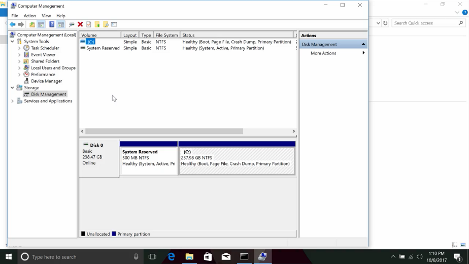

Next, let's take a look at how to do the exact same thing using Windows-CLI

### Windows view user and group information using CLI

We talked about using the CLI in-depth in the last module. We've seen how it can make our tests quicker when we modify files and folders. Now, we're going to start using commands to help us with other tasks on our system. Imagine you're working as an I.T. support specialist at a company and your boss asks you to check all the user information on 10 machines, to make sure that the local administrator account is not enabled. Sure you could search computer management in the search bar, click computer management local, look under system tools, click on local users and groups, then double click on the username of the computer to ensure that their local administrator account is enabled. Now, you just have to do that nine more times. There's a much faster way. You can just use the CLI to quickly see the list of users on the computer using the command Get-LocalUser.

As you can see, it lists my user account, a few other users and a couple of other default accounts that are part of Windows. Here you can see that my local administrator account isn't enabled. That's way easier.

What about groups? I bet you can guess, Get-LocalGroup will list the groups on the local machine. There are a whole bunch of groups but don't worry, these are all built-in groups. Each of them are important, but we aren't likely to make changes to most of them. One that we will make changes to is the administrators group. Remember, this group controls who has administrative access to the machine. It's important to know who's in this group since anyone in this group can make any change they want to the machine.

We just saw in the GUI that we're in this group, but I wonder who else is? Let's see who's in this group with Get-LocalGroupMember, and I want to check the administrators group. We can see that the administrator user and my user are in the administrators group but no one else. Looks good to me.

One last note, these local user and group PowerShell commands require that your running PowerShell 5.1 or newer. You may have noticed that I keep saying local accounts and local users. If your organization has a lot of Windows machines, it's very common to use active directory to manage user accounts in a central directory service. We'll learn more about active Directory accounts in our next course on system administration and I.T. infrastructure services. But let's focus on local accounts for now.

### Linux users superuser and beyond 

In Linux, user management access works just like it does in Windows. Different user types have different privileges and they can be grouped together with various access levels. There are a few differences in how Linux does labeling though. There are standard users and there are also administrators in Linux. There's also a special user called the root user. Don't get this confused with the root directory or slash. The root user is the first user that gets automatically created when we install a Linux OS. This user has all the privileges on the OS. They are the super user. There's technically only one superuser or root account. But anyone that's granted access to use their powers can be called a superuser too.

Now, let's try and view the contents of a root restricted file. The file path has etc sudoers. We're getting an error, cat/ etc/ sudoers permission denied. The sudoers file is a protected file that can only be read by root. We can log in as root and then run this command, no problem. But it can be really dangerous to always be in root.

Since root, like our local administrator account on Windows has unrestricted access on the machine. If we make even one mistake, we could delete or modify something important, and that's not good. So instead of logging in its root, we can tell the shell that we want to run this one command as root. So I'm so much to the Windows UHC feature. That's because it is. On Linux, we can do this with the sudo command or superuser do. So sudo cat /etc/ sudoers.

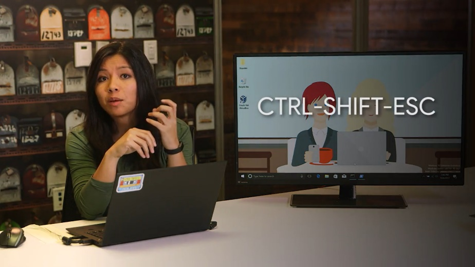

Now, we're able to see the contents of this file. If you don't want to run sudo every time you need to run a command that requires root privileges, you can just use the su command or substitute user. This will allow you to change to a different user. If you don't specify user, it defaults to root. Now, you can see my prompt says root@cindy-nyc.

Again, it's generally not a good guideline to stay logged in as root all the time. There are lots of critical services and files that can be mistakenly changed. If you need to log in as root, it's okay. But just be careful. Just going ahead and exit out of root for now and go back to my normal user.

You can view who has access to run sudo by viewing the /etc/group file. This is also how you view memberships for all groups. This looks a bit different from the windows GUI. But you can see there are some similarities to the Windows CLI.

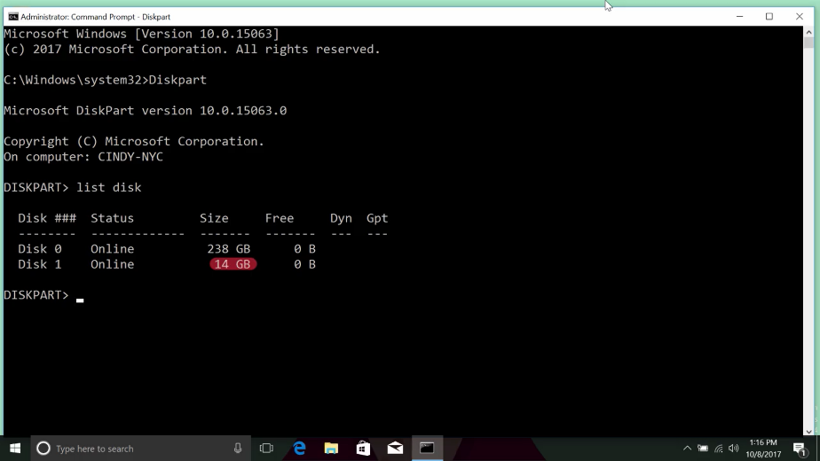

It's actually pretty simple to read this file, even if you're not an expert yet. Each line represents a different group.

Let's look at the seudo line. There are four fields here, separated by colons. The first field is the group name. In this case, it's seudo.

Second field is the group password. We don't really need to specify a group password so it defaults to the root password. The X here means that the password has been encrypted and store in a separate file that we'll talk about in a later lesson.

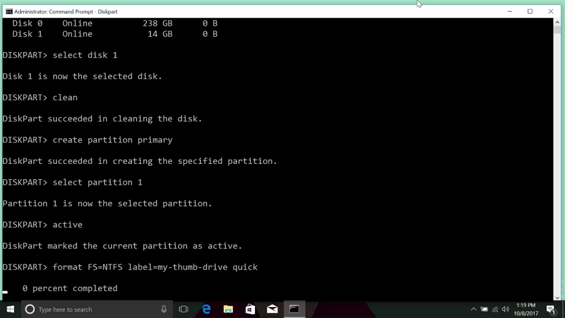

The third field is the ID of the group or group ID. When our operating system runs a task that involves a group, it uses a group ID instead of group name.

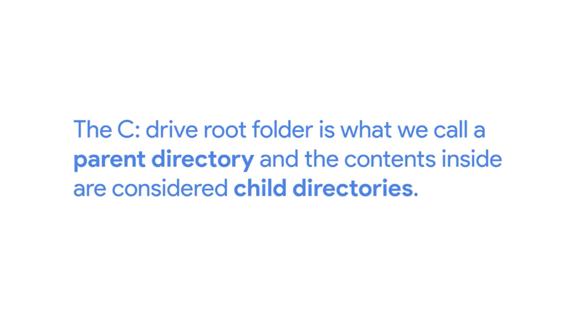

Finally, the last field is lists of users in the group.

What if you wanted to view the users on our machine? What do you think the file would be that stores that information? Unfortunately, it's not /etc/user. The file that contains user information is /etc/password. Wow, there's a lot more information on here and a lot more users.

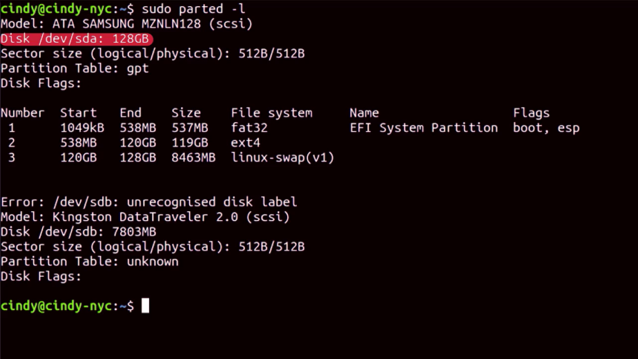

Most of these accounts aren't actually humans using the computer. They are a bunch of processes that are constantly running on a computer that we need to associate with a user. So our system has lots of users with different permissions that are needed to run these processes. Let's look at this first line here, which is an actual user we can log into root.

We won't talk about all the fields since they aren't important. But the first three are relevant. The first field is the username and the second field is the user password. The password isn't actually stored in this file. It's encrypted and stored in a different file, just like our group ID password.

The third field here is the user id or UID. Similar group IDS, user IDs or how our system identifies a user, not by the username. Root has a UID of zero.

That's basically how you view users and groups in Linux.

### Windows passwords 

In this video, we're going to talk about an important part of having users on a machine, and that's working with passwords. Passwords add security to our user accounts and machines, they make it so that only Marty knows the magic secret to access her account and no one else's, not even the admin of the computer. When setting up a password, you want to make sure that you and only you know that password.

Remember, if you're managing other people's accounts on a machine, you shouldn't know what their password is. Instead, you want the user to enter the password themselves. To reset a password in the GUI, let's go back to our computer management tool. Under local users and groups, we're going to right click on a username like this account Sarah. Let's click on properties.

Then from here, we're just going to check this box that says "user must change password at next log on", then apply and hit "OK."

Then, when the user logs into the account, they'll be forced to change their password. If they forgot their password, you have the option to set a password for them manually, by right clicking and selecting set password. This has some caveats though, like losing access to certain credentials. You can read more about this option in the supplemental reading right after this video.

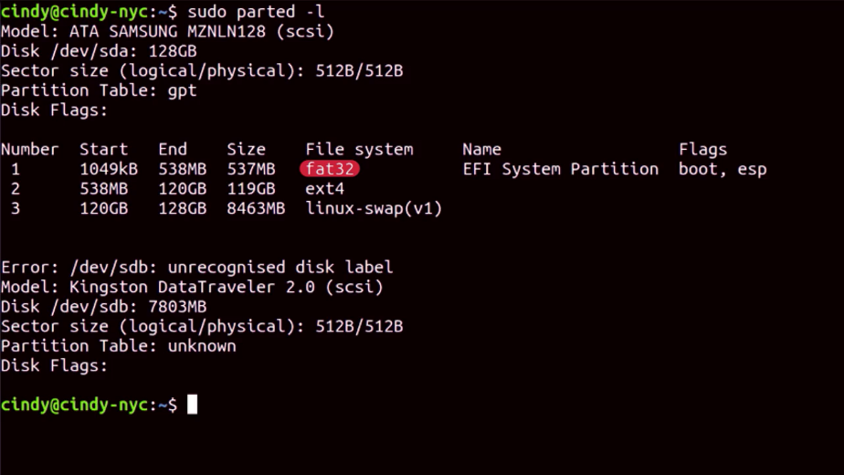

To change a local password in power shell, we're going to use the DOS style net command.

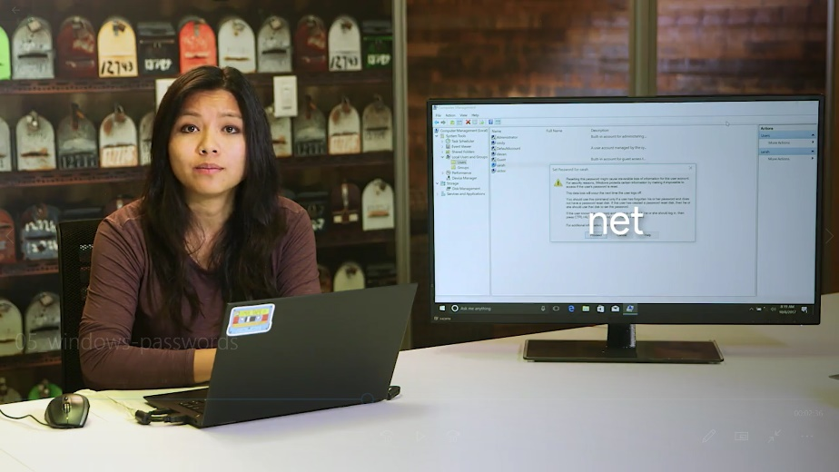

There's a native power shall command that can be used to set the password, but it's a little more complicated. It requires a bit of simple scripting to use. For now, we'll stick to the simpler, the less powerful net command.

net does lots of different things, changing local user passwords is just one of them. If you want to learn more about what the net command can do, take a look at the documentation in the supplementary reading for the command. Since this is an old DOS style command, you can also use the slash question mark parameter to get help on the command from the CLI.

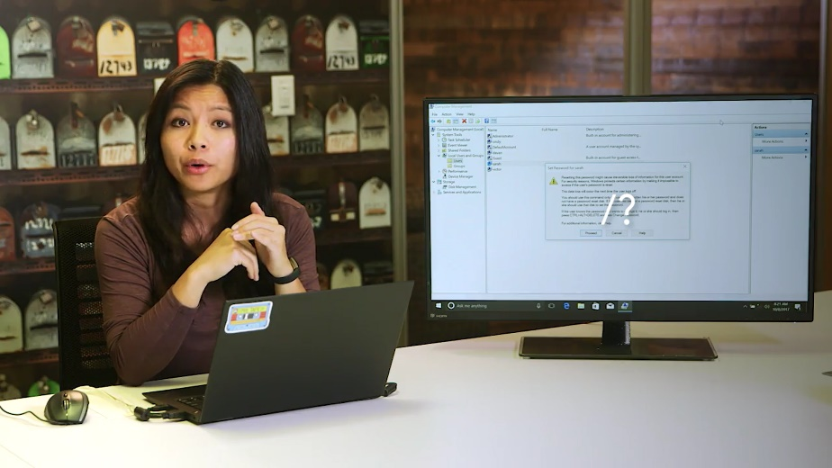

To change a password for a user, the command is net user then the username and password. The best way to use this command, is to use an asterisk instead of writing your password out on the command line. If you use an asterisk, knit will pause and ask you to enter your password like so. Why is this approach better?

Imagine you're changing your password and right at that moment someone walks behind you and glances over your shoulder. Your password isn't a secret anymore. You should also know that in many environments, it's common that the commands that folks run on the machines they use are recorded in a log file that's sent to a central logging service. So it's best that passwords of any kind are not logged in this way. Do you notice a problem with the asterisk approach though? That's right. If I change passwords for someone else using this command, I would know their password, and that's not good.

Instead, we're going to do what we did in the GUI and force the user to change the default password on their next log on using the /logonpasswordchg:yes.

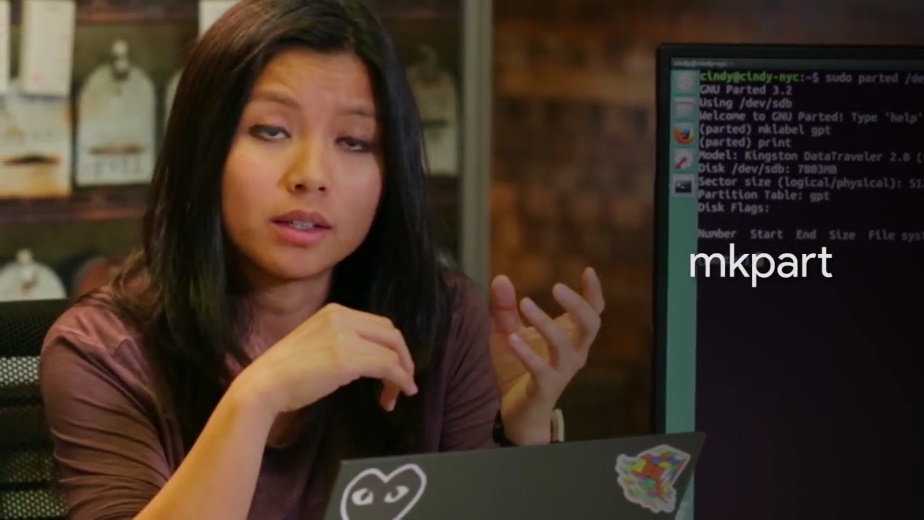

So I'm just going to force Victor to change his password on the next log on. So, net user victor /logonpasswordchge:yes.

The slash log on password change yes parameter means that the next time that Victor logs into this computer, he'll have to change his password. Sorry Victor.

### Linux passwords

To change your password in Linux, all you need to do is run the PASSWD or password command. Let's try changing my password.

When you set a password it's securely scrambled then stored in a special privileged file called slash etc slash shadow. This file can only be read by Root, to keep away prying eyes.

Even if you did have access, you wouldn't be able to descramble passwords found in here. If you're managing a computer, and you want to force a standard user to change their password, like we did in Windows, you can use the dash e, or expire flag with password, like this.

This will immediately expire a user’s password and then make them set a new password the next time they log in.

### Windows adding and removing users 

Okay. Now that you know how to view information about users and the hierarchy of user permissions, let's learn how to add and remove users on a machine. To add a user, we're going to go back to our computer management tool. Under local users and groups, we're going to right click and select New User.

From here, it asks us to set a username, a full name, and a password. Remember, that in order to use good password setting practices, we set a default password and then make the user change that password when they log in. So, we're going to go ahead and set a default password, and make sure the box for, "user must change password at next log on" is checked, and then click Create. So I'm just going to make a new user account for Elizabeth and have the password, and then just make sure that's checked, and hit Create. And that's how you create a new local user.

To remove a user, we simply right click and select Delete. This gives us a warning message that says, user names are unique, and even if you delete the user and give them the exact same username, they won't be able to access their old resources. Once you confirm that you want to do that, just go ahead and click delete it. And that's how you remove a local user account.

Adding and removing local user accounts from the CLI, is going to use the same net command that we use to change passwords, just with different parameters. Like before, there's a native power shell command, new dash local user, that requires a little bit of scripting to use. If you want to use new dash local user, check out the supplemental reading.

Now, back to net. To add a new local user, we simply use the slash add parameter. If we add the slash add parameter to the same command we used before, it instructs net to create the account. We can still use the asterisk for the password to be prompted to enter a password. Let's test this out and create a new account for Andrea. So, net user andrea \* / add. Now, let's list the user accounts to be sure it worked. So, Get-LocalUser. Sweet. There it is.

Now, there's a small problem which you saw in the earlier lesson on passwords. This account is for Andrea, but we know what the password is. We don't want to know what the password is because that means we can log in as Andrea. We want to make sure that Andrea changes her password to something that we don't know. So, we're going to flag her account as requiring a password change using the slash log on password change yes parameter.

So, net user andrea / logonpasswordchg:yes. Now you all know whather password is.

You can actually combine these two commands that we ran to create a new account that requires a password change at first login. Let's create an account for Cesar. So, net user cesar pa5swOrd / add / logonpasswordchg:yes. Now, when we run the Get-LocalUser, we should see both of our new accounts. Sweet. And there it is.

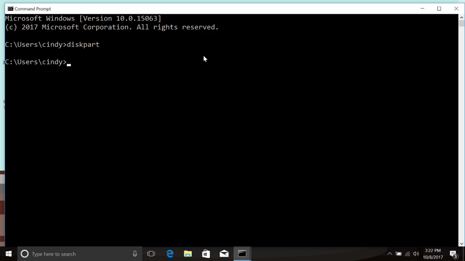

Cesar's new account has a password that you know and you can give it to him, but he'll have to change the password the first time he logs in.

All right. Now let's remove these accounts that we just created. I'm going to show you how to do this using net, and using Remove-LocalUser. Both of these commands will do the exact same thing. So let's delete Andrea's account, net user andrea /del. This will delete Andrea's account.

And using the Remove-LocalUser cesar, we can remove Cesar's account. Sweet, now it's gone.

See how each of these options follows a pattern. The net user example, looks just like it did to create a new user account, except instead of adding an account, we deleted the account.

In the second example, instead of getting, setting, or creating a new dash local user, we removed the account. As you continue to learn new CLI commands, you'll start to notice these sorts of patterns. Being able to identify these patterns will help you discover new things that you can do, and remember how to do things you haven't done in a while.

### Linux adding and removing users 

To add a new user in Linux, you can use the user add command. Sudo useradd juan. This will set up basic configurations for the user, and set up a home directory. We can verify that one is created, there.

You can combine this with the password command to make the user change their password and log in. To remove the user, you can just use sudo userdelete juan. He's no longer on the list.

Nice work. Next we'll dive into the wonderful world of permissions. See you there.

### Ben life as a cio 

I'm Ben Fried, I'm Google's Chief Information Officer and I'm the Vice President of the company. \[MUSIC\] I lead a team that's responsible for the technology that Googler's use to get their work done. That could be things like the laptop and phone that you use, or the video conferencing that you use in a conference room or the phone on your desk, maybe. But it's also all the software that Googler's use everyday in their work. I spend an awful lot of time actually in meetings, mostly meeting with my teams. Trying to understand what they're doing and what I as a leader can do to help them. Then I spend a lot of time also talking to our customers, people inside the company. So I can understand what my teams need to do and how we can better do our work. When I came and joined Google, the team that I led needed a lot of help. And it was a huge challenge for me to figure out what I needed to do as a leader to help them. And I just remember at one point realizing, if I keep on showing up and just keep on putting in the effort every day, we'll get through this. In spite of how hard it was and in spite of the fact that I would leave work thinking. I have no idea how I'm going to solve this problem or that problem or whatever it was. Eventually, showing up worked, being too stubborn and too stupid to know when to quit. Was actually what lead to me succeeding in an incredibly challenging situation.

## Permissions

### Windows file permissions

File permissions are an important concept in computer security. We only want to give access to certain files and directories to those who need it.

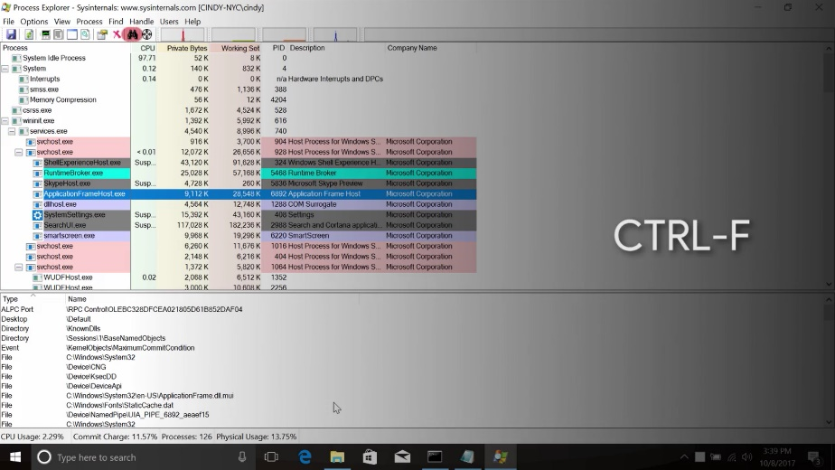

While we think about how we want users to access files and folders, we should also think about how the concept of permissions carries over to other areas of your life. Maybe you've locked down your social media post to only people you trust, or giving a copy of your house key to a relative in case of an emergency. You'll learn more about security principles in the last course of this program. For now, we're going to focus on one small building block, file permissions.

In Windows, files and directory permissions are assigned using Access Control Lists or ACLs. Specifically, we're going to work with Discretionary Access Control Lists or DACLs.

Windows files and folders can also have System Access Control Lists or SACLs assigned to them. SACLs are used to tell windows that it should use an event log to make a note of every time someone accesses a file or folder.

This is a more advanced topic which you can read up on in the next supplementary reading. You can think of a DACL as a note about who can use a file and what they're allowed to do with it. Each file or folder will have an owner and one or more DACLs. Let's take a look at an example.

In windows explorer, I have opened up my home directory. If we right click on desktop and select properties, we can see the properties dialog for our desktop directory. And if we go to a security tab, we can see the permissions window here. The top box contains a list of users and groups. And the bottom box has a list of the permissions that each user group has been assigned.

What do each of these permissions do? It changes a bit depending on whether the permission is assigned to a file or a directory. Don't worry, it all makes sense soon. Let's do a rundown of these permissions. Read, the Read permission lets you see that a file exists, and allows you to read its contents. It also lets you read the files and directories in a directory.

Read and Execute, the Read and Execute permission lets you read files, and if the file is an executable, you can run the file. Read and Execute includes Read, so if you select Read and Execute, Read will automatically be selected.

List folder contents, List folder contents is an alias for Read and Execute on a directory. Checking one will check the other. It means that you can read and execute files in that directory.

Write, the Write permission lets you make changes to a file. It might be surprising to you, but you can have write access to a file without having read permission to that file. The write permission also lets you create sub directories and write two files in the directory.

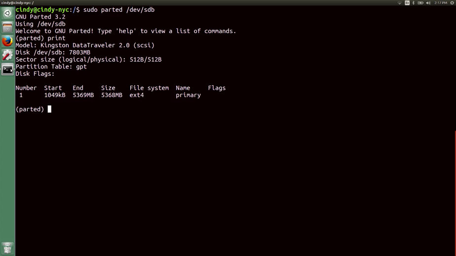

Modify, the Modify permission is an umbrella permission that include read, execute and write.

Full control, a user or group with full control can do anything they want to the file. It includes all of the permissions of Modify, and adds the ability to take ownership of a file and change its ACLs.

Now, when we click on my username, we can see the permissions for Cindy, which show that I'm allowed all of these access permissions.

If we want to see which ACLs are assigned to a file, we can use a utility designed to view and change ACLs called ICACLs or Improved Change ACLs. Let's take a look at my desktop first. ICACLs, Desktop. Well, that looks useful. But what does it mean? I can see the user accounts that have access to my desktop, and I can see that my account is one of them. But what about the rest of this stuff? These letters represent each of the permissions that we talked about before.

Let's take a look at the Help for ICACLs, I bet that'll explain things. So ICACLs, slash, question. All right. There's a description of what each one of these letters means.

The F shows that I have full control of my desktop folder. ICACLs causes full access, and we saw this in the GUI earlier as full control. These are the same permission.

What are these other letters mean? NTFS permissions can be inherited as we saw from the ICACLs help. OI means Object Inherit, and CI means Container Inherit. If I create new files or objects inside my Desktop folder, they'll inherit this DACL. If I create new directories or containers in my desktop, they'll also inherit this DACL.

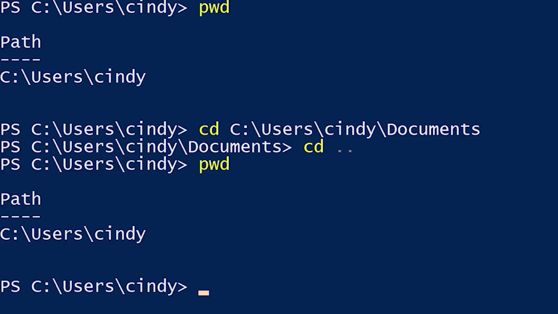

If you'd like to understand more about ACL inheritance and NTFS, check out the next supplemental reading.

### Linux file permissions

As we've now learned, there are files and folders that have different permissions set on them, so that unwanted eyes can't view or modify them. There are 3 different permissions that you can have in Linux; Read, this allows someone to read the contents of a file or folder. Write, this allows someone to write information to a file or folder. And execute, this allows someone to execute a program. Let's take a look at this with the LS command, we'll use the long flags so we can see the permissions on the file.

Okay. The first thing we see in this column is -rwxrw-r-- there are 10 bits here. The first one is the file type. In this example, dash means that the file we're looking at is just a regular file. Sometimes you might see D which stands for a directory.

The next nine bits are our actual permissions, they're grouped in trios or sets of three.

The first trio refers to the permission of the owner of the file.

The second trio refers to the permission of the group that this file belongs to.

The last trio refers to the permission of all other users.

The R stands for readable, W stands for writeable and X stands for executable.

Like in binary, if a bit is set then we say that it's enabled. So for our permissions, if a bit is a dash it's disabled. If it has something other than a dash, it's enabled.

Permissions in Linux are super flexible and powerful, because they allow us to set specific permissions based on our role. Such as an owner in a group or everyone else. Let's take a look at this in detail. The first set of permissions, rwx, refers to the permission of the user who owns that file. In this case, its Cindy. We can see in the owner field of ls- l. So it says here that the owner of the file can read, write, and execute this file.

The next set of permissions are group permissions. We can see the group this file belongs to is the cool group. They have read and write permissions but not execute permissions.

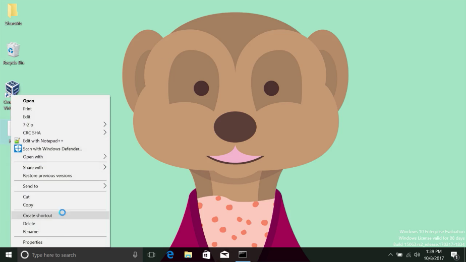

And lastly, the permissions for all other users and groups only allow them to read this file.

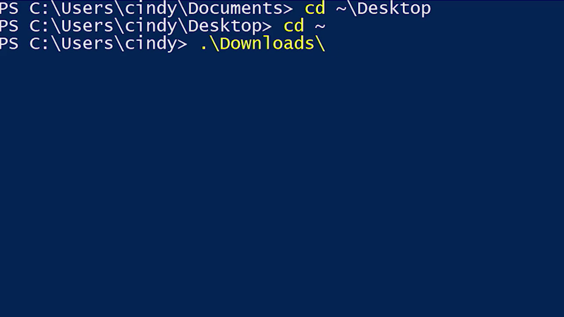

And that's Linux permissions in a nutshell, it might take some time to get used to reading permissions. Don't worry, you'll eventually get the hang of it. As always, feel free to review this lesson again if you need a refresher.

### Windows modifying permissions

Now that we can read permissions, let's take it a step further and learn how to change permissions in windows. Let's say we want to give access to another person in my family to view a folder with family pictures on the computer. How do I do that?

On my Local Disk C, I have a folder called Vacation Pictures that I want to share with another user on my machine, Devan. To do that, I'm going to right click on this folder and go to Properties, then the Security tab. Now I can see an option to Edit file permissions. I'm going to click on that.

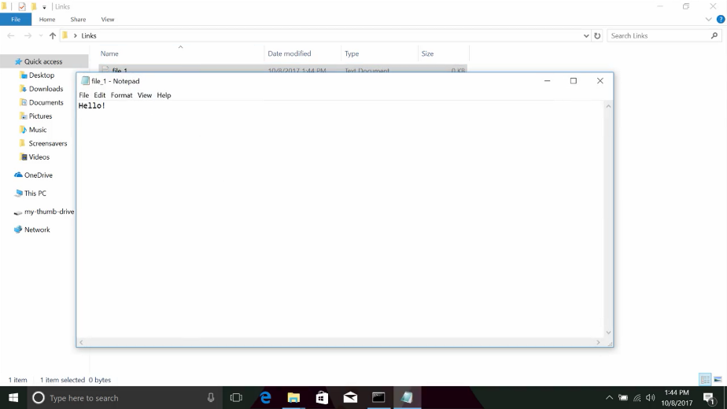

From here, I can see that I can add a group or usernames to this ACL. I'm going to go ahead and click Add. From here, it asked me to enter the username of the person I want to add on this ACL.

I'm going to enter devan and then click Check Names to verify that I typed it in right. After it's been verified, I'm going to click OK.

Once devan's added to the ACL, I can click on his username, then check the allow boxes for the permissions I want to give him. Let's give Devan modify access, so you can add pictures to this folder too. That's it.

We've kind of been glossing over this other checkbox here Deny. You might have already guess that Deny doesn't allow you to have a certain permission. But it's special because it generally takes precedence over the allow permissions.

Let's say Devan is in a group that has access to this folder. If we explicitly check the deny box for Devan's username, even if the group has access to the folder Devan won't. Sorry, Devan.

If you want to learn more bout permission precedence, you can check out the supplemental reading.

To modify a permission in the CLI, we're going to return to the icacls command. In the examples I'm going to show you, will be running icacls from PowerShell. The icacls command was designed for the command prompt before PowerShell. And its parameters use special characters that confuse PowerShell. By surrounding icacls parameters with single quotes, I'm telling PowerShell not to try and interpret the parameter as code. If you run these commands in command.exe, you'll need to remove the single quotes for them to work.

So let's look at this side by side with PowerShell.exe and command.exe.

In PowerShell, the command would be icacls 'C:\\Vacation Pictures\\ /grant' with single quotes, 'Everyone: (OI)(CI)(R). In command prompt, the command would be icacls with double quotes "C\Vacation Pictures"/grant Everyone:(IO)(CI)(R).

We're going to see with this command does in just a moment. For now, let's take a look at the difference in the quotes. In the PowerShell example, we add single quotes to make PowerShell ignore the parentheses and because there's a space in the path. In the command.exe example, we have to use double quotes for the path. And we don't need the single quotes anymore to hide the parentheses. Got it? Great.

Now, let's take a look at the permissions that we just gave to Devan with icacls. Cool. I see there's a new decal attach to the vacation pictures directory for Devan, that gives him modify access. We can see that any new files or folders that get created in vacation pictures will be inherited.

So let's say we want anyone with permission to use this computer to be able to see these pictures. We don't want them to add or remove photos though. What permissions do we want to give them? That's right. We want to give them read permission to the Vacation's Picture folder. Let's use the special group Everyone to give read permissions to the directory. So icacls 'C:\\ Vacation Pictures' /grant Everyone:(OI)(CI)(R). Success.

The Everyone group includes, well, Everyone and includes local user accounts like Cindy and Devan.

Guest users: This is a special type of user that's allowed to use the computer without a password. Guest users are disabled by default. You might enable them in very specific situations.

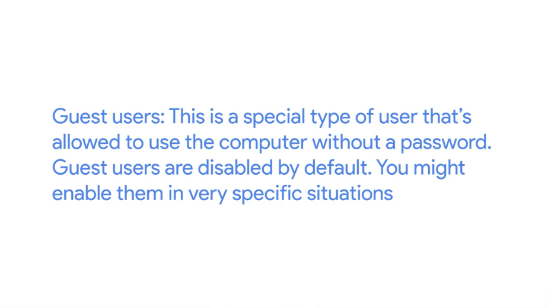

Now anyone who can use this computer can browse the photos that Devan and I have put together.

Actually, maybe I didn't really want everyone to look at my vacation photos. Maybe I just want the people that have passwords on the computer to be able to see them. In that case, I want to use authenticated users group. That group doesn't include guest users.

So first, let's add a new DACL. icacls 'C:\Vacation Pictures' /grant' Authenticated Users:(OI)(CI)(R). Success. Now, let's remove the permissions for the Everyone group. icacls 'C:\Vaction Pictures' /remove Everyone. Success.

Now, let's use icacls to verify that the permissions are set away we intended. icacls 'C:\Vacation Pictures'.

Sweet. We can see the Authenticated Users were added and Everyone is removed. Next, let's take a look at modifying permissions in Linux.

### Linux modifying permissions

In Linux, we change permissions using the chmod, or change mode, command. First, pick which permission set you want to change. The owner, which is denoted by u, the group the file belongs to, which is denoted by a g, or other users, which is noted by an o.

To add or remove permissions, just use a plus or minus symbol that indicate who the permission affects. Let's take a look at some examples. So that's chmod u+x my_cool_file. This command is saying that we want to change the permission of my_cool_file by giving executable or x access to the owner or u.

You can do the same thing if you wanted to remove a permission. So, chmod u-x my_cool_file. Instead of a plus, we just minus. Pretty simple, right?

If you wanted to add multiple permissions to a file, you could just do something like this. This is saying we want to add read and execute permissions for the owner of my_cool_file. And you can do the same for multiple permission sets. You do chmod ugo+r my_cool_file.

Now, this says we want to add read permissions for our owner, the group the file belongs to, and all other users and groups.

This format of using rwx and ugo to denote permissions and users in chmod is known as symbolic format.

We can also change permissions numerically, which is much faster and simpler, and lets us change all permissions at once. The numerical equivalent of rwx is 4 for read or r, 2 for write or w, and 1 for execute or x.

To set permissions, we add these numbers for every permission set we want to affect. Let's take a look at an example.

The first number 7, is our owner's permission. The second number, 5, is our group permissions, and the third number, 4, is the permission for all other users.

Wait a minute, where are we getting 5 and 7? Remember, you have to add the permissions together. If you add 4, 2, and 1 together, you get rwx, which equals 7. So our owner permission is able to read, write and execute this file. Can you guess what 5 would stand for? That's right? 4 plus 1 is read and execute.

So now, you can see how numeric format is quicker than symbolic format. Instead of running something like this, We can run chmod 754 my_cool_file to update them all.

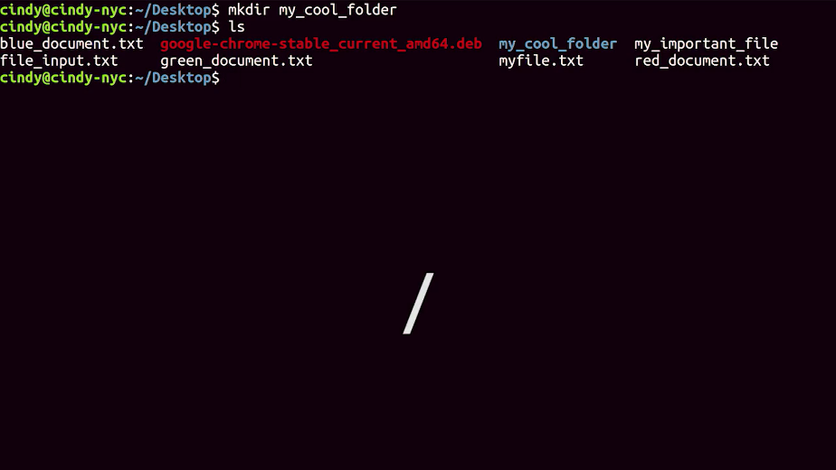

Either way, you can change permissions using the symbolic or numerical format. Just pick whichever is easiest for you.

You can also the owner and the group of a file. The chown or change owner command allows you to change the owner of a file. Let's go ahead and change the owner to Devan. Awesome. And Devan is the owner of this file.

And to change the group of file belongs to, you can use a chgrp or change group command. Awesome.

Now, the best group ever is the group owner for this file.

It may take a while for you to get the hang of reading and changing permissions. You can practice changing the permissions on a few files until you get it down. Permissions are an essential building block to computer security, and you'll be using it throughout your work as an IT Support Specialist.

### Windows special permissions

You might have noticed that we were looking at permissions in the GUI before. There's a check box in the permission list for special permissions.

The permissions that we've been looking at and setting so far are called simple permissions. Simple permissions are actually sets of special, or specific permissions.

For example, when you set the re-permission on a file, you're actually setting multiple special permissions. Let's take a look at the list of special permissions available. I'm going to click on the advanced tab under my permissions setting.

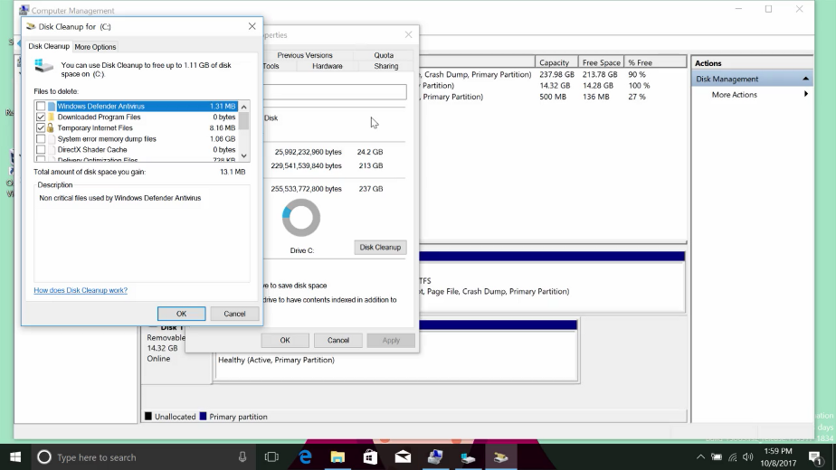

When I click on a username, and then go to Advanced Permissions, I can see a list of all the special permissions enabled on that file. When we select a basic permission like Read, we're actually enabling the special permissions List folder / read data. Read attributes, read extended attributes, read permissions, and synchronize, which are just fine-tuned permissions.

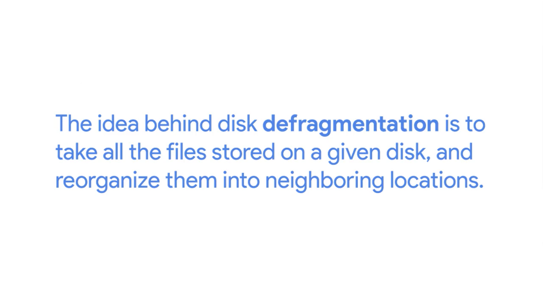

You can modify these permissions like you would any other basic permission. Feel free to read more about the different types of special permissions in the supplemental reading I included after this video.

In most cases, the simple permissions are going to be all that you need. But sometimes, you need to create a file or folder that doesn't quite follow a simple pattern.

Let's take a look at an example in this CLI. To view special permissions on a file in the CLI, we will simply use the icacls command as before. Let's take a look at a more interesting example than my desktop folder, icacls C:/Windows/Temp.

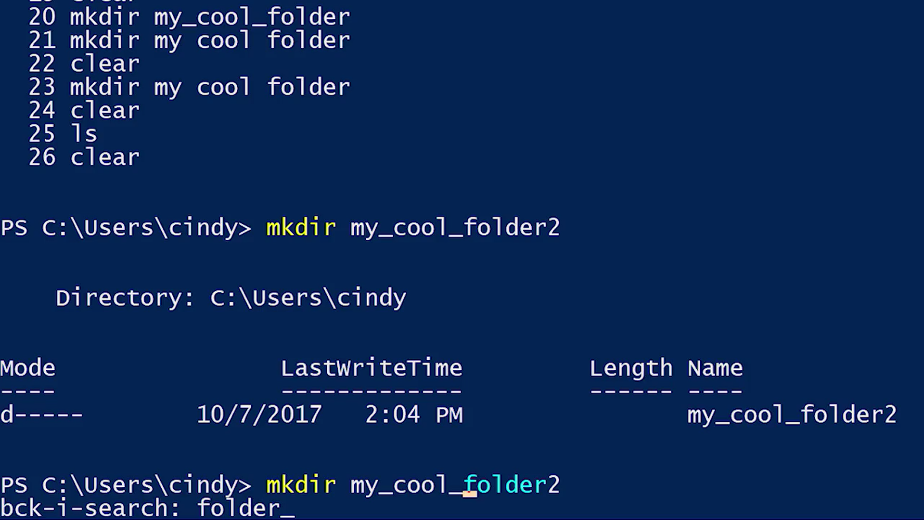

This directory is used to hold temporary files for all users in the system. We would like for everyone in the system to be able to create files and folders here. You might think that we should use modify or full control for this, but we don't want users to be able to delete each others files.

Let's take a look at some of the DACLs assigned to this folder and figure out how to do this. First, local administrators and the operating systems computer account have full permissions over this folder, and all files and folders within it. We see a new descriptor, IO, which indicates that this DACL is inherit only. That means that it will be inherited, but it is not applied to this container C:\Windows\Temp.

The users group includes all user accounts on the local machine. We're going to let users WD, or create files like data, AD, create folders and append data, and S for synchronize.

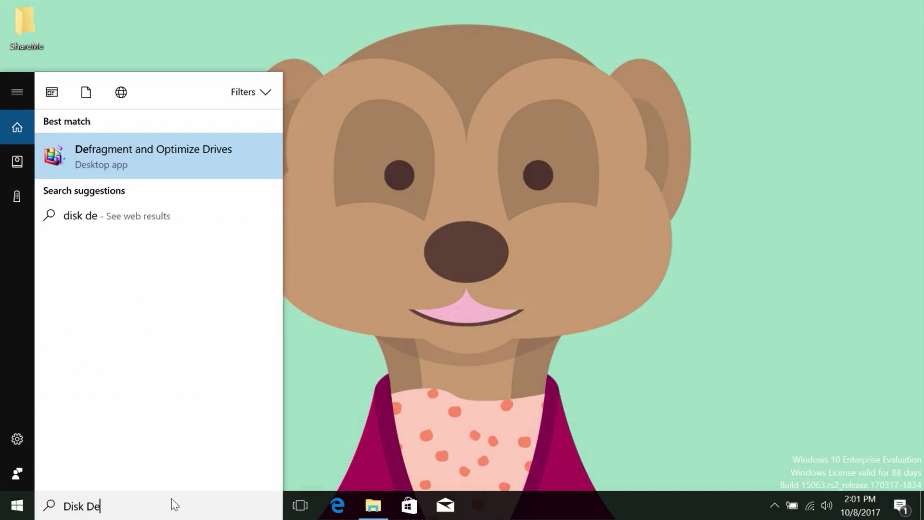

You can see in the next supplemental reading that these special permissions are included in the modified simple permission. Unlike the modify a simple permission, we are not granting users the ability to delete files or folders. We do want users to be able to delete their own files and folders, though, so how do we do that? So, if you see creator owner, creator owner is a special user that represents the owner of whichever file the DACL applies to. In this directory, and all subdirectories, whoever owns a file or folder has full control of it.

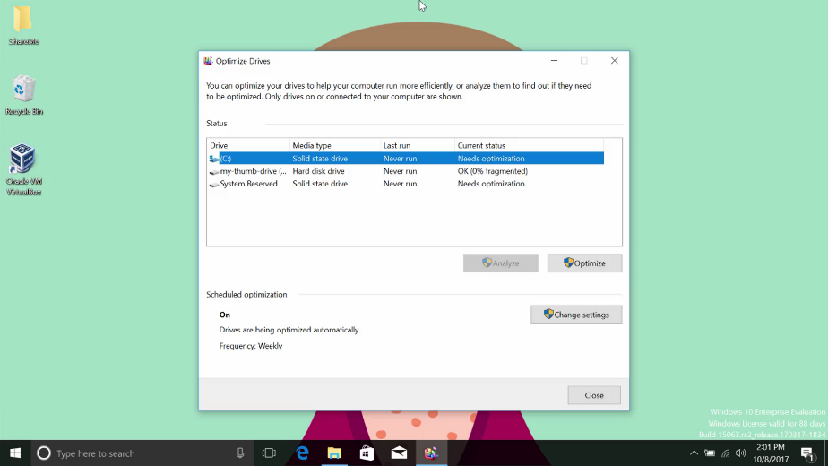

Nice, so I'm going to create a folder and file in C:\windows\temp and see what DACLs are applied.

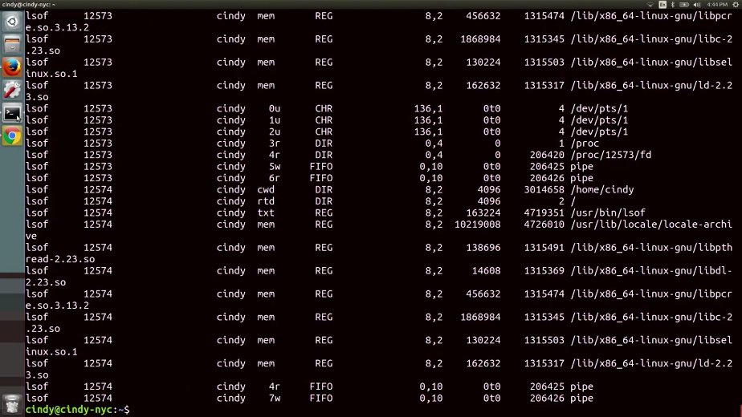

Let's use what we learned about output redirection to record the output of the icacls in this file, so icacls. Example for c:/Windows/Temp/example. Then we're going to use our redirector output to give us icacls.txt.

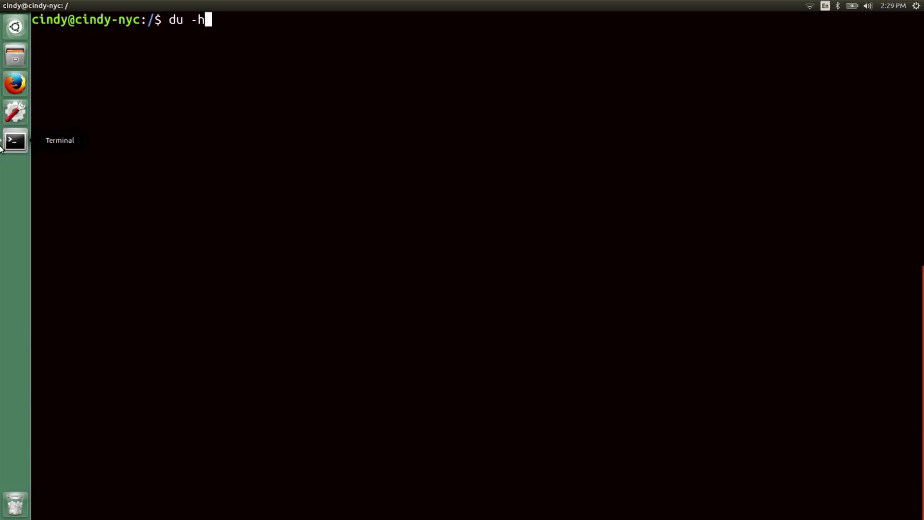

Okay, now let's look at the file we created to view the output of icacls.

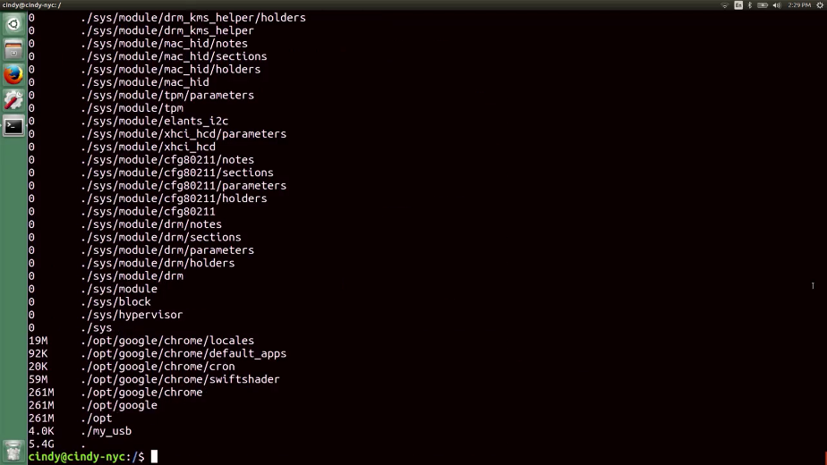

Cool, I created the files, so I have full control of them. And all of the other DACLs that we saw in c:/windows/Temp have been inherited.

You can see that using the specials permissions in NTFS DACLs can be complicated, but it can also let you create really powerful sets of permissions customized to your exact needs.

### Linux setuid setgid sticky bit

At Linux, we also have special permissions. What if I want a user to be able to do something that requires root privileges, but I don't want to give them these privileges? What's the use case for this? Glad you asked.

There are certain commands that need to change files that are owned by root. Normally, if you need to change a file owned by root, you'd have to use sudo. But we want it to be able to have normal users change the files without giving them root access. Let's check out an example.

Let's say I want to change my password. I would use a password command like we've learned. Pretty simple, right?

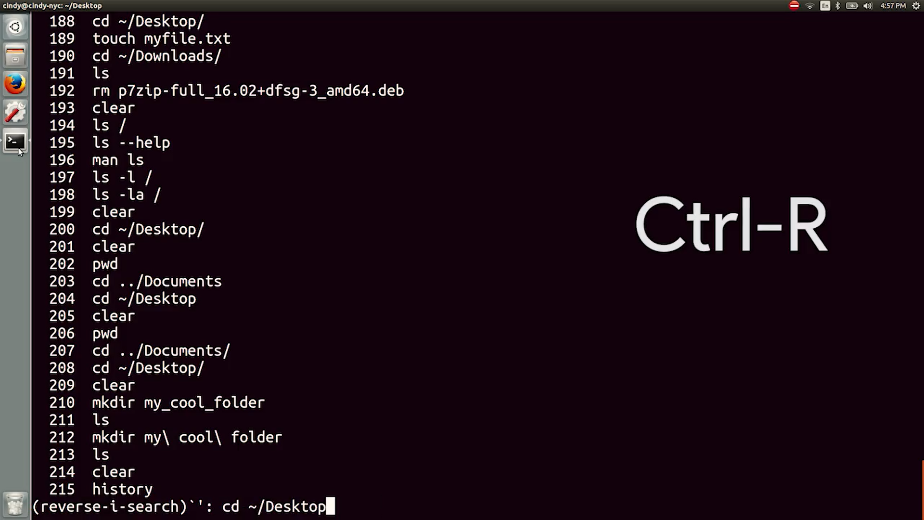

Now I just enter in my new password and my password is changed. We know that the password command secretly scrambles up our passwords then add them to this etc shadow file. Let's dive a little deeper into this file. Oh, it says this file's owned by root. How are we able to write or scramble passwords in this file, it's owned by root. Well, thanks to a special permission bit known as setuid we can enable files to be run by the permission of the owner of the file. In this case, when you run the password command, it's being run as root. Let's verify this.

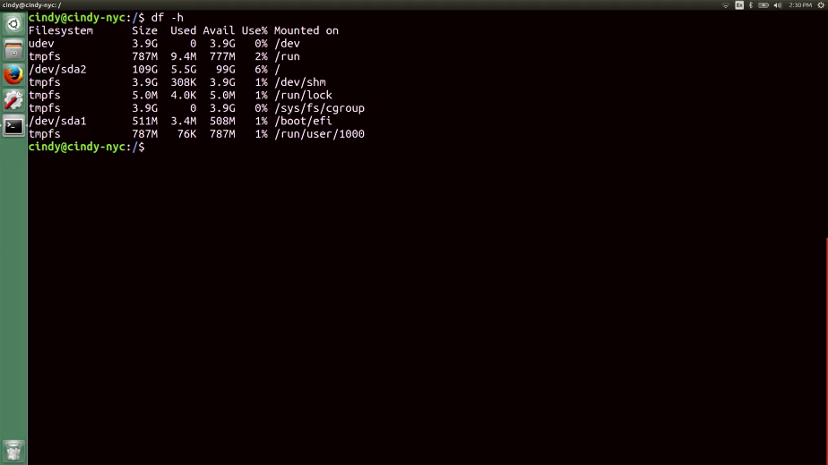

We see the permissions on this file look a little odd. There's an S here where the x should be. The s stands for setuid.

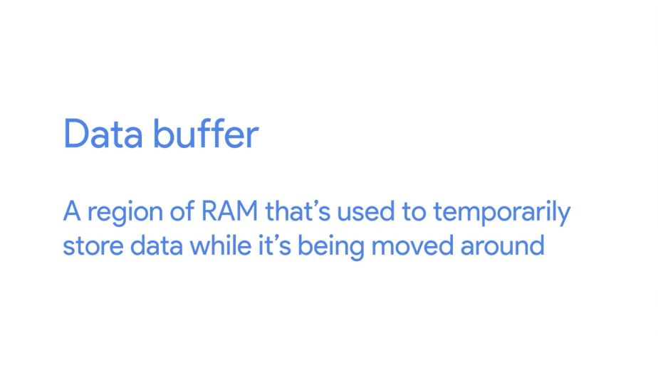

When the s is substituted where irregular bit would be, it allows us to run the file with the permissions of the owner of the file. To enable the setuid bit, you can do it symbolically or numerically. The symbolic format uses an s while the numerical format uses a 4, which you prepend to the rest of the permissions like this.

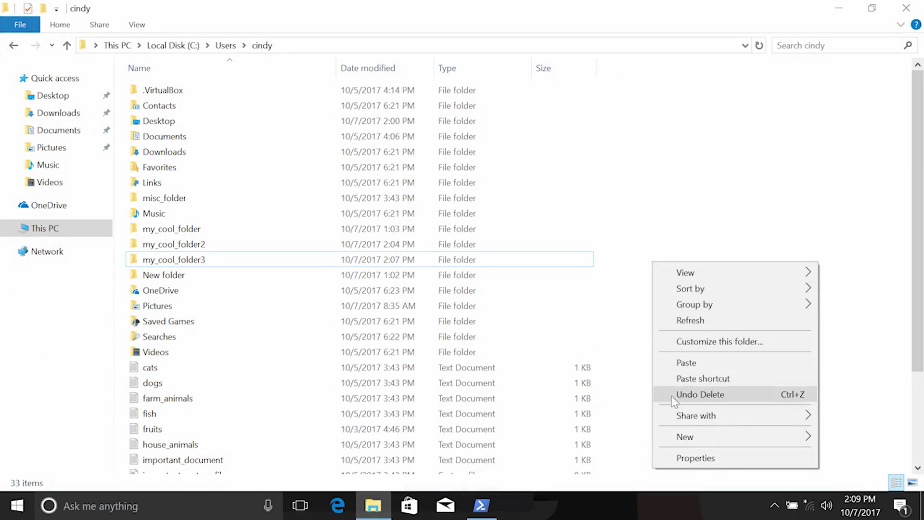

Similar to setuid, you can run a file using group permissions with setgid or set group ID. This allows you to run a file as a member of the file group. Under our group permissions, we can see that the setgid bit was enabled, meaning that when this program is run, it's run as group tty.

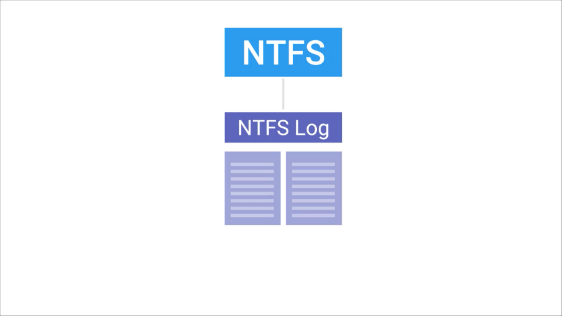

To enable the setgid bit, you can do something similar to setuid. The only difference is the numerical format uses a two. So, I can do something like this or something like this.

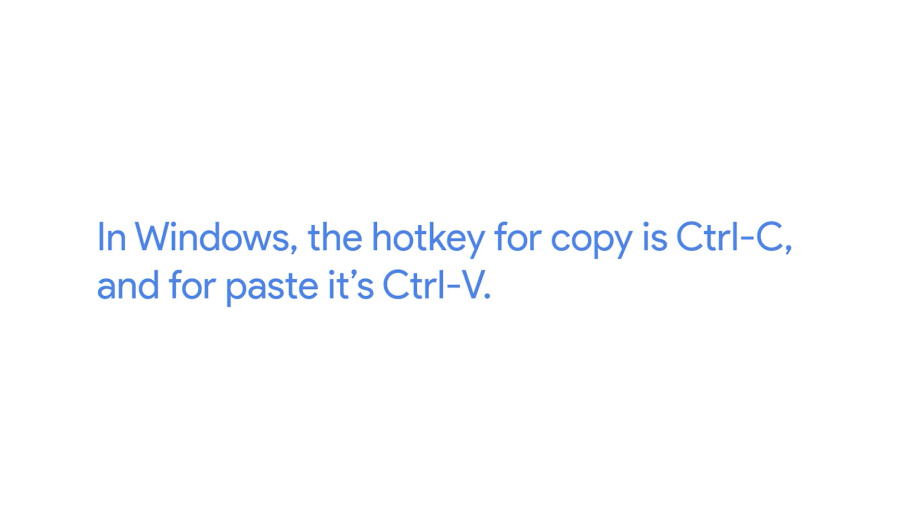

There's one last special permission bit we should cover and that's the sticky bit. This bit sticks a file or folder down. It makes it so anyone can write to a file or folder, but they can't actually delete anything. Only the owner of root can delete anything. Let's look at permissions for slash tmp directory or a lot of programs write temporary files to and you'll see what I mean.

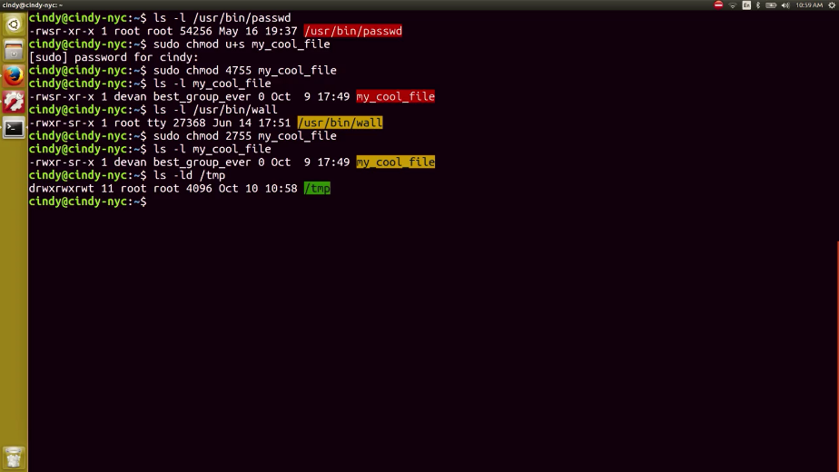

I added the d flag to show information just for the directory and not the contents. But as you can see, there's a special permission but at the end here t, this means everyone can add and modify files in the slash tmp directory, but only root or the owner can delete the slash tmp directory.

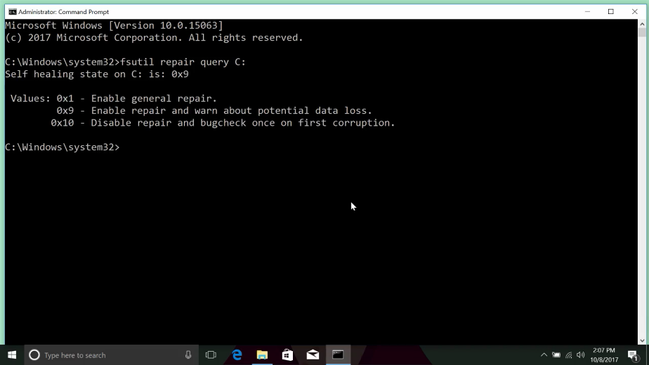

You can also enable the sticky bit using a numerical or symbolic format. The symbolic bit is a t and the numerical bit is a one. So, sudo chmod plus t my folder or sudo chmod 175 my folder. Works. So let's verify.

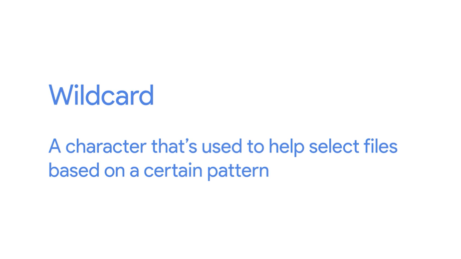

That was a lot of information on special bits. You usually won't have to deal with these permission bits in a practical day-to-day manner but it's important to know they exist in case you ever want to allow users to either share folders or even run commands with escalated privileges.

User access, group access, passwords, and permissions are all core concepts in security. Right now, you're only working with permissions and access on a single computer scale.

Eventually, you'll learn about access on multi-user levels across different networks and more in the next course on system administration and IT infrastructure services. For now, congratulations, you've just taken your first step toward building a foundation of computer security knowledge. In the next module, we're going to switch gears and talk about our OS and how it manages software.

Next, we've got two assessments for you covering Windows and bash permissions. Once you've finished, you're granted permission to take a break before we hit the ground running in the next module.
