# Table des matières
- [1 Navigating the system](#navigating-the-system)
- [2 Users and permissions](#users-and-permissions)
- [3 Package and software management](#package-and-software-management)
  - [3.1 Software distribution](#software-distribution)
    - [3.1.1 Module introduction](#module-introduction)
    - [3.1.2 Windows software packages](#windows-software-packages)
    - [3.1.3 Linux software packages](#linux-software-packages)
    - [3.1.4 Windows archives](#windows-archives)
    - [3.1.5 Linux archives](#linux-archives)
    - [3.1.6 Windows package dependencies](#windows-package-dependencies)
    - [3.1.7 Linux package dependencies](#linux-package-dependencies)
  - [3.2 Package managers](#package-managers)
    - [3.2.1 Windows package manager](#windows-package-manager)
    - [3.2.2 Linux package manager-apt](#linux-package-manager-apt)
  - [3.3 What’s happening in the background](#whats-happening-in-the-background)
    - [3.3.1 Windows underneath the hood](#windows-underneath-the-hood)
    - [3.3.2 Linux underneath the hood](#linux-underneath-the-hood)
  - [3.4 Device software management](#device-software-management)
    - [3.4.1 Windows-devices-and-drivers](#windows-devices-and-drivers)
    - [3.4.2 Linux-devices-and-drivers](#linux-devices-and-drivers)
    - [3.4.3 Window-operating-system-updates](#window-operating-system-updates)
    - [3.4.4 Linux-operating-system-updates](#linux-operating-system-updates)

# Navigating the system

# Users and permissions

# Package and software management

## Software distribution

### Module introduction

Congrats. You've made it to the halfway mark in this course. You already learned how to navigate around the Windows and Linux file systems, you also learned how to manage users and groups, and the basics of permissions and access. Nice work. Next, we're going to learn about packages and the major package managers for Windows and Linux. Installing and maintaining packages is something you'll do almost every day in an I.T. support role. So you should be familiar with how this works on the Windows and Linux OS's. Let's get to it.

### Windows software packages

Have you ever wondered how we get software, like the apps in the App Store, or packages on the Internet to install on our devices? Wonder no more. Developers and organizations that make the software we use, generally package them up nicely for us.

In most cases, all we need to do is click install and the package gets installed for us. Packaging comes in all sorts of shapes and sizes. It's just like how you'd package a gift for someone. You could put it in a box or a bag, but the contents are what really matter. Developers have different ways to package software using software compiling tools. But at the end result is a package. In the next few videos we'll discuss some of the most common package types you'll see when you work in IT support.

In Windows, software is usually packaged as a dot exe or executable file. Executable files contain instructions for a computer to execute when they're run, like copy this file from here to here, install this program, or more generically, perform this operation. The concept of an executable file isn't unique to Windows, but Windows has its own special implementation of them in the form of the exe's. They're created according to Microsoft's portable executable or PE format.

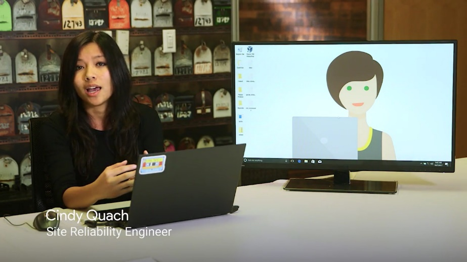

Although we won't get into the details of the PE format, it's good to know that exe files don't just contain instructions for the computer to perform. They also include things like text or computer code, images that the program might use, and potentially something called an msi file. A Microsoft install package or msi is used to guide a program called the Windows Installer in the installation, maintenance, and removal of programs on the Windows operating system.

Besides using the GUI setup wizard to guide the user in installing the program, the Windows installer also uses the msi file to create instructions on how to remove the program, if the user wants to uninstall it.

Windows executable files are usually used as starting points to bootstrap the Windows installer. In this case, they might just contain an msi file and some instructions to start the Windows installer and read it.

Alternatively, executables can be used as stand-alone, custom installers, with no msi file or usage of the Windows installer. If they're packaged this way, the exe file will need to contain all the instructions that operating system needs to install the program. So, when would you use an msi file and the Windows installer? And when would you use an executable with a custom installer packaged in something like setup.exe? Great questions.

If you want precise granular control over the actions Windows takes when installing your software, you might go the custom installer route. This can be tricky though, especially when managing things like code dependencies, which we'll talk about later. On the flip side, using the Windows installer guided by an msi file takes care of a lot of the bookkeeping and set up for you, but it has some pretty strict rules about how the software gets installed.

As of Windows 8, Microsoft has introduced a platform to distribute programs called the Windows Store. The Windows Store is an application repository or warehouse, where you can download and install universal Windows platform apps. Those are the applications that can run on any compatible Windows devices like desktop PCs, or tablets. These programs use a format called appx to package their contents and act like a unit of distribution. We won't go into detail about appx packages, but it's good to know they're out there giving you another option for packaging software. Feel free to read more about appx packages and how to make them in the supplemental readings I've included after this video.

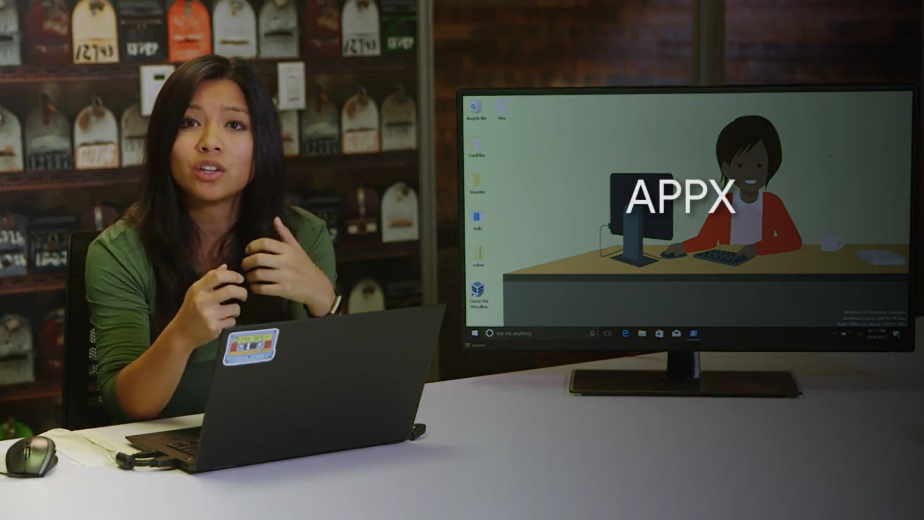

We learned how to install exe packages in an earlier course. To install an exe from the GUI, all we need to do is double click on the executable then go through the installation process provided, either by the executable itself or the Windows installer.

That's pretty straightforward, but what about installing software from the command line? And why would you need to do this in the first place? Hold onto your desktops because you're about to find out.

Installing executables from the command line can be handy in lots of IT support scenarios, including automatic installations. You might want to write a script or use a configuration management tool to install some software automatically without needing a human to click buttons in an installation wizard. So, how can you install an executable from the command line? The answer, it depends. Pretty unsatisfying, I know.

Running exe files from the command line is pretty simple. You open up a Command Prompt or PowerShell, change in to directory where the executable is, and type in its name. You could also just type the absolute path of the exe from wherever you are in the file system, like this, C:\users\cindy\desktop\hello.exe.

Running from an installer from the command line is similar, but will potentially have more options for installation. Depending on the installer, you might have flags for things like a silent installation, where nothing shows up on the screen and the package is installed quietly, or you might get an argument to have the computer reboot automatically after the package is installed. You can check out the options for packages created by using the Microsoft Self-Extractor in the supplemental reading for a better idea of what we are talking about.

A given installer might have these kinds of options for installing from the command line, but they vary from vendor to vendor. The options available for a Microsoft package might differ from the options for a Mozilla package.

Pro tip, try using the slash question mark parameter when running a package from the command line to see what kinds of sub commands the package might support.

If the package doesn't have any help related options, your best bet is to check out the vendor's documentation for what kinds of installations their software packages support.

### Linux software packages

In Linux, there are lots of different distributions and each might have different package types. For example, in the Linux distribution or Distro, Red Hat, the packages that are used are.rpm or Red Hat Package Manager packages. We won't cover how to work with RPM packages, but just be aware that packet types can change when you're working with different Linux distributions. If you're interested in learning more about RPM packages, I've included a link in the supplementary reading right after this video.

In this course, we'll be working with Debian packages which Ubuntu uses. A Debian package is packaged as a.deb file for Debian.

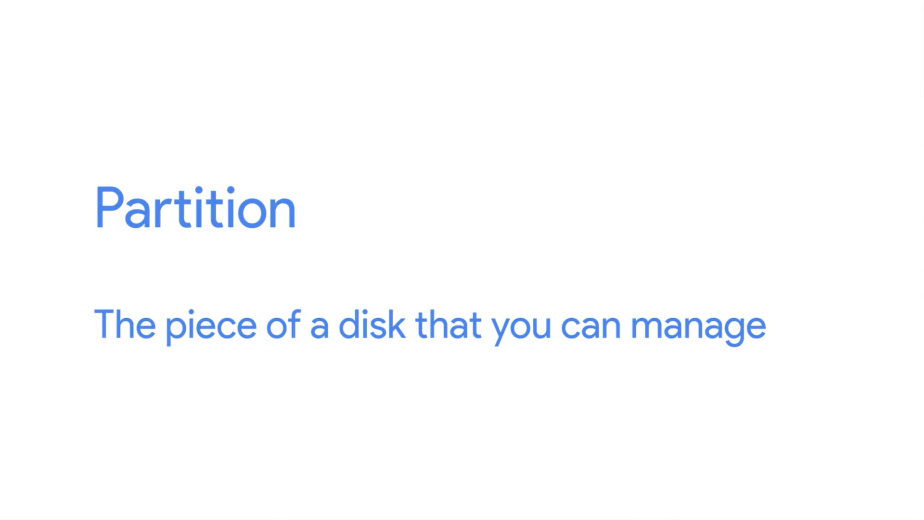

You've already learned how to install a Linux package using the help of a package manager in the first course on technical support fundamentals. We'll dive deeper into this in a later video, but let's focus now on how to install a single standalone Debian package. You'll have to work with standalone Debian packages, especially when developers package and release their software on different websites. To install a Debian package, you'll need to use the D package or Debian package command.

There is a standalone package here for the open source text editor, atom. Let's go ahead and install it using D package. We have to use the iFlag for the install, and that's it.

Now it's installed on this computer.

How about if we wanted to remove a package? To do that, we use the R or remove flag. And that's how you install and remove a standalone Debian package. Pretty simple, right?

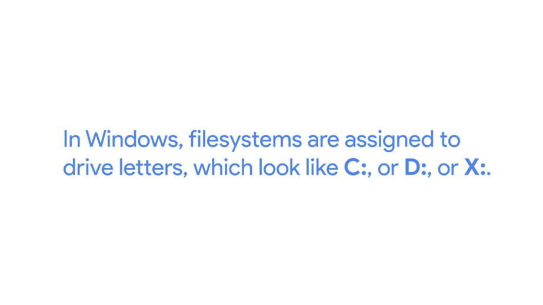

You can also list the Debian packages that are installed on your machine with a D package dash L. The L is for list.

There are lots of programs on here. It looks kind of messy. Can you think of another command that we've used before that would help us search if a certain package is installed? That's right. The grep command.

Let's say we want to search for the atom package we just installed. Keep in mind I just uninstalled it, so am just going to install it really quickly. Now let's run D package dash L grep atom. Here, we have the D package dash L command that's been piped to grep.

Remember, the pipe command takes the standard output of one command which in this case is the output of the D package dash L. Then, it sends it to the standard input of the command it pipes to. In this case, grep. If we run this command, it shows us that atom is definitely in the list of packages here. Just remember that when using grep, it lists other results that have the search terms in the name.

Just like that, we've learned how to install any Debian package in Linux. We're really cooking now. Great work.

### Windows archives 

One type of package that we haven't discussed yet isn't really a package at all, it's an archive. An archive is comprised of one or more files that's compressed into a single file.

Package archives are basically the core or source software files that are compressed into one file. When we install software from a source archive, it's referred to as, installing from source. Popular archive types you'll see are .tar, .zip, and .rar.

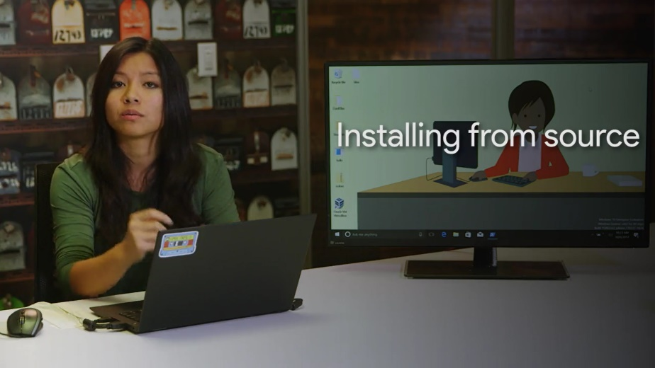

To install software found in an archive, you first have to extract the contents of the archive so you can see the files inside. Then, depending on what type of code it was written in, you have to use a specific method to install it.

We won't discuss how to install from source, since it changes depending on what language the software was written in. But we'll discuss how to extract the contents of an archive, which you'll have to do a lot as an IT support specialist. It's not just software that's stored in an archive, anything can be archived, like pictures or music files. You'll see these a lot in IT support.

To make things more complicated, archive types have lots of different way they can be extracted. Luckily, there's a very popular tools in windows for file archiving and unarchiving different file types, like .rar .zip and tar. This is the open source tool 7-zip.

It's already installed on my computer. If you want to download it yourself, I've included a link in the supplemental reading.

There's an archive on my desktop called colors.zip. Let's go ahead and extract this archive so that we can see the files inside. I'm just going to right click, 7-Zip, extract, here.

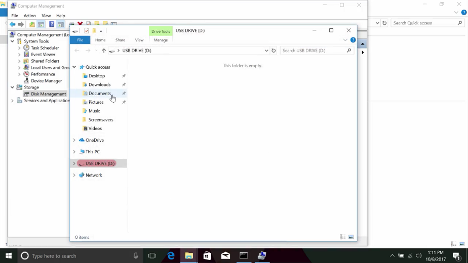

It looks like there are a bunch of files inside of this archive. Besides unarchiving files, you can also archive files. I'm going to make a new folder called new colors. Then, I'm going to add this new blue dot text file and the old colors in this folder. Then, I'm just going to archive it with 7-Zip and Add to archive. Click OK. Pretty cool, right?

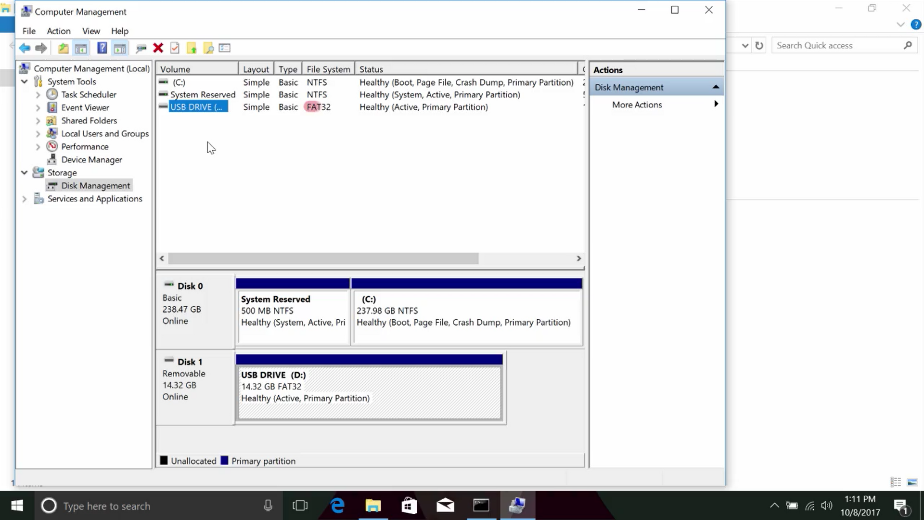

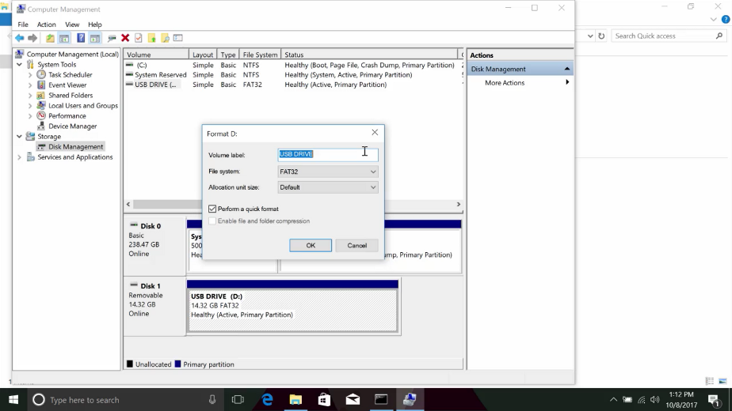

Now, if you wanted to send someone a bunch of files in an email, you don't have to send them one by one. Instead, you can combine them all in one archive and send one single file. If you're using PowerShell version 5.0 of greater, you can actually extract and compress archives right from the command line.

Let's say you've got a bunch of files in a folder called cool files on your desktop, that you'd like to add to the new zip file. After you've opened up the PowerShell command line interface, you can issue this command, Compress-Archive.path. CoolFiles, and then we're just going to make a new archive in the desktop called CoolArchive.zip. Now, if we check our desktop. There you should see it, CoolArchive.zip. This will take everything from the desktop CoolFiles directory, and compress it into this CoolArchives.zip

### Linux archives

7-Zip is also available to use in Linux. We've already installed the package p7zip-full, which is what the Linux version of 7-Zip is. To extract a file using 7-Zip, use the command 7z and the flag e for extract and then the file you want to extract.

For example, let us extract this tar file in my home directory. And just like that, we now have the extracted contents.

There are lots of other tools out there for archiving and unarchiving files. One tool that lots of people use, that's already installed on most Linux distros is the tar command. We won't go over how to use this command, but if you'd like to read more about it, check out the next supplemental reading.

You'll see lots of different types of archives as you work with Windows and Linux. Just keep in mind that different archive types might require different commands to extract.

So, you've learned what the standalone packages are for Windows and Linux along with some of the common archive types. Well done.

Next we'll dive a little deeper into packages and some issues you might encounter when you install a standalone package.

### Windows package dependencies

Packages of software usually rely on other pieces of code in order to work. Let's say you're installing a game on your Windows computer. The program might need to do some calculations to make the physics of the game work properly and render the results in the form of graphics on the screen.

To perform these tasks, the game might have a dependency on a physics engine to do the calculations and a rendering library to show the sweet graphics on the screen. In order for the game to work, you'll have to have all that software available to the game. Counting on other pieces of software to make an application work is called having dependencies since one bit of code depends on another in order to work.

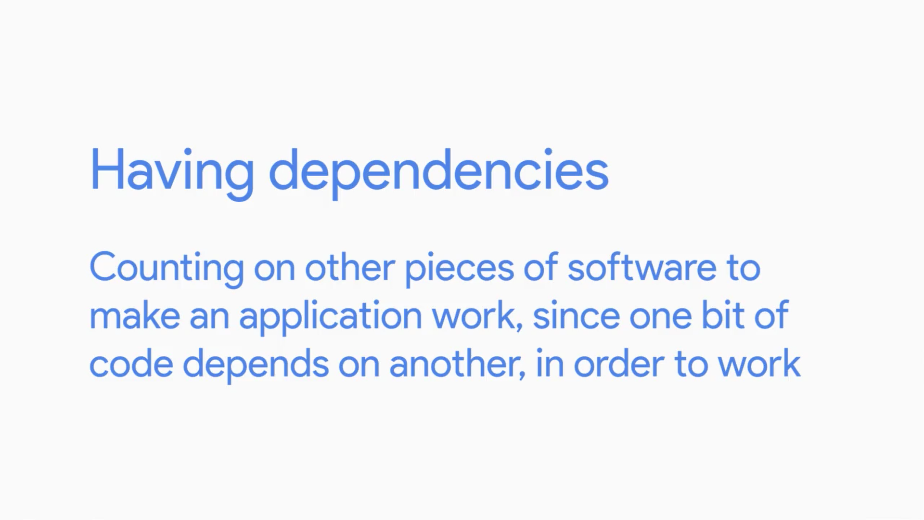

In our example, the game depends on both the physics engine and a rendering library to run. But wait, what do we mean when we refer to a library? You can think of the library as a way to package a bunch of useful code that someone else wrote. This code is bundled together into a single unit.

Programs that want to use the functionality that the code provides can tap into it if they need to. In Windows, these shared libraries are called dynamic-link libraries, or DLL for short. You can find out more details about dynamic link libraries in the next reading.

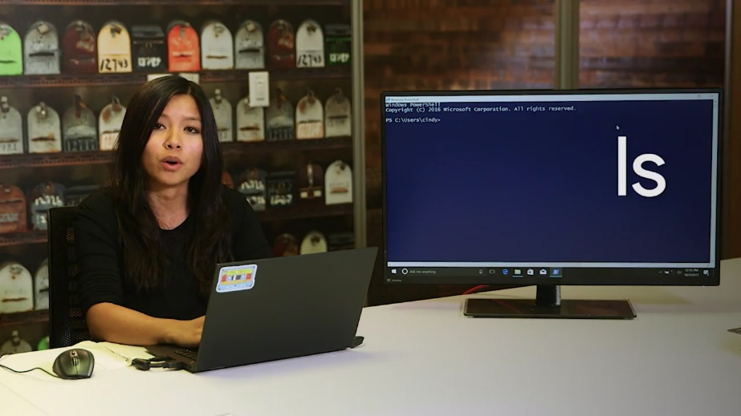

One super useful feature of a DLL is that the same DLL can be used by lots of different programs. This means all that shared code doesn't need to be loaded into memory for each application that wants to use it, so less memory overall is used. Windows applications typically have many dependencies all located together in a single installation package.

Along with something called an MSI file that tells the Windows Installer how to put it all together. This means that a given installation package will have all the resources and dependencies like DLLs, right there in the package. The Windows Installer will also handle managing those dependencies and make sure they are available to the program.

In the old days, things weren't always so great. Imagine this scenario. A video player you've been using to play movies on your computer uses a graphics DLL to display films on your screen. A new game just came out that you want to play, so you install that too. The game comes along with a new version of that graphics library. So the game installer updates the existing version with the new DLL. All of a sudden, your video player stops working. It turns out the video player doesn't know how to use the new version of the DLL, which is a pretty big bummer.

On modern Windows Operating Systems though, DLL hell is a problem of the past. To fix it, most shared libraries and resources in Windows are managed by something called side-by-side assemblies or SxS.

Most of these shared libraries are stored in a folder at C:\Windows\WinSxS.

If an application needs to use a shared library to perform a task, that library will be specified in something called a Manifest.

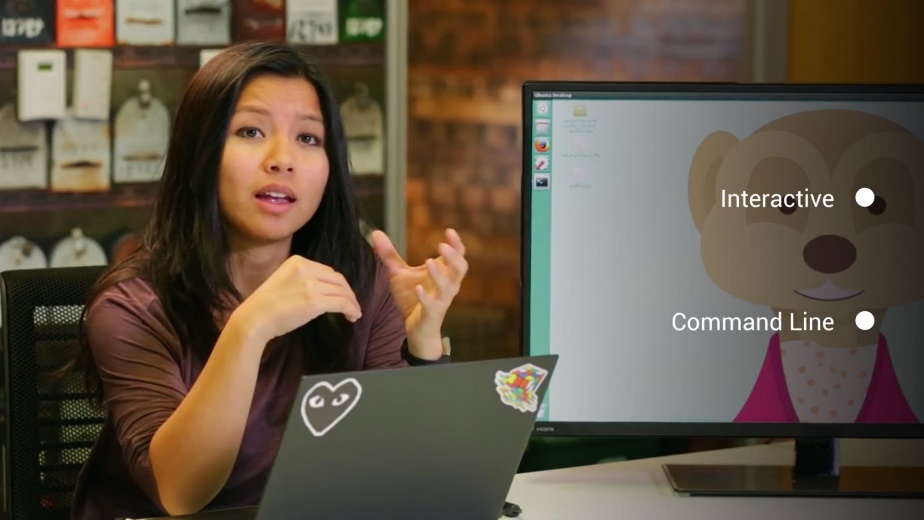

This tells Windows to load the appropriate library from the SxS folder. The SxS system also supports access to multiple versions of the same shared library automatically. So when you install software, you don't pull the rug out from underneath the programs you've already got.

In addition to manifest, the SSX system and installers bundling dependencies together in their installation packages. You can use a Windows Package Manager to help install and maintain the libraries and other dependencies that your installed software needs to use. We'll talk about this in more detail in our lesson on Windows package managers. We'll give you preview using the Windows package management feature for PowerShell.

Using a Windows package management cmdlet called Find-Package, you can locate software, along with its dependencies right from the command line.

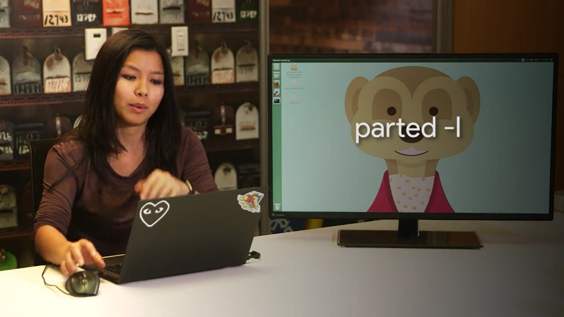

By the way, a cmdlet is basically the name we give to Windows PowerShell commands that use the verb-noun format.

We've already used lots of cmdlets such as get-help, select-string etc. There are hundreds of cmdlets built into Windows and you can even write your own.

Okay, back to my task at hand. Let's say you wanted to install the Sysinternals package. Which is a set of tools released by Microsoft that can help you troubleshoot all sorts of problems on your Windows computers.

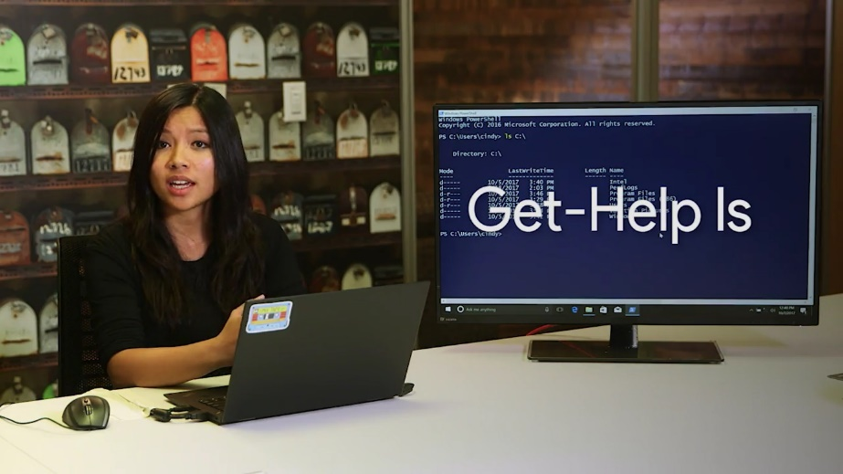

You could download the Sysinternals package from the Microsoft Website or you could use the package management feature.

First we'll need to open up a PowerShell terminal by typing in PowerShell from the start menu. Then we can try to locate the sysinternals package by executing this command. Find-Package sysinternals-IncludeDependencies. An error. No match found. What's that all about?

This exception was generated because the default source of packages in PowerShell is the PowerShell gallery, which doesn't contain the Sysinternals package. Luckily, all we need to do is tell PowerShell about a place where it can find the Sysinternals package. And that's a package repository called Chocolatey. We'll dip into more about Chocolatey in the package manager video. But for now, just know it's a place where all kinds of windows software packages live.

So, before we can install any packages, we need to add a package source that tells our computer where it can find the packages we want to install. Since we want to use Chocolatey to find our packages, we need to add it as a package source. We're going to do that with the PowerShell command Register-PackageSource.

Let's go and type Register-PackageSource-Name chocolatey-ProviderName Chocolatey-Location, .org/api/v2.

We can verify both sources of software are now good to go with the Get-PackageSource command. And then, try to locate our package and its dependencies again with Find-Package, sysinternals-includeDependencies.

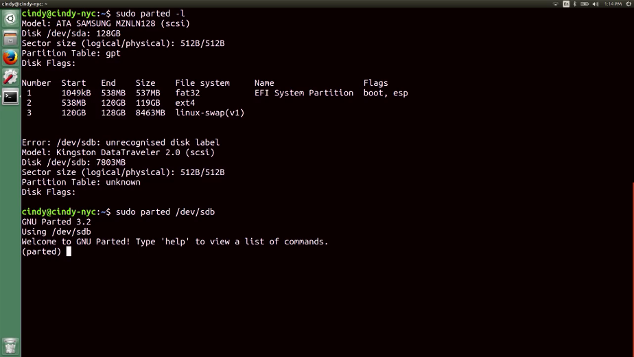

Sweet! Now that we know that’s the package we want, we can use a cmdlt called Install-Package to actually install Sysinternals and its corresponding dependencies.

We’ll do that in a later lesson. Now it's time for snack break. All this Chocolatey talk made me hungry.

### Linux package dependencies

Let's see what a package dependency would look like and Linux. We learned how to install a standalone package in Linux using dpkg in the last lesson.

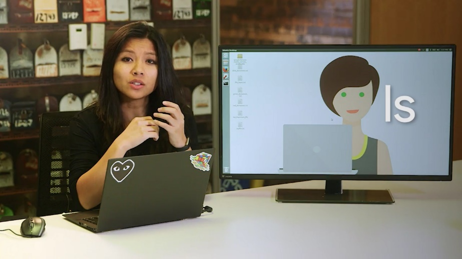

Let's install one more package. I downloaded the Google Chrome browser here in my desktop and I want to install it with sudo dpkg -i google - chrome. Wait a minute, what's this error I'm getting? Dependency problems prevent configuration of google chrome stable.

This is saying it can't install Google Chrome because it's dependent on another package that isn't currently installed on this machine. So before we can install Chrome, we have to install this package lib app indicator one. While a standalone package installer like dpkg may be quick to use, it doesn't install package dependencies for us.

In Linux, these dependencies can be other packages or they could be something like shared libraries. Linux shared libraries similar to Windows dlls are libraries of code that other programs can use.

So what do you do if you're stuck with a dependency error? You could install the dependencies one by one. Sure. But in some cases, you might see more than just one dependency. You might even see 10. This is especially true in Linux. It's not that fun to continually install programs just so you can get one program to work. Luckily for us, that's where package managers come in. Package managers come with the works to make package installation and removal easier, including installing package dependencies.

We'll talk about package managers in the next lesson but for now, it's enough to know that if you install a standalone package, you won't automatically install its dependencies.

## Package managers

### Windows package manager

Now that we know a bit about installing software and dependencies from individual executables or package files, let's take a look at a different way to manage software installations using tools called package managers.

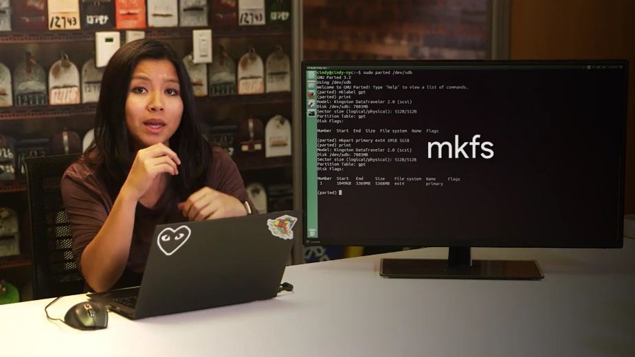

You've actually already seen a package manager in action. Remember the apt or advanced package tool we talked about in earlier video? Well, the advanced package tool is actually a package manager for the Ubuntu operating system. We'll talk about apt in a little bit. But you might be curious about what options you have for Windows package management. A package manager makes sure that the process of software installation, removal, update, and dependency management is as easy and automatic as possible.

Think about the normal way you might install a new program on your Windows computer. You might search for it in a search engine, go to the program's website, download the installer, then run it. If you wanted to update the software, you might open up the program and use whatever mechanism it provides for you to install the new version.

Lots of programs give you a way to perform automatic updates and Microsoft takes care of the ones it writes through Windows update. But you might even need to go back to the website you downloaded the software from originally to grab another installer for the new version.

Finally, if you wanted to remove the software, you might use the windows Add/Remove programs utility. Or maybe run a custom uninstaller if it provides you with one. Some installation technologies like the Windows installer can take care of dependency management. But they don't do much to help you install software from a central catalog of programs or perform automatic updates.

This is where a package manager like Chocolatey can come in handy. Chocolatey is a third party package manager for Windows. This means it's not written by Microsoft. It lets you install Windows applications from the command line.

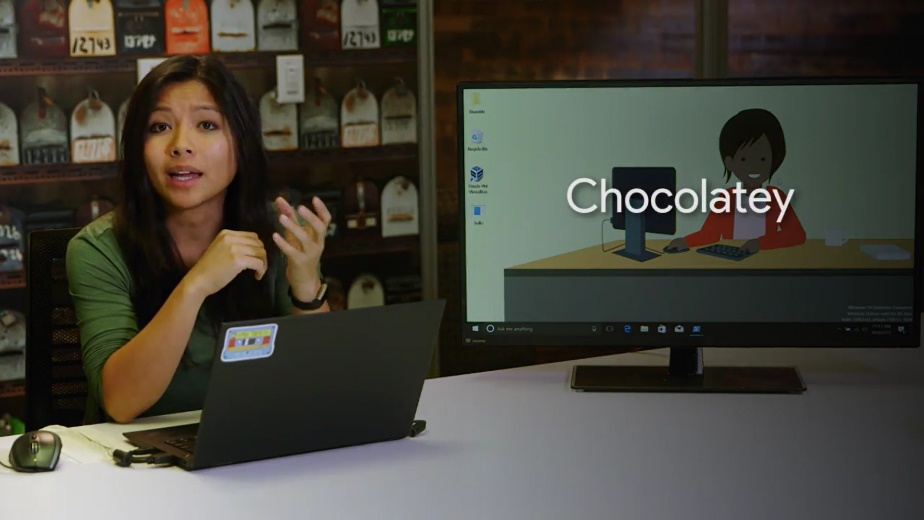

Chocolatey is built on some existing Windows technologies like PowerShell, and lets you install any package or software that exists in the public Chocolatey repository. I've included links to both in the next reading. You can add any software that might be missing to the public repository. You can even create your own private repository if you need to package something like an internal company application.

Configuration management tools like SCCM and Puppet, even integrate with Choclatey.

That helps make managing deployments of software to the Windows computers in your company, automatic and simple. We've talked about a few ways we can install packages in earlier videos. Let's add Chocolatey to the mix, which supports several methods of software installation itself. First, you can install the Choclatey command line tool and run it directly from your PowerShell CLI. Or you can use the package management feature that was recently released for PowerShell. Just specify that the source of the package should be the Choclatey repository. Remember this from our talk about installing software? We use this command to locate the Windows Sysinternals package after adding Choclatey as a software source.

Just a refresher, the command was Find-package sysinternals include dependencies. That's all well and good. But how do we actually go about installing this package? Well, that's where the Install-Package command-let comes into play. We can use this tool to install a piece of software and its dependencies.

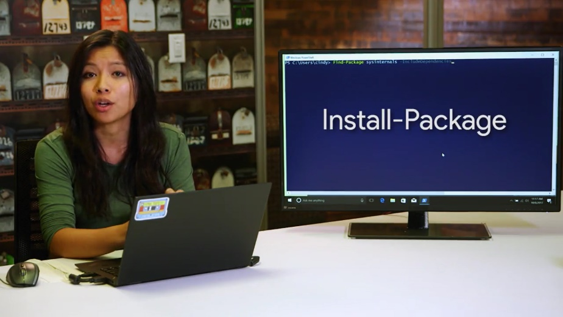

Let's get installing that sysinternals package we found earlier shot. I'm just going to go install, package-name sysinternals. Yep, I'm just going to confirm. And just like that, we've got our package.

We can verify it's in place with the Get-Package command-let. Get-Package -name sysinternals.

You can also uninstall a package using the Uninstall-Package -Name sysinternals.

### Linux package manager-apt

Okay. Now, to talk about the package manager used in Ubuntu called the APT or Advanced Package Tool. We've actually already used APT in an earlier course, so hopefully, this won't look new.

The APT package manager is used to extend the functionality of the package. It makes package installation a lot easier. It installs package dependencies for us, makes it easier for us to find packages that we can install, cleans up packages we don't need, and more.

Let's see how we will install the open source graphical editor, Gimp, using APT. And if you want to follow along on your own machine, I've included a link to the Gimp download in the next reading.

So, sudo apt install gimp. Let's take a look at what this command is doing. APT grabs the dependencies that this package requires automatically and asks us if we want to install it. You can see this line here, 0 upgraded, 18 newly installed, 0 to remove, and 16 not upgraded. This gives us a good overview of what we're doing to the packages on our machine.

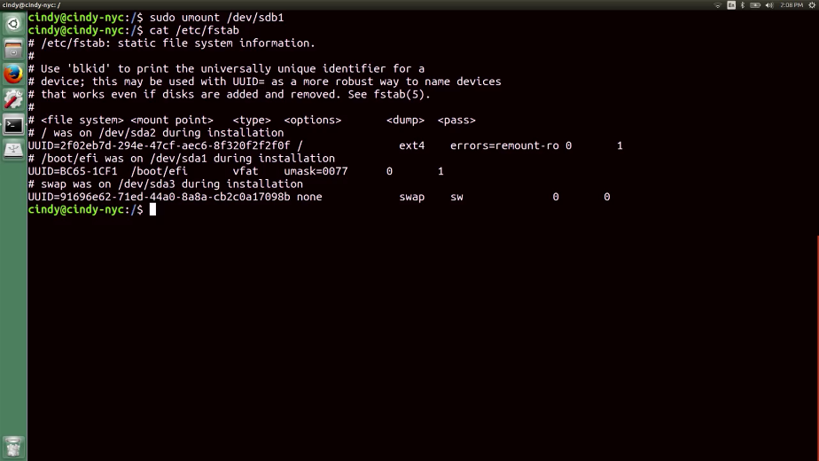

Now, let' s remove this package. It's sudo APT remove gimp.

You can see that it removes dependencies for us that we're not using anymore because we don't need Gimp. You also noticed that when installing this package, we didn't have to download the gimp package. It was just on our system. How is that possible?

Well, thanks to something known as a package repository, we don't have to manually search for each and every software we want online. We've already seen the chocolatey package repository in action. Repositories are servers that act like a central storage location for packages. Lots of software developers and organizations host their software on the internet, and give out a link to where that location is. You can add that link to your own machine, so it references that package or list of packages.

You've already seen this with The Register-PackageSource commandlet where we added this location of the chocolatey repository. So on Linux, where do you add a package or repository link? The repository source file in Ubuntu the /etc/APT/sources.list. Your computer doesn't know where to check for software if you don't explicitly add the package or repository links to this file. Let's just open this up real quick and take a peek.

There's some extra information in here that isn't important. But you can see here that there are links here. If you navigate to those links, you'll see a directory that holds lots of packages. Ubuntu already includes several repository sources in here to help you install the base operating system packages, and other tools too. If you work in a Linux environment, there are also special repositories called PPAs or personal package archives.

PPAs are hosted on Launchpad servers. Launchpad is a website owned by the organization, Canonical Limited. It allows open source software developers to develop, maintain, and distribute software.

You can add PPAs like you would a regular repository link, but be a little careful when using a PPA instead of the original developer's repositories. PPA software isn't as vetted as repositories you might find from reputable sources like Ubuntu. They can sometimes contain defective, or even malicious software.

One more thing to call out about repositories is that the repository managers update their software pretty regularly. If you want to get the latest package updates, you should update your package repositories with the APT update, and then, APT upgrade commands.

The APT update command updates the list of packages in your repositories, so you get the latest software available. But it won't install or upgrade packages for you. Instead, once you have an updated list of packages, you can use APT upgrade, and it will install any outdated packages for you automatically. Before installing new software, it's good to run APT update to make sure you're getting the most up-to-date software in your repositories.

You'll also want to run APT upgrade to install any available updated packages on your machine. You can use the apt--help command to learn more about the commands available with APT. We won't cover them all, but you can list packages, search packages, get more information about packages, and more.

There are lots of different package managers you can use with Ubuntu. We chose APT because it's a popular package manager, but you can read up on an alternative package manager in Ubuntu, in the next supplemental reading.

Awesome. Now that you've entered the APT command to your toolkit, you’re ready to maintain packages in Linux. This is a skill you'll be using a whole lot in the IT support world. We'll talk about that more in the next lesson.

## What’s happening in the background

### Windows underneath the hood

We've talked a lot about the practical aspects of installing software, which has been abstracted for us in the form of package managers. But as someone who might be working in IT, it's also important for you to understand what happens underneath the hood, when installing or removing software. In other words, what really happens with the underlying technology when you perform this action.

You might come across a situation where a package you install, modifies a configuration file that it's not supposed to, and then starts causing issues for you. So how does software installation work underneath the hood?

Let's take a look at how an EXE gets installed in Windows. When you click on an installation executable, what happens next depends on how the developer of the program has set their application app to be installed. If the EXE contains code for a custom installation that doesn't use the Windows installer system, then the details of what happens under the hood will be mostly unclear. This is because most Windows software is distributed in closed source packages. Meaning you can't look at the source code to see what the program is doing.

In this case though, although you can't read the instructions the developer has written, you can use certain tools to check out the actions the installer is taking. One way to do this, will be to use the process monitoring program provided by the Microsoft CIS internals toolkit.

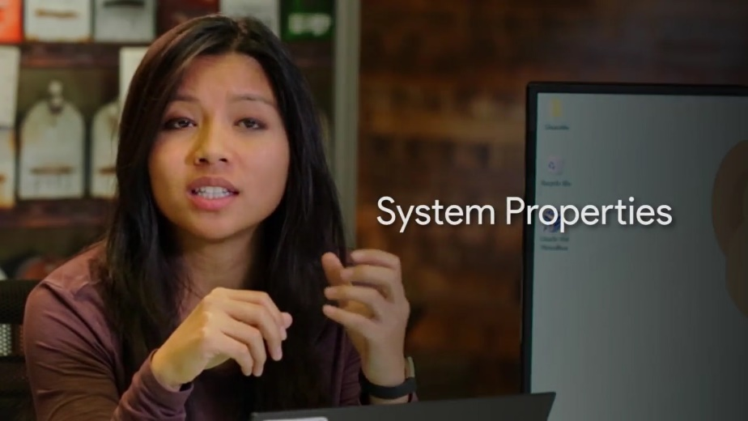

This will show you any activity the installation executable is taking, like the files it writes and any process activity it performs. You can read more about the Microsoft CIS internals toolkit in the next supplemental reading.

So what about MSI file, or an executable wrapping an MSI? Again, the application itself will be closed source, so you won't be able to peek at the source code to see what it does. But, installation packages that use the MSI format have a set of rules and standards they need to conform to, so that the Windows installer system can understand their instructions and perform the installation.

There are more to MSI files than it might seem at first. In fact, they aren't simple files at all. They're actually a combination of databases that contain installation instructions in different tables along with all the files, objects, shortcuts, resources and libraries the program will need all grouped together. The Windows installer uses the information stored on the tables in the MSI database, to guide how the installation should be performed. They'll know where files and application data should go, and any other things that should happen to successfully install the program.

The Windows installer will keep track of all the actions it takes and create a separate set of instructions to undo them. This is how it lets users uninstall the program. If you're curious about the details of what goes into an MSI file, or want to create a Windows installer package yourself, check out the orca.exe tool that Microsoft provides. It's a good way to satisfy your curiosity.

Orca, is part of the Windows SDK or software development kit, but you don't need to be a programmer to use it. Orca can help you edit, or create Windows installer packages. So, feel free to explore what it can do. We've provided a link to the tool in the supplementary reading right after this video.

Wow, there's a lot going on underneath the hood in a Windows installation, and it's all kicked off by a couple of clicks. So what about LIX? Glad you asked, that's up next.

### Linux underneath the hood

In Linux, software installations are a little bit more clear. We mentioned in an earlier lesson that you can install software directly from source code. This method changes depending on the software because different programming languages are compiled differently. We won't go in-depth about software development, but let's say we had an archive with a simple package we want to install.

This is my Flappy app package. I've already extracted it, so you can see there's a setup script. This is a script file that will run a bunch of tasks on the computer in order to set up the package. And then flappy_app_code, this is the actual software code.

The README is a pretty standard file contained in source archives that has information about the archive. It not so subtlety asks you to read it before you do anything.

The set of script is what we're concerned with since it tells us how to install our package. A sample setup script can contain program instructions like compile flappy_app_code into machine instructions, copy compiled flappy app binary to slash bin directory, or create a folder to slash home slash, whatever the username for flappy app is. This is a very simple overview of what happens when you install a simple package.

In the end, the software developers decide what their software needs to work and runs tasks to get it working. It's up to the developer whether those tasks are creating files or updating directories. If you knew the programming languages used, you could read these instructions yourself. But that's a bit out of scope for this course. Anyways, that's how software installation works on Linux in a nutshell.

## Device software management

### Windows-devices-and-drivers

An important piece of software that we've talked about, but haven't really seen in action, is a driver. Remember that a driver is used to help our hardware devices interact with our operating system. In this lesson, we're going to talk about device drivers and how to manage them.

First, let's talk about how to manage the devices that our computer sees, and then we'll go over how we install drivers for them.

In Windows, Microsoft groups all of the devices and drivers on the computer together in a single Microsoft management console called the Device Manager.

You can get to the Device Manager in a couple of different ways. You can open up the Run dialog box and type in devmgmt.msc. Or you can right-click on This PC, select Manage, and click on the Device Manager option in the left-hand navigation menu. I'm just going to open it up from here.

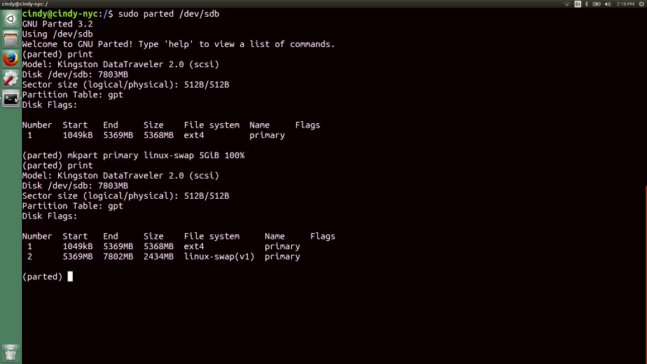

Most devices you've got on your computer will be grouped together according to some broad categories by Windows. So any displays you might be using with your computer would show up under the Monitors section in the Device Manager. Like so. This grouping usually happens automatically when you plug in a new device. It's part of the plug and play system that Windows uses to automatically detect new hardware plugged into your computer. It then recognizes and installs the appropriate software to manage it. If you're interested, you can read more about the PnP system in the supplementary reading. We'll give you an overview of how this works too, so you can get a feel for it.

When you plug a new device, like a mouse or keyboard, into your computer, the Windows operating system will go through a few steps to try and get it working. Most vendors or computer hardware manufacturers will assign a special string of characters to their devices called a hardware ID.

When Windows notices that a new device has been connected, the first thing it'll do is ask the device that's been plugged in for its hardware ID. Once Windows has the new device's hardware ID, the OS uses it to search for the right driver for the device. It looks for it in a few places, starting with a local list of well-known drivers. Then it goes on to Windows Update or the driver store if it needs to expand the search. Sometimes the device will come with an installation disk, which contains custom driver software and you can tell Windows to look there too. Finally, Windows will take the driver software it found and install it so you can use your new device.

Although this process mostly happens automatically and behind the scenes, you can interact directly with the Windows drivers through the Device Manager console we mentioned earlier. You can expand any of the categories in the Device Manager to view the devices inside them, like so. You can also use the all-powerful Windows right-click to open up a menu with options to work with them. You can uninstall, disable, and update a device driver from this menu.

You can also tell Windows to look for hardware changes like a newly plugged in device. Finally, if you choose Properties from the right-click menu, you can see some details about the device and its driver. Like its manufacturer and the driver version being used. If you're interested in accessing drivers through Windows CLI, check out the following reading for more info.

### Linux-devices-and-drivers

Ubuntu has a slightly messier way of showing us device management. In Linux, everything's considered a file, even hardware devices. When a device is connected to your computer, a device file is created in the /dev directory. Let's take a look at this directory.

There are lots of devices in this directory, but not all of them are actually physical devices.

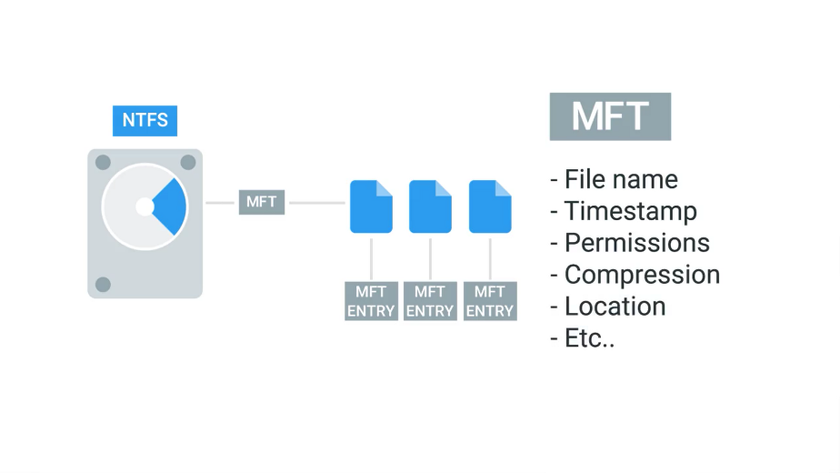

For example, the /dev/null devices in here. We won't talk about all the device types in Linux because there are a lot of them. But we'll go over the more common ones you'll see, character devices and block devices.

Character devices, like a keyboard or mouse, transmit data character by character.

Block devices like USB drives, hard drives, and CD-ROMs transfer blocks of data. A data block is just a unit of data storage.

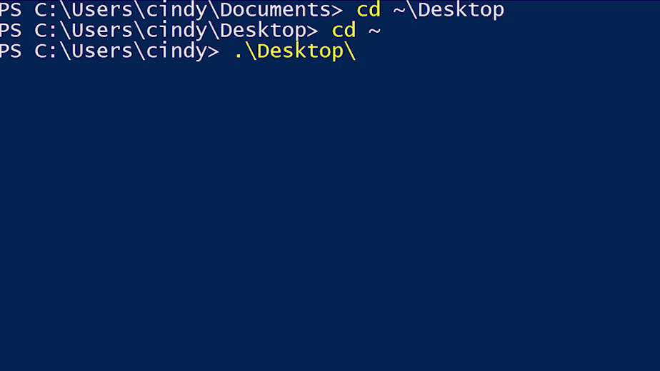

Remember from an earlier lesson, that the first bit you see in an LS-L command is the type of file. So far, we've seen dash which stands for a regular file and a D which stands for a directory. But in this output, we can see we have a few other file types. Some of them have B for block device and C for character device. If you'd like to learn more about that other device types, you can check out the next supplemental reading.

Let's look at some of the block devices we'll be interacting with in this course. You'll see a few files that start with /dev/sda or /sdb.

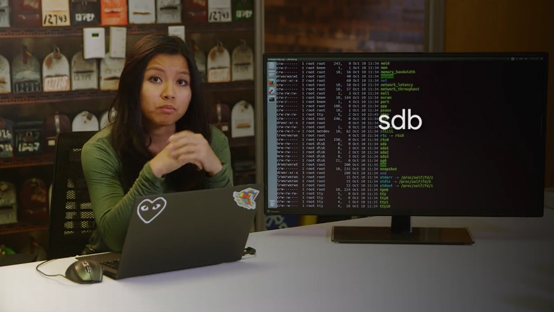

SD devices are mass storage devices like our hard drives, memory sticks, et cetra. If you see an A after SD, it just means the device was detected by the computer first. So you might see something like /dev sda, /dev sdb, /dev sdc.

Revisiting the /dev/null device, we can see it's considered a character device because it's used to transfer data, character by character. This is a pretty simple overview of device files. I left a lot of stuff out that you don't necessarily need to know now. If you want to learn more about the inner workings of devices in Linux checkout, you guessed it, the next supplemental reading.

Let's talk about updating device drivers for Linux. With Windows, we were able to just click update driver and in most cases that works. In Linux, things are a little more complicated, and at the same time pretty easy. I'm not trying to be confusing. You'll see what I mean in a moment.

Device drivers aren't stored in the /dev directory. Sometimes, they're part of the Linux kernel. Remember, that the kernel of our machine handles the interaction with hardware. The kernel is a really monolithic piece of software that has lots of functions including support for lots of hardware. These days, a lot of hardware support is built into the kernel. So when you plug in a device, it automatically works. But if there are devices that don't have support built into the kernel, they most likely have something called a kernel module.

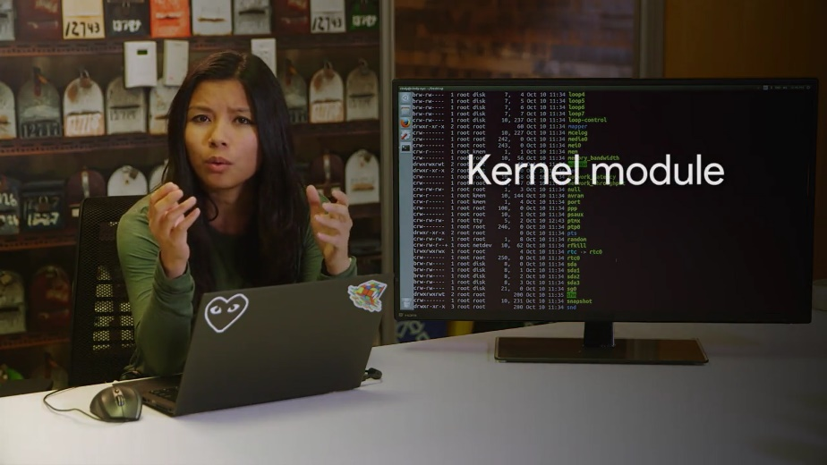

Well, what's this kernel module thingy? For a lot of developers, touching software like the Linux kernel is kind of intimidating. Instead, they can create kernel modules which extend the kernel's functionality without them actually touching it. So, if you need to install kernel module for a specific type of device, you can install the same way we've been installing all software in Linux. Keep in mind that not all kernel modules are drivers. We won't get into kernel modules, but if you'd like to read more, I've included a link to that as well in the next reading. Since we just need to get started and get hands-on with the operating systems, this should be more than enough. Let's keep moving.

### Window-operating-system-updates

You've made it to the last lesson in this module where we're going to cover the most important software, the operating system. We've already looked at how to install and maintain applications like a word processor, graphical editor, etc. Then we looked at how to install device driver software too. Now we're going to look at the core operating system updates. Spoiler alert, they work just the same way as every other software we've installed.

It's important to keep your operating system up to date for lots of different reasons. You want the newest features that your operating system has, and you want the security updates that your operating system needs. When your operating system manufacturer discovers a security hole in the OS, they do their best to create a patch for this hole. A security patch is software that's meant to fix up a security hole.

When you have an operating system update with security patches it's vital that you install those patches right away. The longer you wait the more prone you are to being effected by a security hole.

As an IT support specialist, it's very common to routinely install operating system updates to keep your system up to date and secure. Windows usually does a great job of telling you when there are updates to install. The Windows Update Client service runs in the background on your computer to download and install updates, and patches for your operating system. It does this by checking in with the Windows Update servers at Microsoft every so often, you can learn more in the next reading.

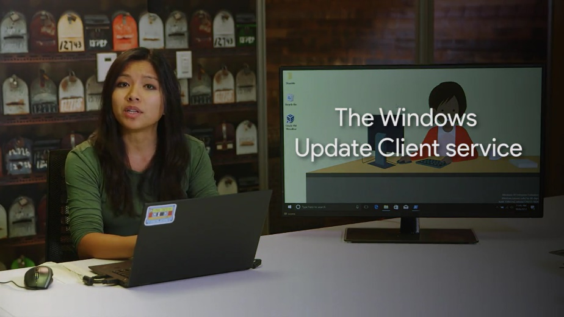

If it finds updates that should be applied to your computer it'll download them, if you decided to allow it to, more on that later. Once the download has completed, depending on your Windows Update settings, the Windows Update Client will ask you if it's okay to install the updates or just go ahead and install them automatically. This process usually requires a restart of your computer, which the Client performs after requesting permission. In versions of Windows before Windows 10, you can tell Windows to manage your updates in a few different ways. You could have the Windows Update Client install updates and patches that Microsoft releases automatically or can let Windows Update know that you want to decide whether or not you'd like to download and install them. You can even turn off updating entirely, but that's probably not a good idea for the security reasons we talked about.

You can configure Windows Update by searching updates in the search box and going to Windows Update setting. From there, you can tell the Windows Update Client to check for new updates, look at the history of updates installed, or change the way that it'll download and apply patches by clicking into the settings section.

From there, you can tell the Update Client how you want to manage your updates and even set a time when you want them installed.

Windows 10 does things differently, instead of downloading a handful of independent updates that you can choose to apply or not apply to your computer, updates are cumulative. This means that every month a package of updates and patches is released that supersedes the previous month's updates. The idea behind this is that computers will need to download less stuff in order to be up to date.

As an example of how this might be beneficial, think about a Windows machine that's been turned off for a while. When it boots up again after a long period of inactivity, it'll need to download all of the updates that it's missed and apply them. If it's been off for a really long time, this could mean it'll need to download and apply hundreds of updates. With the cumulative update model, a computer like that would only need to download the latest cumulative update, then be good to go.

One downside to this is that in Windows 10, installing updates is no longer optional. You also can't pick and choose the updates you want to apply, since they're all rolled into one monthly release. Microsoft has announced that the update model in Windows 7 and 8 will also be moving in this cumulative package direction. So, Windows 10 users won't be alone.

### Linux-operating-system-updates

In Linux, you've already learned how to update and upgrade software on your machines. When using the apt update and apt upgrade command, they may already install security updates for you.

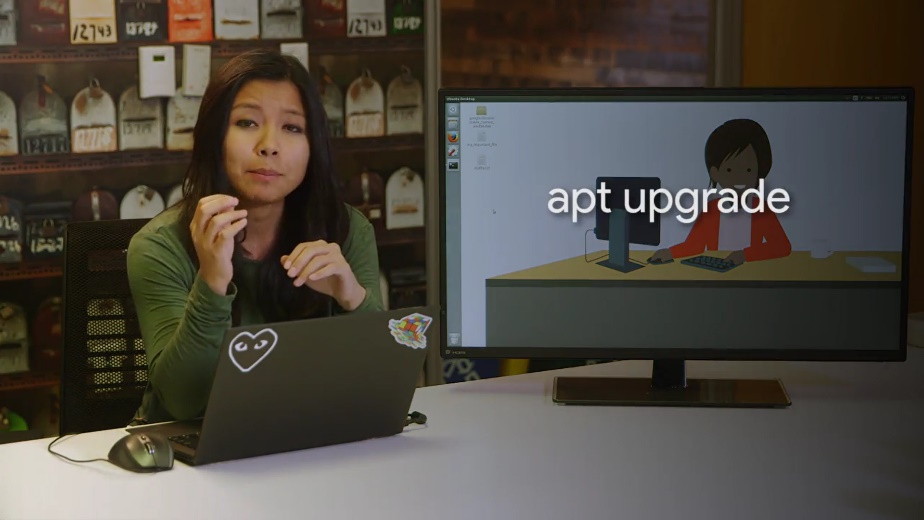

But when you run apt upgrade, it doesn't upgrade the core operating system. In windows, our OS package is Windows 10. In Linux, It's the kernel along with other packages.

The kernel controls the core components of our operating system. Like our word processors, the kernel is just another package. The kernel developers regularly include security patches, new features, and fixes for bugs in their updates.

If you want to get all these things, you should be running a new kernel. To first view what kernel version you have, we going to learn a new command called uname. The uname command gives us the system information. If you use the dash r flag for kernel release, you'll see what kernel version you have.

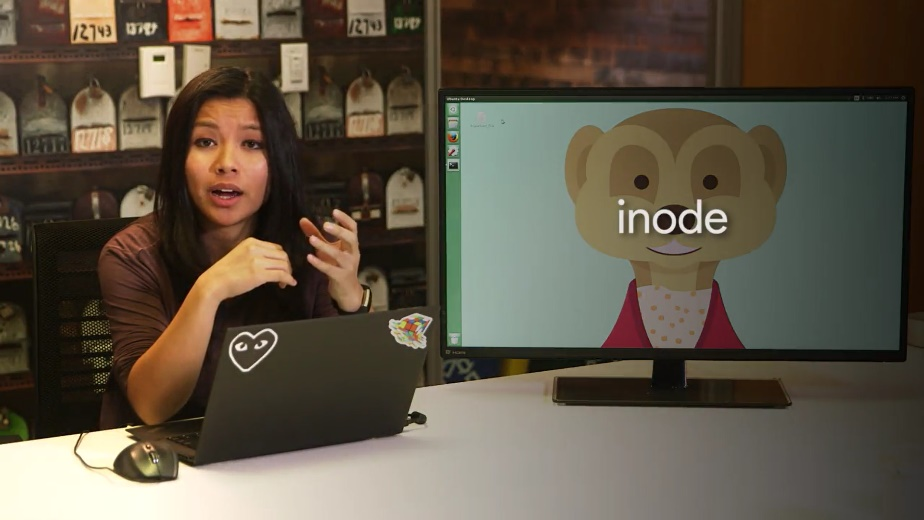

You can see that I have kernel Version four point one on here.

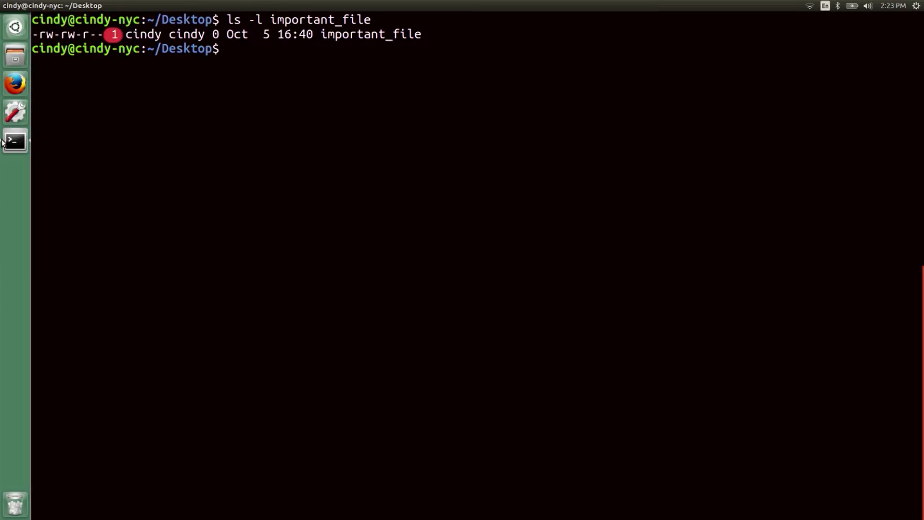

To update the kernel and other packages, we use our nifty apt command with the option full dash upgrade. Before running this command, remember to update your application sources with APT update. Sudo apt update.

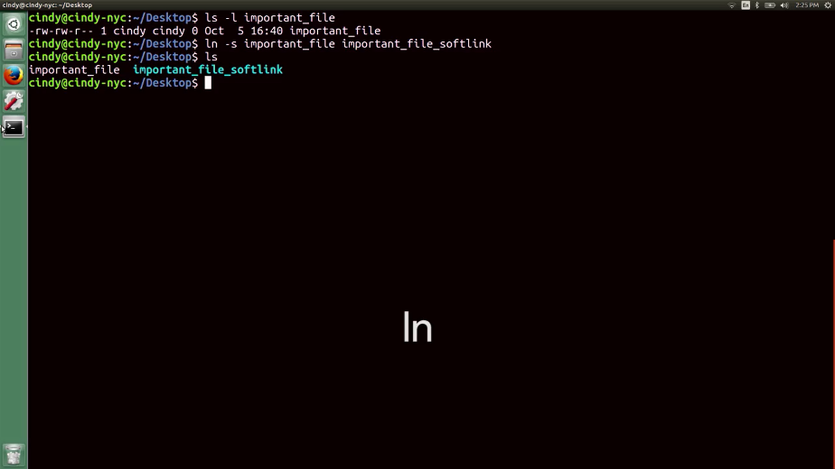

Now, we can run sudo apt full upgrade.

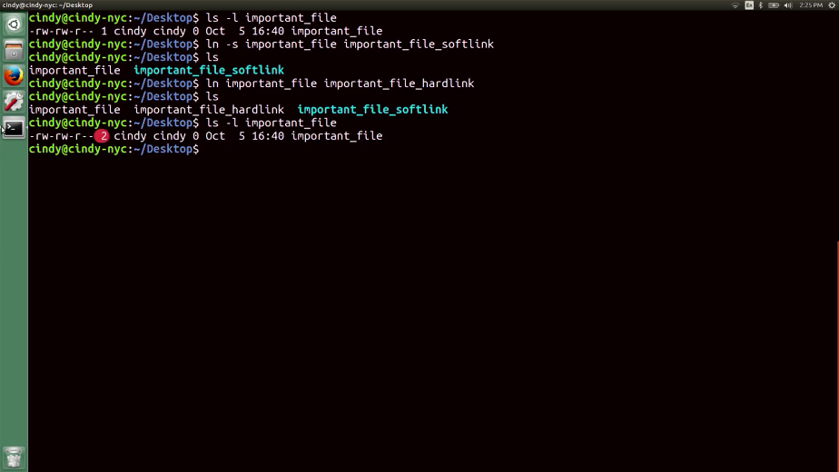

If there's a new version of the kernel Available it will install it for us. Once you reboot the computer, you can start using it. You can verify the latest kernel is being used with the uname dash r command. We left out a few details about kernel installations and security updates, but this is a good start updating your system.

If you're curious about learning the intricate details of kernel and Linux updates, check out the supplemental reading.

With that, we've covered all the essentials to help you hit the ground running with software installation and maintenance. Great work. You learned how to install standalone packages, use package managers, and work with archives, device drivers, and core operating system updates. These skills will be super useful as an IT support specialist.

Next, we're testing you again on both bashing Windows. When you finished, I'll see in the next module.
