# Table des matières

[1 Navigating the system [2](#navigating-the-system)](#navigating-the-system)

[2 Users and permissions [2](#users-and-permissions)](#users-and-permissions)

[3 Package and software management [2](#package-and-software-management)](#package-and-software-management)

[4 File systems [2](#file-systems)](#file-systems)

[5 Process management [2](#process-management)](#process-management)

[5.1 Life of a process [2](#life-of-a-process)](#life-of-a-process)

[5.1.1 Module introduction [2](#module-introduction)](#module-introduction)

[5.1.2 Programs vs processes revisited [2](#programs-vs-processes-revisited)](#programs-vs-processes-revisited)

[5.1.3 Windows process creation and termination [4](#windows-process-creation-and-termination)](#windows-process-creation-and-termination)

[5.1.4 Linux process creation and termination [8](#linux-process-creation-and-termination)](#linux-process-creation-and-termination)

[5.1.5 Jess passions [9](#jess-passions)](#jess-passions)

[5.2 Managing processes [10](#managing-processes)](#managing-processes)

[5.2.1 Windows reading process information [10](#windows-reading-process-information)](#windows-reading-process-information)

[5.2.2 Linux reading process information [13](#linux-reading-process-information)](#linux-reading-process-information)

[5.2.3 Windows signals [20](#windows-signals)](#windows-signals)

[5.2.4 Linux signals [23](#linux-signals)](#linux-signals)

[5.2.5 Windows managing processes [23](#windows-managing-processes)](#windows-managing-processes)

[5.2.6 Linux managing processes [28](#linux-managing-processes)](#linux-managing-processes)

[5.3 Process utilization [35](#process-utilization)](#process-utilization)

[5.3.1 Windows resource monitoring [35](#windows-resource-monitoring)](#windows-resource-monitoring)

[5.3.2 Linux resource monitoring [39](#linux-resource-monitoring)](#linux-resource-monitoring)

# Navigating the system

# Users and permissions

# Package and software management

# File systems

# Process management

## Life of a process

### Module introduction

Welcome back, four modules down, two to go in this course, great work so far. In the last lesson, we learned how to partition and set up disks with file systems to start storing files. We also dove deeper into the details of file systems, and even learned tools for repairing corrupt file systems and disks. In this lesson, we're going to talk about processes. Processes play an important part in our computer user experience. After all, why use a computer if you can't use any programs? With more and more processes running on our computer, we have to think about ways to better utilize our hardware resources. Get ready, because we're going to get into the nitty gritty of processes. We'll talk about how to read process output, and learn how to track our resources. Ready, set, let's go!

### Programs vs processes revisited

In earlier lesson, we learned that programs are the applications that we can run like the Chrome web browser.

Processes are programs that are running.

We can have lots of processes running for the same program like how we can have many chrome windows open at once or lots of movies playing using one program. When we launch a process, we're executing a program. And remember, a program is just software. To calculate the information that our software contains, we need to give it resources so that it can be run. When processes are run, they take up hardware resources like CPU and RAM.

Luckily, today's computers are powerful enough to handle the processes that we use in our day-to-day activities, like browsing the web, watching movies, etc..

But, sometimes this isn't enough, sometimes a process is taking more resources than it's supposed to. Sometimes, processes are unresponsive and freeze up our system making our entire computer unresponsive. Well, we're going to talk about why this happens, and how we can fix it in the upcoming lessons. But before we can talk about managing processes, we have to understand how they work.

When you open up an application like a word processor, you're launching a process. That processes get in something called a process ID to uniquely identify it from other processes.

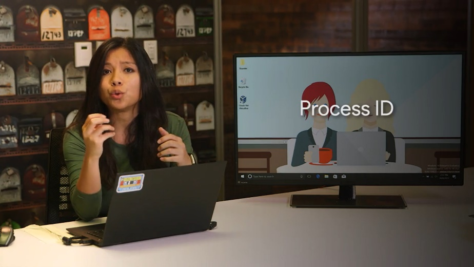

Our computer sees that the process needs hardware resources to run. So our kernel makes decisions to figure out what resources to give it. Then, in the blink of an eye, our computer starts up a word processor and tadah, already to start working. This happens for every process you launch yourself, and for every process you don't even know who's running.

Besides, the visible processes that we start, like our music player or word processor, there are also not so visible processes running. These are known as background processes, sometimes referred to as daemon processes.

Background processes are processes that run in the background. We don't really see them, and we don't interact with them, but our system needs them to function. They include processes like scheduling resources, logging, managing networks, and more. When we take a look at all the processes running on our system, you'll see what I'm talking about.

In the next couple of lessons, we'll talk about how processes get created and terminated. Then, we can start digging into the details of process management. Process management is a vital skill in IT support. You'll often find yourself troubleshooting issues with frozen applications, slow applications, and more.

### Windows process creation and termination

The way that processes are created and stopped differs based on the operating system you use. First, let's have a look at how Windows does things. When Windows boots up or starts, the first non-kernel user mode that starts is the Session Manager Subsystem or smss.exe.

The smss.exe process is in charge of setting some stuff up for the OS to work. It then kicks off the log-in process called winlogon.exe appropriately enough, along with the Client/Server Runtime Subsystem called csrss.exe, which handles running the Windows GUI and command line council.

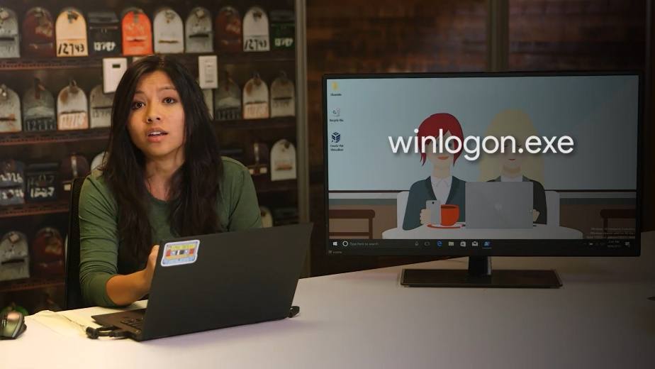

We'll talk about a process called init in the next lesson, which Linux uses as the first process.

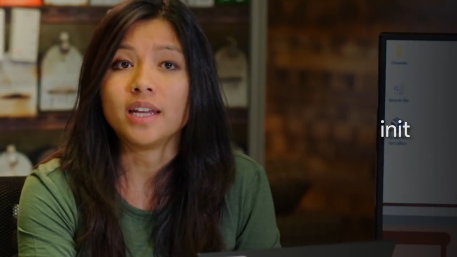

You might be tempted to think of smss.exe as a Windows equivalent of init. Don't fall into that trap though. When it comes to process creation mechanisms, they're all pretty different.

In Windows, each new process that's created needs a parent to tell the operating system that a new process needs to be made. The child process inherit some things from its parent like variables and settings, which we can collectively refer to as an environment.

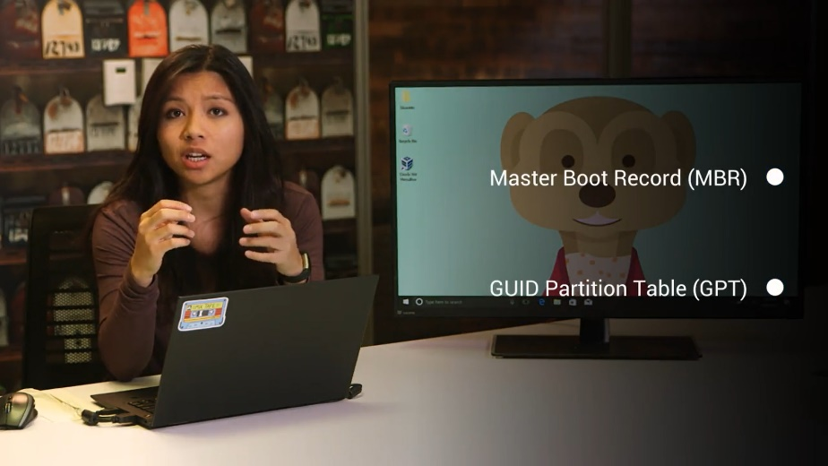

This gives the child process a pretty good start in life, but after the initial creation step, the child is pretty much on its own. Unlike in Linux, Windows processes can operate independently of their parents. Let's take a look at how this works by creating our own.

First, let's launch the PowerShell process to give us a Windows command prompt. From there, we can type in notepad.exe to create a new process for the notepad program.

So far, so good. The parent process is PowerShell, and the child is the notepad application. What happens if we kill the parent process though by clicking on the X button? Notice that notepad keeps on running happily even though its parent has been terminated. Those children are just in their own world.

Clicking the X is just one way to stop a process from running in Windows, but as you might expect, there are other ways you can stop processes. You can use a command prompt command by calling on the task kill utility.

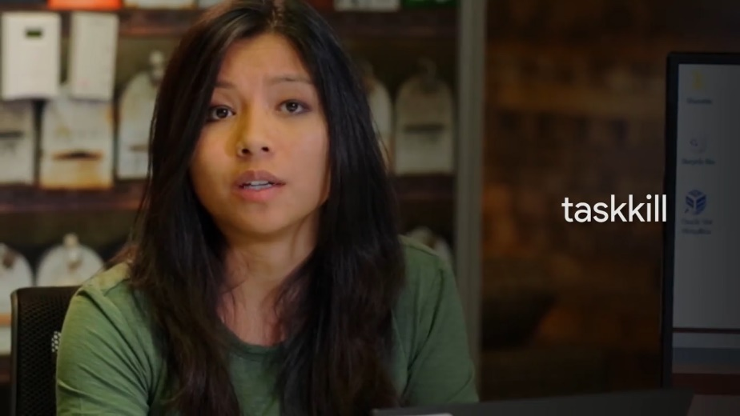

Task kill can find and halt a process in a few ways. One of the more common ways is use an identification number, known as the process id or PID to tell task kill which process you'd like stopped. One way to do this is to kill notepad again by specifying the PID using taskkill/pid and then the PID number.

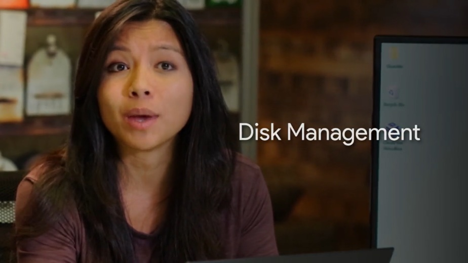

Taskkill/pid, this is the process id of notepad. That's success. This will send the termination signal to the process identified by the PID, which happens to be notepad in our case. This is useful, but how do we get that PID in the first place? Glad you asked. We'll talk about how to locate and view processes and other more detailed process information in an upcoming lesson.

### Linux process creation and termination

In Linux processes have a parent child relationship. This means that every process that you launch comes from another process. Let’s check out this command. The less command would be the parent process to our grep process.

If all processes come from another process, there must be an initial process that started this all, right? Yes, there is, when you start up your computer, the kernel creates a process called a nit, which has a pit of one.

A nit starts up other processes that we need to get our computer up and running. There are more nuances to process creation than this, but I wanted to introduce the parent process concept, since you'll see them when we start managing processes.

What about what happens when we're done with our processes? When your processes complete their task, they'll generally terminate automatically. Once a process terminates, it'll release all the resources it was using back to the kernel, so that they can be used for another process. You can also manually terminate a process, which we'll discuss how to do in an upcoming lesson.

### Jess passions

My name is Jessica Thera and I'm a systems engineer in the Site Reliability organization. \[MUSIC\] So I'd been talking to one of my mentors, and I said, man, I'd really kill to have a job this summer. I would love to work with computers. And she said, well you know I have this opportunity, but we're not sure if you're quite ready for it because you're a little young and inexperienced. And I pretty much begged her, she took the chance on me, and I stuck with this from the time that I was 15 until I entered college. The first time I was challenged to problem solve, was probably when we got our first computer and I broke it. I was sitting at the computer, I had been inspired by a movie that I saw and decided that I wanted to be a young hacker. And so I ran some command lines and I managed to blue screen, a death to the computer. And so I panicked trying to figure out what I could do to revert what I just did, and there was no saving it. I am a first generation born in the US, my family is from Haiti. All of my life my parents and everyone around me always asked me, what did you want to be when you grow up? I really honestly didn't know what I wanted to be until I started playing around with computers and I eventually figured out that I had a love for it. And I basically thought to myself, there has to be a job that I can do with computers. When I decided that I wanted to pursue a profession in technology and computing no one understood what I was talking about. Coming from an immigrant family, everyone talks about being a doctor or a lawyer or a teacher. And if you're not one of the three, you're not doing it right. But now they don't think that anymore so, they think I'm a god. \[LAUGH\]

## Managing processes

### Windows reading process information

It might feel like we're starting to get into the weeds here. So let's take a step back and think about what processes really are and what they represent in the context of an operating system. You can think of processes as programs in motion. Consider all the code for your Internet browser. It sits there on your hard drive quietly waiting for its time to shine. Once you start it up, the operating system takes that resting code then turns it into a running, responding, working application. In other words, it becomes a process.

You interact with launch and halt processes all the time on computers, although the OS usually takes care of all that behind the scenes. By learning about processes, you're taking a peek behind the curtain at how operating systems really work. This knowledge is both fascinating and powerful, especially when applied by a savvy IT support specialist to solve problems. Keep all that in mind as we take a look at how you can pull back the curtain even further.

Next, we'll learn about the different ways you can investigate which processes are running on a Windows computer and more methods of interacting with them.

On the Windows operating system, the task manager or task mgr.exe is one method of obtaining process information. You can open it with the control shift escape key combination or by locating it using the start menu.

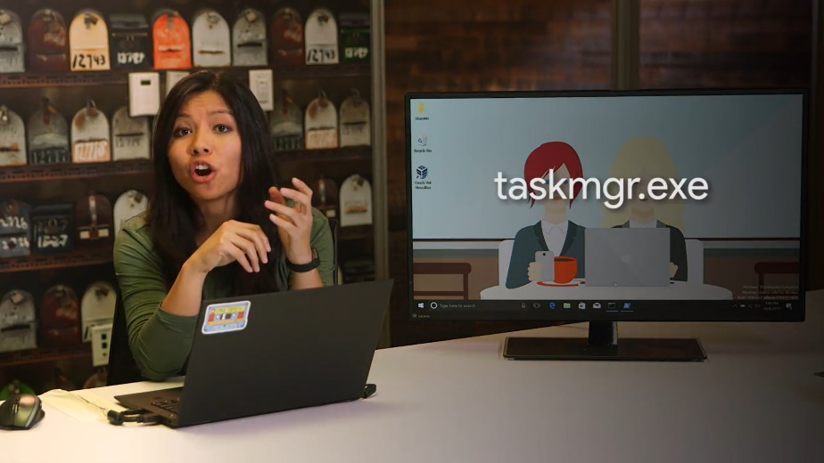

If you click on the processes tab, you should see a list of the processes that the current user is running along with a few of the system level processes that the user can see. Information about each process is broken out into columns in the task manager. The task manager tells you what application or image the process is running along with the user who launched it and the CPU or memory resources it's using.

To kill a process, you can select any of the process rows and click the end task button in the lower right corner.

We can demonstrate this by launching another notepad.exe process from the command line, then switching over to the task manager, selecting the notepad.exe process and ending it. I already have Notepad open so I'm going to click on it, click end task.

In an earlier lesson, we talked about starting and ending Windows processes. Remember that we used the task kill command to stop a process by its identification number or PID. So how do we get that PID number?

While in task manager, you can click on the details menu option and here, you can see a whole bunch of other information you can get the task manager to display, including the PID.

You can also see this information from both a command prompt and PowerShell. From the command prompt, you can use utility called TaskList to show all the running processes.

From a PowerShell prompt, you can use a Commandlet called Get-Process to do the same.

There are lots of ways you can get process information from the Windows operating system. We've included links to the documentation of both TaskList and Get-Process in the supplementary reading in case you want to dive deeper into either of these tools.

### Linux reading process information

Okay, now let's talk about how to view the processes running on our system in Linux. We'll be using the ps command, so let's just go ahead and run that command with the dash X flag, and see what happens.

This shows you a snapshot of the current processes you have running on your system. The ps output can be overwhelming to look at at first, but don't worry, we'll walk through how to read this output.

Let's start from right to left here. P-I-D or PID is the process ID, remember processes get a unique ID when they're launched.

TTY, this is the terminal associated with the process, we won't talk about this field but you can read more about it in the manpages linked right after this video.

STAT this is the process status, if you see an R here it means the process is running or it's waiting to run. Another common status you'll see is T for stopped, meaning a process that's been suspended. Another one you might see is an S for interruptible sleep, meaning the task is waiting for an event to complete before it resumes. You can read more about the other types of process statuses in the manpages.

TIME, this is the total CPU time that the process has taken up.

And lastly, command, this is the name of the command we're running.

Okay, now we're going to enter hard mode here. Run this command, PS-EF. The E flag is used to get all processes, even the ones run by other users. The dash F flag is for full, which shows you full details about a process.

Look at that, we have more processes and even more process details. Let's break this down.

UID is the user ID of the person who launched the process.

PID is the process ID, and PPID is the parent ID that we discussed in earlier lesson which launched the process.

C is the number of children processes that this process has.

STime is the start time of the process.

TTY is the terminal associated with the process.

TIME is the total CPU time that the process has taken up.

And CMD or command is the name of the command that we're running.

What if we wanted to search through this output? It's super messy right now, can you think of a way we can see if a process is running? That's right, with the grep command, I told you we were going to use it all the time.

This will give us a list of process that have the name Chrome in them.

There's another way to view process information, remember everything in Linux has a file, even processes. To view the files that correspond to processes we can look into slash proc directory. There are a lot of directories here for every process that's running. If you looked inside of one of the subdirectories it'll give you even more information about the process.

Let's look at a sample process file for PID 1805. This tells us even more information about a process state than what we saw in PS.

While the slash proc directory is interesting to look at, it's not very practical when we need to troubleshoot issues with processes. For now stick with the PS-EF command to look at process information.

As you can see, we can learn a lot about the processes running on our machine with just a few key strokes. In an upcoming lesson we'll talk about how to use process information to our benefit when figuring out which processes are taking up too many resources.

For now, feel free to learn a little more about the processes that you're running, I'll be waiting for you in the next video.

### Windows signals

Imagine you're starting up a video game that's taking a while to render its graphics. You decide that you don't want to play anymore, which leaves you with a few options. You can wait for it to finish loading and then quit the game from the menu, or you can interrupt the process altogether, telling it to quit at the system level. This is just one example of a time you might find yourself wanting to close a process before it fully completes.

To tell a process to quit at the system level, we use something called a signal. A signal is a way to tell a process that something's just happened.

You can generate a signal with special characters on your keyboard and through other processes and software. One of the most common signals you'll come across is called SIGINT, which stands for signal interrupt.

You can send this signal to a running process with the CTRL+C key combination.

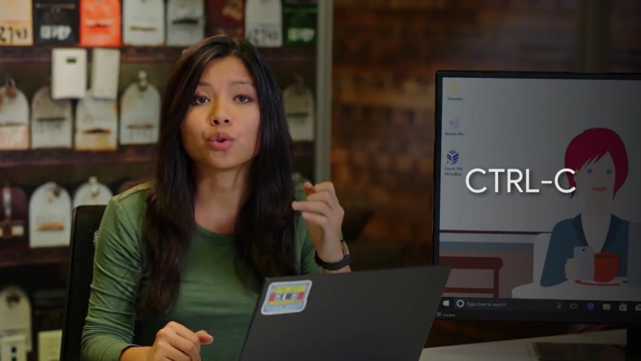

Let's say you start up the DiskPart tool we looked at in our discussion on partition formatting. I'm just going to open up command prompt and then launch DiskPart.

If you decide you don't want to actually format any disks, you can hold down the CTRL key and press C at the same time to send the SIGINT signal to the DiskPart process.

You'll see that the window that the DiskPart program was running in closes and the process terminates. There are a few other Windows signals that processes can send and receive. But unlike in Linux, there isn't an easy way for an end user to issue arbitrary signal commands. If you're interested in learning more about Windows signals, check out the signal reference link in the supplementary reading.

### Linux signals

In Linux, there are lots of signals that we can send the processes. These signals are labeled with names starting with sig. Remember the sigint signal, we talked about before. You can use sigint to interrupted process and the default action of this signal is to terminate the process that's interrupting. This is true for Linux 2. You can send a sigint signal through the keyboard combination Ctrl+C. Let's see this in action. I'm going to do the same thing as we did in Windows and start a program like sudo parted. We can see that we're in the parted tool now.

Let's interrupt his tool and say we want it to abort the process with the Ctrl+C keyboard combination.

Now, we can see that the process closed and we're back in our shell. We were able to interrupt our process midway and terminate it. Success. There are lots of signals used in Linux, and we'll talk about the most common ones in the upcoming lessons.

### Windows managing processes

In earlier lessons, we talked about processes. We saw some examples of how to manipulate them with signals. Let's expand on that idea, Process Management, by looking at some of the things you can do to manipulate processes. In Windows, we've looked up programs like Task Manager, the PowerShell command like Get-Desk process, and the Task close utility, to name a few.

We've also seen how to send a running processor signal through Control C, but there's another Process Management tool we haven't talked about which lets you do things like restart or even pause processes. This tool is called Process Explorer. Process Explorer is a utility Microsoft created let IT support specialists, systems administrators, and other users look at running processes.

Although it doesn't come built into the Windows operating system, you can download it from the Microsoft website which I've linked to in the supplemental reading right after this video. Once you've downloaded Process Explorer and started it up, you'll be presented with a view of the currently active processes in the top window pane.

You'll also see a list of the files a selective process is using in the bottom window pane. This can be super handy if you need to figure out which processes use a certain file, or if you want to get insight into exactly what the process is doing, and how it works.

You can search for a process easily in Process Explorer by either pressing Control F, or clicking on the little binocular button. Let's go ahead and do a search for the notepad process we opened up earlier.

You should see C\Windows\System32\notepad.exe listed as one of the search results.

If you see something that says notepad.exe.mui, don't worry. MUI stands for multilingual user interface, and it contains a package of features to support different languages.

Anyways, once you've located the notepad.exe process, notice how it's nested under the command.exe process in the UI. This indicates that it's a child process of command.exe. If you right-click on the notepad.exe process, you'll be given a list of different options that you can use to manage the process.

Check out the ones that say Kill Process, Kill Process Tree, Restart, and Suspend.

Kill Process is what you might expect. Say goodbye to notepad.

Kill Process Tree does a little bit more. It'll kill the process and all of its descendants. So, any child process started from it will be stopped. Kill Process Tree takes no prisoners.

Restart is another interesting option. You might be able to guess what it does just by its name. It will stop and start the process again.

Let's do that with the notepad.exe process. We started from command.exe.

Interesting. After the restart, notepad.exe doesn't appear as a child of command.exe anymore. What gives? Well, if you'll search for notepad.exe again, we can see it's been restarted as a child of the procexp.exe process.

This is the process name for Process Explorer. This makes sense since Process Explorer was a process in charge of starting it again after we terminated it. But what about the Suspend option? Instead of killing a process, you can use this option to suspend it and potentially continue it at a later time. If we right-click, suspend the process, we'll see that in the CPU column, the process explorer output, the word suspended appears.

While a process is suspended, it doesn't consume the resources it did when it was active. We can kick it off again by right-clicking and selecting the Resume option.

Process Explorer can do a lot, and we'll take a look at some of the monitoring information it can give us in an upcoming lesson. We won't get into the details of all its features though. So, if you're curious, you can check out the documentation on Microsoft's website. We put a link to it for you and the supplementary reading.

### Linux managing processes

Let's talk about how to use signals to manage processes in Linux. First up, terminating processes. We can terminate a process using the kill command. It might sound a bit morbid, but that's just how it is in the dog-eat-dog world of terminating processes.

The kill command without any flags sends a termination signal or SIGTERM. This will kill the process, but it'll give it some time to clean up the resources it was using. If you don't give the process a chance to clean up some of the files it was working with, it could cause file corruption.

I'm going to keep a process window open so you can see how our processes get affected as we run these commands.

So, to terminate a process we'll used to kill command along with the PID of the process we want to terminate. Let's just go ahead and kill this Firefox process. And if we check the process window, we can see that the process is no longer running.

The other signal that you might see pop up every now and then is the SIGKILL signal.

This will kill your process with a lot of metaphorical fire. Using a SIGTERM is like telling your process, ''Hey there process, I don't really need you to complete right now, so could you just stop what you're doing?'' And using SIGKILL is basically telling your process, ''OK, it's time to die.''

The signal does its very best to make sure your process absolutely gets terminated and will kill it without giving it time to clean up. To send a SIGKILL signal, you can add a flag to the kill command dash kill for SIGKILL.

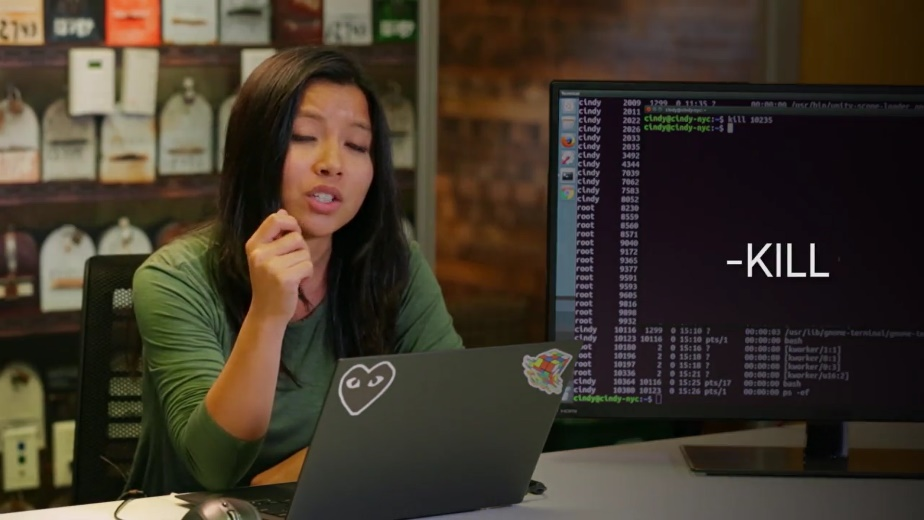

So, let's open up Firefox one more time. So, kill dash kill 10392, and now you can see that Firefox has been killed.

These are the two most common ways to terminate a process. But it's important to call out that using kill dash kill is a last resort to terminating a process. Since it doesn't do any cleanup, you could end up doing more harm to your files than good.

Let's say you had a process running that you didn't want to terminate but maybe you just want to put it on pause. You can do this by sending the SIGTSTP signal for terminal stop, which will put your process in a suspended state.

To send this, you can use the kill command with the flag dash TSTP. I'm going to run PS dash X so you can see the status of the processes. We're just going to put this process in a suspended state.

So, kill dash TSTP. Now you can see the process 10754 is now in a suspended state.

You can also send the SIGTSTP signal using the keyboard combination, Control Z.

To resume the execution of the process, you can use the SIGCONT for continued signal.

Let's go and look at the process table again. I'm going to go ahead and use that command on this process. Now, if I look at the process again, you'll see that the process status turned from a T to an S.

SIGTERM, SIGKILL, and SIGSTP are some of the most common signals you'll see when you're working with processes in Linux. Now that you have a grasp on these signals, let's use them to help us utilize hardware resources better.

## Process utilization

### Windows resource monitoring

You've been doing a great job and we're almost done with this module. Now that we spent all this time learning about processes, like how to read them and how to manage them, when are we ever going to use these newfound skills? Well, pretty much all the time. But an IT support role, managing processes comes in handy the most when processes become a little unruly. Our systems usually have some pretty good ways of monitoring processes and telling us which processes might be having issues.

In Windows, what are the most common ways to quickly take a peek at how the system resources are doing is by using the Resource Monitoring tool.

You can find it in a couple of places, but we will launch it right from the start menu. Once it opens, you'll see five tabs of information. One is an overview of all the resources on the system. Each other tab is dedicated to displaying information about a particular resource on the system.

You'll also notice that Resource Monitor displays process information too along with data about the resources that the process is consuming.

You can get this performance information in a slightly less detailed presentation from process explorer. Just like the process you are interested in, right click and choose properties.

From there, pick the performance graph tab. You can see quick visualizations of the current CPU memory indicated by private bytes and disk activity indicated by I/O.

But how can we get this information from the command line? I am glad you asked. There are several ways to get this information from the command line but we will focus on a PowerShell centric one, our friend Get-Process.

We know that if we run Get-Process without any options or flags, we get process information for each running process on the system. If you check out the column headings at the start of the output, you'll see things like NPM(K) values in this column represent the amount of non paged memory the process is using. And the K stands for the unit, kilobytes. You can see Microsoft's documentation for a full write up of each column in the next supplemental reading.

This is useful but it is a lot of information. It can be really helpful to filter down to just the data you are interested in. Let's say you wanted to just display the top three processes using the MOS CPU, you could write this command. Get-Process\| Sort CPU -descending \| Select -first 3 -property ID, ProcessName and CPU.

And just like that, we get the top three CPU hogs on the system. This command might be a little hard to understand, so let's go through it step by step.

First, we call the Get-Process Commandlet to obtain all that process information from the operating system.

Then, we use a pipe to connect the output of that command to the sort command. You might remember pipes from some Linux examples earlier.

We sort the output of Get-Process by the CPU column descending to put the biggest numbers first.

Then, we pipe that information to the select command. Using select, we pick the first three rows from the output of sort and pick only the property ID, name, and CPU amount to display.

Now that you've got some knowledge about both the command line and graphical tools Windows provides for investigating resource usage, let's have a look at Linux Resource Monitoring.

### Linux resource monitoring

A useful command to find out what your system utilization looks like in real time is the top command.

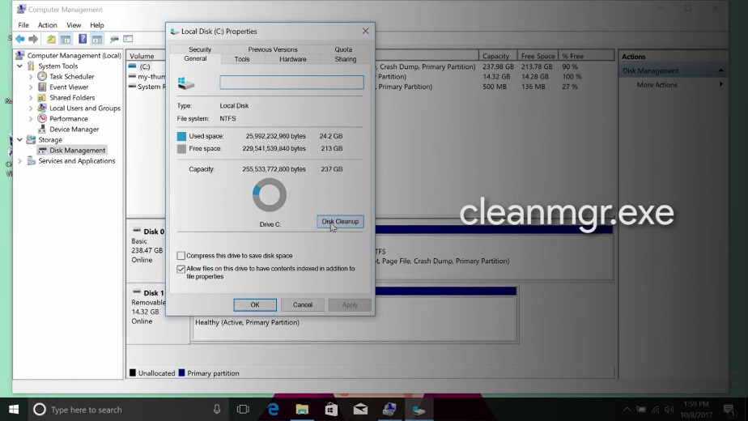

Top shows us the top processes that are using the most resources on our machine. We also get a quick snapshot of total tasks running or idle, CPU usage, memory usage, and more.

One of the most common places to check when using the top command are these fields here, percentage CPU and percentage mem. This shows what CPU and memory usage a single task is taking up.

To get out of the top command, just hit the Q key, Quit. A common situation you might encounter is when a user's computer is running a little slow. It could be for lots of reasons, but one of the most common ones is the overuse of hardware resources. If you find that a top shows you a certain task is taking up a lot of memory or CPU, you should investigate what the process is doing. You might even terminate the process so that it gives back the resources it was using.

Another useful tool for resource utilization is the uptime command. This command shows information about the current time, how long your system's been running, how many users are logged on, and what the load average of your machine is.

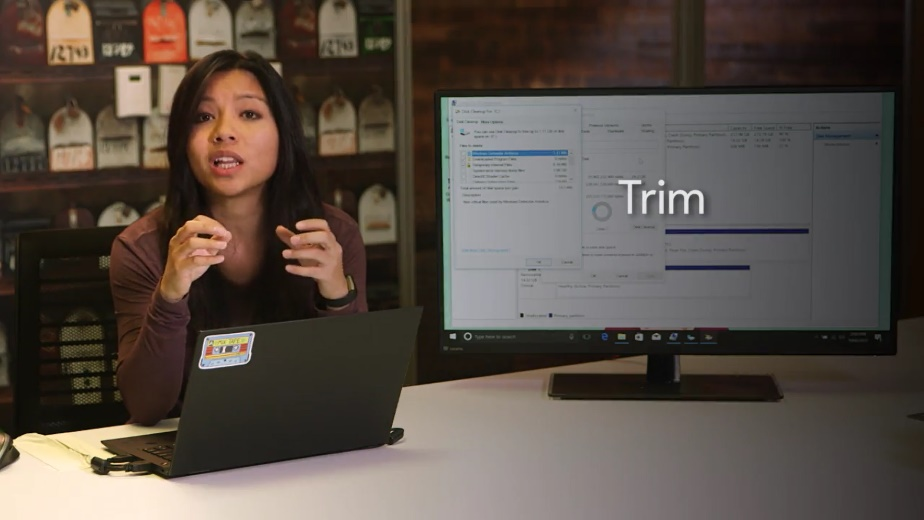

From here, we can see the current time is 16:43 or 4:43, our system has been up for five hours and eight minutes, and we have one user logged in.

The path that we want to talk about here is the system load average. This shows the average CPU load in 1, 5, and 15 minute intervals. Load averages are an interesting metric to read. They become super useful when you need to see how your machine is doing over a certain period of time. We will get into load averages here but you should read about them in the next supplemental reading.

Another command that you can use to help manage processes is the lsof command.

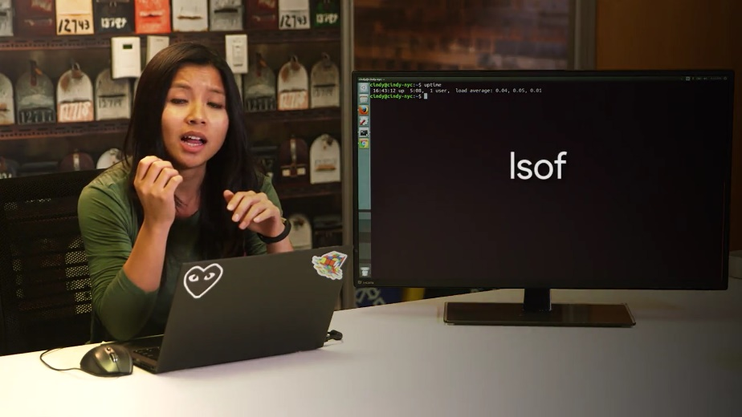

Let's say you have a USB drive connected to your machine, you're working with some of the files on the machine, then when you go to eject the USB drive, you get an error saying, device or resource busy. You've already checked that none of the files on the USB driver is in use or opened anywhere, or so you think. Using the lsof command, you don't have to wonder. It lists open files and what processes are using them. This command is great for tracking down those pesky processes that are holding open files.

One last thing to call out about hardware utilization is that you can monitor it separately from processes. If you just wanted to see how your CPU or memory is doing, you could use various commands to check their output. This isn't immediately useful to see on a single machine, but maybe in the future, if you manage a fleet of machines, you might want to think about monitoring the hardware utilization for all of your machines at once. We won't discuss how to do this, but you can read more about it in the supplemental reading.

You've done some really great work in this module. You learned a lot about how to read process information and manage processes, something that will be vital for you'd know when troubleshooting issues as an I.T. support specialists.

The next assessments will test you on that new process management knowledge. Then, drum roll please, we'll be on to the last and final lesson of this course. Will cover some of the essential tools that are used in the role of an I.T. support specialist.
