# Table des matières

[1 Navigating the system [2](#navigating-the-system)](#navigating-the-system)

[2 Users and permissions [2](#users-and-permissions)](#users-and-permissions)

[3 Package and software management [2](#package-and-software-management)](#package-and-software-management)

[4 File systems [2](#file-systems)](#file-systems)

[5 Process management [2](#process-management)](#process-management)

[6 Operating systems in practice [2](#operating-systems-in-practice)](#operating-systems-in-practice)

[6.1 Remote access [2](#remote-access)](#remote-access)

[6.1.1 Introduction [2](#introduction)](#introduction)

[6.1.2 Remote connection and ssh [2](#remote-connection-and-ssh)](#remote-connection-and-ssh)

[6.1.3 Remote connections on windows [7](#remote-connections-on-windows)](#remote-connections-on-windows)

[6.1.4 Remote connection file transfer [12](#remote-connection-file-transfer)](#remote-connection-file-transfer)

[6.1.5 Remote connection file transfer on windows [14](#remote-connection-file-transfer-on-windows)](#remote-connection-file-transfer-on-windows)

[6.2 Virtualization [17](#virtualization)](#virtualization)

[6.2.1 Virtual machines [17](#virtual-machines)](#virtual-machines)

[6.3 Logging [22](#logging)](#logging)

[6.3.1 System monitoring [22](#system-monitoring)](#system-monitoring)

[6.3.2 The windows event viewer [23](#the-windows-event-viewer)](#the-windows-event-viewer)

[6.3.3 Linux logs [27](#linux-logs)](#linux-logs)

[6.3.4 Working with logs [34](#working-with-logs)](#working-with-logs)

[6.4 Operating system deployment [36](#operating-system-deployment)](#operating-system-deployment)

[6.4.1 Imaging software [36](#imaging-software)](#imaging-software)

[6.4.2 Operating systems deployment methods [37](#operating-systems-deployment-methods)](#operating-systems-deployment-methods)

[6.5 Course wrap up [40](#course-wrap-up)](#course-wrap-up)

[6.5.1 Course wrap up [40](#course-wrap-up-1)](#course-wrap-up-1)

[6.5.2 Heather early career advice [41](#heather-early-career-advice)](#heather-early-career-advice)

[6.5.3 Congratulations [41](#congratulations)](#congratulations)

# Navigating the system

# Users and permissions

# Package and software management

# File systems

# Process management

# Operating systems in practice

## Remote access

### Introduction

You've made it all the way to the last module of this course. Great job. So far, you've learned how to navigate both the Windows and Linux operating systems, how to set up and manage users, along with how to manage software. You also learn how to work with disks and file systems on top of working with processes and hardware resources. That's some seriously great work. The skills you learn in this course are essential for building a solid technical foundation as an IT Support Specialist. Now let's finish strong. In the next few lessons, we're going to wrap up the course with some of the more practical aspects of operating systems that you'll use all the time in IT support. Let's get started.

### Remote connection and ssh

In this lesson, we are going to talk about an important part of computing that makes working in IT supporter a little easier. Actually, it makes things a lot easier for just about anyone.

Picture this, you're on your way to an important meeting. You've been rehearsing for this presentation all week and now you're ready to show the big wigs what you've got. But wait, the slide deck, where is it? It's not on your laptop. Where could it be? It turns out you forgot your only copy on your desktop at home, it's too late now to turn around and get it so you sit there dreading the inevitable.

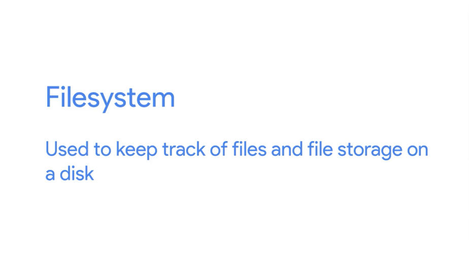

But wait a minute, suddenly you remember that you have a remote connection set up from your laptop to your desktop. You use this connection to log into your computer at home. And just as if you are sitting at home, you're able to grab the file from your desktop and copy it to your laptop. You then proceed to give one amazing presentation.

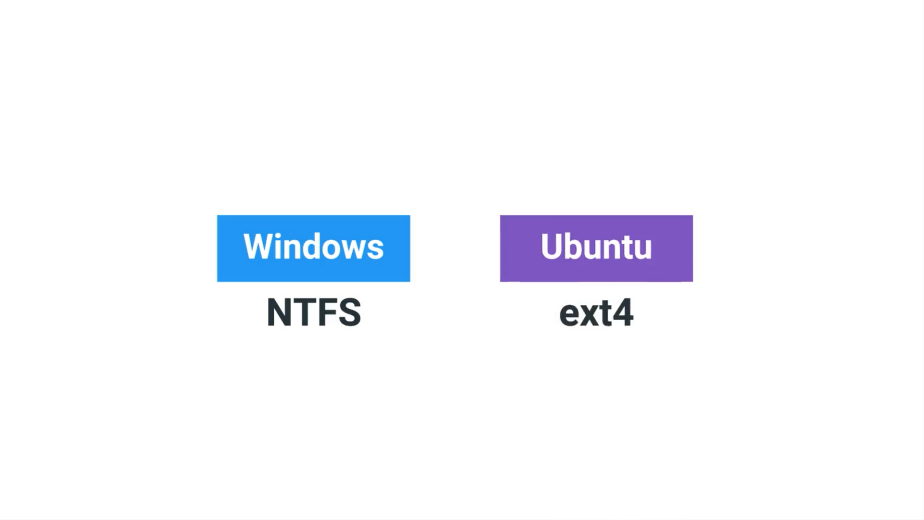

Consider another scenario. You bought a computer at a store and you're having a lot of issues with it. The store has a computer help desk that can help you with the issues, but it's after hours and the store's closed. You really need to get your computer issue fixed. So what are your options?

Fortunately, the store provides 24/7 tech support online. Now instead of worrying until the physical store is open again, you can reach a tech online and have them help you with your issue through a remote connection. Remote connection makes working in an IT Support role much easier since it allows us to manage multiple machines from anywhere in the world.

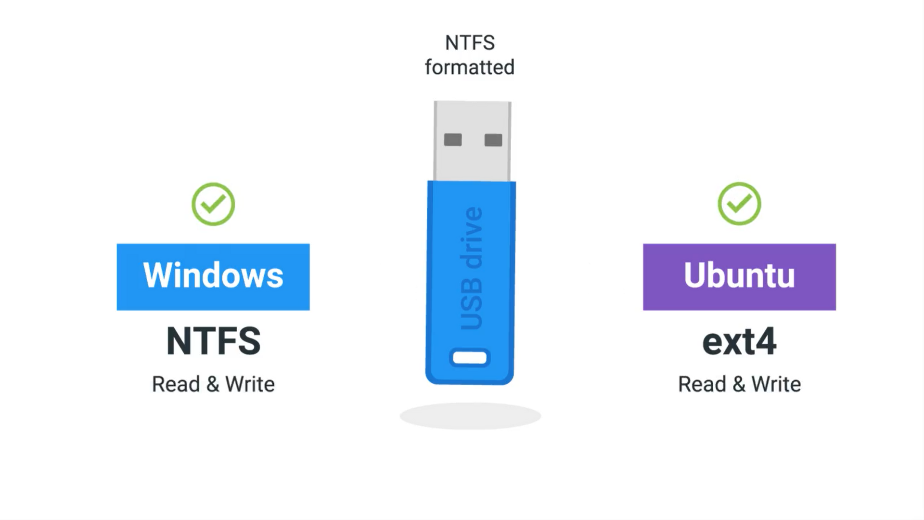

In this lesson, we're going to learn about remote connection. You've actually already been using it throughout this course. We've been using the Chrome remote desktop connection to access our Windows Qwiklabs, along with SSH, or secure shell, to securely log in to our Linux Qwiklabs. But we're going to dig a little deeper in this lesson and talk about how remote connection works and the different methods to connect remotely to a machine.

SSH or secure shell is a protocol implemented by other programs to securely access one computer from another.

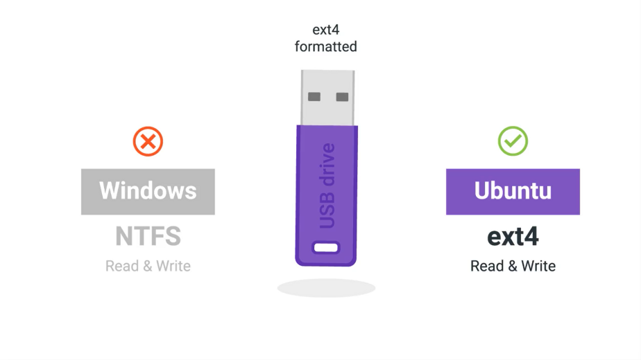

In the Qwiklabs exercises, you've been using the Google Cloud console SSH client to access the Linux VM instances. To use SSH, you need to have an SSH client installed on the computer you're connecting from, along with an SSH server on the computer you're trying to connect to. Keep in mind, that when we say SSH server, we don't mean another physical machine that serves data. An SSH server is just software.

On the remote machine, the SSH server is running as a background process. It constantly checks if a client's trying to connect to it, then will authenticate its request. The most popular program to use SSH with in Linux is the OpenSSH program.

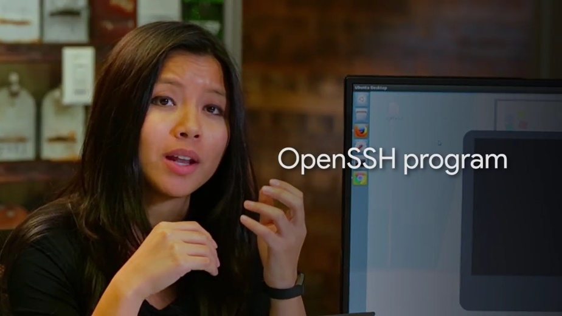

We'll be using it in this lesson, but we wont talk about how to install it just yet. We'll circle back to that in the next course, System Administration and IT Infrastructure Services. The same goes for Windows. We'll talk about how to use SSH from a Windows machine using the popular open source program PuTTY.

For now, let's just talk about what happens when you use SSH. We're going to show you an example of SSHing into a remote machine. We already have an SSH client installed on this machine, but don't worry, we'll talk about the different SSH clients and installing them on the next course of the program, System Administration IT Infrastructure Services.

So first things first, to log in to a remote machine we have to have an account on that computer. We also need the host name or IP address of that computer. Let's test this. So, ssh cindy@ IP address. We get this message.

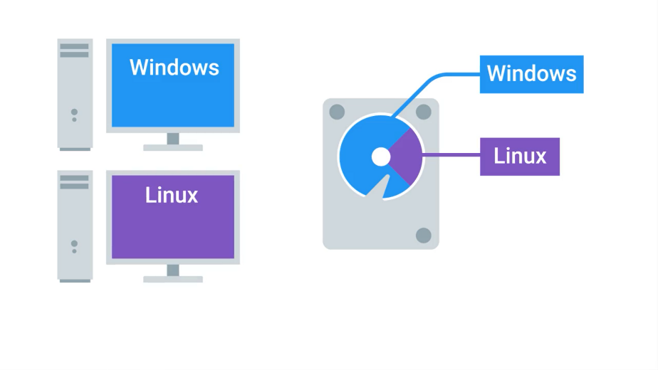

The authenticity of hosts, and then the IP address, can't be established. This message is just saying we've never connected to this machine before, and our SSH client can't really verify we're connecting to a machine we want to connect to. But we can verify this is the right machine. So let's just go ahead and type yes.

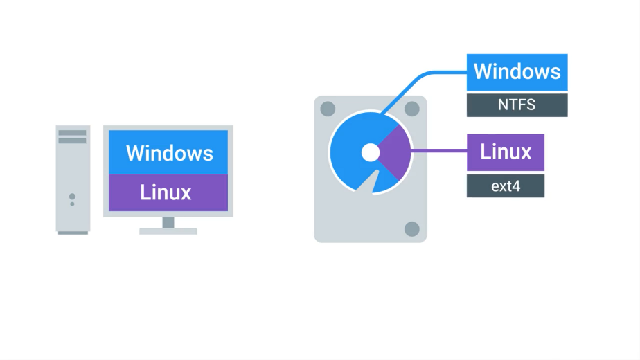

Now, this host gets saved to the computer as a known host, so we won't get this message again when we try to log into it. Okay, now that we're connected through SSH, any of the text commands that we type are sent securely to the SSH server. From here, you can even launch an application that'll let you see a GUI instead of working directly in the shell. You can read more about how to do that in the supplemental reading.

We can connect SSH using passwords, as you saw earlier. This way of authenticating to a remote machine is pretty standard, but it's not super secure. The alternative is using an SSH authentication key. SSH keys come in a set of two keys, called private and public keys.

You can think of them as actual physical keys to a special safe. You can use one key to lock to safe, but it won't unlock it. The other key can then only unlock the safe, but not lock it. That's basically how public and private keys work. You can lock something with a public key, but you can only unlock it with a private key, and vice versa. This ensures that whatever's in the safe is available to only those with the public and private keys. You'll learn about the technical details of public and private keys in our IT security course. Don't worry if this doesn't make sense right now, it will. And that's basically how SSH works. Not too scary, right?

Another way that you can connect securely to a remote machine is through a VPN. A VPN is a virtual private network. It allows you to connect to a private network, like your work network, over the Internet.

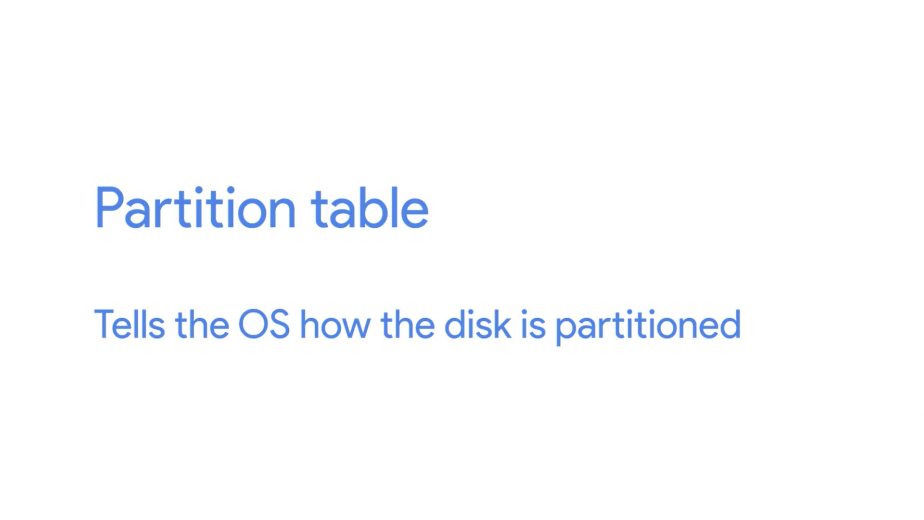

Think of it as a more sophisticated SSH with a lot more set up. It allows you to access resources, like shared file servers and network devices, as if you are connected to your work network. Spoiler alert, we'll also touch upon the technical details behind VPN in the IT security course. We've covered a lot about remote connections and how they work. We'll take more about the popular remote connections programs for Windows and Linux and how to set them up in the system administration course.

### Remote connections on windows

The ability to make remote connections is equally useful on Windows computers, but there isn't an open SSH client for the Windows OS, at least not yet. That's changing though. Microsoft has announced that they'll be contributing to the OpenSSH project to provide an integration with PowerShell. You can read the full text of their statement in the supplemental reading that's included after this lesson.

It's great to know that Windows will eventually integrate an OpenSSH client into PowerShell. In the meantime, what's a IT support specialist to do if they want to SSH into another computer? Well, there are hosts of third-party applications that can service SSH clients on Windows. Let's take a look at one of the more popular tools, PuTTY.

PuTTy is a free, open source software that you can use to make remote connections through several network protocols, including SSH.

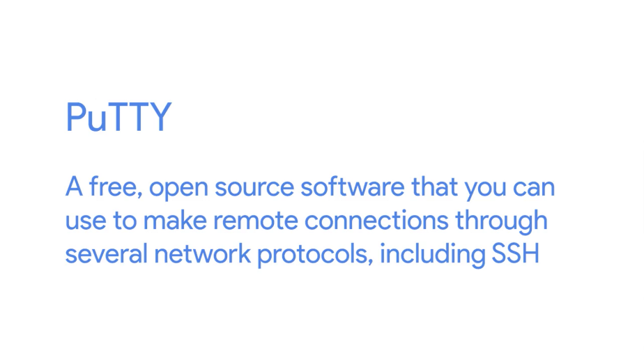

You can visit the PuTTy website to download the entire software package with Microsoft installer. Those are the MSI files we talked about earlier. Or you can choose a specific executable which provides the functionality you're after, like PuTTY.exe. The PuTTY downloads page is linked in the next supplemental reading in case you want to check it out. Once you've downloaded and installed PuTTY, you can use it by launching the GUI. A window will appear showing you the basic options for your connection. Make a note of the host name, port, and connection type options.

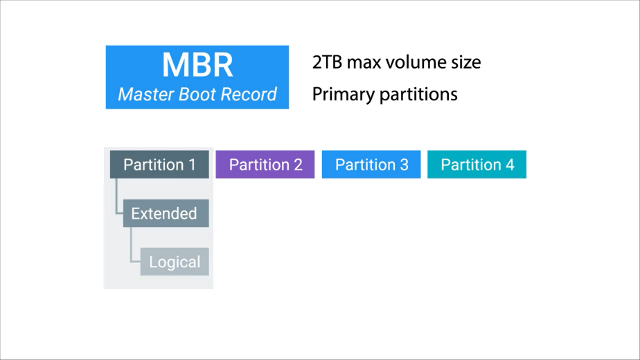

By default, the port is set to 22, which is the default port the SSH protocol uses, and the connection type is set to SSH. All you need to do is type in the host name or IP address of the computer you want to connect to. Then click open to start up a new SSH session.

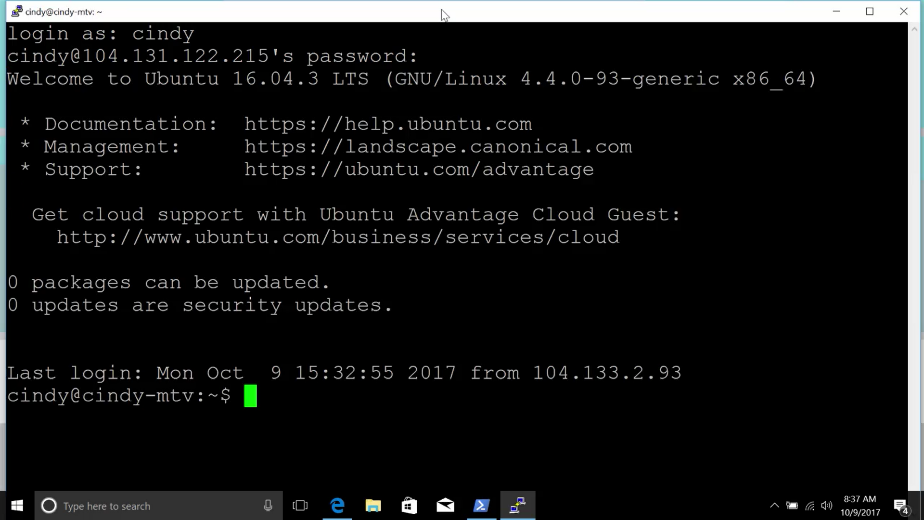

And now I have SSH'd into a remote computer. Running PuTTy from the GUI isn't your only option. You can also use it on the command line. Open a PowerShell prompt and type out the application name, like this. Then tell it you want to connect via SSH by adding the -ssh option. You could also provide the user and address in the form of user@ipaddress, and specifying the port at the end. Altogether the command would look something like this.

PuTTy also comes with a tool called plink or putty link, which is built in to the command line after putty is installed. You can use plink to make remote SSH connections too. SSH can be super useful, especially if you want to connect from a computer running Windows to a Linus based operating system running remotely.

Microsoft actually provides another way to connect to other Windows computers called the Remote Desktop Protocol, or RDP.

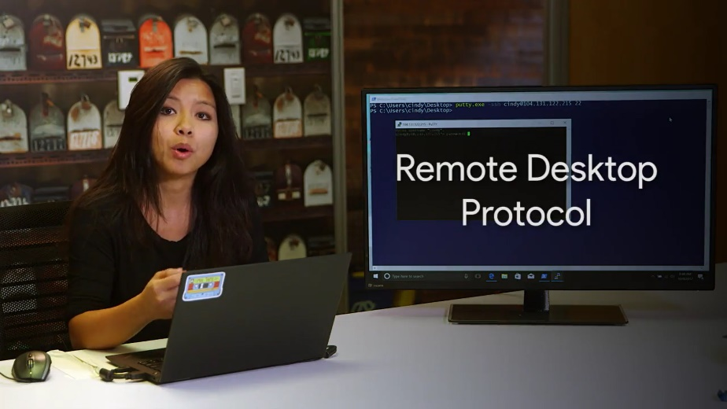

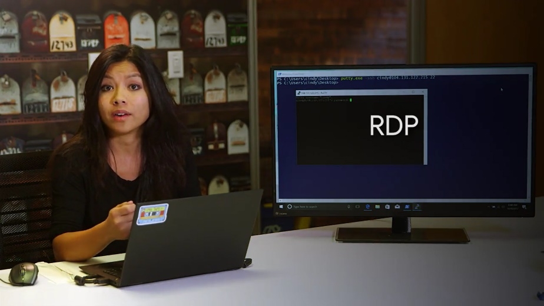

There are also RDP clients for Linux in OS 10 too. Like RealVNC and Microsoft RDP on Mac. We'll add some links to these clients in the supplemental reading. RDP provides users with a graphical user interface to remote computers, provided the remote computer has enabled incoming RDP connections.

A client program called the Microsoft Terminal Services Client, or MSTSC.exe, As used to create RDP connections to remote computers.

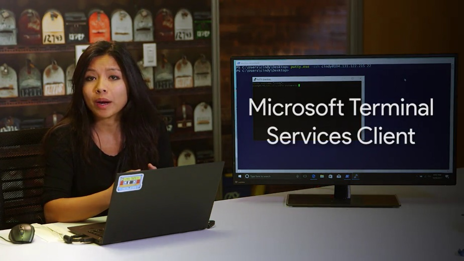

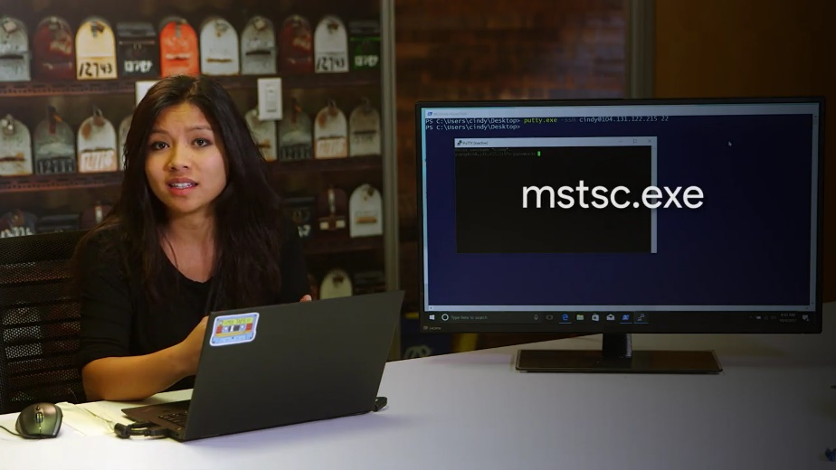

You can enable remote connections on your computer by opening up the start menu, right clicking on this pc, then selecting properties. From there, select remote settings.

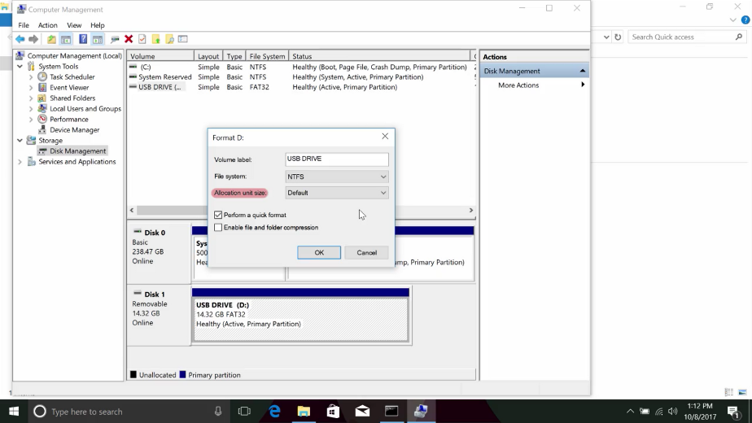

And then pick an option from the remote desktop portion of the panel. There are some security implications that come with allowing people to remotely connect to your computer. You should only let users who you trust do this.

Typically, in an industry setting, these kinds of settings are usually set by the system administrator for the company's computers that connect to the network. Once you're allowed connections on the remote computer and provided you're on the list of users allowed to access it, you can use the remote desktop protocol client. MSTSC.exe to connect it from anywhere else on the network.

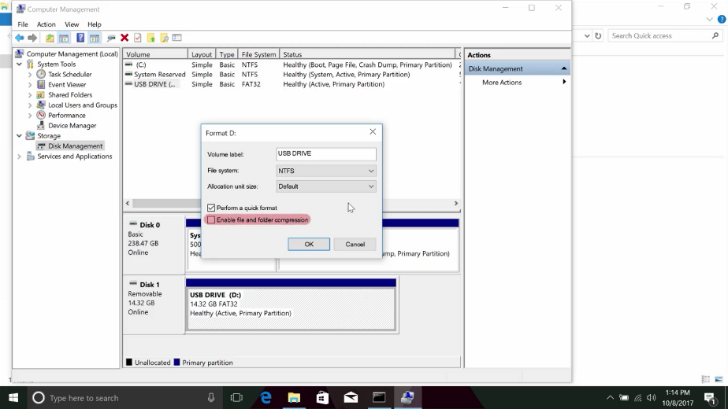

You can launch the RDP client in a few ways. You can type mstsc at the run box, or look up Remote Desktop Connections in the start menu. Once you've launched the client, it will ask for the name or IP address of the computer you want to connect to.

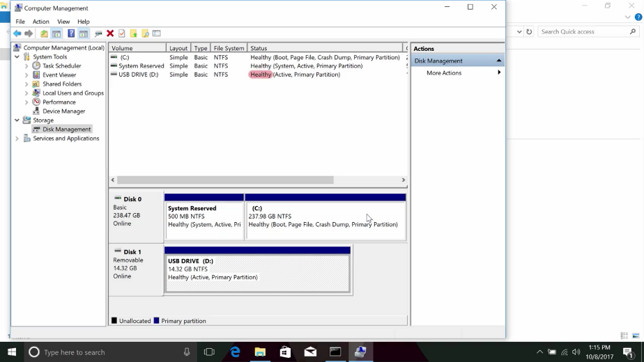

The Windows RDP client can also be launched from the command line or you can specify more perimeters like slash admin.

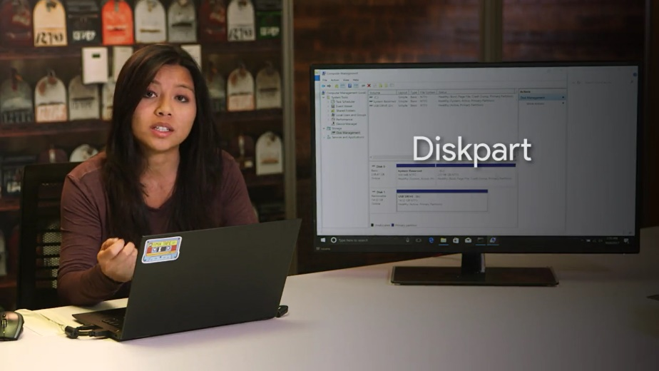

If you want to connect to the remote machine with the administrative credentials you may have already used the Windows RDP Client in Quicklabs. But if you haven't, we have linked to the RDP documentation in the supplementary reading in case you want to learn more.

### Remote connection file transfer

Have you ever tried sending a file over to a coworker? What methods do you use? Do you attach it to an email and send it, or do you copy the file to a USB drive and then transfer the file that way?

There are lots of ways to transfer files. In this lesson, we're going to talk about a method that uses remote connection. SCP, or secure copy, is a command you can use in Linux to copy files between computers on a network.

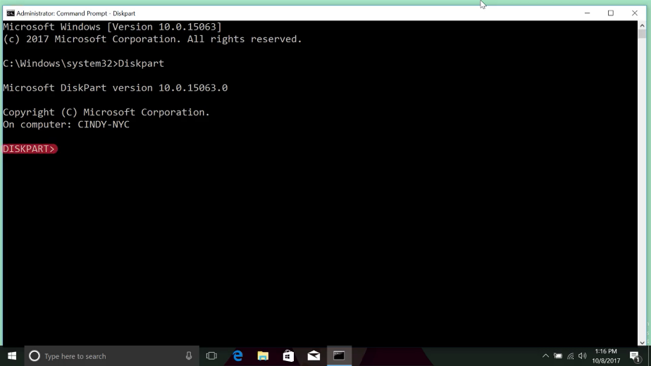

It utilizes SSH to transfer the data. So just like you would SSH into a machine you can send a file that way.

Let's see this in action. Let's say you want to copy over a file from our computer to another computer. To do this, we can run the SCP command with a few flags.

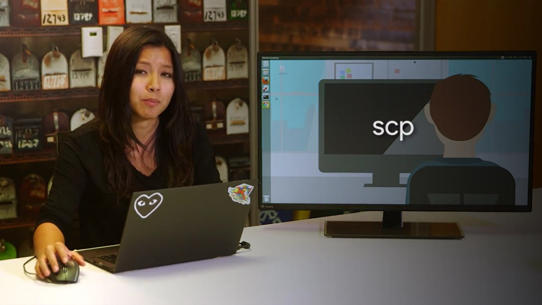

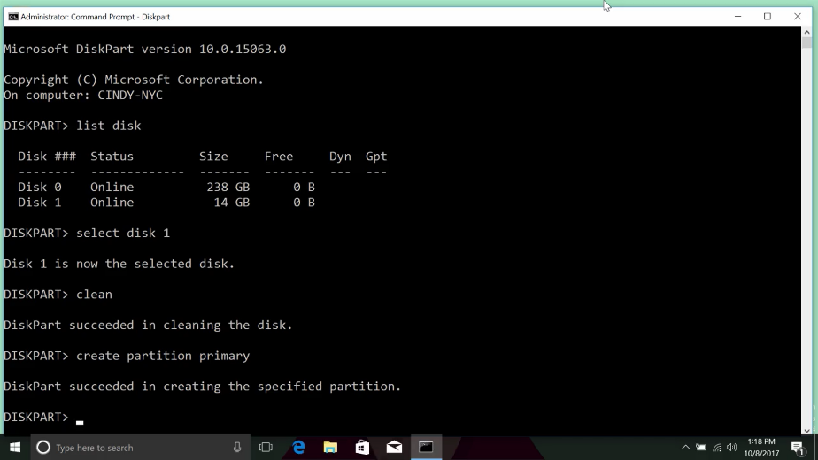

So SCP, Desktop, myfile, over to cindy@, In this command, we run the SCP command with the path of the file we want to transfer to the user account, hostname, and path of where we want to copy the file to. Now, it prompts us for the login information of the computer we want to send the file to.

After we enter this, we can verify that the file successfully copied over. And there it is.

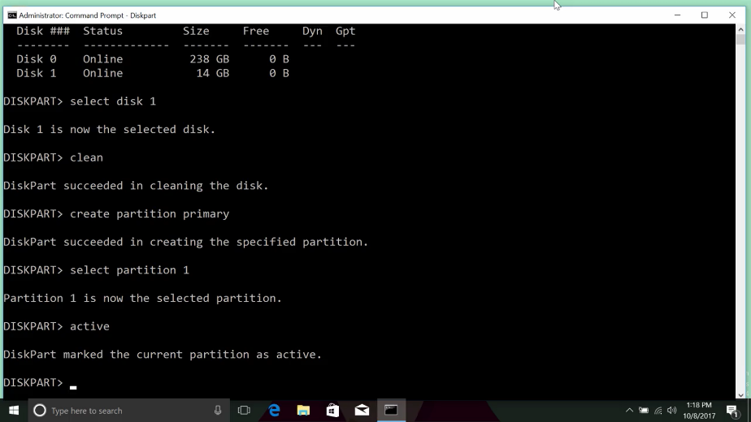

The SCP command is a super useful tool if you need to copy files to and from computers in a network. You can read more about the command by checking out the Manpage.

### Remote connection file transfer on windows

How can we share files and data over the network on a Windows computer? Well it just so happens that the PuTTY program we talked about a couple lessons back supports the SCP protocol. The PuTTY package comes with a tool called the PuTTy Secure Copy Client, or pscp.exe.

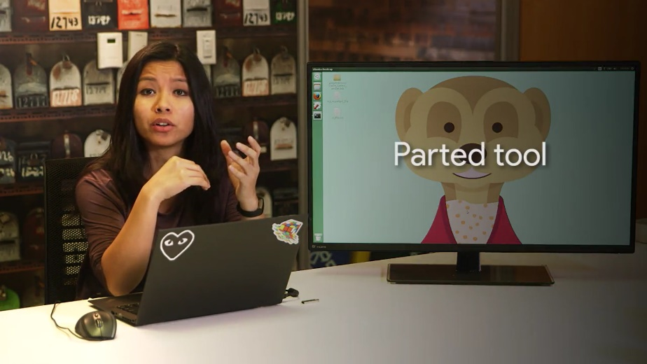

You can use it to copy files in a very similar way to the Linux SCP command. Let's take a look. Pscp.exe, and I'm going to grab a file from my desktop, Then I'm going to copy it to my Linux workstation. And then I'm going to add the location of where I want to copy it to.

Now, if you go back to my Linux workstation, We can see that it was copied.

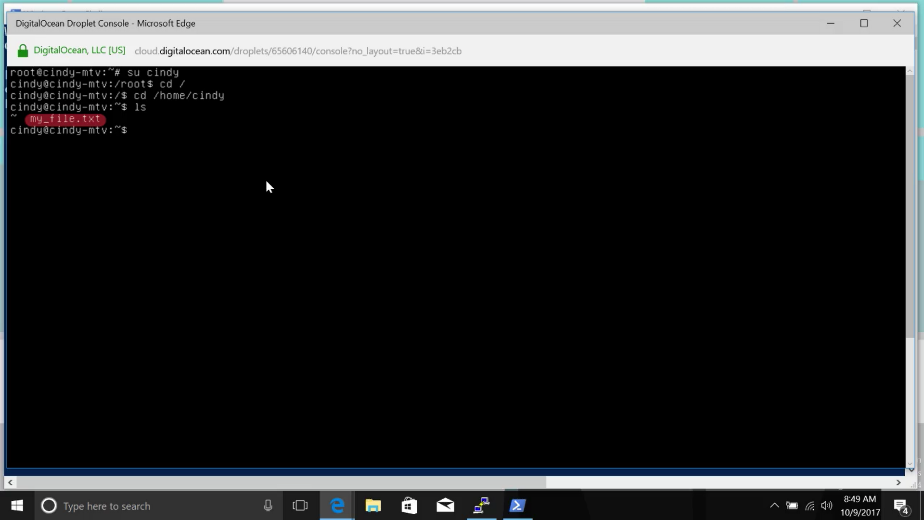

Using PuTTY or SCP to transfer files can be a little time-consuming, especially if you need to transfer files to multiple machines. As an alternative, Windows came up with a built in mechanism to share files by using the concept of shared folders.

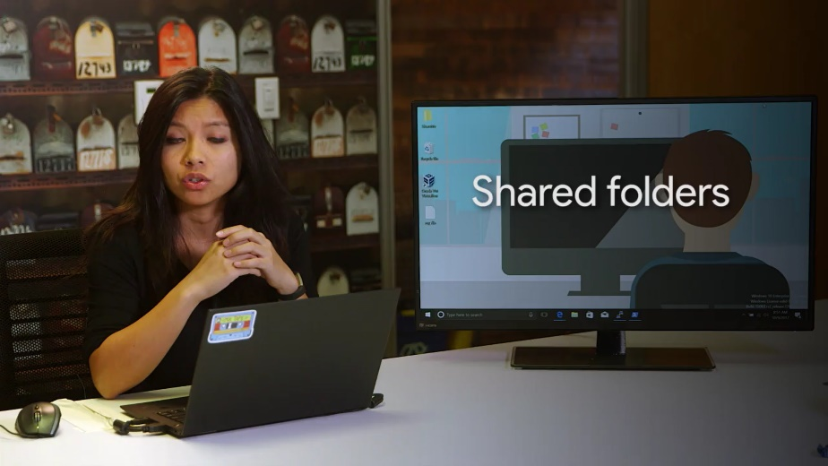

Shared folders do pretty much what you'd expect from their name. You tell Windows you want to share a folder with a person or group of people, then drop some files into it. Anyone you've shared the folder with can then access those files.

Sharing folders in Windows is easy. Just right-click on the folder you want to share, Then mouse over the Share with option, And then pick specific people from here.

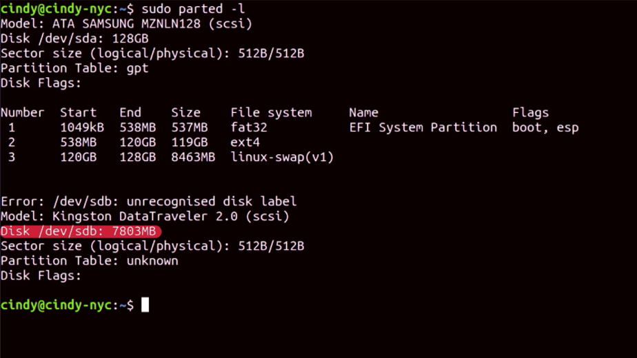

From here, you can add the individual users or groups you want to share the folder with. There's even an option to add everyone to the sharing permissions, which might be convenient, but isn't super secure.

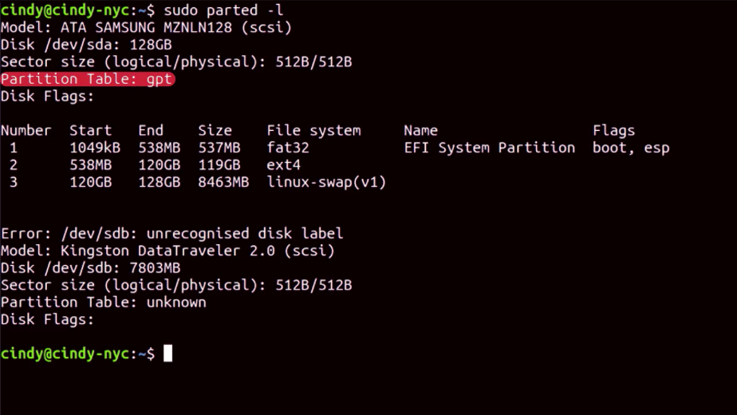

Once you've shared the folder, you can access it from other computers. Start by opening up This PC, Then going into the Computer tab. And from here, you can map the folder directly to your computer with the map network drive option.

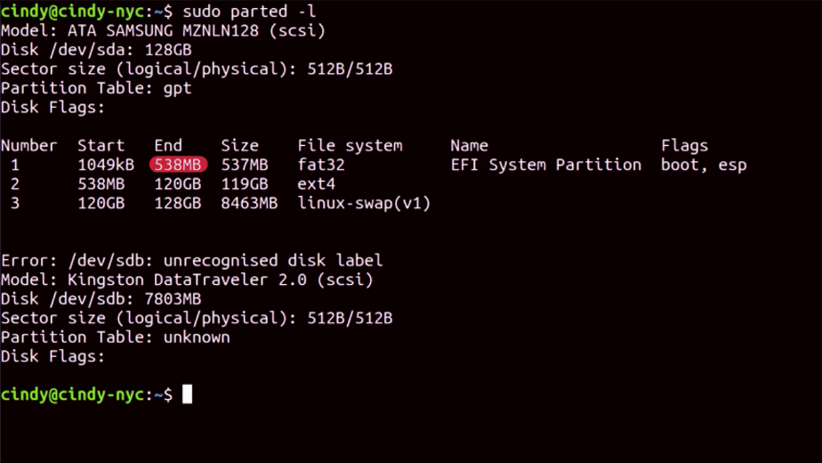

Finally, on another computer, you can visit it directly from the run box by typing in backslash, whatever the computer name is, and then backslash the folder name that you mapped it to.

You might be interested to know that you can share folders from the command line too, using the net share command.

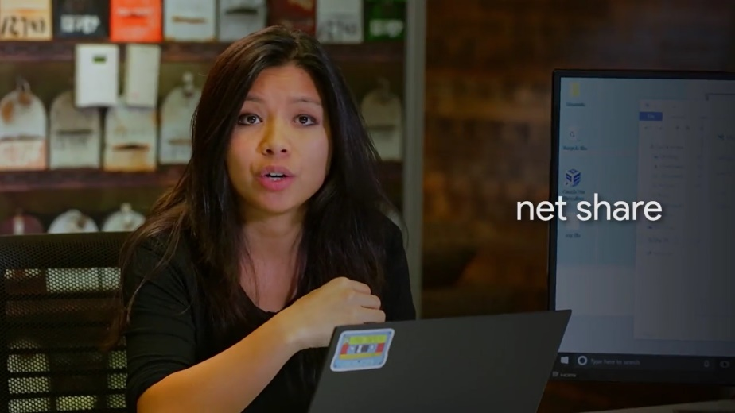

Net share lets you do the same thing as the GUI sharing workflow, and you'll need to specify what kind of permissions you'd like to give which users. Let's say you wanted to give everyone on your network full permissions to a folder called shareme. You could execute this command from an elevated or administrator level PowerShell prompt. Net share shareme, let's see, Users, /grant:everyone,full.

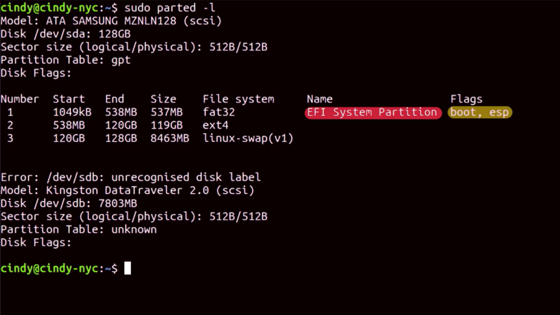

Users will be able to access the share folder by using the same methods we talked about before. The net share command can also be used to list the currently shared folders on your computer by executing it without any arguments. Just like this. If you'd like more information on net share and its abilities, check out the documentation in the supplemental reading.

## Virtualization

### Virtual machines

We've talked a little bit about virtual machines before. We've also been using virtual machines throughout the quick lab assessments. In this lesson, you're going to learn how to install, manage and remove a virtual instance. A virtual instance is just a single virtual machine.

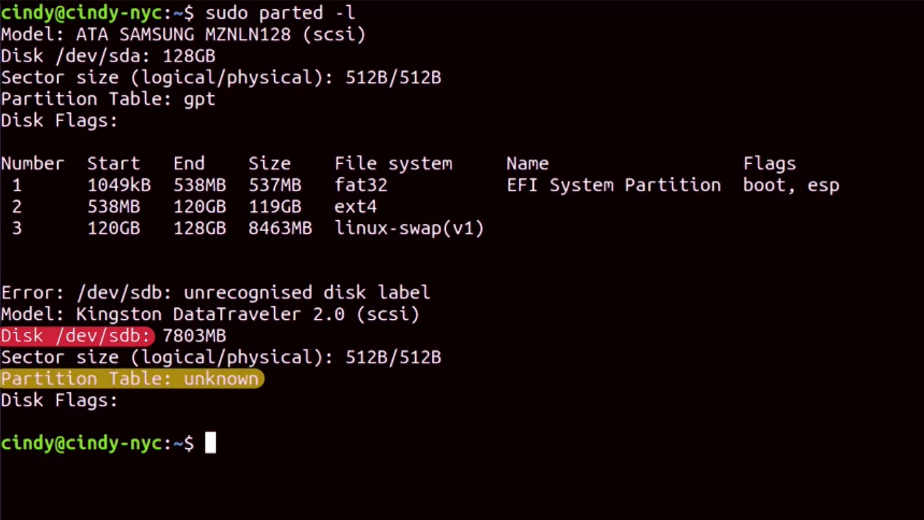

We're going to be using the popular opensource virtualization software, Virtual Box, to manage virtual instances.

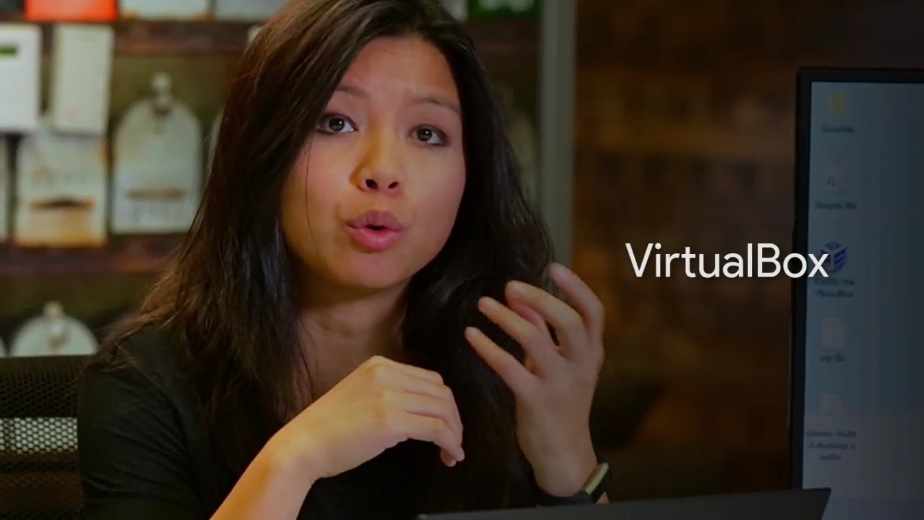

You'll find a link to download Virtual Box in the reading right after this lesson. I'm currently using a Windows machine and in this lesson we're going to set up and virtualize an ubuntu instance. I've already installed Virtual Box on my machine. So let's go ahead and launch this application. We won't go through all the menu items from Virtual Box, but we will talk about some of the main ones.

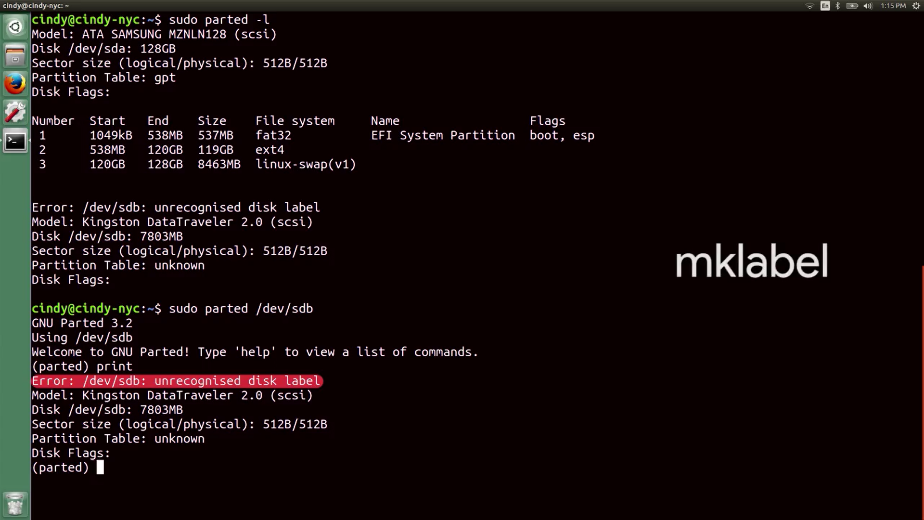

First step, how do we install a virtual instance? I've already pre-downloaded an image of ubuntu from their website and saved it onto my desktop but I have to install it somehow. Well, to install this, I'm just going to click this new button here to create a new VM. I'm going to give my VM a name and select the type and version of my OS. Just going to stick with the defaults.

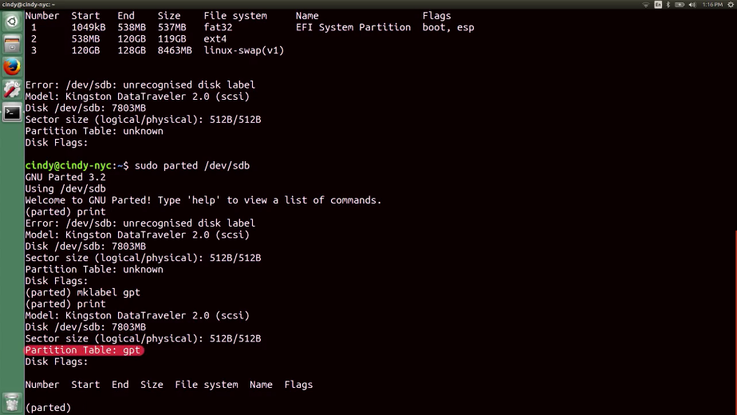

Next it asks how much RAM I want to dedicate to this VM. One gigabytes is more than enough for me so I'm just going to keep this and then continue.

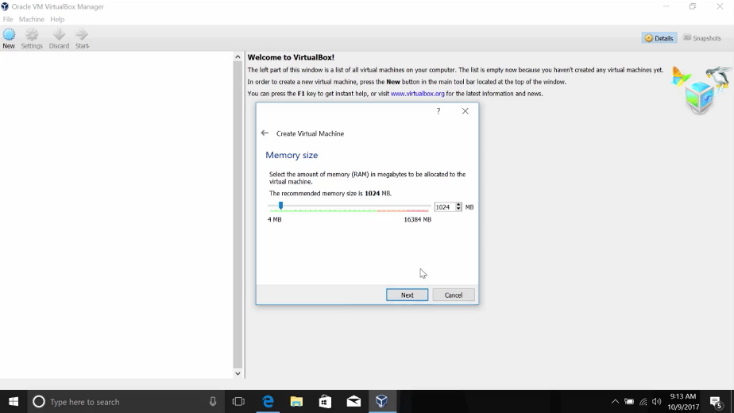

Now it asks how much hard drive space I want to dedicate to this VM. I'm just going to keep the default of 10 gigabytes and click Create.

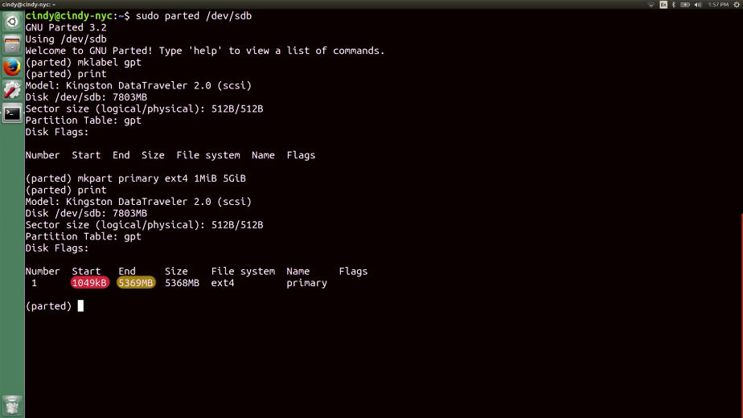

We're going to keep the default values here and just skip through to the create. Awesome. You can read more about these options in the supplemental reading.

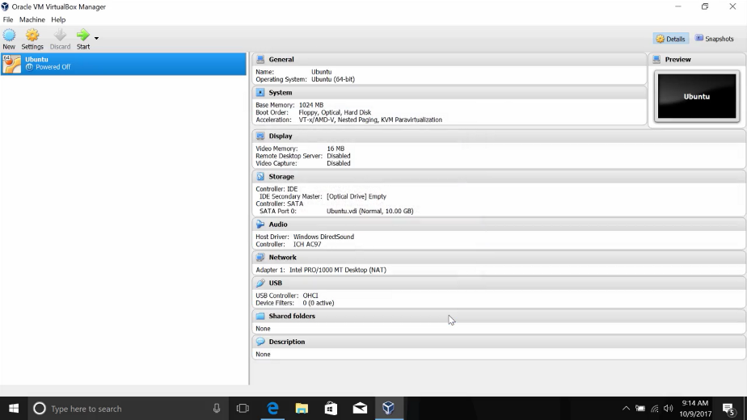

Now in my menu here I can click Start and it'll start the VM. It will prompt me to select a media to launch from, similar to booting a USB drive with the OS image on it. So I'm just going to select the image I downloaded. And from, here the installation starts up.

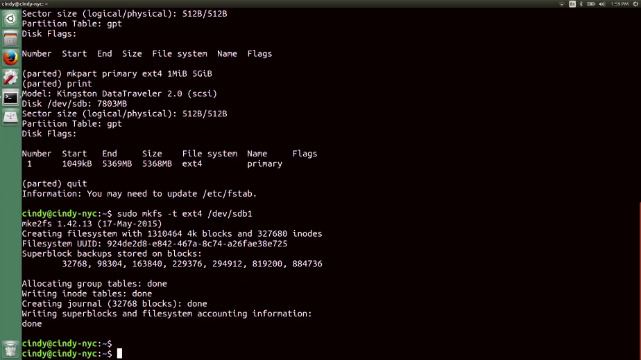

That's pretty much it. Okay, what if we decide we want to use more than one gigabyte for the OS? On a physical machine, we'd have to buy more RAM and install it.

But since we're using a VM, it's as easy as changing a setting. To modify hardware resource allocation to a VM, all we need to do is right click on the VM then click settings.

From here, we'll be able to change how much RAM we want along with other settings. We won't discuss the specifics of these settings, but you can see how simple it is to modify a VM instance.

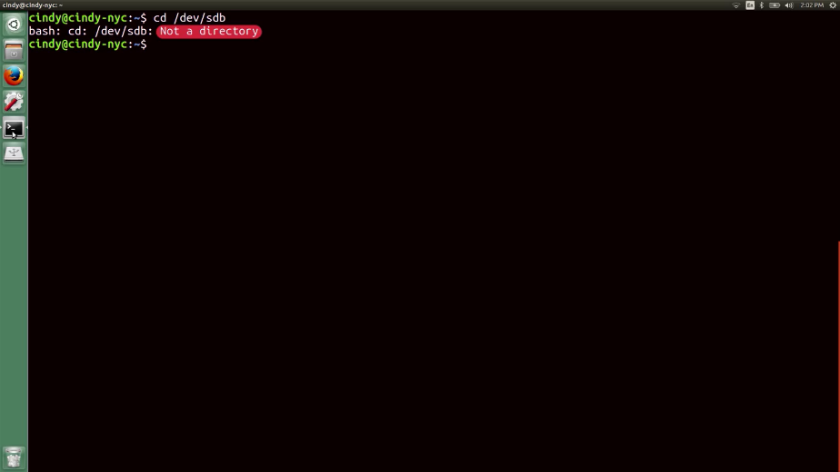

Now, what if we decide we don't want to use this VM anymore? If this is a physical machine, we'd have to worry about where to store or recycle the hardware. For virtual machines though, all we need to do is right click and select remove.

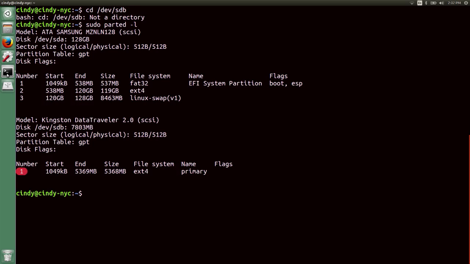

From here, it'll ask if we want to remove all files including the VM install itself or just remove it from the list of VMs. Let's go ahead and delete all files. And that's it in a nutshell. Super simple.

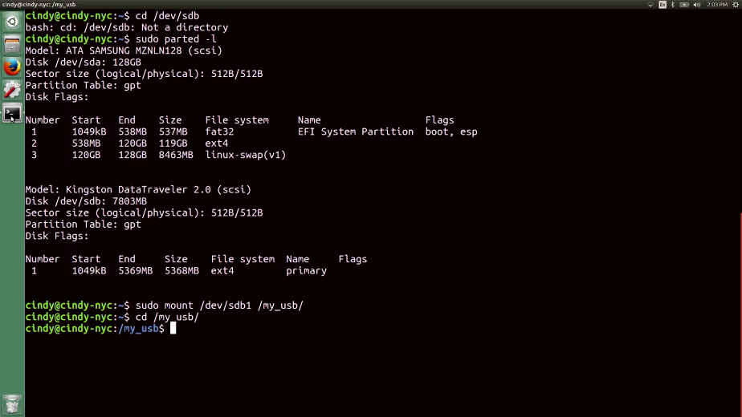

If you want to learn more about how to use Virtual Box or other virtualization software, don't forget to check out the supplemental reading.

## Logging

### System monitoring

Remember from the first course in our program, Technical Support Fundamentals, that we introduced the concept of logs? A log is like your computer's diary, it records events that happen on your system. What kind of events, well, pretty much everything. Like when your system shuts down, when it starts up, when a driver's loaded, when someone logs in.

All of these things can be written to a log. It's also written with a lot of detail. Logs tell you the exact time that an event occurred, who caused the event, and more.

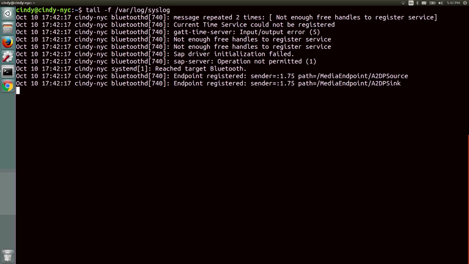

We'll be looking into some sample log snippets in the upcoming lessons to get a better sense of how to read one. The act of creating log events is called logging.

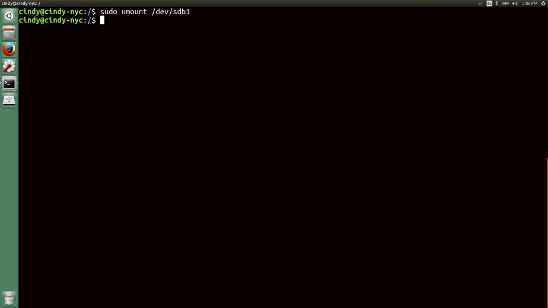

Your system does a pretty good job of logging events right out of the box.

In most systems, there is a service that runs in the background and constantly writes events to logs. These systems are customizable so you can log any specific field you want, but by default it logs all the essentials.

By the end of this lesson, you'll learn where all the important logs are kept on the Windows and Linux OSes. You'll also learn how to read a log and utilize common troubleshooting practices when it comes to logs. When you're working in IT support, you'll need to gather as much data as you can to troubleshoot an issue. Logs tell us important things like errors that occurred, changes that were made, etc. They are a reliable source of information.

### The windows event viewer

Similar to how we can jot down our life events in a journal, events are also logged on our machines. In Windows, the events logged by the operating system are stored in an application called the Event Viewer.

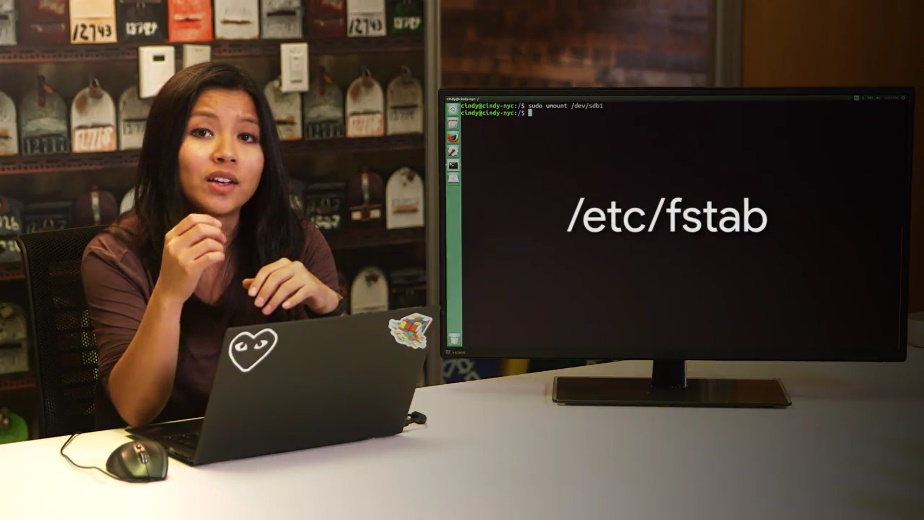

Whether you're trying to figure out why a computer game keeps crashing, or troubleshooting login or access problems, or just satisfying your curiosity about what's going on in your system, the Event Viewer is a great first stop.

Let's take a look at some of the information it collects, and how you can use the Event Viewer to get answers you're looking for. You can launch the Event Viewer either from the start menu or by typing in eventvwr.msc from the run box.

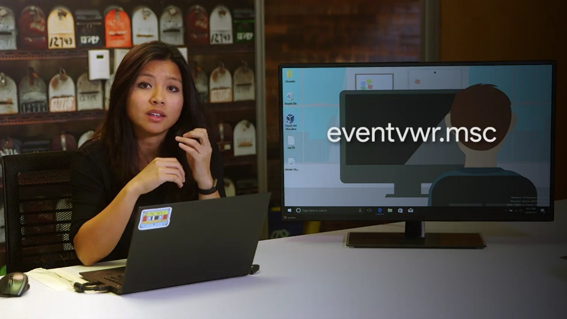

The default view of the Event Viewer shows is a summary of potentially important recent events. In our case, this isn't super interesting, since we're more concerned with any issues that occurred.

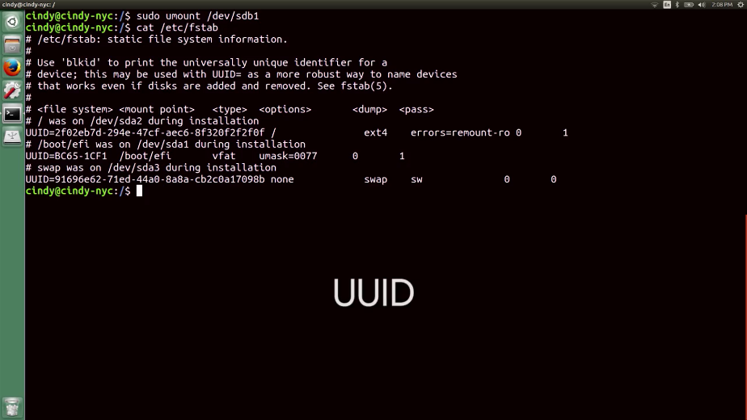

Instead, let's take a look at the left-hand pane, where we can see a few different event groupings. The first group we see is called Custom Views. The Event Viewer records a lot of information about the system. So it can sometimes be a little difficult to tease out the signal, like recent events, from the noise or the stuff you don't care about.

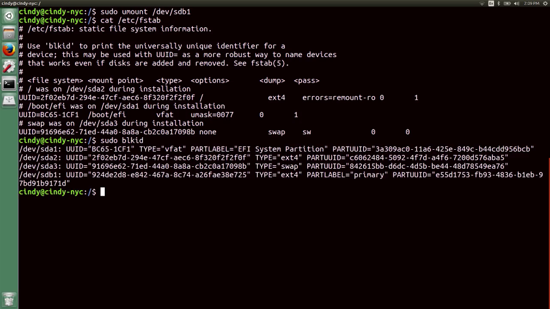

This is where the concept of custom views comes in handy. With a custom view, you can create a filter that will look across all the event logs the Event Viewers know about and tease out just the information you're interested in.

Let's say we wanted to only see events of error, severity or higher that we're logged in the last hour. To do this, Google create custom view options in right-hand actions pane. This will bring up a tab called Filter.

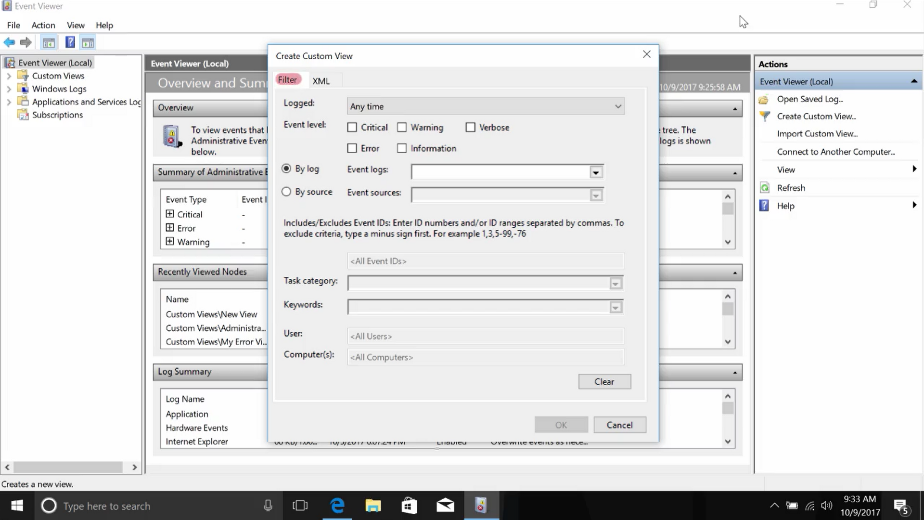

From there, click the error and critical checkboxes. We're going to change the logged drop down menu to last hour. In the Event logs, we're going to select just are just the Windows Logs, then click OK.

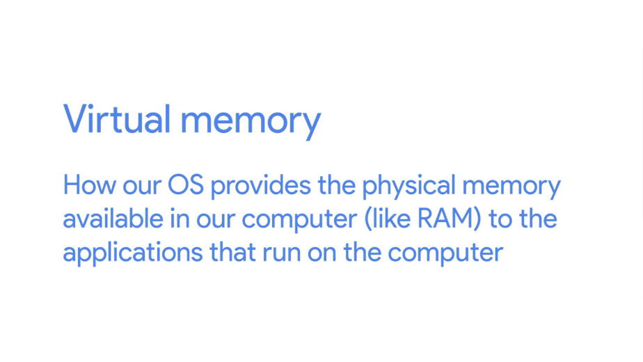

Then we're going to give our view a new name. Click OK once more. Once you're done, you'll see a new view come up under custom menus, where only the events that matched your filter are displayed.

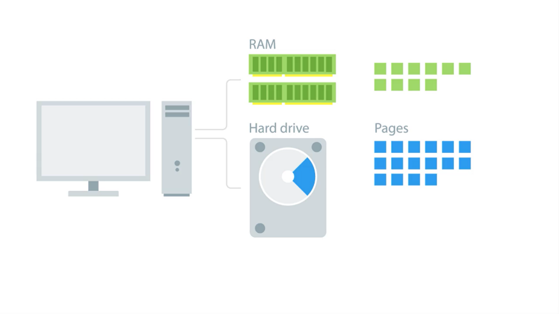

The other two categories of logs you'll see in the left-hand navigation page are Windows Logs and Application and Services.

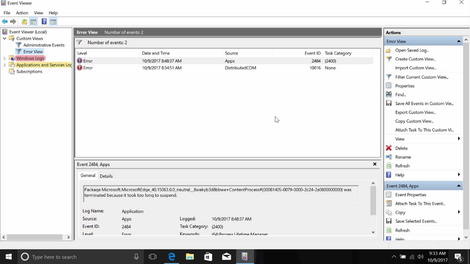

The Windows Logs categories contain event logs that are generally applied to the whole operating system. Let's say you're having an issue with a driver failing during startup. The log called System would be a good place to start. If you want to see whose been accessing the computer, then you begin investigating the Security log.

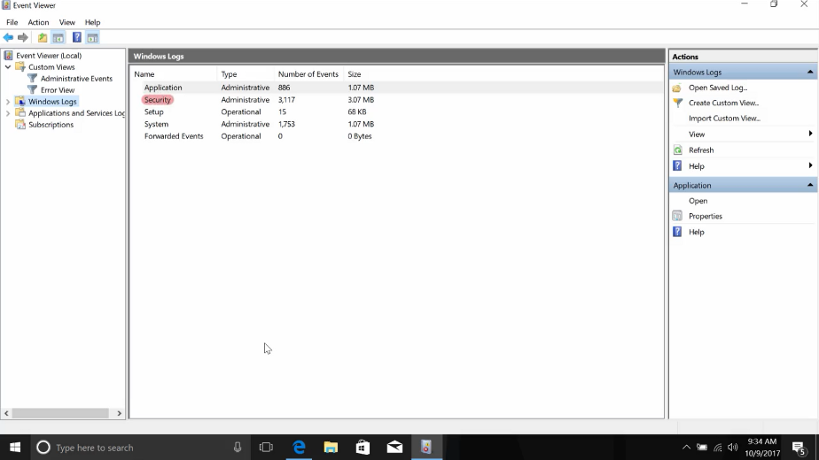

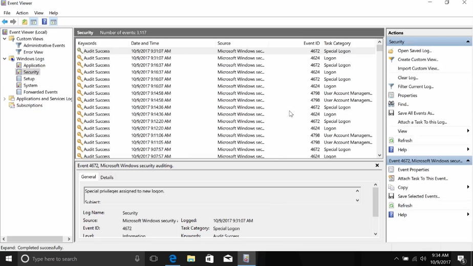

The other category is called Applications and Services Logs. This category contains logs that track events from a single application, or operating system component, instead of the system wide events of the Windows logs category.

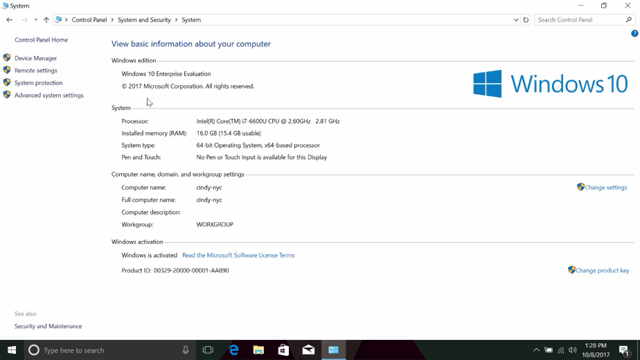

For example, if you're having trouble with PowerShell and wanted to get more information about it, checking out the PowerShell log under Applications and Services log would be a great first step.

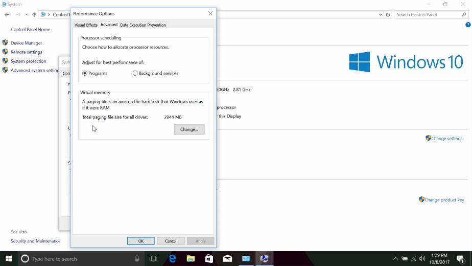

Regardless of its category, each line in a given log in the Event Viewer represents an event. Each event contains information grouped in columns about the event like the login level. Information is the lowest level and critical is the highest. You could also find the Date and Time the event occurred. Selecting an event will bring up more detailed information in the bottom pane of the Event Viewer.

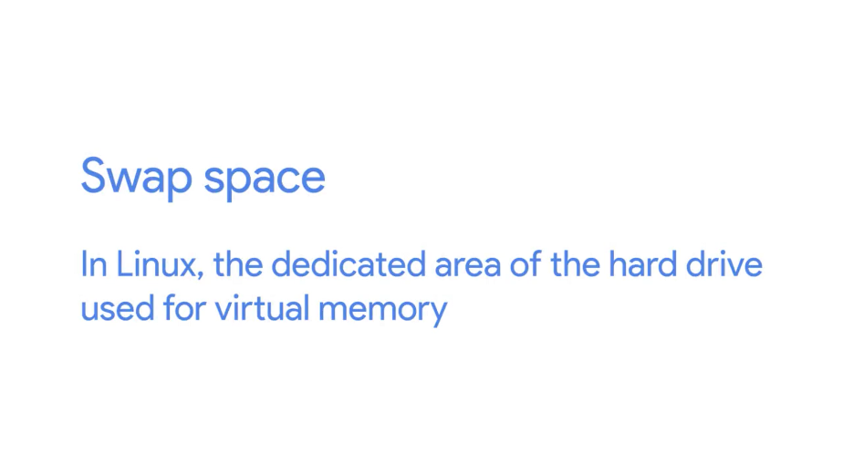

This can help you dig into troubleshooting or even give you context for a bug report.

The Event Viewer is a super helpful tool for IT support specialists. It can provide you with a lot of really detailed information about the problems any software or hardware might be experiencing on your system. There's a lot of information in there though. So, don't forget about its custom views and filtering capabilities. More importantly, don't hesitate to poke around the tool and get used to finding things in its interface. You'll have fun and you'll learn a lot.

Next stop, the wild world of Linux logs.

### Linux logs

Logs in Linux are stored in the /var/log directory.

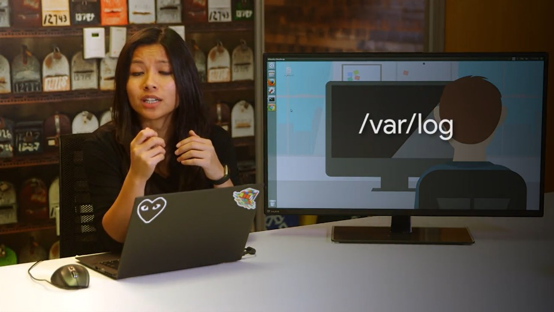

Remember that /var directory stands for variable, meaning, files that constantly change are kept in this directory, and it turns out that logs are constantly changing.

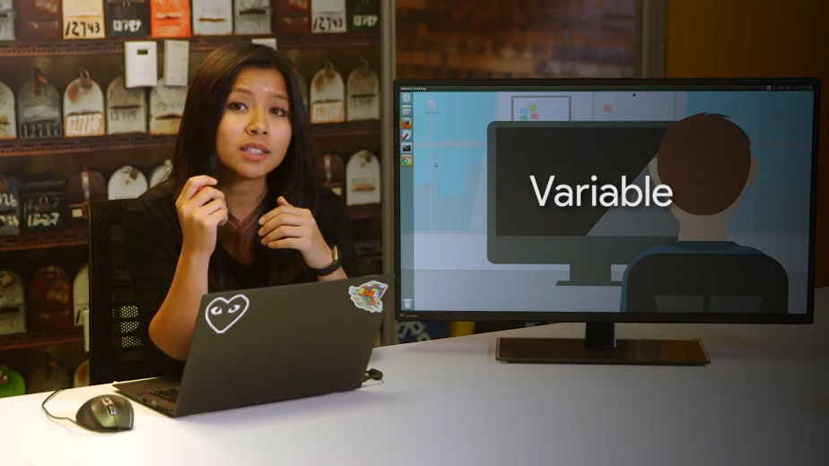

If we look at the /var/log directory with an LS, it might seem a little intimidating.

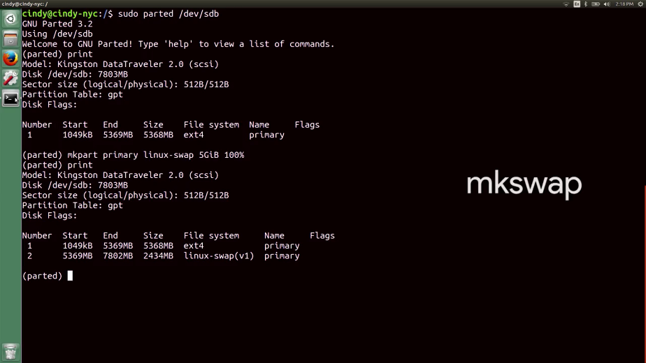

Don't worry. Each of these log files store specific information that we can figure out by their file names. Let's check out some of the common ones you'll look at, /var/log/auth.log, authorization and security-related events are logged here.

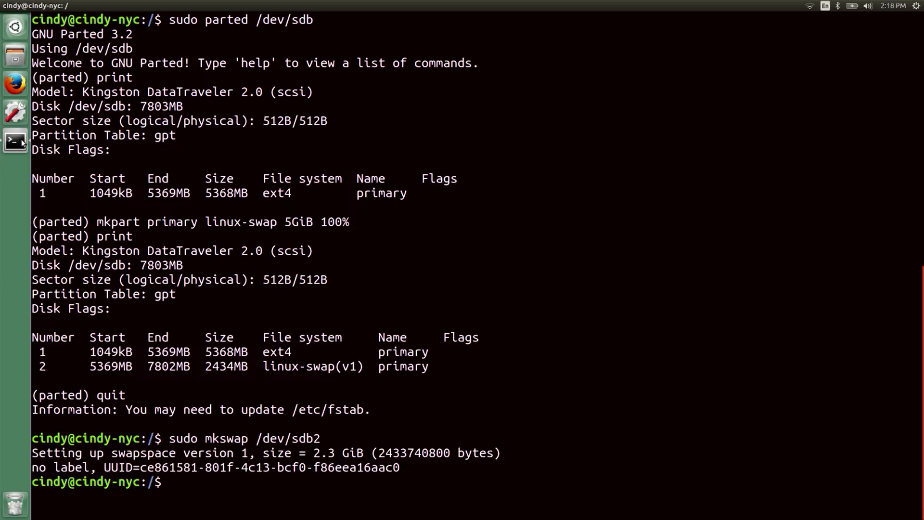

/var/log/kern.log, kernel messages are logged here.

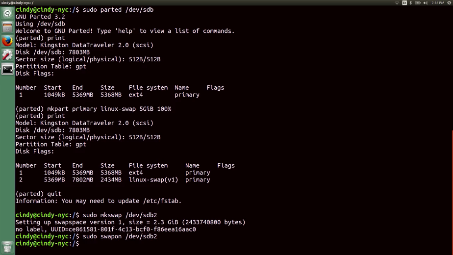

/var/log/dmesg, system startup messages are logged here. If you encounter an issue at, let's say, boot up, this is a good place to check for information.

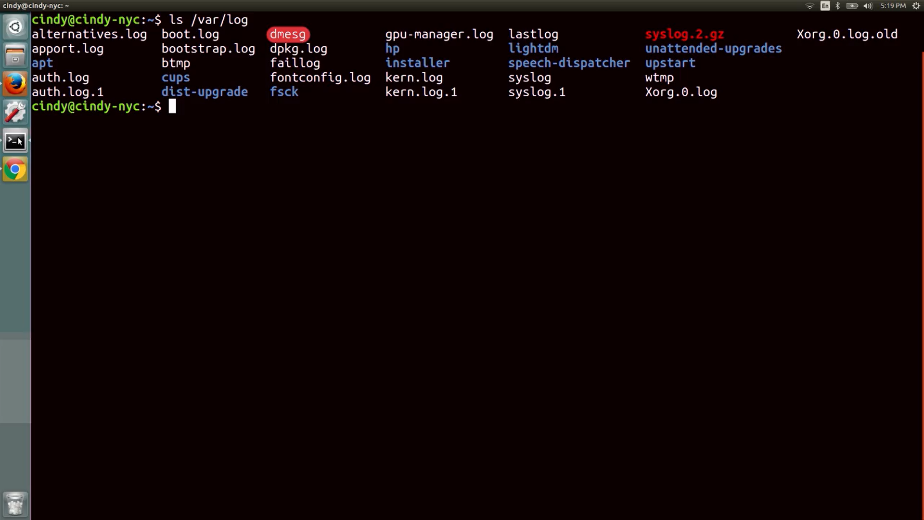

It might get a little tiresome to open up each of these log files to find information about events. Luckily, there are also log files that combine the information of other log files. The downside is that these files are usually very large.

If you have a pretty good idea of where a problem might lie, you might want to opt for the smaller and more specific log file. The one log file that logs pretty much everything on your system is a /var/log/syslog file. The only thing that sys log doesn't log by default are off events.

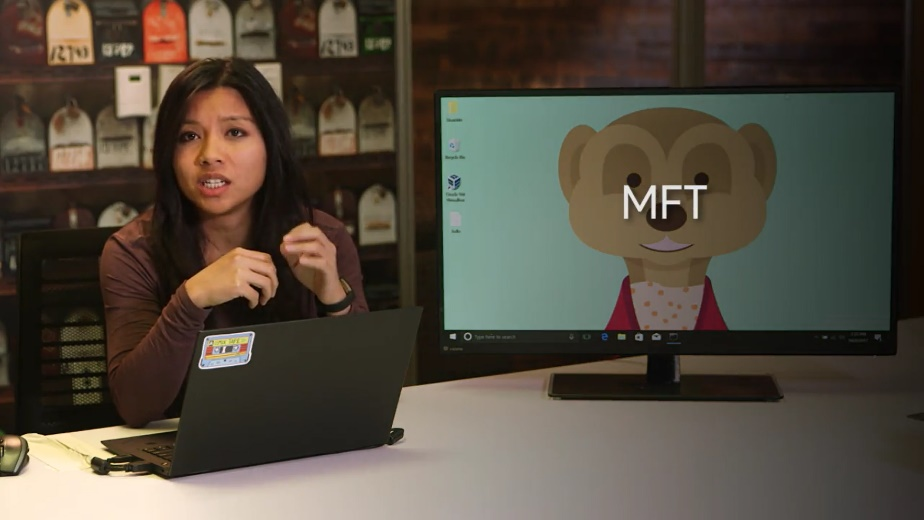

When troubleshooting issues with user machines, /var/log/syslog will usually contain the most comprehensive information about your system, so that should be your first stop.

Log files output a lot of events. By that logic, they take up a lot of data that has to be stored on our machine somewhere. We generally just want to see the latest events on our system, so we don't need to overload or disk with all this information.

Luckily, our systems also do a good job of cleaning out log files to make room for new ones. They use something called log rotation to do this. In Linux, the utility rotate logs is called log rotate. You might want to investigate an event that happened a month ago, so you can change your log rotation settings to make sure not to delete events that are that old. We won't discuss how to work with log rotation, but you can read more about it in the supplemental reading.

We've talked about logging in the context of a single machine, but if you find yourself managing many systems and want to be able to parse their logs in one central location, you can use something called centralized logging. We won't talk about how to do this, but if you're interested in setting up a centralized server, check out the next supplemental reading.

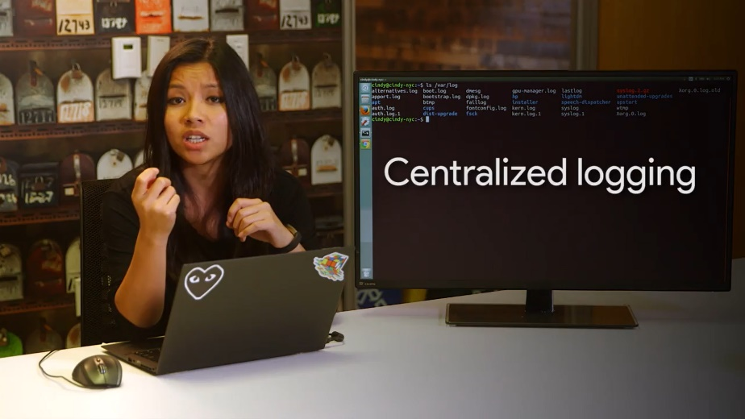

Okay, enough talk about what logs are. Let's actually look at some real ones.

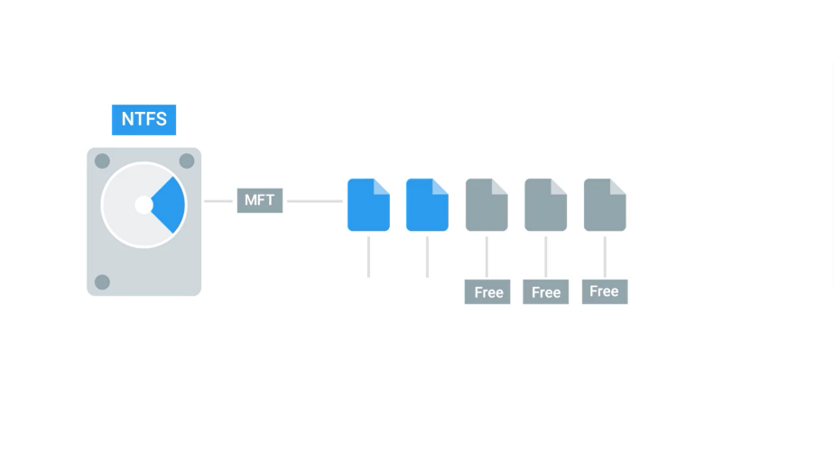

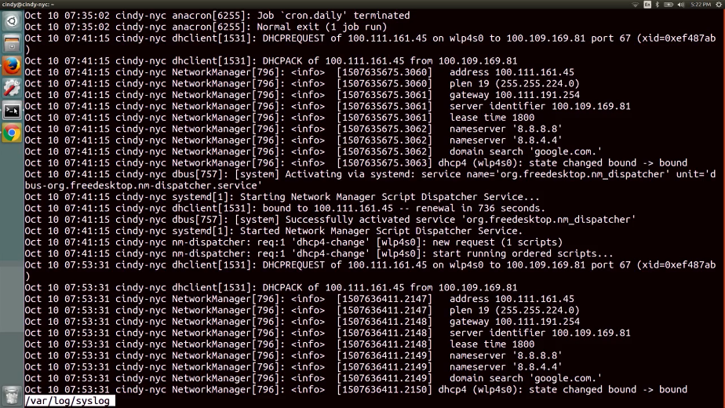

Whoa, this looks super intimidating. But don't worry, we're not going to be reading all of this. In the next lesson, we'll teach you how to troubleshoot using logs. But for now, let's just read one line in sys log and parse what it says. The first field here is the time stamp when the event occurred. Pretty straightforward. But depending on the log, you might see a time format you aren't familiar with like a long string of numbers such as 1501538594.

Time stamps found in a format like this are referred to as Unix or epoch time.

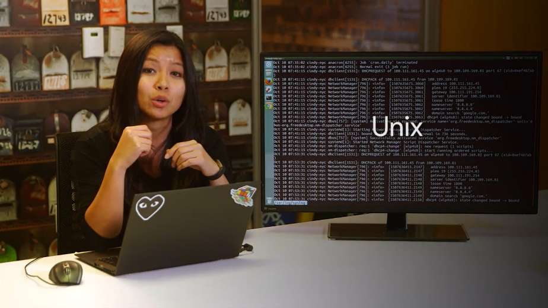

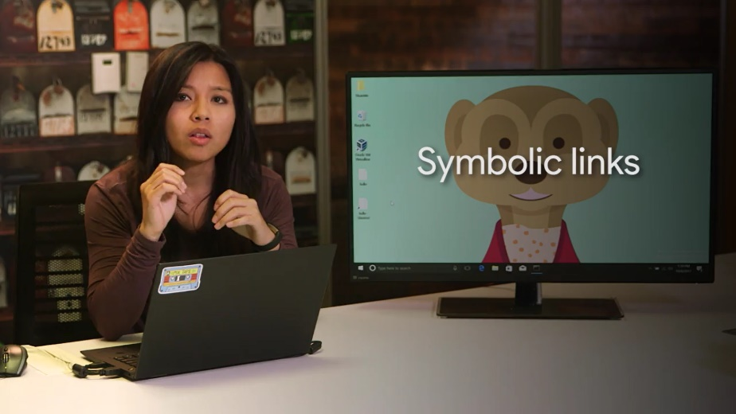

At first, you might be baffled by this. Why would you represent time in this way? And just what exactly is the Unix epoch?

The Unix epoch time is used to represent, then, it's the number of seconds since midnight on January first, 1970, a sort of zero hour for Unix based computers to anchor their concept of time. This means that 1501538594 represents the date, time, Monday, July 31st. 30314 Pacific Standard Time.

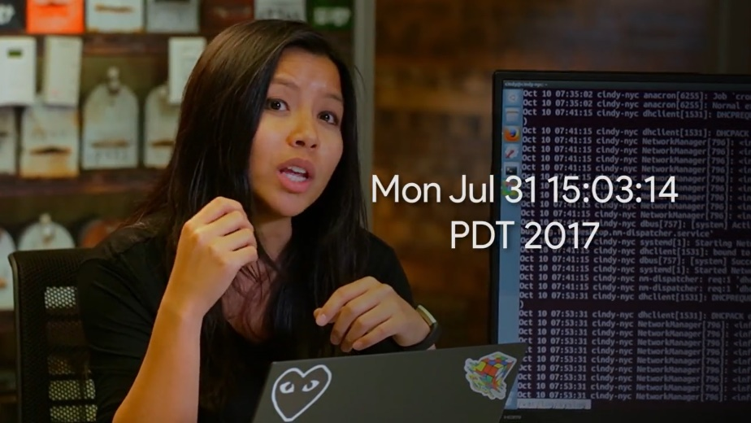

Why midnight on January first, 1970? Is that date the birthday of Unix? Or does it mark some other significant event? The actual answer is much simpler. The original engineers of Unix at Bell Labs just picked it because it was convenient. So, don't be caught off guard if you see a time stamp like this.

The next field is the host name of the machine the event occurred on.

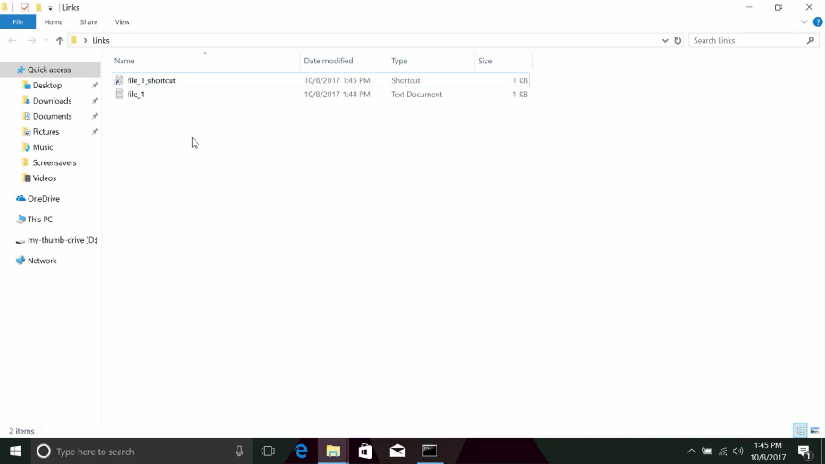

Next up is the service that the log event is referring to.

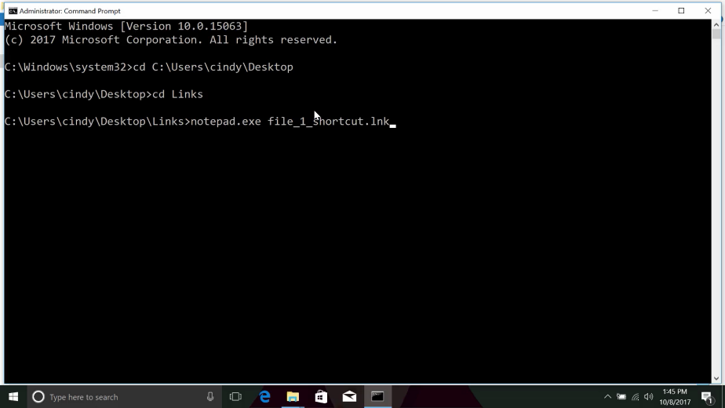

And last is the event that occurred.

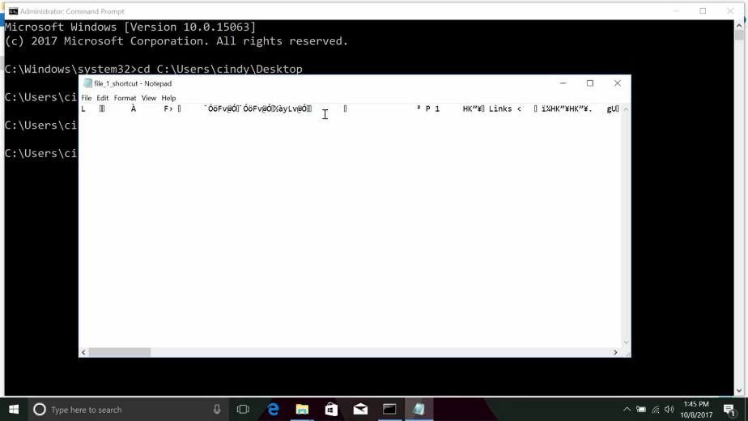

In the next lesson, we'll show you some common troubleshooting tactics when using logs.

### Working with logs

Yes, now you've made it to the really fun stuff. Let's use the information we learned about logs to actually investigate system issues.

Take the scenario, you're working in IT support role and one of your users tells you that they leave their computer on all the time but they recently woke up to find that the computer had shut down. What do you do? Maybe you stay up through the night keeping a close eye on the computer not taking any breaks to use the restroom or even blink. You wait and wait and wait until the computer shuts off, or in a sane and normal world, you decide to just look through the system logs. Let's go with that option. So where do you begin?

At first, logs can be really messy and daunting to look at. We'll talk about the techniques you can use to view logs, but rest assured, you'll never need to read a log line by line. The first thing you want to do when looking at a log is to search for something specific. But what if you're seeing issues within an application and you don't know where to start looking? Well luckily for us, our systems log information in a pretty standard way. If an application is getting a lot of errors, what do you think you can search for? That's right. The word error.

What if you're seeing an issue with a specific application? What else do you think you can search for? If you guess the application name, you're right. You've already been able to filter out your logs to look for specific things that you might be seeing. Let's see this in action.

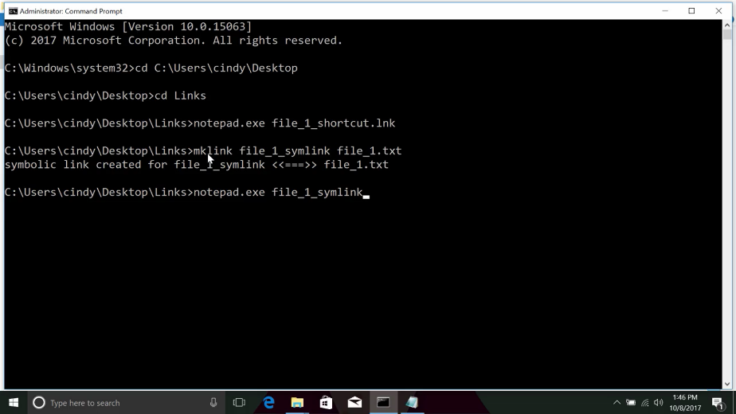

Here, we can see the log results that have the word error in them. If you need to investigate issues that happen around a certain time, you can actually do that by checking the timestamps around that time. You may find the problem that's causing your issue this way or at least get a little closer to figuring out what it is.

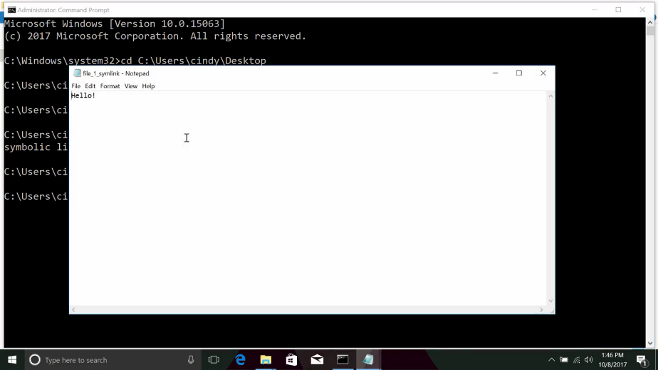

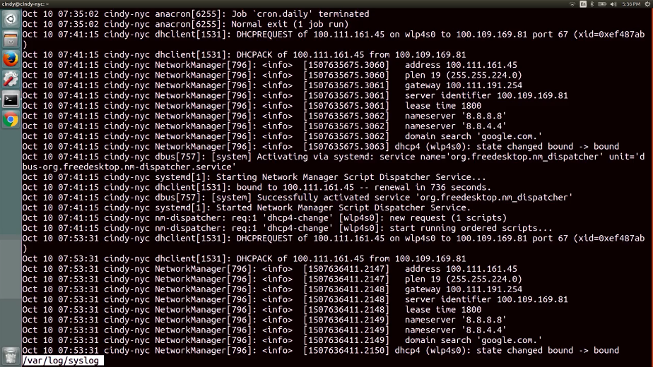

When you finally get to a juicy log portion that might help you uncover problems, you usually want to start looking at the output from either the top or bottom.

Let's say you're seeing lots of errors. Each of these errors could be happening because of a root issue. If you resolve the root issue, you'll fix the cascading errors. Take a look at this. The log is riddled with errors but if we scroll up, we can see the one error that spun up all these others. If we fix that, then the other issues will most likely be fixed.

On the flip side, if you aren't seeing any indicators of a problem in a log, you might want to work from the bottom until you come across a clue. Your system could be functioning normally but when you scroll down to read the output, you see a log entry that may be related to your problem.

Another troubleshooting tactic you can use with logs is to check them in real time. Let's say every time you launch a specific application, it does something abrupt and shuts off. Sure, you can check the logs and post and keep track of your time or you can look at the logs in real time. To do this, we can use one of the commands we learned in a very early lesson, tail.

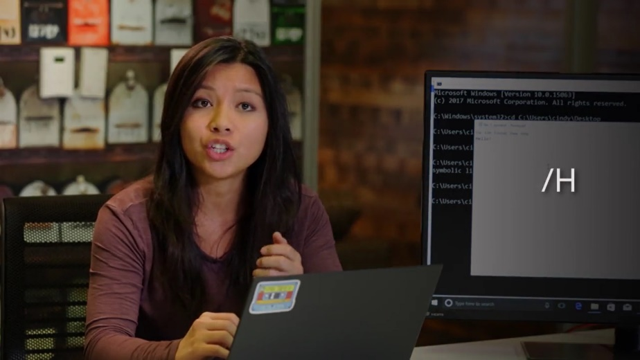

Let's take a look at what this means. We're going to tail -f the syst log file and keep it in an open window.

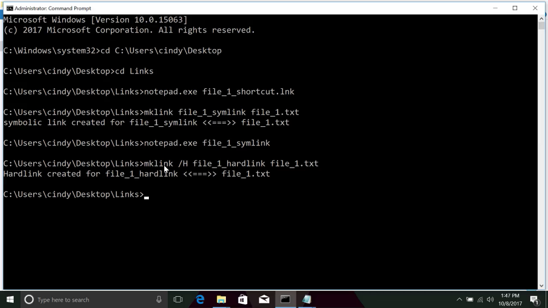

Then we're going to turn off Bluetooth to show you the events it's logging. Now we can see Bluetooth logging data in real time. Look at that, we've come full circle.

I told you those commands would come in handy. Using these simple log tactics will help you throughout your career as an IT support specialist.

You've certainly covered a lot so far. Now, you've picked up how to troubleshoot using logs, too. Logs will be one of your best friends when you're faced with a problem machine that leaves no obvious clues. Talk to the logs and listen to what that sweet, sweet love voice is telling you. You'll discover the problem in no time.

## Operating system deployment

### Imaging software

We learned how to install an operating system for ourselves, but when you work in an IT support role, you have to install operating systems for everyone else. Installing an operating system with a single USB stick like we did in the very early lessons of this program, can get extremely time consuming, especially when you need to do it for lots of machines.

Fortunately, in the IT world we use fantastic tools to make our jobs easier. Remember that imaging a machine, means to format a machine with an image of another machine. This includes everything, from the operating system to the settings.

In this lesson, we are going to briefly touch upon some of the options you can use to image machines, and help deploy operating systems a little easier.

### Operating systems deployment methods

One tool we can use to image computer is a disk cloning tool. It makes a copy of an entire disk and allows you to back up a current machine or set up a new one. There are lots of discloning tools out there to help you complete this task. The benefit of disk cloning over a standalone installation media is that you can also install settings and folders that you might need.

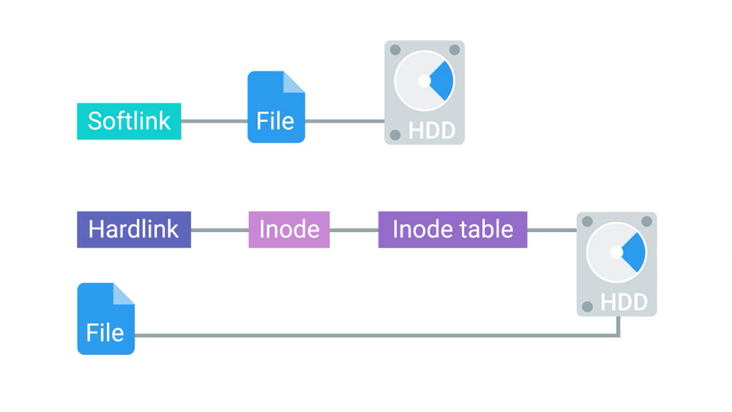

One of the many disk cloning tools out there is the open source software Clonezilla.

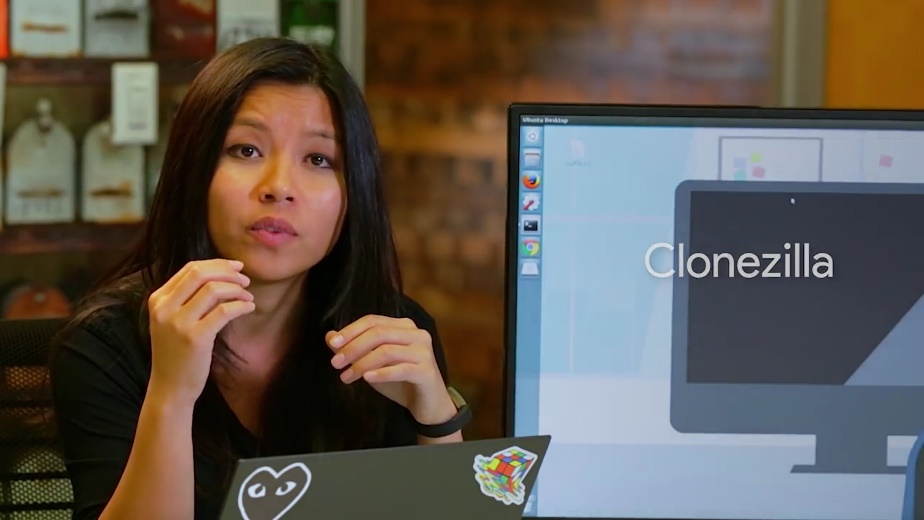

It can be used to backup and restore a single machine or many machines simultaneously.

A popular commercial imaging tool is Symantec Ghost. To read more about other disk cloning software, check out the supplemental reading right after this video.

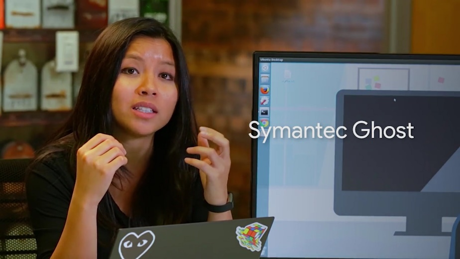

With disk imaging lots of tools offer different ways you can clone a disk. One option is disk-to-disk cloning where you connect an external hard drive to the machine you want to clone.

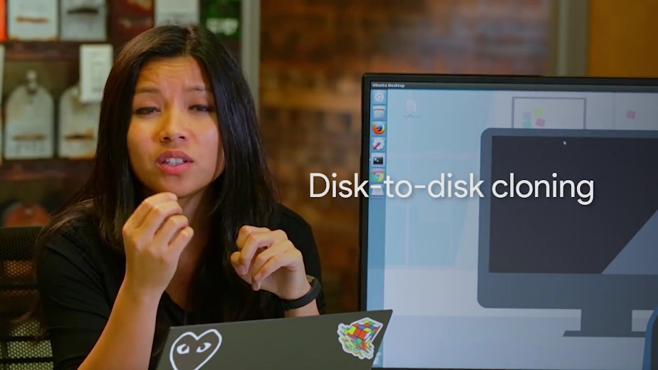

You can connect a hard drive like your HDDs and SSDs into something known as an external hard drive dock. These devices are great IT tools that kind of look like toasters. Once you connect your external hard drive, you can use any disk cloning tool of your choice. We're going to show you a really quick example of how disk cloning works.

Let's use the Linux command line tool dd to copy files. Dd is a lightweight tool that's also used to clone a drive. Again, you can use any tools you want to clone your disks, but right now we're just going to use dd.

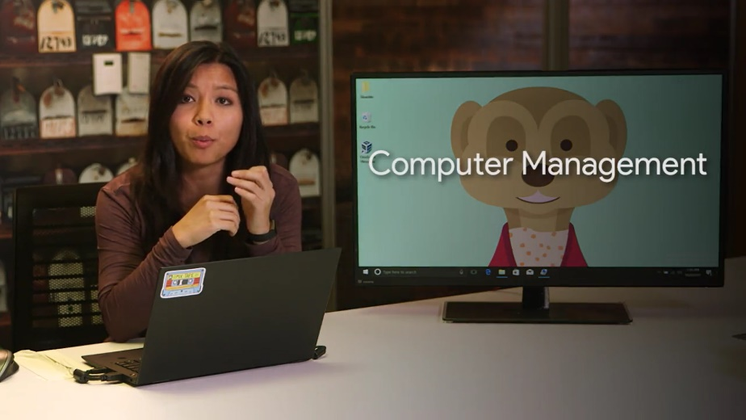

Let's make a copy of the USB drive I have connected in my laptop then save it as an image file. First, we want to make sure we have this drive unmounted.

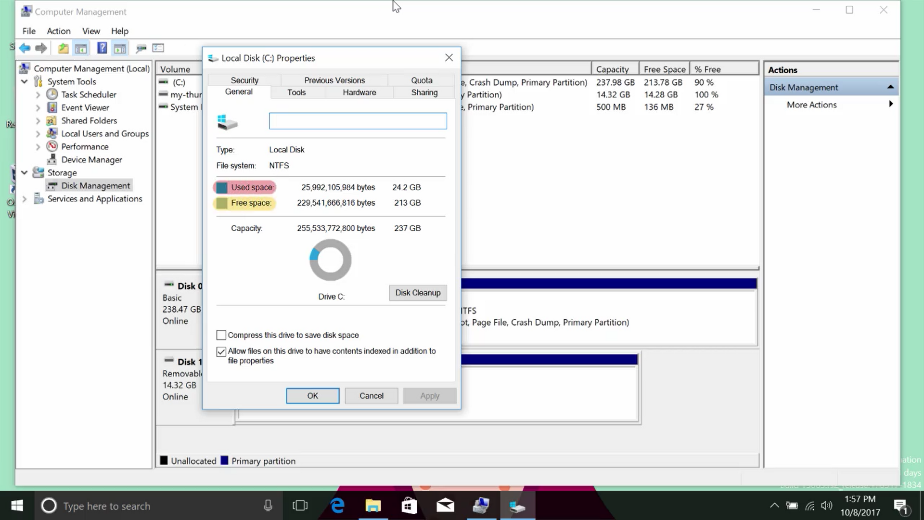

Then, we want to run dd.

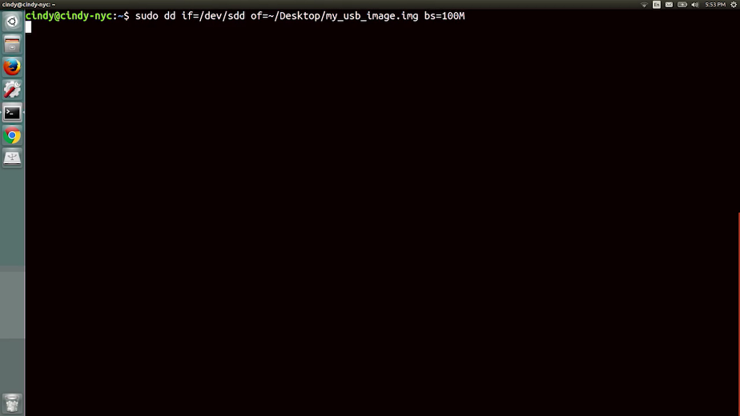

You don't have to know how dd works to use this command. Actually, you should check out the final supplemental reading to learn more about this tool. This just says, I'm going to copy the contents of /dev/SDD which is the USB drive and save it to the desktop in an image file. Once the image file is saved, if we open it up we should see the exact same contents as the USB drive. You can use dd for larger disks like hard drives and it'll function the same way. Pretty cool, right?

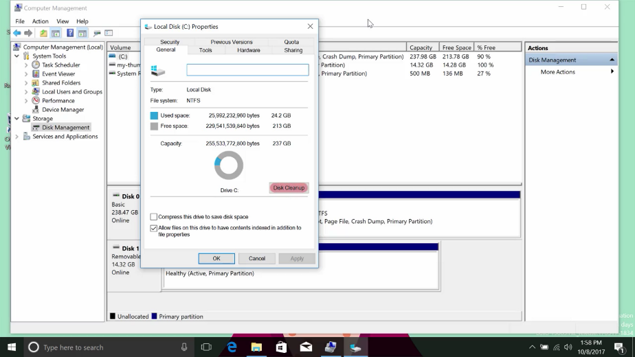

Another method you can use to image a machine is to request the images directly from the network. Lots of operating system manufacturers today offer network initiated deployments. This means no more messy standalone installation media. Instead, you can just download and install an operating system through the network.

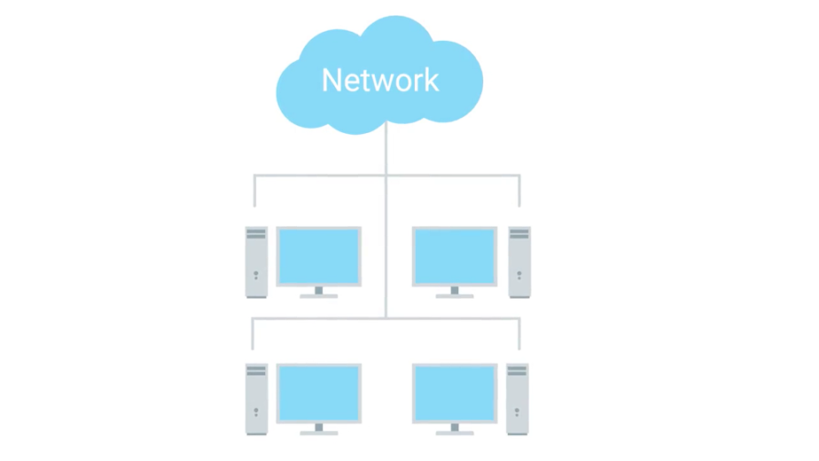

If you want to use your own images and not the built in network boot options for your computers, there are other options for that too. We don't discuss the specifics of them here but they require a bit of automation to get going. It doesn't matter if it's a laptop, desktop, Windows OS, Linux OS etc.

If you're managing the operating system deployment for a company, you want to keep some aspects of hardware standardization in mind. Imagine if your company has a different laptop with different drivers that needed to be installed. This can get tedious to maintain. It's usually a good idea to try and standardize what type of hardware you use in a company to make your job of deploying operating systems a little easier.

Okay, you're so close to finishing this course. We've got a final pair of assessments for you where you'll use logs to help you track down some issues.

## Course wrap up

### Course wrap up

Wow, amazing work, you've covered a ton of information in this course. You learned how to navigate the Windows and Linux OSs, how the intricate components of an OS work, and how to troubleshoot common issues found within them. You also learned how to manage software from basic device drivers to applications, setup discs and partitions, format a file system, read logs and traverse them. Finally, you've picked up some skills on how to make your job easier using remote connections and operating system imaging.

You've accomplished a lot and you should be incredibly proud. The skills you've learned in this course will follow you throughout your IT career. After all, the OS is the component that you deal with the most. In the next course we are going to kick it up a notch and show you how to work with operating systems at a larger scale. You're going to use the skills you learned in this course that helped you manage one machine to jump start your learning for the next course. That's where we'll teach you how to manage a whole fleet of machines.

So it's time for me to say so long. It's been a blast being your guide to operating systems and sharing my passions for OSs with you. Your next course, System and Administration and IT Infrastructure Services, is being taught by my friend and colleague of mine, Devon Shree-Theron. Tell him I said hi.

### Heather early career advice

A four year degree prepares you in a certain set of ways. But experience on the job and the right kind of mentors will actually propel you much further than university degrees. While I went to college I do not have a degree.

Education learning is about a student and a teacher. If you don't have a four-year degree that's fine, but make sure that you have a mentor. And engage yourself in educating yourself. It doesn't have to necessarily be an university. IT and IT support is not going anywhere anytime soon. So, when it is a stable job, it is a very intellectually fascinating job, and it's also very flexible. You can go in lots of different places with it. So, it's really a field where you can understand the fundamentals of how everything works, and use it as a jumping point into anything else that you might be interested in.

The advice I give people just coming into their career no matter what career they're going to, is do what you love and love what you do. Find that topic, that piece of technology, that thing that you first think about when you wake up in the morning because you will want to spend every waking hour thinking about it, working on it, improving your skill set and making the world a better place because of that thing. For me that was security. I think about it when I wake up in the morning, I think about it before I go to sleep, it is my very identity. Everybody has something like that in mind, you just have to find out what that is.

### Congratulations

Congratulations. You've done a lot of work. It's an amazing accomplishment and you should be really proud of yourself.
