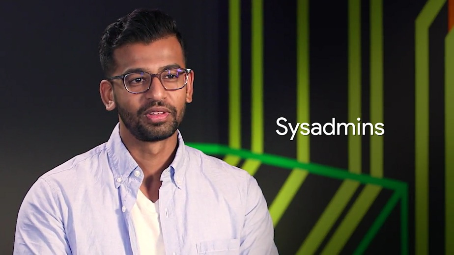
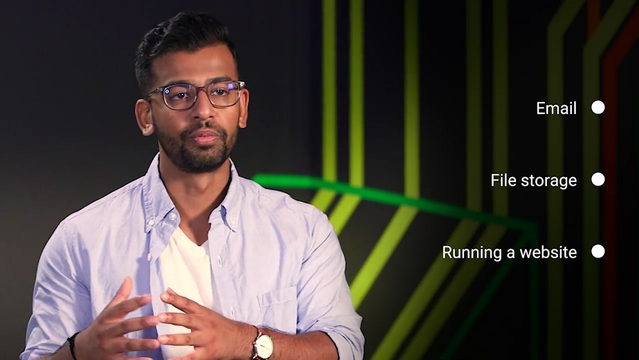
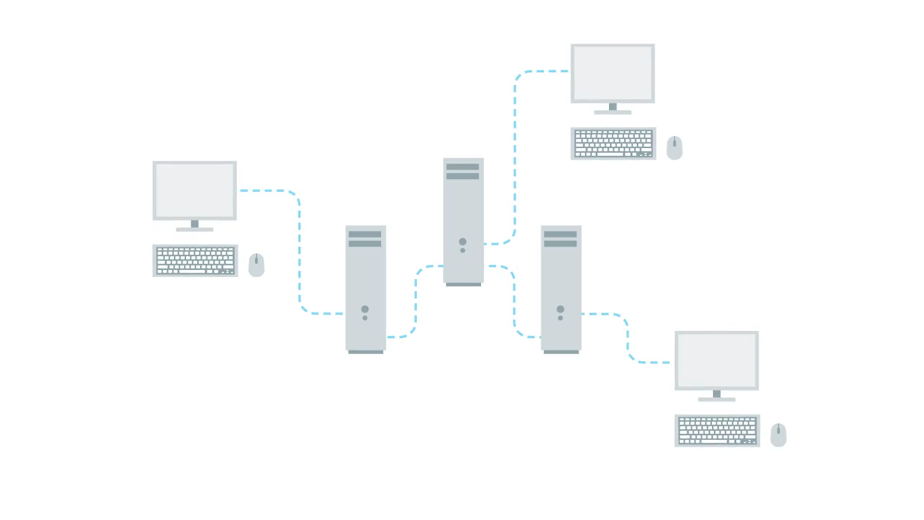
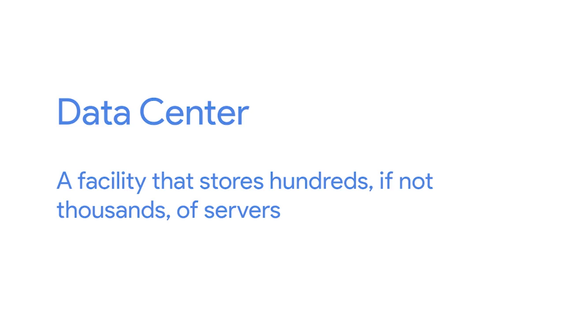
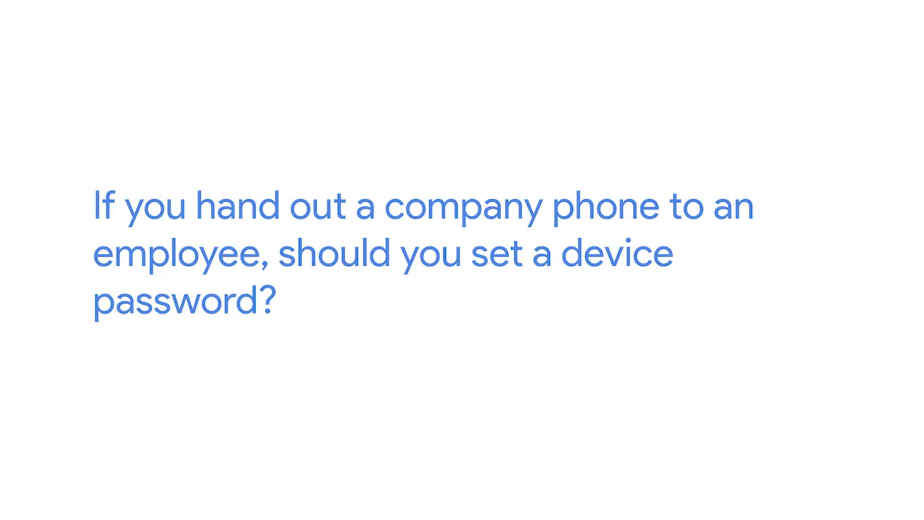
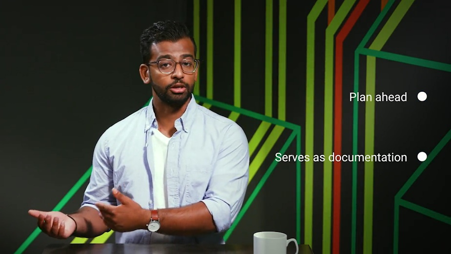
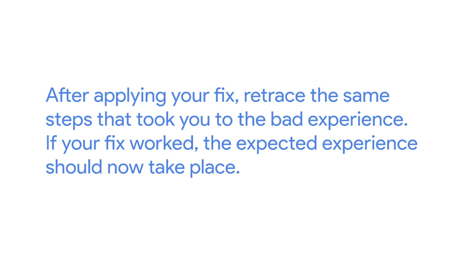

# Table des matières

[1 Introduction to system administration and IT infrastructure services [2](#introduction-to-system-administration-and-it-infrastructure-services)](#introduction-to-system-administration-and-it-infrastructure-services)

[1.1 Course introduction [2](#course-introduction)](#course-introduction)

[1.2 What is system administration [3](#what-is-system-administration)](#what-is-system-administration)

[1.2.1 What is system administration [3](#what-is-system-administration-1)](#what-is-system-administration-1)

[1.2.2 Servers revisited [5](#servers-revisited)](#servers-revisited)

[1.2.3 The cloud [9](#the-cloud)](#the-cloud)

[1.3 System administration tasks [12](#system-administration-tasks)](#system-administration-tasks)

[1.3.1 Organizational policies [12](#organizational-policies)](#organizational-policies)

[1.3.2 IT infrastructure services [14](#it-infrastructure-services)](#it-infrastructure-services)

[1.3.3 User and hardware provisioning [14](#user-and-hardware-provisioning)](#user-and-hardware-provisioning)

[1.3.4 Routine maintenance [16](#routine-maintenance)](#routine-maintenance)

[1.3.5 Vendors [17](#vendors)](#vendors)

[1.3.6 Troubleshooting and managing issues [18](#troubleshooting-and-managing-issues)](#troubleshooting-and-managing-issues)

[1.3.7 In case of fire break glass [20](#in-case-of-fire-break-glass)](#in-case-of-fire-break-glass)

[1.3.8 Dion Michelle Obama story [20](#dion-michelle-obama-story)](#dion-michelle-obama-story)

[1.4 Applying changes [20](#applying-changes)](#applying-changes)

[1.4.1 With great powers comes great responsibilities [20](#with-great-powers-comes-great-responsibilities)](#with-great-powers-comes-great-responsibilities)

[1.4.2 Never test in production [24](#never-test-in-production)](#never-test-in-production)

[1.4.3 Assessing risk [26](#assessing-risk)](#assessing-risk)

[1.4.4 Fixing things the right way [27](#fixing-things-the-right-way)](#fixing-things-the-right-way)

# Introduction to system administration and IT infrastructure services

## Course introduction

Before we get started, I want to congratulate you on making it to this point in the program. Let's take a moment to think about all the skills you've learned in your journey so far. You've learned the fundamentals of information technology from how binary works, to the importance of user support in IT, to even building your own computer. You've learned the fundamentals of computer networking, and how the internet really works and finally, you've learned how to navigate the Windows and Linux Operating Systems, managing processes and software, in the command line like a true power user. Great work so far.

Before we dive deep into systems administrations and infrastructure, I take this opportunity to introduce myself, or re-introduce myself. For those who might remember me from way back in course one, my name is Devan Sri-Tharan. I've been working on IT for 10 years. I'm the corporate operations engineer at Google, where I get to tackle challenging, and complex IT issues.

Thinking back, my first experience with tech began when I was about nine years old, when my dad brought home the family's first computer. I remember my dad holding a floppy disk and telling me that there was a game on it. To my dad's amazement. I somehow managed to copy the game from the disk, onto the computer's hard drive. While it may seem like a trivial task now, this device was just so new to us back then. Sure. I loved the different games I could play but, what I really loved was tinkering with the machine, trying to get it to do what I wanted it to do. While that floppy disk and computer might have ignited my passion for technology, it was actually my first few job experiences, that really started to shape my IT career. One job was in retail selling baby furniture, and the other was at a postal store, where I helped customers ship their package and became the one person IT crew. It might sound odd that working in retail inspired my career, but I realized that I really enjoyed communicating with customers trying to understand their needs, and offering a solution. My first experience working directly in IT was in college as an IT support specialist intern.

From there, I worked as an IT consultant to decommission an entire environment. This was my first experience working directly with a large IT infrastructure, and pushing myself outside my comfort level as a college student. I bring these first few jobs for a reason. These experiences helped shape my career and IT. I knew at that time that I wanted to go into tech, but I struggled with where I wanted to focus my career. Starting at Google as an IT Generalist, allowed me to experience many different areas of technology. It allowed me to figure out that the jobs I didn't want to do, and before I was able to identify exactly what I did want to do. I'm really passionate about IT infrastructure. This program is designed to help prepare you for roles in tech support, desktop support, or other help desk, but it doesn't stop there. In this course, we're going to open up an even wider net of possibilities and IT by teaching you the skills you need, to manage computers for a whole organization. If you're working in a small organization, you might need to do this from day one. If not, stretching your skill set will make you stand out in the field, and prepare you for potentially taking on this work further on in your career. In this course, we're going to build upon what you learn in the operating systems course, by teaching you system administration skills. At a high level, system administration is the field in IT that is responsible for maintaining reliable computer systems, in a Multi-user environment. While systems administration responsibilities can overlap with other roles in IT, a person who works only in system in ministration is a systems Administrator. Systems administrators have a diverse set of roles, and responsibilities. They can range from configuring servers, monitoring the network, provisioning, or setting up new users in computers and more. Think of system administrator as a tech Generalist. They handle many different things, to keep an organization up and running. It's actually very similar to how IT support specialists work. You need to apply a diverse set of tech skills in different situations, to help solve problems in an organization. As an IT support specialist, doing systems administration tasks might be part of the job. So, we're going to introduce the skills, and knowledge you need to manage organizations and systems, to keep your skills well-rounded. By the end of this course, you'll learn what services are used in infrastructure. You'll also learn about the essential use of software for your organization, and how to manage entire organization's users and computers, using directory services. Finally, you'll learn the skills you need to backup your organization's data, and recover in the case of a disaster. All right. It's time to get started. So, let's dive in.

## What is system administration

### What is system administration

Before we can get into the nitty gritty of what systems administration is, we need to talk about what these systems are. All musicians don't just run on their own, employees need computers along with access to the Internet to reach out to clients. The organization websites needs to be up and running. Firewall have to be shared back and forth and so much more. All of these requirements make up the IT infrastructure of an organization.

IT infrastructure encompasses the software, the hardware, network, and services required for an organization to operate in an enterprise IT environment.

Without an IT infrastructure, employees wouldn't be able to do their jobs and the whole company will crumble before it even get started. So organizations employ the help of someone like a systems administrator to manage the company's IT infrastructure.

System administrators or as we like to call them sysadmins, are the unsung heroes in organization.

They work in the background to make sure a company's IT infrastructure is always working, constantly fighting to prevent IT disasters from happening. Notice all of the really hard work that sysadmins put in. So show a little appreciation for your sysadmin by celebrating System Administrator Appreciation Day worldwide. Yes that's a real thing. In all seriousness, sysadmins have a lot of different responsibilities. Any company that has an IT presence needs a sysadmin or someone who handles those responsibilities.

The role of a sysadmin can vary depending on the size of an organization. As an organization gets bigger, you need teams of sysadmins. Their responsibilities may be separated out into different roles with job titles like network administrators and database administrators.

Companies like Facebook and Apple, don't have a single person running the IT show. But in smaller companies, it's usually a single person who manages the entire company's IT infrastructure. In this course, we'll focus on how just one person you, can single handedly manage an IT infrastructure.

You learn the skills you need to manage an organization of less than 100 people as a sole IT person. As you start to scale up to large organizations, you also need to level up your knowledge of systems administration. You need to pick up skills that allow you to automate workflows and manage configurations or computer settings automatically. Right now, let's focus on systems administration in a small organization.

In the next couple of lessons, we're going to talk in detail about the responsibilities of sysadmin and how that relates to the role of IT support specialist who handle system administration.

### Servers revisited

Basically, a sysadmin is responsible for their company's I.T. services.

Employees need these I.T. services so that they can be productive. This includes things like email, file storage, running a website and more.

The services have to be stored somewhere, they don't just appear out of nowhere. Any thoughts on where they're stored? If you answered servers, you're correct. We talked about servers in an earlier course and you've learned that the term servers can have multiple meanings.

In one course we discussed how servers have web content that they serve to other computers. In another course, we talked about how servers can be software that perform a certain function. In this video, we're going to talk about servers more in-depth because, in many cases sysadmins are responsible for maintaining all of the company's servers.

If you're working as an I.T. support specialist and have systems administration responsibilities, these tasks could be something you'll perform.

A server is essentially software or a machine that provides services to other software or machines.

For example, a web server stores and serves content to clients through the Internet. You can access the web server through a domain name like google.com. We'll dive deeper into web servers in a later course. Right now, let's run down some other examples of servers.

An email server, provides email service to other machines. And an SSH server provides SSH services to other machines and so on and so forth.

We call them machines that use the services provided by a server, clients.

Clients request the services from a server and in turn, the servers respond with the services. A server can provide services to multiple clients at once and the client can use multiple servers.

Any computer can be a server. I can start up a web server on my own home computer that would be able to serve my own personal website on the internet for me. But, I don't really want to do that because I have to leave my computer on all the time in order for my website to be available all the time.

Industry Standard Servers are typically running 24 seven and they don't run dinky little hardware like my home laptop. They run on a really powerful and reliable hardware. Server hardware can come in lots of different forms. They can be towers that sit upright, they look very similar to the desktops we've seen. Those towers can be put in a closet or can sit on the table if you want them to. But, what if you needed to have 10 servers? The towers would start taking up way too much space. Instead, you can use rack servers which lay flat and are usually mounted in a 90 inch wide server rack. If you needed even more space, you could use blade servers that are even slimmer than racks.

There are other types of form factors for servers but these are the most common ones. You can also customize the hardware on your servers depending on the services. For example, on a file server you'll want more storage resources so that you can store more files. What about connecting to our servers? Working in a small IT organization, you could potentially deal with a handful of servers. You don't want to have a monitor, keyboard and a mouse for each of these servers, do you?

Fortunately, you don't have to thanks to something we learned in an earlier course. We can remotely connect to them with something like SSH. Even so, you should always have a monitor keyboard on hand.

Sometimes when you're working your network might be having issues and SSH won't be an option. A common industry practice is to use something known as a KVM Switch. KVM stands for keyboard, video and mouse. A KVM Switch looks like a hub that you can connect multiple computers to and control them using one keyboard, mouse and monitor. You can read more about using KVMs in the next supplemental reading.

Now though we've got a better understanding of servers and what they do, you can go out and start buying server hardware and setting up services for your organization. Or maybe not. You don't actually have to buy your own server hardware or even maintain your own services.

In the next video, were going to learn about a wave of computing that started to overtake the IT world, cloud computing. See you there.

### The cloud

Oh, the Cloud, the magical wonderful Cloud that you hear about in the news that moves data across the white fluffy windows in the sky. The magical Cloud dispersed bits of data across the world in itty bitty raindrops, right? No, that's not how the Cloud works at all, but you'd be surprised how many people believed that.

There's no doubt you've heard the term Cloud in the news or from other people. Your photos are stored in the Cloud, your email is stored in the Cloud. Cloud computing is the concept that you can access your data, use applications, store files, et cetera, from anywhere in the world as long as you have an internet connection.

But the Cloud isn't a magical thing. It's just a network of servers that store and process our data. You might have heard the word data center before. A data center is a facility that stores hundreds, if not thousands of servers.

Companies with large amounts of data have to keep their information stored in places like data centers. Large companies like Google and Facebook usually own their own data centers because they have billions of users that need access to their data at all times. Smaller companies could do this, but usually rent out part of a data center for their needs. When you use the Cloud service, this data is typically stored in the data center or multiple data centers, anywhere that's large enough to hold the information of millions, maybe even billions of users. It's easy to see why the Cloud has become a popular way of computing in the last few years.

Now instead of holding onto terabytes of storage space on your laptop, you can upload that data to a file storage service like Dropbox, which stores that data in a managed location like a data center.

The same goes for your organization. Instead of managing your own servers, you can use internet services that handle everything for you including security updates, server hardware, routine software updates, and more.

But with each of these options come a few drawbacks. The first is cost. When you buy a server, you pay upfront for the hardware. That way, you can set up your services like a file storage at potentially very little cost because you're the one managing it.

When you use Internet services like Dropbox, that offer file storage online, the starting cost may be smaller. But in the long term, costs could add up since you're paying a fixed amount every month. When comparing the cost of services, always keep in mind what a subscription could cost you for every user in your organization. Weigh that against maintaining your own hardware in the long term and then make a decision that works best for your organization.

The second drawback is dependency. Your data is beholden to these platforms. If there's an issue with the service, someone other than you is responsible for getting it up and running again. That could cost your company precious loss of productivity and data.

No matter what method you choose, remember that you're still responsible for the problems that arise when there's an issue. If Dropbox is having an issue with your important user data, it's still your problem and you have to get it working again no matter what.

To prevent a situation like that from popping up, you might consider backing up some critical data in the Cloud and on a physical disk. That way, if one system goes down, you have another way to solve the problem. Whether you choose to maintain physical service or use Cloud services, these are the type of things you need to think about when providing services to your company.

In the next couple of lessons, we're going to talk about some of the other responsibilities of the system admin. We'll give you a high level overview of these, then dive even deeper later in this course.

## System administration tasks

### Organizational policies

In a small company, it's usually a sys admin's responsibility to decide what computer policies to use. In larger companies with hundreds of employees or more, this responsibility usually falls under the chief security officer. But in smaller businesses or shops, as the IT lingo goes, the sys admin has to think carefully about computer security and whether or not to allow access to certain users. There are few common policy questions that come up in most IT settings that you should know.

Should users be allowed to install software? Probably not. You could run the risk of having a user or accidentally install malicious software, which we'll learn about in the upcoming course in security.

Should users have complex passwords with certain requirements? It's definitely a good rule of thumb to create a complex password that has symbols, random numbers, and letters. A good guideline for a password blend is to make sure it has a minimum of 8 characters, that make it more difficult for someone to crack.

Should you be able to view non-work related websites like Facebook? That's a personal call. Some organisations prefer that their employees only use their work computer and network strictly for business, but many allow other uses, so their employee can promote their business or goods on social media platforms, stay up to date on current events, and so on. It will definitely be a policy that you and your organization's leaders can work out together.

If you hand out a company phone to an employee, should you set a device password? Absolutely. People lose their mobile devices all the time. If a device is lost or stolen, it should be password protected, at the very least, so that someone else can't easily view company emails.

We'll dive way deeper into the broader impact and implications of security and organizational policies in the security course that's last up in this program. These are just a few of the policy questions that can come up. Whenever policies are decided upon, have to be documented somewhere.

As you know from a lesson in documentation in the first course, it's supercritical to maintain good documentation. If you're managing systems, you'll be responsible for documenting your company's policies, routine procedures, and more. You can store this documentation on internal wiki site, file server, software, wherever. The takeaway here is that having documentation of policies already available to your employees will help them learn and maintain those policies.

### IT infrastructure services

We've talked a little bit about the services that are potentially used in an organization like file storage, email, web content, et cetera. But there are many other infrastructure services that you need to be aware of. As an IT support specialist doing system administration, you'd be responsible for the IT infrastructure services in your organization. Spoiler alert, there are a lot of them ahead. As always, make sure to rewatch any lessons if you need some more time for the material to sink in.

Rome wasn't built in a day, you know, and neither are IT support specialists. So, how about getting network access? That's a service that needs to be managed. What about secure connection to websites and other computers? You guessed it, that's also a service that has to be managed. And managing services doesn't just mean setting them up. They have to be updated routinely, patched for security holes, and compatible with the computer within your organization.

Later in this course, we'll dive deeper into the essential infrastructure services that you might see in an IT support specialist role.

### User and hardware provisioning

In other responsibilities sys admins have is managing users and hardware. sys admins have to be able to create new users and give them access to their company's resources. On the flipside of that, they also have to remove users from an IT infrastructure if users leave the company. It's not just user accounts they have to worry about, sys admins are also responsible for user machines. They have to make sure a user is able to log in and that the computer has the necessary software that a user needs to be productive. Sys admins also have to ensure that the hardware they are provisioning or setting up for users is standardized in some way.

We talked in an earlier course about imaging a machine with the same image. This practice is industry standard with dealing with multiple user environments. Not only do sys admins have to standardize settings on a machine, they have to figure out the hardware lifecycle of a machine.

They often think of the hardware lifecycle of a machine in the literal way. When was it built? When was it first used? Did the organization buy it brand new or was it used? Who maintained it before? How many users have used it in the current organization? What happens to this machine if someone needs a new one? These are all good questions to ask when thinking about an organization's technology. sys admins don't want to keep a ten year old computer in their organization. Or maybe they do. Even that's something they might have to make a decision on.

There are four main stages of the hardware lifecycle. Procurement. This is the stage where hardware is purchased or re-used for any employee. Deployment. This is where hardware is set up so that the employee can do their job. Maintenance. This is the stage where software is updated and hardware issues are fixed if and when they occur. Retirement. In this final stage, hardware becomes unusable or no longer needed and it needs to be properly removed from the fleet.

In a small position, a typical hardware lifecycle might go something like this. First, a new employee is hired by the company, human resources tells you to provision a computer for them and set up their user account. Next, you allocate a computer you have from your inventory or you order a new one if you need it. When you allocate hardware you may need to tag the machine with a sticker so they can keep track of which inventory belongs to the organization.

Next, you image the computer with the base image for further using a streamlined method that we discussed in our last course, operating systems and you. Next, you name the computer with a standardized host name. This helps with managing machines. More on that when we talk about directory services later. In regards to the name itself, we talked about using a format such as username-location, but other host name starters can be used. Check out the supplemental reading to find out more.

After that, you install software the user needs on their machine. Then the new employee starts and you streamline the setup process for them by providing instructions on how to log into their new machine, get email etc. Eventually, if a computer sees a hardware issue, a failure, you look into it and think through the next steps. If it's getting too old, you'll have to figure out where to recycle it and where to get new hardware.

Finally, if a user leaves the company you'll also have to remove their access from IT resources and wipe the machine so that you can eventually re-allocate it to someone else. Imaging. Installing software and configuring settings on a new computer can get a little time consuming. In a small company you don't do it often enough where it makes much of a difference, but in a larger company a time consuming process just won't cut it. You'll have to learn automated ways to provision new machines so that you only spend minutes on this and not hours.

### Routine maintenance

When you manage machines for a company, you don't just set it and forget it, you have to constantly provide updates and maintenance so that they run the latest secure software. When you have to do this for a fleet of machines, you don't want to immediately install updates as soon as they come in. That would be way too time-consuming. Instead, to effectively update and manage hardware, you do something called batch update.

This means that once every month or so, you update all your servers with the latest security patches. You have to find time to take their services offline, perform the update, and verify that the new update works with the service. You also don't have to perform an update every single time a new software becomes available.

But, it's common practice to do batch updates for security updates and very critical system updates. And the security costs, we dive deeper into security practices, but a good guideline is to keep your system secure by installing the latest security patches routinely. Staying on top of your security is always a good idea.

### Vendors

Not only do sys admins in a small company work with using computers, they also have to deal with printers and phones, too. Whether your employees have cellphones or desk phones, their phone lines have to be set up. Printers are still used in companies, which means they have to be set up so employees can use them. Sys admins might be responsible for making sure printers are working or if renting a commercial printer, they have to make sure that someone can be on site to fix it. What if a company's fax machine isn't working?

If you don't know what a fax machine is, that's not totally surprising. They've been slowly dying since the invention of email. Fax machines are still alive and kicking at companies, and they're a big pain to deal with. Sys admins could be responsible for those, too. Video-audio conferencing machines, yep, they probably need to handle those, too.

In an enterprise setting, sys admins have to procure this hardware one way or another. Working with vendors or other businesses to buy hardware is a common practice. Setting up businesses accounts with vendors like Hewlett Packard, Dell, Apple, etc., is usually beneficial since these companies can offer discounts to businesses. These are things that sys admins have to think about. It's typically not scalable just to go out and purchase devices on Amazon. Although if that's what's decided, they could do that too. Sys admins must be sure to weigh their option before purchasing anything. They need to think about hardware supply. So if a certain laptop model isn't used anymore, they need to think of a suitable backup that works with their organization. Price is also something to keep in mind. They'll probably need formal approval from their manager or another leader to establish this relationship with a vendor. It's not just technical implementations of hardware that sys admins have to consider. It's so many things.

### Troubleshooting and managing issues

We talked about troubleshooting alert. In an earlier course, but it's worth mentioning again, when you're managing an entire IT infrastructure, you'll constantly have to troubleshoot problems and find solutions for your IT needs. This will probably take up most of your time as an IT support specialist. This could involve a single client machine from an employee or server or service that isn't behaving normally. Some folks, who start their careers in IT support deepen their knowledge to become system administrators. They go from working on one machine to multiple machines.

For me, I made the leap during my internship as an IT support specialist in college at a semiconductor lab. The lab ended up closing and they needed help deprecating the environment. So, what started as an IT help desk support quickly transition to assist admin role. That opportunity was my golden ticket to dowland to Active Directory, Sub netting and decision making which is a core part of this job.

Sys admins also have to troubleshoot and prioritize issues at a larger scale. If a server that sys admin manage stop providing services to a thousand users and one person had an issue about the printer, which do you think would have to be worked on first. Whatever the scenario, there are two skills that are critical to arriving at a good solution for your users. We already covered them in an earlier course.

Do you know what they are? The first is troubleshooting, asking questions, isolating the problem, following the cookie crumbs, and reading logs are the best ways to figure out the issue. You might have to read logs from multiple machines or even the entire network.

We talked about centralized logging a little bit in the last course on operating systems and you becoming a power user. If you need a refresher to how centralized logging works, check out the supplemental reading.

Anyway, the second super important skill that we covered is customer service; showing empathy, using the right tone of voice and dealing well with difficult situations. These skills are essential to all IT roles.

In some companies, sysadmins have to be available around the clock. If a server or network goes down in the middle of the night, someone has to be available to get it working again. Don't worry, a sysadmin doesn't have to be awake and available 24/7. They can monitor their service and have it alert them in case of a problem.

So how do you keep track of your troubleshooting? A common industry standard is to use some sort of ticketing or bug system. This is where users can request help on an issue and then you can track your troubleshooting work, through the ticketing system. This helps you organize and prioritize issues and document troubleshooting steps.

Throughout this course, we'll introduce types of services that a sysadmin needs to maintain and what responsibilities they have in an organization. We'll also share some best practices for troubleshooting when it comes to systems administration. When you work as an IT support specialist, systems administration can become part of your job. So, it helps to think about all aspects of managing an IT infrastructure in an organization. The more prepared you are the better.

### In case of fire break glass

Let's take a bit of a dark turn and talk about disasters. Like it or not, something at some point will stop working, no matter how much planning you do. This happens in both small and large companies. It's an equal opportunity problem. You can't account for everything, but you can be prepared to recover from it. How? It's super important to make sure that your company's data is routinely backed up somewhere. Preferably, far away from it's current location.

What if a tornado struck your building? And your backups got swept away with it? You wouldn't have a building to work in, let alone, be able to recover your data, and get people up and running again.

Later in this course, we'll talk more about what methods you can use to backup your organization's data, and to recover from a disaster. We'll try to keep things a little lighter in the meantime. So far, you've learned a lot about the roles and responsibilities of a sys admin. Some of it may seem like a lot of work. Some might even seem scary.

Being responsible for keeping data available isn't easy. But it's a rewarding role in IT, and you're already building your SA or sys admin's skill set by learning the fundamentals of IT support. Next up, we've got a quiz for you. Then, in the next module, we'll discuss the technical details of the infrastructure services used in IT. See you there.

### Dion Michelle Obama story

\[MUSIC\] My name is Dion Paul, and I am an operations specialist with the gTech risk team. gTech stands for Google Technical Services. I wasn't always too familiar with IT, but one misconception is that you can know enough. And what I found out is that you can never know enough. There is never a threshold of learning. Things are always going to be changing, especially in IT. So it is very important to keep learning, keep going abreast of the latest technologies, wherever it leads me to. I'm never going to stop learning. And I'm always going to be open to learning new things and applying those in different ways.

My most memorable career moment was actually getting to meet the former First Lady, Michelle Obama, during a work trip. I was selected to participate in a project at the White House based on the work that my team was doing. And we were able to not only engage her in a virtual reality shoot. But I also was tasked with ensuring that all the equipment was working, placing it directly in front of her, meeting her. And the content was going to be rolled out to millions of kids around the world. Being able to operate a camera with the First Lady right in front of me, which is a moment I won't ever forget.

Success to me is a journey. And I define it as just peace, just being at peace with your work career, being at peace with your family. Whatever that means to you, whatever that personally means. I like being able to have some quiet time on the weekends outside of work to spend with my family and stuff. At work is being involved in projects that you're passionate about and feel like you're contributing to just a greater thing. But to me success is a journey. And to me it's defined as just being at peace with whatever you're working at.

## Applying changes

### With great powers comes great responsibilities

When you have administrative rights for something, whether it's one machine, a fleet of 100 machines, or a cloud service with thousands of users, you need to be careful that you use these rights responsibility. The most important thing is to avoid using administrator rights for tasks that don't require them.

For example, you shouldn't browse the web as an administrator user. Try to minimize the time spent in an administrative session. Do whatever you need to do, and once you're done close the session.

In Linux systems, we usually use the pseudo command to execute commands as an administrator. When you execute pseudo for the first time in a machine, you get a message like this. These principles apply to any administrator rights regardless of the operating system or service you're in charge of.

Let's take a deeper dive into what this all means. Respect the privacy of others.

Don't use your administrator rights to access private information that you have no business accessing. Having file system access to the information stored in a user's home directory doesn't mean you should be looking at their personal files. Being an administrator of an email server doesn't mean you should read someone else's email. Just because you can doesn't mean you should. Even if you have a business reason to access a certain piece of information, make sure you follow the appropriate process or policies to access it. You shouldn't use your administrator rights to bypass any rules.

Think before you type.

When you use your administrator rights, your actions can have much greater consequences than you when you're acting as a normal user. Think through what you're doing and don't rush. Mistakes like deleting the wrong set of files, rebooting the wrong machine, or breaking the connection that you're using to manage a remote machine can all happen if you're not careful.

You can train yourself to do this by writing out the steps you plan to take before doing them. This helps in two ways. It allows you to plan ahead and serves as documentation of what you did.

Documenting what you did is crucial when using administrator rights. Listing the commands you executed let's you repeat the same exact process in the future and fix any problems that may come up later.

In Linux, there's a command called script. We can use it to record a group of commands as they're being issued along their output.

In Windows Power-Shell, there's an equivalent command called Start-Transcript. The output of these tools is useful for automating procedures.

Similarly, we can use the recordMyDesktop tool to record the interaction with the graphical application.

We put information about these tools in the next supplemental reading. The last of the pseudo-command principle is, with great power comes great responsibility.

It's a little cheeky but the point is serious. The more you can do with your administrator rights, the more you can mess up. You can minimize the impact of any mistake, and some mistakes are inevitable, by making sure you can quickly revert your changes if something goes wrong. You can do this by making a copy of the state before changing it. By keeping your configuration in a version control system or by documenting what steps you needed to take in order to go back to the previous state. Reverting to the previous state is called a rollback. Some commands are easy to roll back than others.

For example, if you change a configuration setting from true to false, the rollback is to set it back to true. But if you're deleting a file in a way that it doesn't keep a backup copy, the rollback could be tough or even impossible. So, before you make a change, take a moment to think about what all that would look like and make sure you have copies of any information that could be lost.

### Never test in production

Let's start by defining what we mean by production. In an infrastructure context, we call the parts of the infrastructure where certain services are executed and serve to its users production.

If you host a website, the service that deliver the website content to the users are the production servers. Inside your company, the servers that validate users' passwords are the production authentication servers. You get the idea.

So, let's say, you need to make an important change in your production infrastructure. It could be adding a new service, changing the configuration of an existing service, updating the operating system or maybe shutting down the service that's currently running. How do you go about doing that? The key to safely making these changes is to always run them through a test environment first.

The test environment is usually a virtual machine running the same configuration as a production environment, but isn't actually serving any users of the service?

This way, if there's a problem when deploying the change, you'll be able to fix it without the user seeing it.

If you're in charge of an important service that you need to keep running during a configuration change, we recommend that you have a secondary or a stand-by machine. This machine will be exactly the same as a production machine, but won't receive any traffic from actual users until you enable it to do so.

In this case, once you've tested your changes in the test environment and are ready to deploy them to production, first, apply the changes to the secondary machine. Once the changes have been applied, make the stand-by machine and primary machine, and then apply the changes to the other machine.

For even bigger services, when you have lots of servers providing the service, you may want to have canaries.

Similar to the canary of coal miners carry to detect toxic gases when entering the mines, you'll use a small group of servers to detect any potential issues in the larger changes you want to push out in the system. Once you verify that it works correctly on those machines, you then deploy the change to the rest of the fleet. That way, if there's an issue with the change, only a subset of the users get exposed to it, and you can roll it back before it hits everyone.

Now, let's say you need to make a minor change in your production infrastructure; should you just go ahead and make the change in production? No, you should always try it in your test infrastructure first. It doesn't matter how minor the change may seem; there's always something that could go wrong. Whether the infrastructure needs primary and secondary machines or a group of canaries depends on how big the services and how important it is that it doesn't go down. Even for the smallest services, you should never make changes directly in production. Always use a test instance first and only deploy the change to production after verifying that it works.

### Assessing risk

We've mentioned before that you should always test your changes before deploying. Document what you do and have a way to revert to the previous state. The amount of time and effort you invest in each of these steps depends on the risk involved. You should always have a test instance for trying out changes. But it might not be worth having a secondary server if nobody cares about downtime.

So, how do you decide how much time and effort to invest? We can assess the risk involved by considering how important the services to the infrastructure and how many users would be impacted if the service went down. Certain services are mission critical. If the centralized authentication system is down, no one will ever be able to log in. If the billing system is unreachable, the company won't be able to receive payments. If your backups are lost, you have no safeguards in the event of a disaster.

But not all services are mission critical. An informational website isn't as critical as an e-commerce site. An internal ticket system isn't as critical as an external customer support application. The infrastructure needed for a new installation isn't as critical as the one used for logging into existing machines. In general, the more users your service reaches, the more you'll want to ensure that changes aren't disruptive.

The more important your service is to your company's operations, the more you'll work to keep the service up.

You may have a user agreement about the expectation of a service availability. For example, in lots of companies, disruptive maintenance is performed on the weekend. In these cases, it's agreed that it's fine if the main file server is down on Saturday while you make any changes. You can also use these criteria to establish priorities for fixing a problem. If the problem is preventing people from doing their work, finding a solution to it should have a higher priority than solving a minor annoyance that can be worked around.

### Fixing things the right way

As an IT support specialist, you will often be in charge of fixing problems. The problem could be in a user's computer, a server in your own infrastructure, a piece of code running in the cloud or somewhere in between. So how do you go about fixing it?

Let's say you're dealing with a problem, either because you found it or someone reported it to you. Before you start fixing it, make sure you can recreate the error as you'll want to test your solution to make sure the problem is gone after you apply the fix. This is called a Reproduction case. And means you're creating a roadmap to retrace the steps that led the user to an unexpected outcome. Like reaching an error page.

When looking for a reproduction case, there are three questions you'll need to answer. What steps did you take to get to this point? What's the unexpected or bad result? And what's the expected result?

Let's say that you're trying to fix a problem where a user can't access a website page. Their reproduction case would be navigating to the failing site with a web browser. The bad result is an error page, where the expected result is a visible website. Once you have the steps you need to recreate the unexpected result, and you know what the right result should be, you can try to fix the underlying issue.

Remember, always do this in your test instance, never in production.

Make sure you document all your steps and any findings. Having this documentation may prove invaluable if you ever have to deal with similar issues again. Your future self will thank you.

After applying your fix, retrace the same steps that took you to the bad experience.

If your fix worked, the expected experience should now take place. For our page example, you can verify your solution by visiting the site. Once you've applied the necessary fix, you should see the website content, instead of the error page.

Wow, we've come a long way and covered lots of different aspects of the responsibilities of a sysadmin, including how to apply changes safely with the right amount of effort. Next, you will practice these concepts using Qwiklabs. Then in the next module, we'll talk about the technical details of the infrastructure services used in IT. See you there.
