# Table des matières
- [1 Introduction to system administration and IT infrastructure services](#introduction-to-system-administration-and-it-infrastructure-services)
- [2 Network and infrastructure services](#network-and-infrastructure-services)
  - [2.1 Intro to IT infrastructure services](#intro-to-it-infrastructure-services)
    - [2.1.1 What are IT infrastructure services](#what-are-it-infrastructure-services)
    - [2.1.2 The role of it infrastructure services in sysadmin](#the-role-of-it-infrastructure-services-in-sysadmin)
    - [2.1.3 Types of it infrastructure services](#types-of-it-infrastructure-services)
    - [2.1.4 How do qwiklabs work](#how-do-qwiklabs-work)
    - [2.1.5 Heather first tech job](#heather-first-tech-job)
  - [2.2 Physical infrastructure services](#physical-infrastructure-services)
    - [2.2.1 Server operating systems](#server-operating-systems)
    - [2.2.2 Virtualization](#virtualization)
    - [2.2.3 Remote access revisited](#remote-access-revisited)
  - [2.3 Network services](#network-services)
    - [2.3.1 FTP, SFTP and TFTP](#ftp-sftp-and-tftp)
    - [2.3.2 NTP](#ntp)
    - [2.3.3 Network support services revisited](#network-support-services-revisited)
    - [2.3.4 DNS](#dns)
    - [2.3.5 DNS for web servers](#dns-for-web-servers)
    - [2.3.6 DNS for internal networks](#dns-for-internal-networks)
    - [2.3.7 DHCP](#dhcp)
  - [2.4 Troubleshooting network services](#troubleshooting-network-services)
    - [2.4.1 Unable to resolve a hostname or domain name](#unable-to-resolve-a-hostname-or-domain-name)
  - [2.5 Managing system services](#managing-system-services)
    - [2.5.1 What do services look like in action](#what-do-services-look-like-in-action)
    - [2.5.2 Managing services in linux](#managing-services-in-linux)
    - [2.5.3 Managing services in windows](#managing-services-in-windows)
    - [2.5.4 Configuring services in linux](#configuring-services-in-linux)
    - [2.5.5 Configuring services in windows](#configuring-services-in-windows)
  - [2.6 Configuring network services](#configuring-network-services)
    - [2.6.1 Configuring DNS with DNSMASQ](#configuring-dns-with-dnsmasq)
    - [2.6.2 Configuring DHCP with DNSMASQ](#configuring-dhcp-with-dnsmasq)

# Introduction to system administration and IT infrastructure services

# Network and infrastructure services

## Intro to IT infrastructure services

### What are IT infrastructure services

Welcome back. In the last module, we learn that system administrators have lots of responsibilities like maintaining infrastructure services. I.T. infrastructure services are what allowing organization to function. These include; connecting to the internet, managing networks by setting up the network hardware, connecting computers through an internal network, et cetera.

In this lesson, we're going to learn about the common I.T. infrastructure services out there and what you need to know to start integrating them into an organization. We'll also dig deeper into each infrastructure service individually. We will focus more on the physical infrastructure services like servers, along with network infrastructure services that keep your company connected to the Internet. In short, we'll be servicing all infrastructure services needs.

### The role of it infrastructure services in sysadmin

There are lots of IT infrastructure services that keep a company running. In a smaller company, a single person could be responsible for all these services. In larger companies, teams assist admins might manage just one service. In this course, we're going to discuss what you need to set up these services as the sole IT person in the company. We'll also give you an overview of some of the cloud services that you can utilize if you wanted another company to run your services. Reminder, as we mentioned before, cloud services are services that are accessed through the internet like, Gmail. We can access our Gmail accounts from any computing device, as long as we're connected to the Internet. By the end of this module, you should be well versed in what services you'll need to have a functioning IT infrastructure for your company.

### Types of it infrastructure services

There are lots of types of IT infrastructure services out there. We'll start by giving you a high level overview of them in this lesson, then we'll dive into the nitty gritty details on how you configure and maintain these services and later lessons. Sounds good? Let's get started.

We talked about physical infrastructure components of an IT environment in an earlier lesson. Remember that you can set up different servers to run your services on, like a server to run your file storage service. You can buy or rent hardware for these servers and set up and store them either on-site, or at another location. Essentially, you manage these servers end-to-end.

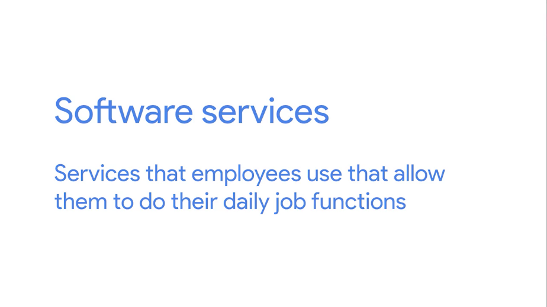

There's another option. If you don't want to be responsible for managing the hardware tasks and updating your server operating systems security patches and updates, you can use the Cloud alternative to maintain your own infrastructure, which is called Infrastructure as a Service, or IaaS.

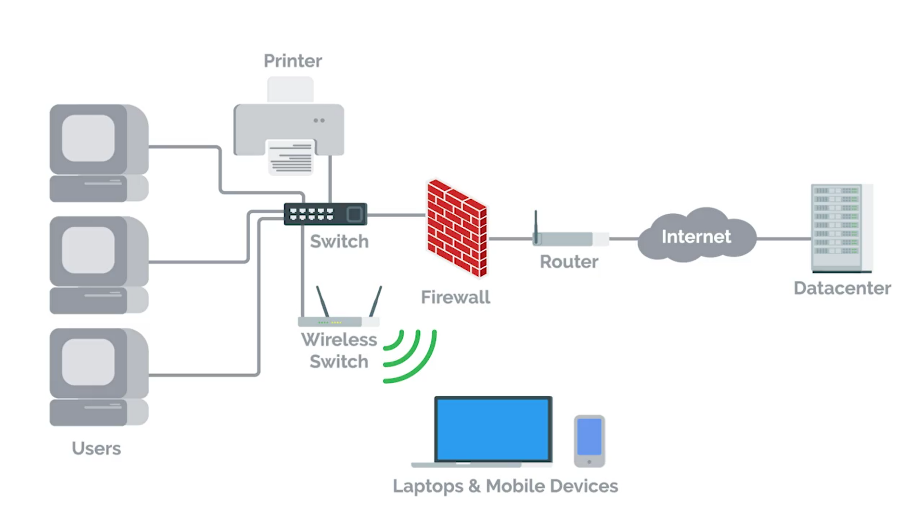

IaaS providers give you pre-configured virtual machines that you can use just as if you had a physical server. Some popular IaaS providers are, Amazon Web Services and their Elastic Compute Cloud or EC2 instances, Linode, which runs out virtual servers, Windows Azure, and Google Compute Engine, which you've been using throughout this video. You can read more about the different IaaS providers in the supplemental reading right after this video.

Your company's internal network, isn't going to be like your network at home. You're going to have multiple computers that need to be on a certain subnet. You have to assign them IP addresses statically or using DHCP. The networking hardware has to be set up, wireless internet will probably need to be available, DNS needs to be working et cetera. If your company is large, networking is usually taken care of by a dedicated team. But in smaller companies, you'll probably be responsible for setting up the network.

Network can be integrated in an IaaS provider, but in recent years, it's also been branched off into its own Cloud service, Networking as a Service or NaaS. NaaS allows companies to offshore their networking services so that they don't have to deal with the expensive networking hardware.

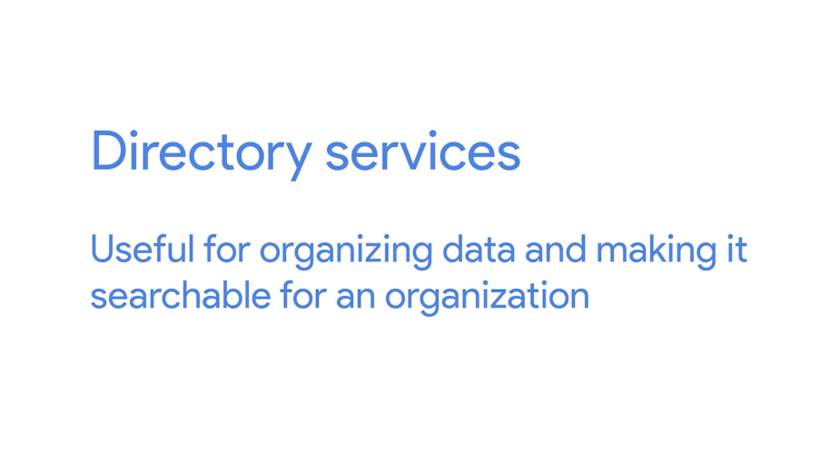

Companies also won't have to set up their own network security, manage their own routing, set up a WAN and private internets, and so on. For more about NaaS providers, check out the supplemental reading. Let's talk about the software that your company might want to use.

Do you need to type out word documents, use an email client, communicate with other people, use operating systems, process spreadsheets or have any of other software needed to run a business? I bet yes. The right software has to be available to your company's users. We've already discussed how to install and maintain software in machines. You have to deal with things like licences, security, updates, and maintenance for each machine.

The Cloud alternative to maintaining your own software is known as Software as a Service, or SaaS. Instead of installing a word processor on every machine, you can use Microsoft Office 365 or Google G suite. These are both services that you can purchase that allow you to edit word documents, process spreadsheets, make presentations and more, all from a web browser. You can check out the next supplemental reading for more about SaaS providers.

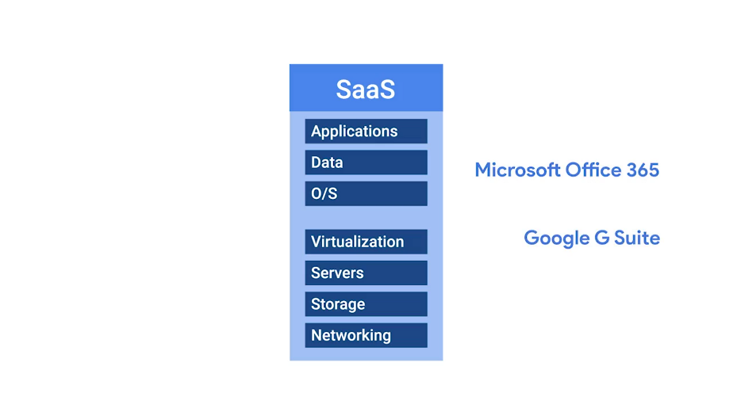

Some companies have a product built around a software application. In this case, there is some things that software developers need to be able to code, build and shape their software. First, specific applications have to be installed for their programming development environment. Then, depending on the product, they might need a database to store information. Finally, if they're serving web content like a website, they'll need to publish their product on the internet.

If you're building this entire pipeline yourself, you may need to set up a database and a web server. The programming development environment will also have to be installed on every machine that needs it. If you want an all-in-one solution to building and deploying a web application, you can use something called Platform as a Service, or PaaS.

This includes an entire platform that allows you to build code, store information in a database, and serve your application from a single platform. Popular options for PaaS are, Heroku, Windows Azure, and Google App Engine. As you might have guessed, you can read more about PaaS providers in the supplemental reading.

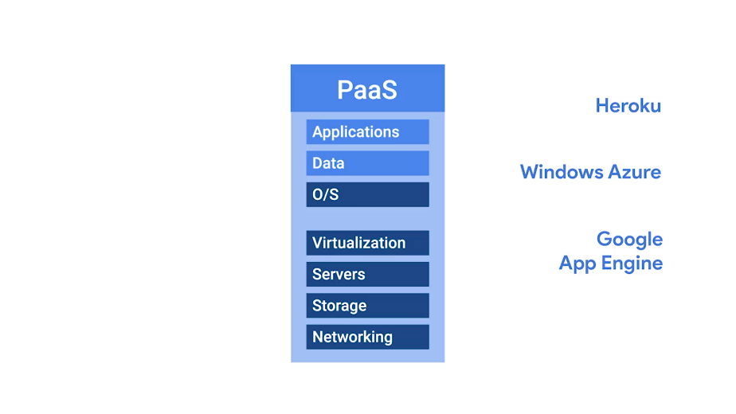

The last IT infrastructure service we'll discuss is the management of users, access and authorization. A directory service, centralizes your organizations users and computers in one location so that you can add, update, and remove users and computers. Some popular directory services that you can set up are Windows Active Directory, OpenLDAP, and we'll dive a little deeper into both of these later on in this course.

Directory services can also be deployed in the Cloud using Directory as a Service, or DaaS providers. Guess we can read more about DaaS providers. That's right, in the supplemental reading. There you have it.

This is a general overview of the most common IT infrastructure services you'll encounter when handling system administration tasks. While Cloud Services are a great option, it's super important that you understand how a service works and how to maintain before you employ the help of a Cloud Service.

Even though Cloud Service are widely used in the industry, and have a lot of pros, there are also some cons. These include recurring cost, and the need to depend on the providers service. We're going to teach you about the technical details and the implementation of these common IT infrastructure services. We'll cover everything from setting up your own server, and figuring out which applications you need to be productive, to how to set up multiple users and get your network services in order. By the end of this course, you'll have the foundational knowledge required to set up the IT infrastructure, for a small organization.

### How do qwiklabs work

When we introduce Qwiklabs in the first course, we said that it uses Google Cloud Console. Now that we know more about the Cloud in IT infrastructure services, let's dive deeper into what happens behind the scenes.

When you press the "Start " lab button, Qwiklab creates a new Google Cloud Console account for you with the same access to the console and services you would see as a paying customer. Each lab has a preconfigured list of actions that need to be performed during setup, this includes; spinning up a virtual machine with a specific CPU, and memory configuration, and installing the VM with a specific operating system, Windows or Linux.

It also configures any other Cloud resources needed for the lab like additional virtual disks for the virtual machine. During the lab, you can access the instances that Qwiklab created for you by using SSH or remote desktop. You can operate them in the same way you would use physical machines running that operating system.

As you may have realized, a virtual machine behaves almost exactly like a physical machine. Once the lab is finished, Qwiklabs destroys the virtual machine.

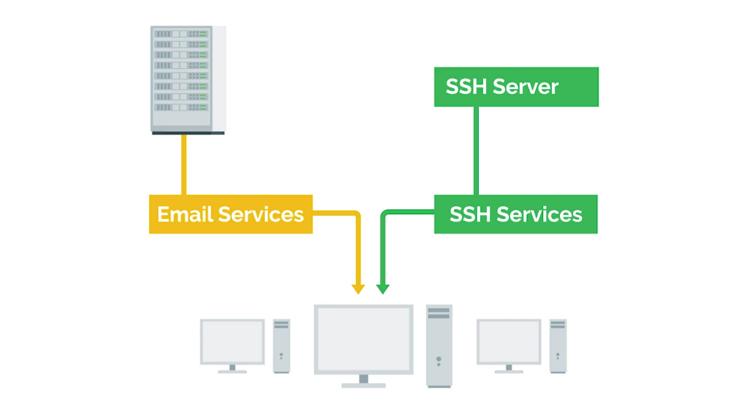

This way any CPU memory and storage used by the VM is returned to the providers pool of available resources, so they can be used by other virtual machines doing other work. So, there you have it. You got a better idea of what's going on behind the scenes when you start Qwiklabs in our courses.

### Heather first tech job

\[MUSIC\] I grew up in a small town in the desert. And there wasn't really much to do except read, play with computers, and study. And this is where I really learned to love technology, to understand how this computer worked, how it did what it did, and how I can make it do something. Think different. And when I went to college I began to study the UNIX operating system. And I learned just enough to get an internship at the local ISP. And this was quite a learning for me because the first day of my internship, I walked in. And they said great, we're so happy you're here. You know you're next right? Yes. Here's a radius server, we want you to set it up. It needs to be done by the end of the week. And I said how exciting. I get to do something that will have an impact on our users and I will get to learn something. There was just one problem. I didn't know what radius was, so this was going to be quite a difficult challenge for me, so I had to read the manuals, the man pages and I had to scour the library for books. And it took me about three days to learn what radius was and how to set it up. But in the end I knew more about it than anyone else at the Ice Pete, and that expertise really I think drove me to become an expert in more areas. It gave me a lot of confidence that I could do that work and it was actually really invigorating and so I ended up as a UNIX and sort of went from there. \[MUSIC\]

## Physical infrastructure services

### Server operating systems

When you want to set up a server, you essentially install a service or application on that server like a FAS storage service. The net server will provide those services to the machines that request it. Maybe you thought you'd install services on, or use operating system like Windows 10.

While that's an option, typically, in an organization, you want to install your services on a server operating system. Server operating systems are regularly operating systems that are optimized for server functionality.

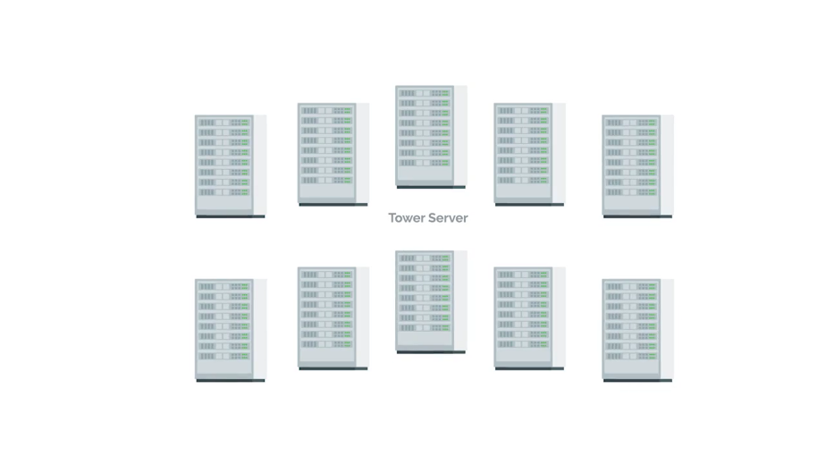

This includes functions like allowing more network connections and more RAM capacity. Most operating systems have versions specifically made for servers. In windows, you have Windows Server. In Linux, many distributions come with server counter protests like Ubunta server, which is optimized for server use. Mac OS is also available in Mac OS Server.

Server operating systems are usually more secure and come with additional services already built in. So, you don't have to set up these services separately. You can read more about the different server operating systems in the next supplemental reading.

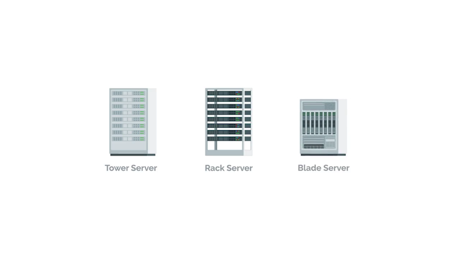

For now, just keep in mind that when you install services on a server, you should be sure to use a dedicated server operating system.

### Virtualization

We discussed virtual machines in the last course and covered how to set up a virtual machine on a personal computer. In this lesson we're going to talk about why virtualization can be an important part of infrastructure services and systems administration. There are two ways you can run your services, either on dedicated hardware or on a virtualized instance on a server.

When you virtualize a server you're putting lots of virtual instances on one server. Each instance contains a service. There are a bunch of pros and cons to running your services on either of these platforms. Here's the rundown.

Performance, a service running on dedicated hardware will have better performance than a service running in a virtualized environment. This is because you only have one service using one machine as opposed to many services using one machine.

Cost, server hardware can be pretty expensive. If you put a service on one piece of dedicated hardware and have to do that for nine other services, it starts to add up. One of the huge benefits to virtualizing your service is that you can have ten services running on ten different virtual instances, all on one physical server.

Here's another way to think about this, in a typical server if you only have one service running it's probably only taking up 10-20% of your CP utilization, the rest of the hardware isn't being utilized. You can add plenty more services to the physical server and still have a good threshold for resource utilization. It's cheaper to run several services on one machine than it is to run many services on multiple machines.

Maintenance, servers require hardware maintenance and routine operating system updates. Sometimes you need to take the servers offline to do that maintenance. With virtualized service, you can quickly stop your service or migrate them to another physical server, then take as much time as you need for maintenance. Virtualized service makes server maintenance much easier to do.

Points of failure, when you put a service on one physical machine and that machine has issues, you're entering a world of trouble. With virtualized service, you can easily move services off a physical machine and spin up the same service on a different machine as a backup. You could also do this with a physical server, but that could become costly if you account for multiple service. Pro tip, you can prevent a single point of failure on a physical machine if you have redundant servers set up, meaning you have duplicate servers as a backup. You will learn about backups in the upcoming module.

As you can see there are lots of benefits to using virtualized servers, just make sure to weigh the pros and cons of visualising your service and using dedicated server hardware, that way you can make the right choice for your company.

### Remote access revisited

Another important part of physical infrastructure services is the ability to connect to your infrastructure from anywhere in the world. We talked about remote access in an earlier course, and we've been using it all throughout this program to connect to our lab machines. In this lesson, we're going to discuss what's needed to set up for remote access for a small organization. As a systems administrator, or as anyone in IT support, you'll want to be able to remotely access another server or user's machine so that you can troubleshoot an issue. Or do maintenance from wherever you may be.

In Linux, the most popular remote access tool is OpenSSH. We've already learned how to SSH into a remote computer in the last course, and we talked a bit about what's needed to set up SSH. But we'll quickly show you how to do this.

To SSH into another machine, you need to install an SSH client on the machine you're connecting from. Then install an SSH server on the machine you're connecting to. To learn more about open SSH, you can check out the next supplementary reading. But let's keep rocking and rolling with how to install the open SSH client on a machine. It's super easy. What you're going to do is always, go to my client machine, and simply run this command, sudo apt-get install openssh-client. And going, downloading package, perfect. So, it looks like my client has been installed.

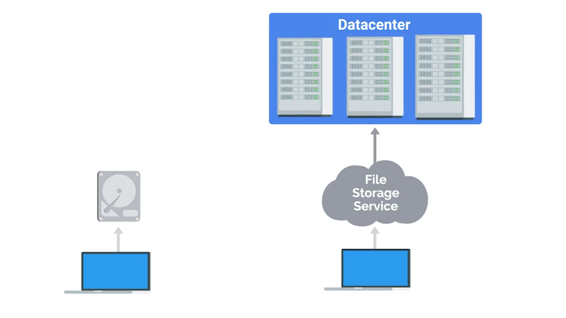

Next, you need to install the open SSH server on the machine you want to access. Remember, the SSH server is just a process that listens for incoming SSH connections. So, let's go to the server and install the open SSH server. So I'm going to do sudo apt=get install openssh-server.

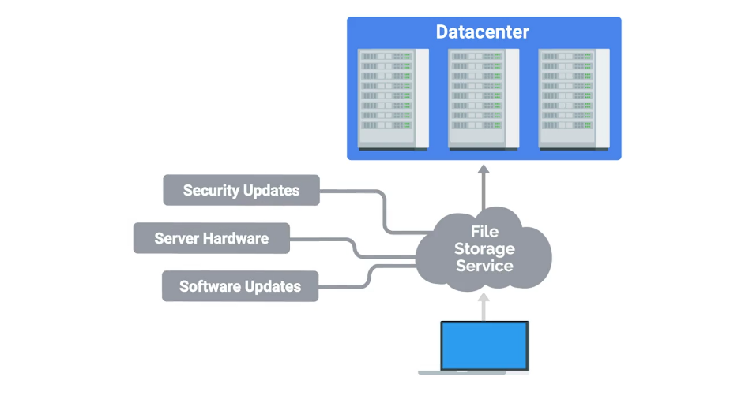

Perfect, so it looks like my server's up and running. So let's go back to the client and do a test. I do ssh, and to my server IP address with my username. It asks for my password which is a good thing. Perfect, so as you can see, I'm connected to my server.

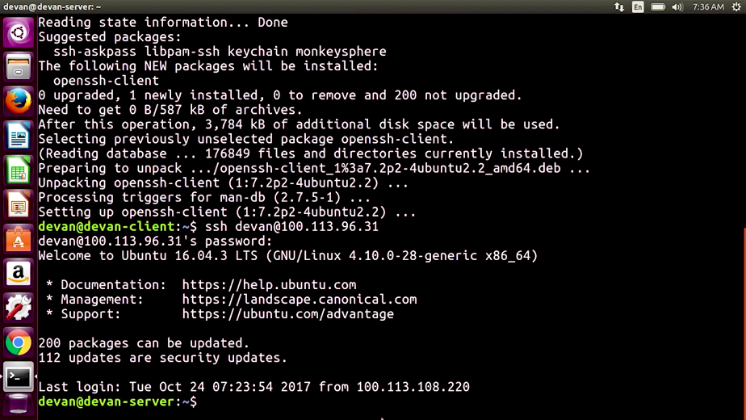

And one true way to test this if I go into my desktop of my server, and let me create a folder. Now if I go back to my server, which is on this window, and I list the files, you can see the folder test, and that's it.

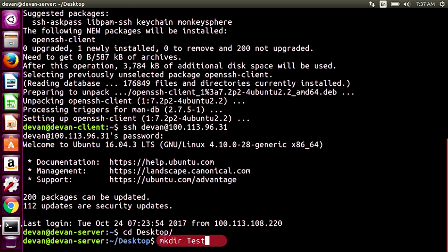

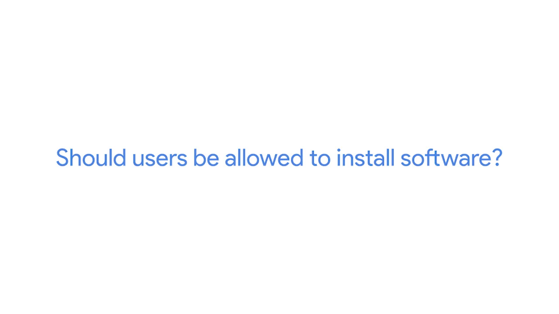

Now you're able to SSH into a machine from another machine. Not too complicated, right? Windows has similar tools that you can use. A popular tool to access the CLI remotely is WinRM or Putty. RDP is also popular if you want to access the GUI remotely.

We've already discussed how to connect to a machine using Putty in the last course. Just remember to install an SSH server on the machine you want to connect to. We also already discussed how to set up RDP in the last course. Feel free to read those lessons as a refresher. You can read more about the Windows Remote Access tools in the next reading.

The takeaway here is that when you manage IT infrastructure, you can utilize tools like Remote Access to work on your physical infrastructure. You'll need to do a little bit of setup beforehand, like installing a SSH client, SSH servers, and allowing remote desktop connections, etc. But it will be worth it in the long run. Next up, we'll tackle network service. See you there.

## Network services

### FTP, SFTP and TFTP

Now that we're a little more familiar with some of the common aspects of physical infrastructure, let's move onto network services. A network service that's commonly used in organization is a file transfer service. So why would you want to have a service dedicated to file transfer?

Well, sure, you could probably carry around a flash drive and copy files to each machine you work on or even use a remote copy tools we learned in the last course, or you could essentially store huge files and transfer files from one computer to another using the Internet. There are a few different file transfer protocol services that are used today. Let's take a quick rundown of what's out there and what they do.

FTP, in the second course of this program the, bits and bytes of computer networking, we mentioned FTP a.k.a the file transfer protocol. It's a legacy way to transfer files from one computer to another over the Internet, and it's still in use today. It's not a super secure way to transfer data because it doesn't handle data encryption.

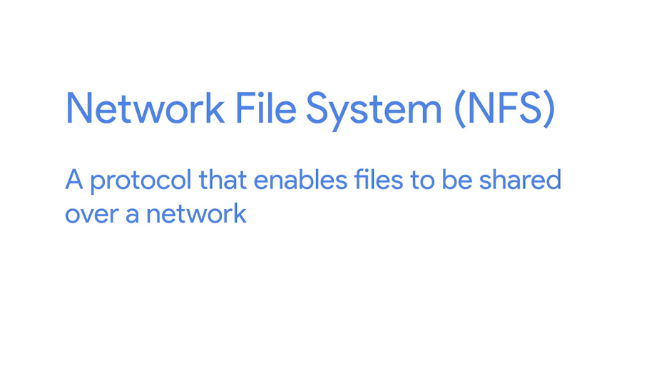

The FTP service works much like RSH service. Clients that want to access an FTP server have to install an FTP client. On the FTP server, we install the software that allows us to share information located in the directory on that server. FTP is primarily used today to share web content.

If you use a website host provider, you might see that they have an FTP connection already available for use so they can easily copy files to and from your web site.

SFTP, it's a secure version of FTP, so it makes sense to choose this option over FTP. During this SFTP process, data is sent through SSH and is encrypted.

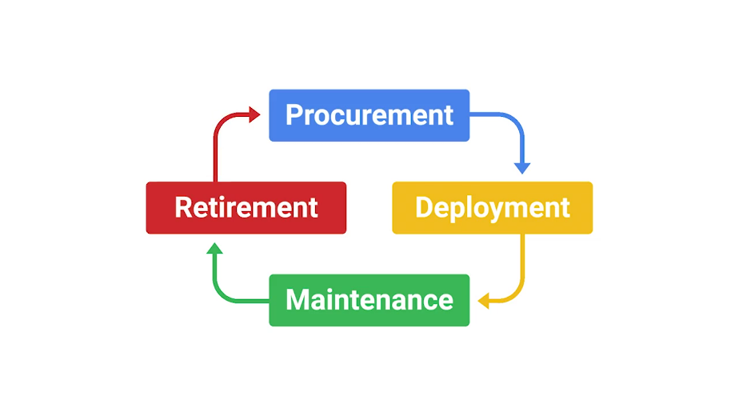

TFTP stands for trivial FTP. It's a simpler way to transfer files than using FTP. TFTP doesn't require user authentication like FTP, so any files that you store here should be generic and not need to be secure.

A popular use of TFTP is to host installation files.

One method of booting a computer that we haven't discussed yet is PXE or PXE boot, which stands for preboot execution. This allows you to boot into a software that's available over the network.

A common use case for organization that want to install software over a network is to keep operating system installation files in a TFTP server. That way, when you perform a network boot, you can be automatically launched into the installer. This is a lot more efficient than having to carry around a USB with an operating system image. You can learn more about PXE boot in the next reading.

Depending on your usage of file transferring services, you might want to weigh the option we mentioned. We encourage you to read about popular FTP clients using the supplemental reading. If you just want to share files between your computers in a secure way and have a nice directory where you can access all the shared files instead of transferring them to your machine, you'll want to look at network file storage services instead. We'll discuss those in the upcoming module.

### NTP

One of the oldest Internet protocols in use today is the network time protocol or NTP. It's used to keep the clock synchronized on machines connected to a network.

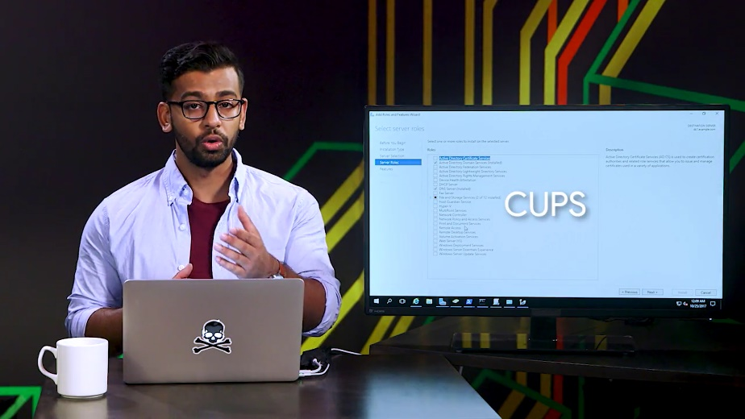

You've probably seen NTP implemented in your personal life if you've ever been in an airport. Airports utilize synchronized clocks systems, and many of their systems use NTP. This is because the information that you see on your departure and arrival screen has to match the time that the air traffic control team sees for their airplanes.

If only NTP could solve for airport delays. Anyway, in the IT world, machines need to have accurate time across a network for a lot of reasons. There are some security services like Kerberos and network authentication protocol that depend on the time being consistent across the network to work. You'll learn more about that in the IT security course coming up.

It is important to keep the time consistent and accurate across your company's fleet. You can't depend on the hardware itself to keep consistent time, so you might want to set up an NTP server.

There are different ways that an IT support specialist or sysadmin can do this for an organization. You can use a local NTP server or a public NTP server. To set up a local NTP server, you can install NTP server software on your management server. Then, you install NTP clients on your machines and tell those computers which NTP service to sync their time to. This is a great option because you can then manage the entire process from end to end.

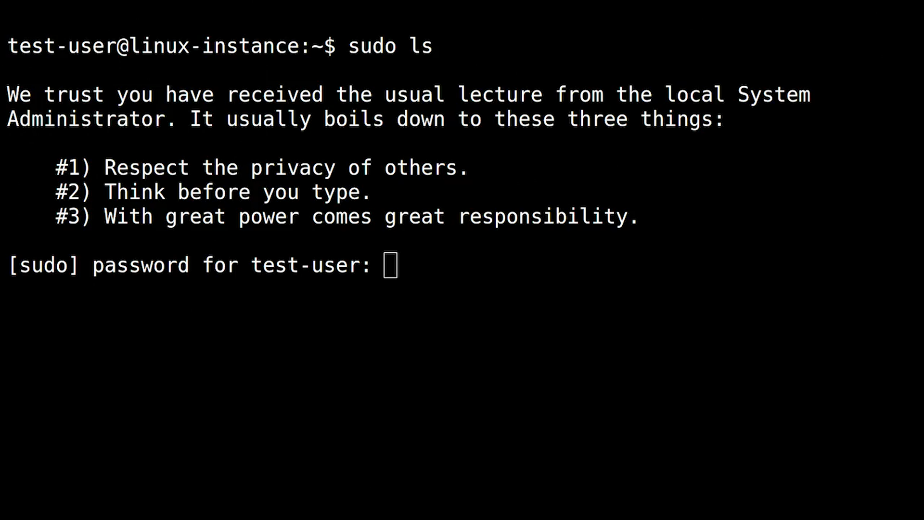

The other way to set up NTP is to use a public NTP server. Public NTP servers are managed by other organizations that your client machines connect to in order to get synchronized time. This is an awesome way to utilize NTP without having to run a dedicated NTP server. But if you have a large fleet of thousands of machines, it's better etiquette to be running your own NTP servers.

Another good practice is to run your own NTP server. Then, have that point to a public NTP server. This makes it so that you don't connect all your clients to a public NTP server, and you don't have to measure time synchronization. Whether you run your own NTP server, or you use a public one, NTP is an important network service that you should definitely integrate into your own fleet.

### Network support services revisited

There are a few network services that are used internally in an IT enterprise environment, to improve employee productivity, privacy and security. While they're pretty common, you might not encounter them in small organizations. We discussed these services in course two on networking, but let's do a refresher. We're sure that you encounter them at some point in your IT career.

There are Intranets and Proxy servers. An Intranet is an internal network inside a company. It's accessible if you're on a company's network. Intranets can provide a wide range of information, and are meant to improve productivity by giving employees a greater medium to share information.

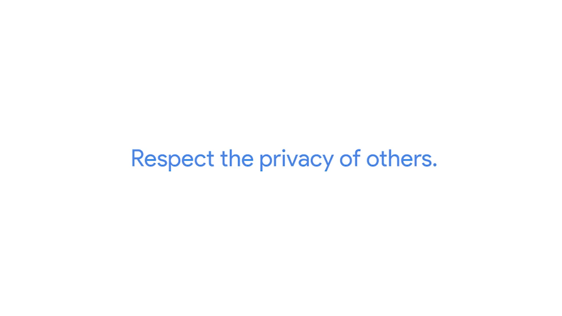

Think of it like the company's website, that's only accessible to people on the company network. On this site documentation can be centrally located, teams can post news updates, employees can write in forums and start discussions and more. Intranets are most commonly seen in large enterprises, and can be incredibly valuable tool for employee productivity.

Another internal support service that's widely used is a proxy server. Proxy server acts as an intermediary between a company's network and the Internet. They receive network traffic and relay that information to the company network.

This way, company network traffic is kept private from the Internet. The internet gets traffic through a Proxy server, but it doesn't know where it originally came from. It only knows the proxy. Proxy servers can also be used to monitor and log internal company network activity. They can be configured, so certain websites are filtered from being accessed. Proxy servers are useful for fighting privacy and security on the Internet, and regulating access inside a company. In the next few lessons, we'll talk about what are probably the most essential network services DNS and DHCP.

### DNS

We did a deep dive in DNS, or domain name system in the networking course. If you need a refresher on it, make sure to review the material there.

As a super quick recap, DNS is what maps human understandable names to IP addresses. It's an important network service to set up and maintain when managing a company's IT infrastructure.

If you don't set it up correctly, no one will be able to access websites by their names. We don't really have to think about DNS on our personal computers. When you connect a brand new machine to the Internet and start typing in the web address, it just works automatically. You don't have to type in IP address or anything, but something is happening in the background.

When you connect to a network, you're using the DNS server address that was provided by the router you connected to. It updates your network setting to use that network server address, which is usually your ISP's DNS server. From there, you're able to access pretty much any website.

So why do you need to set up your own DNS service if DNS just works out of the box? Well, there's two reasons. First, if you're running a web service like a website, you want to be able to tell the Internet what IP address to reach your website at. To do that, you need to set up DNS.

The second reason is that you probably want to work on your server or user machines remotely. In theory, you could remote access into them through an IP address but you could also just use an easy to remember host name. To do that you need DNS to map the IP address to the host name. In the next couple of lessons, we'll discuss what's needed for DNS setup for websites and internal networks.

### DNS for web servers

You might remember that we can use a web server to store and serve content declines that request our services. We'll probably want to store website content on our web server. If clients want to reach our website, we need to set up DNS so that they can just type a URL to find us. So, let's talk about how DNS gets set up for a website.

First, we need a domain name. We can buy a domain name like SettingUpDNSIsFun.example.com. We can purchase domain names like this from companies called domain registrars, like GoDaddy.com, or BluHost.com. Once we have our domain name, we want to point our website files to this domain name. Our website files can be stored on a cloud hosting provider, or we can decide to control this ourselves and store it on our own servers.

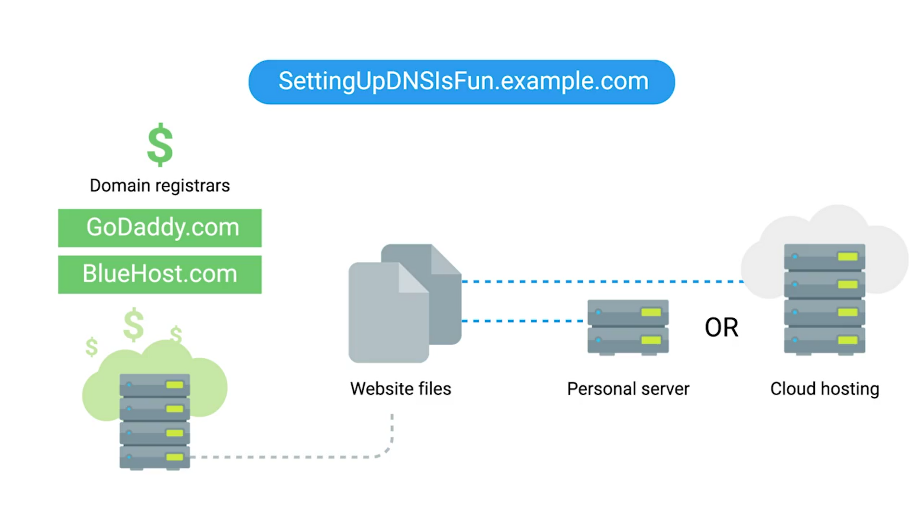

Typically, domain registrars also provide cloud hosting services but they can charge you a monthly fee to host your web files for you. Protip, if you don't want to utilize cloud hosting services, you can just run your own web server. Don't forget, there are always pros and cons to hosting a service yourself or offshoring it somewhere else. If you're the sole IT support specialist for an organization, make sure to weigh all your options before committing to an infrastructure service.

Let's assume that we do want to host our website files ourselves. From here, we still need to point our new domain name to where web content is located. We can do this in two ways. Most domain registrars can provide you with DNS settings and you can give the IP address of where your content is stored. If you decide not to use your domain registrar to host DNS for you, then you have to set up an authoritative DNS server for your website. Remember from our discussion in course 2 that authority DNS servers are the DNS servers that know exactly what the IP address is for the domain name.

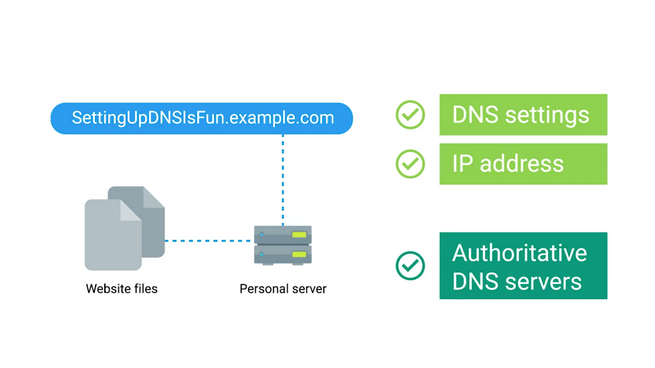

Since we own the domain name and host our web content ourselves, it makes sense for us to have the DNS servers that know that information.

### DNS for internal networks

The other reason we might want our own DNS servers is so we can map our internal computers to IP addresses. That way, we can reference a computer by name, instead of IP address. There are a few ways we can do this. One is using a local host file which contains static IP addresses to hostname mappings.

Let's take a look at an example of this. Remember, that we learned that hosts files and networking allows us to map IP addresses to hosts things manually. In Linux, our host file is code etc/hosts. It has an IP address that points to 127.0.0.1 which points to a name called localhost.

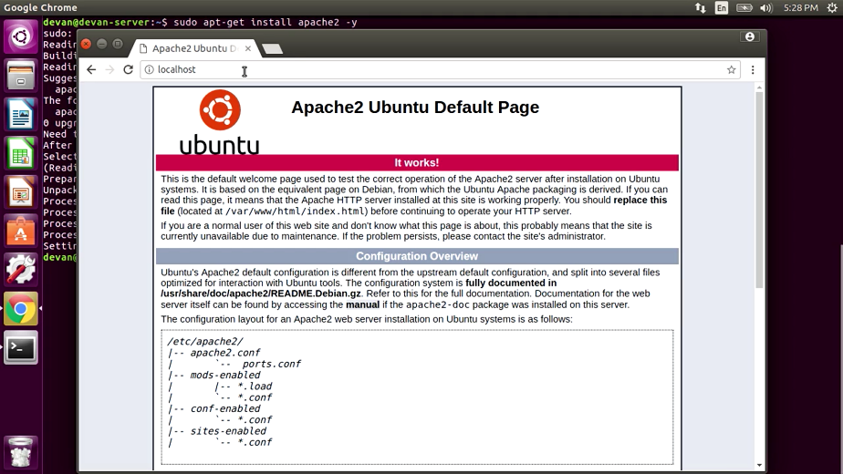

This just references back to the computer. Localhost is commonly used as a way to access a local web server. We'll talk about web servers in an upcoming module.

So for now, let's not worry too much about localhost. Instead, if I change this IP address mapping to www.google.com, then save and open a web browser, and type www.google.com, it won't take me there. Let me show you that. So I'm going to go ahead and change my localhost to www.google.com. I'm going to save this. Open my web browser to www.google.com, and as you can see, it didn't take me anywhere. It just takes me back to my local computer.

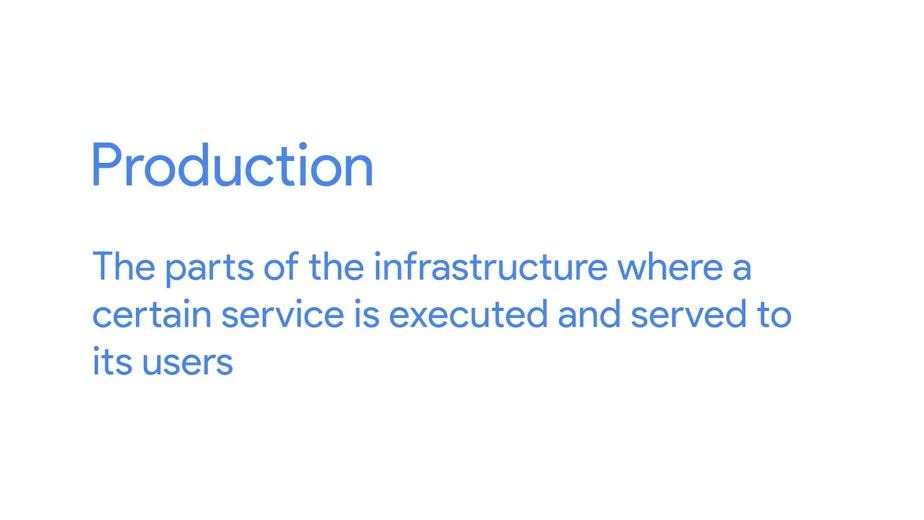

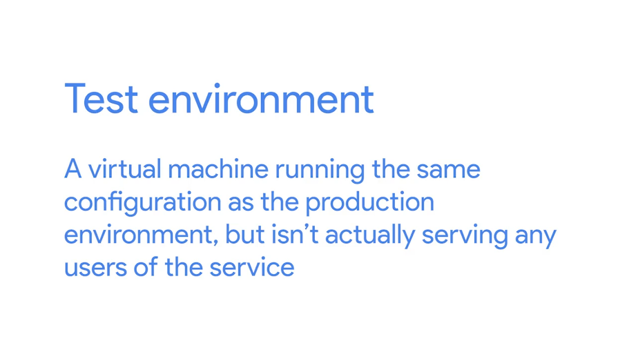

This is because a DNS query first, checks our local host file, then our local DNS servers. So, if there's an entry for google.com in my host file, you go to that IP address instead.

Let's say I wanted to access Natalie's computer at 192.168.15 and her host name is catlady.examplecompany.com. I would have to enter this in my host file for every single computer in my fleet. That's definitely not a scalable option. So, what's our next choice?

We can set up a local DNS server that contains all the organizations computer names mapped to their IP addresses. This is a more central storage location for this information. Then, we change our network settings for all our computers to use as DNS server instead of the one given to us by our ISP.

Finally, let's look at one of the last DNS option we can use for an internal network. It can be integrated with a directory service which handles user and machine information in its central location like, active directory and LDAP. Once we set up DNS in our directory service, it will automatically populate with machine to IP address mappings. So, there's no need to enter this information in manually. We'll talk more about these directory services in the later module.

And voila, that's an overview of why you need the DNS along with your options for configuring them. We won't dive too deeply into the technical details of setting up a DNS server, but if you're interested in learning about which DNS software to use, there are a few powerful options like Bind or powerDNS. I bet you can guess where you can read more about them. In the supplemental reading. One thing about DNS, that we haven't discussed is what to do if we use something like DHCP, which doesn't use static IP addresses. Don't worry, we'll cover this in the next lesson.

### DHCP

Another network service that will make you a job in IT support easier is DHCP, Dynamic Host Configuration Protocol.

Either refresh on DHCP, just check out the DHCP lessons and networking course. When managing IT infrastructure, and you want to connect a computer on a network, you have two options. You can grant it a static IP address or give it a DHCP assigned IP address.

When you use a static IP address, you have to keep track of every IP address you assign a computer and manually entered in the network settings. If you enable DHCP, your computers will be leased an IP address from a DHCP server. They'll automatically get IP addresses, and you don't have to worry about manually setting addresses. If you ever decide you need to expand your IP address range, you don't have to change anything on the client machines either, it just happens automatically.

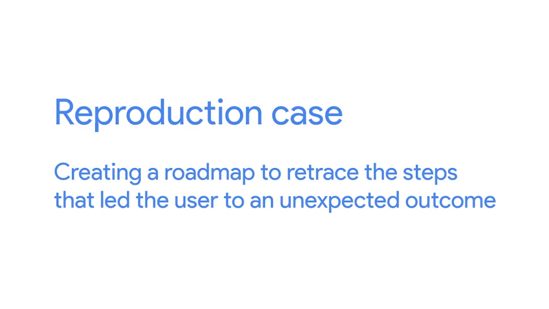

To configure a DHCP server, you need to figure out which IP range you can use to assign IP addresses. If you want to integrate with DNS, you need the address of your local DNS servers. What Gateway you should assign, and the subnet mask that gets used.

Once you solve the DHCP sever software, you had to configure the settings with this information. Different DHCP server software manufacturers have different configuration setting layouts, so you have to investigate the specific one you want to use. There are a lot of popular DHCP server software you can use for this. Windows Server versions come with DHCP service built-in, but you can read more about the options in the next reading. Once you turn on your DHCP server and your client is set to receive DHCP addresses instead of static IP addresses, you should have working DHCP settings.

In the last lesson, we talked about how DNS ties in with DHCP. Well now in a DHCP configuration settings, we can specify a DNS server locations. The two servers then sync up and when DHCP leases out new addresses, DNS updates IP address mappings automatically.

That's a super quick overview how DHCP servers are configured. Hopefully you can now see why DHCP and DNS are critical network services for your organization.

## Troubleshooting network services

### Unable to resolve a hostname or domain name

There will be times when you're working in an IT support role and you won't be able to resolve or get the IP address of a website name. This particular problem could be tricky to identify when you see it. You might just think that your network connection isn't working. Let's go ahead and try to navigate Google.com from our web browser. So let me get to my webrowser and navigate to Google.com. It doesn't look we get to Google.com.

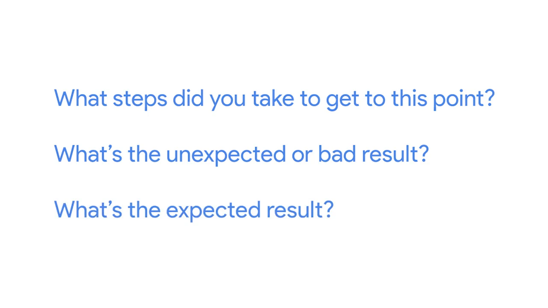

Let's go over some of the tools that we learned in our networking class that can help. First off, if you're unable to resolve a domain name, check that your network connection is actually working. You can do a quick check and ping a website that you know is available. An oldie but goodie is to ping www.google.com. It's pretty rare that Google would be down, although it can happen. So let me go into my terminal and type in ping www.google.com. Looks like we're getting responses.

Let's move on to isolating another problem, DNS. To verify that your DNS server is giving you a correct address for google.com, you can use nslookup. Remember that nslookup gives us the name server of a host or domain name, so let me go ahead and do that on my terminal.

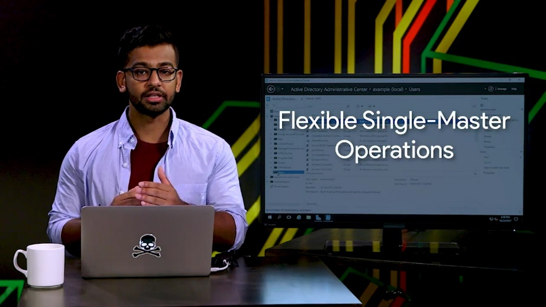

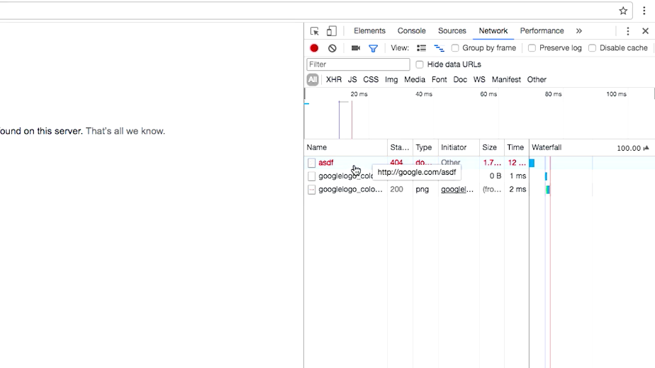

From here, we can rule out if DNS isn't issued by verifying that the host name points to a name server. If we copy the IP address of the result and paste it into the web browser, it should resolve the website name if DNS is working. Let's go ahead and do that. So I'm going to go ahead and copy the non-authoritative IP address. Open my web browser So I see that's working. What's going on?

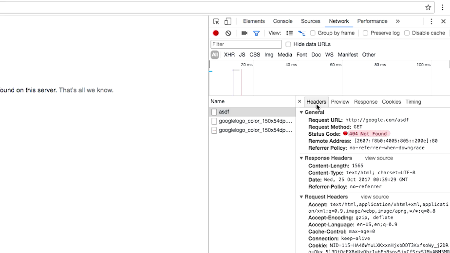

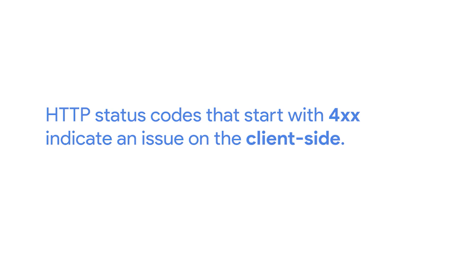

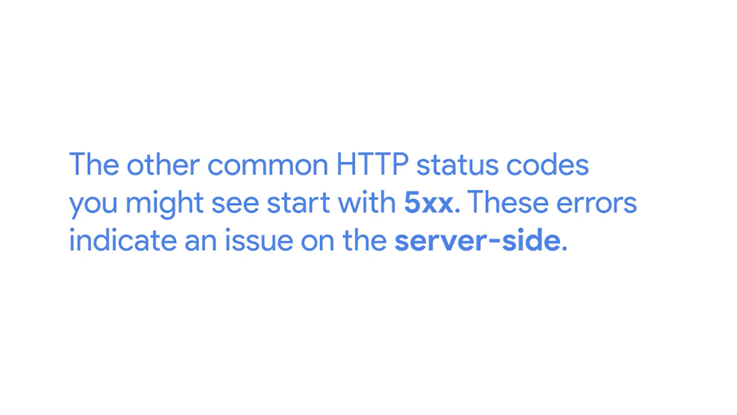

It looks like my DNS settings aren't working correctly. Let's look at my ping results again. So I'm going to go ahead to my terminal and ping www.google.com. I see that it checks an IP address different from what I have here. If I go to this IP address, it doesn't take me anywhere.

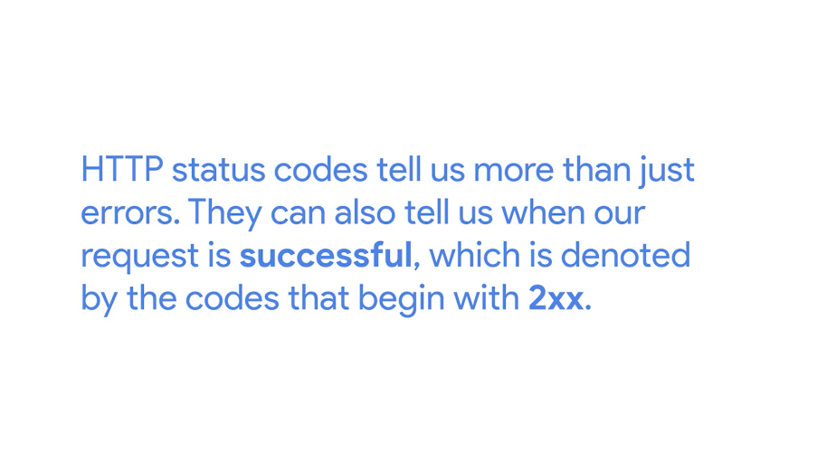

So I'm going to take this IP address, copy this. Remember that when a DNS query is performed, your computer first checks host file. Now if I access my host file here, I can see that I have an entry for www.google.com. And it points to a fake IP address.

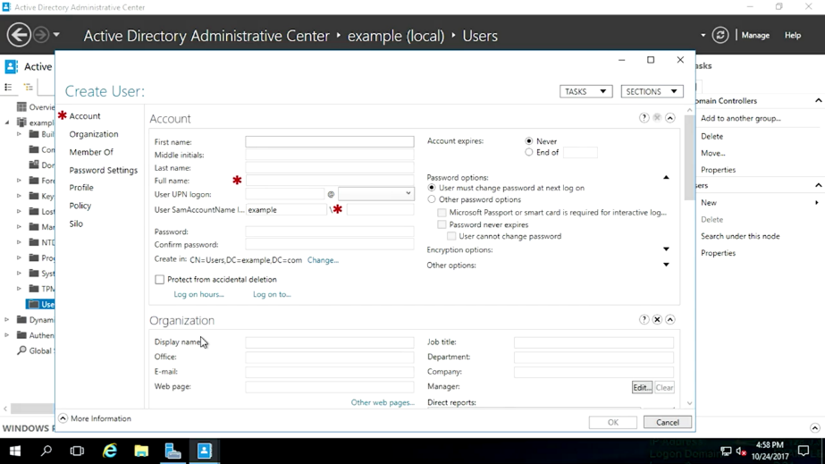

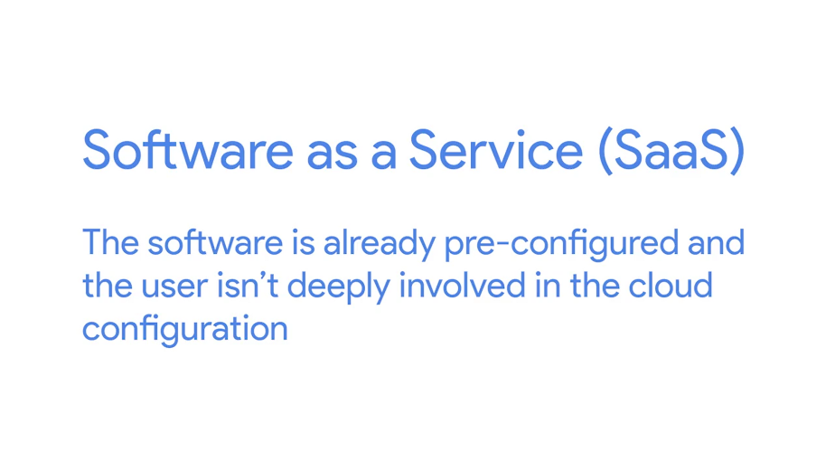

If I remove this line right here where it says 127.1.1.3 And save that configuration file, and then restart my browser, If I type in www.google.com, there we go, we're there. And the correct DNS setting should be applied to www.google.com.

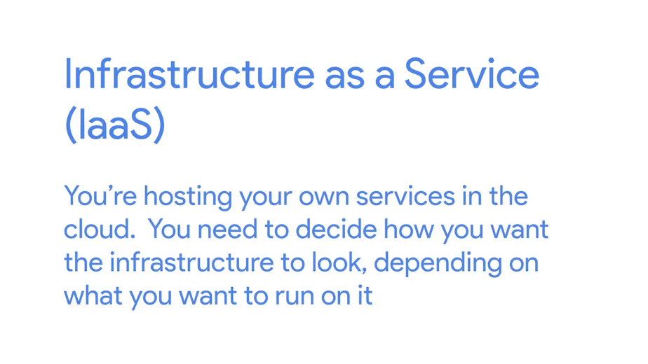

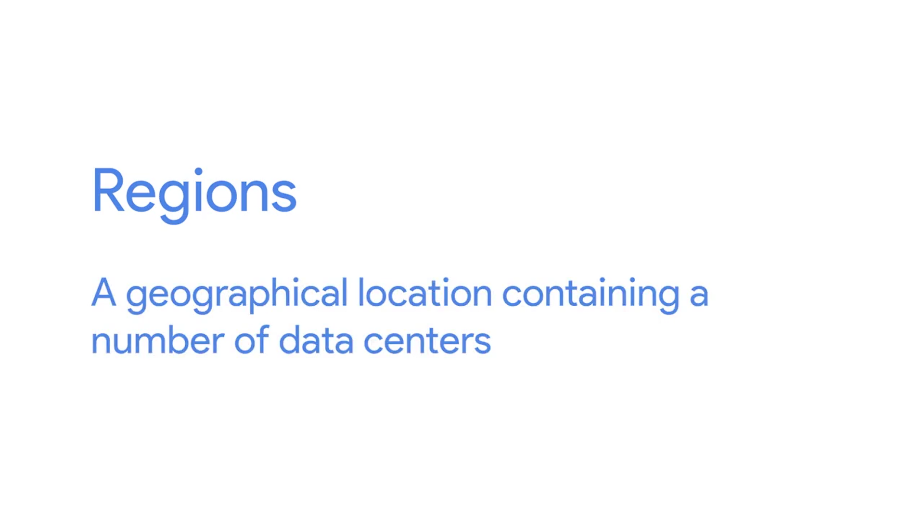

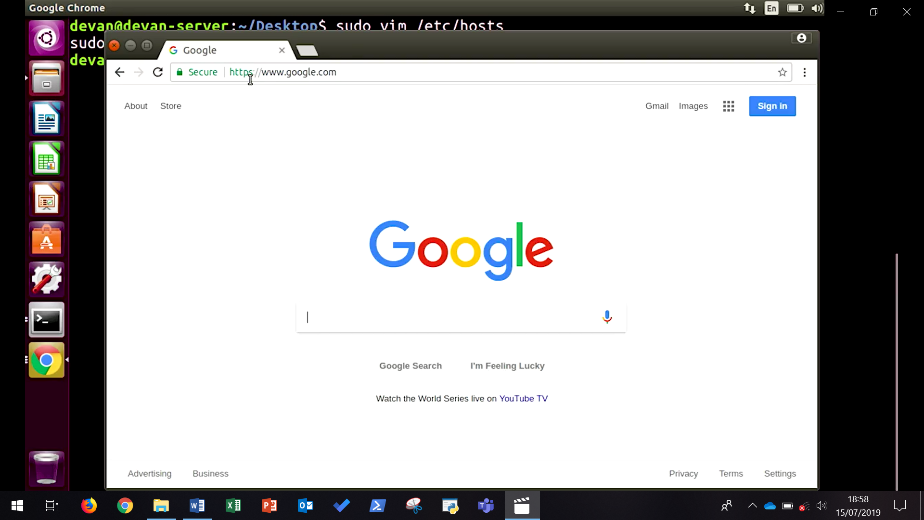

There are some situations where DNS can be tricky to navigate, since there can be many contributing factors. But as with any troubleshooting scenario, remember to keep isolating the problem down until you can get to a root cause. With time and experience, you'll learn a lot more about DNS and how to troubleshoot it in the real world.

We've covered a lot of information in this module. You learned about all the overall services needed in an IT instructor. On top of that, you learned about computer services like remote access and virtualization that help make your organization work more effectively. Your team of leaned about essential networking services like DNS and DHCP. Along with the overall picture of what's needed to set up DNS for an organization, and why you'd want to do that. Now we're going to test you on all that learning. And don't forget, you can always go back and review the material again if you need to before you take the quiz. In the next module, we're going to cover two of the other IT infrastructure services, software and platform services. I'll see you there.

## Managing system services

### What do services look like in action

We've talked about lots of services. DNS, DHCP, NTP, and others. As an IT support specialist, it's important to understand how the programs that provide these services operate. So, that you can manage them and fix any problems that pop-up.

These programs run as background processes. Also known as daemons, or just services. This means, that the program doesn't need to interact with the user through the graphical interface or the command line interface, to provide the necessary service.

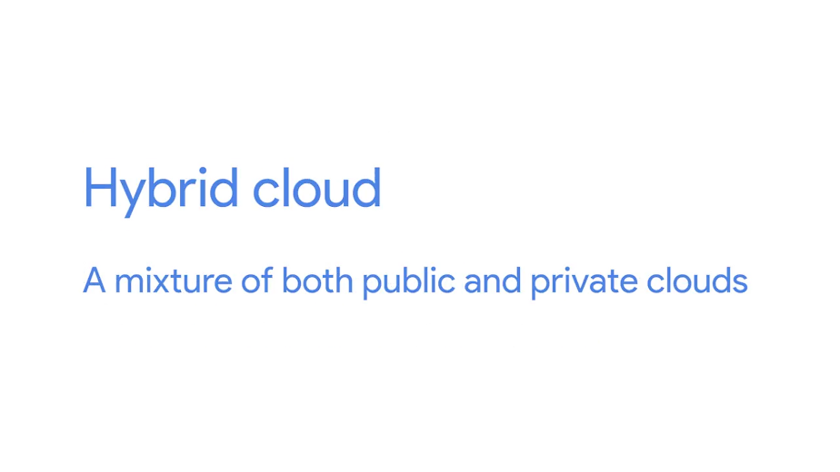

The operating system ensures that the program is running. Each service has one or more configuration files, that you as a system administrator will use to determine how you want the service to behave.

Some services may offer interactive interfaces, that allow a user to edit the configuration, and to inspect the current status or the usage history. Other services may just rely on the system infrastructure for this. Which means you need to edit the configuration files yourself. You have to know how to start and stop the service, and how to go through its logs to see any current or previous activity.

Services are usually configured to start when the machine boots. So that if there is a power outage or a similar event that causes the machine to reboot, you won't need a system administrator to manually restart the service. If you want to decide yourself when the service starts, instead of starting upon boot, you need to change the software configuration to make it start when you want.

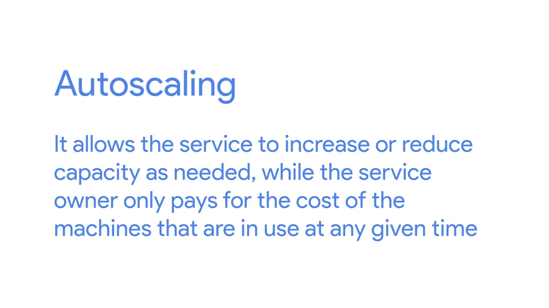

Similarly, services are usually configured to restart if they crash unexpectedly. If this is not how you want to set up, you may need to change the system configuration than handles these properties. There are lots of services out there, and each may require specific knowledge regarding how to configure it, and when and how to use it. But the general concepts relate to managing and configuring services are the same across the board.

In the rest of this lesson, we'll look at examples of how to do this on both Windows and Linux.

### Managing services in linux

As a system administrator, you will need to know how to look at the status of a running service and how to stop, start and restart running services. The exact way to do this would depend on the operating system you're using, but the concepts are the same. Let's look at a very simple service; Network Time Protocol, NTP.

We've caught out before that NTP allows machines to synchronize their clocks. Ubuntu installations include a daemon that runs on the machine and is in charge of synchronizing the clock using NTP.

We can check that there's an NTP daemon running on this machine using the service command, Service NTP Status. We can see that there is an NTP service and the system tells us it's running. This service is keeping our clock on time without us even realizing it.

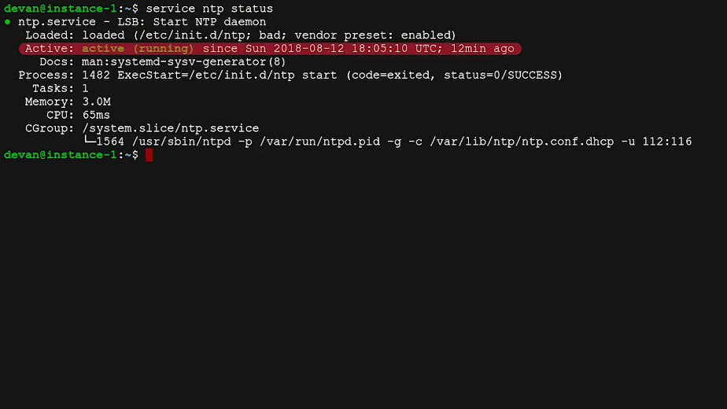

If at any point it detects that the clock has drifted, it adjusts the time in a very small increment. It will add or remove 0.5 milliseconds per second until it reaches the desired time. It uses very small increments so that other services which depend on the clock to perform their tasks, won't be affected by a sudden adjustment of the time.

Under normal operating conditions, a computer clock will only see very small drifts from the standard time. So, these very small adjustments make sense. If the daemon detects the time has changed more than 128 milliseconds, it assumes that something else is going on and will not interfere. Let's test this by manually modifying the date of the system to a date in the past. So, I'm going to go ahead and type in sudo, date and give it a specified date, 2017-01-01 00:00:00 and that specified date, hit Enter and then type in date. We've set the date to January first, 2017 at 12 AM.

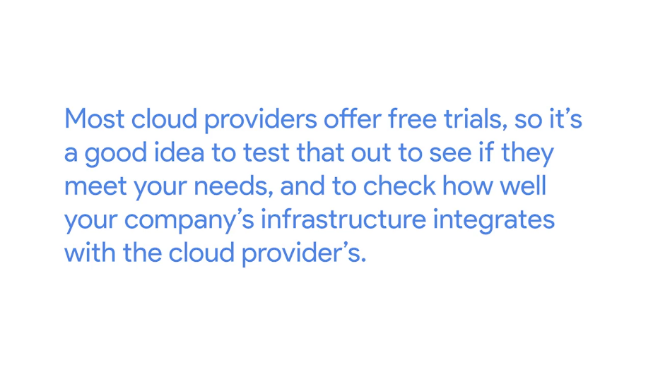

If we check the date after a few seconds, it will still be set to January first, 2017 a few seconds past midnight. It does not get adjusted. The NTP daemon sought to change but since it's more than 128 millisecond threshold, its not adjusting the clock.

So, how do we make it catch up to the present. There's an option in the NTP daemon that allows it to drastically adjust the clock when it's starting. This is because the daemon is expected to start very early in the process when the machine is booting up. So, there shouldn't be any time dependent services running at that point.

If we manually restart the service now, we'll see that the date and time get adjusted. So, let's type in sudo, service, ntp stop. Typing date, sudo service ntp start and then typing date, then Enter.

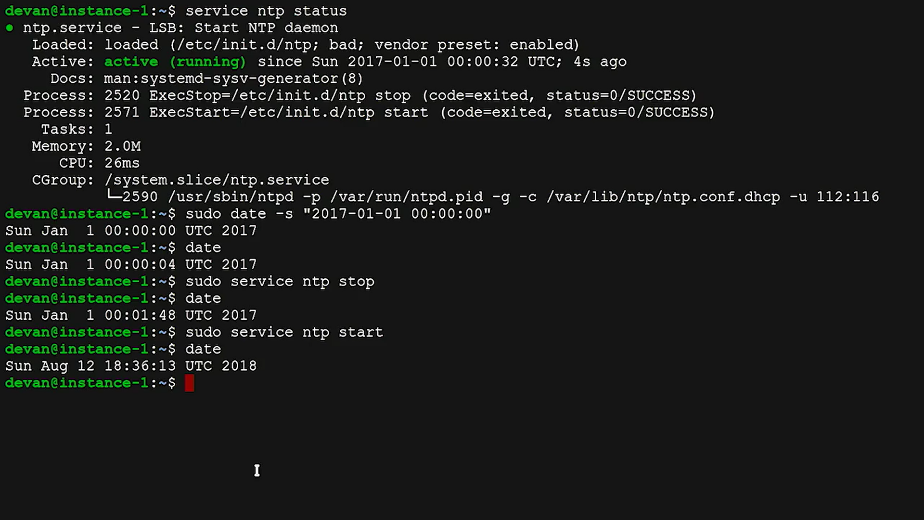

We use the stop action to stop the service and the start action to start it back up. Immediately after starting the service, we can see that the date and time are set back to the present. We use the sudo command to stop and start the service because any user can check the status of the service but only an administrator can cause it to stop and start.

An alternative that's available in most services is the restart action, which does a stop followed by a start. Let's see how that one looks. First, let's set that date back to January first, 2017 at 12 AM and then we'll restart the NTP service. So, I'm typing in sudo, date, specify the time. So, 2017-01-01 00:00:00, hit Enter. Then hit date, then hit sudo service ntp restart, then hit date. Now you've seen how to check the status start, stop and restart service in Linux.

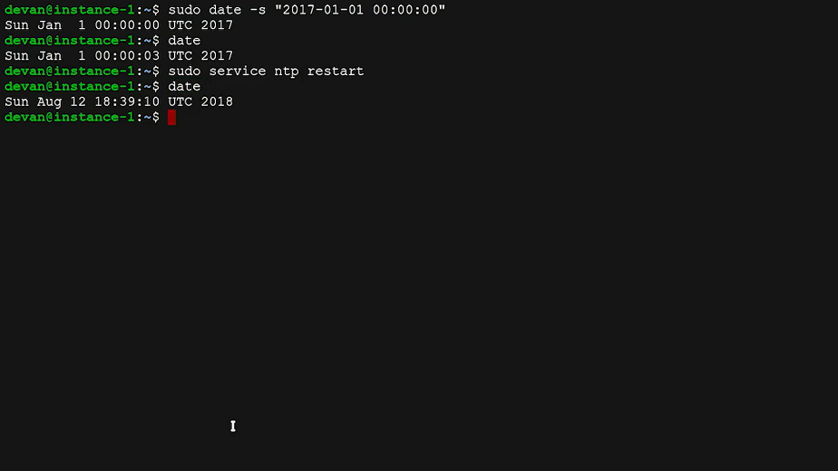

NTP is a very simple service, but you can also use the same commands to manage much more complex services.

### Managing services in windows

Like Linux, Windows also allows the system administrator to manage the services that are running on the system. For this example, let's look at the Windows Update service. This service is in charge of detecting software updates for either the operating system or other installed programs, downloading them and having them ready to be applied to the system. Let's get the status of the running service using the Get-Service command. So, I'm going to go ahead and open PowerShell and I'm going to go ahead and type in Get-Service. I'm going to type in the shorthand form of Windows Update service which is this.

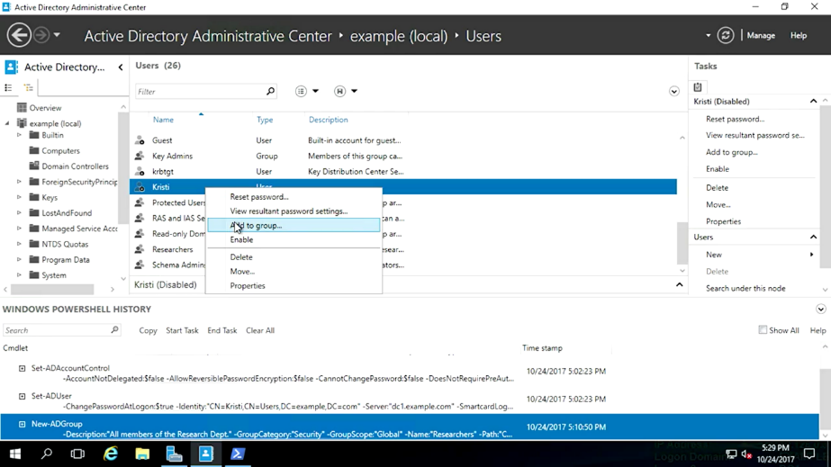

So, wuauserv is a short name for the Windows Update service. We can see that the Windows Update service is running and can get more information about it by running this next command, which is going to be Get-Service wuauserv and then I'm going to type in Format-List and asterisk. This will show us what type of service it is and how it's configured to run. It's a good way to get additional information on a service you're interested in.

As with Linux, any user can query the status of a service but only administrators can start or stop a service. If you try to do the next steps with a normal user shell you won't be able to run the commands.

Now, let's try stopping the service and then checking the status. For this, I'll open an administrator PowerShell and run the Stop-Service command. So I'm going to go into my Start and instead of clicking on it, I'm going to right-click and then type in run as administrator. Yes, to the security control.

So, now I'm going to go ahead and type in Stop-Service wuauserv. Next, I'm going to type in Get-Service wuauserv. So, this service has been stopped.

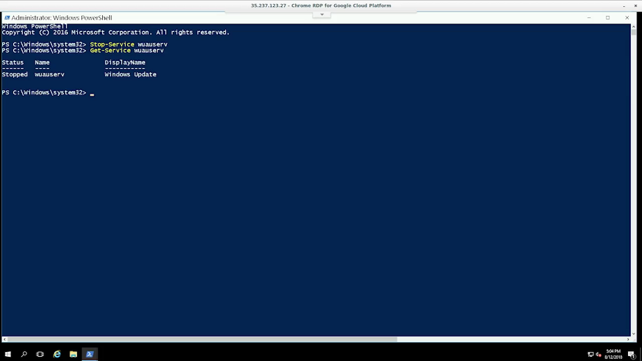

In order to start it back up, we execute the Start-Service command, which I'm going to do Start-Service wuauserv to start the service.

Then I'm going to type in Get-Service to show that the service is now running. Finally, you can list all services that are registered in the system using the Get-Service command.

We can also perform these same actions graphically using the services management console. So, I'm going to go ahead and click on start. This console shows us all the services in the system. The ones that are running will say running in the sales column, while the ones that aren't running won't say anything in the status column.

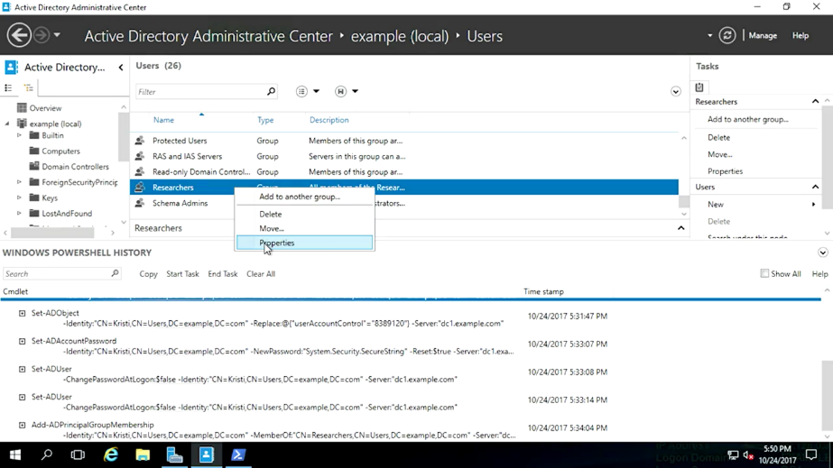

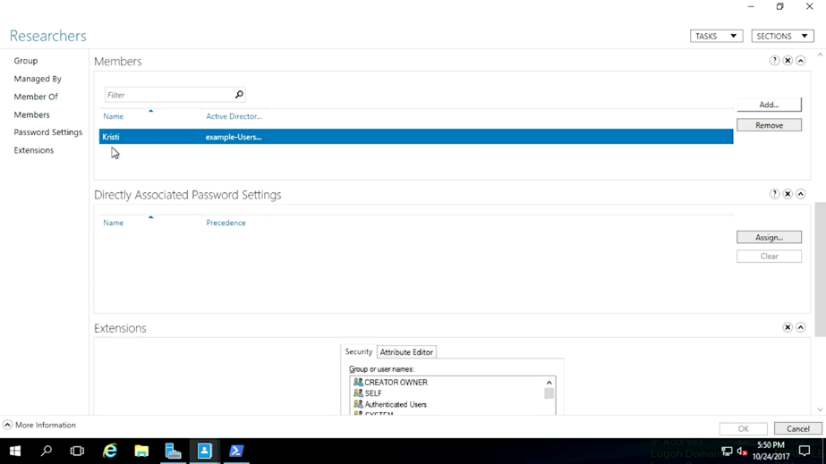

We can find the Windows Update utility at the end of the list. We can stop it by right-clicking on it and then hitting stop and then right-clicking again and hitting start. There you have it. That's how you get the status Stop and Start services in Windows.

### Configuring services in linux

On top of knowing how to query the status, stop, and start services as a system administrator, you have to know how to configure services to meet the needs of your organization. For example, if you're running a DNS server, you'll need to configure the DNS zones that you want to serve. If you're running a Web server, you'll need to configure the different sites and Web applications that you'd like to have enabled. And in general, you'll want to apply any specific security and backup policies to all your services. The details will depend a lot on the operating system and the service, but let's talk about the basics that you'll need to know for all services.

Most services are enabled as soon as you install them. These are programs that are shipped with the defaults that are good enough to safely start serving right away, but not all services can provide default values that are suitable for everyone. In some cases, you will need to edit the configuration files before the service can go live.

On Windows, most of the configuration is stored in the registry. This can be modified using graphical wizards or using the set service command. On Linux, the configuration files for the installed services are located in the /etc directory.

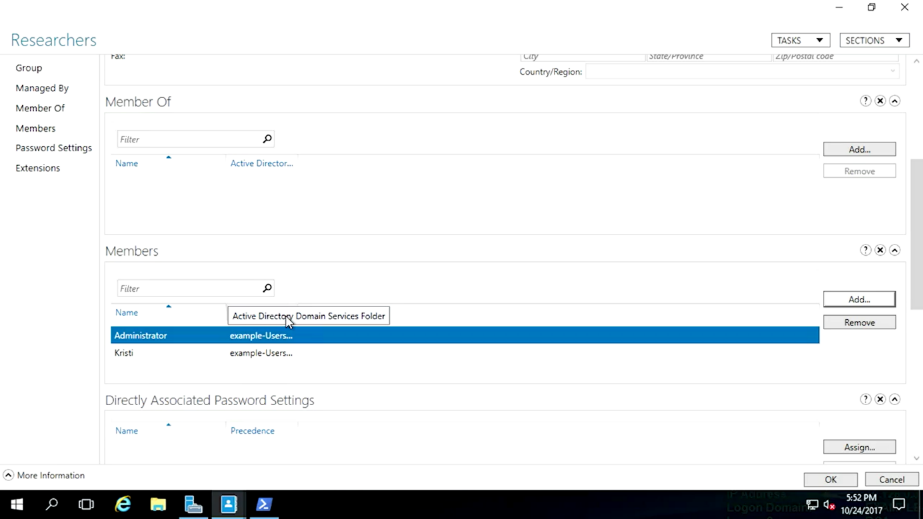

And while some software may ship graphical configuration editors, you typically have to edit the configuration files with a text editor. Let's experiment with a simple ftp server called vsftpd, a service that gets enabled by default when installed.

So I'm going to go ahead and type in sudo apt install vsftpd to install the service. Once it's done installing, the service is already running.

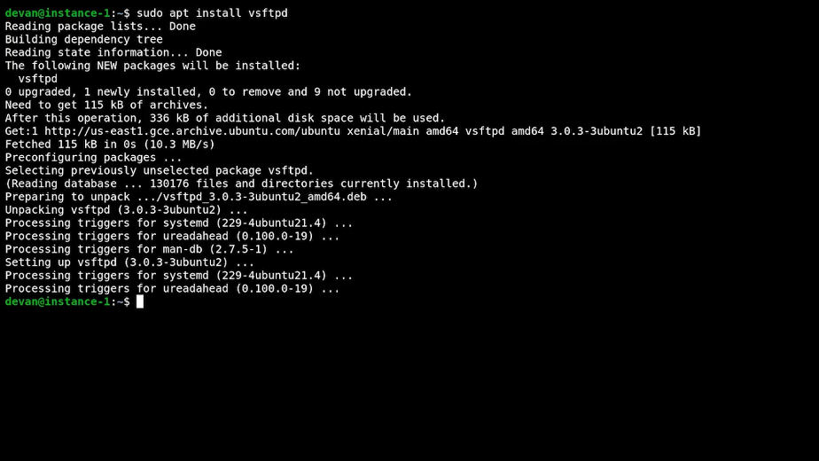

We can query the status of the service by running service vsftpd status, and see that it's running. This tells us that the service is already running. We can also verify that it's running by connecting to the ftp server with an ftp client.

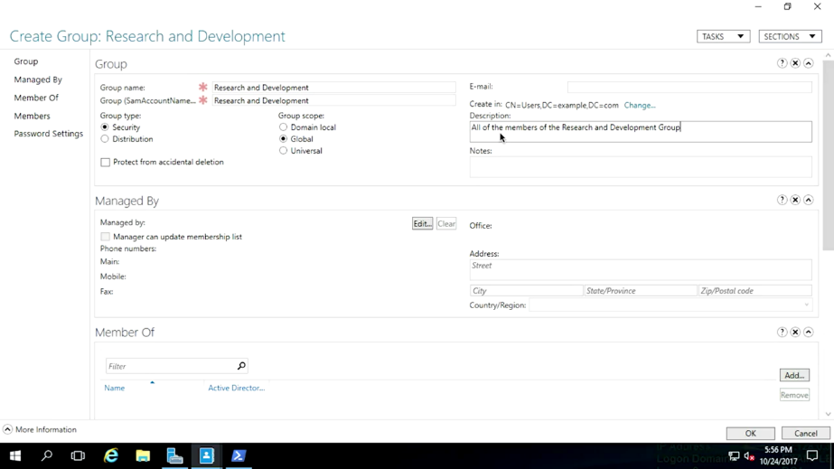

To do this, I'm going to go ahead and type in lftp localhost. Lftp is an ftp client program that allows us to connect to an ftp server. When we tell it to connect to local host, it'll try to connect to the ftp server running on local host.

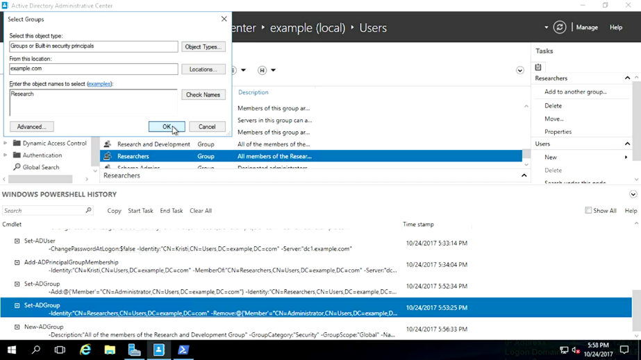

Now, let's try to run the ls command to list the contents of the current directory. So I'm going to type in, ls. And then type in exit.


This is failing because it's requiring a username and password, and we aren't providing them. It makes sense that the default behavior of the ftp server is to be locked down. If we really want to enable anonymous connections, we'll have to do that explicitly.

Let's modify the configuration file to allow anonymous connections. To do that, I'll edit the configuration file for this service that's located in the /etc/vsftpd.conf to change the anonymous enable setting from no to yes.

So I've got sudo vim /etc/vsftpd.conf, this will open up my config file.


And then I want to go ahead and change the anonymous_enable from no to yes, save my configuration file.


By changing the value of the anonymous_enable setting from no to yes, we're telling the ftp server program that we won't allow anonymous connections. We've made the change but we aren't done yet. If we try to connect again, ls will still fail. Ls. It failed, and then we hit exit.

This will also happen with other services because most services read their configuration when they start, and then keep it in memory while they're running. In order for our service to re-read the configuration, we need to tell it to reload.

Reloading means that the service re-reads the configuration file without having to stop and start. That way, ongoing connections aren't interrupted, but new connections will use a new configuration.


Let's do this for our ftp service, so I type in sudo service vsftpd reload. Once we've done this we can try to connect again, and this time executing at last will succeed. Let's see, it worked.


### Configuring services in windows

We've now seen how to start, stop, restart, modify configuration and reload this configuration for Linux services. Let's look at how you can do something similar using Windows.


For this example, we'll be using Internet Information Services, the feature offered by Windows to serve web pages. First, we'll need to enable this feature. We'll use the "Turn features on and off" option in the Windows Control Panel. So, I'm going to go ahead and click "Start", "Control Panel", click on the "Turn Windows features on and off."


This opens the Server Manager which we can now use to enable Internet information services. So, I'm going to go ahead and click on "Next", "Next" again, "Next" again, so a total of three times. I'm going to go ahead and scroll down and look for Web Server, IIS. I'll click on that.


I'm going to click "Add features". Click "Next", click "Next" again, "Next" again, "Next" again, and then hit "Install".


I've selected the web server option to have this service enabled on this Windows Instance. It's now installing all the necessary pieces to enable a web server on this machine. It's now done installing. When we close this window, we notice that there is a new option on the service manager called IIS.

We see here that we have an IIS service running on this server. We can configure this service by right-clicking on the entry and then selecting "Internet information services manager". Then, I'm going to expand on our server and then click on "Sites". These are the websites that are handled by the service.


Currently, there's only one called default website. Let's see what this website looks like by navigating to localhost. So I'm going to go ahead and click on "Internet Explorer" and type in "localhost". Great! Our server is serving the default website.


Now, let's add a different website to it. We go back to our Windows Information Services. I've created an example site and stored it in "My documents" folder.


Now, I'll copy this example site into the inetpub directory, which is the directory normally used to serve websites when using IIS. So I hit copy. Then, I'm going to go into the Inet directory C:/inetpub. Now, I paste that example folder for my documents to the Inetpub directory and then hit "Continue" in the Security Control.


All right, I've copied my website, now let's enable it in the IIS Manager console. So, let's go back to the console. I can add a new website by right-clicking on the list of websites and selecting the "Add website" option. I'm now presented with a bunch of options that I need to fill in. Let's select example as the name of my website.


Let's select the folder that I just copied as the physical path for the website. Finally, let's select 8080 as the port. This last one is so that the default website can run in the default port, port 80, while our example website can run in a separate port.


All right, I set up the new website. IIS tells me that the website is already up and running. Let's see if that's correct. I'm going to go ahead and click on "Internet Explorer", type up "localhost" and type in colon port 8080, and hit enter. Success. We've added a second website to our webserver.


We've now seen how to install, manage and configure Linux and Windows services. In the next quick lab exercises, you'll be able to try these actions yourself. Have fun.

## Configuring network services

### Configuring DNS with DNSMASQ

In large enterprise deployments, you probably have different programs serving each of the networking services that we covered in this module. In smaller set-ups you may be better off having a centralized solution that handles all services.

Let's look at dnsmasq; a program that provides DNS, DHCP, TFTP and PXE services in a simple package. This will let us do some hands on configuration of these services even if it's not as complex as other networking solutions.


Let's start by installing dnsmasq in this machine. So, I'm going to type in sudo apt get install dnsmasq. Once we've installed dnsmasq it's immediately enabled with the most basic functionality.


It provides a cache for DNS queries. This means that you can make DNS requests to it, and you'll remember the answer so your machine doesn't need to ask an external DNS survey each time you make the query. In order to check this functionality, we'll use the dig command, which lets us query DNS servers and see their answers.

So, let's ask our DNS server running in local host for the address of www.example.com. We do this by running dig www.example.com @localhost. The part after the at sign indicates which DNS server we want to use. Here, we have the reply from our query.


Our DNS server is telling us the IP address for the domain example.com.


How do we know that this query was actually answered by the service the machine is running? We can run the service in debug mode so we get more information about what's going on behind the scenes. This isn't how you would normally run the service, but it's useful for understanding what's happening.

So, let's stop the dnsmasq service that's running, and then start it in debug mode. So now, I'm going to type in sudo service dnsmasq stop, then type in sudo dnsmasq the -d and then pass the -q. By passing d and q, we're telling dnsmasq that we want to run it in debug mode and that we wanted to log the queries that we execute.


When it starts, it prints in the compilation options that are enabled and the configuration files that are used. Now, we can query again with our friendly dig command. If we run the command again, we will get the same answer and we'll see the debug output in the dnsmasq console. So, in my second console now, I'm going to go ahead and type in dig www.example.com @localhost. This is showing us that our dnsmasq service received the query, forward it to the configure DNS server and then reply to the original machine.


If we query for the same host name again, we'll see that instead of asking the other DNS server, dnsmasq replies with the cached query. So now my second console. I'm going to type in, again, dig www.example.com @localhost. So, if I hit enter, for now a dnsmasq is operating as a simple caching DNS server. But we can make it do more than that.


For example, we can give it a list of host names and IPs and had this service give authoritative answers for them. You might remember that when trying to resolve a host name to an IP, they can be servers that store the information about the mappings, which can then provide the authoritative answers while other servers will only be able to forward and delegate the queries to the server that had the information. These files have the same format as the exe host file. I created this file that lists the internal host that I want to be able to resolve.

So, I'm going to type in cat myhosts. As you see, it's a very simple format. You just had to list which IP is associated with each host.


We use the h parameter to tell us dnsmasq that we want to include this list in the information being served. So, I'm going to cancel this, clear and I'm going to type in sudo dnsmasq -d -q -H myhosts. Now that we have our list of host loaded, let's query with dig.


So now, my second console. I'm going to type in dig oxygen.local @localhost. As dnsmasq is authoritative about this host, there's nobody to forward the question to. It also lists which file is using to get the information need.


Finally let's see what the output looks like when we ask for information that it doesn't have. So I'm going to type in dig hydrogen.local @localhost. We see that it replied that the authoritative service are the root servers but that I couldn't find any results. What did the running dnsmasq say?


Since the requested name isn't in the list of hosts known to our DNS server, it forwarded the query to the configure DNS server. The reply for that was NXDOMAIN which means none existent domain.While dnsmasq is as simple as it gets, you've now seen what a DNS server looks like in action. Cool, right?

### Configuring DHCP with DNSMASQ

We've seen how to use dnsmasq to serve DNS queries, but as we mentioned before, dnsmasq can also be used for other networking services. Let's look at how it can be used as a DHCP server.

A DHCP server is usually set up on a machine or a device that has a static IP address configured to the network interface which is being used to serve the DHCP queries. That interface is then connected to the physical network that you want to configure through DHCP, which can have any number of machines on it.

In real life, the DHCP server and the DHCP client usually run on two separate machines, but for this example, we'll be doing a simulation on one machine so that you can experiment with a similar set-up in the upcoming quick lab exercises.

In this machine, we have an interface called eth_srv, that's configured to be the DHCP server's interface. So, now I'm going to type in ip address show eth_srv.

This command shows us that this interface has the 192.168.1.1 IP address. The slash 24 part indicates that this IP is in a network that goes from 192.168.1.0 to 192.168.1.255.


If this isn't clear, you may want to review the lessons on IP addressing in the networking course. The interface also has an IPV6 address configured, but we won't go into IPV6 for this example.

We also have an interface called eth_cli, which is the interface that we'll use to simulate a client requesting an address using DHCP.


This interface doesn't have an IP configured yet. So, I'm going to type in ip address show eth_cli. We can see that this interface doesn't have an IPV4 address configured. We will change this by using our DHCP server. To do this, we need to provide additional configuration to dnsmasq.


There are lots of things we can configure. We're going to use a very basic set of options. Let's look at the configuration file. So, I'm going type in cat DHCP config. The interface option tells dnsmasq that it should listen for DHCP queries on the eth_srv interface.


The bind interfaces option tells it not to listen on any other interfaces for any kind of queries. This allows us to have more than one dnsmasq server running at the same time each on its own interface.

The domain option tells the clients, the networks domain name and will be used for querying host names.


Then, we have two different DHCP options, which are additional information that will be transmitted to DHCP clients when the IP is assigned. In this case, we're telling clients what to configure as a default gateway and which DNS servers should be used. There are a lot more options that we can set, but these two are the most common ones.


Finally, we configure the DHCP range. This is the range of IP addresses that the DHCP server can hand out.


Depending on your specific setup, you may want to reserve some of the addresses in your network for machines that need to have a static address. If you don't plan to do that, you can make the range larger, but make sure you don't include the address of the DHCP server itself.

The last value in the DHCP range Line is the length of the lease time for the IP address. In this case, it's 12 hours, which means that once an address is assigned to a machine, it will be reserved for that machine for those 12 hours. If the lease expires without the client renewing it, the address can be assigned to a different machine.

All right, we've gone through the configuration file. Let's tell dnsmasq to start listening for queries using this config. So, now I'm going to type in sudo dnsmasq -d -q -c DHCP config and then hit Enter. We can see in the output that dnsmasq is listening for DHCP queries on the eth_srv interface with the options that we set in our configuration file.


Now, let's run a DHCP client on a second terminal. So, I'm going open up the second terminal. Now, my second terminal, I'm going type in sudo dhclient -i eth_cli and then -v for verbose. We're using dhclient which is very common DHCP client on Linux. We're telling it to run on the eth_cli interface and we're using the -v flag to see the full output of what's happening.


Back in the networking course, we explained the whole process of DHCP client getting a DHCP lease and here, we see the packet's being exchanged and how our client got the IP address 192.168.1.80.


We also see that the DHCP client expects to renew the address before it expires.


Let's see how our interface looks now. So, now, I'm going to type in an ip address show eth_cli. Our eth_cli interface has successfully acquired an IP address.


Now, let's look at what dnsmasq printed when the request was made. We see the same packet exchange that we saw from the client, but dnsmasq also shows that it now knows the host name of the machine with the address 192.168.1.80 because dnsmasq also has DNS capabilities.


This means it will also provide this as an authoritative answer for local queries. So, now I am going to type in dig @localhost instance-1. With that, we've seen how dnsmasq can act not only as DNS server, but also as a DHCP server.


This setup was a simulation to show you what you can do with dnsmasq. As mentioned earlier, in real life you would have this on separate machines physical or virtual. If you want to test a set-up like this, you'd normally do that on a separate network from the production network. Remember, never test in production.

We caught a lot of information in this module. You've learned about the overall services needed an IT infrastructure. On top of that, you learned about the physical infrastructure services like remote access and virtualization that help your organization run more efficiently. You even learn about essential network services like DNS and DHCP along with the overall picture of what's needed to set up DNS for normalization, and why you'd want to do that. We've seen most of the services in action.

Now, we're going to let you practice with some quick lab exercises and test you on what you've learned. Don't forget you can always go back and review the material again if you want before you take the quiz. In the next module, we're going to cover two of the other IT infrastructure services; software and platform services. I'll see you there.
