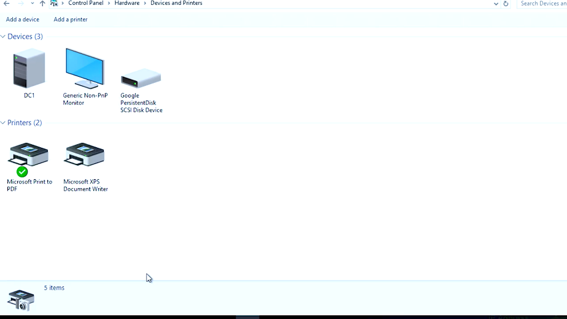
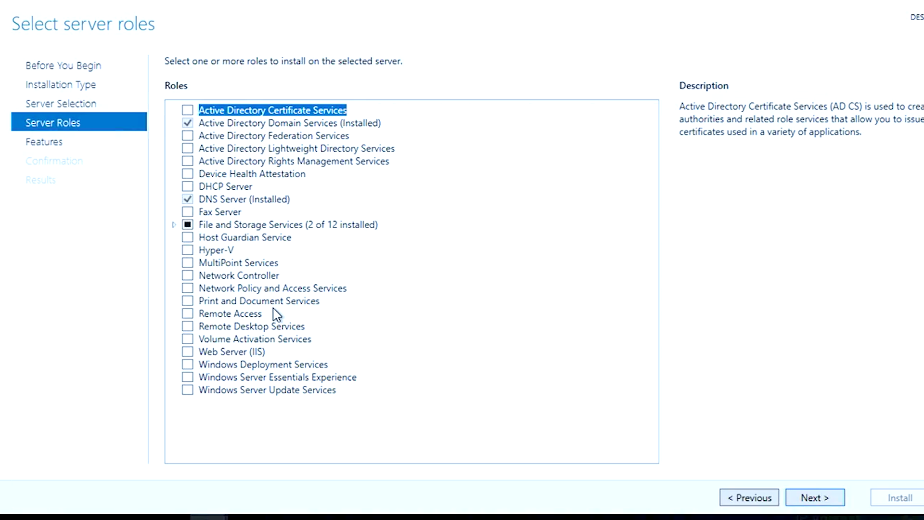
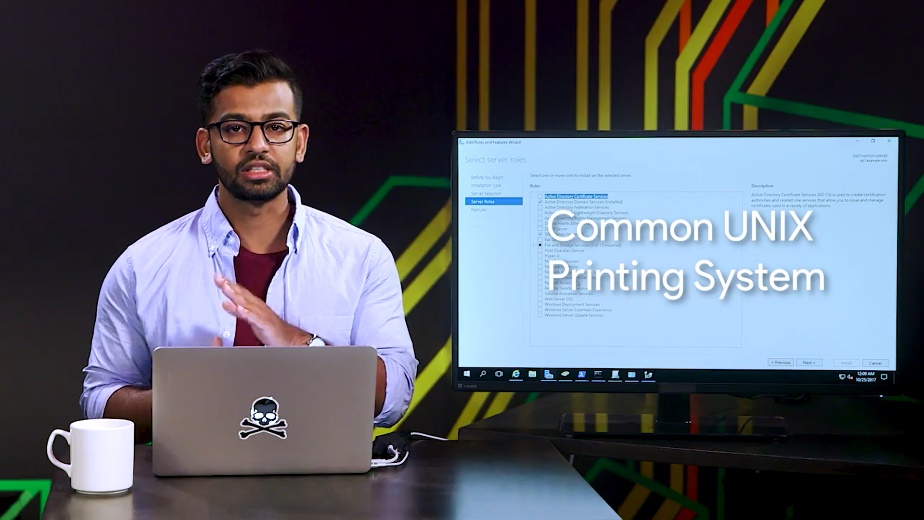

# Table des matières
- [1 Introduction to system administration and IT infrastructure services](#introduction-to-system-administration-and-it-infrastructure-services)
- [2 Network and infrastructure services](#network-and-infrastructure-services)
- [3 Software and platform services](#software-and-platform-services)
  - [3.1 Software services](#software-services)
    - [3.1.1 Module introduction](#module-introduction)
    - [3.1.2 Configuring communication services](#configuring-communication-services)
    - [3.1.3 Configuring email services](#configuring-email-services)
    - [3.1.4 Configuring user productivity services](#configuring-user-productivity-services)
    - [3.1.5 Configuring security services](#configuring-security-services)
    - [3.1.6 Heather managing self doubt](#heather-managing-self-doubt)
  - [3.2 File services](#file-services)
    - [3.2.1 What are file services](#what-are-file-services)
    - [3.2.2 Network file storage](#network-file-storage)
  - [3.3 Print services](#print-services)
    - [3.3.1 Configuring print services](#configuring-print-services)
  - [3.4 Platform services](#platform-services)
    - [3.4.1 Web servers revisited](#web-servers-revisited)
    - [3.4.2 What is a database server](#what-is-a-database-server)
  - [3.5 Troubleshooting platform services](#troubleshooting-platform-services)
    - [3.5.1 Is the website down](#is-the-website-down)
  - [3.6 Managing cloud resources](#managing-cloud-resources)
    - [3.6.1 Cloud concepts](#cloud-concepts)
    - [3.6.2 Typical cloud infrastructure setups](#typical-cloud-infrastructure-setups)
    - [3.6.3 When and how to choose cloud](#when-and-how-to-choose-cloud)

# Introduction to system administration and IT infrastructure services

# Network and infrastructure services

# Software and platform services

## Software services

### Module introduction

Welcome back. In the last module, we learned about the physical infrastructure and network services that are used in an IT organization. In this lesson, we're going to discuss the other services that make up an IT infrastructure. The software and the platform services.

Software services are the services that employees use that allow them to do their daily job functions. This can include applications like word processors, Internet browsers, email clients, chat clients and so on.

Platform services provide a platform for developers to code, build and manage software applications. This way, developers don't have to deal with operating system maintenance and other services that are needed to use for the platform tools.

When managing IT infrastructure, it's important that you implement software services for your users to enable their productivity. Depending on what type of company you might manage, you may also need to manage platform services for software developers.

### Configuring communication services

Software services include a wide range of functions. We'll cover the major ones here. First up is communication services, which enable employees in a company to talk to one another. Then, the security services, which add a layer of security protection to our IT infrastructure. We'll also discuss user productivity services and some of the aspects of managing software in a business that you'll probably have to think about in your work.

There's lots of software out there that's used for inter-company communication, like email or phone communication. These are important communication services, but in this video we're only going to discuss software that's used in instant communication.

Instant communication has drastically changed how we communicate in both our personal lives and in the workplace. We can have multiple conversations with different people in real time using chat applications. You probably use something like Facebook Messenger on your smartphones to chat with your friends. In a business setting, there are similar methods of instant communication.

The first is Internet Channel Relay or IRC, which is a protocol that's used for chat messages. IRC operates in a client and server model, so lots of IRC client software can be used to connect to an IRC server. IRC was widely used in the 1990s as a way to facilitate all kinds of chats, group chats, individual chats, and more. It's not as widely used today, given the wave of social media instant chat messages. But if you're considering setting up an IRC, it is a free alternative to other chat applications.

Paid for options are another method of instant communication. There are a lot more sophisticated and advanced chat applications out there that offer Enterprise support. A few popular options are HipChat and Slack. You can read more about these in the supplemental reading.

There are also other communication protocols called open IM protocols that are widely used and integrated into different communication applications.

One of the most popular communication protocols is XMPP or Extensible Messaging and Presence Protocol. It's an open source protocol used in instant messaging applications and social networking services. XMPP is even used in Internet of Things applications, among other things.

A few popular and free applications that use XMPP are Pidgin and Padium. Feel free to check out more about these alternatives in the supplemental reading right after this video.

Instant communications is a fantastic tool you can use to promote team collaboration and efficiency. When managing an IT infrastructure, it should be one of the communication services that you consider implementing for your organization. They'll definitely thank you, maybe even over instant communication.

### Configuring email services

One communication service that you're almost guaranteed to use today is email. We use email for a wide range of communication. In an enterprise setting, it's important for a sysadmin, or a sole IT support specialist, to be able to configure email services for the company. To do this, you need to have a domain name set up for your company that you can use as your email domain, like devan@example.com. When you send or receive email, you want to use this email address.

There are two ways to set up email for a company. The first is to run your own managed server. Using this option, you set up the email service software on a server, then you create a DNS record for your mail server. There are different DNS records. Remember that the A record is used for hostnames, but for email servers we use MX, for the mail exchange record.

Email server setup can be one of the most complicated service to setup for a sysadmin. You have to get the email to actually work, protect your email addresses from spam, filter out viruses and more. If you'd like to learn more about setting up an email server, check out the next reading.

An alternative approach to setting up your own email service is to use an email service provider, like Google Suite. These service providers allow you to create email inboxes and more by paying a monthly fee for every user in your organization. This ties you into the Gmail webmail client, and allows you to access your email from anywhere, as long as you're connected to the Internet. Whatever option you choose, you'll have to understand the differences between email protocols when you setup your email accounts.

There are lots of email protocols out there, but we'll only do a rundown of the more common ones you'll hear about, POP3, IMAP, and SMTP.

Post Office Protocol, or POP version 3, is an email protocol that downloads email from an email server onto your local device. It then deletes the email from the email server. If you want to retrieve your email through POP3, you can only view it from one device. There are a few reasons why you might want to use POP3 to get your email. If you need to keep your email storage under a certain quota, POP3 is a good way to maintain that storage limitation. Another benefit of POP3 is privacy. Your email can only be seen from your local device. If storage limitations and security are a concern for you, you might want to consider using POP3 over something like IMAP.

Speaking of IMAP, or internet message access protocol, allows you to download emails from your email server onto multiple devices. It keeps your messages on the email server. This email protocol is one of the more popular ways to retrieve email.

Last up is simple mail transfer protocol, or SMTP, which is a protocol used for sending emails. While POP3 and IMAP and other protocols can be used to retrieve email, there's only really one email protocol for sending email, SMTP.

So there are lots of different email protocols that can be implemented, depending on the email software of you choose. You can read more about them in the supplemental reading.

Email service is critical for any organization. Companies needs to be able to contact clients and business partners and communicate internally. If you work in an IT support specialist role, where you're handling system administration tasks, you will need to weigh the pros and cons of a dedicated email server or a cloud email service, decisions, decisions, decisions.

### Configuring user productivity services

In any organization the software that employees need to do their job is the software that an IT support specialist managing IT infrastructure needs to provide. Depending on the organization, you might need to get your users things like software development programs, word processing, graphical editors, finance software, and so on.

Whatever software you provide, there are different things to consider when using it in a commercial setting that might not have crossed your mind when you've used a similar software personally. Remember when we discussed software licensing in an earlier lesson? When you use software, you're doing so under the agreement of the developer's license.

For example, when you use open source software, the license agreement usually says that it's free to use, share, and modify. When software is used as a consumer, agreements can say that only a specific person can use the software. In a business or commercial setting, most software distributors will have a separate agreement. In most cases, you can buy ten licenses, and any ten people in your company can use it. If someone leaves the company or doesn't need the software anymore, you can take their license and give it to someone else in the company.

When considering software licenses, it's important to review the terms and agreement, then move forward with whatever option works best for your company.

Things get a little more complicated when it comes to cloud software services. You might have to deal with some of the same stipulations and also think through whether to purchase added features for businesses and enterprises, like dedicated customer support. Whatever method you use to provide software, whether it's installing software on every machine or utilizing cloud software services, there's one thing to keep in mind. Software used as a consumer won't be the same as software used as a business.

### Configuring security services

The last software services that we'll discuss are security services. Security is super important to all organizations. It's integrated into pretty much all aspects of an IT infrastructure service. We'll dive deeper into this in the last course on IT security. For now, remember that there are lots of different security protocols that are put in place for all sorts of things, keeping data encrypted, authentication, etc. If you ever manage a web server that serves content to other users, you want to let them know that when they access your website, you're keeping their interaction with you as secure as possible.

Let's say that you have an online bank account that you're logging into. The URL will most likely begin with an HTTPS. Remember that HTTP stands for HyperText Transfer Protocol, which is used to format and transfer web content around the Internet.

When you enter in a URL, you notice that HTTP comes before everything else. HTTPS, or Hypertext Transfer Protocol Secure is a secure version of HTTP. It makes sure the communication your web browser has with the website is secured through encryption. HTTPS is also referred to as HTTP over TLS or HTTP over SSL. This is because there are two protocols that enables us to make our web servers secure.

The first is Transport Layer Security protocol, or TLS, which is the most popular way to keep communications secure over a network. TLS is widely used to keep web browsing secure, but it can be used in a lot of other applications, too. We'll do a deep dive into the technical details of TLS in a later course.

The second protocol is Secure Socket Layer protocol, or SSL. It's a way of securing communication between a web server and client. But it's pretty old and insecure, so it's been deprecated in favor of TLS. You may still see it today being used over the TLS protocol like SSL/TLS.

The two protocols are often used interchangeably. In fact, SSL version 3.0, was essentially TLS version 1.0. But TLS's new features and updates have made it more secure than SSL.

So if you're managing an organization's website on a server, how do you enable TLS on the server so that the site can be using HTTPS? Well, you need to get a digital certificate of trust from an entity called a certificate authority. The certificate authority grants a certificate to your website saying that it trusts that you control the web server. And verifies that you are who you say you are.

Once it does that, you can install the certificate on your web server. That way, when users visit your site, they'll see the HTTPS in the URL instead of just HTTP. You'll learn more about certificates and certificate authorities in an upcoming course. For now, think of certificates as a way to verify that something is trustworthy.

Security is an integral part of IT, and it's not just the responsibility of security engineers. Everyone should be thinking about security. And all layers of your infrastructure should have a layer of security built upon them. There are lots of other security software that you can add to your IT infrastructure, which we'll dive into in the last course. For now, it's a good idea to know the basics of keeping a web server secure with HTTPS.

### Heather managing self doubt

Knowing what I know now, the advice I would give my younger self is, do not be afraid to talk to people, because I'm very shy. And, I think also, my impostor syndrome tells me, "Don't look stupid, don't look stupid, don't ask dumb questions, don't ask silly questions, don't ask questions at all." And I think what I would tell myself is, "Do your research, do your reading, teach yourself, and educate yourself. Continue to do that." But, it will speed up the process so much faster if you can find somebody you trust to collaborate with, to learn with, and to really find that good mentor. So, as a student, you'll always have somebody that you can lean on. I have impostor syndrome every time I walk in the door. Every morning, "Gosh, I'm going to work at Google. I have a meeting with the following people. I can't believe I'm having a meeting with the following people." And again, I just try hard to focus on what I really want to get out of it, what I want the outcome to be, because, even if it goes spectacularly wrong, I'm still going to have learned something. Once you have a few past you, it's going to feel better. And you're going to understand what the successes look like and how you get them, and you'll be able to repeat those patterns over and over again. But, in the end, if you don't like doing that, or the outcomes don't sound interesting to you, find new outcomes because you will eventually find that thing that really drives you and that you're passionate about.

## File services

### What are file services

In the operating systems course, we discussed files in depth and how we use and modify them on our OSs. In this lesson, we're going to run down some of the file services we can use that will allow us to be productive as an organization.

Employees need to be able to share files with each other, whether that's to collaborate or exchange information. We talked about shared folders in Windows in the last course, but in this lesson, I'm going to talk about more scalable and efficient ways to share data, enter file storage services.

File storage services allow us to centrally store files and manage access between files and groups. You can set up a file storage server that will let users access a shared directory to modify or add files and much, much more.

In the next lesson, we'll go into depth on two of the more popular ways you can use to manage, store, and share files over a network. The other way to maintain a file storage service is by using a Cloud file storage provider. There are lots of providers that offer secure and easily managed file storage. You can read about some of the more popular ones in the supplemental reading. For now, let's see how to manage a file storage service ourselves.

### Network file storage

In the last course, we mentioned that very few file systems can be used across all major operating systems. FAT32 is a popular FAT system that's compatible with Windows, Linux, and Mac OSes. But it has severe limitations on the amount of data you can store on a volume.

What happens if you have multiple users that want to share files between each other? Well, they need to store the files somewhere and they need to be able to retrieve the files over a network.

Network file system, or NFS, allows us to do this. It's a protocol that enables files to be shared over a network. The FAT system is compatible on all major operating systems.

The easiest way to setup an NFS server is by using a Linux environment. You can install NFS server software that modify the configuration files for the directories that you want to allow shared access to. Once you do that, the NFS service will be running in the background of the server.

On each client machine that wants to access a server, you just mount the file system the way you would any other file system. Except, you'd use the host name instead of a physical disk device. From there, you can access the shared directory like you would any other folder in a computer. Check out the next supplementary reading for some examples of NFS server software you can configure for Linux.

NFS is a good solution to file sharing within the network, but as with anything on a network heavy usage will slow down the file system. While NFS works with all major operating systems there are still interoperability issues with Windows.

If your fleet consists mostly Windows machines you might want to look at using something like Samba. Samba services are similar to NFS since she can centrally share and manage files services. Also, all major operating systems can use a Samba file sharing.

The only reason you might want to consider Samba over NFS, is because it works better with Windows operating systems. It also includes other services that can be integrated with your organization like printer services, we'll talk about printer services in an upcoming lesson. One thing to note is that, you may hear the term Samba or SMB. These two are different. SMB is a protocol that Samba implements. You can read more about SMB in the supplemental reading.

Fun fact, when you create a Windows shared folder it's actually using the SMB protocol, Samba itself is a software service suite used for file services which you can also read more about in the supplemental reading.

There are lots of other file storage services that you can use and you can read more about them in, wait for it, the supplemental readings. A relatively affordable solution for FAT storage hardware is to use a network attached storage or NAS, pronounced NAS. Instead of setting up a dedicated server like you would other services. NASes are computers that are optimized for file storage. They usually come with an operating system best stripped down in order just to serve files over a network. They also come with lots of storage space.

Whatever method you choose, central file storage and management is an important part of I.T. infrastructure for any organization.

## Print services

### Configuring print services

I told you we'd cover printing services and here we are. While our world is moving more and more into the digital space, there are still aspects of our lives that require good old-fashioned paper. Many organizations still use printers, and as an IT support specialist, you have to manage them as you would any other device. If you have a printer at home, you probably connect it directly to your computer. Maybe you even print over your home network through Wi-Fi. Some small organizations can get away with this type of printer management, but most large organizations have lots of printers that need to be managed and large volumes of information that need to be printed.

When managing printer IT infrastructure, you need to have a place to centrally manage all your printers. You'll probably be running commercial printers that also can report diagnostics information like low toner levels. Along with managing print essentially, you'll also need to be able to deploy printer driver software so that your users can print from their computers.

There are a few different ways that printers can be managed. Setting them up really depends of how many printers you have and how many people are in your company.

In a small company with less than a hundred people, setting up one or two commercial printers should be more than enough. To set up a print server, all you have to do is install a print service on a server. Most of operating systems already come with a printer service readily available. For example, let's look at Windows.

In the Windows server operating system, there's a Print and Document Services that can be enabled. All you have to do is add your network printer to the service and install the drivers for those printers, nice and simple, right?

In Linux, a common print server that's usually pre-installed on machines is CUPS or Common UNIX Printing System, let me show you. CUPS allows you to easily manage printers from a simple web URL, you can read more about both the Windows print and document services and CUPS in the next reading.

When your print service set up, you need to add the printer to the client machine. Just search for printer server name, and connect to the device and start printing. There are lots of ways you can optimize this process. When you start learning about directory services, we'll take you through how to set rules up on machines so that the printer and their drivers are automatically installed on a client computer.

Another way you can manage printers is by using the cloud service provider. This allows you to manage your printers through a web browser. It also lets your users print through a web browser so no setup is involved on their machines. Printer setup is pretty easy to do. Most of it depends on what printer service you decide to go with.

We've learned a lot about software services in our IT infrastructure, from importing communication services to security and now printing. Let's keep charging ahead. In the next lesson, we're going to discuss platform services.

## Platform services

### Web servers revisited

Platform services provide a platform for developers to completely build and deploy software applications, without having to deal with OS maintenance, server hardware, networking or other services that are needed to use the platform tools. A web server that we deploy our web applications to, or the development software that we use to code our applications are both examples of platform services.

In this day and age. Most businesses have a digital presence. Whether that's a Web site that promotes their business, or even a website that is their business. Businesses that run web services keep their services stored on a web server. A web server stores and serves content to clients through the Internet. You can access web service using a domain name like Google dot com.

A web server itself stores web files and runs an HTTP service or HTTP server, that processes HTTP requests. Remember that HTTP is how the Web formats and transfer's web pages. You can think of the web server as the physical server that stores with files and the HTTP server software. When your web browser makes a request to fetch a web page from a URL, it sends an HTTP request that gets processed by the HTTP server. Then the HTTP server sends out and HTTP response with the content that you requested.

There are a lot of popular HTTP server software out there. But the most widely used is the Apache HTTP server, most commonly referred to as Apache. Apache is a free and open source. It helps serve a large percentage of web pages on the Internet. Let's actually see how a web server serves content to the Web. I'm going to install the Apache Web server software or my Linux computer here. You don't have to understand the specifics of the setup. I just want you to see how easy it is to run a web service.

So, let me go ahead and install Apache. So, I'm going to go ahead and do sudo. Apt get. Install. Apache. To. And then hit the flag. Yes to accept. All my packages.

Perfect. Now I will web server services running on our machine. We're actually able to start hosting web content.

The machine that we're hosting our content on is well, this machine right here. Remember that our computer has an IP address that's associated with itself 1 2 7 0 0 dot 1 or a hostname of localhost.

Localhost itself is reserved for this purpose. So, it's not possible to get the domain name localhost. So, now that we know our machines location, lets enter it to the web browser. And here it is, our local web server content running on our machine.

The files we see here, come with the default Apache installation. But if we want to upload our own web content, you can just navigate to the directory where this is stored, and replace it with our web content.

Remember, that since this contemn is hosted on our local machine. We will need to use DNS to let the world know that our web server exists. If you need a refresher on this, feel free to go back to the lesson on DNS services.

That's a quick rundown of how web servers work. You can read more about Apache and other HTTP servers in the next supplemental reading.

System administrators are responsible for creating the content that gets served. But they might be responsible for making sure that content is available. If you're an IT support specialist with a web service that needs to be manage, you should have a pretty good understanding of how it works.

### What is a database server

When you are in service that operates on the web, you need to have a web server that serves web pages that clients are requested, like we just covered. But you may also need to store information. Have you ever thought about what happens to your information when you create an account online for a website? Where do they store that info? Do they print a folder on a web server? If they do, you need to stop using that service immediately.

Customer information, like news articles, videos, large amounts of text, image or audio files generally get stored in a database. Databases allow us to store query, filter, and manage large amounts of data. When you build a web product, you'll probably store the data in a database.

Database servers consist of database software that's running that you're able to read and write from. Common database systems like MySQL and PostgreSQL are widely used in application and web development and data analytics.

These database systems usually require a knowledge of special languages or syntaxes to be able to parse and filter through the large amounts of data. If you want to dig deeper into database systems, check out the next reading.

Administrating and managing a database can be incredibly complex. Losing precious data could cost the company dearly. There's actually an entire job specialization within IT that deals with databases just like that called database administrators.

We won't talk about their role in this program, but if you're interested in learning more, you should know where to look, the supplemental reading.

## Troubleshooting platform services

### Is the website down

Web servers, and servers in general, are prone to breakage, just like any other machine. Troubleshooting a web server can involve lots of different variables. We won't discuss a specific troubleshooting scenario in this lesson, but we'll talk about some easy trouble shooting tools you can use to diagnose a faulty web server or browser called HTTP status codes.

When we want to go to Google.com our browser is sending an HTTP request to the HTTP server on the web server. In turn we get an HTTP response. Sometimes this response returns the content that we want. Almost all the time it'll return a status message of the response.

HTTP status codes are codes or numbers that indicate some sort of error or info messages that occurred when trying to access a web resource. Knowing common HTTP status code comes in handy when you're troubleshooting website error. They usually tell you useful information that can help you isolate the root cause.

Here's a common HTTP status code you might recognized. The dreaded 404 Not Found A 404 error indicates that the URL you entered doesn't point to anything.

Let's see what happens if I type in google.com/asdf, let's type that in. I get this error message. The requested URL /asdf was not found on this server. That is exactly what I expected to happen. I typed in an address, I knew didn't exist and the website confirmed it for me.

But, how do we know it is a 404 error code? Depending on the website HTTP error messages could be displayed right on the page when you try to access it. However, to be absolutely sure you can just view the HTTP response itself. To do that we'll have to do a bit of work.

Browsers today have built in tools that help people diagnose issues with the web browser or website itself. Since I'm using Chrome, I'm going to use a Chrome Developer Tools, let me go ahead and do that.

So, I want to click on this, I get into tools. And then click on Developer Tools. This will open up the Developer Tools side by side to my web browser.

Developer Tools is a great resource for testing and debugging issues with the website or browser. We won't go through this tool, though. If you want to learn more, you can check out the supplemental reading. For now, we just want to see the HTTP response code. To get to that, I'm going to go to the network type here and refresh my page. If I'm trying to go to google.com/asdf, I'll see the request I made in the left hand side here. If I clicked that, I'll see the status codes says 404 not found, pretty me, right?

HTTP status codes that start with 4xx indicate an issue on the client-side. The client try to do something that it couldn't, like enter a bad URL. Access something it was not authorized to do, etc.

The other common HTTP status codes that you might see start with 5xx. These errors indicate an issue on the server-side. The web server that hosts this web content is experiencing issues and hopefully their server administrators are looking into it.

HTTP status codes tell us more than just errors. They can also tell us when our request is successful, which is denoted by the codes that begin with 2xx.

HTTP status codes can tell us a lot about an issue with a website. If you encounter one you aren't familiar with, just look it up. They will probably tell you exactly what the issue is. For a list of HTTP status code, take a look at the supplemental reading.

Well, you have done it again, you have covered a lot of information in this module about software and platform services. You learned about IT infrastructure services that help a business stay productive, like communication services. You learned about security services that keep information secure between web browsers and servers. You also learned about platform services that are used to deliver applications to users.

Now, you can put that knowledge to the test in a short test we've cooked up for you. In the next module, we'll talk about managing users, computers, and policies, using directory services. You're doing an awesome job, I know covered a lot but stick with it you got this.

## Managing cloud resources

### Cloud concepts

Now that you know more about the different services you can host on a cloud provider, let's talk about how to make the most of the cloud for your organization. As we've mentioned in previous lessons, when we say that a service is running in the cloud, we mean that it's running somewhere else, either in a data center or in other remote service.

These data centers house a large assortment of machines, and different types of machines are used for different services. For example, some machines may have local Solid State Drive, SSD for increased performance, while others may rely on virtual drives mounted over the network to lower costs.

When you use Software as a Service or SaaS, the software is already pre-configured and the user isn't deeply involved in the cloud configuration.

If you choose a cloud email solution like gmail, a cloud storage solution like Dropbox or a cloud productivity suite like Microsoft Office 365, there are only a small number of options for you to select or customize. The cloud provider manages everything related to the service for you including; deciding whether VMs are hosted, ensuring that it has enough capacity to serve your needs, forming back as frequently and reliably and more.

When you use Infrastructure as a Service or IaaS on the other hand, you're hosting your own services in the cloud. You need to decide how you want the infrastructure to look depending on what you want to run on it.

For example, you need to decide which of the many available machine types you'll use and what kind of storage they'll need. Pro tip. Start small, then select more powerful instances as needed. When you set up cloud resources, you need to consider regions. A region is a geographical location containing a number of data centers.

Each of these data centers is called a zone, and each zone is independent of the others.

If one of them fails for some reason, the others are still available and services can be migrated without visibly affecting users.

Large cloud providers usually offer their services in lots of different regions around the world, and which region you choose will mostly depend on where your users are located. Smaller cloud providers may offer fewer regions but they may be the only provided with the availability in your city or country. It doesn't matter where exactly the data center is located, but users may experience more latency if it's further away from them.

You may also hear about public, private and hybrid clouds.

The public cloud is what we call cloud services provided to you by a third party. The name refers to the fact that the cloud providers offers services to the public.

When your company owns the services and the rest of your infrastructure, whether on-site or in a remote data center, we call that the private cloud.

And the hybrid cloud is a mixture of both public and private cloud.

Some workloads are run on servers owned by your company, while others are run on servers owned by a third party. The trick to making the most of the hybrid cloud is ensuring that everything is integrated smoothly, so you can access, migrate, and manage data seamlessly no matter where it's hosted.

### Typical cloud infrastructure setups

Let's say you have a web server providing a website to clients. In a typical setup for this kind of service running in a cloud, a number of virtual machines will be serving this same website.

A load balancer ensures that each VM receives a balanced number of queries. Whenever there's a request for your website, a different VM will be picked to serve the response.

These types of services are usually configured to spin out more virtual machines when there are lot of queries. And to shut down some of the VMs when the number of queries goes down.

This capability is called autoscaling. It allows the service to increase or reduce capacity as needed, while the service owner only pays for the cost of the machines that are in use at any given time.

Since some machines will shut down when the demand is lower, then local disks will also disappear and should be considered ephemeral or short-lived. If you need data persistence, you have to create separate storage resources to hold that data and connect that storage to the VMs. Usually, VMs operating websites or web services are connected to a database, also running in the cloud. This database is also served by multiple machines behind a load balancer. But this is managed by the cloud provider, and doesn't concern the cloud user.

To make sure the service is running smoothly, you can set up monitoring and alerting.

When you do this, you can detect and correct any problems with your service before your users even notice. Most cloud providers include monitoring and alerting solutions as part of their services. You can configure when and how you want to be alerted if the monitoring infrastructure detects performance issues.

It may seem tricky to set up cloud resources, but most providers make them easy to configure. We've also included some additional information in the supplemental reading to help you along.

### When and how to choose cloud

As an IT support specialist, you might have to decide when a cloud service is a better choice than using your own physical hardware. We've touched on this already, but let's dive deeper into what to consider when you're making this decision.

Using cloud infrastructure doesn't require a large upfront investment. So, it's a good choice if you aren't sure how long you need it. If you're setting up temporary infrastructure, or trying something that might not last, a cloud service may be your best option.

Choosing to use cloud infrastructure also makes sense when you have demand that varies greatly throughout the year. If you operate a website that gets a lot of traffic during one season, but much less for the remainder of the year, you wouldn't want to invest a lot of infrastructure just to have it sit idle most of the time.

Another reason to choose the cloud is geographical location. If your users, employees of your company, or external users of your services are distributed around the world, having all of your service on-site won't satisfy their needs. You want to use a provider that has datacenters in or close to the location that you want to serve.

Let's say you decided that your use case with the cloud model, how do you decide which of the many cloud providers to use? Take a look at your specific needs, and compare the services offered by the various providers, and then figure out which one best serves your needs.

Most cloud providers offer free trials, so it's a good idea to test them out to see if they meet your needs, to check how well your company's infrastructure integrates with the cloud providers.

Finally, the technology in this space is evolving quickly, there are more services and solutions offered by cloud providers every year, so make sure you're up to date about the latest changes in the field before making a decision. That's it.

Now you've got a better idea of what to think about when you want to move your services to the cloud. To help you practice these concepts, you'll be the one setting up the instances and the associated resource in the next quick lab exercises, instead of connecting to an already existing VM. Exciting, right?

Well, you've done it again. You've covered a lot of information in this module about software and platform services. You've learnt about IT infrastructure services that help a business stay productive, like communication services. You learned about security services that keep information secure between web-browsers and servers. You also learned about platform services that are used to deliver application to users.

In the next module, we'll talk about managing users, computers, and policies using directory services. You're doing an awesome job, I know we're covering a lot, but stick with it. You got this.
