# Table des matières
- [1 Introduction to system administration and IT infrastructure services](#introduction-to-system-administration-and-it-infrastructure-services)
- [2 Network and infrastructure services](#network-and-infrastructure-services)
- [3 Software and platform services](#software-and-platform-services)
  - [3.1 Software services](#_Toc14159749)
    - [3.1.1 Module introduction](#_Toc14159750)
    - [3.1.2 Configuring communication services](#_Toc14159751)
    - [3.1.3 Configuring email services](#_Toc14159752)
    - [3.1.4 Configuring user productivity services](#_Toc14159753)
    - [3.1.5 Configuring security services](#_Toc14159754)
    - [3.1.6 Heather managing self doubt](#_Toc14159755)
  - [3.2 File services](#_Toc14159756)
    - [3.2.1 What are file services](#_Toc14159757)
    - [3.2.2 Network file storage](#_Toc14159758)
  - [3.3 Print services](#_Toc14159759)
    - [3.3.1 Configuring print services](#_Toc14159760)
  - [3.4 Platform services](#_Toc14159761)
    - [3.4.1 Web servers revisited](#_Toc14159762)
    - [3.4.2 What is a database server](#_Toc14159763)
  - [3.5 Troubleshooting platform services](#_Toc14159764)
    - [3.5.1 Is the website down](#_Toc14159765)
  - [3.6 Managing cloud resources](#_Toc14159766)
    - [3.6.1 Cloud concepts](#_Toc14159767)
    - [3.6.2 Typical cloud infrastructure setups](#_Toc14159768)
    - [3.6.3 When and how to choose cloud](#_Toc14159769)

# Introduction to system administration and IT infrastructure services

# Network and infrastructure services

# Software and platform services

# Directory services

## Introduction to directory services

### Module introduction

Congratulations, you're almost done covering the essential IT infrastructure services involved in an organization. You're so close, you got this. In the last module, we learned about the software services used in organization like communication software, security, and file storage services. Then we talked about platform services involved in organizations that build a software product. Finally, we learned about some of the servers that support those organizations like web and database servers. In this module, we're going to learn about the last major IT infrastructure service, directory services. It's the beginning of the end. Ready? Let's jump in.

### What is a directory server

Have you ever looked up someone's phone number in a phone directory? Or use a directory listing at a shopping mall to find a specific store? A directory server essentially provides the same functionality. A directory server contains a lookup service that provides mapping between network resources and then network addresses.

It's used to organize and look up organizational objects and entities ranging from things like user accounts, user groups, telephone numbers, and network shares. Instead of managing user accounts and computer information locally on every machine, all that information can be stored on a directory server for easy access and management.

The ideal enterprise quality directory server should support replication. This means that the store directory data can be copied and distributed across a number of physically distributed servers but still appear as one unified data store for querying and administering.

Why is replication important? It provides redundancy by having multiple servers available simultaneously. So, there'll be minimal disruption to the service in the event that one of server explodes.

Replication also decreases latency when you access the directory service. By having replicas of your directory server located in each office, you're able to answer directory service queries more quickly.

The directory service should also be flexible, allowing you to easily create new object types as your needs change. Access to the information stored in the directory server database should be accessible from a variety of OS types and from the designated areas of the corporate network.

Directory services are useful for organizing data and making it searchable for an organization.

This is achieved through the use of a hierarchal model of objects and containers. The containers are referred to as organizational units or OUs, and they can contain objects or more organizational units.

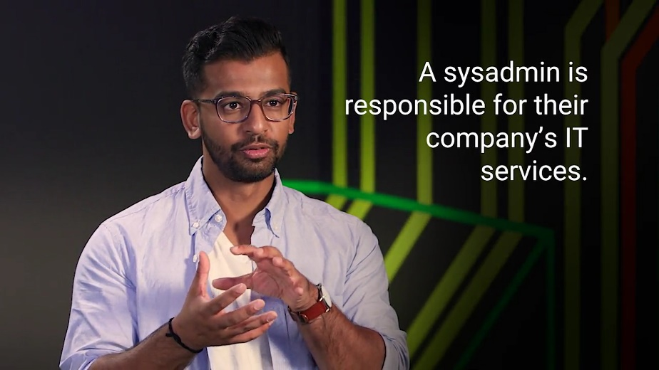

This is similar in organizational structure to a file system. OUs are like folders which can contain individual files or objects for a directory service. OUs can also contain additional folders. The management benefits of this structure are pretty clear. Can you imagine trying to keep your music library organized if there was no such thing as suborders? Crazy.

This hierarchal structure can be used to convey additional information about what's stored within. Take your directory structure as an example. You may have an OU code users which contains all user accounts. Within this OU, there could be additional OUs which represent the actual team structure of your organization. The user's OU could contain additional OUs like sales, engineering, marketing which include the user account objects for the individuals that belong to these current teams. This structure can be used to convey differences between these sub-OU sub-users.

For example, we could influence stricter password requirements for members of engineering without affecting sales or marketing. Submembers inherit their characteristics of their parent OU. So, any changes made to the higher level user's OU would affect all sub-OUs, including sales, marketing, and engineering.

Someone with the responsibilities of a systems administrator, whether that's a system admin or I.T. support specialist, would be responsible for the setup, configuration, and maintenance of the territory server. This includes the OS itself on which the directory service would run. Standard OS management tasks are involved here, like ensuring that updates are installed and configuring standard services.

Other responsibilities include the installation and configuration of the directory service itself. So, installing the service and configuring any related services. If multiple servers are used in a replication setup, this needs to be configured, too. It's very likely that the hierarchy in overall structure of the directory itself would also be up to business admin to design and implement.

Well, that covers the high level overview of what exactly a director service is. We'll dive deep into more specific details later in this course. But for now, let's review some of the concepts we just covered with a short quiz. Then list me back at the next video where we'll do a more detailed rundown on how to implement directory services.

### Implementing directory services

Directory services became an open network standard for interoperability among different software vendors. In 1988, the X.500 directory standard was approved and included protocols like Directory Access Protocol or DAP, Directory System Protocol or DSP, Directory Information Shadowing Protocol or DISP, and Directory Operational Bindings Management Protocol or DOP.

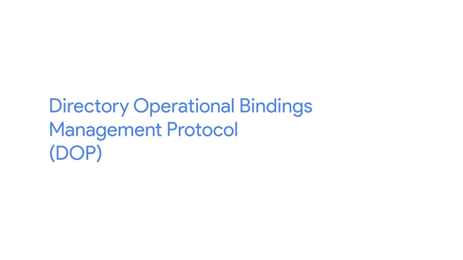

Alternatives to DAP were designed to allow clients to access the X.500 directory.

The most popular of these alternatives was lightweight directory access protocol or LDAP.

Since these are open standards for communication and access for directory services, a bunch of different implementations of these services cropped up. There are offerings from Apache, Oracle, IBM, and Red Hat, but we'll cover two in more detail later in this module.

The first is Microsoft's implementation, which is referred to as Active Directory or AD. It has some customization and added features for the Windows platform. There are also open source implementations of directory services using LDAP.

A popular example of this is OpenLDAP, which we'll also cover in greater detail. OpenLDAP supports a wide range of platforms like Windows, Unix, Linux and various Unix derivatives.

In addition to the server software, there are also client tools used for accessing and administering a directory server, Microsoft Office Active Directory Users and Computers or ADUC, which works well with Microsoft Active Directory Server. There are also other more open tools that can be used to interface with a lot of other directory server implementations.

Along with clients for administering and managing a directory server, there are also client applications that can interface with and query a directory server. All major OS platforms support integrating into a directory server for log in and authentication purposes. The advantage here is that this allows for centralized management of user accounts. We'll cover the details of centralized management in the next lesson, so don't worry too much about that right now.

When looking at specific implementations for your directory server, you'll want to consider OS support, not just the server they'll be running the directory service itself, but also what OS is your client fleet runs and the compatibility or support for you directory services. You can read more about why this is important in the next reading.

## Centralized management

### What is centralized management

The job of the systems administrator is to, well, administer systems. Sysadmins have a set of systems they're responsible for. And they have to manage those systems so they're available to serve their function to the organization.

For example, as a sysadmin, I might be responsible for making sure that all of the servers in my network are kept up to date with security patches and application updates. Should I go around and log into each server, checking each one at a time? What if I need to manage user accounts on end user devices? Should I go to each employee's desk and set their account up that way?

I guess I could, but that would be super time-consuming, and probably inconsistent. Instead, what I want to do is use centralized management, a central service that provides instructions to all of the different parts of my IT infrastructure.

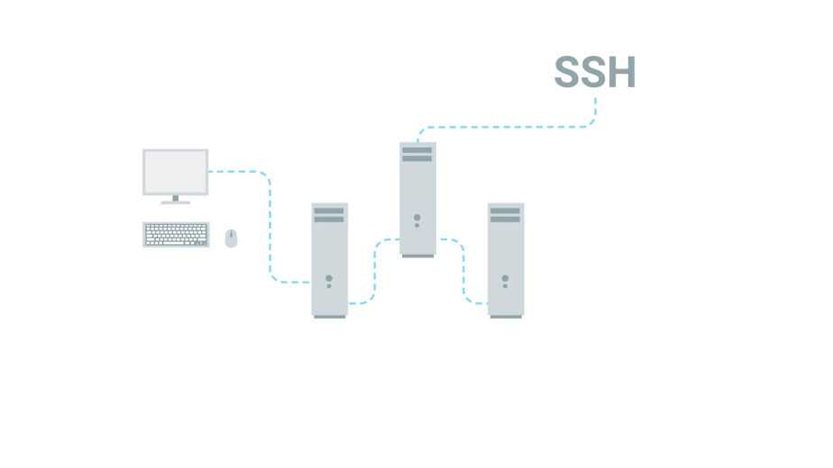

Directory services are one of these services. Remember in earlier lessons when you created accounts and gave them access to resources on your computer? Imagine that you worked for an organization that has dozens, hundreds, or even thousands of computers and people who use them. You can't possibly go into each of those computers to set them up.

Directory services provides centralized authentication, authorization, and accounting, also known as AAA. When computers and applications are configured to use directory services, or AAA services, decisions about granting or denying access to computers, file systems, and other IT resources are now centralized.

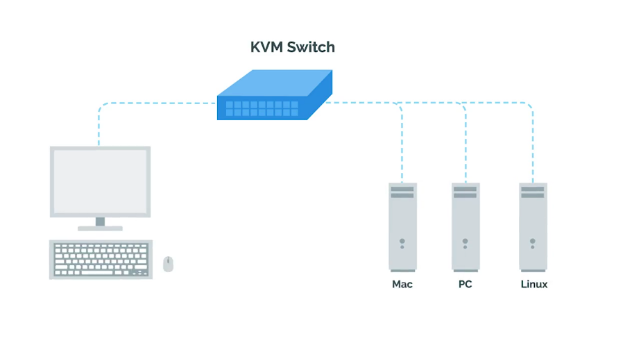

Now you can create a user account once, and it's available for the entire network at once. Easy, well, sort of. You will learn a lot more about AAA services in an upcoming course. For now, you should understand that your directory service will be responsible for granting or denying access to computers, file systems, and other IT resources.

Now let's go one step further. Let's say you have a network file system that you need to give everyone in the IT department access to. You could set up the network share, then give it a list of user accounts to grant access to the share. But what happens when someone new joins the IT department? What about when someone leaves?

Instead of granting access based on who you are, what if you granted access based on what you do? In most organizations, access to computer and network resources is based on your role in the organization. When you manage access to resources on a computer and on the network, you'll often grant and deny access based on user groups. User groups can be used to organize user accounts in all sorts of ways. You might create groups of buildings that people work out of, or the person's role in the organization, or really almost anything else.

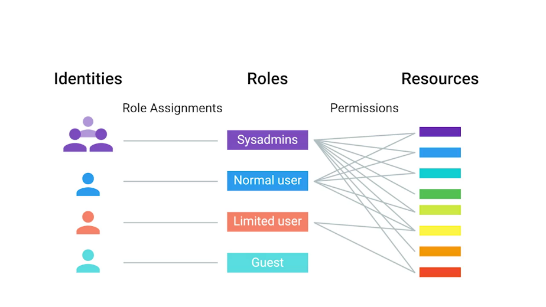

What's important is that you use groups to organize accounts based on the way that you'll manage them. If you are a systems administrator, then you might have permission to do things like creating user accounts and resetting passwords. You are allowed to do that because of your role as a systems administrator.

If you add another systems administrator to your organization, you don't want to have to find out all of the things that a sysadmin should have access to, then grant them individual account access to each of those resources. That would just take forever.

Instead, we'll create a group of sysadmins and add all system administrators to that group. Then we can give the systems administrators' group access to any resources they need. If you or another person change roles in the company, then all you have to do is change the groups that you are a part of, not the rights that you have to directly access resources. We call this role-based access control, or RBAC.

Controlling access to resources isn't all you can do. You can also centralize configuration management.

Just like you don't want to run around to every computer to configure user accounts, you wouldn't want to do that to setup printers, configure software, or mount network file systems. By centralizing the configuration management of your computers and software, you can create rules about how things should work in your organization.

There are many ways to centralize your configuration management. And an easy way to get started is with as simple a tool as logon scripts that run each time someone logs on to a computer. Later in this module, we'll look at Active Directory and its group policy objects, which are a way to manage the configuration of Windows machines.

There are also dedicated configuration management frameworks, like Chef, Puppet or SCCM, that can be used for super simple or super powerful configuration management. These are outside the scope of this module, so check out the supplemental reading right after this video for more information.

## LDAP

### What is LDAP

Before we jump into directory services, let's talk about the underlying protocol that's used in directory services called LDAP or lightweight directory access protocol.

LDAP is used to access information in directory services like over a network.

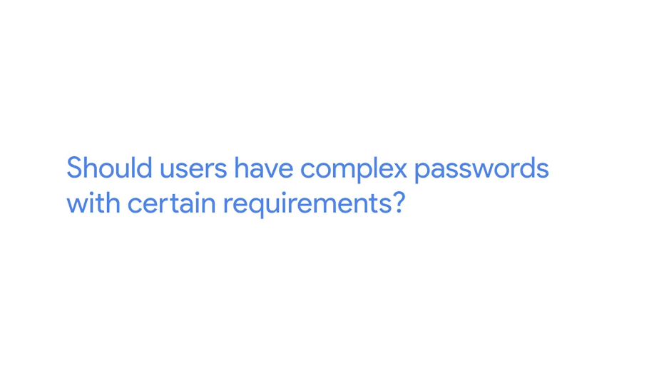

Two of the most popular directory services that use LDAP are active directory and openLDAP, which we'll talk about more in upcoming lessons.

There are a lot of different operations you can use in LDAP. You can add a new entry in the directory server database like creating a new user objects called Cristi. You can delete an entry in the directory server database. You can modify entries and much, much more.

When we say entry, we're reffering to the LDAP entry format or LDAP notation for records in the directory service. An LDAP entry is just a collection of information that's used to describe something.

Take a look at this example. Don't worry too much about what this says. The format of LDAP entry basically has a unique entry name denoted by dn or distinguished name, then attributes and values associated with that entry.

So, CN is the common name of the object. In this case, since it's a person, we use Devan Sri-Tharan as the name.

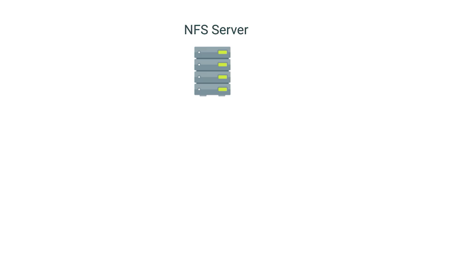

OU is the organizational unit such as a group. And in this case, Sysadmin is used.

DC is the main component. So example.com is split into example then com.

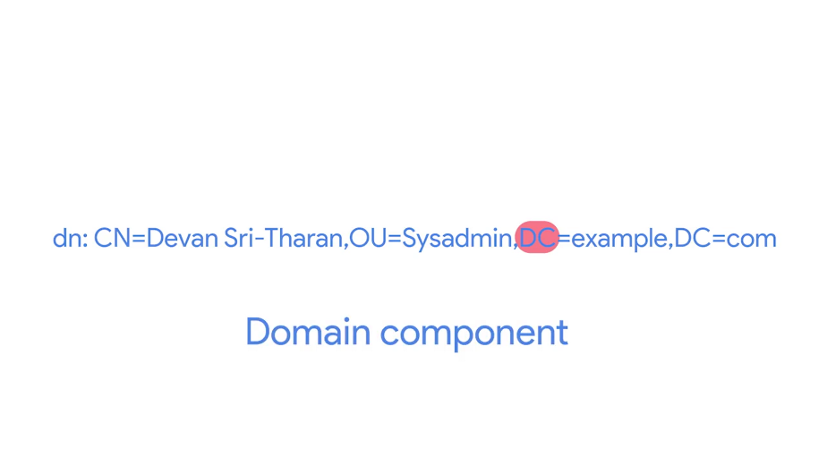

Again, it's not necessary to remember these attributes. You can reference them in the next reading. The takeaway here is that LDAP notation is used for entries in directory services to describe attributes using values.

### What is LDAP authentication

If were around when phone books were used, you might remember that these big old books contained the names, addresses, and phone numbers of people in your neighborhood or community, who wanted the information to be publicly listed.

This is way different from the phone book or contact list you have in your mobile phone. The people who are in your contacts directory gave you their phone numbers for your use only. When using LDAP, there are different authentication levels that can be used to restrict access to certain directories, similar to those big public phone directories or those private mobile phone directories.

Maybe you have a directory that you want to make public so anyone can read the entries in the directory or maybe you just want to keep that data private to only those who need it. We'll discuss how LDAP does this authentication and what methods it uses.

We talked about the different operations you can do with LDAP, like add, remove or modify entries in a directory. Another operation that you can perform is the Bind operation, which authenticates clients to the directory server.

Let's say you want to log in to a website that uses a directory service. You enter your account login information and password, your information is then sent back to the website. It will use LDAP to check if that user account is a user at the directory and that the password is valid. If it's valid, then you will be granted access into that account. You want your data to be protected and encrypted when it's completing this process.

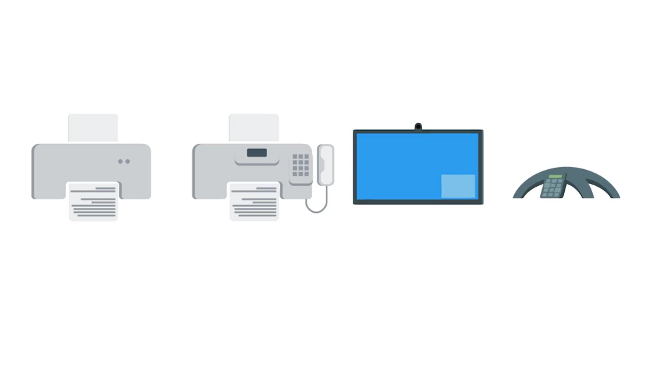

There are three common ways to authenticate. The first is anonymous, then simple, and the last is SASL, or simple authentication and security layer.

When using anonymous binding, you aren't actually authenticating at all, depending on how it's configured anyone could potentially access that directory, just like our public phone book example. When you use simple authentication you just need the directory entry name and password, this is usually sent in plain text, meaning it's not secure at all.

Another authentication method that's commonly used is SASL authentication. This method can employ the help of security protocols like TLS, which we've already learned about in Kerberos, which we'll discuss in a minute.

SASL authentication requires the client and the directory server to authenticate using some method. One of the most common methods for this authentication is using Kerberos. Kerberos is a network authentication protocol that is used to authenticate user identity, secure the transfer of user credentials, and more.

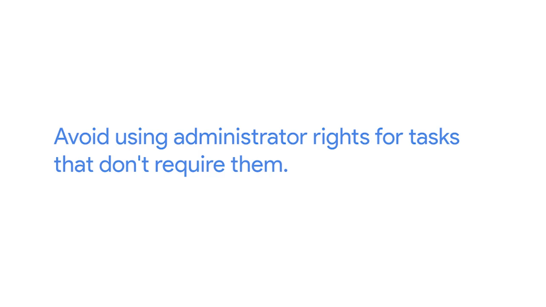

Kerberos by itself can be a complex topic that we'll revisit in the IT security course. If you want to learn more about Kerberos right now, you can check out at the supplemental reading right after this lesson.

Once the client has successfully authenticated with LDAP server or directory service, the user will be authorized to use whatever access levels they have. In the next few lessons we're going to dive deeper into two of the most popular directory services that use LDAP, Active Directory and OpenLDAP.

### Heather overcoming obstacles

The hardest part of my career has easily been joining Google. I joined in 2002 when the company was quite small, all men, for the most part. I was the only woman in the room most of the time. And the way I got through it was to find that thing that I wanted to be the expert at, find the thing I wanted to achieve. And to really focus on that every day, break it down into small pieces, celebrate your milestones when you hit them. And then in the end, I had achieved something that no one else on the team could have. They had all tried and I was the one who got it done. And so I get to reflect on that occasionally and think, I did that. Every time a packet passes between an end user's computer and Google, it crosses a barrier that I put in place for the first time. So I got more and more interesting projects, and people began to rely on me more, and it really helped me overcome the shyness, it helped me overcome my questioning of whether or not I belong here. Because I actually got to contribute, and in a meaningful way.

## Active directory

### What is active directory

Welcome back. In this lesson, we'll learn more about Active Directory, or AD, the native directory service for Microsoft Windows.

Active Directory has been used to centrally manage networks of computers since it was introduced with Windows Server 2000. If there are computers running Windows in your organization then AD probably plays a huge role. Active Directory works in a similar fashion to open LDAP. It actually knows how to speak the LDAP protocol and can interoperate with LINUX, OS X, and other non-Windows hosts using that protocol.

When you use Active Directory to manage a fleet of Windows servers and client machines, it does a lot more than just provide directory services and centralized authentication. It also becomes the central repository of group policy objects, or GPOs, which are ways to manage the configuration of Windows machines. We'll show you how to do this later in this lesson.

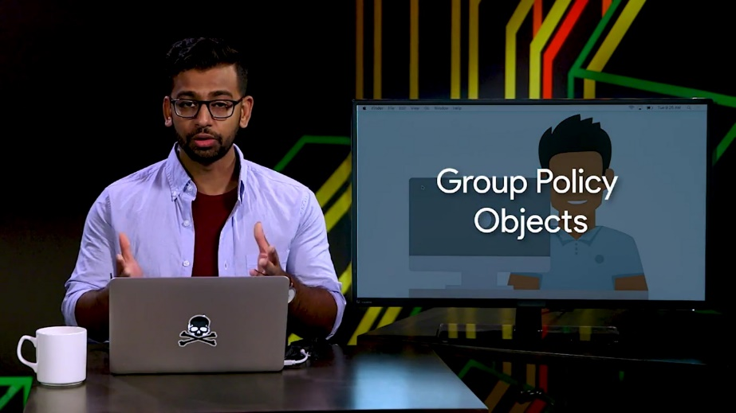

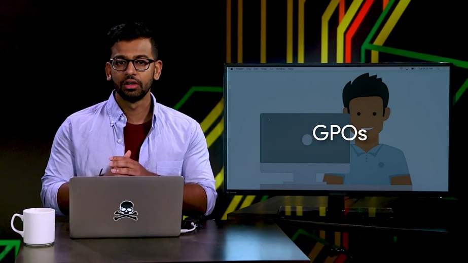

Now let's take a look at a typical Active Directory domain and see what it contains. Active Directory Administration relies on a whole suite of tools and utilities. We're going to use a tool called the Active Directory Administrative Center, or ADAC. ADAC is a tool that we'll use for lots of the everyday tasks that you'll learn in this course. It's great for getting work done, and for learning how things work behind the scenes, as you'll see.

Remember that, much like file systems, directory services are hierarchical. Everything that you see in Active Directory is an object. Some objects are containers, which can contain other objects. Several of the default containers are just called containers, and they serve as default locations for certain types of objects.

Another type of container is called an organizational unit, or OU, which we talked about in an earlier lesson. You can think of an OU like a folder or a directory for organizing objects within a centralized management system.

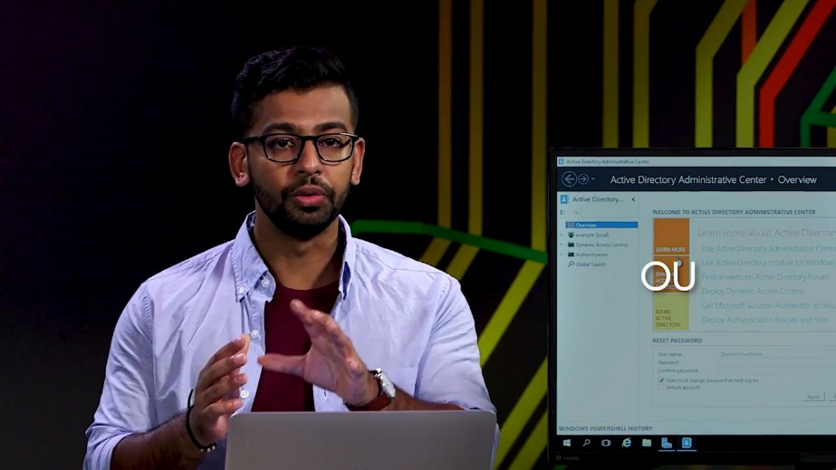

Ordinary containers can't contain other containers, but OUs can contain other OUs. That's a little confusing, so to show you the hierarchical structure of AD better, I've clicked this button of the left-hand pane to switch ADAC to tree view.

There are lots of things listed here. ADAC tells us what kind of object each of these are and gives us a description for some of them. We're not going to work with all of these, but we want to call out some parts of the directory that are more common to work with. The very first node in this tree is our domain. A domain will have a short name like example, and a DNS name like example.com. Objects, particularly computers in the domain, will be given a DNS name that lives in the domain's DNS zone.

There's actually one level of hierarchy above a domain that we don't see in this tool, and that's a Forest. If you look at the logical shape of a domain, it looks like a tree, so the name even makes sense. A forest contains one or more domains. Accounts can share resources between domains in the same forest.

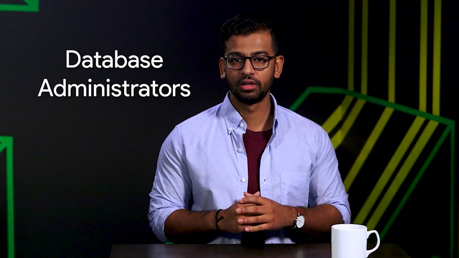

In our example environment, example.com is the only domain in the forest. The next example that we'll look at is computers. This container is where new AD computer accounts are created. So, if I go here, you can see my computers. Computer accounts are created when a computer is joined to the AD domain. The next thing that we'll look at is domain controllers. This container is where domain controllers are created by default.

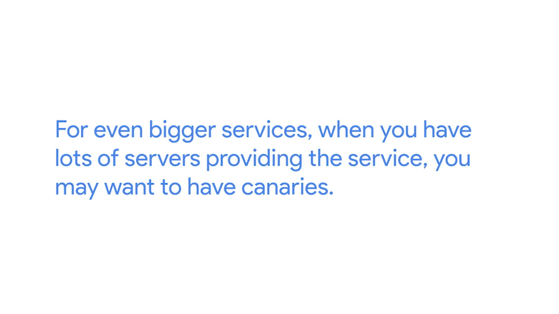

Next, we'll look at users. This container is where new AD users and groups are created by default.

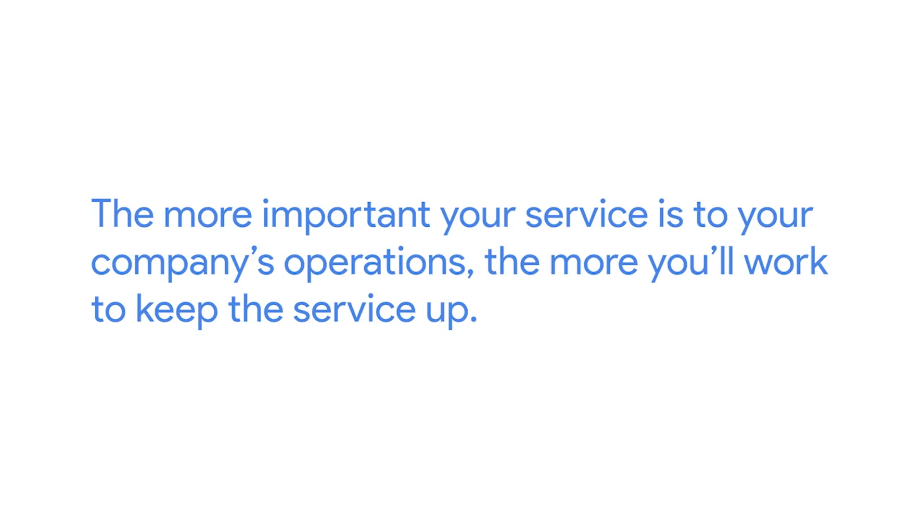

The service that hosts copies of the Active Directory database are called domain controllers, or DCs. Domain controllers provide several services on the network. They host a replica of the Active Directory database and group policy objects. DCs also serve as DNS servers to provide name resolution and service discovery to clients. They provide central authentication through a network security protocol called Kerberos. As I mentioned, we'll talk more about Kerberos in the IT security course.

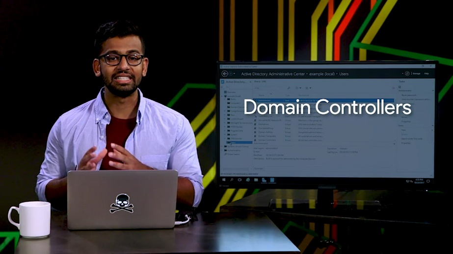

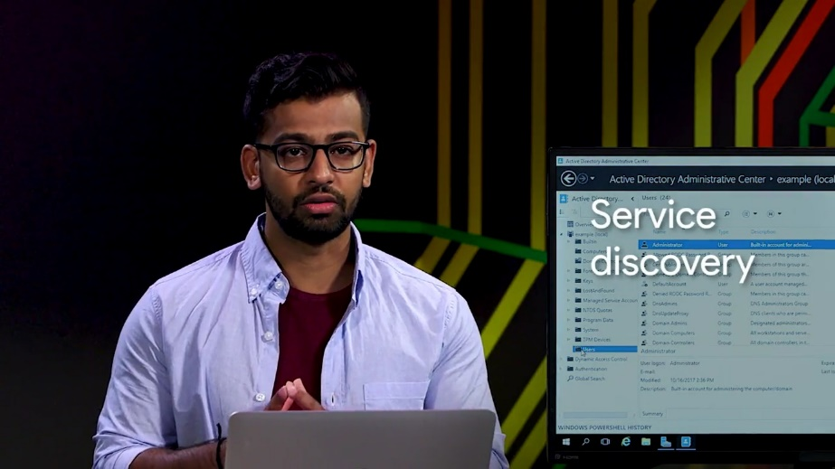

For now, what you should understand is that domain controllers get to decide when computers and users can log onto the domain. They also get to decide whether or not they have access to shared resources like file systems and printers.

This allows system administrators to make changes to the network really quickly and easily. If someone new joins the organization, sys admins can create a user account for them, and almost immediately every device in the network knows who that person is.

If someone changes jobs in the org or leaves, a sys admin can disable or delete their account, and within seconds, their access to devices adjust.

It's common for most domain controllers in the Active Directory network to be the read-write replicas. This means that each have a complete copy of the AD database and are able to make changes to it. Those changes are then replicated to all other copies of the data basis on other DCs. Replication is usually quick and the last change wins in almost all cases. This isn't perfect, but it works for most tasks.

Some changes to the AD database can only be safely made by one DC at a time. We task those changes to a single domain controller by granting it a flexible single-master operation, or also known as FSMO role. We won't go into depth here on the nitty gritty details around what each of these FSMO roles are responsible for and how they operate, but you can check out the next reading for more.

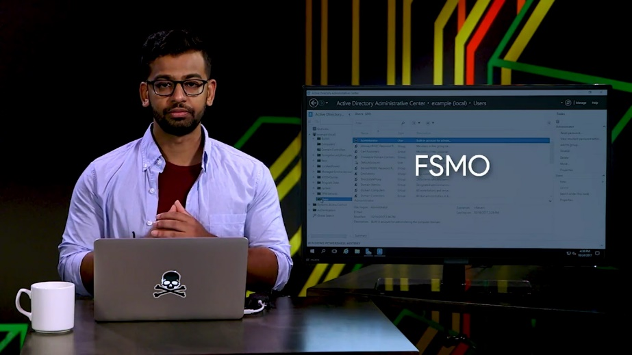

If your job will involve domain control and management, you'll need to understand how to assign FSMO roles and recover from DC failure. In order for computers to take advantage of the essential authentication services of AD, they have to be joined or bound to Active Directory. Joining a computer to Active Directory means two things.

The first is that AD knows about the computer and has provisioned a computer account for it. The second is that the computer knows about the Active Directory domain and authenticates with it. From that point forward, the computer can authenticate to Active Directory just as any user who log onto the computers are able too.

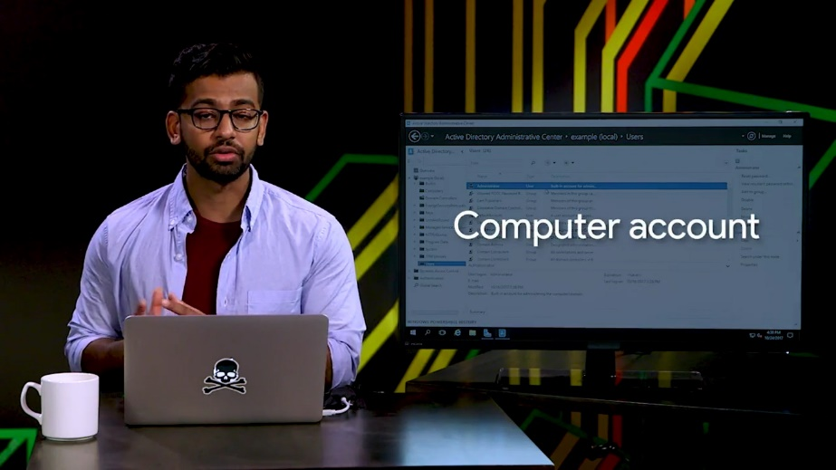

### Managing active directory

Managing Active Directory isn't just a big topic, it's a huge topic. There are system administrators who spend all their time just managing AD. We're going to spend some time showing you some of the most common tasks that a sysadmin would need to do in an Active Directory environment. When an Active Directory domain is first set up, it contains a default user account, administrator, and several default user groups. Let's do a rundown of the most important groups.

So, I want to first get into my Active Directory window. And as you can see, I'm an example.com. I'll run through the users. Domain admins are the administrators of the Active Directory domain. The Administrator account is the only member of this group in a new domain.

Remember, how a local administrator or root on a computer is able to make any changes they want to the operating system. Users in the Domain Admins group can make any changes they want to the domain.

Since a domain can control the configuration of all of the computers that are bound to it, domain admins can become local administrators of all of those machines too. This is a huge amount of power and responsibility. So, don't add accounts to this group lightly.

Enterprise Admins are administrators of the Active Directory domain. They also have a permission to make changes to the domain that affect other domains in multi-domain forest. The administrator account is the only member of this group in a new domain. Enterprise Admin accounts should only be needed on a very occasion like when Active Directory Forest is being upgraded to a new version.

Domain Users is a group that contains every user account in the domain. If you want to give access to a network resource to everyone in the domain, you don't need to grant access to every individual account. You can use to Domain Users. Each computer that's joined to the domain has an account too. So, we have a default group for them also.

Domain Computers contains all computers joined to the domain except domain controllers. Domain Controllers contains all domain controllers in the domain. I'm going to be able to do everything in this lesson because I'll be playing the role of a domain admin in my example organization.

As a systems administrator, or IT support specialist, you might also be a domain admin or enterprise admin because of the power they give you to make changes in Active Directory. You should never use a domain admin account as your day to day user account. It's too easy to make a mistake that affects the entire organization. Domain admin accounts should only be used when you deliberately making changes to Active Directory. Got it?

Your normal user account should be very much like other user accounts in the domain, where your permissions are restricted just to those resources that you need to have access to all the time. If there are some administrative tasks that you need to perform a lot as a part of your day to day job but you don't need to have broad access to make changes in AD, then delegation is for you.

Just like you can set NTFS DACLs to give accounts permission in the file system. You can set up ACLs on Active Directory objects. If you'd like to learn more about this, more advanced topic, check out the next reading. Let's start administering Active Directory. First up, we'll take a look at user account administration.

### Managing active directory users and groups

As we mentioned in an earlier, lesson a common sys admin task, is managing the lifecycle of user accounts. User accounts are important part of IT. They identify who you are, and they used to control what kind of access you have to IT resources in your organization. Poorly manage user accounts can prevent people from doing what they need to do, which can waste time and get really frustrating.

User accounts that have too much access or are no longer needed, create risks for the organization. All of this together, means are making sure that user accounts are created, maintained, and eventually deleted is one of the most important tasks, that a system administrator can have.

So, let's dig in. Let's create a user account for Kristi using the Active Directory Administrative Center and put it in the default user container. If we right-click on users, right here and then click on user, we get this dialogue to create a user. There's a whole bunch of stuff here. Do we really have to fill all of these in? Thankfully not. Only the fields that had a red asterisk next to them are required.

Let's go ahead and enter a full name and account name for Kristi. The full name is a person's real name, but what's user SamAccountName log on? That's a very long way of saying username. The security count manager or SAM, is a database in windows that stores user names and password. This is where SamAccountName comes from. So, let me go ahead and type in Kristi first.

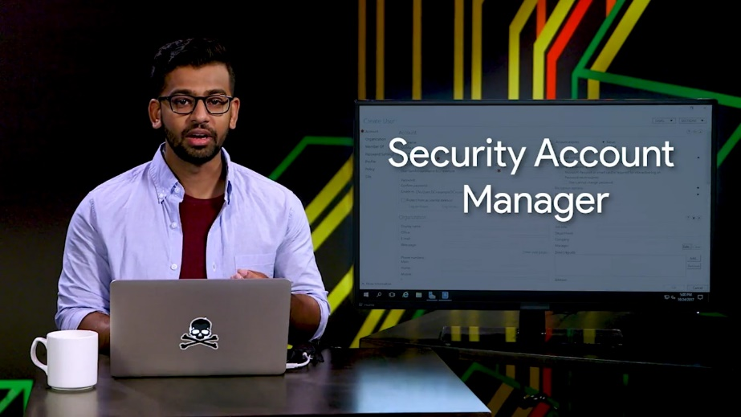

I'm going to type in her user account, we will also name her Kristi. You can see that the domain is going to be part of the accounts full name. Each user account has to have a unique username within the domain. We're just going to use Kristi's first name here.

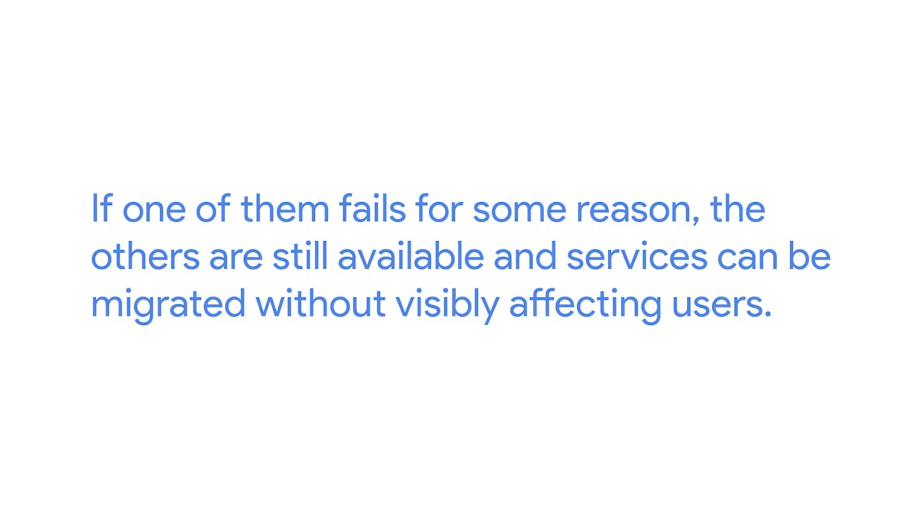

Now, let's set a password for the new user account. We don't want to know Kristi's password, so we're going to make sure the option user must change password at the next login is checked, and then choose a random password for her, like so. All right.

The AD Administrative Console, lets us create user accounts one at a time, but eventually, we're going to need to create a whole bunch of accounts at once. Imagine registration time at school or university, when hundreds or thousands of new user accounts will need to be created in just a few days. You wouldn't want to do that by clicking through ADAC forms. If you know how to create a user account in the command line interface, then you can learn how to write a script that will run those commands for you over and over again.

For now, we just want to be able to see the commands that we'll need to do what ADAC does for us. It turns out that everything that you do in ADAC, is actually done in PowerShell. Down at the bottom of the console is a Windows PowerShell history pane that we can expand to see the commands that are being run by ADAC. It looks like ADAC run a few commands, when we created Kristi's user account. You can take an example like this and generalize it to create a script, that can be used to repeat this process hundreds of thousands of times.

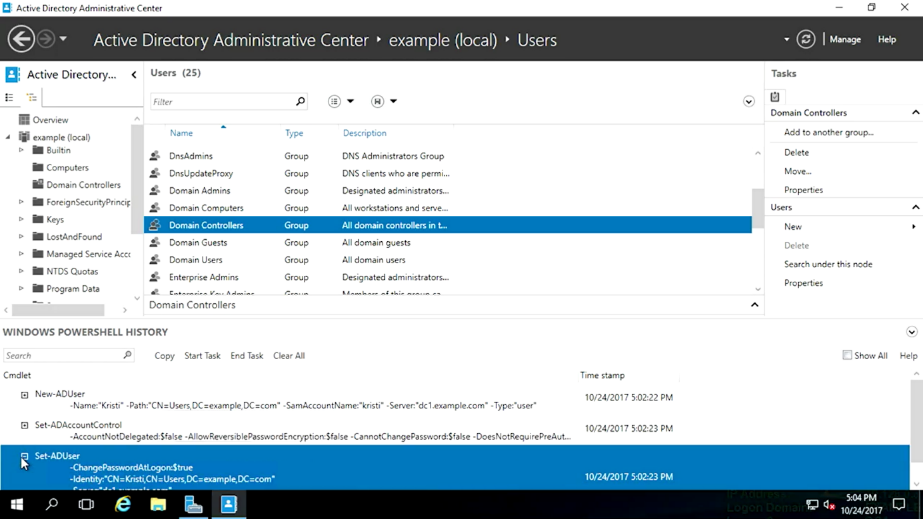

There's one other thing that I like to call out. When we need to describe the full path of an object in AD, we'll often use, ADAC notation. You can see that in several other parameters in this PowerShell history.

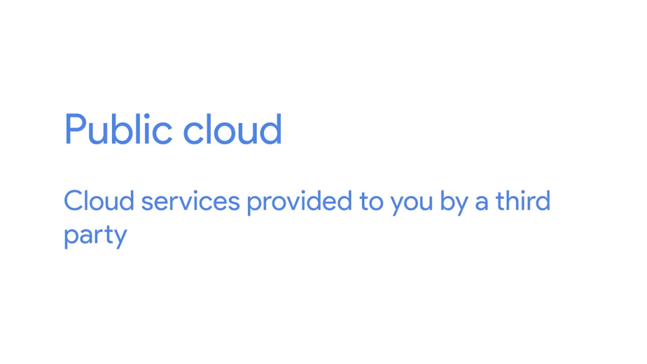

Okay. Next, let's look at active directory groups. Remember our early discussion about groups used to grant permissions to roles. Let's create a group based on Kristi's role, in this fictional org. Kristi is a researcher in the Active Directory Administrative Center, right-click on the user's container, and select new group. We're going to call this group researchers.

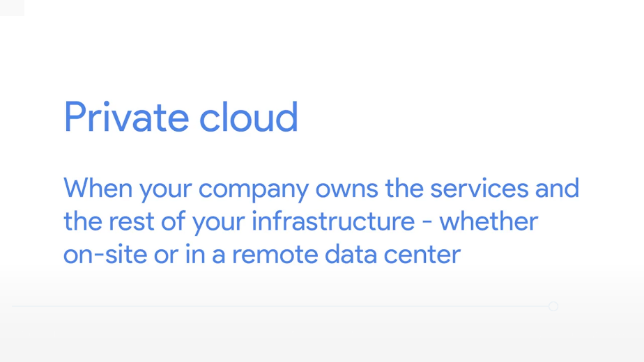

So, let's enter that into the group name field. See the same account name field again. It fills automatically when the name as we type it.

You can create a group with different full name and same account name, but it's usually not useful to do that. What is a good idea, is to provide a description of the group. That way, everyone understands what the group's for. We can also add an initial set of users from the screen, but we're going to save that for the next step.

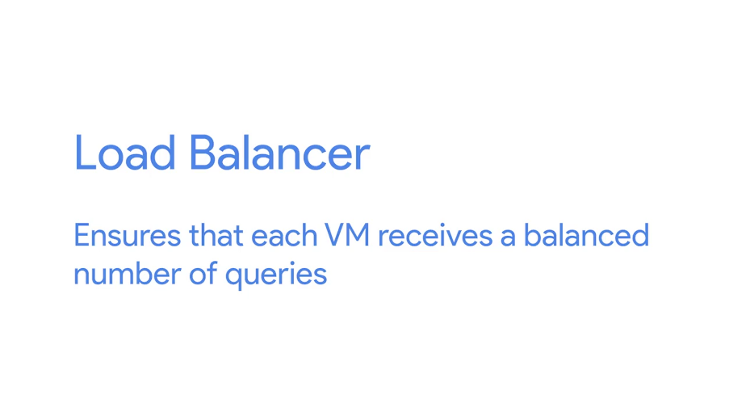

For now, let's click "Okay" and the group will be created. The group now shows up in ADAC, and the description is right there to remind us of what the group's used for. Excellent. Now, let's check ADAC's work and see how to do this in PowerShell.

So, I'm going to go ahead, and open PowerShell and paste my command. There it is.

You can see all of the settings, that we filled in fields for in the create group dialogue in ADAC, but what are group category and group scope? If you look back at the new group window, you'll see that there are two mandatory settings, that we just lapped as default, group type and group scope. So, what are they?

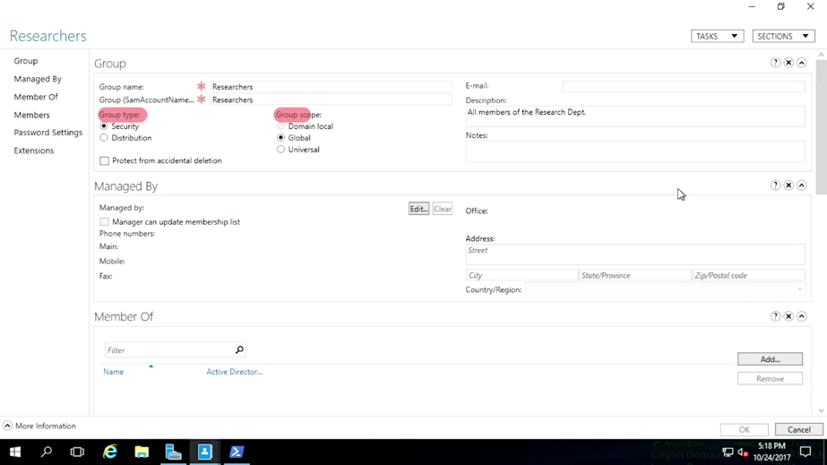

They are two categories of group in active directory. The most common one and the only one that we'll deal with in this module, is called a security group.

Security groups can contain user accounts, computer accounts or other security groups. The default groups, that we talked about before, like domain users and domain admins are security groups. They're used to grant or deny access to IT resources. Let's say you create a human resource group and then give that group access to a shared folder specifically for folks in human resources.

The other type of group is called a distribution group. A distribution group, is only designed to group accounts and contacts for email communication. You can't use distribution groups for assigning permission to resources. One reason you might use a distribution group and serve a security group, is to create an email list that included people from outside of your domain.

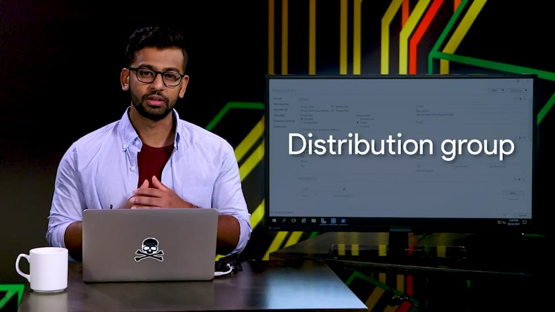

What about group scope? Group scope has to do with the way that group definitions are replicated across domains. Keeping a lot of large groups synchronized in very large network is a complicated problem. So, Active Directory gives us different types of groups to manage that complexity.

Most commonly, group scopes are used like this.

Domain local. This is used to assign permission to a resource. An example of this would be to create a domain local group, that has read access to a network share code, research share readers and another with right access code research share writers.

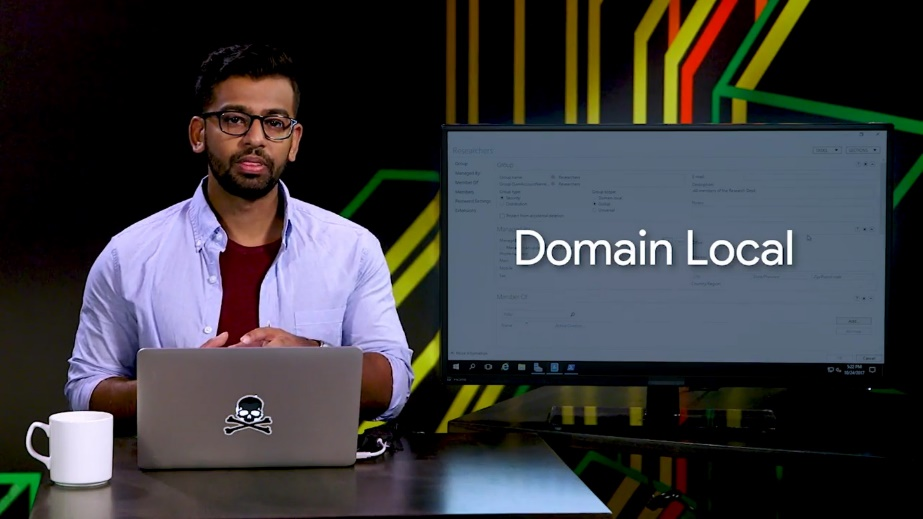

Global. This is used to group accounts into a role. Our example, researcher's group, is a global group. You could have other role-based groups like sales or management.

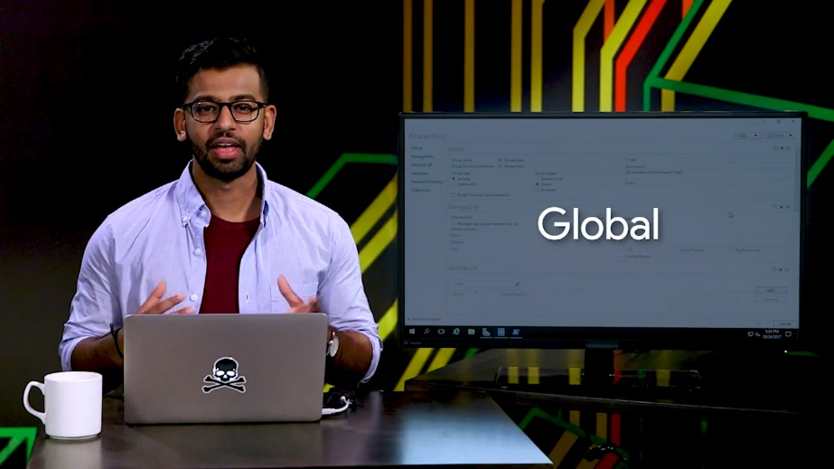

Universal. This is used to group global roles in a forest. Domain local and global groups aren't replicated outside of the domain that they're defined in, but universal groups are. In a multi-domain forest, you might have a global research share readers group in each domain, and all research shared readers universal group that contains each global group has members. Universal groups are replicated to all domains in a forest.

The details of AD group scope are a bit more complicated, than we have time to get into. So, check out the supplemental reading if you want to know more.

For now, we'll stick to creating domain local resource groups and global role groups. With domain local resource groups and global role groups, you can create very easy to understand group memberships. They very clearly describe what kind of access each role is supposed to have to each resource.

So, I can add matches to the research share reader group and researchers to the research share writers group. That's all very easy to understand. Now, if we add Kristi to our new researcher's group, she can write to the research shared folder. It's not because her user account was given direct access to the files there, but because she's a researcher.

All right. Let's add user accounts to our new researchers group. We can do this from the user account or from the group. Let's start from Kristi's user account. In the Active Directory Administrative Center, right-click on her account and select add to group. So, I'm going to do that right now. Now, in the enter the object names to select field, type researchers. So, let's do that right now, and then click "Okay". That's it.

What did ADAC do in the background? ADAC used a PowerShell command that takes an Active Directory security principle, like a user account or security group and added to its group membership. I've included a link to more info about security principles in the next reading.

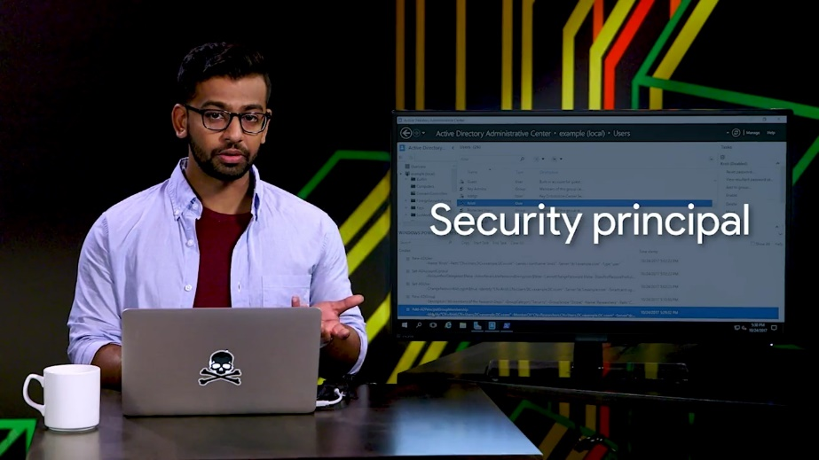

Now, what if we want to make changes from the group instead? Let me add myself to the researchers group and see how that works. I'll right click on the researcher's group and then click on properties. Okay. If I click on members, I can see that Kristi is a member of this group.

Now, if I click on this add button off to the right, it'll bring up a similar dialog windows you saw before. Now, I enter my account name and click "Okay". So, some administrator, okay. Just like we made changes from the group instead of the user, so did ADAC in PowerShell.

This time around, we used a PowerShell command to set or make changes to an existing AD group. We added my account to the researchers group.

Now, I'm not really a researcher in this org, so let's go ahead and remove my account using ADAC. This time of course, I use the remove button instead of the add button and we're done.

As you can see, the only thing that changed in the PowerShell command was a single parameter to remove instead of add a member. Most people in an organization have more than one role. In our fictional company, researchers are part of the research and development department. Some network resources will be shared with all of R and D, while some resources will only be made available to researchers. It makes sense for us to create a parent group for the R and D department.

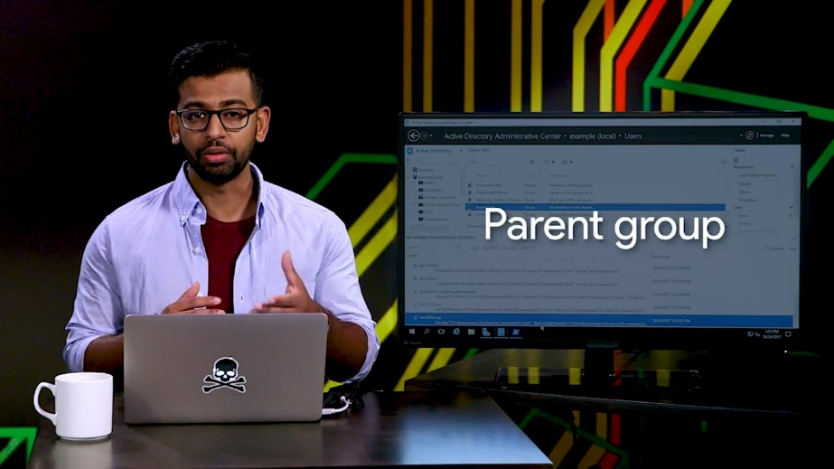

Let's create a global security group for this. What we're going to do is we're going to go ahead and right-click users, click new group and then we're going to go ahead and name our group named research and development. The description we're going to go ahead and write all of the members of the research and development group, and then we're going to hit "Okay".

Now, our researchers are part of the R and D department, in addition to being researchers. So, instead of adding each researcher independently to the research and development group, we can add the researchers group as a member. If I type research, like this and hit "Okay", I get a list of all of the users and groups that start with research.

Let's go ahead and select research and development to add the researchers group. What happened at the Windows PowerShell History?

Remember, user accounts and groups are both security principles. So, we use the same PowerShell command to change group membership here like we did before. So, we've created a user and added them to some new groups.

The next thing that you should know, is how to assist the people that you support with password management. We'll go over that and more in the next lesson.

### Managing active directory user passwords

One of the key advantages of central authentication is that it simplifies the management of passwords. Did you know that up to 25 percent of people forget their password at least once a day?

Helping users with password issues is a common task for an I.T support specialist. Once a user changes their password in active directory, that change is effective on every machine that they're permitted to log onto. With certain exceptions, AD doesn't store the user's password. Instead, it stores a one-way cryptographic hash of the password. You'll learn more about hashing in the I.T security course.

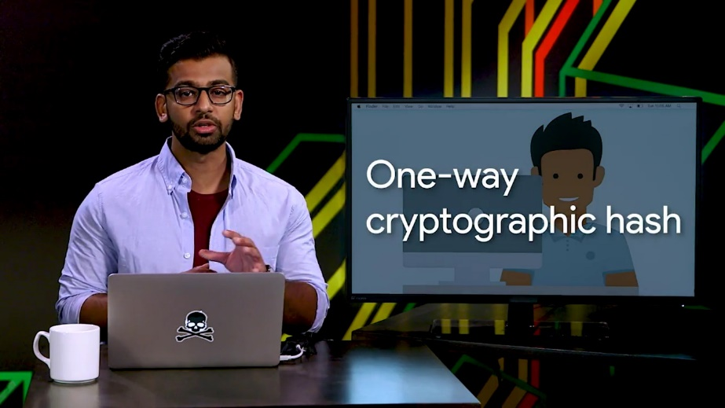

In the meantime, the basic idea is that passwords can be easily turned into a hash, but hashes can't be easily turned back into passwords. You can't look up a user's password even if you wanted to. That's actually a really good thing.

As a general rule, you should avoid ever knowing the password of another person's account. If there's more than one person who can authenticate using the same user name and password, then auditing becomes difficult or even impossible. To audit your infrastructure in this sense means to analyze who perform specific actions in your I.T infrastructure. In a security audit or troubleshooting scenario, it's important that only one person can authenticate with their account.

So, keeping that in mind, how can you assist with the account passwords? The most common issue is that a person forgets the password. When this happens, if you have SysAdmin responsibilities, you may be authorized to reset their password for them. This should only be done when you're absolutely sure that the person requesting the password reset is allowed to do so. Many organizations will have policies and procedures that require the request to be made in person, or that the person otherwise prove that they are who they say they are.

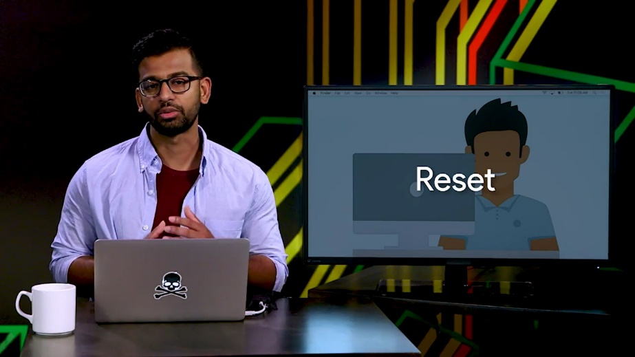

Once you know that the password reset is authorized, you've done the hard part. The rest is simple. So, let's imagine that Mateo reports that he can't sign into his account because he forgot his password. In the Active Directory administration center which I'll show you right here, we're going to right click on his user account. Lets find his user account first. And then right-click his account, and click reset password.

The password that we enter here will be temporary because we we're going to make sure that user must change password at next log in is checked. So I'm going to go ahead and create a temporary password.

And I want to make sure that the user must change the password at next log on option is checked, and then hit okay. Again, we don't want to know the user's password. So, I'm not going to ask Mateo for a temporary password. He might just tell me a variation of his usual password, and I don't want that.

Some orgs will have policies about how to generate and distribute temporary passwords. You want to make sure you know if those exist. We'll go over the details of strong passwords and having policies to enforce them in the upcoming I.T security course.

In this example, I'm just going to generate a random password and enter it here. Oh, what's this? User accounts can be locked by active directory if someone enters a wrong password for that account too many times. It seems that this is what's happened to Mateo. Once an account is locked, nobody can authenticate with the account until the account is unlocked by an administrator.

Active directory password policies control how many attempts are allowed before an account is locked out. We'll take a look at password policies here in a bit when we go over group policy objects or GPOs.

Back to the problem at hand. I want Mateo to be able to log in and change his password. So I'll make sure the option, unlock account is checked, and click okay. If you look at what is happening in PowerShell, you'll see some familiar commands along with a new one for unlocking Mateo's account.

When you change your password, you have to provide the current password as well as the new one. This is the sort of thing that happens when a user changes their own password. When you reset a password as an administrator, you only provide the new password and your administrative authorization overrides the existing password.

If this person has used the NTFS encrypting file system or EFS feature to encrypt files, they can lose access to those files if their password is reset. To learn more about this and how to prevent data loss, check out the next supplemental reading.

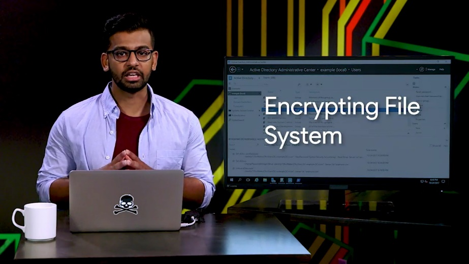

### Joining an active directory domain

If you have systems administrative responsibilities, you might be involved in joining machines to the Active Directory domain. Remember from our introduction to AD that computers can be joined or bound to Active Directory?

Joining the computer to Active Directory means two things: that AD knows about the computer and has provisioned a computer account for it, and that computer knows about the Active Directory domain and authenticates with it.

Over here, I'm logged in to a Windows computer that isn't joined to domain. This is called a workgroup computer.

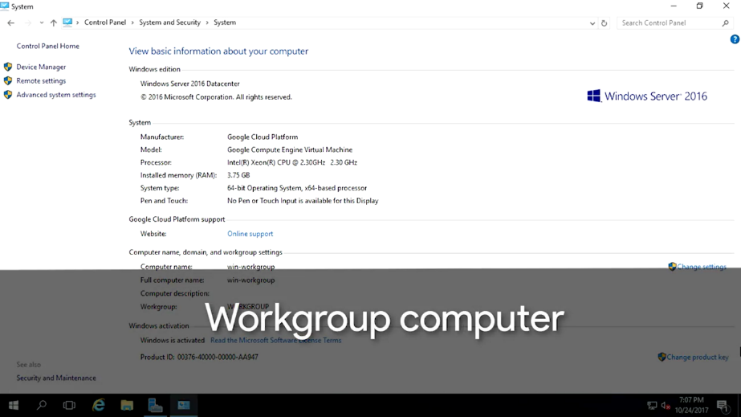

The name comes from Windows workgroups which are a collection of standalone computers that work together. Windows workgroups aren't centrally administered so they become harder and harder to manage as the size of the network grows. We want central administration and authentication in our network.

So let's join this computer to the domain. Let's look at the GUI for this first, then PowerShell. So we'll go ahead and click Computer, then System Properties. As you can see, this computer is under a workgroup. So what we need to do is we need to join this machine to the domain.

To do that, I'm going to go ahead and click Change settings, click on Change.

In the computer name and domain changes window, you can see the computer can either be a member of the domain or workgroup, but not both at the same time. So I'm going to go ahead and select the domain right here. And I'm going to go ahead and enter our domain name which is example.com. Now, when I click OK, this computer will reach out on the network to find the domain controller for my AD domain.

Once it finds a DC, I'll be asked for a username and password to authorize the computer to be joined to the domain. So I put in my domain admin, username, and password. Which I am going to do right now.

Voila, there you go. My machine is now joined to my domain. The Domain Controller creates a computer account in the domain for this computer, and this computer reconfigures itself to use AD authentication services. This will require a reboot, so let's jump over to the Active Directory administrative center to see what it looks like on that end. All right, so I'm at my Active Directory window and I'll go ahead and click Computers.

All right, there it is. I can see my computer in the computer's container. Now, my new computer will use this Active Directory domain for authentication and I can use group policy to manage this machine. We can join computers to the domain from PowerShell, too.

I've got this computer over here that also needs to be joined to the domain. So let's use the CLI this time. So I am going to go ahead and type in AD computer and domain name, example.com, and server, connect to dcl. That's nice and simple.

Now, I'm prompted for my credentials again, which I'm going to enter. And that's it.

By default, this command won't automatically reboot the machine to complete the domain join. If I add the restart parameter, the command will take care of that, too.

One final thing, over the years, there have been several versions of Active Directory. We refer to these versions as functional levels, and Active Directory domain has a functional level that describes the features that it supports. If you're interested in seeing some of these changes to Active Directory over time, take a look at the next reading on AD functional levels.

If you administer Active Directory, you'll need to know what your domain and forest functional levels are, and may some day need to upgrade your Active Directory forest or domains, or new features.

So, let's look at the properties on this domain. So this domain is at version 2016. We can also find this from PowerShell like this.

So, type in Get-AdForest, and then Get-AdDomain. See the forest mode and domain mode properties?

Now that you know what your domain's functional level is, you can find out what AD features it supports. Check out the supplemental reading for a whole lot of additional documentation and training materials if you want a deeper dive into AD administration.

### What is group policy

All right, now that we've joined all these computers to our domain, what are we going to do with them? In this lesson, we're going to talk about how to use Active Directory group policy to configure computers and the domain itself.

Like we mentioned before, directory services are databases that are used to store information about objects. The objects represent things in your network that you want to be able to reference or manage. One of these object types in AD is group policy object, or GPO.

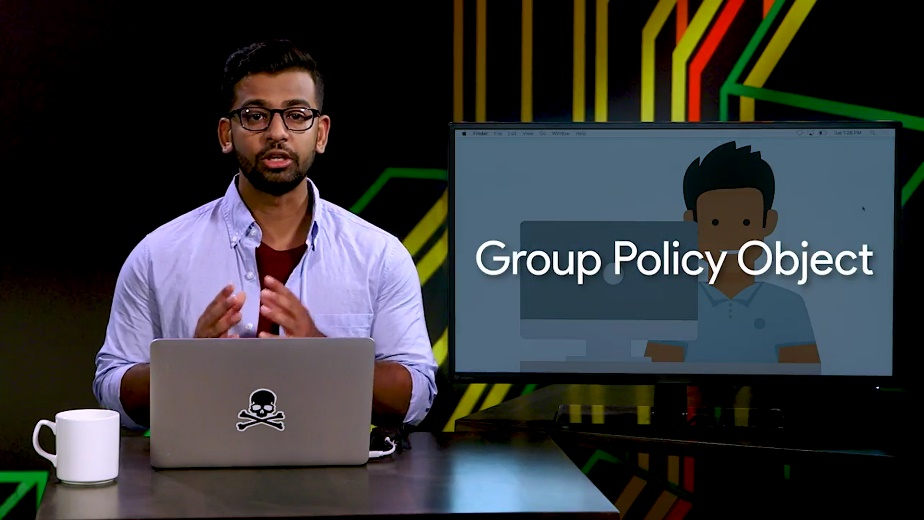

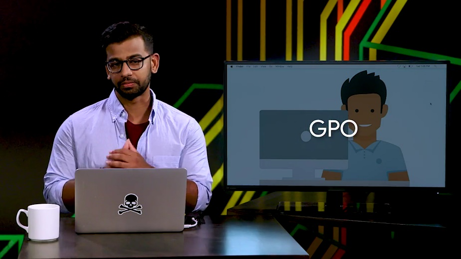

What's a GPO? It's a set of policies and preferences that can be applied to a group of objects in the directory.

GPOs contain settings for computers and user accounts. You may want different software preferences for the marketing team, the legal team, and the engineering team. Using group policy would help standardize the user preferences for each of these teams and help make it more manageable for you to configure. Using group policies you can create log in and log off Scrubs and apply them to users and computers.

You can configure the event log telling the computer what events should be logged and where the logs should be sent. You can say how many times someone can enter the wrong password before their account is locked. You can install software that you want to be available, and block software that you don't want to run. You heard the boss, and this is just the beginning. You can create as many group policy objects as you want.

But they don't do anything until they're linked to domain sites or OUs. When you link a GPO, all of the computers or users under that domain, site, or OU will have that policy applied.

You can use other tools like security filtering and WMI filters to make group policies apply more selectively. We'll get in to that a bit.

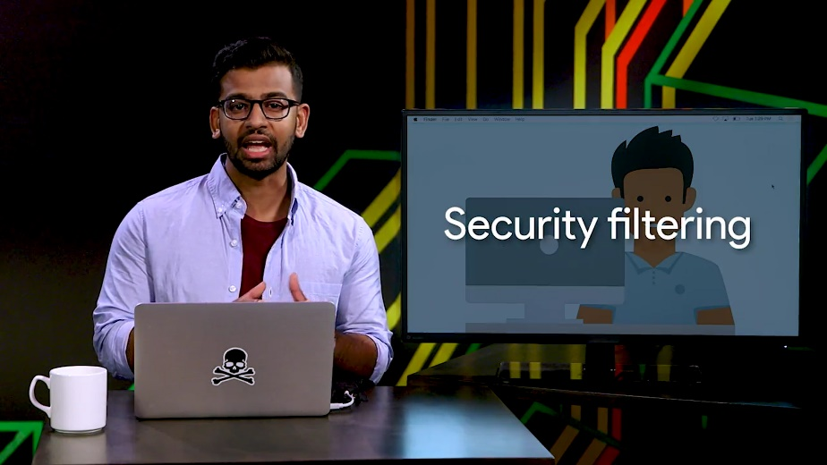

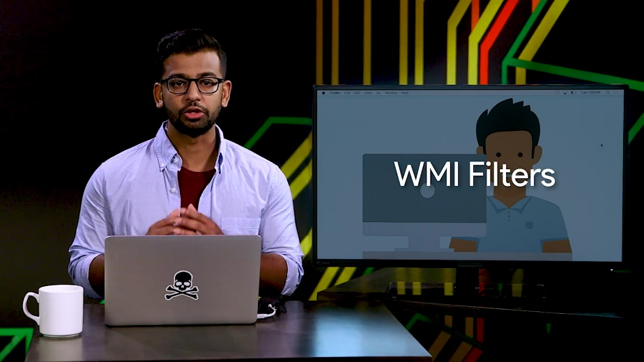

A Group Policy Object can contain Computer Configuration, User Configuration, or both. These are applied at different times.

Computer Configuration is applied when the computer signs into the Active Directory domain. This will happen each time the computer boots into windows, unless it's disconnected from the network at the time it's booted up.

User configuration is applied when a user account is logged onto the computer. In each case, once a GPO is in effect, it's checked and enforced every few minutes.

Remember when I said that GPOs contain pauses and preferences? What's the difference? Policies are settings that are reapplied every few minutes, and aren't meant to be changed even by the local administrators.

By default, policies in the GPO will be reapplied on the machine every 90 minutes. This ensures that computers on the network don't drift from the configuration that systems administrators define for them.

Group policy preferences, on the other hand, are settings that, in many cases, are meant to be a template for settings. System administrators will choose settings that should be the default on computers that apply the GPO.

But someone using the computer can change the settings from what's defined in the policy, and that change won't be overwritten. How do domain-joined computers actually get their GPOs? When a domain-joined computer or user signs into the domain by contacting a domain controller, that domain controller gives the computer a list of group policies that it should apply.

The computer then downloads those policies from a special folder called Sysvol, that's exported as a network share from every domain controller. This folder's replicated between all of the domain controllers and can also contain things like log in and log off scripts. Once the computer has downloaded it's GPOs, it applies them to the computer. We won't get into too much detail about the Sysvol folder, but I've included links to more information in the next reading.

Lastly, many policies and preferences in GPOs are represented as values in the Windows Registry. The Windows Registry is a hierarchical database of settings that Windows, and many Windows applications, use for storing configuration data.

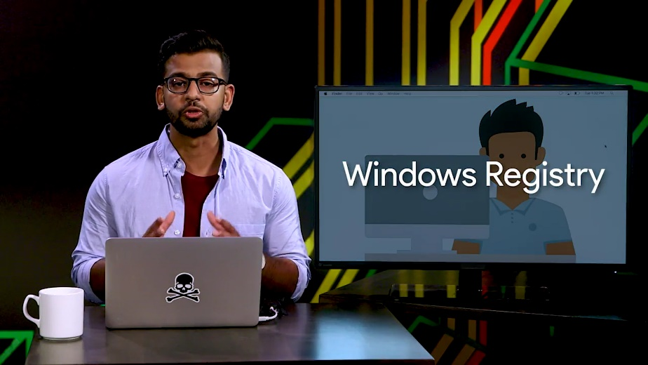

The GPO is applied by making changes to the registry. The Windows Operating System and Windows applications read the registry settings to determine what their behavior should be. You can read more about the Windows Registry in the supplemental reading. Group policy management is another huge topic. We'll only cover the basics of it in this course. Now that you understand a little bit about what group policy objects are, let's dig in and see how you use them to manage Active Directory and AD joined computers.

### Group policy creation and editing

The most important tool we'll use for creating and viewing group policy object is called the group policy management console or GPMC.

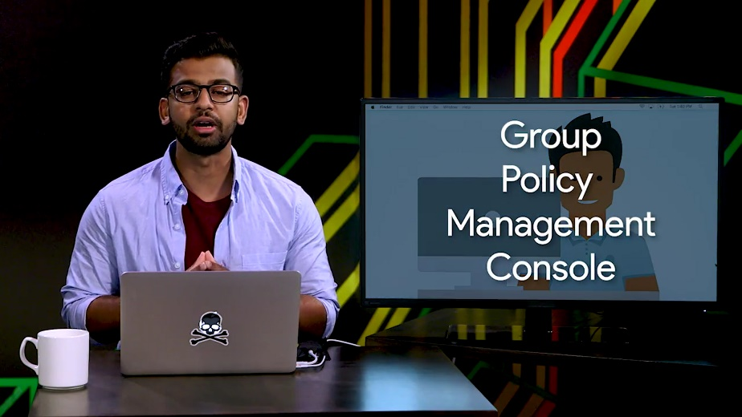

You can find this in the tools menu of server manager or by running GPMC.MSE from the command line. You can see that the layer of GPMC is similar to other management tools that we've used in Active Directory.

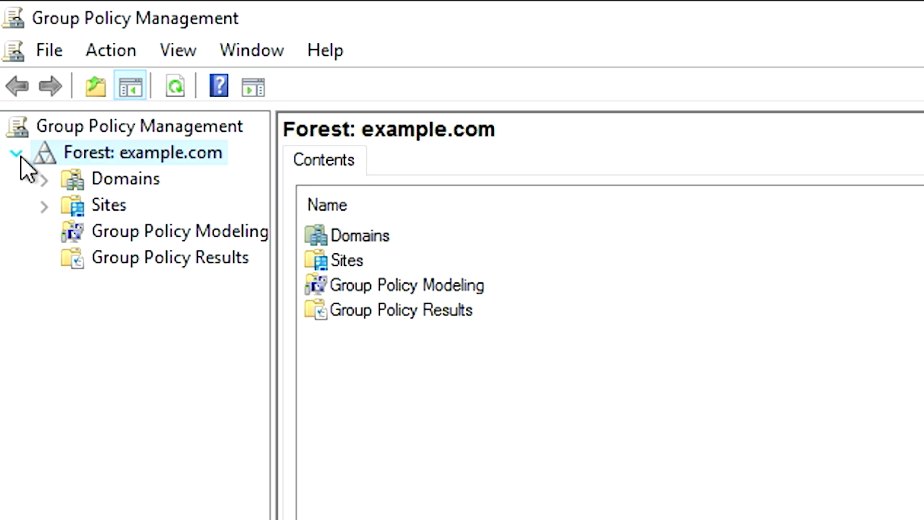

On the left, we see the structure of Active Directory. GPMC adds several containers to it's GUI. These aren't AD containers we all use. There are management interfaces that only show up in GPMC.

The group policy objects container will hold all of the GPOs that are defined in the domain.

The WMI Filters container is used to define powerful targeting rules for your GPOs. These filters use properties of Windows Management Instrumentation or WMI objects to decide whether or not a GPO should apply to a specific computer.

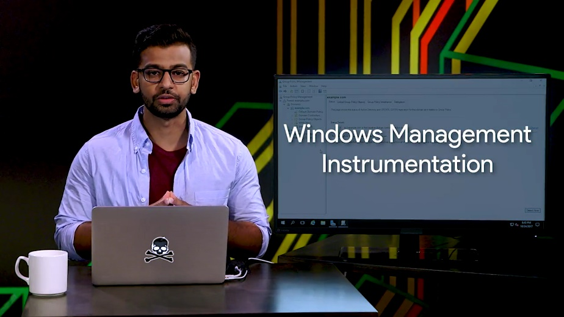

This is a more advanced topic, but if you want to dive a little deeper, check out the link in the supplemental reading. Group policy result is a troubleshooting tool that's used to figure out what group policies apply to computer and user in your network. You would use this tool to check on group policies that are already applied to a computer or user. On the flip side, group policy modeling is used to predict which group policies will apply to a computer or user in your network. You use this tool if you wanted to test a change to your GPOs or use or WMI Filters before making real changes in your Active Directory. We'll go into each of these in detail as the lesson goes on. You might have also noticed that there are a couple of things missing. Remember that the users and computer containers are not organizational units. Group policy objects can only be linked to domain, sites, and OUs. If computer and user objects are in the default containers they can only be targeted with GPOs that are linked to domains and sites. It's a good practice to organize your user and computer accounts in OUs so they can be targeted with a more specific group policies. Now, let's get started with group policy objects note in GPMC and take a quick look at a GPO that already exist. In a brand new Active Directory domain, they'll be two GPOs that are automatically created: the default domain controller policy and the default domain policy. The default domain policy is, as you might guess, a default GPO that is linked to the domain. It applies to all of the computers and users in the domain. The default domain control policy is linked to the domain control's OU and applies, you guessed it, to the domain controllers. What we're looking at here is a settings report for the default domain policy. This GPO is designed to enforce policy decisions that we want to make for the entire domain. For example, the minimum password length policy prevents users from setting passwords that are too short. The audit account log on events policy says that the computer should create a Windows event for each successful and failed log on attempt. There are thousands of settings that can be controlled with GPO, so it can take some research to find the right setting to change in a group policy object to make a change that you want. Group policy has been around through several versions of Windows, and sometimes things aren't exactly where you'd expect to find them. Don't despair. There are lots of documentation online about group policies and where to find specific settings. Pro tip, something that you might find super useful are the group policy settings reference that Microsoft releases with each new version of Windows. This reference is a spreadsheet that details the GPO policies and preferences that are available and where to find them. Next, let's try changing one of the settings in our default domain policy. Before we get started, I'm going to make a backup of the GPO. I'll right-click on the policy and choose backup. I've created GPO backup for my desktop, but in a real variant, we'd want to create a network for this lock down to only allow domain administrators to access it. I can add a description here too to help me remember why I made the backup. Then I complete the backup wizard and I'm done. Now, I know that if I make a mistake, I can restore the policy from backup. So I'll right-click on the policy again but this time, I'm choosing edit. This will open up the default domain policy into the group policy management editor. You can see over in the left-hand pane that the GPO is divided into two sections: computer configuration and user configuration. Each of these is divided into policies and preferences. Inside this tree of policies and preferences, as every individual GPO setting that GPMC knows about, whether it's been configured or not, every GPO has accessed the same settings that every other GPO has access to. There aren't special GPOs. Even so, it's a good practice to make different GPOs that each address a specific category of need. For example, you might have a GPO that handles all of the settings for a specific group of users or one that handles security policies for the whole domain. With specific GPOs for specific solutions, you can link your GPOs to only the computer or users that need that policy. Since you're working with the entire universe of group policy in every GPO, it can be very difficult to tell from the editor what settings are actually configured in this GPO. Refer back to the settings report in the GPMC for that information. It looks different, but you might notice that the settings report is laid out in the same hierarchical fashion as the GPO editor. I can see that the account lockout threshold is configured to zero, invalid log on times. Let's take a look at that policy in the GPO editor. I'm going to use a settings report as a road map to finding that policy in the editor. So let me show you how. I'm going to go ahead and right-click, Default Domain Policy, hit edit. And I will have this to the side so I can look at our road map. So as you can see, computer configurations, so I click computer configuration, then click policies, click Windows settings, want to click security settings, and then account policies because we're interested in the lockout policy. You can see that there are three policies under account lockout policy. The policy column tells us the name of the policy and the policy setting tells us the current configuration of the policy. If a policy is not defined, then this GPO won't make any changes to that setting on the computers that it's apply to. The policy name is pretty easy to understand, but I'm not sure that I understand all of the consequences of changing those values. If I double-click on any of these policies, it will open up the properties dialog for that policy. Oh, what's this? There's an explain tab here. Awesome. The explain tab will tell us what the policy configures. It may also tell us what to expect if the policy is not defined and what the default value of the policy is if it's enabled but not customized. So looking at the explanation of the account lockout threshold policy, I see that by having it set to zero, accounts will never be disabled for failed log-in attempts. That's not what I want in my domain, so I'm going to change this value. Oh, interesting. It looks like this policy has some dependencies on other policies. Okay. I'm going to accept these defaults, and now, I'll see that all three of these policies in the account lockout policy have been configured. So how do we save these changes? As soon as you hit apply or OK in a group policy management editor dialog, the changes made in the GPO immediately. Almost right away, computers can receive the update and start applying it. That might not be what you wanted. When you need to make changes to a production group policy, you should test them first. For example, I was playing around with the default domain policy which is linked to the whole domain. So I just immediately made it so all user accounts will be locked if they enter their password incorrectly once. Whoops. Where's the undo button? Guess what? There isn't one. Don't worry. This is why we made a backup before starting to work on this policy. Let's restore the policy from backup and undo this catastrophe waiting to happen. Back in the group policy management console, I'm going to right-click on default domain policy in the group policy objects and then select restore from backup. This wizard remembers the last place that I backed up a GPO, and it seems that's where I want to restore from. So intuitive. Now, it lists each of the GPO backups that are in the folder that we choose. The name of the policy and the time that it was backed up are listed here, along with any descriptions that we provided when we did the backup. If I click on view settings, it would launch my web browser with the settings report of the backup. Cool, right? Okay. I need to get this policy restored so my users don't get locked out of their accounts. The summary dialog shows me what I'm about to do, so let's go there. This all looks right. So I'm going to click finish and make sure that my policy has been restored. Perfect. My backup has been restored, and my mistake has been undone. As you've seen in this example, before making changes to a GPO, you should always back it up, but what's another way I could have prevented this mistake? That's right. I could have tested my changes. There are lots of ways to do this. I'll summarize some simple steps here and provide additional documentation in the supplemental reading. Some organizations will have established best practices for testing GPO changes in their environment. If that's the case, then you should follow those standards. You might need to follow a change management process too in order to notify others in the organization about the changes that you were about to make. What I'm going to show you is just one way of adding some safety to GPO changes. Let's say, I have a GPO code example policy. Good name, right? I want to make changes to example policy, but I want to test the changes first to make sure that I don't break production machines. First, I set up a testing OU that contains test machines or user accounts. If example policy is usually linked at example.com, finance, then computers, then I can create example.com, finance, computers, test, and put testing machines in the test OU. This lets the test machines keep all of the existing production GPOs but gives me a place to link a test GPO that'll overwrite production. Let me go and show you how I do that. So I click example, click new, click OU, and type in finance and click OK. Thinker another OU from my computers, and then underneath that, I'm going to go ahead and make a test OU so I can test my GPO, hit OK. Next, I make a copy of the GPO that I want to change and call it something like test example policy. Let me show you how I do that. So this is one policy that I have. I'm going to hit copy, go to my group policy objects, hit paste. Now, it say, "Use the default permission for the GPOs," because we want to make a copy, of course, and hit OK. As you can see, its called 'copy of master'. I'm going to rename this to test example policy, enter. Now, I can make the changes that I want to test in test example policy and link it to my test OU, and let me show you how I linked that. I'm going to go into my OU finance, computers, and then test, right-click test. And now, it'll say, "Link an existing GPO," which is going to be my test example policy right here and then hit OK. After I confirmed that my changes work the way that I expected, I can make a backup of the test policy then import the backup of test example policy to the production example policy. This makes some extra work for me since I'm a systems administrator, but I also benefit from added safety and peace of mind. By testing my changes on a copy of the GPO on test machines, I make it much harder to accidentally break production with machines. Your organization might be using advanced group policy management or AGPM, which is a set of add-on tools from Microsoft that give you some added provision control abilities in GPMC. If you do use AGPM in your organization, you should follow best practices for GPO version control using AGPM. I've included a link to those best practices in the next reading. We've edited the GPO and seen some ways to make editing GPO safe. Now, we need to know a bit more about how to understand all of the policies that are applied to a specific machine or user account. Next up, GPO inheritance and precedence. I'll see you there.

### Group policy inheritance and precedence

If you follow the practice of creating specific GPOs to address specific categories of needs, you can end up with a whole lot of policies linked at many levels of your Active Directory hierarchy. Group Policy Objects that control security settings are a really common place where this can happen. Systems administrators are responsible for protecting the security of the IT infrastructure. So, it's a good practice to create a very restrictive GPO that uses very secure conservative security policies and link that to the whole domain. This gives you a secure default policy but some users or computers may not be able to do what they need to with those very conservative policies in place. The finance department might need to use Excel macros that are disabled in your default security policy for example. So, we can create GPOs that relax some of the security settings or policies in the OUs that contain those computers or users. Another example might be that we have a Group Policy Object that standardize the desktop wallpaper of all computers. But we have computers that are public access kiosks that need to have a different wallpaper. In any of these cases, you can have computers or user accounts with multiple GPOs assigned to them that contradict one another by design. So, what happens when there are two or more contradictory Group Policy Objects that apply to the same compute? When computers processing the Group Policy Objects that apply to it, all of these policies will be applied in a specific order based on a set of precedents rules. GPOs are applied based on the containers that contain the computer and user account. GPOs that are linked to the least specific or largest container are applied first. GPOs that are linked to the most specific or smallest container are applied last. First, any GPOs linked at the AD site are applied then any link at the domain. And then any OUs in order from parent to child. If more than one policy tries to set the same policy or preferences, then the most specific policy wins. To see what I mean, let's look at this AD structure. As you can see my structure, I have multiple OUs. We have my IT OU, we have my sales OU, I also have my research OU. And I also have my sites in Australia, India, and North America. If you have a computer in the India site and the example.com sales computer OU then Active Directory would apply Group Policy Objects that are linked to the India site, the example.com domain, the sales OU, and the computers OU in that order. That's not all though. You can actually link multiple GPOs to the same container. How does AD decide which order to apply the GPOs in if there are more than one in a container? Each container has a link order for the GPOs that are linked to it. So, let's look at our sales OU. The sales OU in our example domain has a GPO for a network drive mapping and a GPO for configuring network printers. The link order of each policy determines which GPO takes precedence. The highest number is the lowest ranked GPO, so its settings are applied first. Network printers, sales is applied first and network drives, sales is applied last. If anything the network drive policy contradicts the network printer policy and the drives policy wins out. Let's summarize this so far. The highest numbered link order in the least specific container is applied first. And the lowest numbered link order in the most specific container is the last GPO applied. The last GPO to modify any specific setting wins. And the group policy management console, we can see the precedence rules in action. I'm going to switch to the computers OU in group policy management. I can see that there is a policy linked here called Computer Security Policy, I want to increase this. By switching from the link Group Policy Objects tab to the Group Policy Inheritance, like so, I can see that objects in this OU will actually have quite a few policies applied. The precedence column tells us which policy will win if there are conflicting settings, and the location column tells us where the policy was linked. You might have noticed that there are no site link policy listed here. That's because you can have computers from many different AD sites in the same OU. So, site based GPO links aren't represented in this summary. When you add all of the group policies together for a specific machine and apply precedence rules to them, we call that the Resultant Set of Policy or RSoP for that machine. When you're troubleshooting group policy, you often compare an RSoP report, pronounced "Haar sope" to what you expect to be applied to that computer. There are a lot of ways to get RSoP report. We will use the group policy management console for now and look at the other method when we start troubleshooting. Let's check on what Group Policy Objects will apply when one of our sales staff logs onto their computers or right click on the group policy results node in GPMC and select group policy result wizards. Let me go and do that. This wizard will walk me through generating a Resultant Set of Policy report for the computer and user my choice. The computer that I'm using to run this report will make a remote connection to that computer and ask it to run the report. The report would then be visible in my local GPMC. I'd like to see that RSoP when Emmett is logged into his computer which is EMMETPC01. Let me go and do that, so I'm going to hit next. I want to search for his computer. So, I hit another computer, hit browse and type in EMMETPC01 and hit okay. The group policy results in wizard it's super simple. First, I enter EMMETPC01 as a computer that I want to run the report on. By default, the wizard will only run an RSoP report for computer configuration. Since I want to see the user configuration for EMMET2, I will select display policy setting for him which is actually always selected by default. So, what we going to do is we going to hit next and it's going to take us to the summary of selections. And then we going to hit next and to generate the report, we hit Finish. I will hit close. You can only select users from this list who've already logged onto this computer in the past. That's it. I review my selection in the summary dialog then finish the wizard. I'm left with a new item under the Group Policy resultant node in GPMC and it contains a Resultant Set of Policy report that I just requested. Great. This RSoP report contains everything that we need to understand what policies apply to a computer or user. It includes a whole lot of detail about where the computer and user are located in AD, what their security group memberships are and more. I'm going to set that aside for the moment and focus on the setting sections of the report. Which I am going to scroll down to. This looks a lot like the information you see in the settings tab of a GPO but instead of only showing you the settings modified by a single GPO, you can see the combined effect of all of the applied GPOs. The winning GPO column tells you which GPO ultimately took precedence for each policy and preference. Amazing, right? Remember, I am making a remote request for my group policy management console to EMMETPC01 to run this report. There are a bunch of reasons that this could fail to work. EMMETPC01 may be powered off, it could be disconnected from the network or have firewalls that prevent me from running the report remotely. If I'm not a local administrator on the machine, I won't be able to run the report. In any of these cases, if I need that RSoP report for troubleshooting, I might have to run commands locally on Emmett's PC01. Will cover additional troubleshooting techniques in a future lesson.

### Group policy troubleshooting

As a systems administrator, or IT support specialist, you might be called on to troubleshoot issues related to Active Directory. Let's go through some of the most common troubleshooting tasks that you may encounter. This lesson will introduce you to tools that will help you troubleshoot these scenarios. Keep in mind, these are only examples. Since we're working with complex systems, there are lots and lots of ways for things to not work. Your greatest tool is to learn about these systems and understand how they function. Thoughtful troubleshooting and research are your friends. One of the most common issues you might encounter is when a user isn't able to log into their computer or isn't able to authenticate to the Active Directory domain. There are many reasons this might happen. They may have typed the password with caps lock button on. They may have locked themselves out of their computer, actually changed a system setting, or it could be a software bug. It's important to think about the steps to troubleshoot and remember to ask questions about what happened. Make sure to look at the exact conditions under which the failure occurs and any error message that accompany the failure. This should be enough information to get you started down the right path to troubleshoot. Let's just talk for a moment about the most common types of failures that can lead to a user account authentication issue. As we discussed in the earlier lesson, if a user enters a wrong password several times in a row, their account may be locked out. People sometimes just forget their passwords and need a systems administrator to sort things out. Make sure to review our earlier lesson on managing user and groups in Active Directory if you need a refresher on resetting user passwords. If a domain computer isn't able to locate a domain controller that it can use for authentication, then nothing that relies on Active Directory authentication will work. If you remember, from the customer support module in the first course, any time you troubleshoot an issue, start with the simplest solution first. This could be a network connectivity issue and nothing specific to Active Directory at all. If the computer isn't attached to a network that can route communications to the domain controller, then this must be fixed. You also learned about network troubleshooting techniques in an earlier module, so we won't repeat any of them here. Any networking issue that would prevent the computer from contacting the domain controller or its configured DNS servers, which is used to find domain controller, could be an issue. Now, why is DNS so important? In order for the computer to contact a domain controller, it needs to find one first. This is done using DNS records. The domain computer will make a DNS request for the SRV records matching the domain that it's been bound to. If a computer can't contact its DNS servers, or if those DNS servers don't have the SRV records that the computer is looking for, then it won't be able to find the domain controller. The SRV records that we're interested in are \_ldap.\_tcp.dc.\_msdcs.DOMAIN.NAME, where domain name is the DNS name of our domain. So I'm going to go ahead to my PowerShell, and I want to go ahead and type in Resolve-DNSName -Type SRV -Name \_ldap.\_tcp.dc.\_msdcs.example.com. That looks good. I should see an SRV record for each of my domain controllers. And I do. Perfect. Now, if I can't resolve the SRV records for my domain controllers, then my DNS servers may be misconfigured. How might they be misconfigured? Well, my domain computers need to use the DNS servers that host my active directory domain records. This will often be one or more of my domain controllers, but it can be a different domain server. Either way, the appropriate DNS servers to use for your domain computers should be known and documented. Compare the configuration of the machine to the known good configuration and see if it needs to be adjusted. On the flip side, if you're resolving some SRV records, but they appear to be incomplete or incorrect, then in-depth troubleshooting may be required. I've included a link to more information about this in the next reading. One more thing to call out. Depending on the configuration of your domain and your computers, it's common that local authentication will continue to work, for a little while least. Once someone logs into a domain computer, information required to authenticate that user is copied to the local machine. This means that after the first login, you'll be able to log in to the computer, even if the network is disconnected. You won't be authenticated to the domain or authorized access to any domain resources like shared folders. Just because someone is able to log in doesn't mean that they're able to find a domain controller. Another issue that can prevent users from authenticating has to do with the clock. Kerberos is the authentication protocol that AD uses, and it's sensitive to time differences. I'm not talking about local time zones here. I mean the relative UTC time. If the domain controller and computer don't agree on the UTC time, usually within five minutes, then the authentication attempt will fail. Domain computers usually synchronize their time with domain controllers with the Windows Time service, but this can sometimes fail. If the computer is disconnected from a domain network for too long, or if the time is changed by software or a local administrator to be too far out of sync, then the computer may not automatically re-sync with a domain controller. You can manually force a domain computer to re-sync by using the w32tm/rsync command. I've included links with more information about this in the next reading. Now, let's talk a bit about troubleshooting group policy issues. A common issue that you might have to troubleshoot is when a GPO-defined policy or a preference fails to apply to a computer. You might learn about this failure in a number of ways, like a person in your organization telling you that something on their computer is missing or not working. If you're using GPO to manage configuration on your machines, then maybe there will be a piece of software that should be present, or there may be a mapped network drive that's missing or a number of things. The common factor will be that something that you created a GPO to configure won't be configured on one or more computers. Let's look at the three most common reasons that this might happen. The first, and possibly most common type of GPO failure, has to do with the way group policies are applied. Depending on how your domain is configured, the group policy engine that applies policy settings to a local machine may sacrifice the immediate application of some types of policies in order to make logon faster. This is called Fast Logon Optimization, and it can mean that some GPO changes take much longer to be automatically applied than you might expect. Also, the group policy engine usually tries to make GPO application faster by only applying changes to a GPO instead of the whole GPO. In either of these examples, you can force all GPOs to be applied completely and immediately with gpupdate/force. If you want to be really thorough, you can run gpupdate/force/sync. Adding the /sync parameter will make you log off and reboot the computer. Some types of group policy can only run when the computer is first booted or when a user first logs on. So a log off and reboot is the only way to make sure that a forced updated GPO has a chance to apply all of the settings. Replication failure is another reason that a GPO might fail to apply as expected. Remember that when changes are made to Active Directory, those changes usually take place on a single domain controller. Those changes then have to be replicated out to other domain controllers. If replication fails, then different computers on your network can have different ideas about the state of directory objects, like group policy objects. The logon server environment variable will contain the name of the domain controller that the computer used to log on. Remember that you can see the contents of the variable with this command in PowerShell, which is \$env:LOGONSERVER. It shows me DC 1. You could also get the same results using command prompt which uses %LOGONSERVER%. Knowing which domain control you're connected to is useful information to have if you suspect a replication issue. From the group policy management console, we can check on the overall health of the group policy infrastructure. I'm going to select my domain and take a look at the status tab. This tab will summarize the Active Directory and assist all replication status for the domain. It may be showing result from a recent test so I'm going to force it to run a new analysis by clicking on Detect Now. What we want to see is that all of our domain controllers are listed under domain controllers with replication in sync. If they are, then we can be sure that there are no replication issues that will affect our group policy objects. If we do see any domain controllers in the domain controller with replication in progress list, then we may have a replication issue. Depending on the size and complexity of your Active Directory infrastructure and the reliability and throughput of the network links between your AD sites, it's possible for a replication to take a few minutes to complete. If replication doesn't complete in a reasonable amount of time, you may need to troubleshoot Active Directory replication. In the supplemental reading, you'll find a handy guide to help you through this more advanced topic. We've focused on the simplest cases for managing group policy. But the reality is that controlling the scope of a group policy object can get super complicated. Take a look at the supplemental reading to learn more about this topic, too. If you're trying to work out why a particular GPO isn't applying to a computer, the first thing to do is to run the resultant set of policy, or RSOP. You can use the group policy management console, like we did in an earlier lesson, or you can run a command on a computer directly to generate the report. The GP result command will help us out there. If I run gpresult /R, you can see that I get a summary report in my terminal. Let me go and show you that. So I'm switching to my PowerShell, gpresult /R. Report being created, and I get this report. If I want the full report, like I get from my GP MC, I can run gpresult /H FILENAME.html. I'm going to do gpresult /H and then test.html. This will give me a report that's an HTML web page that I can open in my browser, so let me go and get that. Okay, so with this report in hand, I want to look for some things. Is the GPO that I want to apply listed? Was it linked to an OU that contains a computer that I'm troubleshooting? Is the GPO that I care about listed under applied GPOs or under denied GPOs? If it was denied, what was denied reason? Did another GPO win for the policy or preference that I'm trying to configure? Each GPO can be configured with an actual called a security filter. Is the security filter set to something besides authenticated users? If so, then that may mean that you have to be in a specific group in order to read or apply the GPO. Each GPO can also be configured with the WMI filter. A WMI filter lets you apply GPO based on the configuration of the computer. WMI filters are powerful, but expensive, and easy to misconfigure. This is because they look at Windows management instrumentation values to decide if a policy should apply or not. For example, if you could create a GPO that installs a piece of software, but only if a WMI reports that a specific piece of hardware is present. These filters are expensive because they require the group policy engine to perform some sort of query or calculation on every computer that's linked to the policy, but then only apply the GPO to computers that match the filter. Many policies and preferences can be configured to apply to the computer or to users as they log on. Did you mean to configure a computer setting but accidentally configure a user setting, or the reverse? There's a really in-depth group policy troubleshooting guide in the supplemental reading that you should refer to if you get into a really tricky GPO troubleshooting session. We've really covered a lot out here. If you aren't clear on any of the concepts we've covered, that's okay. Just make sure to re-watch the lessons. Remember though, that the more you work with Active Directory and the group policy, the more familiar you become with them. If you use what you've learned about these systems combined with your research skills, you can troubleshoot just about anything.

## Openldap

### what is openldap

In the last lesson you dove headfirst into the popular directory service Active Directory. You learned how to add users, password, groups and even modify access level for groups, using group policies. Another popular directory service that's used today is the free and open source service OpenLDAP. OpenLDAP, which stands for lightweight directory access protocol operates very similar to Active Directory. Using LDAP notation or LDAP data interchange format, or LDIF, you can authenticate, add, remove users, groups, computers and so on in a directory service. OpenLDAP can be used on any operating system, including Linux, macOS, even Microsoft Windows. However, since Active Directory is Microsoft's propriety software for directory services, we recommend that you use that on Windows instead of OpenLDAP. But its helpful to know that OpenLDAP is open source so it can be used on a variety of platforms. There are a few ways you can interact with an OpenLDAP directory. First, you can use the command-line interface and passing commands to create and manage directory entries. You can also use a tool like phpLDAPadmin, which offers you a web interface that you can use to manage your directory data, much like the Windows Active Directory GUI that you're familiar with. You can read more about how to set up OpenLDAP and phpLDAPadmin in the next reading. In this lesson we'll give you a high level overview of the operations you can do in OpenLDAP via commands and how they work. To begin we'll just open the OpenLDAP package using this command. I'm going to get into my Linux environment and type up this command. Sudo apt-get install slapd ldap-utils. Put my password in and accept. Once you install the packages it'll prompt you enter in an administrative password for LDAP. So let's go ahead and do that. And then hit Ok. Then confirm your password, then hit Ok. Now that it's installed we're actually going to reconfigure the slapd package so that we can fine tune our setting. To do that we're going to run the following command. I'm going to clear my window, and then run sudo dpkg-reconfigure slapd. This is going to ask us a bunch of questions about our new setup. We won't answer all of these options, but you can learn more about them in, you've guessed it, the supplemental reading. For now let's just fill out the settings with these values. So the first option is Omit OpenLDAP server configuration? I'm going to go ahead and say No. Next, DNS domain name, is similar to Windows AD, this is our organization domain. Let's use example.com. And then hit Ok. Organization name, let's use example. Administrator password, let's do the same thing that we entered before. For the database let's use MBD. Do you want the database to be removed when slapd is purged? Let's go ahead and say No. Then it's asking us if we would like to move old database. We're going to say Yes for now. And then it'll say, Allow LDAP version 2 protocol? I'm going to say No. That's it, now you have a running OpenLDAP server. We're really cooking now. Let's keep going.

### Managing openldap

It's easy to manage OpenLDAP through a web browser and tool like phpLDAPadmin, but you can also use command line tools to achieve the same result. I'd recommend you look into setting up PHPLDAPadmin, if this is your first set up with open LDPA. For instructions about how to set up a PHPLDAPadmin, check out the supplementary readings. In this lesson, we're going to quickly run down a few other commands that will allow you to add, modify and remove entries in your directory. To begin using command line tools, you need to use something known as LDIF files, pronounced LDIF. We've already seen LDIF format or LDAP notation in action. It's just a text file that lists attributes and values that describe something. Here's a simple example of an LDIF file for a user. Even without understanding what the syntax of this file is saying, we can infer that it's talking about an employee named Cindy who works in the Engineering department at the company example.com. We've talked a little bit what the attributes are referring to in an earlier lesson. But you can refer to the supplemental reading if you want to know what the specific fields mean. For our purposes here, though, we just want to see a high level overview of how this works. Once you've written your LDIF files, you're practically done. Depending on what task you want to do to your directory, you'd run commands like these. Ldapadd, this takes the input of an LDIF file, and adds the context of the files. ldapmodify, as you can guess, this modifies an existing object. ldapdelete, this will remove the object that the LDIF file refers to. ldapsearch, this will search for entries in your directory database. It's not important to note the syntax of these commands, you can always look up a syntax on official documentation. But as you can see, it's not scary to work with OpenLDAP. It operates in a very similar way to Windows Active Directory, or AD. You can take this knowledge and populate your directory just like you did in Windows AD. If you're curious about the syntax of these commands, check out the supplemental reading on using LDIF files and LDAP commands. Again, if you're considering LDAP as your solution to your directory service needs, I'd recommend looking into the web manager tool PHPLDAP admin that we've included a link to in the next reading. Just like Windows AD, this topic can be pretty extensive. So think about which directory solution best fits the IT needs for your organization. There are lots of reasons why you might want to deploy the help of a directory service like OpenLDAP or Active Directory when working in a systems administration role. Directory services are great for centralized authentication, keeping track of where computers are in your organization, who can access them and more. Make sure to play around and familiarize with OpenLDAP or PHLDAP admin to get a better sense of how these directory services work. Checking out the official documentation is always a good place to start. By now, if you've learned about all the essential IT infrastructure services. The next topic we'll shift to is how to make sure all the hard work you've put in to your IT infrastructure doesn't go to waste by learning about disaster recovery and backups. Your hard work is really paying off, high five to that. Now take a moment to complete the quiz we put together for you, then we'll meet you back in the next video.
